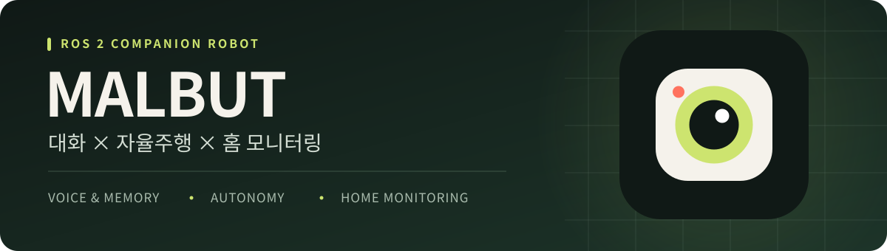
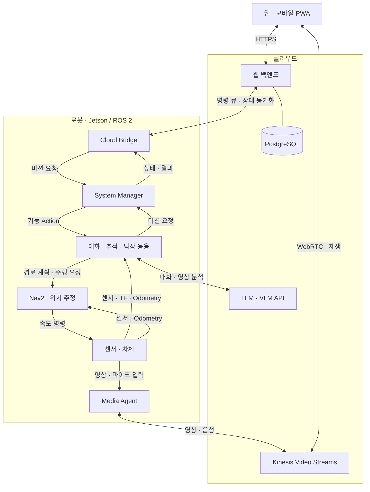
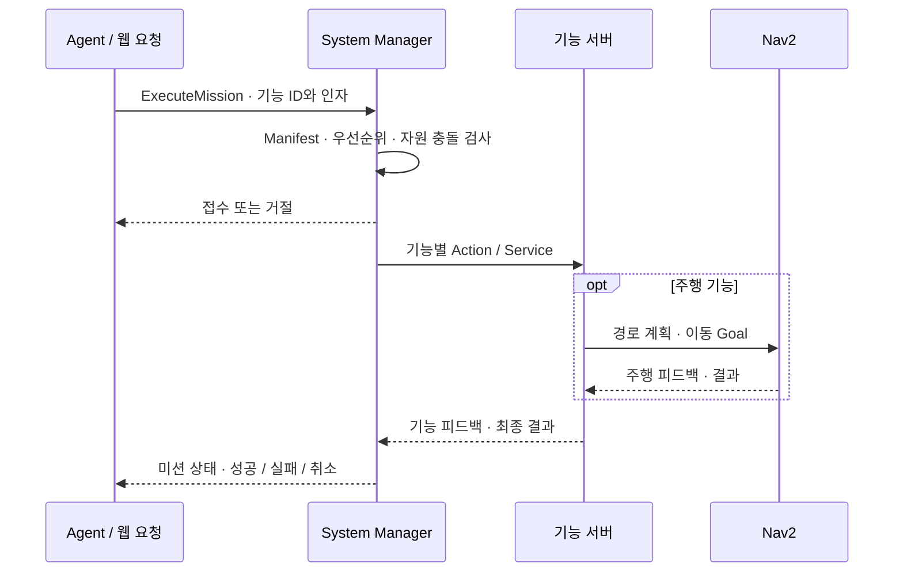
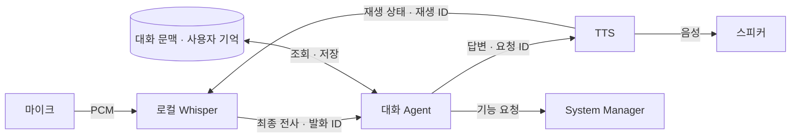
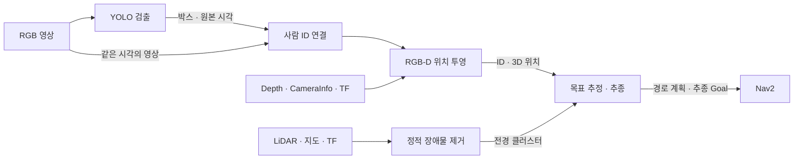
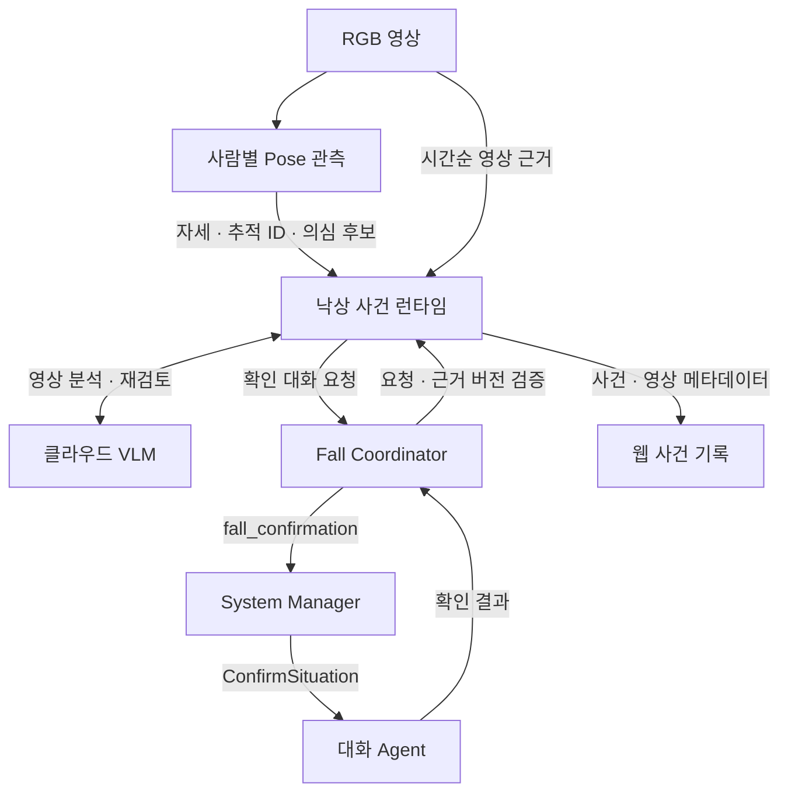
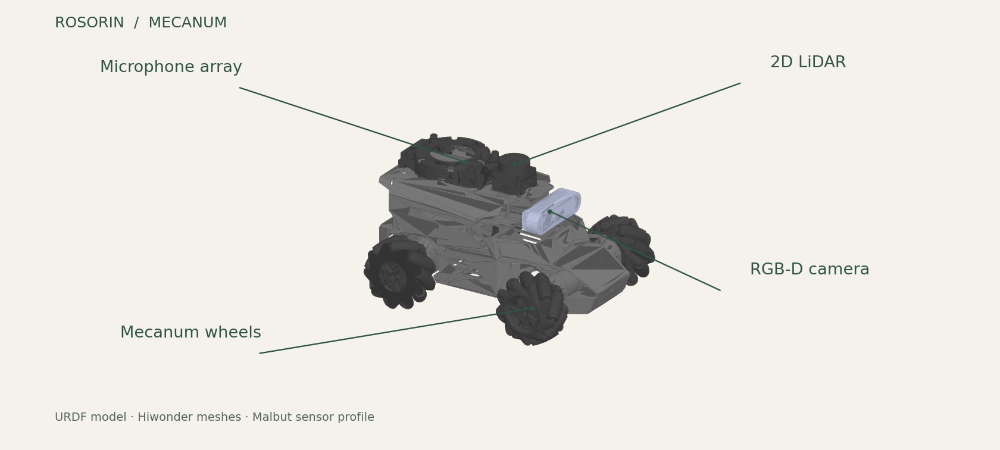

# 말벗 · MALBUT

**말을 나누고, 사람을 따라가고, 집 안을 살피는 ROS 2 기반 이동형 로봇.**

말벗은 음성 대화·사용자 기억, 센서 기반 사람 추적, 실내 자율주행,
낙상 의심 상황 확인과 원격 홈캠을 하나의 시스템으로 연결하는 프로젝트입니다.
로봇의 인식·주행은 Jetson과 ROS 2에서, 원격 조회·기록·제어는 웹과 AWS에서 처리합니다.

[기능](#말벗이-하는-일) · [시스템 구조](#전체-시스템) · [핵심 설계](#핵심-설계) · [로봇과 검증](#로봇과-검증) · [문서](#문서)

## 말벗이 하는 일

| 기능 | 프로젝트에서 다루는 내용 | 구현 영역 |
| --- | --- | --- |
| 음성 대화와 기억 | 호출어 인식, 한국어 전사, 문맥을 활용한 답변, 동의 기반 기억 조회·정정·삭제 | [STT](malbut_stt/README.md) · [Agent](malbut_agent_server/docs/malbut_agent.md) · [TTS](malbut_tts/README.md) |
| 사람 인식과 추적 | 영상의 사람 ID와 RGB-D 위치를 연결하고, LiDAR 관측을 보조로 사용해 선택한 사람을 따라가기 | [인식](malbut_yolo/README.md) · [ID 관리](malbut_reid/README.md) · [추적](malbut_tracking/README.md) |
| 실내 이동과 순찰 | 목적지 이동, 구역 순찰, 수동 조작을 공통 실행·취소 정책으로 처리 | [시스템 관리자](malbut_system_manager/README.md) · [순찰](malbut_autonomy/malbut_patrol/README.md) |
| 지도 작성과 위치 추정 | 미탐색 경계를 따라 탐색·저장하고, 저장 지도에서 AMCL로 로봇 위치 추정 | [AutoSLAM](malbut_autoslam/README.md) · [위치 보정](malbut_relocalization/README.md) |
| 낙상 의심 상황 확인 | 사람별 자세 관측, 영상 분석, 확인 대화와 사건 상태·기록 연결 | [낙상 런타임](malbut_agent_server/docs/fall/fall_runtime.md) · [코디네이터](malbut_fall_coordinator/README.md) |
| 원격 홈캠 | 실시간 영상·음성, 녹화·사건 조회, 로봇 지도와 기능 요청 | [미디어 에이전트](homecam_agent/README.md) · [웹](malbut_web/README.md) |

## 전체 시스템

음성·인식·주행 응용은 로봇 안에서 ROS 인터페이스로 연결됩니다.
웹의 요청은 인증된 장치 명령 큐와 로봇의 Cloud Bridge를 거쳐 전달되고,
영상·음성 전송은 별도의 미디어 경로를 사용합니다.



이 그림의 상자는 역할 단위입니다. 응용 전체를 하나의 노드나 프로세스에 넣는 구조는 아닙니다.
로봇의 제어 연결은 Cloud Bridge가, 카메라 스트리밍은 Media Agent가 담당합니다.

## 핵심 설계

### 1. 대화와 행동을 연결하되, 실행 책임은 분리

Agent는 발화와 문맥을 해석해 대화 답변 또는 등록된 기능 요청을 만듭니다.
System Manager는 Capability Manifest의 입력·우선순위·사용 자원을 검사하고,
해당 기능의 ROS Action 또는 Service에 요청을 전달합니다.
주행 기능은 다시 Nav2에 경로 계획과 이동을 맡깁니다.



차체 이동은 `BASE`, 음성 출력은 `SPEAKER` 자원으로 관리합니다.
자원이 겹치는 요청에만 선점 규칙을 적용하고, 이전 작업의 실제 종료를 확인한 뒤 다음 작업을 실행합니다.
센서 Topic을 함께 구독하는 것은 독점 자원 사용으로 취급하지 않습니다.

| 요청 예시 | 우선순위 | 독점 자원 |
| --- | --- | --- |
| 낙상 확인 대화 | `URGENT` | `BASE`, `SPEAKER` |
| 수동 조작 | `HIGH` | `BASE` |
| 사람 추적 · 목적지 이동 · 지도 작성 | `NORMAL` | `BASE` |
| 순찰 | `LOW` | `BASE` |

웹의 명령 접수 완료와 로봇 미션의 실행 완료는 별도 상태로 관리합니다.
공통 진입점은 `/malbut/mission/execute`, 상태 출력은 `/malbut/state`입니다.
실제 기능 등록은 [Capability Manifest](malbut_interfaces/capabilities)에 있습니다.

### 2. 음성 입출력과 기억의 수명을 구분



- 호출어와 발화 전사는 로컬 Whisper로 처리하고, 최종 전사만 Agent에 전달합니다.
- 발화·요청·재생 ID로 인식 결과, 답변과 실제 재생 상태를 연결합니다. 답변 준비·재생 중의 입력 처리도 이 상태를 기준으로 합니다.
- 최근 대화 원문, 이전 대화 요약, 사용자별 장기기억을 구분합니다. 기억은 동의와 정정·삭제 정책을 함께 관리합니다.
- 기본 대화·TTS는 OpenAI 연결을 사용합니다. 로컬 전사와 외부 API로 전달되는 텍스트는 서로 다른 데이터 경계입니다.

상세 계약은 [Agent 명세](malbut_agent_server/docs/malbut_agent.md),
[STT 명세](malbut_stt/docs/stt_agent.md), [TTS 명세](malbut_tts/docs/tts_agent.md)에 정리되어 있습니다.

### 3. 사람 ID, 관측 시각과 실제 위치를 함께 추적



검출·ID 연결·위치 투영은 공용 인식 계층이고, 사람 선택과 추종은 `FollowPerson` Action이 담당합니다.
비동기 추론 뒤에도 원본 촬영 시각을 유지해 대응하는 RGB·Depth와 TF를 사용합니다.
LiDAR 전경 관측은 카메라가 확인한 대상을 짧은 가림 구간에서 이어 추적하는 보조 정보입니다.

추종기는 선택한 사람의 위치와 희망 거리를 바탕으로 주행을 요청하고,
경로 계획·제어·장애물 처리는 Nav2를 사용합니다. 검출과 ID 관리의 수명은 추종 미션의 시작·취소와 분리되어 있습니다.

원본 Re-ID는 OSNet 외형 특징을 지원합니다. **현재 실기기 적용본은 외형 인코더를 끄고
박스·이동 기반 ID 연결을 사용하는 실험 설정**이므로, 원본과 실기기 설정을 구분해야 합니다.
사람 ID는 관측 트랙의 식별자이지 가족 계정이나 영구 신원 인증 정보가 아닙니다.

### 4. 낙상 관측, 영상 판정과 확인 대화를 분리



Pose는 사람별 자세 관측과 의심 후보를 만들고, 사건 런타임은 영상 근거와 분석 결과를 관리합니다.
확인 대화가 필요하면 코디네이터가 기존 관리자·Agent 경로를 이용합니다.
낙상 전용 대화 엔진이나 별도의 주행 관리자를 만들지 않습니다.

확인 미션은 `BASE`와 `SPEAKER`를 함께 확보하며, 실행 ID·요청 ID·근거 버전으로
이전 실행이나 오래된 판정이 현재 사건에 적용되지 않게 합니다.
카메라 사용, 낙상 모니터링과 클라우드 분석 동의는 각각 적용 상태를 관리합니다.

이 기능은 의심 상황을 관측·검토·기록하는 파이프라인입니다.
모델 평가와 실제 환경 검증은 [낙상 평가 정리](homecam_agent/docs/FALL_EVALUATION_SUMMARY.md)에 별도로 기록합니다.

### 5. 공통 기반은 유지하고, 기능의 실행 수명은 따로 관리

`robot.launch.py`는 하드웨어·Nav2·관리자 등 공통 기반을 구성하고,
`tracking`, `autoslam`, `patrol`, `speech`, `fall`, `homecam` 등의 launch는 각 기능을 구성합니다.
통합 Bringup은 이 독립 launch들을 연결합니다. **launch의 수명과 기능 Goal의 수명은 다릅니다.**

지도 생성에는 SLAM Toolbox, 저장 지도 위치 추정에는 AMCL을 사용합니다.
AutoSLAM은 미탐색 경계를 탐색하며 주행은 Nav2에 맡기고 지도를 저장합니다.
통합 로봇 구성에서는 AutoSLAM 요청으로 SLAM을 시작하고, 종료 시 SLAM을 정리합니다.

| 지도 상태 | 현재 구성의 역할 |
| --- | --- |
| 저장 지도 선택 전 | 모든 셀이 미확인인 기본 지도를 기존 map_server·AMCL 경로에 넣어 구성 유지 |
| 자동 지도 작성 중 | SLAM Toolbox로 관측을 누적하고 AutoSLAM이 탐색·저장 수행 |
| 저장 지도 선택 후 | 실제 지도를 불러오고 AMCL·위치 보정으로 위치 추정 |

기본 지도는 실제 집의 형상이나 절대 위치 정보를 가진 지도가 아닙니다.
기능별 지도 조건과 위치 추정 전환은 [Bringup 구현](malbut_bringup/README.md)과
[위치 추정 모듈](malbut_system_manager/malbut_system_manager/localization.py)을 기준으로 합니다.

## 로봇과 검증



*저장소의 URDF와 공식 메시로 만든 모델 그림입니다. 실기기 사진이 아니며, 센서 배치는 프로젝트의 기준 프로필을 따릅니다.*

### 실기기와 시뮬레이션

| 영역 | 구성 |
| --- | --- |
| 로봇 기준 프로필 | ROSOrin Ultimate 메카넘 차체 · Jetson Orin NX Super 8GB |
| 입력 | Aurora930 Pro RGB-D · 2D LiDAR · Odometry / TF · 마이크 |
| 로봇 소프트웨어 | Ubuntu 22.04 · ROS 2 Humble · Python / C++ · Nav2 · SLAM Toolbox |
| 인식·음성 | YOLO · Re-ID · ONNX Runtime · Whisper / whisper.cpp · LLM / TTS API |
| 웹·클라우드 | Next.js / React PWA · PostgreSQL · AWS ECS / ALB / RDS / KVS |
| 시뮬레이션 | Gazebo Fortress · ROS 브리지 · 실내 월드 · 사람 추적 시나리오 |

메카넘 차체는 전후진·횡이동·제자리 회전을 지원합니다.
RGB-D는 사람의 영상 위치와 깊이를, LiDAR는 주변 장애물과 지도 작성용 스캔을,
Odometry·TF는 서로 다른 센서 관측을 로봇·지도 좌표계에 연결하는 기준을 제공합니다.
로봇 형상은 Hiwonder 공식 메시를 사용하고, Gazebo Fortress의 동역학·센서 연결을 별도로 구성합니다.
기준 프로필과 출처는 [로봇 설정](malbut_description/config/rosorin_ultimate_mecanum.yaml),
[메시 출처](malbut_description/meshes/SOURCE.md)에 있습니다.

실기기와 시뮬레이션은 응용 계층의 ROS 인터페이스를 공유하며,
드라이버·센서 Topic 배선·시계 설정은 실행 환경에서 맞춥니다.
시뮬레이터의 실제 사람·로봇 위치는 **평가기에서만** 사용하고, 인식·추적 입력으로 전달하지 않습니다.

### 검증과 관측

| 검증 층 | 확인하는 내용 |
| --- | --- |
| 계약·단위 검사 | 메시지·Manifest, 요청 중복, 취소·선점, 대화·기억 정책, 사건 상태, 인증·권한 |
| ROS 통합 검사 | 격리된 Action·Service 서버로 실행·피드백·결과와 취소 완료 확인 |
| 시뮬레이션 벤치마크 | 사람 추적 거리·상태·위치 오차·충돌·처리 지연 기록 |
| 실기기 관측 | 시스템·프로세스 자원, Topic 주기, Action 상태와 STT / TTS 이벤트 기록 |

실기기 관측은 응용 기능과 분리된 수집기·로컬 로그 뷰어로 구성합니다.
미지원 센서·GPU 항목은 측정값처럼 채우지 않습니다.
세부 구현은 [추적 벤치마크](malbut_tracking/malbut_tracking/benchmark),
[자원 측정](malbut_test/malbut_resource_monitor/README.md), [CI 구성](.github/CI_TESTS.md)에 있습니다.

## 프로젝트 구성

```text
malbut/
├── malbut_interfaces/        공용 메시지 · 서비스 · 액션 · Capability Manifest
├── malbut_system_manager/    미션 실행 · 자원 중재 · 상태 · 위치 추정 전환
├── malbut_bringup/           공통 기반과 기능별 launch · Nav2 설정 · Cloud Bridge
├── malbut_agent_server/      대화 · 기억 · 실행 요청 · 낙상 사건 런타임
├── malbut_stt/               호출어 · 음성 수집 · 로컬 전사
├── malbut_tts/               음성 합성 · 재생 · 재생 상태
├── malbut_yolo/              공용 객체 검출
├── malbut_reid/              사람 ID 연결 · 외형 특징
├── malbut_tracking/          RGB-D 위치 · LiDAR 전경 · 사람 추종
├── malbut_autoslam/          자동 탐색 · 지도 저장
├── malbut_relocalization/    저장 지도에서 위치 보정
├── malbut_autonomy/          순찰 · 자율 순회
├── malbut_fall_coordinator/  낙상 확인 대화 연결 · 사건/요청 버전 검증
├── homecam_agent/            미디어 전송 · 사람별 Pose · 낙상 후보
├── malbut_web/               웹 · 장치 API · 데이터 모델 · AWS 인프라
├── malbut_description/       로봇 형상 · 센서 프로필
├── malbut_gazebo/            시뮬레이션 · 월드 · ROS 브리지
├── malbut_scenarios/         통합 시나리오
└── malbut_test/              실기기 적용본 · 독립 자원 측정 도구
```

`malbut_test`는 실기기 배포를 위한 적용본입니다. 원본 패키지의 테스트 디렉터리가 아니며,
실기기용 측정 연결과 실험 설정 차이를 포함합니다.

## 문서

| 읽고 싶은 내용 | 문서 |
| --- | --- |
| 설치·빌드·시뮬레이션 실행 | [개발·시뮬레이션 가이드](docs/DEVELOPMENT.md) |
| 실기기 구성·실행 | [Bringup 설계](malbut_bringup/README.md) · [운영 가이드](malbut_bringup/README_OPERATIONS.md) · [실기기 적용본](malbut_test/README.md) |
| ROS 기능 인터페이스 | [공용 인터페이스](malbut_interfaces/README.md) · [기능 등록](malbut_interfaces/capabilities) |
| 대화와 사용자 기억 | [Agent 명세](malbut_agent_server/docs/malbut_agent.md) · [대화·기억 구현](malbut_agent_server/README.md) |
| 사람 위치와 추적 정책 | [추적 설계](malbut_tracking/README.md) |
| 낙상 사건과 확인 대화 | [사건 런타임](malbut_agent_server/docs/fall/fall_runtime.md) · [코디네이터](malbut_fall_coordinator/README.md) |
| 스트리밍·웹·배포 | [미디어 에이전트](homecam_agent/README.md) · [웹·클라우드](malbut_web/README.md) |
| 실기기 측정과 로그 시각화 | [자원 측정 도구](malbut_test/malbut_resource_monitor/README.md) |

## 라이선스와 출처

Malbut Contributors가 작성한 코드는 [Apache License 2.0](LICENSE)으로 배포합니다.
Hiwonder 로봇 자료, AWS Small House 에셋, YOLO ROS 등 제3자 자료는 각자의 조건을 따릅니다.
적용 범위와 원본 출처는 [THIRD_PARTY_NOTICES.md](THIRD_PARTY_NOTICES.md)에 기록되어 있습니다.
