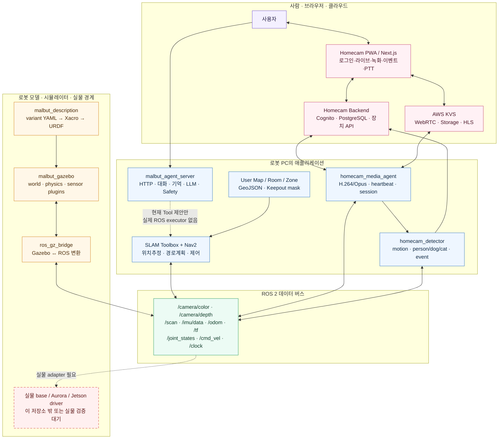
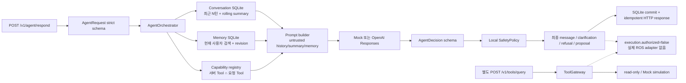

# MALBUT 한 페이지 전체 구조 맵

> **한 문장:** Malbut은 로봇 설계·Gazebo/실물 센서가 ROS 2 데이터를 만들고,
> Nav2가 이동을 담당하며, Homecam이 영상을 웹으로 보내고, LLM Agent는 현재
> 안전한 대화와 **Tool 제안까지만** 담당하는 이동형 홈캠 로봇 시스템이다.

[브라우저용 한 장 포스터 열기](MALBUT_ONE_PAGE_SYSTEM_MAP.html)

> C4·DFD·Deployment·ROS Graph·ERD로 나눈 정식 표현은
> [MALBUT Architecture Atlas](architecture/README.md)에서 볼 수 있다.

## 1. 전체 층 구조



### 이 그림에서 가장 중요한 사실

1. **로봇을 실제로 움직이는 주체는 LLM이 아니라 Nav2/주행 계층**이다.
2. **홈캠과 LLM Agent는 현재 서로 독립된 서브시스템**이다.
3. Agent의 `navigate`, `capture_photo` 등은 지금은 제안이며, ROS 실행기로
   이어지는 선은 아직 끊겨 있다.
4. `malbut_description`은 설계도, `malbut_gazebo`는 설계도에 물리·센서 기능을
   붙이는 디지털 트윈이다.

## 2. 네 개의 실제 흐름으로 읽기

| 노선 | 시작 → 끝 | 실제 흐름 | 현재 상태 |
|---|---|---|---|
| **① 보라색 영상 노선** | 카메라 → 사용자 | Gazebo/Aurora → ROS Image → Media Agent → KVS → PWA | 코드 구현. KVS 활성 빌드·실물 장시간 E2E는 조건부 |
| **② 초록색 이동 노선** | 목표 → 바퀴 | RViz/Nav2 Goal → Planner → MPPI Controller → `/cmd_vel` → Gazebo 바퀴 | 시뮬레이션 구현 |
| **③ 주황색 지도 노선** | LiDAR → 주행 규칙 | `/scan`+TF → SLAM → map → Room/Zone 편집 → mask → Nav2 | 구현 |
| **④ 파란색 대화 노선** | 발화 → 안전한 결정 | HTTP → Schema → Context → LLM → AgentDecision → Safety → 응답/Tool 제안 | 대화 구현, 물리 실행 미연결 |

```text
① VIDEO  Camera ─→ ROS Image ─→ H.264/Opus ─→ AWS KVS ─→ Web/PWA
                         └─────→ motion/YOLO ─→ Event API ─→ 알림

② MOVE   Nav2 Goal ─→ Planner ─→ Controller ─→ /cmd_vel ─→ Gazebo wheels
             ↑                 /scan · /odom · /tf feedback ───────┘

③ MAP    LiDAR+TF ─→ SLAM ─→ map.yaml/pgm ─→ Room/Zone ─→ cost mask ─→ Nav2

④ AGENT  Utterance ─→ Context ─→ LLM ─→ Decision ─→ Safety ─→ Proposal
                                                                  ╳ ROS
```

## 3. 패키지 소유권 지도

| 패키지/서비스 | 책임 | 가장 먼저 볼 파일 |
|---|---|---|
| `malbut_description` | 크기·질량·링크·조인트·센서 위치 | [`rosorin.xacro`](../malbut_description/urdf/rosorin.xacro), [`rosorin_model.xacro`](../malbut_description/urdf/rosorin_model.xacro) |
| `malbut_gazebo` | Gazebo, bridge, SLAM, Nav2, 지도/Zone | [`simulation.launch.py`](../malbut_gazebo/launch/simulation.launch.py), [`bridge.yaml`](../malbut_gazebo/config/bridge.yaml) |
| `homecam_media_agent` | 영상/음성 인코딩, 장치 health, KVS 세션 | [`media_agent_node.cpp`](../homecam_agent/homecam_media_agent/src/media_agent_node.cpp) |
| `homecam_detector` | motion/YOLO, 정지 확인, 이벤트 전송 | [`detector_node.py`](../homecam_agent/homecam_detector/homecam_detector/detector_node.py) |
| `malbut_agent_server` | HTTP 대화, 컨텍스트, Provider, Safety, Tool 제안 | [`orchestrator.py`](../malbut_agent_server/malbut_agent_server/orchestrator.py), [`continuous_voice.py`](../malbut_agent_server/malbut_agent_server/continuous_voice.py), [`room_mission.py`](../malbut_agent_server/malbut_agent_server/room_mission.py), [`README.md`](../malbut_agent_server/README.md) |
| 별도 `homecam_web` | PWA, 인증, DB, 장치 API, KVS broker | 별도 Node.js/AWS 저장소 |
| `malbut_vision` | OpenCV/LAB 학습 도구 | 로컬 실험 패키지이며 현재 제품 파이프라인 아님 |

## 4. Agent Server 내부 확대



- 등록 Tool: `navigate`, `monitor_room`, `detect_pet`, `capture_photo`,
  `send_notification`, `get_robot_status`
  ([`tools.py`](../malbut_agent_server/malbut_agent_server/tools.py)).
- WAV·짧은 push-to-talk용 one-shot 로컬 STT는 선택형 CLI로 구현됐다. 다만
  주입형 wake/STT/output을 연결하는 연속 상태 기계는 오프라인에서만
  구현됐고, 실제 wake detector·TTS·화자 인식·ROS 음성 bridge는 없다.
- `monitor_room`은 닫힌 문법으로 고수준 제안만 만든다. semantic
  Room의 명시적 goal·coverage viewpoint를 검증하는 process-local
  시뮬레이션과 verifier-issued confirmation 계약은 있지만 기본 monitorable
  Room은 비어 있다. durable authorization·Nav2·Homecam·KVS adapter는 아직
  GAP이다.
- 장기기억 변경과 감정표현 코어는 구현됐지만 공개 CRUD와 frontend/ROS
  renderer에는 아직 연결되지 않았다.
- `/respond`의 Tool 제안과 `/tools/query`는 자동으로 이어지지 않으며,
  production registry에는 실제 ROS adapter가 없다.
- Castform 같은 학습 플랫폼은 **LLM Provider 앞의 학습/평가 가지**에 붙고,
  SafetyPolicy와 ROS 실행 경계를 대체하지 않는다.

## 5. 공부 순서

```text
1 설계도      rosorin.xacro → rosorin_model.xacro → components/*
2 시뮬레이션  robot.gazebo.xacro → gazebo_plugins.xacro → bridge.yaml
3 이동        /scan,/odom,/tf → SLAM/Nav2 → /cmd_vel
4 지도        map → User Map → Room/Zone → Nav2 mask
5 홈캠        camera topic → media/detector → backend/KVS → PWA
6 LLM         request → context → provider → decision → safety → proposal
7 통합 경계   proposal → offline trusted confirmation/simulation (구현)
             → durable ledger/trusted ROS state/real adapter (미구현)
```

### 상태 범례

- **구현:** 현재 코드 경로와 테스트가 존재한다.
- **조건부:** SDK·모델·운영 환경이 있을 때만 동작하거나 실물 E2E가 남았다.
- **미연결:** 계약/코어는 있어도 다른 서브시스템으로 이어지는 실제 adapter가 없다.
- **외부:** AWS, 웹 서비스, 실물 driver처럼 ROS 저장소 바깥에서 소유한다.
