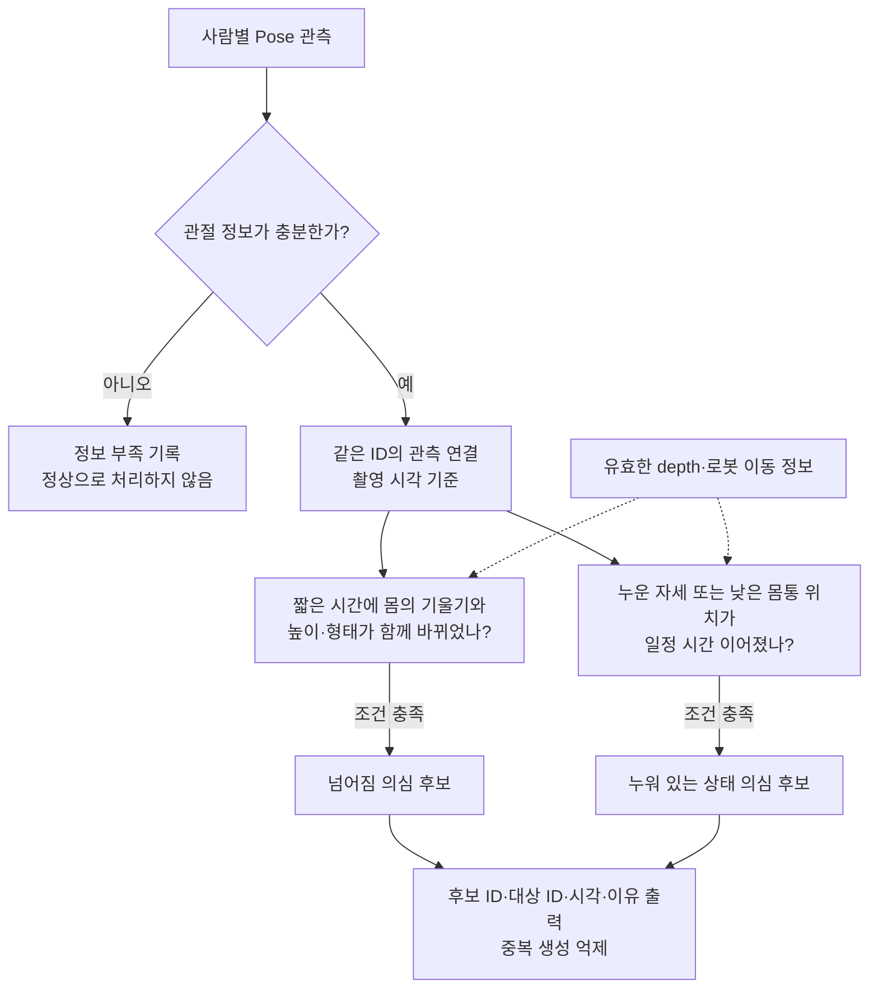

# 낙상 의심 판단 — 3단계

상태: **초기 구현·로컬 재생 검증 완료. 운영 임계값이나 낙상 검출 성능 확정 아님.**

## 무엇을 하는가

2단계에서 만든 사람별 관측을 입력받아 추가 확인이 필요한 후보를 만든다.
`fall_candidate.py`는 ROS·VLM·서버·알림·로봇 제어와 분리된 판단 모듈이다.
기존 이미지 콜백에서 모델을 추가 실행하지 않고 Pose 결과를 재사용한다.

ID는 이력을 나누는 번호일 뿐, 사람·낙상을 확정하는 근거로 계산하지 않는다.
한 명의 ID 생성이나 반복 관측만으로는 후보를 만들지 않는다. 점수가 낮아도
관절 조건을 만족하는 누운 사람은 후보가 될 수 있다. 움직이지 않는 사람도 제외하지 않는다.

## 입력과 특징

- 입력: `PoseTrackingResult`, 원본 촬영 시각(초), 원본 이미지 너비·높이,
  로봇 이동 상태(`stationary / moving / unknown`), 선택적인 사람별 depth 요약.
- 관절 신뢰도 0.5 이상인 몸통·팔·다리 관절을 사용한다. 얼굴만으로 몸 전체를 추정하지 않는다.
- 기본적으로 신뢰 가능한 몸 관절 4개와 어깨·골반 위치가 필요하다. 너무 짧거나
  없는 몸통 축은 사용하지 않는다. 부족하면 `insufficient_pose`로 기록한다.
- 몸통 기울기, 어깨에서 발목까지의 방향(보일 때), 박스 가로/세로 비율,
  몸통 중심의 세로 위치와 높이 변화, 신뢰 가능한 몸 관절의 가로·세로 분포를 계산한다.
- 정규화 좌표를 그대로 각도에 쓰지 않고 **원본 이미지 종횡비를 반영**한다.
  박스가 화면 아래에 있다는 이유만으로 바닥에 있다고 판단하지 않는다.
- depth는 정렬·신선도·유효 비율·측정 관절 수를 확인한 몸통 바닥 높이만 사용한다.
  depth가 없으면 높이를 만들어 넣지 않는다. `floor_distance_unavailable`로 기록한다.
- 로봇 이동 상태는 기존 odometry gate에서 읽는다. 데이터 없음·오래됨·정지 확인
  대기 중은 `unknown`이다. 이동·정지 상태 때문에 Pose 실행 자체를 막지 않는다.

## 두 후보의 조건

### `fall_suspected` — 넘어짐 의심

같은 ID와 같은 어깨·골반 관절 조합에서, 최근 2초 안의 수직에 가까운 자세와
현재 자세를 비교한다. 기본 조건은 몸통 기울기 30도 이상 변화와 다음 중 하나다.

- 정지 확인된 구간에서 몸통이 빠르게 내려감.
- 몸의 높이가 줄면서 수평 자세로 바뀜.
- 몸의 가로/세로 비율이 크게 바뀌면서 수평 자세로 바뀜.

두 표본 연속으로 변화 조건을 만족할 때 후보를 만든다. 사진 한 장의 박스 위치나
이동만으로 만들지 않는다. 로봇 이동 상태가 불명확하거나 이동 중이면 화면의
하강량·속도를 실제 몸의 하강 근거로 사용하지 않는다. 형태·기울기 경로는 유지하고
`camera_motion_uncompensated`를 남긴다. 카메라 회전·줌까지 보정한 것은 아니다.

### `found_down` — 누워 있는 상태 의심

하강 과정을 보지 못했어도, 관절로 확인한 수평 자세 또는 유효 depth상 낮은
몸통 위치가 기본 0.6초·3표본 이상 이어지면 후보를 만든다.

- 수평 자세: 몸통 각도·박스 비율·발목 방향(보일 때)을 함께 확인.
- 정면으로 누운 자세 보완(v2): 몸통이 화면에서 수직으로 보이더라도, 양쪽 어깨·골반과
  다리 관절이 있고 몸 관절 6개 이상이 가로로 낮게 모이면 별도 조건으로 확인.
  관절 분포와 박스의 가로/세로 비율이 각각 2 이상이고, 관절의 세로 범위가 박스
  높이의 0.7 이하인 경우다. 넓은 박스·팔만 보이는 모습·ID만으로 만들지 않는다.
  기존과 같이 0.6초·3표본 이상 이어져야 한다. 이 모습만으로 하강 과정을 만들지 않는다.
- 정지한 사람도 동일하게 처리. 사람이나 로봇의 움직임을 필수 조건으로 삼지 않음.
- depth가 없으면 바닥인지 침구·소파 위인지 모르므로 `lying_surface_unknown` 기록.
- 유효 depth에서 몸통이 기준보다 높다면, 수평 자세만으로 이 후보를 만들지 않음.

이 타입은 **현재 누워 있을 가능성을 확인하자는 뜻**이다. 낙상 이후임을 확정하지
않고, 정상적으로 눕기·바닥에서 자기와 구분이 끝났다는 의미도 아니다.

## 초기 기준과 변경 방법

주요 조정 기준은 `FallCandidateConfig`에 모여 있다. 버전과 전체 설정 SHA256을
출력에 기록한다. 몸통 축 최소 길이 등 입력 유효성 검사도 별도로 적용한다.
특정 영상 이름·라벨·생성 프롬프트는 판단 입력으로 사용하지 않는다.

| 설정 | 기본값 | 의미 |
| --- | ---: | --- |
| `temporal_window_sec` | 2.0 s | 앞선 자세를 비교하는 구간 |
| `max_frame_gap_sec` | 0.5 s | 이보다 관측 간격이 크면 비교 이력 끊음 |
| `found_down_hold_sec` | 0.6 s | 낮은 자세가 이어져야 하는 시간 |
| `minimum_samples` | 3 | 낮은 자세의 최소 표본 수 |
| `horizontal_torso_deg` / `upright_torso_deg` | 60° / 35° | 수직축에 대한 몸통 각도 |
| `minimum_box_aspect` | 1.1 | 수평 자세의 최소 박스 가로/세로 비율 |
| `compact_body_aspect` / `compact_box_aspect` | 2.0 / 2.0 | 정면 누움 보완 시 관절 분포·박스의 최소 가로/세로 비율 |
| `compact_minimum_body_points` | 6 | 정면 누움 보완의 최소 몸 관절 수. 양쪽 어깨·골반 및 다리 관절 필요 |
| `compact_max_vertical_fraction` | 0.7 | 관절 세로 범위 / 박스 높이의 상한 |
| `minimum_tilt_change_deg` | 30° | 앞선 자세와의 기울기 차이 |
| `minimum_descent_body_lengths` | 0.25 | 이전 박스 높이로 나눈 하강량 |
| `minimum_descent_speed` | 0.35 /s | 정지 구간에서만 쓰는 상대 하강 속도 |
| `minimum_height_loss` | 0.25 | 박스 높이 감소 비율 |
| `moving_shape_ratio` | 1.4 | 이전 대비 박스 가로/세로 비율 변화 |
| `maximum_floor_height_m` | 0.30 m | 유효 depth가 있을 때의 몸통 바닥 높이 기준 |
| `rearm_upright_sec` | 2.0 s | 후속 새 후보 생성을 허용할 연속 수직 자세 시간 |

ROS에서는 `fall_temporal_window_sec`, `fall_found_down_hold_sec`,
`fall_max_frame_gap_sec`를 제공한다. 관절 신뢰도는 기존 `pose_keypoint_threshold`를
재사용한다. 변경 시 재시작이 필요하다. 나머지는 순수 모듈 설정이며 추후 평가로
조정할 수 있다. Pose 후보 하한 `0.10`도 아직 실험값이다.

## 로컬 출력 계약

임시 토픽 `/homecam/fall_candidates`, 타입 `std_msgs/String`, reliable depth 10.
제안 문서의 `/fall_detection/candidates` 또는 `malbut_interfaces/msg/FallCandidate`를
구현한 것으로 간주하지 않는다. 후보 이름은 제안과 맞췄지만 현재 JSON은 camelCase다.
F05/VLM 도메인의 기존 enum과도 아직 자동 변환하지 않는다.

프레임마다 다음을 출력한다.

- `schemaVersion=1`, `algorithmVersion`, `configSha256`, `timeBase=ros_image_stamp`.
- `status`: `ok / disabled / waiting_frame / duplicate_frame / model_unavailable /
  inference_error / invalid_image / analysis_error / invalid_capture_time`.
- 정상 처리 시 `observationId`, `captureTimeSec`, `robotMotion`, `unassignedCount`.
- `candidates`: 이번 표본에서 새로 만든 후보 또는 근거가 추가된 revision.
- `tracks`: 사람별 상태·특징·유지 중인 후보 ID. `no_candidate`는 정상 판정이 아니라
  이번 관측에서 조건에 맞는 새 후보가 없다는 뜻이다.
- `frameId`, `expiredTrackIds`. 초기화·만료는 회복이나 사건 종료를 의미하지 않는다.

후보 항목:

| 항목 | 타입 | 의미 |
| --- | --- | --- |
| `candidateId`, `observationId`, `targetTrackId` | string | 후보·관측·영상 내 대상 식별자 |
| `revision` | integer | 같은 후보의 근거 갱신 번호, 1부터 시작 |
| `source` | string | `yolo_pose` |
| `candidateKind` | string | `fall_suspected / found_down` |
| `evidenceStartSec`, `evidenceEndSec` | number | 원본 ROS 촬영 시각 기준 근거 구간 |
| `requiresVerification` | boolean | 항상 true. 추가 확인 전제 |
| `reasons`, `uncertainties` | string array | 조건을 만족한 이유와 약한 관측·센서 부족 등 |
| `evidence` | object | `pose` 특징, `temporal` 변화량 또는 null, `robotMotion` |

후보에 낙상 확률이나 `confirmed_fall` 판정은 넣지 않는다. 각 특징값은 측정·계산된
값이며 교정된 낙상 확률이 아니다. 이 프레임 출력만 보고 프레임마다 VLM을 호출하면 안 된다.
F05 연결 시 후보 ID·revision을 기준으로 작업을 관리해야 한다.

v2는 `evidence.pose`에 `compact_body`(boolean), `body_spread_aspect`와
`body_vertical_fraction`(number 또는 null)을 추가한다. 해당 조건으로 후보가 생기면
`compact_shoulder_hip_leg_layout` 이유를 남긴다. 박스·관절의 형태 특징은 같은 Pose
출력에서 얻은 값이며, 독립적인 센서 증거나 검증된 낙상 확률이 아니다.

## 관측 공백·중복 처리

- `missing`, `ambiguous`, 관절 부족, 추론·이미지 변환 오류, 큰 시각 간격은 비교
  이력을 끊는다. 그 사이에 넘어졌다고 보간하거나 정상이라고 판단하지 않는다.
- 카메라·해상도 변경, 촬영 시각 역행, 모니터링 OFF에서는 작업 이력을 초기화한다.
  OFF 또는 첫 privacy 상태 수신 전에는 새로운 영상 분석을 하지 않는다.
- 같은 ID가 계속 누워 있으면 새 후보를 반복 생성하지 않는다. 나중에 자세 변화
  근거가 생기면 같은 후보 ID의 revision을 올릴 수 있다.
- 수직 자세가 충분히 관측되면 후속 새 후보 생성을 허용한다. **기존 사건을 회복·종료
  처리하는 기능은 아니다.** 사건 상태 판단은 F05에 남긴다.
- 메모리 이력은 유지 중인 ID당 최대 60표본이다. ID가 만료되면 제거한다.
  긴 가림 뒤 새 ID가 붙어 생기는 중복 사건은 F05의 별도 병합 문제로 남아 있다.
- ID 연결 보류 후보는 2단계 출력에 남지만, 이번 구현에서는 다른 사람의 이력에
  합치지 않고 미할당 수만 전달한다. 추적 연결 보류가 낙상 후보 누락으로 이어질 수 있다.

## 첫 구현(v1)의 로컬 검증 결과 — 2026-09-09

실제 YOLO26n-pose ONNX와 수정된 이미지 콜백으로 합성 영상 41개·1,106개 표본을
재생했다. ROS 발행·depth·일반 객체 검출은 테스트 대역이다. depth와 odometry가
없는 영상이므로 바닥 높이를 만들거나 로봇이 정지했다고 가정하지 않았다.
단위 테스트에서 정지·이동·unknown·유효/오류 depth 경로도 따로 확인했다.
homecam_detector 전체 테스트 178개와 변경된 Python 파일의 flake8 검사를 통과했다.

| 구분 | 영상 수 | 후보가 나온 영상 |
| --- | ---: | ---: |
| 사람이 검토한 확인 대상(낙상·의심·이미 누움) | 21 | 11 |
| 사람이 검토한 정상 활동 | 20 | 3 |

이 표는 **영상 단위 후보 발생 수**다. 대상자별 ID·발생 시각 정답이 없으므로
낙상 Recall/미탐률·오탐률·지연으로 보고하지 않는다. 현재 누락은 운영에 적용하기에 크다.

- 421: 영상 2.00초에서 `fall_suspected` 생성.
- 414: 영상 0.83초에서 누운 사람 ID 2만 `found_down` 생성. 앉은 사람 ID 1은 미생성.
- 107·411의 배경에 붙던 ID에서는 낙상 확인 후보가 생기지 않음.
- 108·308·410 정상 활동 영상에서도 `found_down` 생성. 정상적으로 눕기와 현재
  몸통 자세가 비슷하며, VLM·응답·장면 정보 없이 확정할 수 없는 사례다.
- 412는 Pose가 있어도 저상 정면 시점의 각도가 현재 수평 기준에 못 미쳐 놓침.
- 413·422 등은 관절 부족·가림, 431은 Pose 자체 미검출. 여러 근거를 요구하는
  규칙 역시 새로운 미탐 조건이 될 수 있으므로 4단계에서 원인별로 평가해야 한다.

시간은 영상 시작 기준 후보 생성 시점이며, 낙상 시작부터의 지연이 아니다.
카메라가 회전·이동하는 실물, 프레임별 대상 정답, 누락 구간, 질문/VLM/알림,
Jetson에서 자율주행·음성과 동시에 실행하는 검증은 아직 하지 않았다.

다음 4단계는 대상자·낙상 시작/착지 시각을 표시한 뒤, Pose 미검출·ID 단절·
관절 부족·시간/각도 기준 탈락을 나눠 보는 것이다. 기준을 조정할 영상과
마지막 성능 확인용 영상을 분리하고, 후보 하한 0.10도 함께 비교해야 한다.

## v2 보완과 비교 — 2026-09-09

412번의 정면 누움 누락을 보완했다. Pose 입력 방식·모델·0.10 후보 하한·추적기는
유지하고, 몸 관절의 분포를 보는 조건만 추가했다. 모델 추론 횟수도 늘리지 않았다.

| 구분 | v1 | v2 |
| --- | ---: | ---: |
| 확인 대상 21개 중 후보가 나온 영상 | 11 | 12 |
| 정상 활동 20개 중 후보가 나온 영상 | 3 | 3 |

- 412: 없던 `found_down` 후보가 영상 4.58초에서 생성된다. 누운 모습은 잡았지만
  넘어지는 과정까지 포착한 것은 아니다. 관절 누락·기준 경계에서 조건이 끊겨 늦게
  생성되는 문제가 남는다. 이 시각을 낙상 감지 지연으로 보고하지 않는다.
- 414: 누운 사람 ID 2의 후보 유지, 앉은 사람 ID 1은 후보로 만들지 않는다.
- 431: 여전히 후보 없음. 원본 비율 유지 입력으로 27표본, 고정된 확대 영역 3곳으로
  6시점(18회)을 확인해도 0.10 이상 Pose가 없었다. 비율 유지 입력의 최대 점수는
  약 0.016, 기존 입력은 약 0.046, 확대 시험은 약 0.038이었다.
  이는 가림에 대한 현재 모델의 한계를 보여주는 시험이지 모든 전처리가 불가능하다는 증명은 아니다.
- 입력 비율 유지(letterbox)는 전체 41개에서도 시험했다. v2 기준 확인 대상 후보
  11개·정상 활동 후보 4개였고, 기존에 잡던 307·414를 놓쳤다. 이번 코드에는 적용하지 않았다.
- 108·308·410의 정상적으로 누운 장면은 여전히 확인 후보다. 확인 후보와 보호자
  오경보는 구분한다. VLM·음성 질문·알림은 아직 연결하지 않았다.

결과물: 로컬 `~/.local/share/malbut-evaluations/pose-step3-fix-20260909-Ol4STa/`.
`final/`은 최종 코드의 실제 ONNX·이미지 콜백 재생, `letterbox/`와 `stretch/`는
입력 비교 실험이다. `run.json`에 모델·소스·라벨·스크립트 SHA256을 기록한다.
각 실행에서 같은 관측을 기존 규칙에도 전달해 입력 변경과 규칙 변경의 영향을 나눴다.

이번 비교는 같은 41개 개발 영상에서 규칙을 보완하고 다시 확인한 결과다.
별도 검증셋 성능이나 실제 로봇의 정확도로 일반화하지 않는다. 미검출·가림·추적 단절이
남아 있으므로 3단계의 초기 보완이며, 낙상 감지 기능 전체가 완료된 것은 아니다.

최종 검증: homecam_detector 테스트 **194개 통과**, 변경 모듈·테스트 flake8 및
`git diff --check` 통과. 실제 재생 1,106표본의 기존 단일 Pose 출력 유무는 모두 유지됐다.
같은 출력에 v1 규칙을 적용한 결과도 이전 실행의 대상 ID 번호·후보 종류·생성 시각과
일치했다. 최종 소스 SHA256과 재생 당시 SHA256 일치도 확인했다.

후속으로 [모델 입력 640·960·1280 비교](POSE_INPUT_SIZE_EXPERIMENT.md)를 수행했다.
입력 확대만으로는 431의 확인 후보가 생기지 않았고, 전체 확인 대상에서 후보가
나오는 영상도 줄었다. 이 실험 후에도 기본 모델 입력과 v2 규칙은 유지했다.
