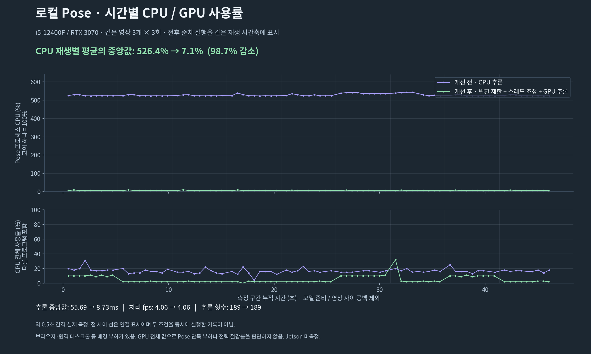
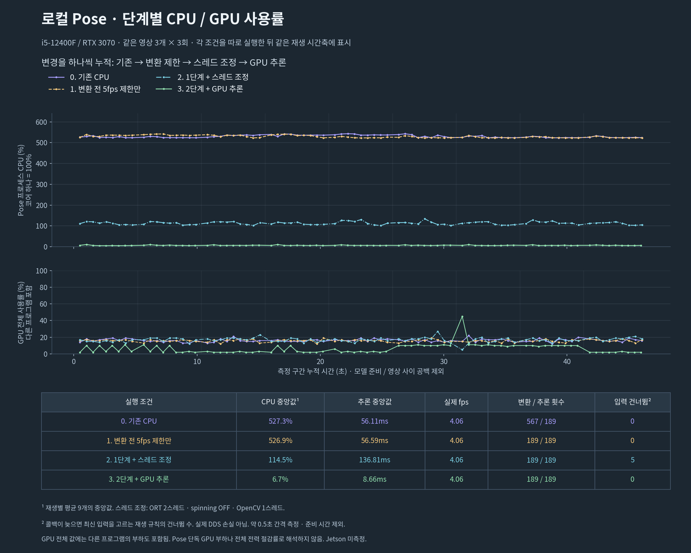

# Pose 실행 비용과 새 VLM 비교 (2026-09-29)

관련 작업: [SWM25-201 — 낙상 감지 YOLO-Pose CPU 부하 개선 및 단계별 성능 검증](https://sanggeunji0117.atlassian.net/browse/SWM25-201).
기존 SWM25-193 브랜치에서 작성한 성능 개선 커밋은 유지하고,
`feat/SWM25-201-fall-pose-performance` 브랜치에서 단계별 비교 자료를 추가해 PR로 정리함.

## 범위

- 기준 코드: `1a232ca`의 detector를 별도 디렉터리에 보관한 뒤 비교.
- PC: Intel i5-12400F, RTX 3070 8GB, NVIDIA driver 595.84.
- 전 조건 동일한 YOLO26s pose ONNX, ONNX Runtime 1.23.2, OpenCV 4.11.0.
- GPU wheel의 CPU EP도 비교에 사용. CUDA 실험은 TF32를 끔. 모델/임계값/5fps 제한은 유지.
- 별도 실행 환경에 설치했으며 운영 환경·Jetson의 CUDA/Torch는 변경하지 않음.
- 출력은 private artifact 디렉터리에 보관. API 키·영상은 Git에 추가하지 않음.

원본/결과 경로: `/home/jisanggeun/.local/share/malbut-evaluations/pose-perf-20260929.YBiSo6`.

## 측정 방법

`benchmark_fall_pose.py`가 실제 `HomecamDetectorNode._on_image`를 호출함.
CvBridge, ONNX 추론, 자세 추적, 후보 생성은 실제 코드이며 publisher만 메모리 수집기로 대체.
ROS graph/주행/질문/알림은 실행하지 않음. 허용 상태는 켜진 상태로 고정하고
depth/로봇 이동 관측은 제공하지 않음. 실제 카메라·DDS·다른 로봇 노드와의 동시 부하는 미검증.

낙상/의심/정상 각 첫 영상(SYN001/SYN002/SYN022, 640×400·12fps)을 3회씩 실시간 재생.
영상 디코딩은 측정 전에 수행하고, 매 영상 추론 5회를 준비 실행한 뒤 측정에서 제외함.
느린 콜백 다음에는 가장 최근 도착 프레임을 선택하는 명시적 재생 정책을 사용함.
동일 시각에 다른 추론 벤치마크를 병렬 실행하지 않음.

CPU 100%는 코어 하나. 추론 시간은 `session.run` 전체(전송 포함)이며 GPU 커널만의 시간은 아님.
CPU 사용량은 각 재생의 process CPU time / wall time, 아래 값은 9회 중앙값.
GPU 사용량/메모리는 0.5초마다 `nvidia-smi`로 읽은 GPU 전체 값으로 다른 프로세스도 포함함.

## 실시간 재생 결과

| 조건 | CPU 사용량 (코어 하나=100%) | 추론 중앙값 / p95 | 처리 fps | 변환 / 추론 횟수 | 최대 RSS |
| --- | ---: | ---: | ---: | ---: | ---: |
| 기존 CPU | 525.7% | 53.36 / 85.47ms | 4.06 | 567 / 189 | 459.5MiB |
| 변환 전 5fps 확인만 추가 | 534.4% | 85.54 / 86.74ms | 4.06 | 189 / 189 | 462.1MiB |
| 위 변경 + CPU 2스레드·spinning OFF·OpenCV 1스레드 | 105.5% | 126.82 / 131.41ms | 4.06 | 189 / 189 | 465.8MiB |
| 위 설정 + CUDA | 7.1% | 8.17 / 8.54ms | 4.06 | 189 / 189 | 1239.7MiB |

변환 낭비는 2/3 줄었지만, 이 입력에서는 변환만 줄여 CPU 사용량이 낮아졌다는 결과는 아님.
CPU 스레드 조정은 점유율을 줄이는 대신 추론을 느리게 했음.
CUDA는 CPU 부하와 추론 시간을 모두 줄였지만 메모리를 더 사용함.

### GPU 사용률과 메모리

| 항목 | 기존 CPU 추론 | 전체 개선 + CUDA 추론 |
| --- | ---: | ---: |
| GPU 사용률: 재생별 중앙값의 범위 | 0% | 0~7% |
| GPU 사용률: 기록된 최댓값 | 0% | 39% |
| GPU 전체 메모리 사용량 | 463MiB | 900MiB |

GPU 전체 메모리는 437MiB(약 0.43GiB) 증가함. CPU 스레드 조정 조건에서도
GPU 사용률은 0%, GPU 전체 메모리는 463MiB로 기록됨.
근거는 `A-original/summary.json`, `C-cpu-tuned/summary.json`, `D-cuda/summary.json`.

0.5초 간격으로 읽은 GPU 전체 값이므로 다른 프로세스의 활동도 포함함.
짧은 저빈도 추론은 측정에 충분히 잡히지 않을 수 있으므로, 0% 기록을 GPU 미사용으로
해석하거나 0~7%를 지속적인 사용률 상한으로 해석하지 않음.
39% 역시 Pose만의 최대 부하라고 단정하지 않음. 실제 세션의 CUDA EP 활성화는 별도로 확인함.

모든 조건은 추론 189회, 처리 전 버린 입력 0장.
12fps 입력에서 최소 0.2초 간격을 지키면 매 3프레임(0.25초)마다 추론하므로 약 4fps임.
이는 5fps 상한을 적용한 결과이며, GPU에서도 상한 자체를 올리지 않음.
시간 편차는 하드웨어 클럭/발열/실행 순서 영향이 있을 수 있어 한 번의 속도 비교를
모든 환경에 적용되는 배율로 일반화하지 않음.

### 로컬 개선 효과와 비교 그래프 (2026-09-30 정리)

기존 CPU 조건에서 변환 제한·스레드 조정·CUDA를 모두 적용한 조건으로 바꾸면,
CPU 사용량 중앙값은 525.7%에서 7.1%로 약 98.6% 줄었고,
추론 시간 중앙값은 53.36ms에서 8.17ms로 약 84.7% 줄었음.
두 감소율은 반올림 전 원시 측정값으로 계산함.
추론 횟수와 처리 fps는 유지됐으므로 처리량을 줄여 얻은 수치는 아님.
84개 동일 프레임 비교에서도 검출 사람 수와 후보 시점·종류가 유지됐음(아래 절 참고).

같은 PC에서 실행 비용을 줄였다는 실용적인 개선 근거로 사용함.
GPU 전환만의 효과, 전체 전력·발열 절감률, Jetson에서의 개선률 또는 통계적 유의성을
검증한 결과로 표현하지 않음. Jetson에서는 동일 입력으로 개선 전후를 별도 측정해야 함.

그래프와 재현 자료는 위 원본/결과 경로 아래 `visualization-0CIXFEfh/`에 저장함.

- `pose-local-comparison.png`: 문서 첨부용 비교 이미지.
- `pose-local-comparison.svg`: 벡터 이미지.
- `plotted-data.json`: 그래프에 사용한 원시 집계값과 감소율.
- `plot_comparison.py`: 기존 측정 파일을 읽어 그래프를 다시 만드는 스크립트.

CPU 막대는 재생별 평균 9개의 중앙값, 흰 점은 각 재생 평균임.
추론 막대는 189회 중앙값, 선 끝은 p95임. 초 단위 CPU 시계열은 저장되지 않았으므로
시간별 꺾은선 그래프로 복원하지 않음. 그래프 생성 과정에서 새 추론이나 Cloud 호출은 하지 않음.

### 시간별 사용률 재측정 (2026-09-30)

위 막대 그래프와 별도로, 사용자가 요청한 시간별 그래프를 만들기 위해 새로 재생함.
`benchmark_fall_pose.py`에 약 0.5초 간격 프로세스 CPU 시간 차이와 GPU 전체 사용률 기록을
추가함. 같은 준비 실행·640×400 입력·모델·영상 3개를 각 3회 재생하는 조건은 유지함.
기존 CPU 조건과 전체 개선 조건을 순차 실행하고, 준비와 재생 사이 공백을 제외한
측정 구간의 누적 시간축으로 나란히 표시함. 두 조건을 동시에 실행한 그래프가 아님.
조건별 측정 구간은 약 46.5초이며, 구간별 표본 81개를 저장함.



| 항목 | 기존 CPU | 변환 제한·스레드 조정·CUDA |
| --- | ---: | ---: |
| 재생별 평균 CPU의 중앙값 (코어 하나=100%) | 526.4% | 7.1% |
| 추론 시간 중앙값 | 55.69ms | 8.73ms |
| 실제 처리 fps 중앙값 | 4.06 | 4.06 |
| 추론 횟수 | 189 | 189 |
| 이미지 변환 횟수 | 567 | 189 |
| 처리 전 버린 입력 | 0 | 0 |

이번 재측정의 CPU 감소율은 반올림 전 값 기준 98.7%임.
기존 측정값을 덮어쓰지 않았으며 앞 표의 98.6%와 측정 회차가 다름.
시간별 그래프는 기존 평균으로 꾸민 값이 아니라 새 구간별 측정값을 사용함.

첫 시도에서는 벤치마크 실행 전부터 GPU 전체 사용률이 78%로 관측됨.
사용자가 배경 작업을 멈추겠다고 알려준 뒤 두 조건 모두 다시 측정했고,
최종 비교에는 `A-original-quiet`와 `D-cuda-quiet`를 사용함.
첫 시도의 `A-original`과 `D-cuda`도 삭제하지 않고 보관함.
재측정에도 원격 화면 등 배경 활동은 남아 있으므로 `quiet`는 GPU 유휴 보장을 뜻하지 않음.

GPU 전체 사용률의 재생별 중앙값 범위는 CPU 조건 15~18%, CUDA 조건 2~10%였음.
이는 Pose가 GPU로 이동했는데 GPU 부하가 감소했다는 근거로 사용하지 않음.
배경 작업과 측정 간격의 영향이 섞인 전체 GPU 표본이며 Pose 단독 활동을 분리하지 못함.
재생별 GPU 전체 메모리 중앙값은 725~726MiB에서 1164MiB로 기록됨.
전체 전력·발열은 이번에도 측정하지 않음.

원본은 `/home/jisanggeun/.local/share/malbut-evaluations/pose-timeline-20260930.JTap8rqj`에 보관함.
모델·입력 데이터·벤치마크 스크립트 해시가 두 조건에서 같은지 확인함.
저장소에는 [PNG](assets/fall_pose_timeline_20260930/pose-cpu-gpu-timeline.png),
[SVG](assets/fall_pose_timeline_20260930/pose-cpu-gpu-timeline.svg),
[시간별 측정값과 실행 설정](assets/fall_pose_timeline_20260930/timeline-data.json)을 함께 보관함.
실제 영상·Cloud 응답·키는 이 첨부에 포함하지 않음. 새 Cloud 호출은 0회임.

### 단계별 시간별 비교 (2026-09-30 추가)

앞 시간별 그래프는 기존/전체 개선 두 조건만 표시했음. 각 변경의 차이를 보기 위해
기존 CPU → 변환 제한만 → 스레드 조정 추가 → CUDA 추가의 네 조건을 새로 측정함.
각 단계는 앞 단계의 변경을 유지함. 스레드 수·spinning·OpenCV 설정은 한 단계로 묶었으므로
이 셋의 개별 효과를 분리한 실험은 아님.

같은 640×400·12fps 영상 3개를 조건마다 3회 재생함. 모델·입력·측정 코드·라이브러리
버전과 재생 순서가 일치하는지 검사함. 조건마다 약 46.5초, 구간별 자원 표본 81개이며
준비 실행과 영상 사이 공백은 제외함. 네 조건을 순차 실행한 값을 같은 시간축에 표시함.



| 누적 적용 단계 | CPU 사용량 중앙값¹ | 추론 시간 중앙값 | 실제 처리 fps | 변환 / 추론 횟수 | 입력 건너뜀² |
| --- | ---: | ---: | ---: | ---: | ---: |
| 0. 기존 CPU | 527.3% | 56.11ms | 4.06 | 567 / 189 | 0 |
| 1. 변환 전 5fps 제한만 | 526.9% | 56.59ms | 4.06 | 189 / 189 | 0 |
| 2. 1단계 + 스레드 조정 | 114.5% | 136.81ms | 4.06 | 189 / 189 | 5 |
| 3. 2단계 + GPU 추론 | 6.7% | 8.66ms | 4.06 | 189 / 189 | 0 |

¹ 재생별 평균 9개의 중앙값. CPU 100%는 코어 하나에 해당함.
² 느린 콜백 이후 최신 입력을 선택하는 재생 정책에 따라 건너뛴 프레임 수로,
실제 ROS/DDS 전송 손실이나 추론 실패 횟수가 아님.

- 변환 제한만 적용하면 변환 횟수는 567회에서 189회로 줄었지만 CPU 사용률은 거의 같았음.
  이 조건에서 이미지 변환만 줄여 CPU 부하가 크게 줄었다고 주장하지 않음.
- 스레드 조정(ORT 2스레드·spinning OFF·OpenCV 1스레드)은 CPU 사용률을 낮췄지만
  추론은 56.59ms에서 136.81ms로 느려졌고 입력 5장을 건너뜀. 추론 189회와 처리 fps는
  유지됐으나 추론 지연까지 개선된 결과는 아님.
- 같은 설정에서 CUDA로 바꾸면 CPU 사용률은 6.7%, 추론 중앙값은 8.66ms로 낮아졌음.
  입력 건너뜀은 없었고 추론 횟수는 같았음. 처리 fps는 기존 5fps 상한을 유지한 결과이며,
  12fps 입력의 프레임 간격 때문에 실제로는 약 4fps가 됨.

GPU 그래프는 다른 프로그램과 원격 화면 부하가 포함된 장치 전체 사용률임.
측정 시작 전에도 GPU 사용률 13%가 관측됐고 조건별로 배경 부하가 달라질 수 있으므로,
그래프의 GPU 차이를 Pose 단독 증감으로 해석하지 않음. 전체 전력·Jetson 성능은 미측정임.
각 단계를 같은 순서로 한 번씩 실행한 비교이므로 실행 순서·하드웨어 상태의 영향도 남음.

새 원본은 `/home/jisanggeun/.local/share/malbut-evaluations/pose-stages-20260930.lyyBOBD1`의
`A-original`, `B-early-gate`, `C-cpu-tuned`, `D-cuda`에 보관함. 이전 측정은 덮어쓰지 않음.
저장소 작업 폴더에 [PNG](assets/fall_pose_stages_20260930/pose-cpu-gpu-timeline.png),
[SVG](assets/fall_pose_stages_20260930/pose-cpu-gpu-timeline.svg),
[측정값·실행 설정](assets/fall_pose_stages_20260930/timeline-data.json)을 저장함.
이번 추가 작업은 측정·시각화 도구와 문서만 변경했으며 실행 코드·기본값은 바꾸지 않음.
새 Cloud 호출은 0회임.

SWM25-201 PR 준비 시 그래프·Pose·설정·이미지 콜백 테스트 82개,
Bringup·새 평가 도구 테스트 74개를 다시 실행해 모두 통과함.
그래프 테스트 19개에는 입력/모델/측정 코드가 다른 자료를 비교에서 거부하는 검사도 포함됨.
초기 재실행의 수집 오류는 패키지 경로와 ROS 환경을 로드한 뒤 해결했으며,
테스트를 건너뛰는 방식으로 처리하지 않음. 아래의 전체 회귀/실제 ROS 검사와 구분함.

## 적용한 코드

아래는 9월 29일 측정 당시 변경 내용이다. 10월 1일 배포 수정에서 낙상 전용 노드의
기본값을 `auto / ORT 2 threads / spinning OFF / OpenCV 1 thread`로 바꿨다.
기존 PR은 조정 옵션만 추가하고 기본값은 유지해, 업데이트만 한 로봇에는 스레드 조정이
적용되지 않았다. 이어 일반 홈캠의 YOLO·Pose에도 GPU 선택과 스레드 제한을 적용했다.
위 표의 측정 결과를 새로 측정한 것은 아니다.
현재 설치·실행 절차는 [Bringup 안내](../../malbut_bringup/README.md#cloud-vlm-자동-실행)를 따른다.

10월 1일 기본값 수정 검증:

- Bringup 전체 회귀 검사 491개 통과.
- Detector·설치 스크립트·홈캠 launch·낙상 preflight 검사 303개 통과. 기본 실행 인자,
  직접 노드 실행의 기본값, 명시적인 CPU 설정, 일반 홈캠의 조정된 기본값을 포함.
- CUDA 없는 환경의 CPU 선택, CUDA 초기화 실패 시 CPU-only 실행 거부,
  기존 GPU 패키지 보존과 CPU/GPU 설치 환경 분리는 테스트 대역으로 확인.
  실제 Jetson에 GPU wheel을 설치한 검사는 아님.
- PC의 ORT 1.23.2 환경에서 실제 YOLO26s 모델을 `auto`, `cuda`, `cpu`로 각각
  로딩하고 640×400 검은 시험 이미지로 추론 성공. `auto`는 CUDA를 선택함.
- 실제 ROS 노드 시작에서도 `auto / 2 / false / 1` 및 CUDA 선택을 확인함.
  감지 허용 전 영상 처리는 중단 상태였고, 카메라·Cloud는 사용하지 않음.
- 일반 홈캠 실제 ROS 노드도 YOLO·Pose 모두 CUDA 선택, 스레드 2, spinning OFF로
  시작함을 확인. 모니터링 OFF 상태는 유지됨.
- 일반 YOLO26n은 합성 영상 SYN001·SYN002·SYN022에서 5프레임마다 추출한 총 39장으로
  기존 CPU 설정과 새 기본 CUDA 설정을 비교. person/cat/dog 검출 클래스가 달라진 프레임은
  0장, 신뢰도 최대 차이는 약 0.00000215. 이 소규모 비교는 정확도 평가나 Jetson 측정이 아님.
- 이는 배포 설정 연결 검사이며 Jetson 성능 개선 수치를 새로 측정한 결과는 아님.

- `fall_only=true`에서만 영상 변환 전 추론 시각을 확인. 허용/연결 확인은 그보다 먼저 수행.
- 일반 홈캠은 Pose가 쉬는 프레임도 다른 분석에 필요하므로 기존 변환 경로를 유지.
- 변환 실패한 프레임도 제한 횟수를 사용하도록 해 손상된 이미지 입력이 제한을 우회하지 않음.
- CPU/CUDA 선택, ORT 스레드 수·spinning, OpenCV 스레드를 시작 인자로 제공.
- CUDA가 없거나 초기화에 실패하면 명시적으로 실패. CPU만 사용하면서 GPU 실행으로 표시하지 않음.
- 일반/로봇 미러 코드는 동일하게 변경. 모델 좌표, 640×640 letterbox, 후보 임계값은 변경하지 않음.
- 기존 배포의 CPU 기본값은 유지. GPU/스레드 조정은 명시적으로 선택하며 노드 재시작이 필요.

GPU 실행 인자 (호환되는 CUDA EP가 설치된 별도 Python 환경 필요):

```bash
ros2 launch malbut_bringup robot.launch.py \
  fall_pose_execution_provider:=cuda \
  fall_pose_intra_op_num_threads:=2 \
  fall_pose_allow_spinning:=false \
  fall_pose_opencv_num_threads:=1
```

필요하면 `fall_pose_python_executable`도 해당 환경으로 지정.
측정 당시 `prepare_fall_pose_runtime.sh`는 CPU 설치용이었음. Jetson에 PC용 CUDA wheel을 그대로
설치하지 말고 해당 JetPack/CUDA/cuDNN/aarch64 조합의 호환성을 먼저 확인해야 함.

## 84개 동일 프레임 비교

고정 프레임 비교는 84개 영상, 1,936회 추론에서 수행함.
CPU/GPU 모두 49개 영상에서 후보를 만들었고, 프레임별 검출 사람 수와
후보 발생 시점·종류가 달라진 경우는 없었음.
총 2,110개 자세 출력의 박스 좌표 최대 차이는 약 0.00000176,
관절 좌표는 약 0.00000205(정규화 좌표), 박스 신뢰도는 약 0.00012445였음.
이는 실행 방식 변경의 결과 보존 확인이지, 실제 사람/사건 병합 정확도 검증은 아님.

추가로 스레드 수를 그대로 두고 spinning만 끈 측정도 보관함(`E-no-spinning`).
CPU 179.0%, 추론 중앙값 98.42ms였으나, 그 시점에는 원격 데스크톱·브라우저 등
다른 부하가 관측됐으므로 앞 표와 동일한 환경의 직접 비교 결과로 사용하지 않음.

`fixed-original84`/`fixed-cuda84`는 원본 해상도 탐색 기록임. 최종 카메라 크기 비교는
`fixed-original-rgb84`/`fixed-cuda-rgb84`를 사용함. 43개 원본이 1280×720이므로
비율을 유지해 640×400 캔버스에 맞춘 뒤 동일한 전처리를 두 조건에 적용함.

새 Cloud 예산은 총 $1, 예약액 포함 잔여 예산이 부족하면 다음 호출을 시작하지 않음.
응답을 못 받은 요청의 비용은 0으로 처리하지 않으며 자동 재시도/재개는 하지 않음.
요청당 $0.05를 보수적으로 예약하지만, 클라이언트의 취소가 공급자의 원격 추론/과금을
취소한다는 보장은 없고 최종 청구액은 공급자 기록과 대조해야 함.

## 새 Gemma Cloud 평가 결과

로컬 준비/성능 측정은 9월 29일 시작했고, 새 Cloud 평가는 9월 30일 완료함.
기존 응답을 재사용하지 않고 `gemma4:31b`를 실제로 133회 호출함.

- 전체 장면 분석 84회: 최근 5초, 최대 12장, 현재 native-box 실행 프롬프트.
- Pose의 첫 요청 분석 49회: 해당 시점까지 들어온 영상만 사용. 미래 프레임을 붙이지 않음.
- CPU 원본의 실제 Pose 출력 → `FallDetectorInput` → `CloudFallMonitor`로
  첫 요청과 대상 박스를 준비. 준비 단계의 테스트 답변은 점수에 포함하지 않음.
- Pose 출력과 RGB는 같은 시각 기준, RGB는 5fps 상한으로 선택.
- 모든 133개 HTTP payload의 SHA256이 호출 전 dry-run과 일치함.
- 음성 답변/depth/주행 상태는 만들지 않았고, 라벨/검토 이유는 Cloud에 보내지 않음.

### 장면 판단

| 항목 | 새 결과 |
| --- | ---: |
| 3개 라벨 정답 | 71/84 (84.5%) |
| 낙상 정답 | 25/25 |
| 낙상 의심 정답 | 19/25 |
| 정상 행동 정답 | 27/34 |
| 낙상·의심을 정상으로 판단 | 0/50 |
| 응답 시간 중앙값 | 3.35초 |
| 시간 초과/파싱 실패/위치 형식 오류 | 0/0/0 |
| 84회 사용량 기준 비용 | $0.06161402 |

위치 형식 오류 0건은 실제 사람의 박스 위치가 전부 정확하다는 뜻이 아님.
이전 평가와 입력 프레임 선택/현재 실행 프롬프트/평가 시점이 다르므로 점수 변화를
모델의 성능 향상·하락으로 직접 해석하지 않음.

### 확인할 장면을 찾았는지

| 입력에서 의심 표시를 만든 경로 | 낙상·의심 50개 | 정상 34개에서도 의심 표시 |
| --- | ---: | ---: |
| Pose만 | 37 | 12 |
| VLM만 | 50 | 7 |
| 둘 중 하나라도 발견 | 50 | 16 |

마지막 줄은 동일한 새 VLM 응답과 Pose 결과의 영상 단위 OR 비교임.
독립된 두 번째 84회 VLM 호출이나, 사건 병합/최종 대응의 정답률이 아님.
이 조건에서는 Pose를 더해도 추가로 찾은 위험 영상은 없었고 확인 후보만 늘었음.
하지만 후보 발생을 보호자 오경보와 동일하게 세면 안 됨. 다음 단계의 VLM 확인이 있기 때문.

### Pose가 실제로 처음 보낸 영상

49회 모두 응답을 받았고, 낙상 19 / 낙상 의심 20 / 정상 10으로 답함.
대상 박스를 제공할 수 있었던 요청은 22회, 제공하지 못한 요청은 27회였음.
응답 중앙값 2.53초, 비용 $0.02327060.

- 원래 정상 영상에서 나온 Pose 요청 12건 중 9건은 VLM이 정상으로 답함.
  나머지 3건은 낙상 의심으로 답함. 따라서 Pose가 후보를 만든 12건 전체를
  최종 오경보 12건으로 해석하지 않음.
- 전체 영상 라벨이 낙상·의심인 요청 37건 중 36건은 낙상/의심으로 답함.
  `SYN018`(433 영상)은 첫 요청 시점 2.75초까지의 영상에서는 정상으로 답했지만,
  마지막 장면까지 받은 전체 장면 분석에서는 낙상 의심으로 답함.
- 첫 요청은 영상 앞부분만 포함할 수 있으므로 전체 영상 정답과 그대로 대조해
  49건의 모델 정확도로 점수화하지 않음. 요청 시점의 근거 라벨은 별도 검토가 필요함.

합계 $0.08488462, 미확인 비용 요청 0건. 승인한 $1 한도 안에서 종료했고 추가 호출 없음.
사용량×확인한 단가의 계산값이며 공급자 청구 영수증 금액이라고 단정하지 않음.

### 여기서 아직 결론 낼 수 없는 것

이 데이터는 5초 내외 합성 영상이며, 이전에도 검토/튜닝에 사용한 개발 데이터임.
각 영상의 끝에 VLM 확인 시점이 맞는 조건에서의 비교이지,
60초/300초 주기로 연속 감시할 때의 사건 검출률·발견 지연·월 호출 비용 비교는 아님.
첫 요청 1건만 별도 평가했으므로 여러 사람/반복 후보/재확인/대화/사건 병합에 따른
전체 호출 수와 최종 판단도 검증한 것으로 표시하지 않음.
VLM 단독으로 운영할지 결정하려면 동일한 긴 연속 영상을 두 실행 정책으로 재생해
주기 사이에 놓치는 장면, 첫 발견 시간, 질문/후속 호출 수까지 비교해야 함.

원본 근거: `cloud-fresh/summary.json`, `cloud-fresh/scored_rows.json`,
요청별 `*-reservation.json` / `*-response.json` / `*-result.json`.

## 회귀 테스트

- detector/Bringup/낙상 설정·사건·연결·native-box 파서 등: 726 passed, 28 skipped.
- 선택 실행 항목에는 실제 ROS 전송 테스트와 별도 SAM GPU 자산이 필요한 테스트가 포함됨.
- 위에서 빠졌던 로컬 ROS 전송 테스트는 별도로 켜서 **19 passed (196.58초)** 확인.
  `ROS_LOCALHOST_ONLY=1`, 별도 domain 147과 UUID 토픽을 사용했고,
  카메라·Pose·추적 박스·Cloud 응답은 fixture였음. 실제 ONNX 비교/Cloud 호출과 구분함.
  결과는 artifact의 `ros-regression.xml`에 보관. SAM GPU 자산 테스트 9개는 이번 범위에서 실행하지 않음.
- 초기 1건 실패는 빌드된 `malbut_interfaces`를 로드하지 않은 실행 환경 때문이었으며,
  기존 메시지 빌드 경로를 연결한 뒤 통과. 소스 오류를 skip으로 숨기지 않음.
- detector 변경 소스/테스트 flake8, 새 스크립트의 치명적 lint 검사, `git diff --check` 통과.
- 로봇 미러의 `pose.py`, `config.py`, `detector_node.py`와 원본 일치 확인.
- 검증 실행 이후 추가한 소스 변경은 시작 로그 표시와 손상 이미지의 변환 제한이며,
  정상 이미지 추론/판정 경로는 동일함. 이 분기는 별도 단위 테스트로 확인함.

## 재현용 도구

- `homecam_agent/scripts/benchmark_fall_pose.py`: 원본/수정본 소스 경로 선택,
  실시간 재생 또는 동일 프레임 재생, 원시 측정값·후보·자세 기록.
- `homecam_agent/scripts/report_pose_performance.py`: 자원 집계와 CPU/GPU 후보 시점·종류 비교.
- `homecam_agent/scripts/evaluate_pose_vlm_fresh.py`: 기본 dry-run,
  명시적인 `--execute`에서만 키를 읽고 Cloud 호출. 동일 출력 경로의 자동 재실행 금지.
  `--budget-usd`는 이 실험에 승인된 $1보다 크게 지정할 수 없음.
- 초기 평가 당시에는 로컬 수정 상태였으며 로봇 배포는 하지 않음.

### 저장소 반영 전 추가 확인 (2026-09-30)

- 최신 `origin/main`의 `07393ed` 위에 이번 변경만 반영함.
  새 브랜치는 `feat/SWM25-193-fall-pose-performance`이며 기존 main의 순차 Bringup 변경을 유지함.
- 새 실행 옵션 테스트도 최신 Bringup의 단계별 시작 도우미로 검사하도록 맞춤.
- detector·Bringup·낙상 처리·평가 도구 회귀 검사: **2271 passed, 20 skipped**.
  건너뛴 항목은 별도 실행하는 로컬 ROS 19개와 별도 GPU 자산 시험 1개임.
- 위 로컬 ROS 19개를 별도 domain 148에서 실제로 실행해 **19 passed (196.73초)** 확인함.
  입력 영상·자세·Cloud 답변은 fixture이며 실제 DDS 연결을 검사함.
  `ros-regression.xml`에 보관함. 별도 GPU 자산 시험 1개는 이번에도 실행하지 않음.
- 첫 검사에서 Bringup 설치 패키지를 찾지 못해 실패한 항목은 별도 경로에 현재 Bringup을
  빌드한 뒤 다시 확인함. HTTP 어댑터 시험 의존성이 있는 평가 환경을 사용해 의존성 부족으로
  시험을 건너뛰지 않음. 결과는 원본 경로의 `regression-built.xml`에 보관함.
- GPU 실행은 여전히 선택 사항이며 기본 CPU 실행 설정은 유지함. 로봇 배포나 기본값 전환은 하지 않음.

참고: [ORT 스레드 설정](https://onnxruntime.ai/docs/performance/tune-performance/threading.html),
[CUDA EP 의존성](https://onnxruntime.ai/docs/execution-providers/CUDA-ExecutionProvider.html),
[Gemma Cloud 단가](https://ollama.com/pricing).
