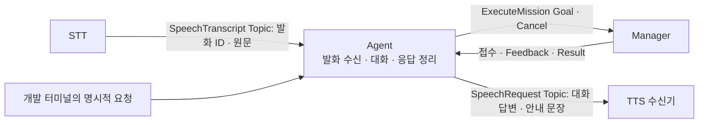

# Malbut Agent Server

Agent의 기준 문서는 [Malbut Agent 명세](docs/malbut_agent.md)다.

`malbut_agent_server`는 LLM과 로봇 실행 계층 사이의 안전 계약, 사용자별
멀티턴 세션, 제한된 대화·기억 컨텍스트, LLM provider 연결과
서버 소유 Tool capability 경계를
제공하는 ROS 2 Python 패키지다.

SWM25-72에서 오프라인 `mock`과 OpenAI Responses API를 같은
요청·응답 규격으로 연결했다. 다음 기능을 검증할 수 있다.

- `(user_id, conversation_id)` 단위 SQLite 세션 격리
- `request_id`, `turn_id` 기반 내구성 있는 중복 요청 방지
- 사용자·로봇 발화의 순서 저장과 최근 10턴 전달
- 세션 생성·조회·초기화·종료·삭제
- 유휴 만료와 reset·delete 중 늦게 도착한 응답 차단
- 같은 프로세스에서 동시에 들어온 요청의 직렬 처리
- `아까 말한 것`, `그 사람`, `그거`의 Mock 기반 후속 표현 회귀
- 최근 N턴 원문과 그 이전 대화의 결정론적 rolling summary 분리
- 사용자별 장기 기억의 별도 검색과 만료 항목 제외
- 전체 모델 입력 문자 제한, overflow fallback과 내용 없는 크기 메트릭
- 과거 대화·요약·기억을 `_untrusted` JSON 데이터로 직렬화
- OpenAI 구조화 응답·엄격한 Tool schema·사용량 메타데이터 정규화
- 유한 retry, backoff, circuit breaker와 옵션 모델 fallback
- API 오류 시 로봇 행동이 아닌 안전 응답으로 fail-closed
- 30개 한국어 고정 테스트셋·반복 실행·비용 추정 평가 CLI
- 서버 소유 capability registry와 요청 Tool 부분집합 계산
- 읽기 전용·명시적 시뮬레이션·제안 전용 Tool 모드 분리
- 인증된 capability 조회와 비부작용 Tool query API
- Tool 입력 schema, timeout, 결과 크기·상태 freshness 검증
- 프로세스 내 Tool query 중복 억제와 오류 원문 비공개
- LLM 호출 후 server-owned RobotState를 읽는 optional safety source
- target·proposal·session revision에 묶인 durable text confirmation
- `네/아니요/취소`의 LLM 없는 exact 판정과 terminal CAS
- 별도 Python에서만 켜지는 optional RAI structured-proposal sidecar

공개 장기 기억 CRUD API와 실제 ROS 부작용 Tool 실행기는 후속 스토리에서
연결한다. 모델이 추론한 내용을 자동 저장하는 경로는 없다. 일반 Agent
server는 `trusted_robot_state=False`, `MALBUT_AGENT_TOOL_MODE=proposal`이
기본이다. SWM25-131의 별도 simulation composition에서 승인을 받아도
`execution_authorized=false`, `physical_authorized=false`이며 Nav2를 호출하지
않는다.

## 테스트

```bash
cd ~/ros2_ws/src/malbut/malbut_agent_server
PYTHONPATH=. python3 -m pytest -q test
```

전체 계약은
[`docs/jira/SWM25-69_CONVERSATION_AGENT_CONTRACT.md`](docs/jira/SWM25-69_CONVERSATION_AGENT_CONTRACT.md)에
정리되어 있다. 여섯 연관 스토리의 책임 경계는 관리자 승인을 받았지만,
세부 ROS 타입·안전 임계값·Mock 시험은 SWM25-73~77에서 구현하고 검증하기
전까지 실행 가능한 물리 기능으로 취급하지 않는다.

승인 증거와 후속 구현 전 확인할 항목은
[`SWM25-69 인터페이스 승인 가이드`](docs/jira/SWM25-69_INTERFACE_APPROVAL_GUIDE.md)에
정리되어 있다. CI 통과나 PR 병합은 구현 근거이며 책임 경계 승인만으로
후속 물리 기능 구현이 완료되지는 않는다.

## Mock 서버 실행

먼저 설정과 DB 초기화를 검사한다.

```bash
PYTHONPATH=. python3 -m malbut_agent_server.cli \
  --provider mock \
  --database /tmp/malbut-agent-demo.sqlite3 \
  --check
```

서버를 실행한다. 기본 주소는 `http://127.0.0.1:8765`다.

```bash
PYTHONPATH=. python3 -m malbut_agent_server.cli \
  --provider mock \
  --database /tmp/malbut-agent-demo.sqlite3
```

세션을 만든다.

```bash
curl -X POST http://127.0.0.1:8765/v1/conversations \
  -H 'Content-Type: application/json' \
  -d '{
    "user_id": "local-user",
    "conversation_id": "demo-conversation"
  }'
```

첫 번째 발화를 보낸다.

```bash
curl -X POST http://127.0.0.1:8765/v1/agent/respond \
  -H 'Content-Type: application/json' \
  -d '{
    "request_id": "request-001",
    "user_id": "local-user",
    "conversation_id": "demo-conversation",
    "turn_id": "turn-001",
    "utterance": "내 이름은 신이야",
    "robot_state": {},
    "available_tools": []
  }'
```

같은 `request_id`와 동일한 입력을 재전송하면 저장된 응답을 반환하며 Mock을
다시 호출하지 않는다. 같은 ID로 다른 입력을 보내면 `409`로 거절한다.

## SWM25-73 Tool Gateway

`available_tools`는 클라이언트가 capability를 선언하는 필드가 아니다. 서버
registry가 허용한 목록을 이번 요청에서 더 좁히는 selector다. 모델과 safety
policy에는 다음 교집합만 전달된다.

```text
정적 Tool schema ∩ 서버 capability registry ∩ 요청 available_tools
```

현재 capability와 실행 가능 여부를 확인한다. 인증을 사용하는 서버라면 같은
Bearer 헤더를 추가해야 한다.

```bash
curl http://127.0.0.1:8765/v1/tools/capabilities
```

기본 `proposal` 모드에서 이동을 query해도 실제 Nav2 goal은 발행되지 않고
`confirmation_required`로 차단된다.

```bash
curl -X POST http://127.0.0.1:8765/v1/tools/query \
  -H 'Content-Type: application/json' \
  -d '{
    "request_id": "tool-query-001",
    "user_id": "local-user",
    "tool_name": "navigate",
    "arguments": {"location": "거실"}
  }'
```

로컬 연결 시험에서만 시뮬레이션을 명시적으로 켤 수 있다. 이 모드는 LLM
provider 선택과 독립적이며 Mock provider를 선택했다고 자동으로 켜지지 않는다.

```bash
MALBUT_AGENT_TOOL_MODE=simulation \
PYTHONPATH=. python3 -m malbut_agent_server.cli \
  --provider mock \
  --database /tmp/malbut-agent-simulation.sqlite3
```

시뮬레이션 adapter는 결과에 `simulated=true`를 남기며 Nav2 goal, 사진 파일,
외부 알림을 만들지 않는다. `/v1/tools/query`는 읽기 전용 또는 이 Mock
시뮬레이션만 처리한다. SWM25-131의 text confirmation은 별도 endpoint와
SQLite 원장으로 구현됐지만 실행 권한, `tool_call_id`, 1회 소비와
취소·feedback은 만들지 않는다. 실제 실행 결속은 SWM25-132 범위다.

현재 query cache는 프로세스 내 최대 256건으로 제한된다. adapter 응답
deadline이 지나도 이미 시작된 Python thread를 강제로 중단하지 못하므로,
73에서는 자체 I/O timeout이 있고 부작용이 없는 adapter만 연결한다.

`/v1/agent/respond`의 `execution.proposal_authorized`는 로컬 정책을 통과한
제안이라는 뜻일 뿐이다. `execution.authorized`와 `consume_once`는
SWM25-74 전까지 항상 `false`이고 `tool_call_id`는 `null`이다.

## OpenAI 서버 실행

`.env.example`을 Git에서 제외되는 로컬 파일로 복사한 뒤 권한을 제한한다.

```bash
cp .env.example .env.local
chmod 600 .env.local
```

`.env.local`에서 `MALBUT_AGENT_PROVIDER=openai`, `OPENAI_API_KEY`,
`MALBUT_AGENT_AUTH_TOKEN`을 설정한다. API key는 코드·Git·명령행 인자에
넣지 않는다. 실측 기준 운영 후보는 `gpt-5.6-terra`, 저비용
fallback 후보는 `gpt-5.6-luna`다.

먼저 유료 API 호출 없이 설정을 검사한다.

```bash
PYTHONPATH=. python3 -m malbut_agent_server.cli \
  --env-file .env.local \
  --check
```

검사가 통과하면 서버를 실행한다. OpenAI 모드는 loopback bind와 HTTP
Bearer 인증을 모두 강제한다.

```bash
PYTHONPATH=. python3 -m malbut_agent_server.cli \
  --env-file .env.local
```

`/healthz`를 제외한 요청에는
`Authorization: Bearer <MALBUT_AGENT_AUTH_TOKEN>` 헤더가 필요하다.

## SWM25-131 텍스트 확인과 RAI sidecar

`/v1/text/turns`는 일반 server에서 기본 OFF다. `malbut_scenarios`의 명시적
Gazebo composition이 active map catalog, fresh simulation state와 인증을
주입할 때만 켜진다. body는 `request_id`, `conversation_id`, `turn_id`,
`text`만 받으며 user, robot state, approval 또는 goal ID를 받지 않는다.

pending confirmation에서 `네/아니요/취소`는 Provider를 다시 호출하지 않는다.
모호한 답은 같은 질문을 반환하며 일반 대화로 넘어가지 않는다. 승인 결과도
이동을 시작하지 않는다. 실행법과 상태별 의미는
[`SWM25-131 구현 문서`](docs/jira/SWM25-131_TEXT_CONFIRMATION_RAI.md)에 있다.

RAI는 `MALBUT_AGENT_PROVIDER=rai-sidecar`를 명시했을 때만 사용한다. 별도
Python 3.10 venv의 `bin/python`, 그 venv 밖의 isolated CWD,
`OPENAI_API_KEY`, `MALBUT_RAI_MODEL`, HTTP Bearer token이 모두 필요하다.
sidecar는 시작 시 설치 distribution이 정확히 `rai-core==2.12.1`인지 검사하고
다르면 import 전에 종료한다. `rai-core`는 이 ROS package dependency에
포함되지 않으며 sidecar는 neutral Tool proposal만 반환한다. RAI의 범용
ROS·shell Tool은 등록하지 않는다. RAI mode에서는 모델 입력 상한도 sidecar
protocol 한도인 65,536자를 넘길 수 없다.

## Provider 평가

오프라인 Mock 계약을 먼저 확인한다.

```bash
PYTHONPATH=. python3 -m malbut_agent_server.eval_runner \
  --provider mock \
  --repetitions 3 \
  --output /tmp/malbut-agent-mock-eval.json
```

실제 비교는 동일한 30개 테스트를 모델별 최소 3회 반복한다. 원문
발화·응답·API key는 보고서에 저장하지 않으며, 출력 JSON은
`0600` 권한으로 저장된다.

```bash
PYTHONPATH=. python3 -m malbut_agent_server.eval_runner \
  --provider openai \
  --model gpt-5.6-luna \
  --model gpt-5.6-terra \
  --repetitions 3 \
  --timeout-seconds 5 \
  --request-delay-seconds 0.1 \
  --env-file .env.local \
  --output /tmp/malbut-agent-openai-eval.json \
  --progress
```

## 사용자 컨텍스트

모델 입력은 다음 영역을 서로 다른 데이터로 구성한다.

- `conversation_history_untrusted`: 현재 세션의 최근 완료 N턴 원문
- `conversation_summary_untrusted`: 최근 N턴 이전 구간의 rolling summary
- `memory_context_untrusted`: 현재 사용자에게 속한 활성 장기 기억
- `current_user_utterance`: 현재 요청의 사용자 발화

과거 세 영역 안의 `SYSTEM`, `developer`, Tool 호출 문장은 현재 명령으로
승격하지 않는다. 전체 입력은 기본 20,000자로 제한하며, 초과하면 선택
문맥을 줄인 뒤 현재 발화의 가능한 prefix를 보존한다. 응답의
`provider.context`에는 원문 대신 각 영역의 원본·포함 개수와 문자 수,
잘린 영역과 overflow 여부만 들어간다.

주요 설정은 다음과 같다.

| 환경 변수 | 기본값 | 허용 범위 |
| --- | ---: | ---: |
| `MALBUT_AGENT_MEMORY_LIMIT` | 5 | 1~10 |
| `MALBUT_AGENT_CONVERSATION_HISTORY_LIMIT` | 10 | 10~50 |
| `MALBUT_AGENT_CONVERSATION_SUMMARY_MAX_CHARS` | 2,000 | 256~8,000 |
| `MALBUT_AGENT_MAX_MODEL_INPUT_CHARS` | 20,000 | 4,096~1,000,000 |
| `MALBUT_AGENT_TIMEOUT_SECONDS` | 5 | 1~120 |
| `MALBUT_AGENT_PROVIDER_TOTAL_TIMEOUT_SECONDS` | 11 | 1~300 |
| `MALBUT_AGENT_PROVIDER_MAX_RETRIES` | 0 | 0~3 |
| `MALBUT_AGENT_TOOL_MODE` | `proposal` | `proposal`, `simulation` |
| `MALBUT_RAI_SIDECAR_TIMEOUT_SECONDS` | 5 | 1~120 |
| `OPENAI_MODEL` | `gpt-5.6-terra` | 출력 가능한 공식 model ID |
| `OPENAI_FALLBACK_MODEL` | 빈 값 | 선택, 주력과 다른 model ID |
| `OPENAI_GENERAL_MODEL` | 빈 값 | Front Router 일반 대화 전용 model ID |
| `OPENAI_ROBOT_PLANNER_MODEL` | 빈 값 | Front Router 로봇 계획 전용 model ID |
| `OPENAI_REASONING_EFFORT` | `none` | 지원 effort 값 |
| `OPENAI_MAX_OUTPUT_TOKENS` | 500 | 64~4,096 |

역할별 model 값은 명시적인 Front Router가 주입된 OpenAI 구성에서만
사용한다. 둘 다 비어 있으면 SWM25-151 이전과 동일하게 하나의 범용
Provider를 공유한다. 하나라도 지정하면 일반 대화와 로봇 Planner는
서로 다른 retry·circuit 상태를 가진다. 명시한 역할은 선택한 model만
사용하고, 명시하지 않은 역할은 기존 `OPENAI_MODEL`과
`OPENAI_FALLBACK_MODEL` 체인을 독립적으로 복제한다. Router가 `None`으로
abstain한 요청도 기존 범용 체인을 사용한다. 명시적인 역할 model에는
모델별 지원 여부가 다른 선택적 `reasoning` 필드를 보내지 않는다. 기존
범용 Provider와 미설정 역할의 payload는 기존 reasoning 설정을 유지한다.

## 문서

- [SWM25-69 대화·에이전트 계약](docs/jira/SWM25-69_CONVERSATION_AGENT_CONTRACT.md)
- [SWM25-69 인터페이스 승인 가이드](docs/jira/SWM25-69_INTERFACE_APPROVAL_GUIDE.md)
- [SWM25-70 멀티턴 대화 세션](docs/jira/SWM25-70_MULTITURN_CONVERSATION_SESSION.md)
- [SWM25-71 사용자 컨텍스트 통합](docs/jira/SWM25-71_USER_CONTEXT_INTEGRATION.md)
- [SWM25-72 LLM provider 연결](docs/jira/SWM25-72_LLM_PROVIDER_INTEGRATION.md)
- [SWM25-73 Agent Tool Gateway](docs/jira/SWM25-73_AGENT_TOOL_GATEWAY.md)
- [SWM25-128 clean baseline과 RAI 책임 경계](docs/jira/SWM25-128_CLEAN_BASELINE.md)
- [SWM25-131 텍스트 확인과 RAI sidecar](docs/jira/SWM25-131_TEXT_CONFIRMATION_RAI.md)
- [SWM25-152 역할별 OpenAI 모델 설정](docs/jira/SWM25-152_ROLE_MODEL_CONFIGURATION.md)
- [SWM25-72 OpenAI baseline 평가](docs/evaluations/SWM25-72_OPENAI_EVALUATION_2026-08-05.md)
- [SWM25-72 OpenAI post-fix parity 평가](docs/evaluations/SWM25-72_OPENAI_POSTFIX_PARITY_EVALUATION_2026-08-05.md)

다중 프로세스 분산 잠금, Tool query cache의 재시작 후 보존, 주기적 만료
sweeper, 독립 provider 장애 fallback과 ROS 2 대화 bridge는 이 MVP의 운영
완료 범위가 아니다.

## STT 발화 수신 확인

`speech_receiver`는 STT의 최종 발화를 받는 별도 실행 모드다. 기존 HTTP
서버를 시작하거나 LLM·Manager·로봇 동작을 호출하지 않는다.

ROS 2 환경에서 `malbut_interfaces`와 `malbut_agent_server`를 빌드하고
작업 공간의 `install/setup.bash`를 source한 뒤 실행한다.

```bash
ros2 run malbut_agent_server speech_receiver
```

`/malbut/speech/transcript` Topic의 `malbut_interfaces/msg/SpeechTranscript`
메시지를 구독한다. STT와 수신기의 QoS는 `RELIABLE`, `VOLATILE`,
`KEEP_LAST`, depth `10`으로 맞춘다. 수신기를 먼저 실행한 뒤 별도 터미널에서
통신만 확인할 수 있다.

```bash
ros2 topic pub --once /malbut/speech/transcript \
  malbut_interfaces/msg/SpeechTranscript \
  '{utterance_id: "manual-check-1", text: "안녕 말벗"}'
```

신규 발화는 DB 기록 완료 후 `status: "received"`와 ID·원문을 JSON 형식의
로그로 표시한다. 같은 ID·같은 원문은 `duplicate`, 같은 ID·다른 원문은
`conflict`로 표시하며 최초 기록을 유지한다. 같은 문장을 다시 말한 경우
새 ID를 사용하면 새 발화로 접수한다. 빈 ID나 공백뿐인 원문은 거절한다.

기본 기록 파일은 `~/.local/state/malbut/speech-receipts.sqlite3`이며
`--db-path`로 변경할 수 있다. DB에는 ID·원문의 SHA-256·수신 시각만
저장하므로 같은 파일로 재시작하면 중복 판정도 유지된다. 원문은 수신
확인용 로그에만 나타나며 장기기억에 저장하지 않는다. DB 실패는 오류로
기록하고 접수 성공을 표시하지 않는다.

발화 ID는 사용자 신원이나 실행 권한을 뜻하지 않는다. 여기서 접수는
Agent의 수신 기록이 만들어졌다는 의미다. Topic 발행만으로 상대가
접수했음을 보장하지 않으며, 수신기가 꺼져 있을 때의 발화 재생·실행은
제공하지 않는다. 실제 음성 인식과 수신 로그의 확인은 ROS 통신 시험과
구분해서 기록한다.

## STT · Agent 대화 · Manager · TTS 연결

`agent_communication`은 STT 최종 발화를 기존 대화 처리에 전달하고, 생성한
응답을 TTS Topic으로 보내는 개발용 실행 모드다. 한 프로세스에서 새 대화
세션을 만들고 실행 중 문맥을 유지한다. Manager의 실행 요청·진행·취소 통신도
같은 Agent Node에서 제공하며, 모델 응답을 기다리는 동안에도 처리한다.



| 구간 | 공개 ROS 계약 | 이번 구현의 처리 |
| --- | --- | --- |
| STT → Agent | `/malbut/speech/transcript`, `malbut_interfaces/msg/SpeechTranscript` | 기존 수신 기록·중복 판정 후 원문을 대화 처리에 전달 |
| Agent ↔ Manager | `/malbut/mission/execute`, `malbut_interfaces/action/ExecuteMission` | 요청, 접수, 진행, 결과, 특정 Goal 취소 |
| Agent → TTS | `/malbut/speech/response`, `malbut_interfaces/msg/SpeechRequest` | `text`에 대화 답변·질문·명령 안내 문장을 담아 발행 |

두 Topic은 `RELIABLE`, `VOLATILE`, `KEEP_LAST`, depth `10`을 사용한다.
TTS를 위한 별도 Manifest는 만들지 않는다. TTS 수신기는 음성을 합성하거나
스피커로 재생하지 않으며, 발행 성공도 상대 수신·재생 완료를 보장하지 않는다.

이 모드는 개발용 사용자와 대화 DB를 사용한다. 발화 ID로 화자 신원을
추정하거나 기존 실제 사용자의 대화·기억에 연결하지 않는다. 대화 DB에는
기존 대화 처리 규칙에 따라 발화와 응답이 저장된다. 원문 없이 ID·해시를
보관하는 STT 수신 기록 DB와 역할이 다르다.

### 실행과 텍스트 전달

Ubuntu ROS 2 Humble 환경에서 필요한 ROS 의존성을 설치한 뒤 빌드한다.

```bash
source /opt/ros/humble/setup.bash
colcon build --packages-select malbut_interfaces malbut_system_manager \
  malbut_agent_server malbut_stt malbut_tts
source install/setup.bash
export ROS_DOMAIN_ID=192
export ROS_LOCALHOST_ONLY=1
ros2 run malbut_tts tts_receiver
```

다른 터미널에도 같은 환경을 적용하고 Agent를 실행한다. 대화 연결이
기본 활성화되며, 기존 `mock`·OpenAI·RAI Provider 설정을 재사용한다.
수신 로그만 확인하려면 기존 `speech_receiver`를 사용한다. 같은 STT 발화를
받을 때에는 두 Agent 실행 모드를 동시에 실행하지 않는다.

```bash
source /opt/ros/humble/setup.bash
source install/setup.bash
export ROS_DOMAIN_ID=192
export ROS_LOCALHOST_ONLY=1
ros2 run malbut_agent_server agent_communication \
  --provider mock \
  --db-path /tmp/malbut-communication-receipts.sqlite3 \
  --conversation-db /tmp/malbut-speech-dialogue.sqlite3
```

주요 실행 설정은 다음과 같다.

| 옵션 | 의미와 기본값 |
| --- | --- |
| `--provider` | 기존 `mock`, `openai`, `rai-sidecar` 설정 사용. 환경 설정도 없으면 `mock` |
| `--env-file` | 명시한 파일의 환경 설정만 읽음. 생략하면 파일을 자동 로드하지 않음 |
| `--model` | 기존 OpenAI 모델 설정을 덮어씀 |
| `--conversation-db` | 대화 저장 파일. 기본 `~/.local/state/malbut/speech-dialogue.sqlite3` |
| `--user-id` | 고정 개발 범위. 기본 `speech-development-user`; 화자 인증 결과가 아님 |
| `--db-path` | 발화 ID 수신 기록. 기본 `~/.local/state/malbut/speech-receipts.sqlite3` |
| `--check` | 설정만 검사한 뒤 종료. ROS·모델·DB를 시작하지 않음 |

대화 DB는 일반 HTTP 서버의 `MALBUT_AGENT_DB`를 자동 재사용하지 않는다.
OpenAI·RAI를 선택하면 기존 키 환경과 sidecar 설정을 사용한다. 이 ROS 실행
모드에는 HTTP 서버 인증 토큰이 필요하지 않다. 키 값을 터미널 명령에 넣지
않고, 필요한 설정 파일을 `--env-file`로 지정할 수 있다.

STT 없이 대화 연결부터 확인하려면 같은 ROS 환경의 다른 터미널에서 최종
발화 메시지를 발행한다. 대화 처리가 끝나면 TTS 터미널의
`tts_text_received`에 해당 Provider가 만든 응답이 나타난다.

```bash
ros2 topic pub --once /malbut/speech/transcript \
  malbut_interfaces/msg/SpeechTranscript \
  '{utterance_id: "dialogue-demo-1", text: "안녕"}'
```

새로운 발화에는 새로운 ID를 사용한다. 기존 ID를 다시 보내면 대화 처리나
답변 발행을 반복하지 않는다. 발화 ID 기록은 재시작 후에도 유지되지만
대화 세션은 실행마다 새로 만든다. 실제 STT 실행법은
[STT README](../malbut_stt/README.md)를 따른다.

Agent 터미널에 다음 JSON을 한 줄로 입력하면 TTS 터미널에
`tts_text_received`가 나타난다. `say`는 모델을 거치지 않고 지정한 문장을
보내는 개발 명령이다. `mock`으로 실행한 이 확인에는 API 키가 필요 없다.

```json
{"op":"say","text":"안녕하세요. 통신을 확인하고 있어요."}
```

개발 명령은 `say`, `submit`, `status`, `cancel` 네 종류다. `submit`은 실제
Manager에 실행을 요청하므로, 아래 예시는 시험용 기능 Node가 연결된
Manager에서 사용하는 형식이다. 자동 통신 시험은 해당 구성을 직접 만든다.

```json
{"op":"submit","request_id":"follow-demo","capability_id":"follow_person","arguments":{"target_mode":1,"target_person_id":"test-person","desired_distance_m":1.0}}
{"op":"status","request_id":"follow-demo"}
{"op":"cancel","request_id":"follow-demo"}
```

`arguments`에는 실제 기능 Goal 필드만 넣는다. `request_id`는 Agent 내부에서
요청을 구분하며 `arguments_yaml`에 섞지 않는다. `follow_person`의 필드·상수는
`FollowPerson.action`이 기준이다. 이 개발 명령은 사용자·추적 대상 확인을
대신하는 자연어 실행 API가 아니다.

### 상태와 책임 경계

- STT 원문은 기존 대화 처리와 Provider를 거쳐 응답으로 정리한다. 같은
  프로세스 안에서는 앞선 대화 문맥을 이어가며, 재시작하면 새 세션을 사용한다.
  처리 완료·실패 안내와 Manager가 확인한 실행 결과를 구분한다.
- 대화 추론은 ROS callback과 분리한다. 모델 지연이 Manager의 Feedback·Result,
  개발 터미널의 조회·취소 처리를 막지 않게 한다.
- 대화 처리 용량은 진행 중·대기 중·아직 발행하지 않은 응답을 합쳐 10개다.
  가득 차면 새 발화 ID를 소비하기 전에 바쁨을 안내한다. 이미 접수한 ID는
  용량과 관계없이 중복 처리하지 않는다.
- 일반 모델 처리 실패는 오류를 안내한 뒤 다음 새 발화를 처리한다. 기존
  세션의 유휴 만료(기본 30분)·닫힘·삭제·turn 한도는 재시작 안내로 구분한다.
  만료된 세션을 임의로 복원하거나 새 세션으로 조용히 바꾸지 않는다.
- 종료하면 대기 발화와 미발행 답변을 폐기하고, 실행 중 추론이 끝난 뒤 DB를
  닫는다. 접수된 발화는 재시작 후 자동 재처리하지 않으며 새 발화로 다시 말한다.
- 자연어 발화를 새로운 로봇 실행 권한으로 사용하지 않는다. 이번에 추가하는
  연결은 대화 응답이며, Manager 실행은 기존의 명시적인 개발 명령으로 요청한다.
- `ManagerClient`는 Goal UUID와 요청을 연결하고 접수·진행·종료·취소 결과를
  전달한다. 같은 프로세스에서 같은 요청 ID·입력을 다시 제출하면 기존 기록을
  반환하며, 입력이 달라지면 거절한다. 결과의 `mission_id`도 해당 Goal과 대조한다.
- Manager는 Action을 접수한 뒤 등록·입력·실행 조건 검사에서 거절할 수 있다.
  따라서 `accepted`와 성공 종료를 구분한다. 결과 YAML은 원문 그대로 보존하고
  기능별 완료나 물리 정지를 추측하지 않는다.
- `MissionAnnouncer`는 확인된 상태를 문장으로 바꾼다. 같은 요청의 반복 진행은
  한 번만 안내하고, 종료 뒤 늦은 진행으로 다시 실행 중이라고 안내하지 않는다.
- 취소 요청·취소 수락·Action의 최종 취소 종료는 별도 상태다. 로봇 전체 중지
  경로와 물리 정지 판정은 이번 연결에 포함하지 않는다.
- 접수 응답 제한 시간은 기본 5초다. 응답이 없으면 `UNKNOWN`으로 남기고 시작
  요청을 자동 재전송하지 않는다. 늦은 접수에 기존 취소 의사를 전달할 수 있다.
  이 시간은 미션 실행 제한 시간이 아니며, 중단·재개도 새 Goal 없이 관찰한다.
- 미션 기록은 이번 프로세스 안에서만 유지한다. 재시작 후 미션 복구·조회는
  제공하지 않는다. 기존 STT 중복 기록은 별도 SQLite에 영속 저장한다.
- Ctrl+C는 통신 자원을 정리한다. Agent 종료를 미션 취소로 해석하지 않는다.
  특정 요청을 취소하려면 `cancel` 후 해당 요청의 최종 상태를 확인한다.

`ros_communication`은 Agent 내부 구성 요소를 조합하며, 응용 기능 Node를
직접 호출하지 않는다. 기존 HTTP 서버를 켜지 않고 대화 처리·Provider를
재사용한다. 다른 Python 코드에 포함할 때는 Node 생성·ROS callback·Node 종료를
같은 스레드의 SingleThreadedExecutor에서 처리하고, 추론 작업과 분리한다.

### 자동 검증

```bash
cd malbut_agent_server
PYTHONPATH=. python3 -m pytest -q test
```

ROS 환경에서는 빌드된 작업 공간을 source한 뒤 통신 시험만 실행할 수도 있다.

```bash
PYTHONPATH=. python3 -m pytest -q test/test_node_communication_ros.py
```

이 시험은 도메인 `193`과 localhost에서 실제 Manager, 시험용 FollowPerson
서버, Agent, TTS 수신기를 생성한다. 요청·Feedback·Result·Cancel, 접수 뒤 거절,
여러 요청의 결과 구분, Manager 부재, TTS 원문 전달, STT 수신을 확인한다.
시험용 등록 정보는 임시 디렉터리에만 만들며 운영 Manifest에 추가하지 않는다.
ROS가 없는 환경에서는 이 통합 시험을 건너뛰고 Python 단위 시험을 수행한다.
이때 시험 환경에 `pytest`와 `PyYAML`이 필요하다. ROS 실행 의존성은
`package.xml`을 통해 설치한다.

대화 연결은 신규 발화의 응답 전달, 대화 문맥 유지, 중복 발화, 추론 지연·실패,
추론 중 Manager 조회·취소를 시험한다. 실제 모델을 사용한 대화 품질, 자연어
로봇 실행 정책, 실제 기능 Node의 물리 동작, 음성 합성과 재생은 별도 검증
대상이다. TTS 실행법은
[TTS README](../malbut_tts/README.md)에서도 확인할 수 있다.

### 2026-09-08 SpeechRequest 전환 검증

Agent 발행과 TTS 수신을 `malbut_interfaces/msg/SpeechRequest`의 `text`로
맞췄다. 필드 원본은 [SpeechRequest.msg](../malbut_interfaces/msg/SpeechRequest.msg)이며,
Topic과 QoS는 기존 계약을 유지한다.

Ubuntu 22.04 ARM64 Docker·ROS 2 Humble의 별도 작업 공간과 도메인 `193`에서
다음 내용을 확인했다.

| 검사 | 결과 |
| --- | --- |
| 인터페이스·Manager·Agent·STT·TTS 빌드 | 5개 패키지 성공 |
| `ros2 interface show malbut_interfaces/msg/SpeechRequest` | `string text` 생성 확인 |
| Agent·TTS 전체 pytest | 708개 통과: Agent 699개, TTS 9개 |
| 위 시험에 포함된 실제 ROS 통신 | 11개 통과: 송·수신 타입 일치, 한글·공백·개행·따옴표·탭 원문 전달 확인 |
| ROS 없는 macOS Agent pytest | 688개 통과, ROS 통합 모듈 1개 건너뜀 |

검증 로그는 컨테이너의 `/tmp/malbut-speech-request-validation-pWmY4MRs/`에
`build.log`, `interface.log`, `agent-tts-tests.log`로 남겼다. 변경한 Python 코드와
테스트의 lint 및 `git diff --check`가 통과했다. 이 검증은 텍스트 통신을 대상으로
하며, 실제 음성 합성·스피커 재생·물리 로봇 동작을 확인한 결과는 아니다.

### 2026-09-08 대화 연결 검증 기록 (SpeechRequest 전환 전)

목표인 **노드 통신 완성**의 세 달성조건을 다음 근거로 확인했다.
아래는 TTS 메시지를 `String`에서 `SpeechRequest`로 바꾸기 전의 검증 기록이다.

| 달성조건 | 구현과 검증 근거 |
| --- | --- |
| 명세를 기준으로 노드 interface 확정 | Agent 명세의 TTS Topic·String·QoS 보완, 기존 SpeechTranscript·ExecuteMission 정의와 코드 대조 |
| STT → Agent → TTS Topic으로 기존 대화 처리 | 기존 AgentOrchestrator를 통해 2턴 문맥과 답변 전달, 발화 ID 중복 방지 확인 |
| Agent ↔ Manager ExecuteMission Action 통신 | 실제 Manager와 시험용 FollowPerson Node 사이의 Goal·Feedback·Result·Cancel 및 거절 처리 확인 |

Ubuntu 22.04 ARM64 Docker·ROS 2 Humble·Python 3.10에서 검증했다.

| 검사 | 최종 결과 |
| --- | --- |
| 인터페이스·Manager·Agent·STT·TTS 빌드 | 5개 패키지 성공, 최종 Agent 제품 코드도 재빌드 |
| ROS 환경 Agent 전체 pytest | 699개 통과 |
| 위 시험에 포함된 실제 ROS 통신 | 11개 통과 |
| 설치된 Agent와 TTS 별도 프로세스 | 자동 2턴 답변·문맥 반영·중복 1회 처리·정상 종료 확인 |
| ROS 없는 환경의 설정 검사 | `--provider mock --check` 종료 코드 0, ROS·DB·모델 미실행 |
| ROS 없는 macOS Agent pytest | 688개 통과, ROS 통합 모듈 1개 건너뜀 |

실행한 CLI 시험에서 `안녕` 발화 뒤 `내가 뭐라고 했어?`를 보내자 TTS가
`아까 “안녕”라고 말했어.`를 수신했다. 이때 Provider는 기존 Mock이었다.
ROS 통합 시험에서는 실제 대화 처리·저장소와 고정 Provider를 사용해 문맥을
직접 검사했다. 모델 지연 중에도 Manager 취소가 완료됐고, 포화 시 신규 ID를
소비하지 않는 동작과 실패 복귀·종료 후 늦은 응답 차단도 확인했다.

신규 코드 lint, CI 모듈 선택 시험, `git diff --check`가 통과했다.
Agent 명세의 승인된 TTS 문구 외 기존 사용자 문구와 ROS 인터페이스 정의는
보존했다. 저장소 전체 CI, 실제 모델의 응답 품질, 마이크 인식, 음성 재생,
자연어 명령의 로봇 실행 정책, 물리 동작 완료를 이 결과로 선언하지 않는다.

### 2026-09-08 대화 연결 전 통신 검증 기록

아래는 STT 발화를 대화 처리에 연결하기 전의 검증 기록이다. 새 대화 연결의
시험 통과를 뜻하지 않는다. 실제 ROS 통신은 Ubuntu 22.04 ARM64 Docker·
ROS 2 Humble·Python 3.10에서 확인했다. 마이크·스피커·물리 로봇을 사용하지
않았으며, Manager에는 시험용 FollowPerson 서버만 연결했다.

| 검사 | 결과 |
| --- | --- |
| 인터페이스·Manager·Agent·STT·TTS `colcon build` | 5개 패키지 성공 |
| Agent 최종 `colcon test` | 662개 통과, 그중 실제 ROS 통신 7개 |
| Manager 회귀 시험 | 기능 93개 + 별도 lint 2개 통과 |
| STT 회귀 시험 | 32개 통과, 선택적 VAD·OpenAI SDK 의존 시험 3개 건너뜀 |
| TTS 수신 시험 | 9개 통과 |
| 설치된 Agent·TTS 별도 프로세스 | `say` 수신, 없는 요청 조회 거절, SIGINT 정상 종료 |
| ROS 없는 macOS의 Agent 시험 | 655개 통과, ROS 통합 시험 모듈 건너뜀 |

CI 모듈 선택 시험, 신규 코드 lint, `git diff --check`도 통과했다. Manager의
기능 시험과 lint는 분리 실행했으며, 저장소 전체 CI 완료를 뜻하지 않는다.
당시 사용자 작성 Agent·STT 명세와 기존 ROS 인터페이스 정의는 해당 통신
작업 전후 SHA-256이 동일한지 확인했다.
