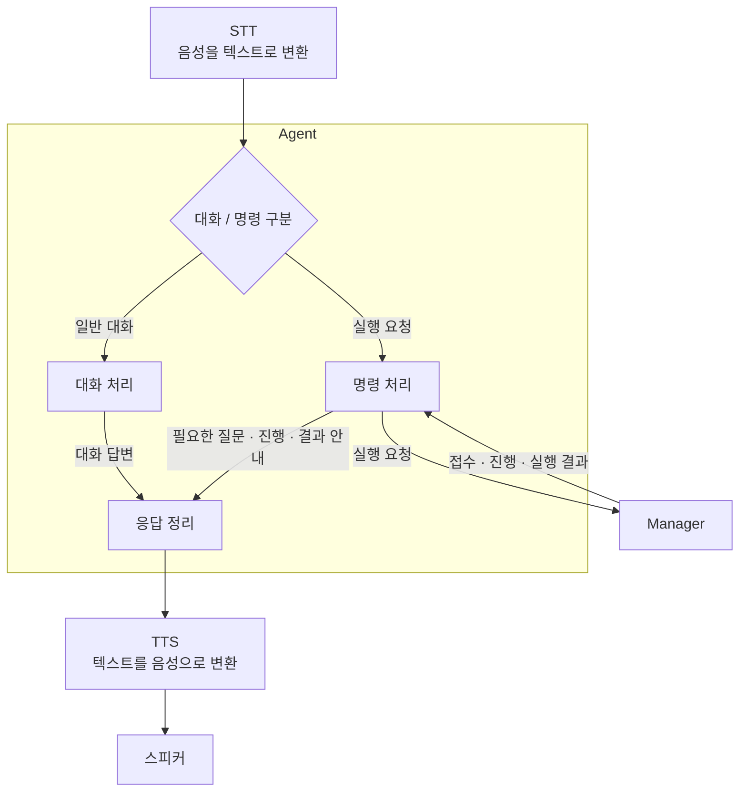

# Malbut Agent 명세 작성

## 1. 기능

상위 계층으로 부터 받은 텍스트를 해석하여 자유대화를 하거나 Manager에 기능을 요청하고 결과를 받는다.

### 대화/명령 판별기

- 받은 텍스트가 대화인지 명령인지를 구분한다.
- 받은 텍스트의 의도가 불명확하다면 재질문을 응답 정리 프로그램으로 보낸다.
- 만약 대화라면 텍스트 내용을 자유대화 프로그램으로 명령이라면 명령 구분 프로그램으로 보낸다.

### 명령 구분

- 받은 텍스트를 기반으로 이 명령이 어떤 tool을 필요로 하는지를 판단한다.
- 판단을 기반으로 필요한 tool과 tool에 들어갈 내용을 작성하여 Manager에 요청을 보낸다.
- tool 요청을 보낸 후 Manager로 부터 받은 결과를 응답정리 프로그램으로 보낸다.

### 응답정리

- 자유대화로 부터 받은 텍스트 내용을 정리하여 TTS에 전송한다.
- 대화/ 명령 구분 프로그램에서 재질문 요청이 들어올 시 정해진 형식에 맞는 재질문 텍스트를 TTS에 전송한다.
- 명령 구분 프로그램에서 결과가 들어오면 이 결과를 정리하여 TTS에 전송한다.