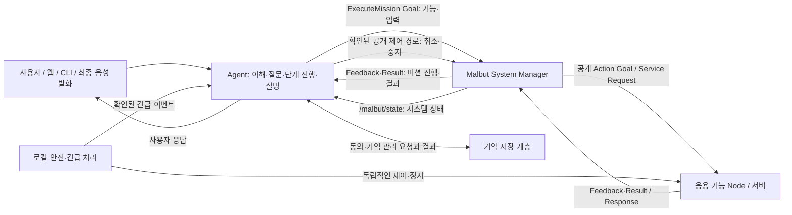

# Malbut Agent 기능 명세

## 1. 목적과 책임 경계

### 1.1 목적과 적용 대상

**Malbut Agent는 사용자의 대화와 요청을 이해하고, 필요한 기능을 Malbut System Manager(이하 Manager)에 요청하며, 확인된 상태와 결과를 사용자에게 전달한다.** 대화 문맥과 사용자가 허용한 개인화 기억을 활용하며, 복합 요청은 단계별 결과를 확인하면서 진행한다.

주 독자는 Agent·Manager·기능 Node·기억·음성 연동을 담당하는 팀원이다. 입력 주체는 인증된 사용자와 신뢰된 연동 계층이다. 사용자는 웹·CLI·음성을 통해 같은 의미의 요청을 할 수 있어야 한다. 채널 차이로 실행 권한이나 동작 의미가 바뀌지 않는다.

### 1.2 용어와 소유 책임

| 구성요소 | 소유하는 책임 | 다른 계층에 맡기는 책임 |
| --- | --- | --- |
| Agent | 대화·문맥 이해, 재질문, 기능·입력 선택, 요청별 계획·미션 연결, 복합 단계 진행, 기억 후보 결정, 결과 설명 | 실행 허가, 병행·선점 판단, 실제 제어, 안전 판정, 데이터 저장 수행 |
| LLM | Agent 내부의 의도·기능·기억 후보·응답 제안 | 제안의 실행 승인, 관측·완료 사실의 생성 |
| Manager | Manifest Registry의 등록 조회, 요청 검증, Mission Scheduler의 수락·거절·병행·선점 판단, Mission Executor의 공개 Action·Service 호출, 미션·취소·시스템 상태 관리 | 사용자의 실행 목표 선택, 자연어 대화 전체 해석, 응용 기능 내부 알고리즘 |
| 응용 기능 Node / Action·Service 서버 | 실제 기능, 요청값·조건부 입력·수치 범위 검증, Feedback·Result 제공, 취소 시 남은 목표·내부 상태 정리 및 하위 Goal 취소 전달 | Agent의 대화 계획, 시스템 전체의 병행·선점 정책 |
| 기억 저장 계층 | 사용자별 동의 상태·기억 저장·검색·정정·삭제, 변경 결과 제공 | 모델의 추측을 사실로 확정 |
| 음성 계층 | STT·TTS·VAD, 최종 발화·화자 정보, 재생·취소 결과 제공 | 로봇 기능 선택과 실행 허가 |
| 로컬 안전·긴급 처리 계층 | 실시간 안전 제약·정지, 긴급 감지·판정·연락 | LLM 응답을 기다린 뒤 안전 처리 |

`interface`는 공개 ROS 통신 규격, `Node`는 ROS 통신에 참여하는 실행 주체를 뜻한다. Agent라는 기능 주체의 이름은 유지한다. **계획**은 Agent가 원래 사용자 요청에 연결한 단계 목록이고, **미션**은 Manager가 관리하는 개별 실행이다. 여러 독립 요청·계획·미션을 하나의 현재 작업으로 합치지 않는다.

“Agent가 실행한다”는 **공개 실행 인터페이스로 Manager에 요청하고 결과를 확인한다**는 뜻이다. Agent가 관리 대상 응용 기능을 직접 실행하거나 모터를 제어한다는 뜻이 아니다. Bringup은 Manager와 응용 기능 서버를 실행하며, 기능 서버는 Goal·Request를 받을 때 실제 기능을 시작한다.

응용 기능의 내부 알고리즘·폴더·프로세스 구성은 담당자가 결정한다. 응용 패키지 사이에서는 공개 Topic·Service·Action으로 통신하고 다른 응용 패키지의 내부 소스를 import하지 않는다. Manager는 등록된 공개 인터페이스를 사용하며 기능별 관리자 전용 Handler·프록시를 새 통합 방식으로 두지 않는다.



관리자에게 보내는 공통 Goal·결과는 5.2절, 상태 해석은 5.4절, 아직 연결 근거가 제공되지 않은 조회·신원·중지 보장은 5.6절을 따른다.

### 1.3 확정된 동작 기준

| 기준        | 요구사항                                                                                        |
| ----------- | ----------------------------------------------------------------------------------------------- |
| 명확한 요청 | 대상·내용·범위가 확정되면 재확인 없이 Manager에 요청한다. 요청 사실과 범위는 보존한다.          |
| 실행 검증   | 재확인 생략은 Manager의 권한·가용성·현재 상태 검증을 생략하지 않는다.                           |
| 정보 부족   | 필요한 정보만 질문한다. 없는 장소·사람·사진·수신자·시간을 임의로 선택하지 않는다.               |
| 복합 요청   | Agent가 순서를 관리하고 앞 단계의 성공 및 필요한 결과를 확인한 뒤 다음 단일 기능을 요청한다.    |
| 부분 실패 | 거절·실패·사용자 취소·예상하지 못한 종료·결과 불명에서는 해당 계획의 뒤 단계를 시작하지 않고 부분 결과를 설명한다. 계획된 정상 종료와 유지된 미션의 일시 중단은 3.3절로 구분한다. |
| 독립 요청 | 명확한 독립 요청은 Manager에 전달하고 수락·거절·병행·선점 판단을 따른다. 기존 요청의 변경 의도가 모호할 때만 질문한다. |
| 미션 유지·재개 | Manager가 원래 요청 범위의 미션을 유지·재개한다고 확인하면 중복 요청 없이 관찰한다. 이미 취소·실패·결과 불명으로 끝난 계획은 자동 복원하지 않는다. |
| 이동 완료   | 목적지 도달과 정지 유지가 확인되어야 완료다. 별도 요청 없는 순찰·배회·도킹은 시작하지 않는다.   |
| 개인화      | 사용자가 동의한 경우 직접 진술한 일상 정보를 자동 저장한다. 추측은 확정 사실로 저장하지 않는다. |
| 결과 안내   | 접수·진행·완료를 구분하며, 관련 계층에서 확인한 사실만 전달한다.                                |

### 1.4 공개 계약과 등록 정보의 단일 원본

| 정보 | 최종 기준 |
| --- | --- |
| Goal·Request·Result·Feedback·Topic의 필드·ROS 자료형·상수·결과 의미 | `.action/.srv/.msg`와 해당 공개 인터페이스 설명 |
| 기능 ID·책임·명령 연결·입력 설명·기본값·실행 분류 | `malbut_interfaces/capabilities/*.yaml` |
| 빌드 후 등록 정보 위치 | `share/malbut_interfaces/capabilities/`; Manager는 이 위치의 Manifest로 관리 대상 기능을 구성 |
| 현재 실행 가능 여부·병행·선점 | Manager의 현재 상태와 정책 |
| 사용자 요청·대화·계획 단계·미션의 관계 | Agent 내부 문맥과 요청 기록 |

Capability Manifest는 ROS 표준을 대체하지 않는 Malbut 등록 규격이다. `capability.id`는 영문 소문자를 사용하는 고유 이름이며 `title`·`description`은 기능명과 책임을 설명한다. `schema_version`은 정수 `1`, `command.kind`는 `ACTION` 또는 `SERVICE`이며 `command.name`과 `command.type`은 실제 공개 명령에 연결된다. `input.fields`는 실제 Goal·Request의 필드·자료형과 일치해야 한다. `default`가 없으면 필수 입력이며, 제공된 기본값도 실제 ROS 타입에 맞아야 한다. 선택값은 ROS 인터페이스 상수를 참조하고 Manifest에 중복 정의하지 않는다. 사용자 선택을 임의로 만들거나 “나”의 식별을 기본값으로 대신하지 않는다.

등록 검증은 기능 ID·명령 이름의 중복, 명령 종류와 `/action/`·`/srv/` 타입의 일치, 입력 필드·자료형과 기본값의 일치, 실행 분류의 허용값을 확인한다. 조건부 입력과 수치 범위는 Action·Service 서버가 검사하고 반복 조정하는 안전값·튜닝값은 ROS parameter로 관리한다. 필드의 의미·단위와 Action의 성공·실패·취소 조건은 인터페이스 원문에서 설명한다. 응용 기능의 연속 데이터·상태는 Topic, 짧은 요청은 Service, Feedback·Result·취소가 필요한 장시간 기능은 Action을 사용한다. 거리·시간·각도·주기의 `_m`·`_s`·`_rad`·`_hz` 표기는 해당 인터페이스 작성 규칙을 따른다. 표준 ROS 2·Nav2 인터페이스의 의미가 맞으면 재사용하고 프로젝트 전용 정의만 `malbut_interfaces`에 둔다.

`execution.mode`는 `FOREGROUND` 또는 `BACKGROUND`, 기본 `priority`는 `LOW`·`NORMAL`·`HIGH`·`URGENT` 중 하나다. 전경 기능도 Manager가 허용하면 여러 개 실행될 수 있다. Agent는 이 분류를 로봇 전체 잠금이나 자체 선점 허가로 바꾸지 않으며 요청을 통과시키려고 등록 우선순위를 임의로 높이지 않는다. 실행 분류·우선순위는 기존 코드의 위험도나 simulation 표시와 다른 정보다.

등록 정보가 존재해도 현재 실행 가능·실행 허가를 뜻하지 않는다. Manifest와 실제 ROS 정의가 다르면 해당 등록을 실행 가능한 것으로 사용하지 않고 사유를 안내한다. Agent용 기능 안내도 이 원본을 참조하며 필드·상수를 별도 공개 원본으로 만들지 않는다.

## 2. 기능 목록과 기능별 동작

### 2.1 기능 목록과 추적 관계

기능 ID는 요구사항의 연결 기준이며 개발 순서나 우선순위를 뜻하지 않는다. C-01~C-07은 5절의 논리적 연동 계약, AT-01~AT-49는 6절의 수용 시나리오다. 모든 기능의 사용자 요청 해석·연동 요청·설명은 Agent가 소유하고, 아래 연동 계층이 실행 또는 저장을 소유한다.

| ID    | 기능                       | 연동 대상             | 계약                   | 수용 시나리오                                   |
| ----- | -------------------------- | ------------------------------- | ---------------------- | ----------------------------------------------- |
| AG-01 | 일반 대화와 의도 분류      | 대화 입력·응답 채널             | C-02                   | AT-01, AT-34                                    |
| AG-02 | 문맥 참조와 재질문 | 대화 문맥, 필요 시 Manager·기억 | C-01, C-02, C-05 | AT-03, AT-04, AT-35, AT-36, AT-43, AT-47, AT-48 |
| AG-03 | 가용성 확인·기능 선택·요청 | Manager | C-01, C-02, C-03 | AT-02, AT-10, AT-32, AT-36, AT-42, AT-43, AT-48 |
| AG-04 | 미지원·거절·해석 실패 안내 | Manager·응답 채널 | C-01, C-03 | AT-10, AT-11, AT-34, AT-42, AT-48, AT-49 |
| AG-05 | 로봇 상태 조회 | Manager·상태 source | C-01, C-03 | AT-12, AT-44 |
| AG-06 | 장소 이동 | Manager·주행 기능 | C-01, C-02, C-03, C-04 | AT-02, AT-05, AT-11, AT-49 |
| AG-07 | 현재 화면의 반려동물 감지  | Manager·감지 기능               | C-01, C-02, C-03       | AT-13                                           |
| AG-08 | 사진 촬영 | Manager·카메라·저장 기능 | C-01, C-02, C-03 | AT-06, AT-07, AT-14, AT-49 |
| AG-09 | 보호자 알림 | Manager·알림 기능 | C-01, C-02, C-03 | AT-06, AT-15, AT-16, AT-49 |
| AG-10 | 복합 요청의 단계 진행 | Manager·각 기능 | C-01, C-02, C-03, C-04 | AT-06, AT-07, AT-08, AT-09, AT-37, AT-38, AT-41, AT-42, AT-45, AT-46, AT-47 |
| AG-11 | 진행 조회와 결과 안내 | Manager | C-03 | AT-17, AT-33, AT-42, AT-44, AT-45, AT-46, AT-47, AT-49 |
| AG-12 | 진행 중 요청 변경 | Manager | C-01, C-02, C-03, C-04 | AT-18, AT-43 |
| AG-13 | 취소·중지 | Manager·실행 기능 | C-03, C-04 | AT-08, AT-19, AT-39, AT-46, AT-47, AT-49 |
| AG-14 | 기억 후보 추출과 자동 저장 | 기억 저장 계층                  | C-05                   | AT-20, AT-21, AT-24, AT-36, AT-40               |
| AG-15 | 기억 활용과 조회           | 기억 저장 계층                  | C-05                   | AT-20, AT-25                                    |
| AG-16 | 기억 정정과 삭제           | 기억 저장 계층                  | C-05                   | AT-21, AT-22                                    |
| AG-17 | 개인화 동의와 중단         | 기억 저장 계층                  | C-05                   | AT-23, AT-40                                    |
| AG-18 | 리마인더 생성 연동         | Manager·예약 기능               | C-01, C-02, C-03       | AT-26, AT-27                                    |
| AG-19 | 감정 표현 연동             | Manager·표현 기능               | C-01, C-02, C-03       | AT-28                                           |
| AG-20 | 사람 따라다니기 연동 | Manager·식별·추적 기능 | C-01, C-02, C-03, C-04 | AT-29, AT-41, AT-47, AT-48 |
| AG-21 | 음성 입출력 연동           | 음성 계층·Manager               | C-02, C-04, C-06       | AT-30                                           |
| AG-22 | 긴급 이벤트 안내           | 전용 긴급 처리 계층             | C-07                   | AT-31                                           |

아래 기능은 사용자 동작을 정의한다. 관리 대상 명령은 등록된 capability와 실제 ROS 입력을 C-02로 전달하며, 상태·기억·음성·긴급 관측은 각 공개 또는 전용 계약을 사용한다. 기존 Tool 이름은 5.2절의 호환 참고로만 구분한다. 아직 등록되지 않은 기능 ID·필드·endpoint는 만들지 않는다. 사진 식별자처럼 본문에서 `image_id`로 표현한 정보도 필요한 결과의 의미이며, 실제 ROS 필드 이름·자료형은 해당 인터페이스가 정한다.

### AG-01 일반 대화와 의도 분류

| 항목             | 명세                                                                                                          |
| ---------------- | ------------------------------------------------------------------------------------------------------------- |
| 목적             | 사용자의 발화에 자연스럽게 답하고 대화·질문·기능 요청·작업 제어를 구분한다.                                   |
| 사용자 요청 예시 | “안녕”, “오늘 뭐 하지?”, “거실에 가면 좋겠네.”                                                                |
| 필요한 정보      | 현재 발화, 사용자·대화 범위, 현재 문맥.                                                                       |
| 판단·처리 순서   | 발화가 실제 행동 요청인지 판단한다. 잡담·가정·인용을 실행 지시로 승격하지 않는다.                             |
| 연동 요청        | 일반 대화는 응답 채널만 사용한다. 실행 의도가 있으면 AG-02·AG-03 또는 AG-13으로 연결한다.                     |
| 사용자 응답      | 한국어를 기본으로 문맥에 맞춰 답한다. 알 수 없는 사실은 모른다고 말한다.                                      |
| 예외·취소 처리   | 실행 의도가 불명확하면 질문한다. 모델 오류는 이번 요청 해석 실패로 안내하며 기존 작업의 종료로 바꾸지 않는다. |
| 완료 조건        | 응답이 전달되고 요청하지 않은 로봇 행동이 발생하지 않는다.                                                    |

### AG-02 문맥 참조와 재질문

| 항목             | 명세                                                                                                                    |
| ---------------- | ----------------------------------------------------------------------------------------------------------------------- |
| 목적             | 후속 표현의 대상을 근거로 확정하고 실행에 필요한 누락 정보를 채운다.                                                    |
| 사용자 요청 예시 | “아까 말한 곳으로 가줘”, “그 사진 보내줘”, “거기로 가줘.”                                                               |
| 필요한 정보      | 현재 대화의 확정된 대상, 관련 작업·사진 식별 정보, 현재 가용성, 필요한 경우 허용된 기억.                                |
| 판단·처리 순서   | 현재 요청의 명시 정보와 3.1절의 문맥 기준을 적용한다. 유일한 대상이면 진행하고 여러 후보면 필요한 정보 하나를 질문한다. |
| 연동 요청        | C-01의 실제 후보·요건과 필요 시 C-05의 관련 기억을 조회한다. 필수 정보가 채워진 뒤 C-02로 기능을 요청한다.              |
| 사용자 응답      | “어느 장소로 갈까요?”처럼 부족한 정보와 실제 선택지를 짧게 제시한다. 명확해진 답을 반복 승인받지 않는다.                |
| 예외·취소 처리   | 사용자가 취소·주제 변경을 하면 해당 대기 질문을 폐기한다. 이전 질문의 답을 새 요청에 임의로 붙이지 않는다.              |
| 완료 조건        | 대상과 필요한 정보가 확정되어 다음 처리로 연결되거나, 대기·취소 사실이 명확하다.                                        |

### AG-03 가용성 확인·기능 선택·요청

| 항목             | 명세                                                                                                       |
| ---------------- | ---------------------------------------------------------------------------------------------------------- |
| 목적             | 사용자의 의도에 맞는 지원 기능과 인자를 선택해 Manager에 전달한다.                                         |
| 사용자 요청 예시 | “무슨 기능을 할 수 있어?”, “거실로 가줘.”                                                                  |
| 필요한 정보      | C-01의 현재 기능 목록·입력 조건·가용성, 명확한 사용자 요청, 인증된 사용자·로봇 범위.                       |
| 판단·처리 순서 | 1.4절의 등록·입력 기준으로 기능과 값을 맞춘다. 필수 사용자 선택이 모호하면 질문하고, 명확한 독립 요청은 기존 작업 중에도 전달한다. 병행·선점은 Manager가 판단한다. |
| 연동 요청 | C-02의 `ExecuteMission` Goal에 등록된 `capability_id`와 실제 입력을 담은 `arguments_yaml`을 전달한다. 원래 요청·단계와 Action 요청의 관계는 별도로 유지한다. |
| 사용자 응답      | 확인된 접수·거절을 알린다. “요청을 처리 중이에요”를 실행 완료로 표현하지 않는다.                           |
| 예외·취소 처리 | 등록 불일치·필수 입력·권한 결속 부족은 요청을 보류하고 사유 또는 필요한 정보를 안내한다. 별도 사전 가용성 조회 부재는 5.6절의 Manager 검증 경로로 구분한다. 거절·선점 결과를 따르고 기능명·입력·우선순위를 바꿔 우회하지 않는다. |
| 완료 조건        | 대응하는 Manager 작업·조회 결과가 연결되거나, 시작되지 않은 사유가 전달된다.                               |

### AG-04 미지원·거절·해석 실패 안내

| 항목             | 명세                                                                                                     |
| ---------------- | -------------------------------------------------------------------------------------------------------- |
| 목적             | 처리할 수 없는 요청의 이유와 실제 처리 범위를 설명한다.                                                  |
| 사용자 요청 예시 | “계단 올라가”, “배터리 부족해도 그냥 가”, 해석할 수 없는 발화.                                           |
| 필요한 정보      | 요청 의도, C-01의 지원 범위, C-03의 거절·실패 사유.                                                      |
| 판단·처리 순서   | 정보 부족은 AG-02로, 확실한 미지원·권한·안전 거절은 해당 이유 안내로 구분한다.                           |
| 연동 요청        | 필요한 가용성·결과만 조회한다. 명령의 이름·표현을 바꿔 재실행하지 않는다.                                |
| 사용자 응답      | “배터리가 부족해서 거실 이동이 거절됐어요”처럼 원인과 실행 여부를 설명한다.                              |
| 예외·취소 처리   | 원인이 확인되지 않으면 추측하지 않는다. 가능한 대안은 안내할 수 있으나 사용자 요청 없이 수행하지 않는다. |
| 완료 조건        | 실행되지 않았거나 결과가 불명확한 범위가 전달되고 원래 요청 밖의 행동이 시작되지 않는다.                 |

### AG-05 로봇 상태 조회

| 항목             | 명세                                                                                                          |
| ---------------- | ------------------------------------------------------------------------------------------------------------- |
| 목적             | 현재 배터리·위치 추정·하위 기능 상태를 확인해 답한다.                                                         |
| 사용자 요청 예시 | “배터리 얼마나 남았어?”, “카메라 쓸 수 있어?”                                                                 |
| 필요한 정보      | 대상 로봇, 요청한 상태 항목, 관측 출처·시각·유효성.                                                           |
| 판단·처리 순서 | `/malbut/state`의 시스템 상태와 개별 미션·기능 관측을 구분하고 항목별 유효성을 확인한다. `IDLE`로 작업 완료·물리 정지를 추정하지 않는다. `AUTONOMOUS`·`MANUAL`은 별도 제어 모드다. |
| 연동 요청 | C-03의 `/malbut/state` 및 확인된 공개 상태 관측·조회 경로를 사용한다. 배터리 등 실제 메시지에 없는 항목을 있다고 가정하지 않으며 미확인 경로는 5.6절을 따른다. |
| 사용자 응답      | 확인된 값과 필요한 시점 정보를 답한다. 없는 항목은 “현재 확인할 수 없어요”라고 구분한다.                      |
| 예외·취소 처리   | 오래된 관측·조회 실패는 상태 미확인이다. 이동·충전 등을 자동 시작하지 않는다.                                 |
| 완료 조건        | 유효한 상태 또는 확인 불가 사유가 전달된다.                                                                   |

### AG-06 장소 이동

| 항목             | 명세                                                                                                                         |
| ---------------- | ---------------------------------------------------------------------------------------------------------------------------- |
| 목적             | 등록된 장소로 이동을 요청하고 도착 후 대기까지 확인한다.                                                                     |
| 사용자 요청 예시 | “거실로 가줘.”                                                                                                               |
| 필요한 정보      | 유일하게 확정된 장소명, 대상 로봇, C-01의 이동 가용성. 실제 지도·주행·정지 판정은 Manager 소유다.                            |
| 판단·처리 순서   | 명확한 장소를 추가 재확인 없이 요청한다. Manager의 접수·이동·도달·정지 결과를 구분한다.                                      |
| 연동 요청 | 등록된 이동 capability의 실제 ROS 입력을 C-02로 요청한다. “거실”과 실제 지도 목표의 결속은 제공 계약을 따른다. 진행은 C-03, 취소·중지는 C-04다. `navigate`는 5.2절의 기존 표현이다. |
| 사용자 응답      | 실행이 확인되면 “거실로 이동 중이에요”, 완료 조건이 확인되면 “거실에 도착해 멈췄어요.”                                       |
| 예외·취소 처리   | 대상 중복은 질문, 가용성·안전 거절은 이유 안내, 결과 불명은 후속 단계 중단이다. 충전소 이동을 도킹 성공으로 설명하지 않는다. |
| 완료 조건        | Manager가 목적지 도달·해당 이동 종료·정지 유지를 확인한다. 별도 요청 없는 순찰·배회는 시작되지 않는다.                       |

### AG-07 현재 화면의 반려동물 감지

| 항목             | 명세                                                                                                      |
| ---------------- | --------------------------------------------------------------------------------------------------------- |
| 목적             | 이동 없이 현재 카메라 시야에서 반려동물이 관측되는지 확인한다.                                            |
| 사용자 요청 예시 | “지금 강아지 보여?”, “강아지 찾아줘.”                                                                     |
| 필요한 정보      | 현재 프레임의 유효성, 카메라·프라이버시 가용성, 반환된 감지 범위.                                         |
| 판단·처리 순서   | 현재 화면 확인 의도면 요청한다. “찾아줘”가 화면 감지인지 이동 수색인지 모호하면 먼저 질문한다.            |
| 연동 요청 | 등록된 현재 화면 감지 capability의 실제 입력을 C-02로 요청하고 C-03의 관측 범위·결과를 받는다. 기존 `detect_pet`를 새 capability ID로 가정하지 않는다. |
| 사용자 응답      | “현재 화면에는 강아지가 보이지 않아요”처럼 관측 범위 안에서 답한다.                                       |
| 예외·취소 처리   | 카메라·프라이버시 거절은 원인을 알린다. 미감지를 집 전체 부재로 단정하거나 자동 수색으로 확대하지 않는다. |
| 완료 조건        | 유효한 현재 화면 관측 또는 확인 불가 사유가 전달된다.                                                     |

### AG-08 사진 촬영

| 항목             | 명세                                                                                                                     |
| ---------------- | ------------------------------------------------------------------------------------------------------------------------ |
| 목적             | 현재 카메라 사진 한 장의 촬영·저장을 요청한다.                                                                           |
| 사용자 요청 예시 | “사진 한 장 찍어줘.”                                                                                                     |
| 필요한 정보      | 카메라·프라이버시·저장 가용성, 복합 요청인 경우 선행 단계의 성공.                                                        |
| 판단·처리 순서   | 명확한 촬영 요청을 추가 재확인 없이 전달한다. 파일 저장 결과까지 기다린다.                                               |
| 연동 요청 | 등록된 촬영 capability를 C-02로 요청하고, 기능별 Result와 C-03에서 해당 요청의 저장 상태·사용 가능한 사진 식별자를 확인한다. 실제 필드·자료형은 제공 계약을 따른다. |
| 사용자 응답      | 저장이 확인되면 사진 결과를 제공한다. 촬영 접수만 받은 상태는 촬영 완료로 말하지 않는다.                                 |
| 예외·취소 처리   | 저장 실패·결과 불명에서는 사진 전송 단계를 시작하지 않는다. 이미 저장된 사진은 취소만으로 삭제된 것으로 표시하지 않는다. |
| 완료 조건        | 해당 요청으로 촬영·저장된 사진과 사용 가능한 식별자가 확인된다. 외부 공유는 포함하지 않는다.                             |

### AG-09 보호자 알림

| 항목             | 명세                                                                                                                                |
| ---------------- | ----------------------------------------------------------------------------------------------------------------------------------- |
| 목적             | 등록된 보호자에게 사용자가 지정한 내용·사진을 전달하도록 요청한다.                                                                  |
| 사용자 요청 예시 | “보호자에게 ‘거실 확인했어’라고 보내줘”, “방금 찍은 사진 보내줘.”                                                                   |
| 필요한 정보      | 등록된 수신자, 확정된 내용, 사진이 있으면 사용자 소유의 정확한 `image_id`, 알림 기능이 보장하는 결과 단계.                          |
| 판단·처리 순서   | 수신자·내용·사진이 유일하게 정해지면 추가 재확인 없이 요청한다. 누락된 선택만 질문한다.                                             |
| 연동 요청 | 등록된 알림 capability의 실제 입력으로 확정된 내용·사진 참조를 C-02에 전달한다. 사진 없음의 표현과 수신자 결속은 제공 계약을 따르며 기존 Tool의 `image_id: null` 형식을 ROS에 강제하지 않는다. |
| 사용자 응답      | 알림 기능이 확인한 접수·전송·수신 단계를 정확히 표현한다. 열람 증거 없이 “보호자가 확인했어요”라고 말하지 않는다.                   |
| 예외·취소 처리   | 타인 사진·미등록 수신자는 전달하지 않는다. 응답 유실 시 자동 재전송하지 않으며 이미 전달된 알림을 취소로 회수했다고 말하지 않는다.  |
| 완료 조건        | C-01에 선언된 알림 기능의 최종 결과 단계와 식별자가 확인된다. 접수까지만 보장하는 기능이면 “전송 요청 접수 완료”로 범위를 한정한다. |

사진만 보내 달라는 요청은 그 사진 자체가 전달 내용이다. 사용자가 별도 문구를 지정하지 않았으면 필수 `message`는 **“사진을 보냅니다.”**로 고정하며 추가 질문이나 새로운 주장을 넣지 않는다. 사용자가 문구를 지정했다면 그 내용을 보존한다. 사진도 본문도 특정하지 않은 “알림 보내줘”는 필요한 내용을 질문한다.

### AG-10 복합 요청의 단계 진행

| 항목             | 명세                                                                                                                          |
| ---------------- | ----------------------------------------------------------------------------------------------------------------------------- |
| 목적             | 여러 기능이 필요한 하나의 사용자 요청을 단계별로 진행한다.                                                                    |
| 사용자 요청 예시 | “거실에 가서 사진 찍고 보호자에게 보내줘.”                                                                                    |
| 필요한 정보      | 원래 요청 범위, 단계 순서, 단계별 필수 정보·가용성·완료 조건, 선행 결과와 후행 입력의 연결.                                   |
| 판단·처리 순서 | 필수 사용자 선택은 시작 전에 채운다. 단계마다 선행 성공·필수 결과와 원래 장소·대상 등 전제의 현재 유효성을 확인한 뒤 요청한다. 병행 미션 때문에 전제가 바뀌거나 실행 시점 보장이 미확인이면 해당 계획의 뒤 단계를 중단하고 안내한다. |
| 연동 요청 | 같은 계획은 단계마다 C-02의 단일 `ExecuteMission` 요청을 보내고 C-03 결과를 해당 단계에 연결한다. 전체 계획을 Manager에 일괄 위임하지 않는다. 별도 요청의 병행은 Manager 판단을 따른다. |
| 사용자 응답      | 전체 처리 순서와 의미 있는 진행·부분 완료·최종 결과를 알린다. 원래 명확한 요청을 단계마다 다시 승인받지 않는다.               |
| 예외·취소 처리 | 해당 계획의 거절·실패·사용자 취소·예상하지 못한 종료·결과 불명은 뒤 단계 중단이다. Manager가 원래 범위의 미션을 유지·재개한다고 확인하면 중복 요청 없이 관찰하며 상세 규칙은 3.3절을 따른다. |
| 완료 조건        | 모든 요청 단계의 완료 조건을 충족하거나, 완료·중단·미수행 단계를 구분해 전달한다.                                             |

### AG-11 진행 조회와 결과 안내

| 항목             | 명세                                                                                                                        |
| ---------------- | --------------------------------------------------------------------------------------------------------------------------- |
| 목적             | 현재 작업과 전체 요청의 진행·결과를 근거에 맞춰 설명한다.                                                                   |
| 사용자 요청 예시 | “지금 어디까지 했어?”, “사진 보냈어?”                                                                                       |
| 필요한 정보 | 질문 대상 사용자 요청·계획 단계·Action 요청·mission_id의 연결, 최신 유효 Feedback·Result 또는 확인된 공개 조회 결과. |
| 판단·처리 순서 | 여러 요청이면 문맥으로 대상을 확정하거나 질문한다. 계획 진행·미션 상태·전체 시스템 상태를 구분하며 유지된 미션의 재개는 연속성 확인 후 관찰한다. |
| 연동 요청 | C-03의 해당 미션 Feedback·Result와 확인된 조회 경로를 사용한다. `/malbut/state`만으로 특정 요청의 성공을 판정하지 않고 조회·재연결 경로 미확인은 5.6절을 따른다. |
| 사용자 응답      | “이동은 끝났고 사진을 저장 중이에요”처럼 완료된 부분과 현재 단계를 설명한다.                                                |
| 예외·취소 처리   | 진행률을 시간 경과로 추측하지 않는다. 중복·늦은 이벤트는 상태를 되돌리지 않으며 조회 실패는 기존 작업 실패로 바꾸지 않는다. |
| 완료 조건        | 해당 작업의 확인된 상태 또는 결과 확인 불가가 전달된다.                                                                     |

### AG-12 진행 중 요청 변경

| 항목             | 명세                                                                                                                                                  |
| ---------------- | ----------------------------------------------------------------------------------------------------------------------------------------------------- |
| 목적             | 사용자가 바꾼 대상·내용을 원래 요청과 충돌하지 않게 반영한다.                                                                                         |
| 사용자 요청 예시 | “거실 말고 주방으로 가줘”, “사진만 찍고 보내지는 마.”                                                                                                 |
| 필요한 정보      | 변경할 요청·단계, 이미 발생한 결과, 새 대상·범위, 현재 작업 상태.                                                                                     |
| 판단·처리 순서 | 독립 요청은 AG-03으로 처리한다. 기존 요청의 변경이면 미요청 단계만 수정하거나, 실행 중 목표를 대체할 때 관련 뒤 단계를 보류하고 기존 작업 취소·필요한 정지 확인 후 새 요청을 보낸다. |
| 연동 요청        | C-04의 기존 작업 취소, C-03의 종료 확인, C-01·C-02의 변경된 기능 요청을 사용한다.                                                                     |
| 사용자 응답      | 적용된 변경과 되돌릴 수 없는 완료 결과를 설명한다. 새 요청이 명확하면 다시 승인받지 않는다.                                                           |
| 예외·취소 처리   | 취소 결과 불명에서는 충돌하는 새 작업을 시작하지 않는다. 변경 대상이 여러 개면 질문하고 관련 미수행 단계는 보류한다.                                  |
| 완료 조건        | 변경된 요청이 연결되거나 변경할 수 없는 이유가 전달된다. 이전 요청의 늦은 결과가 변경 내용을 덮어쓰지 않는다.                                         |

### AG-13 취소·중지

| 항목             | 명세                                                                                                                                                         |
| ---------------- | ------------------------------------------------------------------------------------------------------------------------------------------------------------ |
| 목적             | 원치 않는 요청·행동과 남은 계획을 중단하고 실제 종료 상태를 알린다.                                                                                          |
| 사용자 요청 예시 | “취소해”, “그만해”, “멈춰”, 명시적인 정지 버튼.                                                                                                              |
| 필요한 정보 | 현재 문맥에서 취소할 요청·계획·미션의 연결, 대상 로봇과 제어 권한, 실행·정지 결과. 여러 독립 요청의 취소 범위를 구분한다. |
| 판단·처리 순서 | 실행 전에는 해당 대기를 폐기한다. 진행 중에는 특정된 미션 취소와 그 계획의 남은 단계 중단을 요청한다. 대상 로봇의 명확한 즉시 중지는 LLM 응답 완료나 추가 승인 질문을 기다리지 않는다. |
| 연동 요청 | C-04의 해당 미션 Action 취소 또는 확인된 로봇 전체 중지 경로를 사용하고 종료·정지 근거를 받는다. 미션 취소를 전체 정지로 대신 표시하지 않으며 경로·결과 미확인은 5.6절을 따른다. |
| 사용자 응답      | “중지를 요청했어요”와 “멈췄어요”를 구분한다. 결과가 없으면 정지 확인 불가를 알린다.                                                                          |
| 예외·취소 처리   | 작업 대상이 모호하면 조회·질문한다. 대상 로봇이 명확한 즉시 정지 요청을 이 질문 때문에 늦추지 않는다. 이미 저장·전송된 결과는 되돌린 것으로 표시하지 않는다. |
| 완료 조건 | 개별 미션 취소는 그 미션의 목표·하위 동작 종료와 해당 계획의 남은 단계 중단으로 판정한다. 다른 허가된 미션의 동작은 별도로 안내한다. 로봇 전체 중지 요청은 해당 범위의 물리 정지 유지까지 확인하며, 개별 취소를 “로봇이 멈췄어요”로 확대하지 않는다. |

### AG-14 기억 후보 추출과 자동 저장

| 항목             | 명세                                                                                                                                    |
| ---------------- | --------------------------------------------------------------------------------------------------------------------------------------- |
| 목적             | 동의한 사용자가 직접 말한 일상 정보를 개인화 기억으로 보존한다.                                                                         |
| 사용자 요청 예시 | “내 이름은 민수야”, “우리 강아지 이름은 두부야”, “난 조용한 음악을 좋아해.”                                                             |
| 필요한 정보      | 신뢰된 사용자 범위·개인화 동의 상태, 직접 진술과 출처, 같은 대상의 기존 기억.                                                           |
| 판단·처리 순서   | 4.2절의 저장 범위에 해당하는 직접 진술을 추출한다. 동의·중복·충돌을 확인해 저장을 요청한다. 매 항목의 저장 승인을 반복 요구하지 않는다. |
| 연동 요청        | C-05로 사용자·대상·사실·원문 출처가 연결된 저장을 요청한다.                                                                             |
| 사용자 응답      | 대화를 자연스럽게 이어간다. 저장 성공 안내를 한다면 실제 저장 확인 뒤에만 한다.                                                         |
| 예외·취소 처리   | 미동의·화자 불명·추측·인용은 자동 저장하지 않는다. 저장 실패를 숨기고 기억했다고 약속하지 않으며 대화 자체는 계속할 수 있다.            |
| 완료 조건        | 허용된 사실의 저장 결과가 확인되거나 저장하지 않은 이유가 결정된다.                                                                     |

### AG-15 기억 활용과 조회

| 항목             | 명세                                                                                                                   |
| ---------------- | ---------------------------------------------------------------------------------------------------------------------- |
| 목적             | 관련된 유효 기억으로 대화를 이어가고 사용자가 자신의 기억을 확인하게 한다.                                             |
| 사용자 요청 예시 | “우리 강아지 이름이 뭐였지?”, “나에 대해 뭘 기억해?”                                                                   |
| 필요한 정보      | 현재 사용자, 질문과 관련된 기억·출처·유효 상태, 개인화 설정.                                                           |
| 판단·처리 순서   | C-05에서 해당 사용자 범위의 유효한 기억을 검색한다. 개인화 응답과 명시적 기억 관리 조회를 구분한다.                    |
| 연동 요청        | C-05의 관련 기억 검색 또는 사용자 범위 목록 조회.                                                                      |
| 사용자 응답      | “전에 두부라고 알려줬어요”처럼 기억의 근거를 반영한다. 기억이 없거나 충돌하면 없다고 알리거나 질문한다.                |
| 예외·취소 처리   | 타인·삭제·무효 기억은 사용하지 않는다. 개인화를 끈 상태에서는 자발적 기억 활용을 중단하되 명시적 관리 조회는 허용한다. |
| 완료 조건        | 허용된 기억 또는 기억 없음·확인 불가가 전달된다.                                                                       |

### AG-16 기억 정정과 삭제

| 항목             | 명세                                                                                                            |
| ---------------- | --------------------------------------------------------------------------------------------------------------- |
| 목적             | 사용자가 잘못된 기억을 고치거나 기억 사용을 끝낼 수 있게 한다.                                                  |
| 사용자 요청 예시 | “이름이 두부가 아니라 콩이야”, “그 이름은 이제 기억하지 마.”                                                    |
| 필요한 정보      | 사용자 소유의 대상 기억, 명시적인 정정 내용 또는 삭제 범위.                                                     |
| 판단·처리 순서   | 대상이 하나로 확정되면 추가 재확인 없이 정정·삭제를 요청한다. 불명확하면 실제 후보를 질문한다.                  |
| 연동 요청        | C-05의 조회·정정·삭제와 완료 결과를 사용한다.                                                                   |
| 사용자 응답      | 성공이 확인되면 바뀐 사실 또는 삭제 범위를 알린다. 실패·미확인은 완료로 안내하지 않는다.                        |
| 예외·취소 처리   | 요청 범위를 넓혀 다른 기억을 삭제하지 않는다. 정정·삭제 중 생성된 낡은 응답은 변경 결과를 확인한 후 재검토한다. |
| 완료 조건        | 정정·삭제가 확인되고 이후 검색·개인화에 반영된다. 과거 문맥에서 삭제 사실이 자동 복원되지 않는다.               |

### AG-17 개인화 동의와 중단

| 항목             | 명세                                                                                                                           |
| ---------------- | ------------------------------------------------------------------------------------------------------------------------------ |
| 목적             | 사용자가 자동 기억과 개인화 활용 여부를 제어하게 한다.                                                                         |
| 사용자 요청 예시 | 개인화 설정의 동의, “앞으로 내 정보를 자동으로 기억하지 마.”                                                                   |
| 필요한 정보      | 인증된 사용자, 자동 저장·활용에 대한 명시적 동의 또는 중단 의사, 저장된 설정.                                                  |
| 판단·처리 순서   | 동의 없이는 자동 기억을 시작하지 않는다. 중단 요청을 받으면 새 자동 저장·활용을 즉시 억제하고 설정 변경을 요청한다.            |
| 연동 요청        | C-05의 동의 상태 조회·변경과 해당 변경 이후 기록·조회 범위 확인.                                                               |
| 사용자 응답      | “자동 기억과 개인화 활용을 중단했어요. 기존 기억 삭제는 별도로 요청할 수 있어요”처럼 실제 변경 범위를 알린다.                  |
| 예외·취소 처리   | 설정 결과를 확인하지 못하면 저장 완료를 주장하지 않고 자동 저장·활용 억제를 유지한다. 중단을 기존 기록 삭제로 설명하지 않는다. |
| 완료 조건        | 개인화 상태가 확인되고 이후 동작에 반영된다. 과거 대화나 재접속만으로 다시 활성화하지 않는다.                                  |

### AG-18 리마인더 생성 연동

| 항목             | 명세                                                                                                                                                         |
| ---------------- | ------------------------------------------------------------------------------------------------------------------------------------------------------------ |
| 목적             | 사용자가 지정한 내용과 시각의 알림 예약을 요청한다.                                                                                                          |
| 사용자 요청 예시 | “내일 오전 8시에 약 먹으라고 알려줘.”                                                                                                                        |
| 필요한 정보      | 내용, 정규화할 날짜·시각, 신뢰된 사용자 시간대, 명시된 반복 조건, 사용자 소유 범위.                                                                          |
| 판단·처리 순서   | 날짜·시간대가 확정되면 추가 재확인 없이 요청하고 응답에 확정 시각을 표시한다. 오전·오후 등이 불명확하면 질문한다.                                            |
| 연동 요청 | 등록된 예약 capability의 실제 입력에 내용·정규화 시각·시간대 등 확정 정보를 맞춰 C-02로 요청한다. 소유 범위의 전달은 신뢰된 연동 계약을 따르며 Goal에 없는 필드를 추가하지 않는다. |
| 사용자 응답      | 예약 식별자와 저장된 시각을 근거로 예약 완료를 알린다.                                                                                                       |
| 예외·취소 처리   | 과거 시각·미지원 반복·예약 실패는 안내하고 다른 날짜로 임의 변경하지 않는다. 생성 취소는 AG-13을 따르며 이미 저장된 예약을 지웠다고 말하지 않는다.           |
| 완료 조건        | 저장된 예약과 `scheduled`에 해당하는 결과가 확인된다. 실제 시각의 알림 전달은 별도 이벤트다.                                                                 |

### AG-19 감정 표현 연동

| 항목             | 명세                                                                                                                      |
| ---------------- | ------------------------------------------------------------------------------------------------------------------------- |
| 목적             | 사용자 요청에 맞는 지원 감정 표현을 요청한다.                                                                             |
| 사용자 요청 예시 | “기쁜 표정 해줘.”                                                                                                         |
| 필요한 정보      | 기능이 제공한 감정 태그·표현 범위·기본 지속시간 또는 사용자가 지정한 시간.                                                |
| 판단·처리 순서   | 요청을 지원 태그에 대응시킨다. 명확하면 요청하고, 표현 의미가 여러 후보로 갈리면 질문한다.                                |
| 연동 요청 | 등록된 표현 capability와 실제 인터페이스의 지원 태그·지속시간 입력을 C-02로 전달하고 C-03으로 결과를 받는다. 기존 `express_emotion`는 capability ID의 근거가 아니다. |
| 사용자 응답      | 필요 시 접수·표현 완료·실패를 짧게 알린다. 물리 렌더링 결과는 하위 기능의 사실을 따른다.                                  |
| 예외·취소 처리   | 미지원 태그를 만들거나 표정 요청을 이동 베이스 제어로 바꾸지 않는다. 취소 시 실제 중단 가능 여부를 따른다.                |
| 완료 조건        | 표현 기능이 계약상 완료를 반환한다. 접수만으로 렌더링이 끝났다고 설명하지 않는다.                                         |

### AG-20 사람 따라다니기 연동

| 항목             | 명세                                                                                                                                                                                                    |
| ---------------- | ------------------------------------------------------------------------------------------------------------------------------------------------------------------------------------------------------- |
| 목적             | 명확히 식별된 대상의 따라가기 시작·진행·중단을 연결한다.                                                                                                                                                |
| 사용자 요청 예시 | “나를 따라와”, “이제 따라오지 마.”                                                                                                                                                                      |
| 필요한 정보      | 신뢰된 요청자와 관측 대상의 결속, 추적 가용성, 활성 작업, 하위 기능의 안전 제약.                                                                                                                        |
| 판단·처리 순서   | “나”와 실제 대상이 유일하게 연결되면 추가 재확인 없이 시작한다. 복수 대상·식별 불가는 질문하고 임의의 첫 사람을 선택하지 않는다.                                                                        |
| 연동 요청 | 등록 ID `follow_person`을 C-02로 요청한다. 실제 명령은 `follow_person`, 타입은 `malbut_interfaces/action/FollowPerson`이며 Goal의 `target_mode`, `target_person_id`, `desired_distance_m`와 상수는 원문을 따른다. 중단은 새 `stop_follow` 기능을 가정하지 않고 해당 미션의 C-04 취소로 연결한다. |
| 사용자 응답      | 대상 획득과 따라가기 상태가 확인되어야 “따라가고 있어요”라고 말한다. 시작과 작업 종료를 구분한다.                                                                                                       |
| 예외·취소 처리 | 대상 상실·안전 중단은 사실대로 알리고 임의의 새 대상을 추적하지 않는다. Manifest 기본값은 “나”의 식별 근거가 아니다. 취소 접수와 정지를 구분하고 계획된 종료·일시 중단은 3.3절을 따른다. |
| 완료 조건 | 대상 획득·활성 세션은 진행으로 안내한다. 지속 작업의 종료는 해당 추적 목표·하위 동작의 종료로 확인하고 다른 허가된 미션의 움직임과 구분한다. 정지를 요구한 전체 중지·계획 전환은 정지 근거까지 확인한다. 계획된 정상 종료는 3.3절을 따른다. |

### AG-21 음성 입출력 연동

| 항목             | 명세                                                                                                                                                                  |
| ---------------- | --------------------------------------------------------------------------------------------------------------------------------------------------------------------- |
| 목적             | 최종 음성 발화를 공통 요청으로 처리하고 생성된 응답을 음성 출력에 연결한다.                                                                                           |
| 사용자 요청 예시 | 음성으로 “거실로 가줘”, “말 그만해”, 정지 버튼 입력.                                                                                                                  |
| 필요한 정보      | 최종 transcript, 발화·대화 식별 정보, 필요한 화자 결속·인식 유효성, 재생 상태.                                                                                        |
| 판단·처리 순서   | 최종 발화만 기능 요청에 사용한다. 인식이 불확실하면 질문한다. 응답 텍스트를 발화 요청으로 연결한다.                                                                   |
| 연동 요청        | C-06의 최종 입력·발화·발화 취소, 로봇 기능은 C-02·C-04로 전달한다.                                                                                                    |
| 사용자 응답      | 텍스트 생성·재생 접수·실제 재생 완료를 구분한다. “말 그만해”는 발화 취소이며 로봇 작업 취소로 확대하지 않는다.                                                        |
| 예외·취소 처리   | 중간 transcript는 실행하지 않는다. TTS 실패는 로봇 작업 실패로 덮어쓰지 않고 가능한 텍스트 채널로 결과를 남긴다. 명시적 로봇 중지는 음성 생성 완료를 기다리지 않는다. |
| 완료 조건        | 최종 입력이 한 번 처리되고 음성 출력 또는 실패·취소 상태가 확인된다. 로봇 작업의 완료는 별도로 판정한다.                                                              |

### AG-22 긴급 이벤트 안내

| 항목             | 명세                                                                                                |
| ---------------- | --------------------------------------------------------------------------------------------------- |
| 목적             | 전용 긴급 처리 계층이 확인한 사건과 처리 상태를 사용자에게 알린다.                                  |
| 사용자 요청 예시 | 긴급 이벤트 수신, “연락됐어?”                                                                       |
| 필요한 정보      | 사건 식별자, 출처·발생 시각, 확인된 원인과 연락·처리 상태.                                          |
| 판단·처리 순서   | C-07의 사건 범위에 연결해 상태를 설명한다. Agent가 긴급 판정이나 연락 성공을 만들어내지 않는다.     |
| 연동 요청        | C-07의 사건 이벤트·조회. 긴급 기능은 Agent의 일반 Tool 실행 흐름과 독립적으로 동작한다.             |
| 사용자 응답      | “연락 요청 중이에요”, “전달에 실패했어요” 등 확인된 단계를 안내한다.                                |
| 예외·취소 처리   | Agent·LLM 장애가 전용 긴급 처리를 막지 않는다. 일반 대화의 취소를 긴급 연락 취소로 적용하지 않는다. |
| 완료 조건        | 유효한 사건 상태 또는 확인 불가가 전달된다. 안내 완료가 긴급 상황 종료를 뜻하지 않는다.             |

## 3. 대화·복합 요청 처리 규칙

### 3.1 요청 해석과 재질문

현재 발화의 명시적인 대상·내용을 우선한다. 지시어는 현재 대화에서 해당 종류의 대상이 하나로 확정되고, 취소·대체되지 않았으며, Manager 또는 저장 계층이 현재 유효성을 확인할 수 있을 때만 해소한다. 단순히 가장 최근에 언급됐다는 이유로 여러 후보 중 하나를 고르지 않는다. 허용된 장기 기억은 표현 이해를 돕지만 이전의 기능 실행 요청이나 동의를 새 요청으로 만들지 않는다.

- 목적지·수신자 등 사용자 선택이 필요한 항목은 실제 후보 하나로 정해져야 한다. 안전한 실행에 필요한 관측·지도 결속은 Manager가 검사한다.
- 요청 범위가 명확하면 “정말 할까요?”를 반복하지 않는다. 현재 사용자 요청이 실행 의사의 근거이며 Manager의 허가와는 별개다.
- “네”는 같은 대화의 유효한 질문에만 연결한다. “네, 대신 주방으로”는 변경된 내용으로 처리한다.
- 의문·가정·부정·인용은 실제 지시와 구분한다. “멈추지 마”나 문서 속 “멈춰”를 정지 지시로 처리하지 않는다.
- 세션 초기화·종료 시 이전 질문·미요청 단계·늦은 추론 응답은 폐기한다. 이미 시작한 작업은 Manager에서 계속 추적하고 취소 요청 없이는 취소됐다고 말하지 않는다.

### 3.2 공통 처리 흐름

`요청·사용자 범위 확인 → 의도·필수 정보 해석 → 가용 기능과 인자 선택 → 필요 시 재질문 → Manager 요청 → 결과에 따른 안내·다음 단계`

일반 대화는 기능 실행 요청이 없다. 기억·음성·긴급 이벤트는 각 전용 계약을 사용한다. 실행할 기능을 선택하는 것과 실행 허가는 분리한다. Manager는 요청마다 현재 권한·대상·가용성·안전 조건을 검사하며, Agent는 거절을 우회하지 않는다.

같은 클라이언트 요청의 재전송은 기존 요청·미션과 연결하며 새 실행을 만들지 않는다. 같은 식별 정보에 내용이 다르면 충돌로 안내한다. 이 규칙은 결과 불명인 `ExecuteMission` Goal을 재전송하라는 뜻이 아니다. 자연어가 같더라도 명시적인 새 요청과 전송 재시도는 구분한다. 요청·Action·미션 연결과 Manager의 중복 방지·재조회 보장은 5.2절·5.6절을 따른다.

### 3.3 복합 요청과 단계 전환

Agent는 원래 요청별로 단계 순서·상태·선행 결과의 후행 입력 연결과 각 미션을 유지한다. 전체 계획을 Manager에 넘겨 자체 진행하게 하지 않고 매 단계 단일 `ExecuteMission` 요청을 보낸다. 이 순서는 한 계획 안의 의존관계이며 다른 독립 요청을 포함한 시스템 전체의 병행 제한이 아니다.

1. 사용자 선택으로 채워야 하는 필수 정보와 전체 단계의 지원 여부를 시작 전에 확인한다. 처음부터 뒤 단계가 미지원이면 먼저 알리고, 수행 가능한 부분만 실행할지 사용자의 새 의사를 받는다.
2. 앞 단계의 결과로 생성되는 값은 누락 정보가 아니다. 예를 들어 촬영 후 사용할 `image_id`는 선행 결과를 기다리도록 연결한다.
3. 기능의 성공·필수 결과와 후속 단계가 요구하는 장소·대상 등 전제의 현재 유효성을 확인해야 다음 단계로 전환한다. 병행 미션이 전제를 바꿨거나 실행 시점에 유지된다는 보장이 미확인이면 해당 계획의 뒤 단계를 중단하고 부분 결과를 안내한다. 예를 들어 거실 도착 후 별도의 주방 이동이 실행됐다면 주방 촬영을 거실 사진으로 대신하지 않는다. 거실 복귀 같은 추가 행동은 새 사용자 요청 없이 만들지 않는다. 성공 표시가 있어도 필수 사진 ID 등이 없으면 같은 중단 규칙을 적용한다.
4. 매 단계 요청 시 확인된 현재 가용성과 Manager의 실행 검증 결과를 적용한다. 사전 조회가 없는 경우는 5.6절을 따른다. 거절·실패·사용자 취소·예상하지 못한 종료·결과 불명이 발생하면 해당 계획의 뒤 단계를 중단한다. 계획에 따른 정상 종료와 Manager가 확인한 미션 유지·일시 중단은 아래 규칙으로 구분한다.
5. 사용자 취소·실패·결과 불명 등으로 끝난 계획은 시간 경과·연결 복구·충전 완료·늦은 성공만으로 자동 복원하지 않는다. 새 사용자 요청이 명확하면 확인된 완료 결과를 재사용할 수 있으나 사진·대상의 현재 유효성을 다시 확인한다.

지속 작업인 따라다니기의 “시작됨”은 전체 작업 성공이 아니다. “따라오다가 사진 찍어줘”처럼 종료·전환 조건이 없으면 실행 전에 그 조건을 질문한다. 원래 요청에 없는 종료 시각이나 병렬 실행을 만들어내지 않는다.

“5분 동안 따라오고 멈춘 뒤 사진 찍어줘”처럼 전환 조건이 명확하면 그 조건도 원래 요청 범위로 Manager에 전달한다. Manager가 해당 조건을 관측할 수 있는지 시작 전에 확인한다. 조건 충족을 확인하면 계획에 따른 단계 종료를 C-04로 요청하거나 그 종료 결과를 기다린다. Manager가 **요청된 조건 충족과 정상적인 단계 종료·정지**를 확인했을 때만 다음 단계로 진행한다. 하위 제어에 취소가 사용됐더라도 사용자 전체 취소와 같은 뜻으로 처리하지 않는다. 이유가 구분되지 않는 취소, 사용자 중단, 안전 중단, 예상하지 못한 종료는 뒤 단계를 중단한다.

충전이나 선점 상황에서 Manager가 **원래 요청 범위의 미션을 유지·일시 중단·재개한다고 확인하면**, Agent는 해당 단계의 관찰을 유지하고 새 실행 요청을 보내지 않는다. 미션이 유지된다는 사실만으로 성공이나 다음 단계 실행을 결정하지 않는다. 재개된 미션의 실제 완료 조건과 필수 결과를 확인한 뒤에만 다음 단계로 진행한다. 관리자 내부의 재실행 방식이나 ROS Goal 식별자가 반드시 같아야 한다는 정책은 정하지 않으며, 공개 근거로 원래 요청과의 연속성을 확인한다.

일시 중단·재개 근거가 없거나 원래 요청 범위를 벗어나면 임의로 이어 붙이지 않는다. 결과를 확인할 수 없으면 결과 불명으로 안내하고 해당 계획의 뒤 단계를 중단한다. 이미 취소·실패·결과 불명으로 끝난 계획은 이후 Manager가 미션을 재개했다고 알려도 자동 복원하지 않으며, 현재 미션 사실과 종료된 계획의 상태를 구분해 안내한다.

### 3.4 실행 중 대화·새 요청·변경·취소

| 입력                                     | Agent 처리                                                                                                                                                    |
| ---------------------------------------- | ------------------------------------------------------------------------------------------------------------------------------------------------------------- |
| 일반 대화·현재 상태 질문                 | 기존 작업을 유지하며 응답·조회한다.                                                                                                                           |
| 명확한 독립 요청 | 별도 요청·계획으로 C-02에 전달하고 Manager의 수락·거절·병행·선점 결과를 안내한다. Agent가 일괄 직렬화·전경 독점·자동 대기열 정책을 만들지 않는다. |
| 독립 요청인지 기존 계획 변경인지 모호함 | 필요한 의도만 질문한다. 질문 중에는 기존 작업을 유지하고 새로운 실행·취소 요청을 만들지 않는다. |
| 명확한 변경 요청                         | 진행 작업의 목표·선행 조건이 그대로이면 미요청 단계만 수정하고 현재 작업은 유지한다. 진행 작업 자체를 대체할 때만 AG-12의 취소·정지 확인 후 새 요청을 보낸다. |
| “취소해”, “그만해” | 문맥으로 특정된 요청의 현재 미션 취소와 남은 계획 중단을 요청한다. 여러 후보면 대상을 질문한다. 다른 독립 요청과 완료된 효과는 보존한다. |
| 대상 로봇에 대한 “멈춰” 또는 정지 버튼   | C-04의 로봇 중지를 즉시 요청하고 남은 움직임 계획을 중단한다.                                                                                                 |
| “말 그만해”                              | C-06의 발화 취소만 요청한다. 별도의 로봇 중지 의사가 없다면 진행 작업은 유지한다.                                                                             |

사용자의 일반 중지 후에는 자동으로 이전 행동을 재개하지 않는다. Manager가 유지한 미션의 일시 중단·재개는 3.3절의 별도 규칙이다. 정지가 확인된 뒤 새 명확한 사용자 요청과 Manager 검증으로 새 작업을 시작할 수 있다. 비상 정지·안전 차단 해제는 별도 로컬 정책을 따르며 새 이동 요청만으로 해제되지 않는다.

### 3.5 결과 설명과 불확실성

5.3절의 상태 의미를 사용자 응답에 유지한다. 같은 작업의 중복·늦은 진행 이벤트가 종료 상태를 되돌리지 않도록 한다. 필요한 경우 같은 작업을 조회하며, 조회 실패를 작업 자체의 실패로 바꾸지 않는다.

실행 요청 후 접수·실행 결과를 확인할 수 없으면 결과 불명이다. Agent는 명령을 자동 재전송하거나 해당 계획의 후속 단계를 실행하지 않는다. 확인된 공개 경로로 같은 미션을 조회하며, 경로가 확인되지 않으면 가상의 조회 endpoint를 만들지 않는다. 사용자의 명확한 취소·중지는 C-04의 확인된 경로로 전달하고, 이 제한이 로컬 안전 중지를 막아서는 안 된다. Manager가 이후 결과를 확인하면 새 사실을 설명하되 이미 끝낸 계획은 새 사용자 요청 없이 복원하지 않는다. Manager가 명시적으로 유지한 미션의 관찰은 3.3절을 따른다. 정지 불명에서 충돌 이동을 차단하는 책임은 Manager에 있으며, Agent는 불확실한 상태를 숨기거나 권한을 만들어 요청하지 않는다.

핵심 상태·거절·오류는 서버가 제공하는 문구만으로도 안내할 수 있어야 한다. 자연어 표현 생성의 실패가 이미 확인된 실행 결과를 숨기거나 바꾸지 않도록 한다.

## 4. 문맥·개인화 기억 관리

### 4.1 문맥의 종류와 사용자 범위

| 종류                          | 사용 기준                                                                                 |
| ----------------------------- | ----------------------------------------------------------------------------------------- |
| 현재 발화                     | 이번 요청의 의도·대상·내용을 해석하는 직접 입력. 인증된 사용자 범위는 별도 신뢰 정보다.   |
| 대화 문맥                     | 현재 세션의 발화와 확인된 작업 결과. 후속 표현 해소에 사용하며 초기화·종료 경계를 지킨다. |
| 장기 기억                     | 해당 사용자에게 속한 유효한 직접 진술. 개인화 동의가 있을 때 관련 내용만 활용한다.        |
| 첨부 문서·인용·도구 응답·요약 | 참고 데이터. 포함된 지시를 현재 명령·실행 권한·개인화 동의로 승격하지 않는다.             |

사용자 식별은 인증·식별 계층의 결속을 사용한다. LLM이 이름이나 목소리를 추측해 다른 사용자의 기록에 연결하지 않는다. 화자가 불확실하면 자동 저장·개인화 조회를 하지 않고 필요한 식별 절차를 안내한다.

### 4.2 자동 저장 대상과 근거

자동 저장은 개인화에 동의한 사용자가 **직접 진술한 자신의 이름·호칭, 자신이 돌보는 반려동물 정보, 자신의 취향·선호**로 한정한다. 저장 계층에 대상·사실·원문 출처·사용자 범위를 함께 전달한다.

- “우리 강아지 이름은 두부야”는 대상이 유일하면 저장한다. 동명이거나 여러 반려동물 중 대상이 불명확하면 질문한다.
- “친구가 ‘나는 커피를 좋아해’라고 했어”, “커피를 자주 마시니 좋아할 것 같다”는 사용자 선호로 저장하지 않는다.
- 질문·가정·모델의 추측과 “오늘은 졸려” 같은 일시적인 상태는 자동 장기 기억의 대상이 아니다.
- 같은 원문·같은 사실을 반복 추출해 중복 기억을 만들지 않는다. 명시적 정정이 있으면 새 사실로 정정하고, 단순 충돌이면 현재 사실을 질문한다.
- 비밀번호·인증 정보 등 비밀정보는 이 일상 정보 저장 범위에 포함하지 않는다.

개인화가 꺼져 있을 때 사용자가 특정 사실의 저장을 명시적으로 요청하면 그 사실의 저장 의사만 처리한다. 이 요청을 자동 기억 전체의 활성화 동의로 확대하지 않는다.

### 4.3 조회·정정·삭제·중단의 효과

| 요청                    | 적용 효과                                                                     |
| ----------------------- | ----------------------------------------------------------------------------- |
| “나에 대해 뭘 기억해?”  | 해당 사용자의 기억만 조회한다. 조회를 개인화 재동의로 해석하지 않는다.        |
| “두부가 아니라 콩이야”  | 같은 대상에 대한 명확한 정정이면 저장 계층에 정정하고 완료 결과를 받는다.     |
| “그 이름은 기억하지 마” | 대상이 유일하면 삭제한다. 모호하면 질문하고 임의로 전체 기억을 지우지 않는다. |
| “자동으로 기억하지 마”  | 새 자동 저장과 개인화 활용을 중단한다. 기존 기억은 삭제 요청과 구분한다.      |

정정·삭제·동의 철회 뒤에는 낡은 검색 결과·요약·응답 생성이 변경을 무효화하면 안 된다. 삭제한 사실을 과거 대화에서 다시 자동 추출하거나 개인화에 재사용하지 않는다. 사용자가 그 사실을 새로 명시적으로 제공한 경우는 당시 동의와 요청 범위로 다시 판단한다.

동의 철회보다 늦게 완료된 자동 저장 요청은 철회 이후 새 유효 기억이 되지 않도록 저장 계층이 처리한다. 정정·삭제 이전 원문에서 생성된 지연 저장도 완료된 정정·삭제를 되돌릴 수 없다. 이후 사용자의 새 직접 진술은 별도의 요청·동의 범위로 판단한다. Agent는 필요한 정정·삭제 결과를 확인하고 최종 효과를 안내한다. 원문 보존과 백업 정책 자체는 저장 계층의 문서를 따르되, 삭제 이후 개인화에 사용되지 않는 보장은 이 명세의 요구사항이다.

저장·정정·삭제 실패는 완료로 안내하지 않는다. 대화는 가능한 범위에서 이어가되 “기억해 둘게요” 같은 저장 보장은 실제 결과가 있을 때만 한다.

## 5. Agent–Manager 연동 계약

### 5.1 계약 목록과 적용 범위

C-ID는 Agent에 필요한 정보와 책임을 묶는 논리적 계약이다. 공개 실행 경로·필드는 확정된 런타임 문서에 연결하되, 소스에 구현되었거나 모든 보장이 제공된다고 선언하지 않는다. 미제공 정보와 미확인 시 동작은 5.6절에 기록한다.

| 계약 | 방향 | 필요한 정보와 연결 |
| --- | --- | --- |
| C-01 기능 가용성 | Manager → Agent | 1.4절의 등록된 기능·입력·기본값·완료 의미와 현재 실행 가능 여부·불가 사유를 구분한다. Manager의 Registry·정책을 기준으로 한다. 별도 사전 조회와 C-02 요청 시 실행 검증을 구분하며, 공개 조회 경로와 미제공 시 동작은 5.6절을 따른다. |
| C-02 기능 요청 | Agent → Manager | `/malbut/mission/execute`의 `malbut_interfaces/action/ExecuteMission` Goal로 등록된 `capability_id`·`arguments_yaml`을 전달한다. 사용자·로봇 권한의 결속은 별도 신뢰 계약이며 Goal에 없는 메타데이터를 입력 YAML에 넣지 않는다. |
| C-03 결과·조회 | Manager → Agent 및 Agent의 조회 | 해당 Action의 Feedback·Result와 `mission_id`를 요청·단계에 연결하고 기능별 결과·완료 근거를 확인한다. `/malbut/state`는 전체 시스템 관측이다. 관측 시각·유효성·이벤트 순서·재조회 보장이 실제 어느 인터페이스로 제공되는지는 5.6절을 따른다. |
| C-04 변경·취소·중지 | Agent ↔ Manager | 해당 미션의 Action 취소, 원래 계획에 따른 단계 종료, 로봇 전체 중지를 구분한다. 종료 목적·범위·접수·종료·물리 정지 근거가 필요하다. Manager가 하위 Goal 취소와 충돌 작업 처리를 관리하며 전체 중지의 공개 경로·정지 보장은 5.6절에서 확인한다. |
| C-05 기억·동의 | Agent ↔ 기억 저장 계층 | 사용자 범위·동의 상태·대상 사실·원문 출처, 검색·저장·정정·삭제·설정 변경 결과. 변경 뒤 낡은 결과 재사용을 막는다. |
| C-06 음성 | 음성 계층 ↔ Agent | 최종 발화·대화·필요한 화자·인식 유효성, 응답 텍스트·재생·완료·취소·실패. 로봇 미션과 음성 재생 상태를 구분한다. |
| C-07 긴급 이벤트 | 긴급 처리 계층 → Agent 및 사건 조회 | 사건 식별자·출처·관측 시각·확인된 원인·처리 상태. Agent에 의존하지 않는 판정·연락 경로를 유지한다. |

Manager는 등록·현재 상태·권한·실행 정책의 기준을 소유한다. Agent는 배터리·지도·정지·실행 허가를 생성하거나 개인정보·문맥의 우회 지시를 권한으로 사용하지 않는다.

### 5.2 공통 실행 인터페이스와 기존 표현의 구분

「Malbut 런타임 구조」에서 확정한 공개 실행 명령은 `/malbut/mission/execute`, 타입은 `malbut_interfaces/action/ExecuteMission`이다. 아래는 해당 문서의 정의를 연결한 것으로 별도 필드 원본이 아니며, 구현된 `.action`과 불일치하면 차이를 해소하기 전 임의로 호출 형식을 선택하지 않는다.

```text
# Goal
string capability_id
string arguments_yaml
---
# Result
string mission_id
string result_yaml
string message
---
# Feedback
string mission_id
string state
string feedback_yaml
```

Agent는 한 단계의 등록 기능 ID와 실제 Goal·Request 입력을 `arguments_yaml`로 보낸다. Manager가 Manifest의 `command.name`·`command.type`으로 응용 기능 서버를 찾아 호출한다. `arguments_yaml`에 들어가는 값과 기본값은 실제 입력 타입을 따르며 일반 객체 생성이나 임의 명령을 의미하지 않는다. Result·Feedback의 YAML 내부 구조와 `state`의 값은 제공 계약을 참조하고 여기서 새 상수나 필드를 정의하지 않는다.

확인된 사람 추적 등록은 다음과 같이 연결된다.

| 항목 | 원본 연결 |
| --- | --- |
| capability ID | `follow_person` |
| 실제 명령 | `follow_person` / `malbut_interfaces/action/FollowPerson` |
| Goal 입력 | `target_mode`, `target_person_id`, `desired_distance_m`; 자료형·선택 상수는 실제 `FollowPerson.action` 참조 |
| 등록 기본값 | 확정된 등록 예의 `0`, 빈 문자열, `1.0`; “나”의 식별이나 조건부 유효성의 근거는 아님 |
| 실행 분류 | 확정된 등록 규격의 `FOREGROUND`, 기본 우선순위 `NORMAL`; 현재 소스의 차이는 부록 A |

장소 이동·촬영 등 다른 기능은 등록 정보와 실제 인터페이스가 확인되어야 호출한다. 예를 들어 장소명 “거실”을 Nav2 Goal에 임의로 넣거나 위치 좌표를 추측하지 않고, 공개 계약이 제공하는 장소·지도 목표 결속을 따른다.

| 기존 Agent 표현 — 현재 코드·호환 참고 | 목표 연결 원칙 |
| --- | --- |
| `get_robot_status({})` | `/malbut/state` 및 확인된 공개 상태 관측·조회에 연결. 모든 상태 조회를 실행 미션으로 만들지 않음 |
| `navigate({"location":"거실"})` | 등록된 이동 capability와 실제 ROS 입력에 연결. `navigate`라는 capability나 `location`이라는 ROS 필드를 확정하는 예가 아님 |
| `detect_pet({})`, `capture_photo({})` | 등록된 감지·촬영 capability의 입력·결과 계약을 확인 |
| `send_notification({"message":"거실 사진입니다.","image_id":null})` | 기존 Tool 형식일 뿐이며 알림 ROS 입력과 사진 없음의 표현은 실제 계약을 확인 |
| `create_reminder`, `express_emotion` | 과거 연관 계약의 이름. 등록 ID·필드의 원본으로 사용하지 않음 |
| `start_follow`, `stop_follow` | 과거 표현. `follow_person` 미션의 요청·관찰·취소로 연결하며 별도 중지 capability를 가정하지 않음 |

원래 요청·계획 단계·Action 요청의 연결은 Agent가 유지하고 Feedback·Result의 `mission_id`가 확인되면 같은 관계에 연결한다. `mission_id`는 사용자 신원을 대신하지 않는다. 사용자·계획·요청 식별자를 하위 Goal에 없는 필드로 `arguments_yaml`에 추가하지 않는다. 재시작·접수 응답 유실 시 이 관계의 복구와 중복 실행 방지는 5.6절의 제공 보장으로 확인한다.

### 5.3 결과별 Agent의 다음 행동

아래 상태 이름은 사용자 동작을 설명하기 위한 의미이며 새 ROS 상수가 아니다. 실제 Action 처리 상태와 기능별 Result·Feedback을 함께 확인한다. 사용자 취소·예상하지 못한 종료, 계획된 단계 종료, Manager가 유지한 미션의 일시 중단을 구분한다.

| 결과 의미 | Agent 동작 | 사용자 설명 기준 |
| --- | --- | --- |
| 요청 접수 | 요청·단계·미션 관계를 보존하고 해당 결과를 기다린다. | “요청이 접수됐어요.” 완료로 말하지 않는다. |
| 진행·병행 실행 | 확인된 미션과 계획의 진행을 설명하고 선행 결과가 필요한 다음 단계는 기다린다. | 다른 미션이나 시간 경과로 진행을 추측하지 않는다. |
| 성공 | 기능별 완료 조건과 필수 결과를 확인한 뒤 유효한 원래 계획의 다음 단계로 간다. | 해당 기능이 보장한 범위의 완료만 안내한다. |
| 거절 | 해당 요청이 시작되지 않은 사유를 설명하고 그 계획의 뒤 단계를 중단한다. | 다른 독립 미션도 실패한 것으로 말하지 않는다. |
| 실패 | 확인된 실패와 발생한 효과를 설명하고 해당 계획의 뒤 단계를 중단한다. | 실패는 정지나 효과 회수를 뜻하지 않는다. |
| 취소·중지 접수 | 사용자 중단이면 관련 남은 단계를 중단하고 실제 종료·필요한 정지를 기다린다. | “취소를 요청했어요.” 아직 정지 완료가 아니다. |
| 취소·중지 완료 | 해당 범위의 종료·정지와 미수행 단계를 안내한다. | 이미 저장·전송된 효과를 되돌렸다고 말하지 않는다. |
| 계획된 단계 종료 | 원래 전환 조건 충족과 정상 종료·필요한 정지가 확인되어야 다음 단계로 간다. | 하위 취소 상태 하나를 계획 성공으로 바꾸지 않는다. |
| 미션 유지·일시 중단·재개 | Manager가 원래 범위의 연속성을 확인하면 중복 요청 없이 관찰한다. 단계 완료 전에는 다음 기능을 요청하지 않는다. | 확인된 충전·선점·재개 사유만 설명한다. 이미 끝난 계획은 복원하지 않는다. |
| 선점 결과 | 새 요청과 영향을 받은 기존 미션을 각각 추적한다. 유지·재개 확인은 위 규칙, 실제 취소·실패는 해당 종료 규칙을 따른다. | 선점을 자동으로 성공·영구 취소·복구라고 단정하지 않는다. |
| 결과 불명 (`UNKNOWN`에 해당) | 확인된 경로로 같은 미션을 조회하고 명확한 취소·중지를 전달할 수 있다. 자동 재전송·해당 계획의 후속 단계는 시작하지 않는다. | “현재 실행 결과를 확인할 수 없어요.” 정지 여부도 별도로 설명한다. |

알림·리마인더처럼 접수·예약이 기능의 선언된 최종 성과이면 그 범위에서 완료를 알린다. 이후 전달·열람·예약 시각의 실제 알림으로 의미를 확대하지 않는다. 더 강한 결과를 요구하지만 기능이 제공하지 않으면 AG-04로 안내한다. 성공 표시가 있어도 필수 사진 식별자·정지 근거 등 결과를 검증할 수 없으면 완료나 다음 단계로 승격하지 않는다.

### 5.4 시스템 상태·제어 모드·미션 결과

`/malbut/state`는 Manager가 활성 미션·충전·안전 상태를 종합해 제공한다. `SystemState.msg`·`MissionStatus.msg`의 구체적 필드는 실제 원문으로 연결해야 하며 런타임 문서의 이름만으로 배터리·정지·시각·모드 필드가 이미 존재한다고 가정하지 않는다.

| 런타임 문서의 시스템 상태 | Agent의 해석 |
| --- | --- |
| `BOOTING` | 시스템 준비 상태. 실행 가능 여부는 Manager의 현재 가용성·검증 결과를 따른다. |
| `IDLE` | 실행 중인 전경 미션이 없는 상태. 백그라운드 기능은 실행 중일 수 있다. 작업 없음·요청 성공·물리 정지의 증거로 사용하지 않는다. |
| `EXECUTING_MISSION` | 하나 이상의 전경 미션 실행 중. 어느 요청인지는 개별 미션 연결로 확인한다. |
| `RECHARGING` | 충전 절차 진행 중. 중단 미션의 유지·재개·종료 여부는 별도로 확인한다. |
| `EMERGENCY` | 안전 문제로 미션 실행이 차단된 상태. Agent가 상태 해제나 이전 계획 재개를 요청 의도에서 만들어내지 않는다. |

`AUTONOMOUS`·`MANUAL`은 별도 제어 모드다. Agent는 시스템 상태·모드·개별 미션 상태·물리 정지를 각각의 공개 근거로 설명한다. 전체 시스템이 `IDLE`이거나 다른 미션이 완료되어도 현재 이동의 도달·종료·정지가 확인되지 않으면 “도착해 멈췄어요”라고 말하지 않는다.

### 5.5 담당 계층에 요구하는 보장

Manager는 Manifest Registry·Mission Scheduler·Mission Executor·시스템 상태 관리의 책임을 갖는다. 전경·백그라운드 분류나 기본 우선순위는 단독 실행 허가가 아니며 실제 병행·거절·선점·충돌 처리는 Manager 정책을 따른다. Agent가 동일 로봇의 모든 미션을 독점하거나 v1·v2에 서로 다른 실행 허가 경로를 두는 요구로 해석하지 않는다.

배터리 기준값·관측 유효 시간·ROS 주소 및 타입의 구현·QoS·작업 잠금·영속화·재시작 복구·물리 정지 판정은 담당 계층의 책임이다. Agent는 확인된 공개 계약에 연결하고 필요한 결과와 보장을 요구한다. 핵심 상태가 없거나 오래되면 허가된 것으로 추정하지 않는다.

응용 Action 서버는 취소 요청에 따라 남은 목표·내부 상태를 정리하고 실행 중인 하위 Action Goal에도 취소를 전달한다. Manager는 바깥 미션과 하위 기능의 취소·결과를 연결한다. 개별 미션 취소 완료는 그 미션의 목표·하위 동작 종료로 확인한다. 다른 허가된 미션이 움직이면 “따라가기는 중단됐고 다른 이동은 계속 중이에요”처럼 구분한다. 로봇 전체 정지 유지가 필요한 경우는 명시적 전체 중지, 장소 이동의 최종 대기, 정지를 요구한 계획 전환이다. Action 취소 접수나 종료만으로 로봇 전체 정지를 단정하지 않는다. 실시간 안전 제약·정지는 로컬 경로에서 수행하고 LLM·클라우드 응답에 의존하지 않는다.

### 5.6 연동 보장 확인 표

아래는 Agent에 필요한 보장이며, 현재 제공 자료만으로 구체적인 경로·필드·보장 전체가 확인되지는 않았다. 이 표는 새 endpoint나 공통 Action 필드 추가를 지시하지 않는다. 기존 공개 계약 또는 내부 YAML로 충족할 수 있으면 해당 원문과 검증 근거를 연결한다. 등록 규격이 허용하지 않는 임의 필드·상수를 추가하지 않는다.

| 필요한 보장 | 현재 공개 근거 | 확인할 정보 | 담당 계층 | 미확인 시 Agent 동작 | 해소 근거 |
| --- | --- | --- | --- | --- | --- |
| 등록과 현재 가용성의 구분 | Capability YAML 위치·구조, Manager의 Registry·검증 책임과 ExecuteMission | 등록·입력 조건의 제공 경로와 실제 서버 일치, 사전 가용성 조회 또는 실행 요청 시 현재 상태 검증의 제공 보장 | Manager·인터페이스 담당 | 등록 불일치·필수 입력·권한 결속 부족은 제출하지 않음. 사전 가용성 조회만 없으면 확인된 실행 경로와 Manager 검증 보장을 전제로 명확한 요청을 제출하고 판단을 기다림. 등록만으로 실행 가능이라고 안내하지 않음 | 공개 등록·가용성 또는 실행 검증 계약, 실제 인터페이스·등록 검증 결과 |
| 기능별 결과·관측·완료 근거 | `result_yaml`, `feedback_yaml`, 기능별 Result·Feedback 원본 | YAML 구조·상태 의미, 사진 식별자·저장·전송 단계·도달·정지·관측 시각·유효성·순서의 제공 위치와 병행 중 후속 단계 전제의 실행 시점 유지 보장 | 기능 서버·Manager | 확인된 사실만 안내. 필수 결과나 후속 전제의 실행 시점 유지가 검증 불가이면 완료·다음 단계로 승격하지 않음. 임의 전제 필드를 Goal에 추가하지 않음 | 실제 ROS 정의·YAML 해석 계약과 해당 결과를 판정할 수 있는 사례 |
| 사용자·로봇·대상의 신뢰된 결속 | Agent의 인증 문맥, Manager의 검증 책임. 공통 Goal에는 사용자 필드 없음 | 권한 문맥이 Manager까지 연결되는 방식과 미션·사진·수신자 소유 범위 | 인증·식별 계층·Manager | 신원이 미확인이면 타인 정보 활용이나 권한이 필요한 실행을 하지 않음. Goal에 없는 신원 필드를 만들지 않음 | 신뢰 문맥의 공개 연동 계약과 사용자 범위 검증 근거 |
| 요청·단계·Action·미션 연결과 중복 억제 | `mission_id`가 Feedback·Result에 존재 | 접수 전후 식별 관계, 동일 요청의 중복 방지 기준, 유지·재개 미션의 연속성 | Agent의 요청 기록·Manager | 클라이언트 재시도는 기존 기록에 연결. 관계가 불명인 결과를 다른 단계에 적용하거나 새 Goal을 자동 전송하지 않음 | 요청·미션 대응 계약, 중복·늦은 결과·유지 재개에 대한 확인 사례 |
| 응답 유실·재시작 후 조회·재연결 | Action 응답과 `/malbut/state`; 별도 조회·복구의 상세 규격은 미제공 | 같은 미션을 다시 찾고 상태를 확인하는 공개 경로와 보존 범위 | Manager·ROS 연동 담당 | 가상 조회 endpoint를 만들지 않고 결과 확인 불가로 안내. 시작 재전송·끝난 계획 자동 복원 없음 | 공개 조회·복구 계약과 기존 미션을 식별하는 근거 |
| 미션 취소·계획된 종료와 로봇 전체 중지 | Action 취소·하위 Goal 정리 규칙, 독립 로컬 안전 경로 | 전체 중지 공개 경로·범위, 종료 목적과 조건 충족·정지 근거, 불명 상태의 충돌 차단 | Manager·기능 서버·로컬 안전 | 명확한 중지는 확인된 경로로 즉시 전달. 경로나 결과가 미확인이면 전체 정지 완료로 말하지 않고 확인 불가 안내. 미션 취소로 전체 정지를 가장하지 않음 | 공개 취소·중지 계약, 하위 종료·정지 및 충돌 차단 근거 |

사용자·대상·등록·필수 입력·권한 결속이나 실제 실행 경로의 근거가 없으면 실행 요청을 진행하지 않는다. 현재 가용성의 별도 사전 조회가 없다는 이유만으로 명확한 요청을 막지는 않는다. 이 경우 확인된 ExecuteMission 경로의 Manager가 현재 상태를 검증한다는 보장이 있어야 하며, 그 수락·거절·병행·선점 결과를 따른다. 기능 조회 질문을 실제 실행으로 시험하지 않으며 조회할 수 없는 현재 가용성은 확인 불가로 안내한다. 요청 후 결과의 확인이 불가능해지면 결과 불명 규칙을 적용한다. 근거 미확인이 확인된 중지 경로나 로컬 안전 중지를 막아서는 안 된다. 외부 계약이 연결되지 않았다는 사실을 사용자 기능의 완료나 연동 시험 통과로 표현하지 않는다.

## 6. 수용 시나리오

아래 표는 요구 동작을 판정하기 위한 시나리오이며 실제 시험 통과 기록이 아니다. “요청 없음”은 해당 시나리오의 새 기능 실행이 없다는 뜻이다. 모든 결과는 사용자·요청·작업 범위가 맞고, 별도 표시가 없으면 해당 기능을 사용할 수 있는 조건으로 해석한다.

### 6.1 대화·기능 실행·복합 요청

| ID / 기능                   | 입력                                                  | 주어진 상태                                 | 예상 연동 요청                                                                                   | 사용자 응답                                           | 종료 조건                                         |
| --------------------------- | ----------------------------------------------------- | ------------------------------------------- | ------------------------------------------------------------------------------------------------ | ----------------------------------------------------- | ------------------------------------------------- |
| AT-01 / AG-01               | “안녕”, “거실에 가면 좋겠네”                          | 일반 대화 또는 행동 의도 불명확             | 기능 실행 없음. 필요하면 의도 질문                                                               | 인사 또는 실제 이동 요청인지 질문                     | 임의 이동 없음                                    |
| AT-02 / AG-03, AG-06        | “거실로 가줘”                                         | 장소 유일, Manager 허가                     | 등록된 이동 capability의 C-02 `ExecuteMission` 1회. 재확인 질문 없음                                                            | 접수·이동 상태를 결과에 맞춰 안내                     | 도달·정지 확인 뒤 완료                            |
| AT-03 / AG-02               | “거기로 가줘”                                         | 문맥에 유효한 장소가 하나                   | 해당 장소의 이동 요청                                                                            | 반복 확인 없이 상태 안내                              | 해당 목적지 결과 연결                             |
| AT-04 / AG-02               | “거기로 가줘”                                         | 장소가 없거나 후보 2개                      | 실행 없음, 필요한 후보 조회                                                                      | 어느 장소인지 질문                                    | 대답 전 이동 없음                                 |
| AT-05 / AG-06               | 이동 완료 이벤트                                      | 도달 성공이나 순찰·배회가 계속됨            | C-03 상태 확인. 복합 요청의 다음 실행 없음                                                       | 도착은 확인했지만 정지 미확인 안내                    | 정지 유지 없는 상태를 이동 완료로 처리하지 않음   |
| AT-06 / AG-08, AG-09, AG-10 | “거실에 가서 사진 찍고 보호자에게 보내줘”             | 장소·수신자 유일, 모든 기능 가용            | 이동→도달·정지 확인→촬영→저장 ID 확인→그 ID와 기본 문구 “사진을 보냅니다.”로 알림                | 문구 추가 질문·재승인 없이 진행과 최종 전송 단계 안내 | 모든 단계의 선언된 결과 확인                      |
| AT-07 / AG-08, AG-10        | 같은 복합 요청                                        | 이동 성공, 촬영 실패 또는 필수 사진 ID 누락 | 알림 요청 없음                                                                                   | 이동 완료와 사진 미완료·전송 미수행 안내              | 부분 결과를 보존하고 뒤 단계 중단                 |
| AT-08 / AG-10, AG-13        | 이동 중 “그만해”                                      | 촬영·알림은 아직 미요청                     | C-04 현재 이동 취소, 남은 단계 중단                                                              | 취소 접수 후 실제 종료·정지 결과 안내                 | 촬영·알림 없음, 정지 결과 구분                    |
| AT-09 / AG-10               | 복합 요청의 시작 응답 유실                            | 이동 여부·정지 여부 미확인                  | 같은 작업 조회만. 시작 재전송·촬영 없음                                                          | 이동 결과와 정지 여부 확인 불가                       | 뒤 단계 중단 유지                                 |
| AT-10 / AG-03, AG-04        | “계단 올라가” 또는 unavailable 기능 요청              | 미등록 기능 또는 adapter 없음               | 실행 없음                                                                                        | 현재 지원·사용 불가 안내                              | 완료를 가장하지 않음                              |
| AT-11 / AG-04, AG-06        | “거실로 가줘”                                         | Manager가 배터리 부족으로 거절              | 이동 실행 없음, 충전 이동 자동 요청 없음                                                         | 배터리 부족과 거절 사실 안내                          | 원래 요청 밖의 행동 없음                          |
| AT-12 / AG-05               | “배터리 얼마나 남았어?”                               | 일부 항목은 최신, 배터리는 stale 또는 누락  | C-03의 확인된 공개 상태 관측·조회                                                                                   | 확인된 항목과 배터리 확인 불가 구분                   | 오래된 배터리를 현재 값으로 답하지 않음           |
| AT-13 / AG-07               | “지금 강아지 보여?” / “강아지 찾아줘”                 | 화면에 미감지 / 요청 범위 모호              | 감지 또는 범위 질문. 이동 수색 없음                                                              | “현재 화면에 보이지 않아요” 또는 필요한 질문          | 집 전체 부재 단정·자동 이동 없음                  |
| AT-14 / AG-08               | “사진 찍어줘”                                         | 프라이버시 거절 또는 저장 실패              | 촬영 검증 결과 수신, 공유 요청 없음                                                              | 실제 거절·저장 실패 안내                              | 사진 저장 완료를 가장하지 않음                    |
| AT-15 / AG-09               | “사진 보내줘”                                         | 사진 또는 수신자가 여러 후보                | 실행 전 필요한 정보 질문                                                                         | 실제 대상 선택 질문                                   | 미확정 전송 없음                                  |
| AT-16 / AG-09               | 대상·내용이 명확한 알림 요청                          | 접수까지만 보장하는 최종 결과 / 응답 유실   | 재확인 없이 요청. 유실 시 재전송 없음                                                            | “전송 요청 접수 완료” / 결과 확인 불가                | 수신·열람을 완료로 말하지 않음                    |
| AT-17 / AG-11               | “지금 어디까지 했어?”                                 | 이동은 끝나고 촬영 중                       | 현재 연결 작업 조회                                                                              | “이동은 끝났고 사진을 저장 중이에요”                  | 추측 진행률·다른 작업 결과 없음                   |
| AT-18 / AG-12               | “거실 말고 주방으로 가줘” / “사진만 찍고 보내지는 마” | 이동 중 / 취소 결과 불명 / 촬영·전송 미요청 | 목적지 변경은 기존 정지 확인 뒤 새 이동. 전송만 제거하면 이동·촬영 유지. 불명이면 충돌 이동 없음 | 변경된 범위 또는 정지 확인 불가 안내                  | 미요청 단계 변경이 현재 작업 취소로 확대되지 않음 |
| AT-19 / AG-13               | “취소해”와 완료가 경합                                | 사진 저장 또는 알림 전달이 이미 완료        | 현재 결과 조회, 남은 단계만 중단                                                                 | 이미 완료된 효과와 취소 범위 안내                     | 저장·전송을 되돌렸다고 말하지 않음                |

### 6.2 기억·개인화

| ID / 기능            | 입력                                                     | 주어진 상태                                                     | 예상 연동 요청                                  | 사용자 응답                            | 종료 조건                                           |
| -------------------- | -------------------------------------------------------- | --------------------------------------------------------------- | ----------------------------------------------- | -------------------------------------- | --------------------------------------------------- |
| AT-20 / AG-14, AG-15 | “우리 강아지 이름은 두부야” 후 다른 대화에서 이름 질문   | 개인화 동의, 사용자·반려동물 유일                               | C-05 직접 진술 저장 후 해당 사용자 기억 검색    | 저장 근거에 맞춰 “두부라고 알려줬어요” | 저장·활용 성공 확인, 항목별 재승인 없음             |
| AT-21 / AG-14, AG-16 | 같은 사실 반복 / “두부가 아니라 콩이야” / 단순 충돌 진술 | 기존 기억 있음                                                  | 중복 저장 억제 / 명시적 정정 / 충돌이면 질문    | 정정 결과 또는 실제 대상·사실 질문     | 추측 병합·불명확한 덮어쓰기 없음                    |
| AT-22 / AG-16        | “그 이름은 기억하지 마”                                  | 대상 기억 유일, 과거 문맥과 삭제 이전 원문에서 시작한 저장 존재 | C-05 삭제, 낡은 검색·요약·지연 저장의 복원 차단 | 삭제 결과 안내                         | 이후 검색·개인화·재추출·늦은 저장으로 복원되지 않음 |
| AT-23 / AG-17        | “자동으로 기억하지 마” 후 새 선호 진술                   | 이전 개인화 동의·기억 존재                                      | 설정 중단. 새 자동 저장·개인화 조회 없음        | 중단과 기존 기록의 존속 범위 안내      | 개인화 재동의 없이 재개하지 않음                    |
| AT-24 / AG-14        | 친구 발화 인용·가정·일시 상태·모델 추측                  | 개인화 동의                                                     | 자동 장기 저장 없음                             | 현재 대화에 필요한 답만 제공           | 사용자 일상 사실로 오저장 없음                      |
| AT-25 / AG-15        | “강아지 이름이 뭐였지?”                                  | 다른 사용자에게만 기억이 있거나 화자 불명                       | 타인 기억 조회·사용 없음                        | 기억 없음 또는 식별 필요 안내          | 다른 사용자 정보 노출 없음                          |

### 6.3 연관 기능과 공통 예외

| ID / 기능                   | 입력                                               | 주어진 상태                                               | 예상 연동 요청                                                               | 사용자 응답                                   | 종료 조건                                                       |
| --------------------------- | -------------------------------------------------- | --------------------------------------------------------- | ---------------------------------------------------------------------------- | --------------------------------------------- | --------------------------------------------------------------- |
| AT-26 / AG-18               | “내일 오전 8시에 약 먹으라고 알려줘”               | 사용자 날짜·시간대 확정                                   | 재확인 없이 정규화한 시각·내용의 예약 요청                                   | 저장된 날짜·시각·예약 완료 안내               | 예약 ID·scheduled 확인. 실제 알림 전달과 구분                   |
| AT-27 / AG-18               | “내일 8시에 알려줘”                                | 오전·오후 또는 내용 불명                                  | 예약 없음, 필요한 정보 질문                                                  | 불명확한 정보만 질문                          | 임의 시각·내용 예약 없음                                        |
| AT-28 / AG-19               | “기쁜 표정 해줘”                                   | 지원 태그 있음 / renderer 실패                            | 지원 태그 요청, 완료·실패 수신                                               | 확인된 표현 결과 안내                         | 접수와 표현 종료 구분, 이동 제어 없음                           |
| AT-29 / AG-20               | “나를 따라와”, 이후 “따라오지 마”                  | 대상 미결속 / 유일하게 결속 / 대상 상실                   | 미결속이면 질문, 결속 시 시작, 상실·취소는 하위 결과 확인                    | 대상 획득 후 진행 안내, 종료·정지와 접수 구분 | 임의 사람 선택·자동 대상 교체 없음                              |
| AT-30 / AG-21               | 중간·최종 음성 발화, “말 그만해”                   | 최종 발화 도착, 로봇 작업 진행, TTS 실패 가능             | 최종 발화 1회 처리. 발화 취소는 C-06, 로봇 작업은 유지                       | 텍스트 또는 음성 상태 안내                    | 중간 발화 실행·TTS 실패로 작업 실패 오표시 없음                 |
| AT-31 / AG-22               | 긴급 이벤트와 “연락됐어?”                          | 전용 계층은 연락 요청 중 또는 실패                        | 사건 조회·상태 수신                                                          | 확인된 연락 단계만 안내                       | 판정·연락을 LLM이 수행·취소하지 않음                            |
| AT-32 / AG-03               | 동일 요청 재전송 / 같은 ID에 다른 내용             | 기존 작업 있음                                            | 기존 요청 결과 연결 / 충돌 거절                                              | 기존 상태 또는 충돌 안내                      | 새 중복 실행 없음                                               |
| AT-33 / AG-11               | 완료 뒤 늦은 진행 이벤트                           | 같은 작업의 종료 이미 확인                                | 이벤트 연결·순서 확인, 필요 시 조회                                          | 종료 상태 유지                                | 과거 진행으로 되돌리지 않음                                     |
| AT-34 / AG-01, AG-04        | 모델 응답 오류 또는 지연                           | 기존 작업이 별도로 진행 중                                | 이번 해석으로 새 실행 없음, 기존 상태 별도 추적                              | 이번 요청 해석 실패 안내                      | 기존 작업을 중지·실패로 오표시하지 않음                         |
| AT-35 / AG-02               | 세션 초기화 뒤 늦은 응답·“네”                      | 이전 재질문·계획 존재, 실행 중 작업 가능                  | 늦은 응답·미요청 단계 폐기. 실제 작업은 별도 추적                            | 유효한 현재 문맥으로 안내                     | 과거 질문 승인·자동 후속 단계 없음                              |
| AT-36 / AG-02, AG-03, AG-14 | 첨부·요약·기억·도구 결과 안의 실행 또는 저장 지시  | 현재 사용자 요청과 별개 데이터                            | 숨은 실행·동의 변경·기억 저장 없음                                           | 실제 현재 요청 범위의 응답                    | 데이터가 지시·권한으로 승격되지 않음                            |
| AT-37 / AG-10               | 복합 요청                                          | 시작 전 알림 기능 미지원 / 실행 중 촬영 가용성 상실       | 전자는 시작 전 부분 수행 의사 질문, 후자는 남은 단계 중단                    | 미지원 범위 또는 부분 결과 안내               | 임의 부분 실행·대체 행동 없음                                   |
| AT-38 / AG-10               | “따라오다가 사진 찍어줘”                           | 따라가기 종료·전환 조건 없음                              | 실행 전 전환 조건 질문                                                       | 언제 사진 단계로 바꿀지 질문                  | 시작 상태를 성공으로 간주해 후속 촬영하지 않음                  |
| AT-39 / AG-13               | 시작 응답 유실 뒤 “멈춰”, 이후 명확한 새 이동 요청 | 실행 결과 불명 / 일반 정지 확인 / 안전 차단 유지          | 불명 상태에서도 C-04 중지 전달. 새 이동은 정지 확인·Manager 허가 후에만 요청 | 중지 접수와 확인된 정지·거절 안내             | 정지 요청 차단·안전 차단 해제·기존 작업 자동 재개 없음          |
| AT-40 / AG-14, AG-17        | 동의 철회와 자동 저장이 경합                       | 철회보다 늦게 저장 결과가 도착                            | C-05로 철회 이후 유효 저장·활용 차단 확인                                    | 실제 설정·기억 결과 안내                      | 늦은 저장이 개인화를 되살리지 않음                              |
| AT-41 / AG-10, AG-20        | “5분 동안 따라오고 멈춘 뒤 사진 찍어줘”            | 대상·전환 조건 명확, Manager가 조건 관측·정상 종료를 지원 | 따라가기→조건 충족→계획된 종료·정지 확인→촬영                                | 계획에 따른 진행·완료 안내                    | 계획된 정상 종료는 다음 단계 진행, 사용자 취소·안전 중단은 중단 |

### 6.4 ROS 계약·병행·미션 유지와 결과 연결

아래는 확정된 동작을 검토하는 시나리오이며 현재 ROS 서버의 실행 시험 결과가 아니다. 슬래시로 나눈 상태는 각각 별도 경우로 검토하고 모든 경우에 적힌 종료 조건을 적용한다.

| ID / 기능 | 입력 | 주어진 상태 | 예상 연동 요청 | 사용자 응답 | 종료 조건 |
| --- | --- | --- | --- | --- | --- |
| AT-42 / AG-03, AG-04, AG-10, AG-11 | 이동 중 “지금 사진도 찍어줘” / 거실 촬영 계획 도중 독립 주방 이동 | 등록·입력·권한·실행 경로가 확인되며 별도 사전 가용성 조회 없음. Manager가 병행·거절·선점 중 하나를 결정 / 병행 이동으로 후속 촬영 장소가 바뀜 | 재확인 없이 각 독립 요청의 등록 capability를 C-02로 1회 전달해 Manager 판단을 받음. 기존·신규 미션 결과를 각각 연결하고 Agent가 선제 취소하지 않음. 촬영 전 원래 장소 전제·실행 시점 보장 미충족이면 기존 계획 후속 단계 중단 | 확인된 병행 시작·거절 사유·선점과 각 미션 상태를 구분해 안내. 원래 촬영 조건이 달라진 부분도 안내 | 일괄 유지·대체 질문·Agent 자체 대기열 없음. 영향을 받은 미션의 실제 유지·종료 결과를 따름. 다른 장소 사진을 대신 보내거나 복귀를 자동 추가하지 않음 |
| AT-43 / AG-02, AG-03, AG-12 | 거실 이동 중 “주방도 가줘” | 대체·거실 도착 후 방문·독립 요청 중 관계를 문맥으로 확정할 수 없음 | 관계·순서만 질문. 대답 전 새 ExecuteMission·기존 미션 취소 없음 | 어떤 기존 요청과 어떤 관계인지 필요한 선택만 질문 | 기존 미션 유지. 임의 대체·후속 방문·병렬 이동 없음. 답으로 확정되면 반복 승인 없이 해당 처리 |
| AT-44 / AG-05, AG-11 | “지금 뭐 하고 있어?”와 /malbut/state 수신 | 여러 FOREGROUND 실행 / BACKGROUND만 실행하며 IDLE / AUTONOMOUS·MANUAL 제어 모드 관측 | C-03으로 관련 미션 결과와 시스템 상태·모드의 실제 제공 근거를 구분해 확인 | 확인된 작업별 진행과 전체 상태·제어 모드를 각각 설명 | BACKGROUND 실행을 IDLE 때문에 없다고 말하지 않음. 전체 상태·모드로 특정 미션 완료·물리 정지를 추정하지 않음 |
| AT-45 / AG-10, AG-11 | “거실로 가서 사진 찍어줘” 처리 중 충전·재개 정보 수신 | Manager가 원래 요청 범위의 이동 미션을 유지·재개한다고 확인. Agent 계획은 종료되지 않았고 이동 완료는 미확인 | 원래 요청과 연속성이 확인된 미션을 C-03으로 관찰. 이동 재요청 없음. 도달·종료·정지와 필수 결과 확인 뒤 촬영 1회 | 확인된 충전·일시 중단·재개와 실제 단계 진행을 구분해 안내 | 재개만으로 성공·촬영 없음. 중복 실행 없이 실제 완료 뒤 다음 단계. Goal ID가 반드시 같다는 정책을 추가하지 않음 |
| AT-46 / AG-10, AG-11, AG-13 | 충전 완료·연결 복구·늦은 성공 또는 관리자 재개 정보 수신 | 사용자 취소·실패·결과 불명으로 계획을 이미 끝냈으며 새 사용자 요청 없음 | 확인된 경로로 미션의 새 사실만 확인. 기존 단계 복원·새 ExecuteMission·후속 촬영 없음 | 현재 미션의 확인된 사실과 끝난 계획의 미수행 범위를 구분해 안내 | 종료된 계획의 자동 복원·후속 실행 없음. 실제 미션의 새 사실을 숨기거나 계획 재개로 확대하지 않음 |
| AT-47 / AG-02, AG-10, AG-11, AG-13, AG-20 | “사진 작업 취소해” / 모호한 “그거 취소해”, 이후 늦은 결과 / “따라오기만 중단해” | 여러 독립 요청·계획 단계·Action 요청·mission_id. 취소 대상 유일 / 복수 후보 / 추적 종료 뒤 별도 허가된 이동 계속 | 유일한 대상 미션만 C-04 취소. 모호하면 대상 질문. Feedback·Result를 원래 요청·단계에 연결 | 대상·이미 완료된 효과·다른 진행 미션을 구분해 안내. “따라가기는 중단됐고 다른 이동은 계속 중이에요”처럼 미션 취소와 전체 정지를 구분 | 무관한 미션 취소·타 요청의 단계 전환·종료 상태 역행 없음. 신원·요청 메타데이터를 arguments_yaml의 가상 필드로 넣지 않음. 명확한 로봇 즉시 중지는 질문 때문에 지연하지 않음. 추적 하위 동작 종료를 확인하되 다른 이동의 정지를 미션 취소 완료 조건으로 강제하지 않음 |
| AT-48 / AG-02, AG-03, AG-04, AG-20 | Manifest 기반 기능 요청 / “나를 따라와” | ID·명령 중복, 명령 종류·타입·입력·default·실행 분류 불일치 / 필수 정보 누락 / 유효 기본값·상수 / “나”의 결속 불가 | 1.4절과 C-01로 유효 등록 확인. 불일치 기능 실행 없음. 필수 사용자 정보만 질문. 실제 상수·타입에 맞는 기본값 사용, 조건부·범위 판정은 서버 결과 적용 | 등록 불일치·사용 불가 또는 부족한 정보만 안내. 유효 기본값을 불필요한 재승인으로 바꾸지 않음 | 필드·상수·priority 임의 보충이나 우회 없음. 기본값 target_mode로 첫 사람을 “나”로 추정해 실행하지 않음 |
| AT-49 / AG-04, AG-06, AG-08, AG-09, AG-11, AG-13 | “끝났어?”, “멈췄어?” / 시작 응답 유실 뒤 “멈춰” | 필수 결과 YAML의 해석·사진 ID·전송 단계·정지 근거·미션 조회 경로 중 하나가 미확인 | C-03·C-04의 확인된 경로만 사용. 지원되는 명확한 중지는 전달. 원래 ExecuteMission 재전송·가상 조회나 정지 endpoint 생성 없음 | 중지 요청 접수와 정지 미확인, 실제 확인된 결과와 확인 불가 부분을 구분 | IDLE·접수·일반 성공 표시만으로 개별 완료나 전체 정지를 주장하지 않음. 필수 결과 없는 후속 단계 없음. 사용 가능한 중지 경로는 유지 |

### 6.5 문서 검토 완료 기준

- AG-01~AG-22 각각에 목적·예시·필요 정보·처리·연동 요청·응답·예외·완료 조건이 있다.
- 기존 AG-01~AG-22·C-01~C-07·AT-01~AT-41의 식별자를 보존하고 추가 AT-42~AT-49를 관련 기능·계약에 연결한다. 시나리오에는 입력·상태·요청·응답·종료 조건이 있다.
- 같은 사용자 요청과 같은 상태에서 예상 동작이 하나로 결정된다. 질문이 필요한 경우에는 질문할 정보와 질문 전 발생하지 않아야 할 행동이 명확하다.
- 재확인 생략·단계별 복합 요청·도착 후 대기·자동 개인화와 함께, 독립 요청의 Manager 판단·유지된 미션 관찰·종료 계획 복원 금지·시스템 상태 분리가 문서 전체에서 일치한다.
- ROS 필드·상수의 별도 공개 원본이나 가상의 capability·endpoint를 만들지 않는다. 실제 정의·등록 정보·기존 표현과 소스 확인 상태를 구분한다.
- Agent가 언제 요청·질문·대기·중단·다음 단계 진행을 하는지에는 미정 항목이 없다. 외부 공개 계약의 미제공 정보는 필요한 보장·담당·미확인 시 Agent 동작·해소 근거를 5.6절에 기록한다. 미확인 항목을 연동 완료로 표시하지 않는다.
- 링크·표·식별자·상호 참조와 구조도·예시의 일관성을 검토한다. 승인된 문서 한 파일의 수정 범위를 유지하며 실제 구현·설치 변경은 별도 작업이다.
- 실제 코드·시뮬레이션·물리 시험의 통과를 문서 검토 결과와 혼동하지 않는다. 독립적으로 읽은 팀원이 다른 기대 동작을 설명하면 해당 규칙·예시를 보완하고 검토 이력을 남긴다.

## 부록 A. 현재 구현과 목표 요구사항의 차이

기준 소스: 로컬 커밋 `834c3ee2d35f541b99f969eddfbd8f7d9fa84905` / v0.3 대조일: 2026-09-05. 아래는 소스·기존 계약의 정적 확인 결과이며 현재 원격 최신 상태나 런타임 시험 결과가 아니다. 팀 문서의 설계 확정과 소스 구현 여부를 구분한다. 차이의 나열은 개발 우선순위가 아니다.

| 영역               | 현재 소스·계약에서 확인한 사실                                                                                                                  | 본문의 목표 요구사항                                                       | 관련 담당            |
| ------------------ | ----------------------------------------------------------------------------------------------------------------------------------------------- | -------------------------------------------------------------------------- | -------------------- |
| 기능 schema·가용성 | 다섯 Tool schema가 있으며 기본 production registry는 실행 adapter 없이 생성된다.                                                                | 실제 가용성을 확인하고 기능별 결과를 연결한다.                             | Agent·Manager        |
| 텍스트 요청·확인   | 텍스트 경로는 `navigate`로 제한되고 명확한 이동에도 별도 확인을 생성한다.                                                                       | 명확한 요청은 재확인 없이 Manager 검증에 전달한다.                         | Agent·Manager        |
| 복합 요청          | 확인한 orchestrator 경로는 단일 제안을 받아 검증·반환한다. 일반적인 결과 기반 연속 요청 루프는 이 경로에서 확인되지 않는다.                     | Agent가 원래 요청의 단계를 보존하고 성공 결과에 따라 다음 기능을 요청한다. | Agent·Manager        |
| 개인화             | 사용자별 기억 저장·검색·목록·삭제 메서드는 있으나 자동 직접 진술 저장·동의·자연어 기억 관리가 완결된 기능이라는 근거는 없다.                    | AG-14~AG-17의 동의·자동 저장·조회·정정·삭제·중단을 제공한다.               | Agent·기억 저장 계층 |
| 취소               | named-navigation facade에는 취소가 있지만 승인 실행 port는 `prepare/start/status/release`만 제공한다. 텍스트 확인 취소와 실행 중 취소는 다르다. | 현재 작업·남은 계획 취소와 실제 종료·정지를 연결한다.                      | Agent·Manager·주행   |
| 이동 후 행동       | 전체 autonomy의 이동 성공 뒤 방 순찰, 취소 뒤 배회가 시작될 수 있다.                                                                            | 이동 완료·취소 후 정지 유지, 별도 요청 없는 자율 행동 없음.                | Manager·주행         |
| 실행 권한          | 승인 action과 named-navigation 실행은 명시적 시뮬레이션 권한이며 물리 권한을 부여하지 않는다.                                                   | 기능 계약의 정의와 실제 배포 환경·권한·검증을 구별한다.                    | Manager·로컬 안전    |
| 연관 기능          | 과거 계약에 리마인더·표현·따라가기·음성·긴급 경계가 있다. 예전 제안의 따라가기 필드는 실제 `FollowPerson.action`과 동일하지 않다.               | AG-18~AG-22의 정보·완료 의미를 담당 계층의 실제 계약으로 연결한다.         | Agent·각 연동 담당   |
| 공개 실행·상태 계약 | 현재 로컬 `malbut_interfaces`에서 `ExecuteMission.action`, `SystemState.msg`, `MissionStatus.msg`는 확인되지 않는다. 현재 CMake에는 FollowPerson Action과 기존 4개 Message만 생성 등록되어 있다. | 런타임 문서의 `/malbut/mission/execute`·`/malbut/state` 설계와 실제 ROS 원문·가용 서버를 연결해야 한다. 다른 브랜치·환경의 존재 여부는 이 확인 범위 밖이다. | Manager·인터페이스 담당 |
| Capability 위치·priority·설치 | `malbut_tracking/capabilities/follow_person.yaml`에 세 Goal 입력과 `FOREGROUND`는 있으나 `priority`는 없다. tracking setup은 `share/malbut_tracking/capabilities`에 설치한다. `malbut_interfaces`에는 공통 capability 설치 규칙이 없다. | 확정 규격의 `malbut_interfaces/capabilities` 원본·공통 share 경로·priority를 별도 작업에서 맞춘다. 현재 파일에 NORMAL이 있다고 간주하거나 두 원본을 만들지 않는다. | 기능 등록·인터페이스 담당 |
| FollowPerson 원문 설명 | 실제 상수·세 Goal 입력·Result·Feedback과 상류 식별 책임 주석이 있다. 필드별 의미·단위와 성공·실패·취소 조건을 모두 설명하는 주석은 현재 파일에서 확인되지 않는다. | 필드·상수는 기존 원문을 따르고 필요한 설명만 담당 기능 작업에서 보완한다. 기본값을 사용자 식별로 간주하지 않는다. | 추적 기능·인터페이스 담당 |
| 로컬 설명용 manifest | 명세 작성 시 참고한 미포함 로컬 자료는 `descriptive_agent_manifest`, `draft`, `runtime_consumed=false`로 표시된다. | 설명 문서를 실행 권한이나 목표 기능의 완료 증거로 사용하지 않는다. | 문서·Manager |

기존 계약의 항상 확인·자동 기억 제한은 과거 정책으로 보존된 자료다. v0.2의 독립 요청 일괄 유지·대체 질문은 v0.3의 Manager 병행 판단으로 변경했다. 자동 재개 금지는 사용자 취소·실패·결과 불명으로 끝난 계획에 적용하고, Manager가 유지한 미션의 관찰은 3.3절을 따른다. 과거 문서·구현의 제한을 새 기능 명세의 예외나 완료 증거로 적용하지 않는다.

## 부록 B. 근거와 담당 계층 참조

- 팀 확정 규격 「응용 기능 책임 및 인터페이스 규격」: 공개 ROS 단일 원본, Capability YAML 자료형·설치 위치·실행 분류, 작성·최소 검증 규칙의 기준. 적용 기준은 1.4절에 반영했으며 별도 원문 URL은 미제공이다.
- [Malbut 런타임 구조 — 확정된 공개 실행·시스템 상태 설계](https://app.notion.com/p/Malbut-3d0c6013131b80efb80fc6c87168d173): 2026-09-05 본문 확인. ExecuteMission·상태·Registry·Scheduler·Executor의 책임을 참조하며 소스 구현 완료 근거와 구분한다.
- [현재 ROS 인터페이스 생성 목록](../../malbut_autonomy/malbut_interfaces/CMakeLists.txt)
- [현재 tracking의 사람 추적 Capability 등록](../../malbut_autonomy/malbut_tracking/capabilities/follow_person.yaml)
- [현재 tracking의 Capability 설치 설정](../../malbut_autonomy/malbut_tracking/setup.py)

- [기존 대화·에이전트 계약과 연관 기능 책임](jira/SWM25-69_CONVERSATION_AGENT_CONTRACT.md)
- [기존 인터페이스 검토 항목](jira/SWM25-69_INTERFACE_APPROVAL_GUIDE.md)
- 로컬 배경 자료 `AGENT_IDEAL_SPEC_PROPOSAL.md`: 초기 제안 참고이며 이번 명세 PR에는 포함하지 않는다.
- 로컬 배경 자료 `agent.manifest.json`: 설명용 과거 참고이며 이번 명세 PR에는 포함하지 않는다. Capability 등록 원본이 아니다.
- [현재 요청·결정 schema](../malbut_agent_server/schemas.py)
- [현재 Tool 이름·인자](../malbut_agent_server/tools.py)
- [Capability registry·adapter 경계](../malbut_agent_server/gateway.py)
- [현재 대화·추론·결과 검증 경로](../malbut_agent_server/orchestrator.py)
- [현재 텍스트 확인 처리](../malbut_agent_server/text_turn.py)
- [현재 사용자별 기억 저장·검색](../malbut_agent_server/memory.py)
- [기억 연동의 기존 구현 범위](jira/SWM25-71_USER_CONTEXT_INTEGRATION.md)
- [현재 Agent 서버의 안전 정책 — 목표 시스템 관리자 구현과 구분](../malbut_agent_server/safety.py)
- [승인 실행 worker](../malbut_agent_server/application/approved_action_worker.py)
- [승인 실행 port](../malbut_agent_server/ports/approved_navigation_executor.py)
- [action과 실행 권한](../malbut_agent_server/domain/robot_action.py)
- [named-navigation 실행 adapter와 상태 source](../../malbut_scenarios/malbut_scenarios/approved_named_navigation_executor.py)
- [named-navigation facade](../../malbut_gazebo/malbut_gazebo/named_navigation_facade.py)
- [전체 자율주행의 도착·취소 후 동작](../../malbut_scenarios/malbut_scenarios/autonomous_driving_manager.py)
- [현재 FollowPerson Action](../../malbut_autonomy/malbut_interfaces/action/FollowPerson.action)
