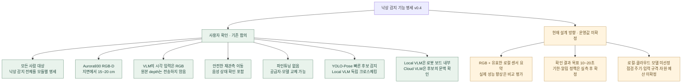
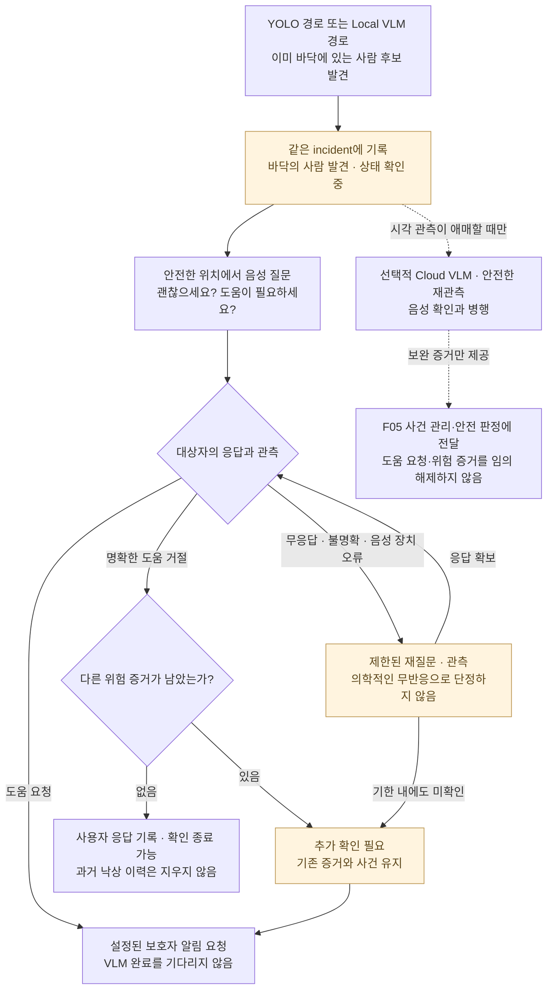
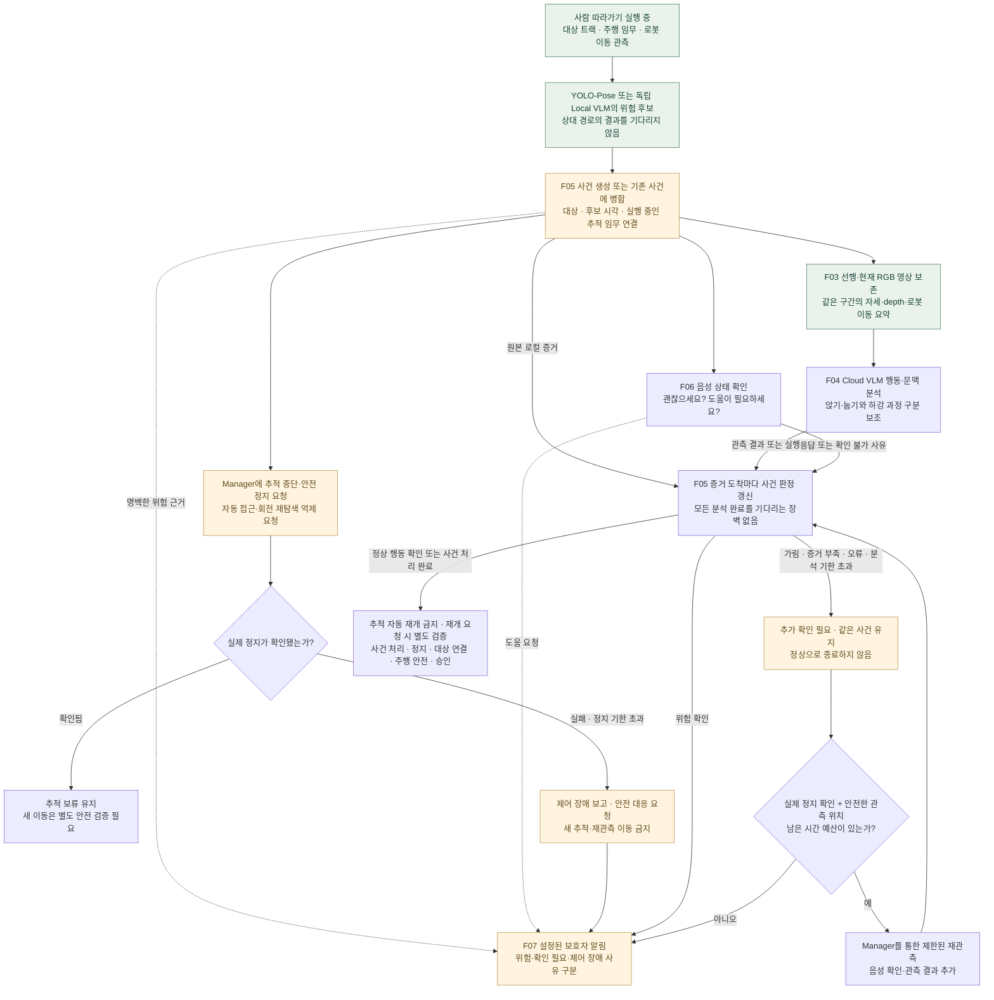
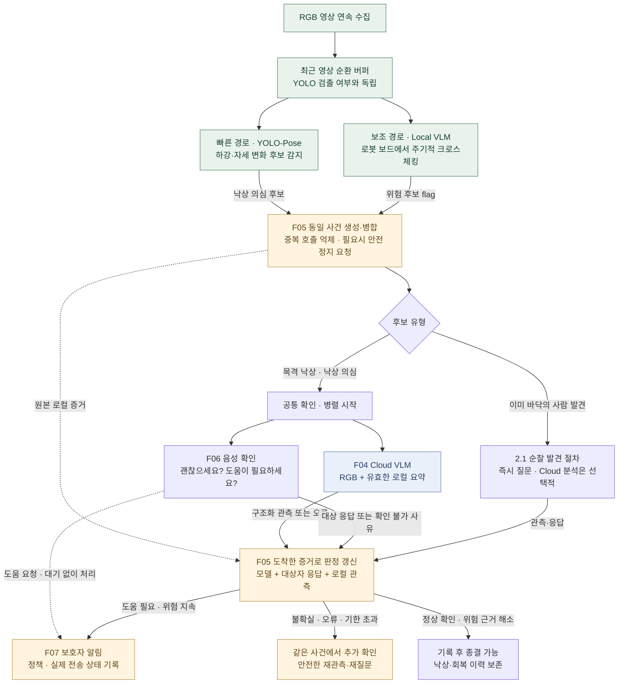
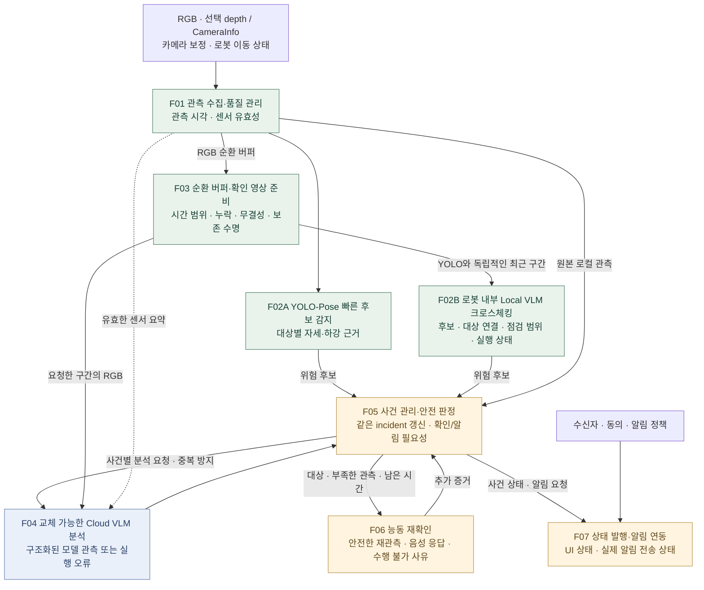
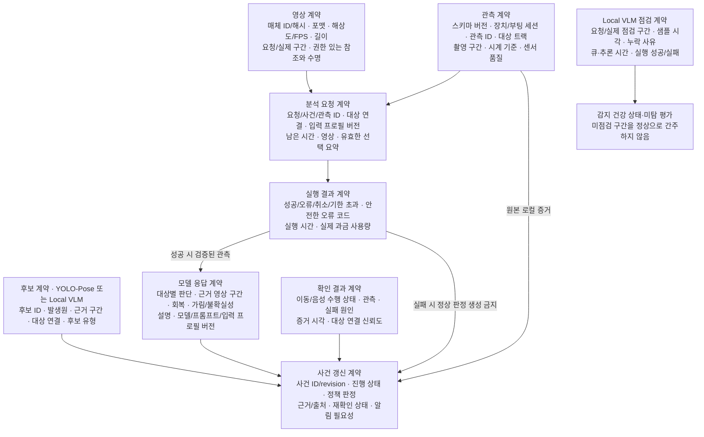
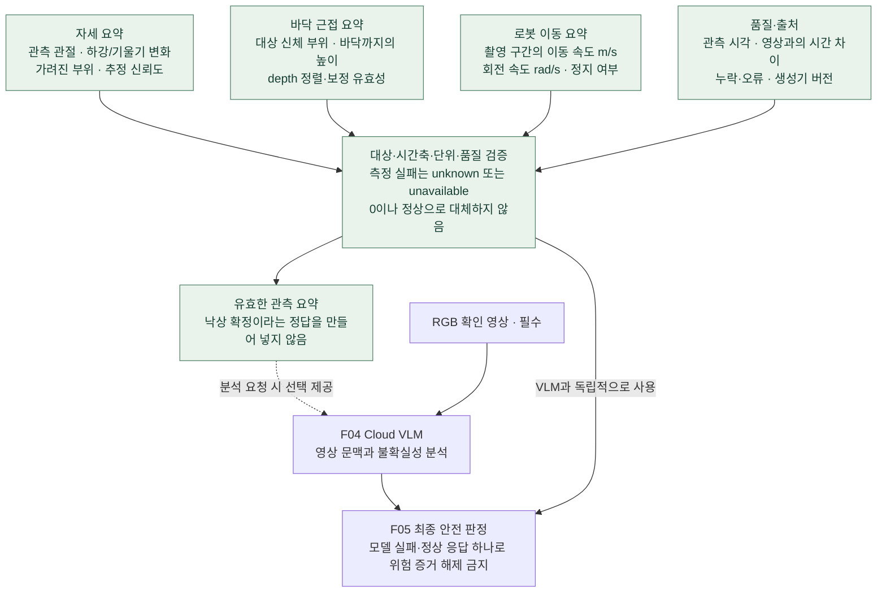

# 낙상 감지 상세 설계 메모 — v0.4 보존본

이 문서는 기존 Mermaid와 설계 근거를 보존한 참고 자료다.
현재 기능 명세는 [낙상 감지 기능 명세](FALL_DETECTION_FUNCTION_SPEC.md)다.
새 명세와 다른 상태명·계약이 있으면 새 명세의 초안을 우선 검토한다.

- 버전: 0.4 / 2026-09-08
- 상태: 요구사항 및 모듈 경계 초안. ROS 인터페이스 확정본이나 구현 완료 보고서가 아니다.
- 범위: YOLO-Pose·로봇 내부 Local VLM의 병렬 후보 감지부터 Cloud VLM 확인,
  음성 확인, 능동 재관측, 사건 관리 및 알림까지.
- 이번 변경은 명세와 문서 미리보기만 갱신한다. 낙상 실행 코드·모델·운영 설정은 변경하지 않는다.

v0.4의 핵심 흐름은 [2.3 병렬 감지와 공통 확인 흐름](#parallel-crosscheck)에 있다.
YOLO-Pose는 낙상을 확정하는 검증기가 아니라 빠른 후보 감지기다. Local VLM은
YOLO 결과와 무관하게 최근 RGB 영상을 점검하며, 어느 경로든 위험 후보를 내면
같은 사건 관리·확인 절차로 진입한다. 두 모델의 동시 미탐 가능성은 남는다.

## 1. 확정 사항과 미결정 사항

센서 요약은 유효한 관측이 있을 때 제공하는 입력으로 설계한다. 요약이 없거나
불완전하다고 RGB 분석이나 음성 확인을 막지 않는다. 각 센서의 필수 여부·타입·
품질 기준은 후속 계약에서 확정한다.

기존 요구사항 문서와 코드의 카메라 높이 9~12 cm / 0.091864 m는 이번 사용자
설명과 다르다. 이 명세에서는 15~20 cm를 설계 범위로 사용한다. 실제 depth
기하 계산에는 장착 높이·pitch 실측값이 필요하며, 이 문서 추가만으로 보정되지는 않는다.

## 2. 기능의 의미와 비목표

- 쓰러지는 순간을 관측한 경우와, 순찰 중 이미 바닥에 있는 사람을 발견한 경우를 모두 다룬다.
- 의도적으로 눕기·앉기·운동하기와 낙상을 구분하고, 판단할 수 없으면 그 상태를 보존한다.
- 사람을 놓치거나 보지 못한 것은 정상 행동의 증거가 아니다.
- 연령 추정이나 등록된 사용자 얼굴 일치를 감지 선행 조건으로 사용하지 않는다.
- 모든 사람을 대상으로 한다는 요구는 사각지대에서도 100% 감지를 보장한다는 뜻이 아니다.
  관측 가능 시간·사각지대·부분 가림 조건을 평가에 별도로 기록한다.
- 반려동물·빈 방·TV 속 사람 등은 오탐 평가 대상이다. 사람이 없는 일반 이벤트의
  분석 실패를 곧바로 낙상 보호자 알림으로 바꾸지 않는다.
- VLM 결과는 안전 판정의 증거이며, 의학적 진단이나 로봇 제어 명령이 아니다.

### 2.1 순찰 중 바닥의 사람 발견

하강 순간을 보지 못한 경우에는 낙상을 확정하는 대신 도움 필요 여부 확인으로
진입한다. VLM은 음성 확인이나 알림을 시작하기 위한 필수 승인 단계가 아니다.

재질문의 횟수와 시간 예산, 알림 단계는 정책으로 확정한다. 반복 질문으로 전체
기한을 계속 늘리지 않는다. 대상자 응답·TV/다른 사람의 말·음성 장치 실패를
구분하며, 명백한 위험은 위 재질문을 기다리지 않는다. VLM을 선택적으로 쓰려면
15~20 cm 시점에서 바닥의 사람을 찾는 로컬 검출기부터 별도 검증해야 한다.

### 2.2 사람 따라가기 중 낙상 의심 또는 목격 낙상

사람을 따라가는 중에는 로봇도 움직이므로, 사람의 자세 변화와 카메라 자체
이동을 함께 확인해야 한다. 이 경로는 순찰 중 이미 바닥에 있는 사람을 발견한
경로와 달리 선행 영상에서 하강 과정을 확인할 수 있다. 단, 따라가고 있었다는
이유만으로 쓰러지는 순간을 실제로 관측했다고 가정하지 않는다.

아래는 구현할 동작 계약이다. Manager의 안전 정지·선점·재개 인터페이스가
이미 구현됐다는 뜻은 아니다. 구체적인 공개 인터페이스와 정지 시간 상한은
7절의 통합 계약에서 확정해야 한다.

- **동시에 시작할 작업:** 후보 발생 시 영상·증거 보존, 안전 정지 요청, 음성
  확인을 시작한다. 영상 보존과 알림은 정지 완료나 VLM 응답 때문에 지연하지 않는다.
  정지 확인 전에는 재관측을 위한 추가 이동을 허용하지 않는다.
- **추적 제어:** 단순히 속도 0을 한 번 발행한 것으로 정지했다고 보지 않는다.
  추적기가 목표를 재발행하거나 분실 대상을 찾기 위해 회전·접근하지 못하게 하고,
  실제 이동 상태로 정지를 확인하는 통합 계약이 필요하다. 정지 확인 기한은
  분석의 10~20초 목표와 분리해 정하며, 분석 기한까지 정지를 기다리지 않는다.
- **증거와 대상 연결:** 후보의 `incident_id`에 관측 시각·대상 트랙·추적 임무를
  연결한다. 목표를 놓쳐도 가까운 다른 사람으로 바꾸어 사건을 종료하지 않는다.
  추적 대상뿐 아니라 카메라에 관측되는 다른 사람도 낙상 감지 대상이다.
- **판정 분기:** 실제 하강 과정이 확인된 경우에만 `confirmed_fall`로 판정한다.
  하강을 놓쳤지만 바닥의 사람이 확인되면 같은 사건에서 `found_down`으로 다룬다.
  단순 트랙 분실은 낙상 확정 근거가 아니며 추적 모듈의 분실 안전 정책으로
  처리한다. 분실과 함께 낙상 의심 근거가 있으면 사건과 증거를 보존하고,
  부분 가림·분석 실패로 결론을 낼 수 없을 때는 `unobservable`로 유지한다.
- **대화와 회복:** 도움 요청은 VLM 완료를 기다리지 않는다. 명백한 낙상 근거를
  정상이라는 모델 응답이나 "괜찮아요" 한마디로 지우지 않는다. 정상적인 앉기·
  물건 줍기 등의 증거와 사용자 응답은 함께 평가하고, 회복은 낙상 이력과 별도 기록한다.
- **재개 정책 제안:** 알림 전송 성공, 사람의 기립 또는 VLM 정상 응답만으로
  사람 따라가기를 자동 재개하지 않는다. 사건 처리 상태와 정지·대상 재연결·
  경로 안전을 확인한 뒤 명시적인 재개 요청을 Manager가 승인하는 보수적 기본안을 둔다.
  미해결 위험이나 제어 장애가 남으면 재개하지 않는다. 재개 권한과 공개 계약은 미확정이다.

### 2.3 병렬 감지와 공통 확인 흐름

아래는 합의한 목표 구조다. 카메라 관측·감지가 활성화된 동안 두 경로가 각각
동작하며, 빠른 경로가 실패했다고 선언할 때까지 보조 경로가 기다리는 구조가 아니다.
Local VLM에서만 후보가 생겨도 Cloud VLM과 음성 확인을 시작한다.

- **OR 조건으로 진입:** YOLO-Pose와 Local VLM 중 하나의 후보면 충분하다.
  두 경로의 동의를 요구하는 AND 조건이나, YOLO의 사람/pose 검출 성공을
  Local VLM 실행 조건으로 두지 않는다. Local VLM의 정상 응답으로 YOLO 후보를 취소하지 않는다.
- **병렬의 의미:** 두 관측 루프의 논리적인 독립성이다. Jetson에서 GPU 연산이
  물리적으로 동시에 수행된다는 보장은 아니다. 큐·메모리·우선순위는 실측 후 확정한다.
- **동일 사건 병합:** 대상 연결과 겹치는 관측 시간·공간 근거를 사용한다.
  같은 시간이라는 이유만으로 서로 다른 사람을 합치지 않는다. Local VLM이
  대상을 특정하지 못하면 임시 사건과 연결 불확실성을 보존한다.
- **중복 방지:** 최초 후보가 Cloud VLM 요청과 질문을 시작한다. 같은 사건의
  후속 후보는 증거로 누적하고 이미 실행 중인 호출·질문을 중복 시작하지 않는다.
  새로운 위험이나 추가 시야 때문에 재분석이 필요하면 새 evidence revision으로
  요청하며, 무제한 재호출로 전체 확인 기한을 늘리지 않는다.
- **분류와 실행 상태 분리:** 사람이 없다는 관측, 낙상 의심, 시야 부족,
  모델 실행 오류를 구분한다. 빈 방에서의 오류나 단순 품질 저하만으로 낙상 알림을
  보내지 않는다. 위험 후보의 미해결 상태는 보존하고 정책에 따라 재확인한다.
- **음성 확인:** 무응답은 의학적인 무반응 확정이 아니다. 대상자/다른 사람/TV
  응답과 마이크·STT 장애를 구분한다. 명확한 도움 요청이나 긴급 위험은 모델을 기다리지 않는다.
- **미탐 한계:** 두 경로가 모두 놓칠 수 있다. 같은 RGB 시점·가림·시간 간격에
  영향을 받으므로 두 미탐률을 독립 확률처럼 곱하지 않는다. 프레임 손실·미점검
  구간도 측정하며, 사각지대까지 감지한다고 표현하지 않는다.

depth/바닥 근접/대상 분실을 별도의 상시 위험 트리거로 만드는 추가 안전 경로와
후보 없이 주기적으로 Cloud VLM을 호출하는 방식은 이번 합의 범위가 아니다.
현재는 유효한 센서 관측을 후보와 최종 판정의 보완 증거로 활용한다.

## 3. 모듈 분해

각 모듈은 책임 경계이다. 처음부터 모두 다른 ROS 노드나 프로세스로 나눌 필요는 없다.

점선은 조건부 VLM 입력이다. F02A/F02B의 후보와 원본 로컬 관측은 F04를
거치지 않고 F05에 전달한다. F05가 같은 사건의 호출과 음성 확인을 조정한다.
F03의 영상 전달 자체가 Cloud VLM 호출을 시작하지는 않는다. 순찰 발견의
선택적 분석 정책은 2.1절을 따른다. F06의 안전한 이동은 Manager를 통해 요청한다.

평가 하네스는 위 기능의 출력과 정답을 비교하는 별도 도구다. 운영 기능이 평가용
GT·샘플·채점 모듈에 의존하지 않도록 공통 데이터 계약과 검증기를 분리한다.

### F01~F03: 감지와 영상 준비

- RGB/depth의 시계·정렬·CameraInfo·보정 값의 유효성을 검증한다.
  depth가 없거나 유효하지 않으면 `unavailable`로 표현하고 값을 만들어내지 않는다.
- 하강과 자세 변화, 바닥 근접, 지속/회복, 로봇 자체 이동을 분리해 기록한다.
  특정 후보 알고리즘과 임계값은 저상 시점 실영상 평가 뒤 확정한다.
- 전신/pose 검출 실패만으로 사람 후보를 제거하지 않는다. 영상 흔들림만으로
  로봇 주변의 모든 움직임을 낙상으로 간주하지 않는다.
- 영상은 낙상 후보 시각을 기준으로 준비한다. 120초 이벤트 클립이나 KVS 저장의
  종료를 기다린 뒤 분석을 시작하지 않는다.
- 후보가 생성되면 필요한 선행 구간을 사건에 연결해 보존한다. 확인 도중 순환
  버퍼에서 덮어쓰이지 않도록 수명·용량을 관리하고, 보존 실패는 명시적으로 보고한다.
- 선행/후행 길이, 해상도, FPS, 인코딩, 프레임 샘플링은 별도 입력 프로필로 관리한다.
  프레임 수를 줄였을 때 짧은 하강 동작을 놓치는지도 평가한다.

### F02B: 로봇 내부 Local VLM 크로스체킹

- 최근 RGB 버퍼를 겹치는 시간창으로 주기적으로 점검한다. YOLO 후보가 없는
  구간도 대상이며, YOLO가 만든 사람 crop만 입력으로 쓰지 않는다.
- Local VLM은 최종 낙상 확정기가 아니라 놓친 위험 후보를 찾는 보조 감지기다.
  위험 후보를 F05에 전달하고, 음성 질문·클라우드 호출·주행을 직접 실행하지 않는다.
- 시간창 길이·겹침·프레임 수·점검 주기는 보드 동시 부하에서 측정해 결정한다.
  추론 시작/종료 시각과 실제 점검한 영상 구간을 기록한다. 점검하지 않은 구간은
  정상으로 채우지 않으며, 오래된 후보라도 관측 시각을 보존해 사건에 연결한다.
- 큐 상한과 영상 보존 수명을 둔다. 과부하 시 무한 적재하지 않고 누락 범위와
  원인을 기록한다. 주행 안전·카메라·YOLO 빠른 경로의 자원 예산을 보호하고,
  Local VLM 처리를 기다리느라 이미 생성된 후보의 확인을 지연하지 않는다.
- 로컬 오류·시간 초과 시 관측 품질 저하를 발행한다. 실패를 '위험 후보 없음'으로
  기록하거나 YOLO 경로를 중단하지 않는다. YOLO 장애 시에도 이 경로를 유지한다.
  단, 공통 카메라/보드 장애는 두 경로를 함께 멈출 수 있으므로 별도 건강 상태로 드러낸다.

### F04: 교체 가능한 Cloud VLM

- 도메인 요청/응답은 특정 공급자 SDK·API 필드명·URL 형식을 포함하지 않는다.
- 어댑터가 모델별 영상/프레임 입력, 구조화 출력, 토큰 집계, 오류를 변환한다.
- 지원하지 않는 입력을 조용히 생략하거나 다른 품질로 바꾸지 않는다.
  변환한 경우 실제 입력 프로필을 결과에 기록한다.
- VLM은 이동·긴급 상태 전환·보호자 연락을 직접 실행하지 않는다.
- 순찰 중 발견에서는 필요한 시각적 문맥을 보완할 때만 호출한다.
  음성 상태 확인·도움 요청 처리는 VLM 실행 여부와 독립적이다.
- 사람 따라가기 중 낙상 의심에서는 선행·현재 영상의 하강 과정과 행동 문맥을
  확인하는 보조 경로로 사용한다. 추적의 안전 정지와 초기 알림을 승인하는 역할은 아니다.
- 응답의 대상, enum, 수치 범위, 근거 시각을 검증한다. 타임아웃·잘못된 JSON·
  지원하지 않는 입력은 정상 활동 결과가 아니라 실행 실패다.

### F05: 사건과 최종 판정

- `incident_id`의 단일 작성자가 사건 상태를 갱신한다. 재관측과 분할 영상은
  같은 사건 아래 `observation_id`/`request_id`로 구분한다.
- 여러 사람의 관측을 하나의 전역 낙상 판단으로 섞지 않는다. 대상 트랙과 연결하고,
  대상 연결이 불확실하면 그 불확실성을 기록한다. 얼굴 실명 식별은 필요하지 않다.
- 강한 로컬 위험 증거를 모델의 정상 응답 하나로 해제하지 않는다.
- 이미 바닥에 있는 사람을 발견했지만 하강을 못 봤다면 목격 낙상으로 꾸미지 않는다.
- 회복 및 도움 요청을 별도 기록한다. 회복했다는 사실이 앞선 낙상 이력을 지우지 않는다.
- 결과는 낙상 과정 확인 / 바닥의 사람 발견 / 정상 행동 확인 / 확인 불가로 구분한다.
  이는 기존 `confirmed_fall`, `found_down`, `normal_activity`, `unobservable`과 대응한다.
- 사건 진행 상태(확인 중·추가 확인 필요·종결), 위험도, 관측 결과, 실행 성공 여부는
  서로 다른 필드다. 전부 하나의 `status`나 `confidence`로 표현하지 않는다.
- API 실패가 나도 후보와 기존 증거를 보존한다. 일반 이벤트와 실제 낙상 후보를
  구분하여 재확인/알림 정책을 적용한다.

### F06: 이동과 음성 확인

- 확인 질문은 분석과 병행할 수 있다. 응답을 기다리느라 명백한 위험 알림을 지연하지 않는다.
- 음성 출력 성공, 녹음 가능 여부, 응답 대기 시간, 응답 관측을 분리한다.
  대답이 없거나 STT가 실패한 것을 의학적인 무반응으로 확정하지 않는다.
- 시야가 충분하면 움직이지 않는다. 부족할 때만 신체 주변 보호 영역과 지도·장애물·
  위치 신뢰도를 확인하고 안전한 관측 위치를 요청한다.
- 발목만 보이는 가까운 위치로 무조건 접근하거나 사람 주위를 한 바퀴 돌지 않는다.
  벽/가구로 막혔거나 안전한 경로가 없으면 이동하지 않고 확인 불가 사유를 남긴다.
- 이동과 음성은 공개 인터페이스로 요청한다. 다른 응용 패키지의 내부 노드를 직접 제어하지 않는다.
- 요청 취소, 실제 이동 정지, 센서 관측 종료를 구분한다. 취소 완료 전에 실제 안전 상태를 확인한다.

### F07: 발행과 알림

- UI의 사건 상태와 보호자 알림의 실제 전송 상태는 별개다.
- 같은 사건의 재분석마다 새 사건/새 알림을 중복 생성하지 않도록 revision과 멱등 키를 사용한다.
- `요청됨`, `전송 성공`, `수신/확인`을 구분한다. 공급자가 제공하지 않는 수신 확인은 만들지 않는다.
- 수신 대상·동의·재시도·알림 단계는 명시적 정책으로 관리한다.
- 대화 Agent는 확인된 사건 근거와 알림 상태를 설명한다. 일반 대화의 실패/취소가
  이미 진행 중인 안전 확인 또는 긴급 연락을 임의로 해제하지 않도록 경계를 둔다.

## 4. 입력·출력 계약의 명세 항목

아래는 논리 계약 초안이다. 아직 ROS `.msg/.action` 필드명이나 등록된 capability가 아니다.
센서 요약과 매체 전달 프로필의 필수 여부·타입·크기 상한을 후속 계약에서 고정한다.

계약에 공통으로 적용할 규칙:

- 빠진 값, 관측하지 못한 값, 관측 결과 음성(false)을 구분한다.
- 모델의 확률은 무엇에 대한 확률인지 명시한다. 낙상 발생 확률과 바닥 사람 발견
  판정 신뢰도를 동일 수치로 채점하거나 알림 임계값에 섞지 않는다.
- 모델 근거는 설명 문자열만이 아니라 영상 내 시간 범위 및 관측 ID를 포함한다.
- 늦거나 중복된 결과는 ID와 revision을 확인한다. 과거 결과가 새로운 위험 증거를
  덮어쓰지 않게 하되, 늦게 도착한 중요 증거를 무조건 폐기하지도 않는다.
- 매체 참조의 읽기 권한·허용 경로/호스트·만료·해시를 검증한다.
  RGB 영상의 외부 전송은 설정/동의에 따르며 임의 클라우드 fallback은 하지 않는다.
- 원본 depth와 GT를 모델 입력에 넣지 않는다. 선택 센서 요약에도
  생성기 버전·실측 출처·시각을 기록하여 정답 유출이나 다른 사건 증거 혼합을 막는다.

### 4.1 RGB 영상과 로컬 센서 요약

같은 영상·같은 사건을 사용해 RGB 단독과 RGB+요약을 비교한다. 낙상/바닥 사람
발견 성능, 정상 행동 오탐, 지연·비용을 각각 기록하며 요약의 효과를 미리 단정하지 않는다.

### 4.2 병렬 경로의 추가 계약

다음 필드는 논리 명세이며 wire schema 확정본이 아니다. Local VLM의 모델 출력과
어댑터/스케줄러가 생성하는 실행 메타데이터를 분리한다.

| 계약 | 필수 명세 항목 | 의미와 금지 사항 |
| --- | --- | --- |
| 후보 | `candidate_id`, `source`, `candidate_kind`, `observation_id`, 대상 연결, 근거 영상 구간 | `source`: `yolo_pose` 또는 `local_vlm`. 후보는 낙상 확정이 아니며 GT를 포함하지 않음 |
| 시간 | 관측 시작/끝, 후보 생성, 사건 수신, 분석 시작/끝, clock/boot ID | 실제 사건 시각과 뒤늦게 발견한 시각을 구분. 서로 다른 시계는 변환 품질을 함께 기록 |
| 로컬 점검 | `scan_id`, 요청/실제 구간, 샘플 프레임 시각, 입력 프로필, 누락 구간·원인, 실행 상태 | 후보 없음·관측 불가·실행 실패를 분리. 큐에서 버린 구간을 점검 완료로 기록 금지 |
| 모델 관측 | 후보 유형, 대상/연결 불확실성, 위험 근거와 시각, 시야 품질 | 이미 바닥에 있는 사람을 하강 목격으로 바꾸지 않음. 수치는 의미를 정의한 경우만 사용 |
| 사건 병합 | `incident_id`, 대상 연결, `evidence_revision`, 원본 후보 ID 목록 | 동일 사건의 두 발생원을 보존. 단순 시간 중복으로 여러 사람을 합치지 않음 |
| 확인 요청 | `request_id`, 사건 ID, 근거 revision, 작업 종류, 멱등 키, 남은 예산 | Cloud VLM/음성 작업별 실행 상태 관리. 중복 요청 억제와 필요한 후속 분석을 구분 |
| 정책 결과 | 관측 판정, 도움 필요성, 사건 진행 상태, 근거/실패 사유, 알림 상태 | 실행 실패·미확인을 정상 행동으로 대체 금지. 확정되지 않은 낙상 의심도 확인 대상으로 유지 |

자세·바닥 근접·로봇 이동 요약은 실제 측정값의 출처·시각·유효성만 전달한다.
Local VLM의 추정은 별도 모델 관측으로 표시하며, 센서 측정값으로 둔갑시키지 않는다.
첫 비교에서는 Local VLM을 독립 RGB 입력으로 평가하고, 요약 제공의 효과는 별도
입력 프로필로 비교한다. 어느 경우든 요약 부재가 Local VLM 점검을 막아서는 안 된다.

## 5. 10~20초 목표의 해석 — 제안

- 사용자 제안은 확인 결과의 목표 시간이다. 항상 10초를 기다리거나, 20초가 지나면
  모든 사건을 강제로 정상/낙상으로 결정한다는 의미가 아니다.
- 측정 시작점 제안: 어느 경로든 최초 후보 생성. 종료점: UI/알림 계층이 사용할 수 있는 첫 확인 결과.
- 영상 준비 + 큐 대기 + VLM + 필요한 음성/재관측을 포함한다. VLM 호출 시간만 재지 않는다.
- 실제 낙상 시작 → 후보 생성, 순찰 중 최초 관측 → 후보 생성의 지연은 별도 측정한다.
- Local VLM의 점검 대기·샘플링 간격으로 늦어진 시간도 누락하지 않는다.
  후보 이후 10~20초만 만족하면서 실제 발견이 늦는 경우를 별도 보고한다.
- 명백한 위험/도움 요청은 확인 완료를 기다리지 않고 우선 처리한다.
- 20초에도 불확실한 경우에는 `추가 확인 필요`를 발행하고 같은 사건을 유지하는 방안을 제안한다.
  최종 기한/알림 정책의 고정값은 실측 후 확정한다.
- 재시도마다 전체 예산을 새로 주지 않는다. 로컬 watchdog에는 단조 시계를 쓰고,
  외부 교환 시각과 남은 예산은 clock skew를 고려한다.
- p50/p95, 기한 초과율, 콜드 스타트, 주행·홈캠·음성 동시 부하를 함께 측정한다.

## 6. 로컬 모델의 사용 가능 범위

목표 배치는 **로봇 보드 내부 Local VLM = 독립 후보 감지**, **Cloud VLM = 후보의
행동·문맥 분석**이다. 두 역할의 모델은 별도로 선정한다. 현재 로봇에서 이 구성의
성능·메모리·동시 실행 가능 여부는 미검증이며, 파인튜닝은 하지 않는다.

- 기존 구현의 `openai_compatible` 어댑터는 로컬 모델 서버에 연결하는 경로다.
  모델 다운로드·Jetson 서빙·부팅 시 시작·자원 격리까지 구현됐다는 뜻은 아니다.
- 기존 로컬 후보 MiniCPM-V-4.6은 공식적으로 영상 추론 방법을 제공한다.
  Qwen3-VL-2B-Instruct도 공개 가중치 비교 후보가 될 수 있다. 어느 쪽도 이 로봇의
  Aurora 저상 시점 낙상 성능이나 10~20초 응답을 아직 입증하지 않았다.
- NVIDIA의 VILA 기반 Jetson VLM 서비스 문서는 NX8에서 시간 문맥을 위해
  많은 프레임을 넣으면 지연이 커지므로 최대 4프레임을 권장한다.
  이는 그 서비스의 권장값이며 모든 VLM의 하드웨어 상한이나 본 기능의 입력 규격은 아니다.
- 대상 보드는 ROSOrin의 Jetson Orin NX Super 8GB다. Mac/별도 PC의 모델 실행은
  개발·데이터 검토·계약 검증에 활용할 수 있지만 보드 내 실행 성능의 증거는 아니다.
- Local VLM은 후보 발생 전부터 최근 영상 점검을 수행한다. Cloud VLM은 어느
  경로든 낙상 의심 후보가 생겼을 때 음성 확인과 병행한다. 순찰 발견은 2.1절을 따른다.
- Ollama는 서빙 런타임 후보이지 모델명이 아니다. 개발 중 클라우드 역할을 로컬
  서버로 대체하더라도 논리 역할과 평가 결과를 구분한다. 임시 대체 실행을
  제품용 보드 크로스체킹 검증이나 Cloud VLM 성능 검증으로 기록하지 않는다.
- 로봇 내 실행 채택 전 JetPack/CUDA/추론 엔진 호환, 최대 통합 메모리 사용량,
  영상 입력 지원, 주행 안전 주기 간섭, 지연·발열, 낙상/정상 행동 오분류를 실측한다.
- 클라우드 모델도 네트워크 지연·장애·비용·데이터 전송 동의까지 같은 기준으로 비교한다.

## 7. Malbut 런타임·공개 인터페이스에 맞추는 방법

참조 기준은 아래 Git 커밋과 Notion 문서다. 현재 작업 브랜치에 최신 main을
병합한 상태라고 가정하지 않는다.

- Bringup은 서버를 준비한다. 기능 실행은 Manager의 명시적인 요청 또는 확정된
  자동 시작 정책을 통해 수행한다. 프로세스 시작만으로 감지를 임의 시작하지 않는다.
- 지속 감지는 BACKGROUND Action, 단발 분석은 취소 가능한 별도 Action으로
  명세하는 방안을 제안한다. 관측과 지속 상태는 Topic으로 분리한다.
- 재관측 이동은 주행 자원을 쓰므로 FOREGROUND 임무와 충돌한다.
  현재 Manager에서 BACKGROUND의 높은 priority만으로 주행이 선점되지는 않는다.
  안전 정지/선점/재개 계약은 별도 합의·구현이 필요하다.
- 2.2절의 추적 중 낙상 경로에는 실행 중인 추적 임무 식별, 추적 중단/목표 재발행
  억제, 실제 정지 확인, 제어 실패 보고 및 명시적 재개 승인 계약이 필요하다.
  VLM이 `/cmd_vel`이나 추적기의 내부 API를 직접 호출하는 방식으로 우회하지 않는다.
- `/malbut/state`는 System Manager만 발행한다. 사건의 긴급도와 시스템의
  `EMERGENCY` 상태를 같은 것으로 취급하거나 VLM이 직접 시스템 상태를 쓰지 않는다.
- 현재 공개 `/malbut/mission/execute`를 통한 capability 요청 형식을 따른다.
  현재 등록된 follow/navigation capability를 참고하되 미구현 fall Action이 있다고 쓰지 않는다.
- `.action/.srv/.msg`가 타입과 상수의 기준이다. 중앙 capability manifest에는
  실제 필드와 일치하는 입력 메타데이터, 실행 mode/priority만 계약에 맞게 등록한다.
- 새 emergency·음성 확인 인터페이스 이름, 선점 정책, 자동 감지 시작 및 개인정보 OFF
  시 동작은 이번 문서에서 임의로 기존 기능으로 선언하지 않는다.

## 8. 검증·구현 순서

1. 센서 요약의 품질/전달 규격과 자동 감지 정책을 확정하고 모듈별 타입·상태·오류 계약을 작성한다.
2. 운영 계약/검증기를 평가 하네스와 분리하고, F04를 고정 샘플로 계약 테스트한다.
3. 실제 Aurora RGB·정렬 depth·보정·시간축을 확인하고 F01~F03을 검증한다.
4. F05에 대상별 사건/재관측/중복/오류/기한 테스트를 추가한다.
5. Manager와 F06의 정지·안전 이동·취소 계약을 확정한 뒤 실제 이동을 연결한다.
6. F07과 음성/알림 장애를 검증하고, 로컬/클라우드 모델을 같은 실영상으로 비교한다.

위 순서는 구현 의존 관계다. 당장 진행할 모델 비교와 병렬 경로 검증은 다음처럼 구분한다.

| 평가 단위 | 주요 확인 항목 |
| --- | --- |
| Local VLM | YOLO가 놓친 사례의 후보 회수율, 단독 후보 재현율/오탐, 실제 보드 메모리·점검 주기·큐 지연·미점검 비율 |
| Cloud VLM | 낙상·이미 쓰러짐·정상 행동 구분, 의심/관측 불가 처리, 출력 계약 준수, 지연·호출 비용 |
| 전체 파이프라인 | 어느 경로가 먼저 후보를 냈는지, 공동 미탐, 동일 사건 병합, Cloud VLM·질문 실행, 최종 안전 판단·전체 지연 |

- 가중 합산 점수는 만들지 않는다. 성능·지연·자원·비용을 각각 보고 비교한다.
- 실제 시간 순서 재생에서는 해당 시점까지 촬영된 프레임만 사용한다.
  완성된 전체 클립을 미리 보여준 분석은 별도의 클립 평가이며 실시간 미탐 회수 실험이 아니다.
- 현재 합성 영상 검토 라벨은 목격 낙상·이미 쓰러짐·정상 행동·관측 불가·낙상 의심으로
  구분한다. 사건 발생의 확실성과 확인 필요 여부는 별개다. 낙상 의심을 정상(비위험)으로
  채점하지 않고, 이미 쓰러짐을 목격 낙상으로 채점하지 않는다.
- 생성 프롬프트·폴더명·GT·라벨은 모델에 보내지 않는다. 합성 영상에 실제 depth나
  로봇 이동 측정값이 없으면 `unavailable`로 남기며 만들어서 넣지 않는다.
- 실제 보드에서 YOLO·카메라·ROS 동시 부하를 측정하기 전 Local VLM 모델/주기를
  확정하지 않는다. 작은 합성 자료의 결과를 실제 가정의 감지율로 일반화하지 않는다.

병렬 경로의 추가 인수 조건:

1. YOLO만 후보를 내면 Local VLM을 기다리지 않고 공통 확인이 시작된다.
2. YOLO에 사람/pose 검출이 없어도 Local VLM 점검이 실행되고, 그 후보만으로
   Cloud VLM과 음성 확인이 시작된다.
3. 두 경로가 같은 사건을 순서가 바뀌어 감지해도 사건·분석·질문이 중복 생성되지 않는다.
   여러 사람이 동시에 넘어지면 대상별 사건은 분리된다.
4. 로컬 점검 지연·오류·큐 포화가 YOLO 후보 처리를 막지 않고, 미점검 구간이 드러난다.
5. 두 경로의 공동 미탐과 카메라 가림/공통 장애를 별도 집계한다. 후보가 안 나왔다는
   이유로 평가 자료에서 제외하지 않는다.
6. Cloud VLM 오류·지연, 무응답, 음성 장치 장애를 정상으로 처리하지 않는다.
   도움 요청·명확한 긴급 위험은 Cloud VLM 완료와 독립적으로 처리된다.

필수 시나리오: 목격 낙상, 이미 바닥에 있는 사람, 의도적 눕기/앉기, 회복,
여러 사람, 부분 가림/발목 시점, 벽·가구 옆, 빈 방/반려동물, 로봇 이동,
depth 장애, 음성 장치 장애, VLM 오류/지연, 안전한 재관측 위치 없음, 중복/늦은 결과.
합성 영상은 보조 자료다. 실제 저상 시점 자료 없이 제품 감지 성능을 입증했다고 하지 않는다.

사람 따라가기 중 낙상 경로의 추가 인수 조건:

- 추적 중 대상이 넘어지면 같은 사건으로 선행 영상이 보존되고, VLM 응답 전
  안전 정지 요청과 음성 확인이 시작되는지 확인한다.
- 대상이 화면 아래로 사라지거나 가구에 가려져도 로봇이 사람 쪽으로 계속 접근하거나
  자동 회전 재탐색을 하지 않는지, 실제 정지가 확인되는지 검증한다.
- 단순 분실·급히 앉기·물건 줍기·로봇 급회전과 실제 낙상을 구분한다.
  다른 사람이 등장해도 사건의 대상 연결이 바뀌거나 자동 종료되지 않아야 한다.
- 정지 요청 실패/응답 지연, VLM 기한 초과, 도움 요청이 각각 독립적으로 처리되고,
  안전하지 않은 재관측 이동 또는 알림 지연으로 이어지지 않아야 한다.
- 대상이 다시 일어나거나 알림 전송이 성공해도 자동으로 추적을 재개하지 않고,
  제안된 별도 재개 검증을 거치는지 확인한다.

### 8.1 이번 변경과 실제 구현의 경계

- 이번 v0.4 변경: Mermaid 흐름도, 병렬 모듈 책임, 논리 입력·출력 계약,
  실행·중복·오류 정책과 평가/인수 조건의 문서화.
- 기존 초안: VLM 공급자 어댑터·분석 정책·오프라인 평가 하네스. 이것만으로
  위의 운영 파이프라인이나 모델 성능이 검증된 것은 아니다.
- 남은 구현/실측: 로봇 내부 Local VLM 점검 워커, 사건별 호출·질문 조정,
  ROS/음성/알림 운영 연결, 보드 동시 부하와 실시간 공동 미탐 평가.
- 모델 선택·샘플링 주기·계약의 정확한 타입/상한은 후속 비교·통합 명세에서 확정한다.

## 9. 참조

- [Malbut 런타임 구조](https://app.notion.com/p/Malbut-3d0c6013131b80efb80fc6c87168d173)
- [응용 패키지 책임 및 인터페이스 확정](https://app.notion.com/p/3cfc6013131b8077a8fcd3bbab52d039)
- [공개 인터페이스 규칙 — 기준 커밋 15fbcd0](https://github.com/SWM-malbut/malbut/blob/15fbcd0e987d234c2a951561680b8077f6029fe9/APPLICATION_INTERFACE_RULES.md)
- [System Manager — 같은 커밋](https://github.com/SWM-malbut/malbut/blob/15fbcd0e987d234c2a951561680b8077f6029fe9/malbut_system_manager/README.md)
- [Agent ROS2 명세 — 같은 커밋](https://github.com/SWM-malbut/malbut/blob/15fbcd0e987d234c2a951561680b8077f6029fe9/malbut_agent_server/docs/AGENT_ROS2_INTERFACE_SPEC.md)
- [기존 낙상 요구사항](evaluations/FALL_DETECTION_VLM_REQUIREMENTS.md)
- [현재 평가 하네스](evaluations/VLM_EVALUATION_HARNESS.md)
- [NVIDIA Jetson VLM 서비스](https://docs.nvidia.com/moj/inference-services/vlm.html)
- [MiniCPM-V-4.6 공식 모델 카드](https://huggingface.co/openbmb/MiniCPM-V-4.6)
- [Qwen3-VL-2B-Instruct 공식 모델 카드](https://huggingface.co/Qwen/Qwen3-VL-2B-Instruct)
- [Smart Companion 2 — 누운 사람 발견 후 음성 확인 연구](https://research.ustp.at/en/projects/smart-companion-2)

외부 모델 문서는 2026-09-06 확인 기준이다. 문서상의 실행 지원과 이 로봇에서의
통합 실행/낙상 성능 검증을 구분한다.
