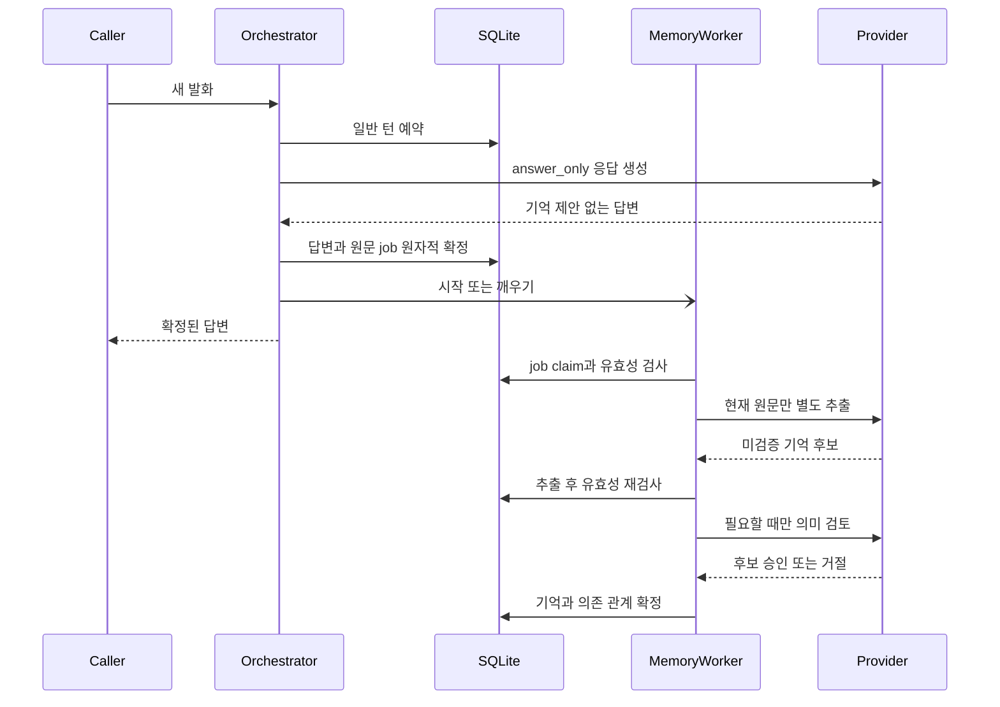

# 의미 기반 개인 기억과 비동기 자동 저장

OpenAI 운영 경로는 일반 대화를 먼저 확정하고, 적격 발화에서 자동 기억 후보를
추출하는 호출부터 필요한 추가 검토와 영속 저장까지 별도 작업으로 처리한다.
예를 들어 `난 김민재야`에는 인사로 답하며 자동 저장의 완료를 기다리지 않는다.
자동 저장 성공·중복·후보 거절·충돌은 전달할 답변을 다시 쓰지 않고 저장 결과
안내나 변경 확인 질문도 만들지 않는다.
모델의 저장 완료 주장·약속은 실제 처리 성공으로 취급하지 않으며 응답 확정 시
기존 정책에 따라 걸러낸다.

`기억해 줘`, 조회·정정·삭제, 개인화 동의와 보류 중인 확인 질문은 기존 동기
처리를 유지한다. 필요한 동의·대상 확인을 거치며 완료 안내는 실제 DB 결과에
근거한다. 도구 호출·로봇 실행 경로도 자동 기억 worker로 옮기지 않는다.

### 대화에 내부 기억 진단을 노출하지 않기

`기억에 남는 영화가 있어?`, `개인화가 무슨 뜻이야?`처럼 기억 관련 단어가
있어도 기억 작업 제안이 없으면 모델의 일반 답변을 그대로 유지한다. 키워드만으로
사용자에게 기억 처리 실패를 안내하지 않는다. 단, 검증되지 않은 저장·삭제 완료
주장이나 저장 약속은 기존처럼 제거한다.

명시적인 `기억해줘`, `삭제해줘`, `정정해줘`에 유효한 제안이 없으면 기술적인
실패 문구 대신 필요한 내용이나 대상을 자연스럽게 되묻는다. 이 질문으로 동의
티켓이나 변경 권한을 새로 만들지 않으며, 실제 저장·정정·삭제 성공 안내는 계속
DB 결과에 근거한다. 기존 동의와 로봇/기억 혼합 요청 차단은 변경하지 않는다.

개발자는 `malbut_agent_server.personal_memory`의 Python logger에서
`proposal_missing`, `source_unverified`, `invalid_proposal`,
`unverified_completion` 사유 코드를 INFO 수준에서 확인할 수 있다. 이 로그에는 원문,
기억 값, 사용자·요청 식별자를 넣지 않고 사용자 응답이나 TTS로도 전달하지 않는다.
DB 예외를 삼키거나 실패한 변경을 성공으로 바꾸는 정책은 아니다.

## 실행 구조

`factory.build_orchestrator()`의 기본 경로는 Provider에 따라 다르다.

| 구성 | 적격 자동 기억 처리 |
| --- | --- |
| OpenAI | C: 첫 호출은 `answer_only`, 답변 확정 후 별도 추출 → 필요한 의미 검토 → 저장 |
| RAI | 기존 답변·후보 통합 호출 유지, 적격 후보의 검토·저장만 비동기 처리 |
| Mock | 기존 개발용 패턴과 동기 처리 유지 |

`AgentOrchestrator`를 직접 생성할 때는 `background_memory=False`,
`automatic_memory_extractor=None`가 기본값이다. 별도 기능을 주입하지 않으면
기존 동기 동작을 유지한다. 생성자와 설정 검사만으로 worker나 모델 호출을
시작하지 않는다.

아래는 OpenAI C 경로에서 추출·의미 검토를 거쳐 저장하는 실행 순서다.
Orchestrator와 worker는 같은 런타임 안에 있고, SQLite의
`automatic_memory_jobs` 테이블이 영속 큐다. 규칙으로 검증되는 후보는 의미
검토 호출만 생략한다. 추출 결과가 `null`이면 검토·저장 없이 작업을 끝낸다.

그림의 응답 반환은 `handle()` 반환을 뜻한다. 실제 HTTP 송신이나 음성 발행보다
worker가 먼저 끝날 수도 있지만 호출자는 추가 추출·검토 완료를 기다리지 않는다.
그림의 Provider는 호출 역할을 묶어 표시한 것이며, 실제 factory는 대화·추출·
검토용 Provider 인스턴스를 각각 만든다.

### 요청 경로

1. 개인화가 켜져 있고 보류 중인 기억 확인이 없으며, 직접 발화이고 관리·질문·
   저장 금지 표현이 아닌 경우 첫 호출에 `answer_only`를 지정한다. 첫 호출은
   현재 답변에 필요한 기존 기억·대화 문맥과 정상적인 도구 판단을 유지하지만
   기억 후보를 만들지 않는다. 최종 결과가 일반 `message`인 경우만 추출 작업을
   예약한다. 도구 호출·거절·clarification·서버 확인 응답은 대상이 아니다.
2. 이 단계에서는 개인 사실이 있는지 미리 판정하지 않는다. 적격 인사·일반
   대화도 원문 작업을 큐에 넣을 수 있으며, 후보가 없다는 판단은 별도 추출이
   `null`을 반환하여 내린다. 대화 완료와 원문·출처·정책 snapshot을 담은 private
   job 예약은 같은 짧은 SQLite 트랜잭션에서 확정한다. 응답에는 기억 제안을
   남기지 않으며 이 단계에서 자동 장기기억을 쓰지 않는다.
3. 응답 본문·대화 이력·직렬화된 응답은 이 시점에 고정한다. 큐가 가득 차면
   자동 저장만 건너뛰고 대화는 완료한다. DB 오류까지 정상 저장으로 숨기는
   의미는 아니다.

### 백그라운드 경로

`AutomaticMemoryWorker`는 런타임당 단일 worker다. 짧은 claim·검증·확정 단계와
별도 추출·의미 검토를 분리한다. 모델 호출 중에는 foreground turn lock이나
SQLite 트랜잭션을 잡지 않으므로 다음 응답 생성이 해당 호출 종료를 기다리지
않는다. `AutomaticMemoryExtractor`에는 현재 원문만 제공한다. 과거 대화·요약·
검색 기억·첫 답변·실제 로봇 상태·실행 도구는 보내지 않는다. 추출 결과는
`remember` 후보 또는 `null`만 허용하며 조회·정정·삭제·도구 실행 권한이 없다.

추출 전, 추출 후 의미 검토로 넘어가기 전, 저장 직전에 job claim, TTL,
사용자별 개인화 상태와 무효화 revision을 검사한다. 원래 세션이 활성 상태이고
instance·generation이 같으며, 완료된 출처 턴의 사용자·요청·턴 식별자와 원문이
일치해야 한다. 세션 revision은 출처 완료 시점 이상이면 된다. 일반 후속 턴이
진행 중이거나 완료되어 출처가 최신 턴이 아니게 된 것만으로 폐기하지 않는다.
다만 같은 사용자의 로봇 확인이나 출처 대화의 기억 확인이 있으면 저장하지
않는다. 추출 도중 취소되었다면 이어지는 의미 검토 호출도 하지 않는다. 이미
전송한 추출 요청을 원격에서 취소하거나 회수하는 계약은 아니다.

RAI 및 이전 형식의 후보 job은 별도 추출 없이 적격 후보 검사부터 진행한다.
추출했거나 기존 통합 호출에서 받은 후보 모두 동일한 출처·주체·정보 종류·형식
검사와 필요한 의미 검토를 통과해야 한다.

실제 변경은 `apply_automatic()`이 기존 `PersonalMemory._apply()` 정책을 통해
수행한다. 응답을 재완료하거나 수정하지 않는다. 검증된 지연 자동 추가 저장은
사용자별 무효화 revision을 유지하므로 이미 생성된 답변이나 다음 자동 job을
그 저장만으로 stale 처리하지 않는다. 반면 저장소 전체의 mutation counter는
실제 추가 시 계속 증가한다. 이 예외는 worker의 내부 추가 전용 경로에만
적용되며 정정·삭제·동의 변경이나 일반 저장 호출의 무효화 검사를 완화하지 않는다.
이미 무효화된 출처의 revision을 새 값으로 바꿔 되살리지도 않는다.

기억 효과, job의 최종 상태, 출처 `memory_turn_state`의 dependencies 갱신은
한 트랜잭션에서 확정한다. 같은 사용자·세션 instance·generation에서 이미
완료된 후속 턴에도 해당 기억 ID를 의존 관계로 보수적으로 추가한다. 이는
기억 ID가 생기기 전에 원문을 문맥으로 활용했을 수 있는 답변을 연결하는 것으로,
답변 본문이나 후속 턴의 무효화 revision은 바꾸지 않는다.

후속 foreground 턴이 아직 추론 중이면 `PersonalMemory.commit()`이 같은
확정 트랜잭션 안에서 문맥의 최신 의존 관계를 다시 읽고 기존 snapshot의
dependencies와 합친다. 이후 정정·삭제 시 늦게 저장된 사실의 원문과 관련
답변도 새 모델 입력에서 제외할 수 있게 한다. 이 병합 전에 사용자별 무효화
revision이 그대로인지 확인하며, 삭제·동의 변경을 건너뛰는 재시도는 하지 않는다.
공개 응답 본문과 `memory_revision`은 뒤늦은 자동 저장 때문에 다시 쓰지 않는다.

## 다음 발화와 저장의 관계

일반적인 후속 발화는 앞선 `queued`·`running` job을 취소하지 않는다. 이는
OpenAI C 추출 job과 기존 통합 호출의 후보 job 모두에 적용된다. 예를 들어
자기소개 다음에 일상 대화를 이어 가도 원래 작업은 유효성 검사와 큐 순서에
따라 계속 처리한다. 단순 조회·질문도 그 자체로 기억 변경 차단선을 만들지 않는다.

직접적인 `기억해 줘`·정정·삭제·개인화 설정 요청이나 `저장하지 마` 같은
저장 금지 표현은 다르다. `삭제하지 마`처럼 변경 자체를 금지하는 말이나
`내 이름 기억하고 있어?` 같은 조회는 이 차단선의 대상이 아니다.
조회와 명시적 저장 요청이 함께 있으면 저장 요청의 차단선은 유지한다.
새 요청이 성공적으로 예약될 때
`before_new_turn`의 `_admit_memory_turn()`이 같은 트랜잭션 안에서 그 사용자의
이전 job을 취소하고 사용자별 무효화 revision을 증가시킨다. 이 차단선은
대화방에 한정되지 않으며 기존 응답과 아직 큐에 등록되지 않은 과거 추론 결과도
무효화한다. 이미 완료된 요청의 재전송이나 예약 전에 거절된 요청은 이를
실행하지 않는다.

삭제 대상이 없어 실제 사실을 지우지 못하는 요청도 이 차단선을 세운다.
따라서 이전 작업이 요청 이후 늦게 해당 정보를 저장하는 일을 막는다. 요청
예약 시점에 적용하므로 이후 모델·DB 처리의 성공 안내와는 별개다. 보류된 동의·
대상 확인은 기존 동기 정책을 따르며, 실제 동의·기억 변경 때의 무효화도 유지한다.

현재 답변과 같은 세션의 다음 답변은 원래 발화·대화 이력을 문맥으로 사용할 수
있다. 이것과 세션을 넘어 사용할 장기기억의 확정은 다르다. 응답이 돌아왔다는
사실만으로 영속 저장을 보장하지 않으며 자동 저장 완료를 안내하지 않는다.
확정된 기억 처리 결과가 필요한 명시적 요청은 동기 경로를 사용한다.

## 의미 검토와 권한 경계

[Mem0의 공개 사실 추출 예제][mem0]에서 자연어 의미를 바탕으로 사실을 구분하는
방식을 참고했다. 별도로 작성한 구현이며 Mem0 SDK를 추가하거나 공개
프롬프트·코드를 복사한 통합이 아니다. 저장 권한과 영속화는 Malbut 정책과
SQLite 저장소가 담당한다.

규칙으로 의미를 확인하지 못한 후보만 `MemorySourceReviewer`에 보낸다.
검토 입력은 현재 사용자 발화와 미확정 후보뿐이다. 과거 대화·요약·저장된 기억·
보류 질문·실제 로봇 상태·실행 도구는 제공하지 않는다. 후보를 원본 그대로
승인하거나 거절할 수 있지만 새 사실을 만들거나 값·대상·속성을 고칠 수 없다.
도구 호출, 형식 오류, 실패는 승인으로 취급하지 않는다.

- 개인화 동의, 사용자별 격리, 직접적인 현재 발화, 허용된 정보 종류와 저장
  금지 요청을 검사한다. 명시적 저장은 동의 전에 검토할 수 있어도 동의 없이
  저장할 수 없다. 인용·가정·예시에는 기존 제한을 유지한다.
- 의미 검토 증거는 정확한 후보와 원래 사용자·요청·세션 출처에 묶인다.
  동의, 정정·삭제 권한 또는 로봇 실행 권한을 대신하지 않는다.
- 후보 묶음 전체가 검증되어야 저장한다. 일부만 승인되거나 충돌하면 앞선
  후보를 부분 저장하지 않는다. 자동 충돌은 기존 기억을 유지하며 질문을
  만들지 않는다. 기억 적용이나 claim 확정 오류는 변경을 rollback한다.
- 최초 Provider 응답 자체의 형식 오류에는 기존 오류 경계를 적용한다.
  자동 저장의 조용한 실패가 잘못된 대화 응답을 정상으로 인정하지는 않는다.

## 큐, 재시작과 종료

- 기본 한도는 DB 전체의 `queued`·`running` 합계 64건, 생성 시점부터 TTL
  120초다. TTL은 저장 권한의 유효기간이지 원격 호출의 강제 종료 타이머는
  아니다. 만료 후 끝난 추출·검토는 저장할 수 없다.
- 상태는 `queued → running → saved/discarded/failed`다. 만료·출처 무효화·
  취소로 `queued`에서 바로 `discarded`가 될 수도 있다. 중복 사실을 확인하고
  유지한 경우도 `saved`일 수 있으며 새 레코드 생성과 동일한 뜻은 아니다.
- 같은 사용자의 작업은 큐 등록 순서대로 claim한다. `queue_sequence`는
  단조 증가하는 영속 순번이며 시간값이나 request ID 정렬을 FIFO 기준으로
  사용하지 않는다. 앞선 `queued`·`running` job이 있으면 같은 사용자의 뒤 작업은
  앞지르지 않는다. 다른 사용자의 적격 작업은 선택할 수 있다. 다만 런타임당
  단일 worker이므로 그 worker가 실행 중인 모델 호출을 병렬화한다는 뜻은 아니다.
- HTTP serving 시작, 음성 runtime 시작 또는 직접 호출한 `handle()` 완료 시
  worker를 시작한다. 재시작 후 `queued` job은 TTL과 출처·정책 검사를 통과하면
  재개한다. 새로운 추출 job은 `version=2`, `mode=extract`, `proposal=null`로
  구분하고 이전 후보 job도 읽을 수 있다. 남아 있는 `running` job의 claim을
  다른 worker가 인수하여 추출·검토를 재전송하지 않는다. 갱신 없이 만료되면
  이후 큐 정리에서 폐기한다. 재시작 후 남은 `running` job은 같은 사용자의
  후속 claim을 만료까지 막을 수 있지만 다른 사용자의 claim까지 막지는 않는다.
- `saved`·`discarded`·`failed` 전이는 원문·제안을 담은 `payload_json`과 claim을
  지운다. 세션 삭제 시 외래키 `ON DELETE CASCADE`로 관련 job도 삭제한다.
  이는 논리적 DB 삭제이며 저장 매체의 물리적 소거를 보장한다는 뜻은 아니다.
- `AgentOrchestrator.close()`는 새 턴을 막고, 잠금을 놓은 상태에서 실행 중인
  worker를 join한 뒤 두 저장소를 닫는다. HTTP 종료는 진행 중인 handler를
  기다리고 worker를 중단한다. CLI와 음성 runtime은 저장소를 개별적으로 먼저
  닫지 않고 runtime의 `close()`를 호출한다. 아직 시작하지 않은 queued 작업은
  재개 가능성을 유지하되 다음 serving 시 다시 검사한다.

## 비용, 메타데이터와 한계

OpenAI C 경로는 작업이 유효하고 worker가 실행하면 최초 응답 외에 추출 호출을
한 패스 추가한다. 인사 등 추출 결과가 `null`인 발화도 이 호출 비용이 든다.
의미 검토가 필요한 후보 묶음은 추가로 최대 한 패스를 거친다. Provider의
재시도·fallback 때문에 실제 전송은 더 많을 수 있다. 비동기 분리는 추출·검토를
foreground 응답 대기에서 제외하는 것이지 최초 응답 생성이나 짧은 DB 처리까지
없애는 것은 아니다. 총비용 감소나 모든 발화의 지연 개선을 보장하지 않는다.

OpenAI factory는 추출용·검토용 Provider를 따로 생성하여 foreground 및 서로 간의
reliability·circuit 상태를 공유하지 않는다. 기본 대화 Provider와 같은 모델·
fallback 설정을 각각 적용하며 제한 시간·재시도 예산은 호출별로 독립적이다.
단, front routing에 별도의 general 모델을 지정한 경우 최초 대화는 그 역할
모델을 쓸 수 있고 추출·검토는 기본 모델 설정을 유지한다. 추출·검토에는 front
routing과 robot planner를 사용하지 않는다.

비동기 경로의 공개 응답에는 최초 대화 호출의 latency·사용량만 남고, 이후
추출·검토 메타데이터를 소급 합산하지 않는다. job의 내부 `metadata()`는 상태·
시각·안전한 사유와 각 단계의 지표를 별도로 제공하며 원문·후보·claim은 노출하지
않는다. 추출은 `extraction_ms`, `extraction_input_tokens`,
`extraction_output_tokens`, `extraction_total_tokens`, 검토는 `review_ms`,
`review_input_tokens`, `review_output_tokens`, `review_total_tokens`에 기록한다.
알 수 없는 토큰 사용량은 `null`로 남긴다. 기존 DB에는 누락된 지표 컬럼과
큐 순번·순번 counter를 추가하고, 기존 job에는 등록 순서를 부여한다. 기존
기록은 보존한다. 취소로 claim이 이미 무효화된 뒤 도착한 사용량은 기록되지
않을 수 있으므로 전체 청구량을 뜻하지 않는다. 제품 답변에 자동 저장 완료
알림을 덧붙이지 않는다.
명시적 요청의 동기 의미 검토는 기존처럼 검토 시간과 확인 가능한 사용량을
그 요청의 메타데이터에 반영한다.

의미 검토도 모델 판단이므로 한국어 이름·역할·주체·긍정과 부정·복합 문장을
완벽히 해석하지 못할 수 있다. 후보 거절, 충돌, 명시적 기억 관리 요청에 따른
무효화, 세션 초기화·삭제·만료, 큐 한도, TTL, 추출·검토 또는 DB 실패로 자동
기억이 저장되지 않을 수 있다. 별도 추출·검토 Provider도 같은 외부 서비스의
계정 한도·네트워크·자원을 사용할 수 있으므로 foreground와 모든 자원 경쟁이
제거되는 것은 아니다.

[mem0]: https://github.com/mem0ai/mem0/blob/main/mem0/configs/prompts.py
