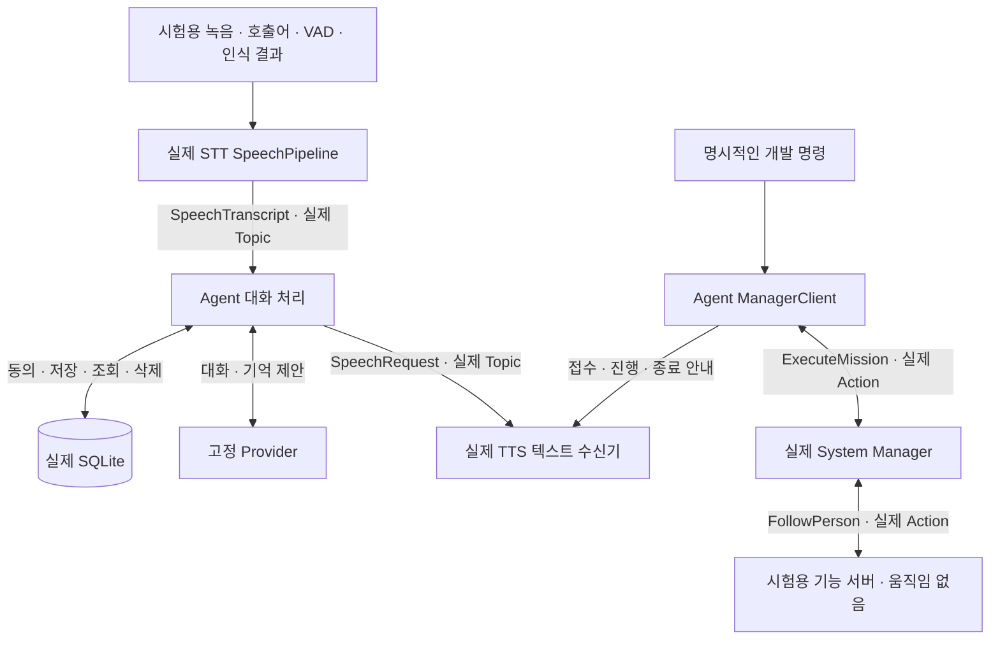

# SWM25-163 전체 흐름 검증

2026-09-09 기준, **현재 구현된 대화·기억·노드 통신 흐름은 자동 시험을
통과했다. 자연어 명령의 Manager 연결과 TTS 음성 합성·재생은 아직 구현되지
않았으므로, 전체 사용자 흐름이 완료된 상태는 아니다.**

기준 소스는 [PR #94](https://github.com/SWM-malbut/malbut/pull/94)가 병합된
`main`의 `1f526c6ceecc14f60fd6afcf1f6804cb7c2f7ded`다.
[Agent 명세](malbut_agent.md), [STT 명세](../../malbut_stt/docs/stt_agent.md),
[TTS 명세](../../malbut_tts/docs/tts_agent.md)를 기준으로 확인했다.
이번 변경은 시험과 결과 기록이며 제품 코드와 명세는 수정하지 않았다.

## 확인한 흐름



**실제 ROS 통신**은 메시지와 Action을 실제로 송수신했다는 뜻이다. 실제
음성 인식·모델 추론·스피커 재생·로봇 동작을 확인했다는 뜻은 아니다.
자연어 대화에서 Manager로 실행을 넘기는 연결은 현재 구현에 없다.

## 시험 결과

Docker의 Ubuntu 22.04.5·ROS 2 Humble·aarch64·Python 3.10.12에서 실행했다.
`malbut_interfaces`, `malbut_agent_server`, `malbut_stt`, `malbut_tts`,
`malbut_system_manager` **5개 패키지의 빌드가 모두 성공**했다.

| 대상 | 통과 | 건너뜀 | 실패 |
| --- | ---: | ---: | ---: |
| Agent 전체 | 904 | 0 | 0 |
| STT | 32 | 3 | 0 |
| TTS 텍스트 수신기 | 9 | 0 | 0 |
| System Manager | 109 | 0 | 0 |
| **합계** | **1,054** | **3** | **0** |

Agent의 실제 ROS 시험 **15개**와 추가 시험 파일의 집중 실행 **4개 통과**는
위 Agent 904개에 포함된다. 별도의 시험 수로 더하지 않는다.

STT에서 건너뛴 항목은 `webrtcvad`가 필요한 1개와 OpenAI SDK가 필요한
2개다. 라이브러리가 있는 macOS 가상환경에서 STT 전체 **34개 통과·ROS 1개
건너뜀**을 확인했고, 해당 SDK·VAD 3개도 따로 실행해 **3개 통과·0개 건너뜀**
을 확인했다. SDK 시험은 로컬 HTTP 대역이며 실제 OpenAI API 호출이 아니다.

- [최종 결과 요약](validation/SWM25-163_FULL_FLOW_2026-09-09/validation-summary-final.json),
  [Ubuntu 환경](validation/SWM25-163_FULL_FLOW_2026-09-09/environment.json),
  [빌드 로그](validation/SWM25-163_FULL_FLOW_2026-09-09/build.log)
- JUnit: [Agent](validation/SWM25-163_FULL_FLOW_2026-09-09/malbut_agent_server_final.xml),
  [STT](validation/SWM25-163_FULL_FLOW_2026-09-09/malbut_stt.xml),
  [TTS](validation/SWM25-163_FULL_FLOW_2026-09-09/malbut_tts.xml),
  [Manager](validation/SWM25-163_FULL_FLOW_2026-09-09/malbut_system_manager.xml)
- [macOS SDK·VAD 시험](validation/SWM25-163_FULL_FLOW_2026-09-09/macos-sdk-vad.xml),
  [macOS 실행 환경](validation/SWM25-163_FULL_FLOW_2026-09-09/macos-sdk-vad-environment.json)

## 시나리오와 시험 근거

시험 경로는 Agent의 `test/`를 기준으로 하며, 다른 패키지는 별도로 표시한다.

| 시나리오 | 확인한 결과 | 시험 근거 |
| --- | --- | --- |
| STT 발화 확정 → Agent → TTS | 제품 `SpeechPipeline`의 원문·UUID가 실제 Topic으로 전달되고 답변이 TTS에 도착. 명령·기억 저장은 발생하지 않음 | `test_ros_memory_communication.py::test_stt_pipeline_final_text_reaches_agent_and_tts` |
| 발화 중복·후속 대화 | 같은 ID는 추론·답변 1회, 다음 발화는 기존 문맥 사용 | 위 시험, `test_node_communication_ros.py` |
| 동의·저장·조회·삭제 | 동의 전 무저장, 동의 후 저장, 관련 기억 조회, 삭제된 기억·출처 재사용 차단 | `test_ros_memory_communication.py::test_ros_consent_save_recall_and_delete` |
| Agent 재생성 후 새 대화 | 같은 사용자·SQLite에서 동의·기억 유지. 삭제 후 다시 생성하면 기억이 돌아오지 않음 | `test_ros_memory_communication.py::test_ros_restart_recalls_and_deletes_memory` |
| 응답 대기 중 다른 DB 연결에서 삭제 | 발행 직전 검증으로 낡은 개인화 답변 차단 | `test_ros_memory_communication.py::test_ros_does_not_publish_answer_deleted_after_queue_drain` |
| Manager 실행·진행·결과 | 실제 Manager와 시험용 기능 서버의 결과를 해당 요청에 연결해 TTS로 안내 | `test_node_communication_ros.py::test_follow_feedback_and_result_reach_real_tts_receiver` |
| 거절·중복·Manager 부재 | 미등록 기능의 하위 실행 없음, 중복 Goal 없음, 부재를 성공으로 안내하지 않음 | `test_node_communication_ros.py` |
| 대화 추론 중 취소 | 추론을 막아도 취소 진행. 접수·최종 종료·물리 정지를 구분 | `test_node_communication_ros.py::test_slow_dialogue_does_not_block_manager_feedback_or_cancel` |
| 사용자 분리·정정·중단·경합 | 기존 기억 정책과 HTTP·음성 처리 회귀 시험 통과 | `test_personal_memory_flow.py`, `test_speech_memory.py`, `test_text_memory_boundary.py` |
| 기능 자원 충돌·선점·Service | Manager의 기존 스케줄링·Action·Service 회귀 시험 통과 | `malbut_system_manager/test/` |

이번에 STT 전체 연결과 Agent 재생성 후 기억 조회 시험, 총 2개를 추가했다.
재생성은 **같은 시험 프로세스 안에서 Agent Node와 대화 worker를 닫고 다시
만드는 방식**이다. OS 프로세스 재시작을 검증한 것으로 표현하지 않는다.

최초 연결 시험은 ROS 원문과 내부 `AgentRequest`의 앞뒤 공백 제거를 동일하게
기대해 실패했다. 원문 `  안녕\n`은 수신·중복 판정까지 보존되고 내부 대화
입력은 기존 규칙대로 `안녕`이 되는 것을 각각 확인하도록 **시험만 수정**했다.
수정 후 집중 시험과 Agent 전체 시험을 모두 통과했다.

## 소스 일치와 실행 격리

기준 소스 **223개 파일의 전송 일치**를 확인했으며 불일치는 없었다.
이후 변경한 `test/test_ros_memory_communication.py`도 시험 소스와 일치했다.
최종 파일 SHA-256은
`bc3348ca6e003b029448a1b77d7f747f2ba9f569aadd0f5e2aa421040c29778d`다.

기본 시험 도메인 `195`, Agent fixture `193`, STT fixture `191`을 localhost로
격리했다. 기존 Manager 도메인 `159`와 기존 실행 도메인 `192`는 유지했고,
종료 후 시험 도메인 `191`·`193`·`195`에 시험 프로세스가 남지 않았다.

전체 개발 로그는 다음 위치에 보존했다.
`/var/folders/5s/gq4btl_j0cl6870s1__ggygh0000gn/T/malbut-swm25-163-full-ros-dhy4hb7h/`

## 재현 방법

ROS 작업 공간의 `src/malbut`에 저장소를 둔 예시다. 시험 도메인
`191`·`193`·`195`가 다른 실행에 사용 중이지 않은지 먼저 확인한다.

```bash
(
  set -e
  source /opt/ros/humble/setup.bash
  colcon build --packages-select malbut_interfaces malbut_agent_server \
    malbut_stt malbut_tts malbut_system_manager
  source install/setup.bash
  export ROS_DOMAIN_ID=195
  export ROS_LOCALHOST_ONLY=1

  for package in malbut_agent_server malbut_stt malbut_tts malbut_system_manager; do
    (
      cd "src/malbut/$package"
      PYTHONPATH=.:"${PYTHONPATH}" python3 -m pytest -q -rs test
    )
  done
)
```

ROS 모듈 경로를 유지하기 위해 `PYTHONPATH=.`로 덮어쓰지 않는다. 이 시험은
외부 API 키·마이크·스피커를 요구하지 않는다. 빌드된 STT 패키지가 있어야
추가한 pipeline 연결 시험도 건너뛰지 않고 실행된다.

## 남은 연결과 실제 장비 시험

| 항목 | 현재 상태와 다음 확인 |
| --- | --- |
| 자연어 명령 → Manager | **미연결.** 음성 대화는 실행 Tool 없이 대화·질문·거절만 처리한다. Manager 실행은 개발 JSON 요청으로만 가능하다. 사용자 요청·대상·입력 검증을 실행 경로에 연결해야 한다. |
| TTS 합성 → 스피커 | **미구현.** 현재는 텍스트 수신·로그 출력만 한다. 합성·순차 재생·오류 처리는 별도 구현과 검증이 필요하다. |
| 실제 Ubuntu PC 마이크·스피커 | 사용자가 Ubuntu PC에서 이 변경을 받아 직접 실행할 예정이다. **실제 음성은 미검증**이며, 실행 전에 마이크·호출어 모델·키·오디오 장치를 확인해야 한다. |
| 실제 모델·음성·로봇 | 이번 전체 검증에서는 실제 모델 API·마이크·스피커·물리 로봇을 사용하지 않았다. 이전 SWM25-165 Luna 시험과 이번 고정 Provider·ROS 시험은 별도 근거다. |

이번 결과는 **구현된 흐름의 검증 통과와 남은 연결의 확인**으로 기록한다.
전체 음성 사용자 경험이나 물리 동작 완료로 기록하지 않는다. Jira의
SWM25-163은 확인 시 설명이 비어 있고 상태가 `할 일`이었으며, 이번 결과 기록으로
Jira 설명·상태를 변경하지 않았다.
