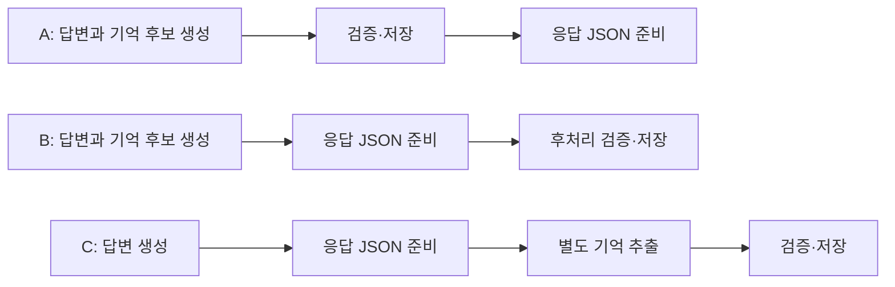

# SWM25-165 기억 처리 시간 비교

동의한 사용자의 일상 정보 자동 저장을 비교하는 개발용 도구다.
비교 도구 자체는 운영 처리 방식과 HTTP·ROS 계약을 변경하지 않는다.
비교 후 운영 모델은 SWM25-165에서 Luna로 맞췄으며 A 방식을 유지한다.

**최종 선택: A — 검증·저장 후 답변.** 사용자가 비교 결과를 확인한 뒤 A를
선택했다. 답변과 기억 후보를 함께 생성하고, 검증과 DB 확정 후 응답하는
기존 `AgentOrchestrator` 경로를 HTTP·STT 대화에서 유지한다.
명시적인 기억 관리도 실제 처리 결과를 확인한 뒤 안내한다.
B/C는 비교 도구에 남겨두며 운영 경로에 연결하지 않는다.



## 실행

`malbut_agent_server` 디렉터리에서 실행한다. 출력 디렉터리는 새 경로여야 한다.
기본 실행은 고정 응답 시험이며 API 키나 네트워크가 필요 없다.

```bash
PYTHONPATH=. python3 -m pytest -q test/test_memory_benchmark.py
PYTHONPATH=. python3 -m malbut_agent_server.memory_benchmark \
  --output-dir /tmp/malbut-memory-benchmark-fixed
```

실제 모델 비교는 기존 `OPENAI_API_KEY` 환경변수를 사용한다.
`--live`를 붙이면 유료 호출이 발생한다. 키는 파일·화면·보고서에 출력하지 않는다.

```bash
PYTHONPATH=. python3 -m malbut_agent_server.memory_benchmark --live \
  --output-dir /tmp/malbut-memory-benchmark-live
```

- 모델: 모든 단계 `gpt-5.6-luna`, reasoning `none`, 출력 상한 500토큰.
- 호출 제한: 30초, 재시도 0, 모델 전환 없음, 총 44회 상한. 실패도 호출 수에 포함.
- 준비: A·B·C에서 반려동물 사례 1회씩, 총 4호출. 준비 실패 시 본시험 중단.
- 본시험: **A·B·C 각각 10회**, 총 30시험·40호출.
  방식별로 반려동물 4회·선호 3회·인사 3회를 동일하게 배정한다.
- 실행 순서: ABC, ACB, BAC, BCA, CAB, CBA를 순환하여 10묶음을 만든다.
  반려동물·선호·인사를 차례로 배정하며 각 묶음 안에서는 같은 사례를 비교한다.
- API 400/401/403/404/429는 설정·접근·제한 오류로 중단한다.
  실패한 API 호출을 고정 응답으로 대체하지 않는다.

## 측정 범위와 해석

시험마다 독립적인 SQLite 파일을 만들고, 명시적으로 동의한 가상 사용자와
빈 대화·장기기억에서 시작한다. DB 준비는 시간에서 제외한다. 요청 접수,
기억 문맥 조회, 모델 호출, 결과 검증, JSON 직렬화는 측정에 포함한다.

| 지표 | 기준 |
|---|---|
| `reply_ready_ms` | 요청 처리 시작부터 최종 응답 JSON 직렬화 완료까지 |
| `memory_done_ms` | 같은 시작점부터 기억 검증 및 대화 완료 트랜잭션 확정까지 |
| `latency_ms` | 개별 API 전송부터 응답 수신까지 |
| `cost_usd` | API가 반환한 토큰 사용량으로 계산한 기본 요금 추정치 |

B/C는 응답 JSON을 먼저 고정하고 단일 worker에서 후처리를 수행한다.
다음 시험은 worker 종료 후 시작한다. 지연을 인위적으로 추가하지 않는다.
기존 `PersonalMemory.snapshot/commit`과 `complete_turn`의 동의·원문·변경 번호·
세션 검사를 재사용한다. C도 최초 snapshot을 사용하여 추출 도중의 변경을 감지한다.

**이 도구는 답변 준비 시간을 비교하며 운영 HTTP 조기 전달을 구현하지 않는다.**
B/C의 대화 기록은 후처리 완료 전까지 pending 상태다. 답변을 먼저 영속화하고
실제로 전달하는 비용, 지속적인 요청 처리·작업 복구·TTS 재생은 별도 검증 대상이다.
별도 worker를 시작하는 비용은 기억 완료 시간에 포함된다.

A/B는 기존 결합 응답 스키마, C의 첫 호출은 기존 대화 스키마를 사용한다.
C의 두 번째 호출은 답변 필드 없이 기억 제안만 생성한다. 모든 대화 호출에
동일한 저장 완료 주장 금지 문장을 추가하므로 A는 기본 운영 프롬프트와
바이트 단위로 동일한 시험은 아니다. 프롬프트·출력 길이 차이도 결과와 함께 기록한다.

모델 답변·먼저 준비된 JSON·저장 후 JSON을 각각 보존한다. 조기 저장 완료 주장,
저장 뒤 변경된 판단, 잘린 출력, 예상과 다른 기억은 품질 실패로 제외한다.
서버의 중립 문장 대체가 발생해도 모델 성공으로 계산하지 않는다.
표의 valid는 고정 사례의 구조·기대 사실 검사를 통과했다는 의미이며,
한국어 대화 품질 전반의 평가를 의미하지 않는다.

## 산출물

- `results.json`: 환경, 도구·패키지 소스 해시, 모든 요청 payload·응답·토큰·오류,
  시험 결과와 30개 본시험 전체 성공 여부.
  Authorization 헤더는 기록하지 않는다. 입력은 코드에 있는 가상 사례뿐이다.
- `trials.csv`: 시험별 준비·저장 시간, 비용, 정확성, 실패.
- `calls.csv`: 호출별 시간, 입력·출력·캐시 토큰, 비용, HTTP 상태.
- `REPORT.md`: 올바르게 처리된 본시험의 중앙값과 유효 시험 수.
- `trial-*.sqlite3`: 각 시험의 실제 저장·출처 기록.

원시 JSON에는 중앙값·최솟값·최댓값도 포함한다. 표본이 방식당 10개이고
사례별로 3~4개이므로 작은 시간 차이를 확정적인 성능 차이로 해석하지 않는다.
실패율이나 유효 사례 구성이 다르면 속도 순위를 직접 비교하지 않는다.
준비 호출도 비용에 포함하며 사용량이 없으면 비용을 0으로 간주하지 않는다.

기본 요금 추정에는 입력 $0.20, 캐시 입력 $0.02, 출력 $1.20 / 100만 토큰을
사용한다. 실제 청구액·네트워크·캐시 상태와의 차이는 남을 수 있다.
[GPT-5.6 Luna 공식 가격](https://developers.openai.com/api/docs/models/gpt-5.6-luna)

## 최신 실측 결과 — 방식당 10회

키 갱신 후 모델 접근 확인(HTTP 200)을 거쳐 A·B·C를 각각 10회 실제 호출했다.
준비 3회까지 총 33시험·44API 호출이며, A 10/10·B 9/10·C 10/10이 기대 결과를
충족했다. B의 취향 추출 실패를 포함한 같은 묶음을 제외하고 **성공한 9묶음씩**
시간을 비교했다.

| 방식 | 답변 준비 중앙값 | 기억 완료 중앙값 | 본시험 10회 추정 비용 |
|---|---:|---:|---:|
| A — 현재 방식 | 2.055초 | 2.055초 | $0.00142818 |
| B — 저장만 후처리 | 2.819초 | 2.820초 | $0.00142650 |
| C — 추출부터 후처리 | 1.681초 | 3.106초 | $0.00515160 |

C는 답변 중앙값이 A보다 약 18.2% 짧았고 비용은 이번 캐시 조건에서 약 3.6배였다.
B의 응답 뒤 검증·저장 구간은 중앙값 2.120ms로 짧았다. 준비 호출 포함 추정 비용은
$0.00919734다. 저비용을 우선하면 A 유지, 첫 답변 속도를 우선하면 C 검토를 권한다.
운영 처리 방식은 변경하지 않았다.

실패 원인, 표본 구성, 토큰·캐시 차이와 원본은
[10회 실측 보고서](benchmarks/memory-latency-10x-20260909/REPORT.md)에 정리했다.

## 최초 실행 기록 — 방식당 6회 버전

아래 기록은 10회로 늘리기 전 실행이다. 당시 인증 오류로 측정하지 못했고,
이후 갱신한 키로 수행한 실제 비교 결과는 위의 최신 실측 결과를 기준으로 한다.

| 확인 항목 | 결과 |
|---|---|
| 비교 도구 자동 시험 | 23 passed |
| Agent 전체 시험 | 879 passed, 2 skipped (로컬 ROS 의존성 없는 시험 환경) |
| 새 Python 코드 스타일 | flake8 통과 |
| 고정 응답 전체 실행 | 준비 3회 + 본시험 18회 통과, 고정 transport 28호출 |
| 실제 API 실행 | 첫 준비 호출에서 HTTP 401 인증 실패, 즉시 중단 |
| 실제 모델 속도·토큰 비용 비교 | 미완료: 성공한 실제 모델 응답과 usage 없음 |

실제 API는 총 **1회 요청**했고 재시도·다른 모델 호출·고정 응답 대체를 하지
않았다. 실패 요청의 왕복 시간을 답변 지연으로 사용하지 않는다.
`known_cost_usd=0`은 확인된 사용량 합계가 없다는 의미이며, 이번 실행은
`usage_complete=false`이므로 실제 청구 비용이 0이라고 확정하지 않는다.

고정 응답의 밀리초 수치는 Python·SQLite 측정 도구 검증용이다. 실제 모델의
속도나 세 방식의 사용자 체감 차이를 입증하지 않는다. 당시에는 권고할 실측
근거가 없어 운영 구조를 유지했고, 이후 실제 측정을 별도로 수행했다.

- [고정 응답 시험 요약](benchmarks/memory-latency-20260909/fixed/REPORT.md)
- [실제 API 시도 요약](benchmarks/memory-latency-20260909/live/REPORT.md)
- [실제 API 원시 기록](benchmarks/memory-latency-20260909/live/results.json)

각 결과 폴더에 CSV와 원시 JSON을 함께 보존했다. 시험 DB는
`/tmp/malbut-memory-bench-fixed-20260909-final`과
`/tmp/malbut-memory-bench-live-20260909-1`에 남아 있다.
API 인증을 갱신한 뒤 새 출력 디렉터리에서 실제 측정을 다시 실행한다.
인증 오류로 중단되면 사용자에게 연결 갱신을 요청하고 비교 작업을 이어간다.
실제 비교 결과가 없는 상태를 작업 완료로 보고하지 않는다.
