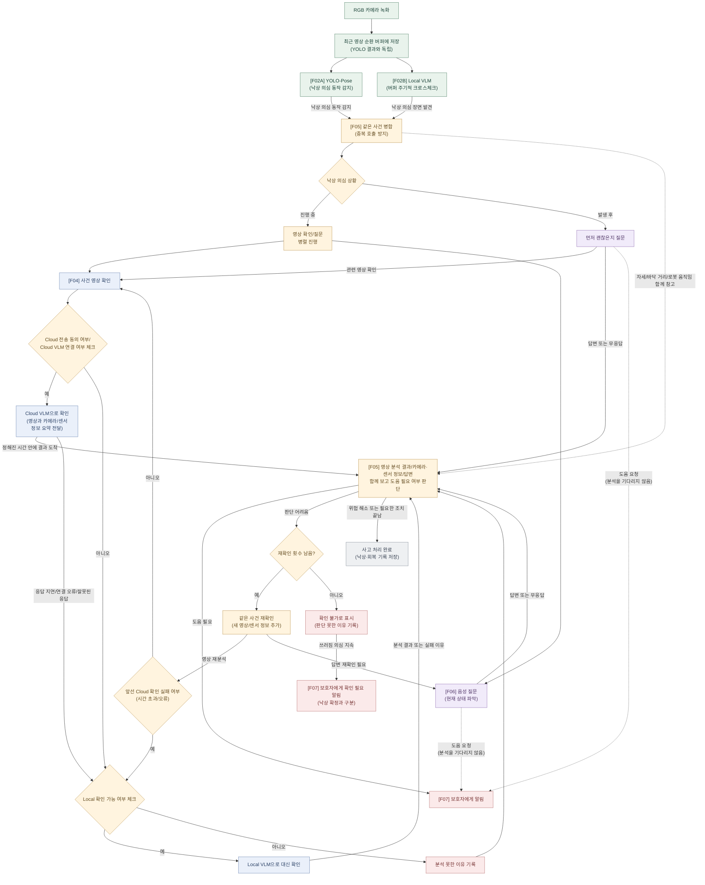
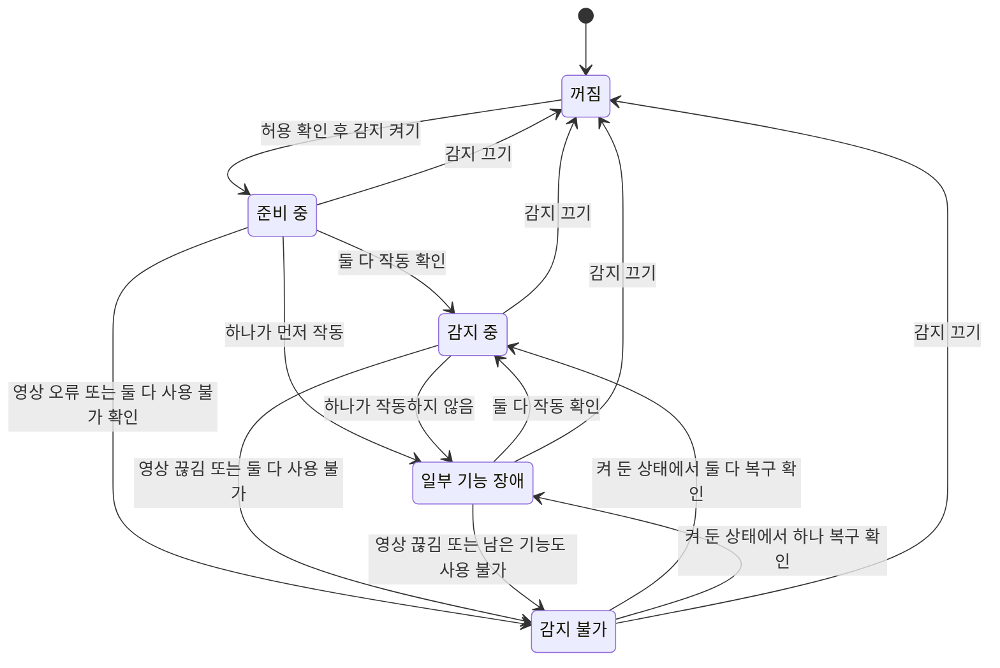
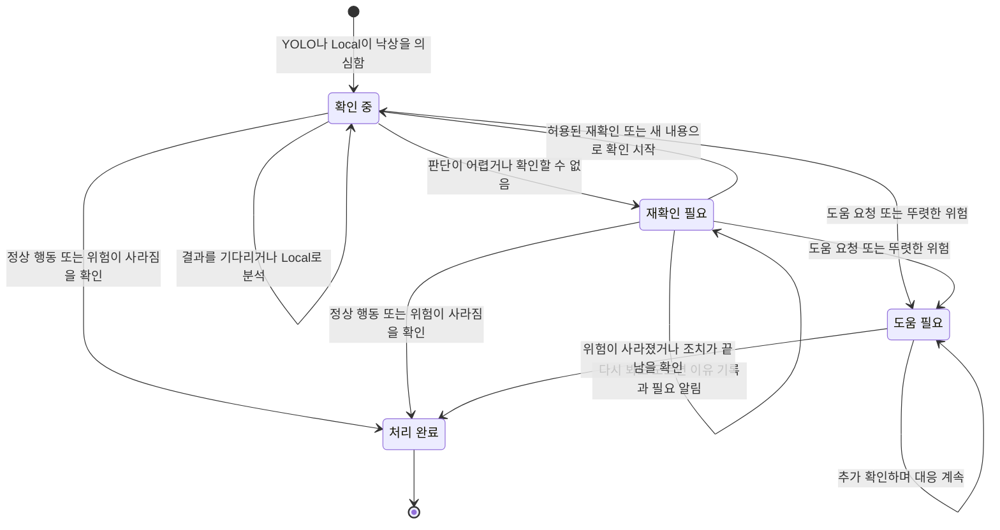
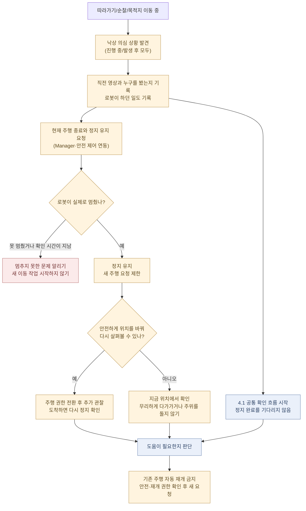

# 낙상 감지 기능 명세

> 2026-09-18: Cloud 전용 변경과 실행 코어 구현은
> [낙상 감지 명세](fall_detection.md)를 우선 참고한다. 아래의 Local VLM 상시 확인·대체
> 실행은 이전 설계이며, 이 문서의 과거 평가 결과는 그대로 보존한다.

- 버전: 0.9.5 / 2026-09-17
- 작성 기준: [사람 추적 기능 명세](https://app.notion.com/p/3c7c6013131b80a7b2b3c1d363e4cd1c)의 항목 구성. 본문 확인: 2026-09-08.
- 상태: 설계 초안. 주고받을 데이터와 상태를 제안한 문서다. ROS 타입이 확정됐거나 구현이 끝났다는 뜻은 아니다.
- 합의 범위: 4.2의 다섯 감지 상태와 4.3의 네 사건 상태, 각 기본 전이·복구·종결 원칙. 판정 수치·세부 증거 기준·ROS 타입은 후속 명세 대상이다.
- 변경 범위: 명세·Mermaid·미리보기. 모델 호출, 로봇 제어, 코드 구현, Notion 원문 수정은 하지 않는다.
- 기존 모듈별 설계와 Mermaid는 [상세 설계 메모](FALL_DETECTION_ARCHITECTURE_NOTES.md)에 보존한다.
- 코드 확인 기준: `1f526c6ceecc14f60fd6afcf1f6804cb7c2f7ded`. 최신화한 작업 브랜치의 HEAD와 로컬 `origin/main`이 같은 상태에서 확인했다.
- 변경 요약: 이전 `/monitor_falls` 단일 Action 제안을 폐기하고, 상시 감지·설정 변경·사건 분석·질문·정지 유지로 호출 책임을 나눴다. 아래 새 이름과 타입은 여전히 제안이다.
- 이번 변경: 6절에 현재84개·3분류의 데이터 구분/판단·채점 기준/세 가지 주 평가지표를 정리했다. [현재 결과](#current-model-results)를 근거로 사건 영상 확인에 Gemma4 31B Cloud를 사용하기로 한다. 운영 연결·응답 형식 처리·실물 검증은 남아 있으며, 4.1~4.4 흐름·상태와 과거 평가 기록은 변경하지 않았다.

## 1. 목표

집 안에서 사람이 넘어지거나 쓰러져 있는 모습을 발견하고, 도움이 필요한지 확인한다.
쓰러진 사람을 놓치지 않는 데 중점을 두되, 앉거나 눕는 행동을 낙상으로 잘못
판단하는 경우도 줄인다.

- YOLO-Pose는 카메라 영상에서 사람의 자세 변화를 보고, 넘어지는 것으로 보이는 움직임을 찾는다.
- Local VLM은 로봇에서 최근 영상을 주기적으로 살펴본다. YOLO-Pose가 아무것도
  감지하지 못했을 때도 따로 확인해, 놓친 쓰러짐 상황을 찾는다.
  Cloud VLM이 제한 시간 안에 답하지 못하면, 해당 사건의 영상 확인도 로컬에서 맡는다.
- Cloud VLM은 둘 중 하나가 낙상을 의심하면 해당 영상을 분석한다. 실제로 넘어진
  것인지, 앉거나 누운 것인지 구분하는 데 사용한다.
- 로봇은 Cloud VLM의 분석을 기다리는 동안 “괜찮으세요? 도움이 필요하세요?”라고 묻는다.

Cloud VLM 또는 대신 실행한 Local VLM의 분석 결과와 사람의 답변을 함께 보고
도움이 필요한지 판단한다. 제한 시간은 Cloud 응답을 기다리는 데만 적용한다.
Local 확인에는 별도의 제한 시간이나 '전체 시간 중 남은 시간' 조건을 붙이지
않는다. 로컬로 바뀌어도 질문을 다시 시작하지 않으며, 로컬도 확인하지 못하면
정상으로 처리하지 않는다.
이때 YOLO-Pose가 파악한 자세 변화, depth로 측정한 신체와 바닥 사이 거리,
로봇이 움직이고 있었는지도 참고한다. 측정하지 못한 정보는 없는 상태로 남긴다.

이미 바닥에 있는 사람을 발견했다면 먼저 상태를 묻고, 버퍼에 남은 관련 영상도
확인한다. 이전에 넘어지는 장면이 녹화됐을 수 있기 때문이다. 녹화가 없으면
현재 영상·카메라/센서 정보·답변으로 확인을 이어간다. 도움이 필요하다고 말하거나 명백히
위험한 상황이면 분석이 끝날 때까지 기다리지 않고 정해진 보호자 알림 절차를 시작한다.

분기 기준은 사람을 따라가는지, 순찰하는지가 아니라 **어떤 장면을 봤는지**다.
두 주행 상황 모두 넘어지는 동작을 보거나, 이미 바닥에 있는 사람을 발견할 수 있다.

## 2. 기능 범위

### 포함

- 연령·가족 등록 여부와 관계없이 관측 가능한 모든 사람을 감지한다. 여러 사람의 사건은 분리한다.
- 낙상 의심 상황의 '진행 중'과 '발생 후'를 다룬다. 정지·따라가기·순찰 모두 같은 확인 흐름을 사용한다.
- 같은 사건의 두 감지 경로·분할 클립·추가 관측은 하나의 `incident_id`로 관리한다.
- Cloud 응답 지연 시 Local VLM으로 사건 영상을 확인한다. 상시 보조 감지와는
  역할을 구분하며, 로컬 전환을 별도의 세 번째 감지 경로로 세지 않는다.
- 음성 상태 확인, 안전 정지 요청, 제한된 재관측, 보호자 알림 연동을 모듈별로 명세한다.
- 센서는 Aurora930 RGB-D, 카메라 높이는 15~20 cm를 설계 범위로 한다.
  실제 장착 높이·pitch·RGB/depth 정렬은 보드에서 측정해야 한다.
- Local VLM의 목표 실행 위치는 ROSOrin Jetson Orin NX Super 8GB 내부다.
  Mac/별도 PC 실행은 개발용이며 보드 실행 성능을 대신하지 않는다.

### 제외 및 제한

- 의학적 진단, 사각지대까지 100% 감지 보장, 얼굴 실명 식별을 하지 않는다.
- 파인튜닝은 하지 않는다. 로컬·클라우드 모델과 서빙 엔진은 아직 선정하지 않았다.
- YOLO와 Local VLM의 공동 미탐은 가능하다. 같은 영상의 오류를 독립 확률로 가정하지 않는다.
- 원본 depth는 VLM에 보내지 않는다. VLM 시각 입력은 RGB이고, 유효한 센서 요약만 선택적으로 전달한다.
- 후보 없는 상시 Cloud VLM 호출, 별도의 세 번째 위험 감지 경로는 이번 범위에 추가하지 않는다.
- VLM이 주행·긴급 시스템 상태·외부 연락을 직접 실행하지 않는다.

## 3. 입력과 출력

아래는 모델이 바뀌어도 공통으로 사용할 입력·출력 형식의 초안이다.
실제 `.msg/.action/.srv`, 데이터 크기 제한, 영상 설정과 기능 이름은 구현 전에
확정한다. `?`는 값이 없을 수 있다는 뜻이며,
값이 없으면 사유를 함께 기록한다. 관측하지 못한 값은 `0`이나 `false`로 대체하지 않는다.

### 3.1 감지 기능 입력

이 표는 기능이 사용하는 정보를 모은 것이다. 전부 Action Goal에 넣는다는 뜻은
아니다. 설정 변경 요청, 카메라/센서 Topic, 사건별 요청을 나누는 안은 3.4절에 적는다.

| 필드 | 타입 / 단위 | 의미 및 조건 |
| --- | --- | --- |
| `enabled` | boolean | 권한을 확인한 낙상 감지 설정. 설정 변경 Service 제안은 3.4절 참고. Bringup 실행 여부와 구분 |
| `device_id`, `boot_id` | string | 장치와 부팅 세션 식별. 시계·트랙 ID 재사용을 구분 |
| `rgb` | timestamped RGB stream | 실제 촬영 시각과 프레임 ID 포함. Local VLM 입력을 YOLO 검출 성공에 종속시키지 않음 |
| `depth`, `camera_info`, `extrinsics` | timestamped sensor data? | 정렬·시계·단위·보정이 유효한 경우에만 로컬 계산에 사용 |
| `robot_motion` | timestamped observation? | 선속도 m/s, 각속도 rad/s, 실제 정지 여부와 유효성 |
| `active_mission_id`, `target_track_id` | string? | 따라가기·주행 중 안전 정지와 대상 연결에 사용. 미식별 사람도 감지 대상 |
| `local_input_profile_id` | string | 버퍼 구간·겹침·샘플링·해상도·실행 주기·큐 상한의 버전. 값은 보드 실측 후 결정 |
| `verification_policy_id` | string | Cloud 응답 대기 시간, Local 실행 설정, 재질문/재시도, 대상 연결·알림 규칙의 버전. Local 전환에 남은 시간 조건을 붙이지 않음 |
| `cloud_consent`, `notification_policy_id` | boolean / string? | 외부 영상 전송 동의와 수신자·알림 정책. 동의 없이 자동 외부 전송 금지 |

시작 전 센서·설정 준비를 확인한다. `enabled=false`는 낙상 기능의 신규 점검·후보
생성을 중단시키되 기존 사건을 정상으로 종결하는 명령은 아니다. 진행 중 사건의
영상 전송·분석·질문까지 중단할지는 아직 정하지 않았다.
진행 중 작업의 취소·증거 보존/삭제·안전 대응 인계는 개인정보 및 안전 정책에서
명시적으로 확정해야 한다. 단순 감지 종료와 사건 처리 완료를 혼동하지 않는다.
공유 카메라·YOLO를 낙상 기능이 임의로 끄면 따라가기 등 다른 소비자도 멈추므로,
낙상 감지 OFF와 장치 카메라 전원 OFF도 별도 설정으로 취급한다.

### 3.2 모듈별 입력·출력

| 모듈 | 입력 | 출력 | 책임 경계 |
| --- | --- | --- | --- |
| F01 카메라/센서 정보 수집 | RGB, 선택 depth/CameraInfo, 보정, 로봇 이동 | `Observation`, 센서 건강 상태 | 대상·시각·단위·정렬 검증. 가짜 측정값 생성 금지 |
| F02A YOLO-Pose | RGB, 자세·추적 결과, 유효한 이동/바닥 관측 | `Candidate` 또는 후보 없음 | 빠른 의심 감지. Local VLM 결과를 기다리지 않음 |
| F02B Local VLM | YOLO 결과와 관계없이 최근 RGB 영상 | `LocalScanResult`, 선택 `Candidate` | YOLO가 놓친 장면 확인. Local만 의심해도 상태 확인 시작 |
| F03 영상 버퍼 | 관측 프레임, 후보 근거 구간 | 권한·수명이 있는 `MediaRef`, 실제 구간·누락 | 후보 전부터 버퍼 유지. 진행 사건의 선행 구간 보존 |
| F04 사건 영상 확인 | `AnalysisRequest`: RGB와 유효한 선택 요약 | `AnalysisResult`: 모델 관측 또는 실행 오류 | Cloud 대기 시간 관리와 Local 전환 담당. F02B의 상시 후보 감지와 구분. 직접 알림·이동 금지 |
| F05 사건 관리·상태 판단 | 두 경로의 의심 장면, 원본 관측, 분석·음성 결과 | `IncidentUpdate`, 확인/알림 작업 요청 | 사건 상태 변경은 이 모듈에서만 수행. 사람별 사건 구분, 중복 작업 방지, 시도별 결과 반영 |
| F06 질문·주행 대응 연동 | 사건/대상, 질문·정지·추가 관찰 요청과 수행 설정 | `VerificationResult`: 응답·실제 수행 상태·실패 사유 | 질문과 이동은 별도 작업으로 요청. Manager 자원 규칙 준수. 현재 없는 정지·질문 계약은 추가해야 함 |
| F07 발행·알림 | 사건 갱신, 동의·수신자 정책 | UI 사건 상태, `NotificationStatus` | 요청·전송·수신 확인 구분. 지원하지 않는 확인 상태 생성 금지 |

### 3.3 의심 장면·분석 결과·답변의 데이터 형식

코드의 `Candidate`(후보)는 **사람의 상태를 확인할 필요가 있는 장면**을 뜻한다.
낙상이 확정됐다는 뜻은 아니다. 코드 식별자는 유지하고 설명에서는 뜻을 풀어 쓴다.

| 데이터 | 주요 필드와 타입 | 규칙 |
| --- | --- | --- |
| `Candidate` | `candidate_id: string`, `source: yolo_pose / local_vlm`, `candidate_kind: fall_suspected / found_down`, `observation_id: string`, `target_track_id: string?`, 근거 구간, 생성 시각 | `fall_suspected`: 넘어지는 듯한 동작 관측. `found_down`: 하강 과정 없이 바닥에 있는 사람 관측. 둘 다 낙상 확정 아님. 대상 연결 불확실성 별도 기록 |
| `LocalScanResult` | `scan_id: string`, 요청/실제 구간, 샘플 프레임 시각 목록, `execution_status`, `observation_usable: boolean?`, 후보 목록, 누락 구간·사유, 모델/프로필 버전 | 성공·후보 없음·시야 부족·실행 실패를 구분. 프레임 간 샘플 간격도 기록 |
| `MediaRef` | `media_id: string`, `sha256: string`, 권한 있는 참조, 만료 시각, 포맷, 해상도, FPS, 길이 s, 실제 촬영 구간 | 해시·권한·허용 경로/호스트·수명 검증. 버퍼 덮어쓰기나 누락을 숨기지 않음 |
| `AnalysisRequest` | `request_id`, `incident_id`, `evidence_revision`, `media`, `input_profile_id`, `cloud_response_timeout_ms`, 대상 연결, 선택 `local_summary` | 하나의 사건 확인 요청. 전환해도 사건/근거 ID 유지. Cloud 대기 시간만 지정하며 Local의 남은 시간 필드는 두지 않음. GT·파일명 라벨·생성 프롬프트 미전송. 실제 측정값과 Local VLM 추정 분리 |
| `AnalysisAttempt` | 요청 ID, `attempt_id: string`, `execution_target: cloud / local`, `fallback_reason: string?`, 실행 프로필, 시작/종료 시각, Cloud 대기 마감 시각? | 요청 안의 실행 시도를 구분하는 제안. Cloud와 Local에 별도 ID 부여. 재전달로 동일 시도를 중복 시작하지 않음. Cloud 대기 기한은 단조 시계로 계산하며 Local에는 적용하지 않음 |
| `AnalysisResult` | 요청/사건/시도 ID, 근거 revision, 실제 실행 위치, `execution_status`, 모델 관측?, 근거 시각, 가림/불확실성, recovery, 설명, 모델/프롬프트/입력 버전, 지연·사용량 | 실행 상태: `succeeded / failed / timed_out / cancelled`. 실패에 정상 모델 결과를 채워 넣지 않음. 늦은 응답과 시도별 비용도 구분 |
| `VerificationResult` | 사건/대상 ID, 질문/녹음/STT/이동 수행 상태, `response`, 증거 시각, 대상 연결 신뢰도, 실패 코드 | `response`: `help_requested / says_ok / unclear / no_answer / not_asked`. 다른 사람·TV 음성은 대상자 응답으로 확정하지 않음 |
| `IncidentUpdate` | `incident_id`, `revision`, 대상 연결, 원본 후보 ID/발생원 목록, `incident_state`, `assessment`, `recovery`, 근거·정책 사유, `notification_status` | 사건 상태·관측 판정·회복·알림 상태 분리. 오래된 정상 결과로 새 위험을 덮어쓰지 않음 |

시각은 관측 시작/끝, 후보 생성, 사건 수신, 추론 시작/끝, 정책 결과 발행을
구분한다. 외부 교환 시각에는 시계 기준/부팅 세션을 기록하고, 기한 계산은
단조 시계를 사용한다. 다른 시계 간 지연은 동기화/변환이 검증된 경우에만 계산한다.

`assessment`는 기존 도메인의 `confirmed_fall / found_down / normal_activity /
unobservable`을 유지하는 안이다. 아직 판정 전이면 nullable이고, 낙상 의심은
후보와 진행 상태에 보존한다. `recovery`는 `recovered / not_recovered / unknown`이다.
`confirmed_fall`은 실제 하강 과정의 근거가 있을 때만 사용한다.

`candidate_kind`는 **처음 본 장면**을 나타내며, 사고가 실제로 있었는지를 확정하는
분류가 아니다. `fall_suspected`에는 넘어지는 듯 보이는 앉기/눕기 동작도 포함될
수 있다. `found_down`도 스스로 누운 사람일 수 있으므로 '낙상 이후를 목격했다'고
단정하지 않는다. 같은 사건에서 나중에 선행 영상의 하강 동작을 찾으면 근거를
추가해 판정을 갱신한다. 하강이 보이지 않았다는 이유만으로 확인 대상에서 빼지 않는다.

현재 코드의 `observed_fall_candidate` 등 후보 enum과 `responsive / unresponsive`
응답 enum은 위 제안과 다르다. 호환 변환과 명시적 버전 변경이 필요하다.
특히 `no_answer` 또는 STT 실패를 `unresponsive`로 기계적으로 변환하지 않는다.
이 문서만으로 현재 어댑터가 신규 필드를 송수신한다고 주장하지 않는다.

<a id="call-spec"></a>

### 3.4 낙상 감지 호출 명세 — 제안

**감지 전체를 `/monitor_falls` 하나로 실행·취소하는 이전 안을 아래 구조로 대체한다.**
상시 정보를 만드는 노드는 Bringup에서 실행하고, 사건이 생겼을 때 필요한 작업만
따로 요청한다. F01~F07은 책임 구분이며, 각각을 패키지나 manifest로 만들라는 뜻은 아니다.
이 절의 낙상 전용 이름·타입·등록 ID는 제안이며 아직 구현하거나 등록하지 않았다.

#### 3.4.1 현재 코드에서 재사용할 수 있는 인터페이스

| 용도 | 현재 이름 / 타입 | 확인한 범위와 한계 |
| --- | --- | --- |
| Manager 명령 실행 | `/malbut/mission/execute` · `malbut_interfaces/action/ExecuteMission` | Goal은 `capability_id: string`, `arguments_yaml: string`. 등록된 Action과 짧은 Service를 실행 |
| Manager 상태 | `/malbut/state` · `malbut_interfaces/msg/SystemState` | 낙상 기능이 직접 덮어쓰지 않고 구독. 개별 사건 상태는 별도 발행 |
| 공유 객체 검출 | `/yolo/detections` · `yolo_msgs/msg/DetectionArray` | `malbut_yolo`가 발행. 기본 모델은 YOLO26n 객체 검출이며 Pose 결과가 준비됐다는 뜻은 아님 |
| 사람 따라가기 | `/follow_person` · `malbut_interfaces/action/FollowPerson` | `follow_person` manifest, `resources: [BASE]`. 낙상 확인을 위해 호출하는 기능이 아니라 정지 시 종료 대상이 될 수 있는 기존 주행 |
| 음성 인식 결과 | `/malbut/speech/transcript` · `malbut_interfaces/msg/SpeechTranscript` | `utterance_id: string`, `text: string`. 사건·질문 ID, 누가 답했는지에 대한 정보는 없음 |
| 음성 재생 요청 | `/malbut/speech/response` · `malbut_interfaces/msg/SpeechRequest` | `text: string`. 재생 완료·취소·질문별 결과는 이 메시지에 없음 |

공유 YOLO를 구독하는 것만으로 F02A의 Pose 감지가 완성되지 않는다. Pose 모델과
관절·추적 정보의 공급 위치, 메시지 필드, 기존 객체 검출 소비자와의 호환을 별도로
확정해야 한다. 낙상 패키지 안에 동일한 객체 검출기를 중복 실행하는 것은 기본안이 아니다.
RGB·depth·CameraInfo·실제 이동 정보의 Topic은 장치 설정에서 지정하며,
Aurora930의 실제 이름·정렬·시계를 아직 검증한 것으로 취급하지 않는다.

#### 3.4.2 무엇을 상시 실행하고, 무엇을 요청하는가?

| 책임 | 실행 / 통신 방식 | Manager 등록 | 출력 자원 |
| --- | --- | --- | --- |
| F01/F02A/F02B/F03 카메라 정보·후보 감지·영상 버퍼 | Bringup 노드, Topic 구독/발행과 내부 처리 | 없음 | 센서 읽기에는 독점 자원 선언 없음 |
| F05 같은 사건 병합·판단·작업 관리 | 상시 사건 관리 노드. 후보 Topic을 받고 사건별 작업 ID 관리 | 없음 | 직접 차체·스피커를 제어하지 않음 |
| 낙상 감지 켜기/끄기 | 짧은 설정 변경 Service — 아래 제안 | 사용자 명령으로 제공할 때 등록 | `[]` |
| F04 사건 영상 분석 | 사건별 취소 가능한 Action — 아래 제안 | 없음. F05가 호출하는 보조 기능 | 차체·스피커를 점유하지 않음 |
| F06 상태 질문 | 질문별 Action — 아래 제안 | 등록 제안 | `[SPEAKER]` |
| F06 정지 확인·정지 유지 | 정지 유지 Action — 아래 제안 | 등록 제안. 별도 안전 계약 필요 | `[BASE]` |
| F06 위치를 바꿔 다시 관찰 | 안전 조건을 확인한 별도 주행 요청 | 기존 주행 계약 재사용 검토. 별도 제어 기능이면 등록 | `[BASE]` |
| F07 사건 발행·보호자 알림 | 사건 Topic, 알림 모듈의 별도 전송 요청 | 내부 전송 호출만 있으면 등록하지 않음 | 네트워크 알림 자체는 독점 출력 자원 아님 |

Bringup에서 프로세스를 실행한다는 것은 **항상 촬영·외부 전송해도 된다는 뜻이
아니다.** 승인된 감지 설정과 카메라 사용 허용을 확인하기 전에는 낙상용 버퍼
수집·후보 생성·전송을 시작하지 않는다. 실제 카메라의 다른 소비자와 사용 정책도
분리한다. 초기 모델 준비로 설정 Service 응답이나 Manager Goal 접수를 오래 막지 않는다.

F05는 감지 켜기 Service가 반환된 뒤에도 사건을 관리하는 별도 실행 주체다.
하나의 `incident_id`에 분석·질문·정지·알림의 요청 ID와 진행 상태를 연결한다.
분석 한 번이 끝났다고 감지를 종료하거나, 질문 Action 하나가 끝났다고 사건을
종결하지 않는다. 여러 사람이면 사건을 분리하고 공용 스피커·차체 작업만 조정한다.

패키지가 다른 F04 등과는 공개 ROS 인터페이스로 통신한다. 같은 패키지 안의
모델 어댑터 호출까지 ROS나 Manager 명령으로 바꿀 필요는 없다.
Local 모델의 GPU 메모리·분석 큐는 별도 실행 관리 대상이다. Manager에 없는
`GPU`, `CAMERA`, `MICROPHONE` 자원을 임의로 추가하지 않는다.

#### 3.4.3 감지 켜기/끄기 — 짧은 설정 변경 Service 제안

| 항목 | 제안 |
| --- | --- |
| 등록 ID | `set_fall_detection_enabled` |
| Service | `/fall_detection/set_enabled` |
| 타입 | `malbut_interfaces/srv/SetFallDetectionEnabled` — 새 타입 |
| 실행 설정 | `BACKGROUND`, `NORMAL`, `resources: []` |
| 역할 | 승인된 낙상 감지 설정만 변경하고 응답. 한 사건의 분석·질문 완료를 기다리지 않음 |

| 구분 | 필드 | 제안 ROS 타입 | 의미 |
| --- | --- | --- | --- |
| Request | `enabled` | `bool` | 낙상 감지를 켜거나 끄려는 값. 필수이며 기본값을 두지 않음 |
| Response | `accepted` | `bool` | 권한·설정 검증 후 요청을 적용했는지 |
| Response | `enabled` | `bool` | 서버가 적용한 감지 설정. 실제로 모든 감지 경로가 준비됐다는 뜻은 아님 |
| Response | `state` | `string` | 응답 시점의 `STOPPED / STARTING / MONITORING / DEGRADED / ERROR`. 상태 의미와 전이는 4.2절 기준 |
| Response | `message` | `string` | 거부 이유 또는 현재 준비 상태. 비밀키·원본 영상 주소 제외 |

동일한 설정을 재요청해도 노드·감지 루프·사건을 새로 만들지 않는다. 설정은
원자적으로 적용하고, 시작 준비나 장애 복구가 남으면 상태 Topic에서 알린다.
켜기 요청을 적용했어도 영상·모델을 처음 준비하고 있다면 `accepted=true`,
`enabled=true`, `state=STARTING`일 수 있다. `accepted=true`를 감지 준비 완료로
해석하지 않는다. 한 경로가 먼저 동작하면 `DEGRADED`로 실제 감지를 시작한다.
동의·알림 대상·모델·Cloud 대기 시간·재확인 횟수는 별도 권한 있는 설정으로
받는다. 단순 `enabled=true`로 Cloud 영상 전송 동의를 대신할 수 없다.

**감지 OFF 시 진행 중 사건까지 중단할지는 결정 대기 중이다.** 신규 후보 생성
중단과 진행 사건 처리 정책을 구분하며, 정책을 정하기 전에는 이 Service를 운영에
연결하지 않는다. 설정 변경의 `accepted=true`를 모든 분석·질문 취소 완료로 표시하지
않는다. 카메라 전원 OFF·Cloud 동의 철회도 각각 별도 규칙을 정해야 한다.

다음은 타입을 만든 뒤 등록할 manifest의 **문서 예시**다. 실제 파일은 만들지 않았다.
등록이 완료된 뒤에만 Manager의 `capability_id: set_fall_detection_enabled`와
`arguments_yaml: '{enabled: true}'` 형태로 요청할 수 있다.

```yaml
schema_version: 1
capability:
  id: set_fall_detection_enabled
  title: 낙상 감지 설정
  description: 낙상 감지의 활성 설정을 변경한다.
command:
  kind: SERVICE
  name: /fall_detection/set_enabled
  type: malbut_interfaces/srv/SetFallDetectionEnabled
input:
  fields:
    enabled:
      type: bool
      description: 낙상 감지를 켤지 여부
execution:
  mode: BACKGROUND
  priority: NORMAL
  resources: []
```

Manager가 반환한 `SUCCEEDED`는 Service 응답을 받았다는 의미다.
기능 설정 적용 여부는 `result_yaml` 안의 `accepted`를 따로 확인한다.
전송된 Service는 취소할 수 없으며 자동 재전송하지 않는다. 취소 결과를 받더라도
이미 적용된 설정이 자동으로 복구되는 것은 아니다.

#### 3.4.4 사건 영상 확인 — 내부 Action 제안

| 항목 | 제안 |
| --- | --- |
| 호출자 → 처리자 | F05 사건 관리 → F04 사건 영상 확인 |
| Action / 타입 | `/fall_detection/analyze_incident` · `malbut_interfaces/action/AnalyzeFallIncident` — 새 이름·타입 |
| Goal | 3.3절 `AnalysisRequest`: 요청/사건 ID, 근거 revision, RGB 참조, 선택 카메라/센서 정보 요약, 설정 버전 |
| Feedback | 요청/사건/시도 ID, 근거 revision, 실제 실행 위치, `QUEUED / RUNNING / FALLBACK / CANCELING`, 진행 이유 |
| Result | 3.3절 `AnalysisResult`: 시도별 실행 상태, 유효한 모델 결과 또는 실패 이유, 사용 근거·모델/설정 버전·사용량 |
| Manager manifest | 없음. F05의 보조 호출이지 별도 사용자 임무가 아님 |

이 표의 Goal/Feedback/Result는 논리 필드 명세다. ID·revision의 ROS 자료형,
`MediaRef`와 센서 요약의 중첩 `.msg`, 상한·선택값 표현은 아직 확정하지 않았다.
3.4.3의 Service 예시와 달리 지금 `.action`으로 그대로 복사할 수 있는 정의가 아니다.

- 한 Goal은 한 사건의 한 근거 revision을 확인한다. Cloud→Local 전환은 같은
  Goal 안에서 시도 ID만 바꾸며, F05가 별도 사건을 만들지 않는다.
- Cloud 대기 시간은 검증된 정책 설정에서 가져온다. 내부 `AnalysisRequest`의
  `cloud_response_timeout_ms`는 적용값을 기록하며 외부 호출자가 임의로 늘리는
  공개 튜닝 입력으로 두지 않는다. Local·사건 전체에는 제한 시간을 추가하지 않는다.
- 후보 ID와 요청 ID로 중복을 확인한다. 새 근거가 없는 중복 요청은 새 추론으로
  실행하지 않는다. 재확인은 같은 사건에 새 revision과 요청 ID를 붙인다.
- 두 감지 경로의 후보는 모델 추정이지 최종 판단이 아니다. 모델의 유효한
  `unobservable`은 분석 실행 성공일 수 있지만, 정상이나 사건 해결을 뜻하지 않는다.
- 전체 분석 취소 시 남은 로컬 작업·후속 Cloud 전송을 정리하고 F05에 알린다.
  이미 보낸 Cloud 호출의 서버 연산·과금 중단은 보장하지 않는다. 늦은 결과는
  취소된 요청에 연결해 기록하며 새 질문·알림을 시작하지 않는다.
- ROS `SUCCEEDED / ABORTED / CANCELED`는 이 분석 작업의 실행 결과다.
  한 Cloud 시도의 `timed_out` 후 Local이 성공하면 Action 자체는 성공할 수 있다.
  어떤 경우에도 분석 작업 종료를 사건의 `RESOLVED`와 같은 것으로 취급하지 않는다.

#### 3.4.5 질문·정지·추가 관찰 — 별도 자원 작업 제안

| 작업 | 제안 호출 | 입력 / 실행 중 출력 / 종료 출력 | Manager 자원 |
| --- | --- | --- | --- |
| 현재 상태 질문 | `ask_person_status` · `/ask_person_status` · `malbut_interfaces/action/AskPersonStatus` | 입력: 사건·질문 ID, 대상 연결, 질문 설정. 진행: 대기·재생·답변 청취. 종료: `VerificationResult`, 실제 질문/답변 여부·실패 이유 | `[SPEAKER]` |
| 정지 확인·정지 유지 | `hold_position` · `/hold_position` · `malbut_interfaces/action/HoldPosition` | 입력: 정지 요청 ID·사건 연결·이유. 진행: 실제 이동 상태·정지 확인/실패. 종료: 해제/취소/실패 이유 | `[BASE]` |
| 위치를 바꿔 추가 관찰 | 기존 주행 명령 재사용 검토. 새 호출 이름은 아직 정하지 않음 | 입력: 검증된 관찰 위치·주행 조건. 출력: 실제 도착/실패와 새 관측 연결. VLM이 경로를 직접 지정하지 않음 | `[BASE]` |

위 Action의 필드별 ROS 타입과 `execution.mode/priority`는 담당 기능과 합의해야
한다. 이름만 문서에 추가한 것으로 현재 호출 가능한 명령이나 안전 정지 기능이
생겼다고 보지 않는다. 다음 규칙을 만족한 뒤 실제 타입과 manifest를 만든다.

**질문**

- F05는 질문을 Manager에 별도 요청하고 영상 분석과 병렬로 진행한다. 질문
  작업은 스피커 사용과 대화 차례를 맡되 차체 `BASE`를 함께 잡지 않는다.
- 기존 `SpeechRequest.text`와 `SpeechTranscript.utterance_id/text`는 음성
  전송에 재사용할 수 있다. 하지만 질문 ID 연결, 재생 시작/완료/실패, 취소,
  답변 대기 시작, 대상자 응답 연결을 표현할 계약은 추가해야 한다.
- 현재 TTS Topic에 발행했다는 이유만으로 “질문 완료”라 하지 않는다. 일반 대화도
  같은 스피커 사용 규칙을 따르도록 연동해야 한다. 낙상 Action에 `[SPEAKER]`를
  적는 것만으로 기존 Agent의 직접 TTS 발행과 충돌이 해결되지는 않는다.
- 대기·STT 장애·답변 연결 불확실성을 무응답으로 바꾸지 않는다. `no_answer`는
  질문이 실제 재생됐고 응답을 들을 수 있었는지 확인한 뒤, 별도 음성 응답 정책에
  따라 기록한다. 음성 응답 정책의 수치는 아직 정하지 않았으며 Local 시간 제한과 다르다.
- 도움 요청은 중간 사건 갱신으로 즉시 F05에 전달한다. 분석·질문 Action의
  최종 Result가 나올 때까지 보호자 알림을 보류하지 않는다.

**정지·정지 유지**

- 현재 등록된 따라가기·목적지 이동·순찰은 모두 `[BASE]`를 사용한다. 정지 요청도
  이 자원과 충돌하도록 설계해야 한다. F05 또는 분석 작업이 먼저 `[BASE]`를
  잡은 채 하위 주행 Action에 다시 같은 자원을 요청하는 구조는 사용하지 않는다.
- Manager는 충돌하는 기존 임무의 실제 종료를 확인한 뒤 새 요청을 실행한다.
  **명령 취소 완료와 차체의 실제 정지는 별개다.** 이동 센서로 정지를 확인하며,
  정지 확인 실패와 제어 장애는 별도 안전 대응으로 알린다.
- 정지 유지 Action은 멈췄다는 Feedback을 낸 후에도 유지되는 동안 `[BASE]`를
  소유한다. 짧은 정지 Service를 반환하고도 주행이 계속 금지된 것처럼 취급하지 않는다.
- 현재 Manager는 동순위 요청도 기존 요청을 교체한다. 따라서 높은 우선순위의
  정지 Action을 추가하는 것만으로 이동 금지를 보장할 수 없다. 일반 주행 차단,
  수동/비상 제어의 우선권, 정지 해제 권한을 포함한 **안전 계약은 아직 추가 필요**다.
- 여러 사건의 정지 요청은 함께 관리한다. 한 사건이 끝났다는 이유로 다른
  사건이 요구하는 정지를 해제하지 않는다. 추가 관찰로 이동할 때도 정지 유지와
  주행의 권한 전환이 필요하며, `BASE` 충돌 상태에서 두 작업을 동시에 실행하지 않는다.
- 정지·정지 실패 확인과 별개로 영상 확인·질문·도움 요청 대응은 진행한다.
  기존 임무는 Manager 선점으로 종료되며 자동으로 돌아가지 않는다. 안전과
  재개 권한을 확인한 뒤 새 주행 요청을 보내야 한다.

F07의 네트워크 알림은 내부 전송 모듈 호출로 분리한다. 사건·알림 ID로 중복을
막고 전송/수신 확인 상태를 F05에 돌려준다. 현장 부저·음성 경고를 추가한다면
그 출력 작업은 별도로 `[BUZZER]` 또는 `[SPEAKER]` 계약을 따라야 한다.

#### 3.4.6 감지 상태와 사건 결과 — Topic 제안

| Topic / 제안 타입 | 주요 데이터 | 소비자와 용도 |
| --- | --- | --- |
| `/fall_detection/candidates` · `malbut_interfaces/msg/FallCandidate` | 3.3절 `Candidate` | F02A/F02B → F05. 후보 없음과 검출기 장애는 별도 건강 상태로 구분 |
| `/fall_detection/status` · `malbut_interfaces/msg/FallDetectionStatus` | `enabled: bool`, `state: string`, `active_incident_count: uint32`, `message: string`, 갱신 시각·경로별 건강 상태 | UI/Agent가 실제 감지 상태 확인. `state`는 4.2절의 다섯 상태를 사용하며 설정 Service 응답 이후에도 발행 |
| `/fall_detection/incidents` · `malbut_interfaces/msg/FallIncident` | 3.3절 `IncidentUpdate` | UI/Agent/알림 연동. 여러 사건과 변경 revision을 각각 전달 |

위 메시지는 아직 없다. 표의 기본 필드 타입도 제안이며 나머지 중첩 구조,
상수·문자열/배열 상한·시각 기준·QoS·발행 주기·재연결 시 사건 조회를 확정해야 한다.
개별 후보/상태 Topic에는 manifest를 만들지 않는다. 영상 본문이나 비밀 URL을
사건 상태 메시지에 실어 보내지 않는다.

이전 `/monitor_falls`의 `MONITORING/DEGRADED` Feedback은 상태 Topic으로,
개별 사건의 판단은 사건 Topic으로 옮기는 안이다. 계속 실행되는 감지 기능의
종합 Result는 두지 않는다. 각 Action의 Feedback/Result는 해당 작업만 설명하며,
Manager가 실행한 작업에 한해서 `feedback_yaml/result_yaml`로 전달된다.

#### 3.4.7 수명·취소와 구현 순서

- Bringup 재시작 시 승인된 설정을 확인하기 전 새 감지·전송을 시작하지 않는다.
  장치별 중복 노드와 사건 재전달을 F05/실행 구성에서 방지한다. Manager가
  `resources: []`인 모든 작업의 중복을 막아 주는 것은 아니다.
- 감지 설정 변경, 사건 분석 취소, 질문 취소, 정지 해제, 사건 종결은 서로 다른
  요청이다. 어느 한 작업이 끝났다고 다른 작업의 결과나 안전 상태를 추정하지 않는다.
- 이미 수락한 Action 취소는 하위 작업까지 정리하고 완료 여부를 반환한다.
  계속해야 하는 사건 대응은 F05가 명시적으로 소유한다. 종료된 Action 안에
  추적할 수 없는 작업을 남기는 방식은 사용하지 않는다.
- 직접 취소된 Manager Goal은 `CANCELED`, Manager가 다른 요청으로 교체하면
  `ABORTED`와 `mission preempted by a replacement request`를 구분한다.
  취소 거부·실제 종료 미확인 작업의 출력 자원을 임의로 해제하지 않는다.
- Manager의 기본 5초는 하위 Action Goal 응답·취소 완료 감시 시간이다.
  Cloud 분석 응답 시간, Local 실행 시간, 실제 차체 정지 기한과 구분한다.
- 구현 순서: **이 호출 경계와 미결정 정책 합의 → `.msg/.srv/.action` 작성 →
  Manager가 실행할 명령에만 manifest 작성 → 서버/호출자 연결 → 통합 검증**.
  필드와 상수의 최종 기준은 ROS 인터페이스 파일이며 manifest에 별도 정의를 복제하지 않는다.

이번에는 최신 규칙·기존 타입·공유 YOLO·음성 문서를 읽고 호출 명세를 나눴다.
새 ROS 타입, 낙상 manifest, Bringup 연결, 정지·질문 서버는 만들지 않았다.
아래 처리 흐름 역시 목표 동작이며 실제 호출·자원 선점·로봇 안전을 검증한 결과는 아니다.

## 4. 처리 흐름과 상태 변화

<a id="parallel-crosscheck"></a>

### 4.1 전체 처리 흐름



- '진행 중'은 넘어지는 듯한 동작을 봤다는 뜻이고, '발생 후'는 하강 과정 없이
  이미 바닥에 있는 사람을 봤다는 뜻이다. 둘 다 **낙상 의심 상황**이며 낙상 확정이 아니다.
  로봇의 따라가기·순찰 여부로 이 분기를 고르지 않는다.
- YOLO 또는 Local VLM 중 하나만 의심해도 확인을 시작한다. 두 모델이 모두
  의심해야 하는 것도, YOLO가 실패할 때까지 Local이 기다리는 것도 아니다.
- 첫 후보가 확인을 시작한다. 같은 대상·시간·공간의 후속 후보는 같은 사건에 누적한다.
  동시 발생한 다른 사람을 합치지 않는다. 다시 분석할 때는 새로 얻은 근거의
  버전과 분석 시도를 기록한다.
- '발생 후'에도 버퍼에 관련 녹화가 있으면 확인한다. 질문과 답변을 기다린 후에야
  영상을 보기 시작하는 것은 아니다. 녹화가 없거나 분석할 수 없어도 현재 상태
  확인은 이어가며, 과거 영상을 만들어내지 않는다.
- Cloud VLM이 제시간에 답하지 않으면 F04의 사건 분석을 Local VLM으로 전환한다.
  연결/응답 형식 오류는 대기 상한까지 기다리지 않고 같은 전환 규칙을 적용한다.
  동의가 없으면 외부 전송 없이 로컬 확인을 시도하며 임의 외부 공급자로 우회하지 않는다.
  이미 바닥에 있는 사람의 추가 영상 확인에도 같은 규칙을 적용한다.
- GPU가 두 작업을 실제로 동시에 실행할 수 있다는 뜻은 아니다. 대기 작업 수와
  메모리 사용량을 제한하고,
  보조 경로의 지연으로 YOLO 후보 처리나 주행 안전 주기를 막지 않도록 검증한다.
- 명백한 긴급 위험도 분석 완료 없이 처리한다. 일반 이벤트의 모델 오류만으로 낙상 알림을 생성하지 않는다.

#### 판단하기 어려우면 어떻게 다시 확인하나?

- F05가 같은 사건에 새 영상·카메라/센서 정보를 추가해 재확인한다. RGB 촬영이나
  YOLO 감지부터 사건을 다시 만드는 흐름이 아니다. 기존 증거도 유지한다.
- 같은 확인 작업의 영상·음성 결과는 서로 다른 시각에 올 수 있다. 먼저 하나가
  왔다고 자동 재시도하거나 늦은 결과마다 재확인 횟수를 올리지 않는다. 진행 중
  작업과 근거를 확인한 뒤 F05가 새 재확인을 시작할 때 한 번만 센다.
- 재확인 횟수의 상한은 정책값이며 숫자는 아직 정하지 않았다. Local 분석을
  오래 기다린다는 이유로 횟수를 소모하거나 Local 전체 실행 시간을 제한하지 않는다.
- 질문은 답변을 다시 확인할 필요가 있을 때만 반복한다. 앞선 Cloud 확인이 이미
  시간 초과/오류로 실패했다면 재확인도 Local로 넘기며 같은 장애 호출을 반복하지 않는다.
  앞서 Cloud를 사용하지 않았거나 성공했다면 전송 동의·연결 여부부터 다시 검사한다.
- 정해진 재확인을 해도 판단하지 못하면 '확인 불가'와 이유를 기록한다. 이는
  `RECHECK_REQUIRED`의 미해결 상태이지 정상/사건 종결이 아니다. 쓰러짐 의심이
  지속되면 보호자에게 '확인 필요'로 알린다. 명백한 위험/도움 요청은 횟수 소진을 기다리지 않는다.
- 알림 이후에도 담당자의 확인·새 근거에 따른 상태 갱신을 받는다. 알림 전송
  성공만으로 `RESOLVED`로 바꾸지 않으며, 두 알림 경로는 같은 사건의 알림 ID로 중복을 막는다.

#### Cloud 응답이 늦으면 어떻게 하나?

- Cloud 응답 대기 시간만 제한한다. Cloud 분석을 요청한 때부터 세며
  큐·영상 준비·업로드·응답 검증 시간을 포함한다. HTTP 접수나
  첫 응답 토큰만으로 완료 처리하지 않는다.
- `cloud_response_timeout_ms`만 두며 정확히 몇 초인지는 아직 정하지 않았다.
  그 안에 유효한 응답이 없으면 Local VLM으로 대신 확인한다. 연결/응답 오류가
  먼저 확인되면 제한 시간까지 기다리지 않고 Local로 넘긴다.
- Local로 넘길 때는 실행할 수 있는지만 확인한다. Local 대기 제한 시간이나
  전체 확인 시간에서 뺀 '남은 시간'은 조건으로 두지 않는다. 고장/과부하 등으로
  실행할 수 없으면 그 이유를 기록하고 질문·센서 정보로 상태 확인을 이어간다.
- Local 전환은 같은 사건의 보존된 RGB와 유효한 요약으로 진행한다. YOLO 성공을
  다시 요구하거나 이벤트 클립 저장 종료를 기다리지 않는다. 입력 해상도/프레임
  구간이 달라지면 실제 사용한 로컬 프로필과 미디어 근거를 기록한다.
- F02B의 주기적 점검과 F04의 사건 확인은 역할·작업 ID를 구분하되 같은 로컬 모델을
  공유할 수 있다. 사건 확인을 우선 예약하되 실행 중 추론의 즉시 중단을 가정하지
  않는다. 작업 대기·모델 준비·분석에 걸린 시간은 측정하되, 그 시간이 길다는
  이유로 이번 흐름에서 Local 확인을 차단하지 않는다. ROS/안전 제어도 막지 않는다.
  밀린 주기적 점검 구간은 누락으로 기록한다. 기존 Local 감지 결과를 그대로 재사용하면
  재사용이라고 표시하며, 같은 모델·영상의 재분석을 독립적인 두 번의 검증으로 세지 않는다.
- 전환 중에도 음성 확인·안전 정지·도움 요청 대응은 계속하고 질문을 자동 반복하지
  않는다. Local 결과가 아직 없거나 관측 불가/실패이면 정상으로 종결하지 않는다.
  도움 요청·명백한 위험은 Local 분석이 끝나기를 기다리지 않고 처리한다.
- Cloud 취소는 가능한 범위에서 요청하지만 서버 연산·과금 중단을 보장하지 않는다.
  전환 후 도착한 Cloud 결과는 F05가 사건·근거 revision과 도착 시각을 확인해 보조
  근거로 기록한다. 로컬/클라우드 중 먼저 온 결과라는 이유만으로 위험을 해제하지
  않고 중복 질문·알림도 만들지 않는다. 늦은 응답을 기한 내 성공으로 집계하지 않는다.

<a id="detection-state"></a>

### 4.2 감지 기능 상태

낙상 감지가 작동하는지 나타낸다. 사람에게 무슨 일이 생겼는지는 4.3에서 따로 다룬다.
여기서 두 감지 기능은 **YOLO-Pose와 Local VLM의 주기적 영상 확인**을 뜻한다.

| 상태 | 언제인가 | 동작 |
| --- | --- | --- |
| 꺼짐 `STOPPED` | 낙상 감지를 끔 | 새 감지를 멈춤 |
| 준비 중 `STARTING` | 감지를 켜고 영상·모델을 처음 준비하는 중. 아직 둘 다 감지를 시작하지 못함 | 준비 상황 표시 |
| 감지 중 `MONITORING` | 새 영상이 들어오고 두 감지 기능 모두 정상 | 두 기능으로 감지 |
| 일부 기능 장애 `DEGRADED` | 하나만 작동하고, 다른 하나는 준비 중이거나 고장 남 | 가능한 기능으로 계속 감지하고 이유 표시 |
| 감지 불가 `ERROR` | 감지를 켰지만 영상이 끊겼거나 두 기능 모두 사용할 수 없다고 확인됨 | 감지 불가와 이유를 알리고 복구 시도 |

하나라도 먼저 작동하면 감지를 시작한다. 예를 들어 YOLO만 준비됐다면
`DEGRADED`로 표시하고, “YOLO 감지 중 · Local 준비 중”이라고 설명한다.
모델을 준비하는 중이라는 이유만으로 고장으로 기록하지 않는다.

#### 켜기·끄기와 복구

- 설정과 카메라 사용 허용을 확인한 뒤 준비를 시작한다.
- 고장 난 기능만 복구한다. 다른 기능이 작동하면 감지를 계속한다.
- 프로그램이 다시 켜졌다고 복구된 것은 아니다. **새 영상을 처리하고 결과를
  전달하는지** 확인한다. 고장 전 결과는 복구 확인에 쓰지 않는다.
- 복구 중에는 기존 장애 상태와 이유를 유지한다. ‘준비 중’으로 바꾸지 않는다.
- 감지를 끄면 어느 상태에서든 ‘꺼짐’이 된다. 고장이 해결돼도 다시 켜기 전에는
  감지를 시작하지 않는다.



#### 구분할 점

- **사람이 안 보이는 것은 고장이 아니다.** 빈 방에서도 영상 처리 결과가
  정상적으로 나오는지로 작동 여부를 확인한다.
- Cloud·음성·보호자 알림의 고장은 따로 표시한다. 인터넷이 끊겼다는 이유로
  YOLO·Local 감지까지 멈추지 않는다. 감지 기능 자체에도 문제가 생겼다면 그 상태는 반영한다.
- 감지를 끄거나 감지할 수 없게 돼도, 확인하던 사건을 정상이나 처리 완료로 바꾸지 않는다.
  감지를 끌 때 기존 사건의 분석·질문도 중단할지는 아직 정하지 않았다.
- 낙상 감지를 끄는 것과 공유 카메라·YOLO를 끄는 것은 다르다.
  상태는 `/fall_detection/status`로 알리며, 로봇 전체 상태인 `/malbut/state`를 바꾸지 않는다.
- 이전 영상을 새로 촬영한 영상처럼 사용하지 않는다. 확인 중이던 사건의 기록은 유지한다.

영상 끊김·처리 지연·누락을 얼마나 기다릴지, 복구를 몇 번 확인할지와 영상 품질 기준은
세부 명세에서 정한다. 이 기준은 작동 상태를 표시하기 위한 것이며,
Local 분석이나 사건 확인을 강제로 끝내는 시간 제한은 아니다.

<a id="incident-state"></a>

### 4.3 개별 사건 상태

사건 하나를 어디까지 확인하고 처리했는지 나타낸다.
다시 분석하거나 질문해도 같은 사건이면 `incident_id`를 유지한다.

| 상태 | 언제인가 | 동작 |
| --- | --- | --- |
| 확인 중 `VERIFYING` | 낙상 의심을 발견했거나 같은 사건을 다시 확인하기 시작함 | 영상·카메라/센서 정보·답변 확인 |
| 재확인 필요 `RECHECK_REQUIRED` | 확인해도 판단하기 어렵거나 확인을 진행할 수 없음 | 새 영상이나 답변 등으로 다시 확인 |
| 도움 필요 `HELP_REQUIRED` | 당사자가 도움을 요청하거나 위험이 뚜렷함 | 분석이 끝나기 전에 보호자에게 알리고 대응 |
| 처리 완료 `RESOLVED` | 정상 행동이었거나 위험이 사라졌음을 확인함. 또는 필요한 조치가 끝났음을 확인함 | 처리를 마치고 낙상·회복 기록은 남김 |

#### 확인과 재확인

- YOLO나 Local 중 하나가 의심하면 확인을 시작한다. 같은 사건이 이미 있으면
  새로 만들지 않고 내용을 추가한다.
- Cloud가 늦어 Local로 분석 중이어도 ‘확인 중’이다. F05는 도착한 결과와
  아직 진행 중인 작업을 함께 본다. 결과 하나가 먼저 왔다고 바로 재확인하지 않는다.
- 판단하기 어렵거나 확인을 진행할 수 없으면 ‘재확인 필요’로 바꾼다.
  새로 얻은 영상·답변 등으로 허용된 재확인을 시작하면 ‘확인 중’으로 돌아간다.
  횟수는 결과가 올 때마다가 아니라 **재확인을 시작할 때 한 번** 센다.
- 정해진 횟수만큼 다시 봐도 모르겠다면 ‘재확인 필요’를 유지하고 이유를 남긴다.
  계속 쓰러짐이 의심되면 보호자에게 **‘확인 필요’**로 알린다.
  이 알림을 보냈다는 이유로 낙상을 확정하거나 ‘도움 필요’로 바꾸지는 않는다.

#### 도움 요청과 처리 완료

- 도움 요청이나 뚜렷한 위험을 확인하면 어느 확인 단계에서든 바로 ‘도움 필요’로
  바꾼다. 분석·질문이 끝나거나 재확인 횟수를 다 쓸 때까지 기다리지 않는다.
- 이미 ‘도움 필요’라면 추가 분석을 해도 그 상태를 유지하며 대응한다.
  ‘확인 중’이나 ‘재확인 필요’로 되돌리지 않는다.
- 영상·센서 정보·답변을 함께 보고 정상 행동이나 위험이 사라졌음을 확인하거나,
  담당자가 필요한 조치를 마쳤다고 확인하면 ‘처리 완료’로 바꾼다. 완료 이유도 남긴다.



#### 이것만으로 끝내지는 않음

- 알림을 보내거나 읽은 것, 모델의 정상 판정, “괜찮아요” 한마디만으로 완료하지 않는다.
  다른 영상·센서 정보·답변과 맞는지 함께 확인한다.
- 대답이 없다고 의학적으로 반응이 없는 상태라고 단정하지 않는다.
  녹음·음성 재생·음성 인식(STT) 문제와도 구분한다.
- 오류가 나거나 시간이 지났다고 정상으로 바꾸지 않는다.
  감지 기능이 꺼지거나 고장 나도 사건이 끝난 것은 아니다.
- Cloud 응답 대기 시간만 제한한다. Local 분석이나 사건 전체에 종료 시간을 두지 않는다.
- 회복했어도 실제 낙상 기록은 남긴다. 사건이 끝났다고 로봇이 자동으로 주행을
  재개하거나 정지를 해제하지 않는다.
- 사건이 끝난 뒤 중요한 영상·답변 등이 늦게 도착하면 다시 검토한다.
  버리거나 이전 기록을 덮어쓰지 않는다. 사건을 다시 여는 규칙은 별도로 정한다.

위험하거나 괜찮다고 판단할 구체적인 기준, 조치 완료를 확인할 사람과 방법,
재확인 횟수는 세부 명세에서 정한다. 감지를 끌 때 기존 사건을 어떻게 처리할지도
아직 정하지 않았다. 4.2·4.3은 합의한 동작을 설명한 것이며, 구현·실기기 검증은 별도다.

<a id="22"></a>

### 4.4 주행 중 낙상 의심 시 대응

따라가기·순찰·목적지 이동 중 모두 적용한다. 이 절은 **주행을 어떻게 멈추고
다시 움직일지**를 다룬다. 낙상 의심 상황의 진행 중/발생 후 분기와 영상·질문
처리는 4.1절의 공통 흐름을 그대로 사용한다.



추적 대상뿐 아니라 다른 사람도 감지한다. 단순 트랙 분실은 낙상 확정 근거가
아니며 추적의 분실 안전 정책을 따른다. 실제 정지 확인 기한은 Cloud 응답 대기
시간이나 기존 10~20초 성능 목표와 별도로 확정한다. 정지 실패와 도움 요청은
각각 분석 완료 없이 처리한다. 3.4.5절의 정지 유지·주행 금지 계약이 구현되기
전에는 위 그림만으로 정지 안전성이 확보됐다고 주장하지 않는다.

## 5. 활용 정보

| 정보 | 활용 목적 | 제한 |
| --- | --- | --- |
| RGB 시간 구간 | 하강 동작, 의도적 눕기/앉기, 이미 쓰러진 상태의 문맥 | 저상 시점·가림·노이즈·프레임 누락 기록 |
| YOLO-Pose/대상 추적 | 관절·자세 변화·하강 및 대상 연결 | 검출 실패가 Local VLM 실행을 막지 않음 |
| Local VLM 관측 | YOLO 미탐 보완 및 Cloud 지연 시 사건 영상 확인 | 두 역할을 구분. 센서 측정·확정 GT나 서로 독립인 증거로 취급하지 않음 |
| 정렬 depth·CameraInfo·extrinsics | 신체와 바닥/로봇 간 거리 요약 | 실제 측정·정렬·보정이 유효할 때만 사용. 원본 depth 미전송 |
| 로봇 이동·임무 상태 | 카메라 자체 이동 분리, 정지 확인, 추적 보류 | 요청한 속도와 실제 이동을 구분 |
| SLAM·장애물·위치 신뢰도 | 재관측 위치·경로의 안전 검증 | VLM 판단만으로 접근하지 않고 Manager/주행 계약 사용 |
| 대상자 음성·대화 상태 | 도움 요청, 괜찮음, 불명확, 무응답 확인 | TV/다른 사람의 말·녹음/STT 오류를 분리 |

모델 비교는 RGB 단독과 RGB+실측 요약을 구분한다. 합성 영상에 depth/주행
실측값이 없으면 없는 그대로 평가하며, 라벨에 맞춰 요약을 만들어 넣지 않는다.

## 6. 낙상 데이터 구분 · 평가 기준 · 평가 지표

주 평가지표는 **YOLO-Pose로 찾은 비율 / VLM 단독 정확도 / YOLO-Pose 후 VLM 정확도**다.
가중치나 종합 점수는 만들지 않는다. 전체 정리는
[낙상 평가 정리](../../../homecam_agent/docs/FALL_EVALUATION_SUMMARY.md)에 있다.

### 6.1 데이터 구분과 판단 기준

현재 평가 자료는 **합성 RGB 영상84개**이며, 학습·파인튜닝이 아니라 모델 비교에 사용한다.
생성 프롬프트가 아닌 실제 영상의 모습으로 사람이 라벨과 판단 이유를 작성했다.

| 구분 | 수량 | 판단 기준 |
|---|---:|---|
| 낙상 | 25개 | 넘어지는 과정을 봤고, 균형 상실이나 의도치 않은 떨어짐이 뚜렷하다. |
| 낙상 의심 | 25개 | 넘어지는 동작이 애매하거나, 처음부터 쓰러진 듯한 상태여서 사고인지 휴식인지 구분하기 어렵다. |
| 정상 행동 | 34개 | 스스로 앉거나 눕기·휴식·일상 활동이 명확하다. 사람이 없는 영상도 포함한다. |

- ‘이미 쓰러짐’은 별도 라벨이 아니다. 사고인지 휴식인지 불분명한208·414는 낙상 의심이다.
- 과정을 못 봤다고 모두 의심하지 않는다. 처음부터 명확하게 자거나 일상 활동 중인 경우도 있다.
- 속도·침구·미동 중 하나를 자동 판정 규칙으로 쓰지 않는다. 필요한 단서 개수도 정하지 않는다.
  근거가 제한적이면 이유에 적으며, 그 메모 때문에 라벨이나 점수를 자동 변경하지 않는다.
- 넘어진 뒤 회복해도 목격한 낙상은 유지한다. 부상·의식 소실·질문에 대한 무응답은 추측하지 않는다.
- 판단을 방해하는 합성 오류는 평가 전에 품질 제외로 기록한다. 모델이 틀렸다는 이유로 빼지 않는다.

### 6.2 평가 기준 — 어떻게 채점하는가

영상1개를 기준으로, 유효한 모델 라벨이 사람의 정답과 같으면1점, 다르거나 응답에 실패하면0점이다.

- 세 분류를 그대로 비교한다. 낙상 의심도 포함하며 낙상↔낙상 의심은 분류 오답이다.
- 설명에 타당한 부분이 있어도 부분 점수를 주지 않는다. 판단 이유 검토는 별도다.
- 호출 대상으로 정한 영상의 시간 초과·형식 오류·분석 불가도 분모에 남긴다.
  유효한 ‘낙상 의심’ 답변은 오류가 아니다.
- 미호출은 정상 판정이 아니다. VLM 단독 결과를 골라 실제 YOLO 후 호출 결과처럼 쓰지 않는다.
- 후보가 여러 번 생겨도 영상 수를 중복 집계하지 않는다. 요청·응답 선택은 실행 전에 정한다.
- 모델 결과에 맞춰 정답을 고치지 않는다. 정답·판단 이유·생성 프롬프트는 모델에 보내지 않는다.

### 6.3 평가 지표 — 무엇을 비교하는가

| 순서 | 평가 지표 | 계산 방법 |
|---|---|---|
| 1 | YOLO-Pose로 찾은 비율 | 각 라벨에서 확인 후보가 나온 영상 수 / 해당 라벨의 전체 영상 수 |
| 2 | VLM 단독 정확도 | YOLO 결과와 관계없이 VLM이 라벨을 맞힌 수 / 전체 평가 영상84개 |
| 3 | YOLO-Pose 후 VLM 정확도 | 후보 영상에 VLM을 실제 호출해 라벨을 맞힌 수 / 호출 대상40개 |

현재 YOLO-Pose 결과는 낙상15/25(60.0%), 의심15/25(60.0%), 정상10/34(29.4%)다.
낙상·의심만 합치면30/50(60.0%)이고, 정상 후보10개를 더하면 호출 대상40개다.
정상 영상에서 후보가 생긴 것은 불필요한 확인 요청이지 낙상 검출 성공이 아니다.
이는 영상 단위 후보 발생률로, 사람 박스·관절 검출률이나 정확한 대상자를 찾은 비율과 다르다.

**YOLO-Pose 후 VLM 정확도는 전체 낙상 감지율이 아니다.** 후보가 없어 호출하지 못한
낙상·의심20개는40개 분모 밖에 있으므로 첫 번째 지표와 함께 읽어야 한다.
단독/후보 후는 입력 구간과 영상 구성도 다르다. 응답 시간·형식 오류·미탐/오탐 내역은
참고 정보로 남기며, 주 평가지표나 종합 점수를 추가하는 것은 아니다.

<details>
<summary>실물·운영 검증 때 확인할 추가 항목 — 이전 설계 보존, 이번 주 평가지표와 별도</summary>

아래는 후속 운영 검증 설계다. 이번 영상84개 평가가 대상별 사건·실제 주행·질문·알림까지
검증했다는 뜻이 아니다. 아래의 ‘이미 쓰러짐’은 발견 상황의 표현이며 현재의 별도 정답 라벨이 아니다.

#### 채점 단위

영상 분할 수가 아니라 대상별 사건을 센다. GT와 예측의 대상·시간 매칭 허용
오차와 검출 기한 `T_detect`는 평가 전 고정하고 결과에 기록한다.
클립 단위 평가와 실제 시간 순서 재생 평가를 섞지 않는다.

- `P_fall`: 실제 하강이 확인된 낙상 GT 사건.
- `P_check`: 확인이 필요한 GT 사건. 목격 낙상·이미 쓰러짐·낙상 의심을 포함하되,
  의심의 발생 확실성을 낙상 확정으로 바꾸지 않는다.
- `N`: 정상 행동 GT 사건. 불확실/관측 불가를 자동으로 정상에 넣지 않는다.
- `Y`, `L`: 각 경로가 `T_detect` 안에 후보를 생성하고 GT와 매칭된 사건 집합.
- `count(A)`는 사건 집합 A의 크기다. 분모가 0이면 `N/A`이며 표본 수를 함께 기록한다.

#### 감지·분류 참고 항목

| 지표 | 정의 |
| --- | --- |
| `fall_candidate_recall` | `count(P_fall ∩ (Y ∪ L)) / count(P_fall)` |
| `safety_candidate_recall` | `count(P_check ∩ (Y ∪ L)) / count(P_check)`. 낙상 의심도 확인 대상으로 회수했는지 |
| `local_rescue_recall` | `count((P_check − Y) ∩ L) / count(P_check − Y)`. YOLO 미탐 중 Local VLM 회수 비율 |
| `joint_miss_rate` | `count(P_check − (Y ∪ L)) / count(P_check)`. 두 미탐률의 곱으로 추정하지 않음 |
| `candidate_false_positive_rate` | 정상 GT 중 후보가 생성된 사건 수 / `count(N)`. 분할·중복 후보를 사건별로 병합 |
| `cloud_assessment_confusion_matrix` | 목격 낙상·이미 쓰러짐·정상 GT별 모델 판정 분포. 낙상 의심은 별도 평가하고 확정 판정을 강요하지 않음 |
| `local_fallback_assessment_confusion_matrix` | Local 대체 분석의 같은 GT별 판정 분포. Cloud 결과나 F02B 후보 회수율과 섞지 않음. 전환된 사건 수·유형별 표본 함께 보고 |
| `guardian_false_alerts_per_hour` | 실제 정상 감시 시간의 잘못된 보호자 알림 수 / 정상 감시 시간 h. 클립 오탐률과 구분 |
| `schema_valid_rate` | 출력 계약을 통과한 모델 응답 수 / 실제 응답 수. 실행 실패율도 별도 보고 |
| `unsafe_clear_count` | 도움 요청·미해결 강한 위험·오류만 있는 상황을 근거 없이 정상 종결한 횟수 |

#### 지연·가용성·안전·가격 참고 항목

| 지표 | 정의 / 측정 방법 |
| --- | --- |
| `candidate_latency_ms` | 최초 후보 생성 − 낙상 시작 또는 이미 쓰러진 사람의 최초 관측. 유형별 median/p95/max |
| `verification_latency_ms` | 최초 활용 가능한 안전 정책 결과 발행 − 최초 후보 생성. 큐·영상 준비·통신·음성/재관측 포함 |
| `end_to_end_latency_ms` | 최초 활용 가능한 안전 정책 결과 발행 − 위 GT 기준 시각. 기한 초과·미탐 수 별도 보고 |
| `verification_unresolved_rate` | 평가 관찰 종료 시점까지 결론을 얻지 못한 사건 수 / 확인 시작 사건 수. 진행 중·실행 불가·실패를 구분하며 관찰 종료 시각을 명시. 평가 종료를 Local 실행 제한으로 사용하지 않음 |
| `cloud_timeout_rate`, `local_fallback_completion_rate` | Cloud 대기 기한을 넘긴 시도 / Cloud 시작 시도. Local 전환이 필요한 사건 중 유효 결과를 얻은 비율도 측정. 평가 관찰 종료 시각과 진행 중 건수를 명시하며 Local 시작 불가·실패를 분모에서 빼지 않음. 관측 불가는 별도 보고 |
| `local_fallback_latency_ms` | Local 전환 결정부터 결과 검증까지. 큐·모델 준비·추론 포함 median/p95/max, 진행 중·실행 불가·실패 수 병기. 속도 측정용이지 Local 중단 기준이 아님 |
| `local_unchecked_interval_ratio` | 감지 예정 구간에서 기한 내 유효 점검 구간의 합집합을 제외한 길이 / 감지 예정 구간 길이. 겹치는 시간창은 중복 계산하지 않으며 샘플 간격 별도 보고 |
| `sampling_gap_ms` | 실제 Local VLM 입력 프레임 사이 간격의 median/p95/max. 시간창이 겹쳐도 연속 관측이라고 가정하지 않음 |
| `duplicate_cloud_call_count`, `duplicate_local_fallback_count`, `duplicate_question_count` | 같은 사건·근거 revision·작업 종류의 불필요한 중복 시작 횟수. 승인된 대체 분석/재분석/재질문과 분리 |
| `safety_stop_latency_ms` | 안전 정지 요청 − 후보 생성, 실제 정지 확인 − 정지 요청을 각각 측정 |
| `collision_count`, `unsafe_motion_count` | 재관측 중 실제 충돌 진입 횟수, 정지 미확인/안전 조건 불충족 중 이동 횟수 |
| `peak_memory_mb`, `local_inference_latency_ms` | 보드에서 카메라·YOLO·ROS 동시 부하, 콜드 스타트, 발열 조건 포함. 모델 파일 크기와 메모리 사용량 구분 |
| `cloud_cost_per_incident` | 사건에 속한 호출·재시도·thinking 등 실제 과금 합계 / 처리 사건 수. Local 전환 후 늦게 끝난 Cloud 호출도 포함. 공급자·모델·단가 기준일 명시 |

관측 가능/가림/카메라 장애 구간을 사전에 구분해 전체 집계와 조건별 집계를
함께 낸다. 후보가 없거나 추론이 실패한 사건을 평가에서 제외하지 않는다.
비율에는 표본 수와 신뢰구간을 함께 보고하며 가중 합산 점수는 만들지 않는다.
실제 정상 감시 시간이나 발생 빈도가 없으면 시간당 알림·월 비용을 만들어내지 않는다.

</details>

## 7. 벤치마크 시나리오

| ID | 시나리오 | 기대 동작 / 주요 측정 |
| --- | --- | --- |
| S01 | 정지 카메라 앞 명확한 낙상 | 후보·선행 구간 보존, Cloud/질문 병렬 실행, 지연·판정 |
| S02 | YOLO에 사람/pose 검출이 없는 낙상 | Local VLM 독립 점검·후보·공통 확인 진입, 회수율 |
| S03 | 두 경로가 같은 사건을 다른 순서로 감지 | 단일 사건·증거 누적·중복 호출 억제 |
| S04 | 이미 바닥에 있는 사람 발견, 이전 녹화 있음/없음 | 먼저 질문, 관련 영상도 확인. 하강 근거 없는 상황을 목격 낙상으로 꾸미지 않음 |
| S05 | 따라가기·순찰·목적지 이동 중 진행 중/발생 후 발견·가림 | 두 장면 유형과 주행 모드를 교차 검증. 안전 정지 요청/실제 확인, 자동 접근·회전·재개 억제 |
| S06 | 정상 눕기·앉기·운동·물건 줍기 | 정상 GT의 후보 오탐과 최종 알림 오탐을 따로 측정 |
| S07 | 소파 미끄러짐·침구 위 동작 등 애매한 낙상 | 의심 후보를 정상으로 누락하지 않음. 확정 여부와 확인 필요성 분리 |
| S08 | 회복·괜찮다는 응답 | 상태 갱신, 실제 낙상 이력 보존, 다른 위험 근거 검토 |
| S09 | 도움 요청·무응답·TV/다른 사람 응답·STT 장애 | 도움 요청의 긴급 처리, 응답 출처·실패 사유 구분 |
| S10 | 여러 사람·동시 낙상·트랙 ID 변경 | 대상별 사건 분리, 불확실 연결 보존, 다른 사람 응답 혼합 방지 |
| S11 | 벽/가구 옆·발목 시점·depth 장애 | 관측 불가 유지, 유효한 요약만 사용, 안전한 재관측이 불가하면 이동 금지 |
| S12 | 로봇 이동·급회전·빈 방·반려동물·TV | ego-motion/비사람 오탐과 일반 품질 저하를 낙상과 구분 |
| S13 | Local VLM 지연·OOM·큐 포화·공통 카메라 중단 | 건강 상태·미점검 구간 보고, 가능한 경로 유지, 미탐 포함 집계 |
| S14 | Cloud 연결 실패·잘못된 JSON·늦은 응답·동의 없음 | 원본 증거 유지, 로컬/음성 확인, 정상 자동 종결·무단 외부 전송 금지 |
| S15 | 종료 요청·프로세스 재시작·중복/늦은 이벤트 | 관측 종료와 사건 종결 분리, 수명·재개·인계 정책 검증 |
| S16 | Cloud 무응답 → Local 결과 → 늦은 Cloud 응답 | Cloud 대기 상한 준수, 남은 시간 조건 없이 Local로 확인, 같은 사건 유지, 질문 반복·늦은 정상 결과의 위험 해제 방지 |
| S17 | Local이 후보를 낸 뒤 Cloud 지연, Local 과부하/장애/시야 부족 | 기존 flag와 대체 분석 구분, 자원·공통 오류 기록, 대체 분석 불가를 정상 처리하지 않음 |
| S18 | Cloud/Local 대기 중 도움 요청·Local 장시간 처리 | 도움 요청 즉시 대응, Local의 별도 시간 제한 없음, 진행 중 상태와 실제 처리 시간 기록, 미확인을 정상 처리하지 않음 |
| S19 | 판단 어려움·분석/답변 도착 순서 변경·재확인 소진 | 같은 사건에 근거 누적, 재확인 시작당 1회 집계, 무한 재호출/정상 자동 종결 없이 필요 알림 |
| S20 | 감지 설정 Service 응답 뒤 노드 준비·같은 설정 재요청 | 설정 적용과 실제 감지 상태 구분, 중복 감지 루프 없음, 공유 YOLO/주행 유지 |
| S21 | 질문 중 일반 대화·동시 사건, 정지 중 새 주행·해제 요청 | SPEAKER/BASE 충돌과 실제 작업 종료 검증. 추가할 안전 계약이 동순위 선점을 통한 무단 이동 재개도 막는지 확인 |

합성 영상은 모델의 초기 비교용이다. 생성 프롬프트가 아니라 사람이 검토한 라벨을
사용하고, 실영상·Aurora 보정·보드 동시 부하 평가와 분리한다. 현재 짧은 클립의
분류 라벨만으로 낙상 시작 시각·실시간 지연·로봇 안전 정지 성능을 검증할 수 없다.
시간 순서 재생에서는 해당 시점 이후의 프레임을 미리 모델에 보여주지 않는다.

## 8. 합격 기준

아래는 합격 기준의 초안이다. 반드시 지켜야 할 안전 규칙과 아직 정하지 않은 성능 수치를
구분한다. 작은 합성 자료에서 오류가 0건이어도 제품의 무오류를 보장하지 않는다.

### 필수 동작 조건

- S01/S02/S03: 두 경로 중 하나만으로 확인에 진입하고, 같은 사건은 한 번의 최초 확인으로 병합한다.
- 도움 요청·명백한 위험은 Cloud VLM 완료를 기다리지 않는다.
- S16/S17/S18: Cloud가 정책 기한 안에 답하지 않으면 Local 전환을 시도한다.
  Local의 남은 시간은 묻지 않는다. 실행 불가는 사유와 함께 기록하고
  음성/안전 대응을 유지한다. 전환으로 사건·질문을 새로 만들지 않는다.
- 시험 시나리오에서 `unsafe_clear_count = 0`, `unsafe_motion_count = 0`, `collision_count = 0`을 요구한다.
- 같은 사건·근거·작업의 의도하지 않은 중복 호출/질문은 0건이어야 한다.
- 누락·타임아웃·관측 불가·음성 장치 오류·미검증 알림 수신을 정상/성공으로 기록하지 않는다.
- 얼굴/가족 ID·YOLO 성공이 보조 감지 선행 조건이 아니며, 대상과 근거 시각을 섞지 않는다.
- 동의 없는 클라우드 전송, GT 유출, 원본 depth 전송, 강한 위험의 모델 단독 해제는 허용하지 않는다.

### 실측 후 확정할 기준

| 항목 | 현재 합의 / 미결정 |
| --- | --- |
| 확인 속도 | 기존 약 10~20초는 성능 목표로만 다룸. 전체 확인이나 Local 분석을 중단하는 제한 시간이 아님. p95 합격선은 미확정 |
| Cloud → Local 전환 | Cloud 응답 대기 시간만 정함. 정확한 초 단위 값은 미확정. Local 시간 제한·남은 시간 조건은 두지 않음 |
| 감지 성능 | 낙상/확인 후보 재현율, Local 회수율, 공동 미탐의 최소/최대 허용값과 표본 수 미확정 |
| 오탐·알림 피로 | 정상 행동 후보 오탐, 시간당 보호자 오알림 상한 미확정 |
| 보드 자원 | Local 모델·양자화·프레임 수·실행 주기·대기 작업 수·메모리 사용량 제한·동시 실행 설정 미확정 |
| 안전 정지·재관측 | 정지 기한, 보호 거리, Manager 선점·복구·재개 권한 미확정 |
| 재확인·질문 | 최대 재확인 횟수, 다시 물을 조건·음성 응답 대기 정책 미확정. Local 실행 제한과 구분 |
| 계약·운영 | 새 ROS 타입/상한, 감지 OFF 시 기존 사건 계속/중단, 작업 취소·재시작 인계·프라이버시 OFF 정책, 알림 수신자/단계 미확정 |

수치는 평가 결과를 본 뒤 유리하게 바꾸지 않도록, 합격 판정을 내릴 평가 전에
고정한다. 불확실한 사건은 기한이 지나도 정상으로 강제 결정하지 않는다.

## 9. 최종 결과

**현재 결과: 합성84개 모델 비교를 마쳤고, 사건 영상 확인에는 Gemma4 31B Cloud를 사용하기로 했다. 운영 통합·실물 검증 합격을 뜻하지 않는다.**

| 항목 | 상태 | 근거 / 남은 작업 |
| --- | --- | --- |
| 기능 목표·모듈 경계·병렬 흐름 | 문서화 | 본 문서 v0.9가 현재 기준. v0.4 메모는 이전 설계 기록 |
| 4.2 감지 기능 상태 | 다섯 상태·기본 전이 합의 | `STOPPED / STARTING / MONITORING / DEGRADED / ERROR`. 실제 처리로 복구 확인, Cloud·음성·알림 가용성 분리. 장애/복구 수치·ROS 상수·실행 구현은 후속 작업 |
| 4.3 개별 사건 상태 | 네 상태·기본 전이·종결 원칙 합의 | `VERIFYING / RECHECK_REQUIRED / HELP_REQUIRED / RESOLVED`. 미해결 유지, 도움 요청 즉시 대응, 단일 알림/응답만으로 종결 금지. 세부 증거 기준·담당자 계약·실행 구현은 후속 작업 |
| 입력·출력 | 제안 명세 | 신규 계약·기존 도메인 enum의 호환/버전 결정 필요 |
| 상시 감지와 작업별 호출 분리 | 제안 명세 | 3.4절. Bringup/Topic, 감지 설정 Service, 내부 사건 분석 Action, Manager 질문·정지 작업. 새 ROS 타입·manifest 미작성 |
| 최신 Manager·공유 YOLO·음성 계약 | 코드/문서 확인 | 기준 `1f526c6`. 출력 자원 기반 충돌, Action/Service 지원 확인. Pose 공급·질문/답변 연결·정지 유지 안전 계약은 추가 필요 |
| 공급자 어댑터·분석 정책·평가 하네스 | 기존 초안 존재 | 코드 존재와 실제 모델/API 성능 검증을 구분 |
| Local VLM 보드 크로스체킹 | 미검증 | 모델·런타임 선정, 독립 점검 워커·부하 측정 필요 |
| Cloud 기한 초과 → Local 사건 확인 | 설계 추가, 미구현 | 실행 시도별 계약·기한·자원 예약·늦은 응답 처리 및 보드 검증 필요. 기존 공급자 어댑터만으로 자동 전환하지 않음 |
| 사건 영상 확인 모델 | Gemma4 31B Cloud 사용 결정 | 현재84개 비교를 근거로 선정. 응답 형식 처리·운영 연결·실물 검증 필요 |
| 음성·사건 조정·정지·알림 E2E | 미검증 | Manager 공개 계약과 실제 장치 통합 필요 |
| 합성 영상 | 84개·3분류 평가 완료 | 낙상25 / 의심25 / 정상34. 현재 기준은6절, 과거41개 집계는9.1절에 보존 |
| 본 문서의 결과 | 설계 초안·모델 사용 결정·개발 평가 기록 | 운영 완료는 아님. 실물·Jetson·음성·알림 E2E는 별도 검증 필요 |

실평가 결과에는 실행 ID, Git SHA, GT/미디어 해시, 모델/프롬프트/입력 프로필,
보드·부하·관측 조건, metric의 분자/분모·실패 건수와 합격 기준 버전을 남긴다.

<a id="current-model-results"></a>

### 현재 모델 결과 — 2026-09-17

공통 자료: 합성84개(낙상25 / 의심25 / 정상34). 단독84건과 후보 후40건을 별도로 호출했다.

| 모델 | YOLO-Pose로 찾은 비율 | VLM 단독 정확도 | YOLO-Pose 후 VLM 정확도 |
|---|---|---:|---:|
| Gemma4 31B Cloud | 낙상15/25 · 의심15/25, 각각60.0% | 74/84 (88.1%) | 36/40 (90.0%) |

**표는 응답의 바깥 코드 블록만 제거한 사후 보조 결과다.** Cloud 응답124건 모두 코드 블록이
붙어 원래 검증기에서는 형식 오류이며, 원문 그대로의 점수는 단독0/84·후보 후0/40이다.
내용이나 정답은 수정하지 않았다. 원래 응답·채점은 보존하고, 운영 연결 전에 응답 형식 처리를 정리한다.
비교한 모든 모델에 같은 형식 진단 규칙을 적용했다.

[전체 모델 비교·검증 기록](../../../homecam_agent/docs/FALL84_QWEN35_CLOUD_20260917.md).
새 모델 호출372회와 관련 테스트419개를 완료했다. 실제 가정·Jetson 성능이나 운영 적용 완료를 뜻하지 않는다.

<a id="model-results"></a>

### 9.1 전체 후보 평가 결과 — 2026-09-10 중간 집계

**과거41개·4분류 기록이다. 아래의 수량·의심 제외 방식·진행 상태는 당시 기준이며,
현재84개·3분류의 평가 기준이나 현재 진행 상황으로 사용하지 않는다.**

총 **80개 태그**를 비교 대상으로 기록했다. 이 표의 집계 시점에는 **25개가 두 방식
평가를 마쳤고**, 나머지는 진행 상태 또는 제외 사유를 표시했다.
모든 후보의 평가가 끝난 결과는 아니며, 아래 표는 자동 갱신되지 않는다.

#### 공통 평가 데이터

**총 데이터 수: 합성 RGB 영상 41개**

**라벨 구성: 낙상 14개 / 이미 쓰러짐 2개 / 정상 20개 / 애매함 5개**

모든 모델에 같은 데이터와 라벨을 사용한다.
생성 프롬프트의 fall/negative 구분이 아니라 사람이 영상을 보고 검토한 라벨이다.

#### 계산 기준

- **YOLO-Pose로 찾은 비율**: 사람 박스 검출률이 아니라, 자세 추적·낙상 후보 규칙을 거쳐
  영상 확인 요청을 만든 비율이다. 낙상 10/14(71.4%), 이미 쓰러짐 2/2(100%)다.
  정상에서도 3/20(15%), 애매한 영상에서는 1/5가 요청을 만들었다.
- **YOLO-Pose 후 VLM 정확도**: 후보가 생긴 16개 영상에 실제로 호출했고,
  이 중 애매한 1개를 뺀 **15개**로 계산했다.
  후보가 없어 호출하지 않은 낙상 4개는 포함되지 않으므로, 전체 낙상 감지율과 다르다.
- **VLM 단독 정확도**: 41개에 모두 호출했고, 애매한 5개를 뺀 **36개**로 계산했다.
- 두 정확도는 **정답 분류와 출력 검증을 함께 통과한 비율**이다.
  JSON 코드 블록 한 겹만 제거했으며 답변 내용은 고치지 않았다.
  출력 오류도 실패로 세므로, 0%가 영상 판별 능력이 전혀 없다는 뜻은 아니다.
  최종 답변이 비어 있는 경우는 따로 표시했다.
- 입력은 RGB 프레임 최대 12장이다. 연동 방식은 후보 발생 시점까지만,
  단독 방식은 전체 영상에서 프레임을 골랐다. YOLO 요약·depth·음성 답변·정답 라벨은
  VLM에 보내지 않았다. 따라서 두 열은 서로 다른 영상 구간을 본 결과다.
- 로컬 모델은 **Mac에서 측정**했다. Jetson 성능, 실물 낙상 감지율,
  음성 질문·보호자 알림까지의 전체 시스템 성능을 검증한 결과는 아니다.
  개발 중 검토한 합성 자료이므로 별도의 독립 평가도 필요하다.

기본은 **VLM 단독 정확도가 높은 순**이다. 사이트의 정렬 버튼으로
**YOLO-pose 후 VLM 정확도순**도 볼 수 있다. 순위 번호는 표시하지 않으며,
점수가 없는 모델은 아래에 둔다. 0%와 미측정은 구분한다.
정렬은 위에 설명한 정답 분류·출력 검증의 기존 집계값 기준이며,
호출 후 정확도는 YOLO가 놓쳐 호출하지 못한 낙상까지 포함한 전체 결합 성능이 아니다.

| 모델 | YOLO-pose | VLM 단독 정확도 | YOLO-pose 후 VLM |
| --- | --- | --- | --- |
| gemma4:12b | 낙상 71.4% (10/14) / 이미쓰러짐 100% (2/2) | 91.7% (33/36) | 93.3% (14/15) |
| gemma4:31b-cloud (Cloud) | 낙상 71.4% (10/14) / 이미쓰러짐 100% (2/2) | 88.9% (32/36) | 86.7% (13/15) |
| ministral-3:3b | 낙상 71.4% (10/14) / 이미쓰러짐 100% (2/2) | 86.1% (31/36) | 80.0% (12/15) |
| qwen3.5:4b | 낙상 71.4% (10/14) / 이미쓰러짐 100% (2/2) | 86.1% (31/36) | 80.0% (12/15) |
| ornith-1.5:9b | 낙상 71.4% (10/14) / 이미쓰러짐 100% (2/2) | 75.0% (27/36) | 60.0% (9/15) |
| qwen3.5:9b | 낙상 71.4% (10/14) / 이미쓰러짐 100% (2/2) | 72.2% (26/36) | 73.3% (11/15) |
| ministral-3:8b | 낙상 71.4% (10/14) / 이미쓰러짐 100% (2/2) | 63.9% (23/36) | 33.3% (5/15) |
| qwen2.5vl:7b | 낙상 71.4% (10/14) / 이미쓰러짐 100% (2/2) | 55.6% (20/36) | 80.0% (12/15) |
| gemma4:e2b | 낙상 71.4% (10/14) / 이미쓰러짐 100% (2/2) | 41.7% (15/36) | 20.0% (3/15) |
| qwen3.5:0.8b | 낙상 71.4% (10/14) / 이미쓰러짐 100% (2/2) | 41.7% (15/36) | 60.0% (9/15) |
| minicpm-v:8b | 낙상 71.4% (10/14) / 이미쓰러짐 100% (2/2) | 38.9% (14/36) | 46.7% (7/15) |
| minicpm-v4.6:1b | 낙상 71.4% (10/14) / 이미쓰러짐 100% (2/2) | 38.9% (14/36) | 20.0% (3/15) |
| qwen3.5:2b | 낙상 71.4% (10/14) / 이미쓰러짐 100% (2/2) | 36.1% (13/36) | 46.7% (7/15) |
| minicpm-v4.5:8b | 낙상 71.4% (10/14) / 이미쓰러짐 100% (2/2) | 33.3% (12/36) | 53.3% (8/15) |
| qwen2.5vl:3b | 낙상 71.4% (10/14) / 이미쓰러짐 100% (2/2) | 16.7% (6/36) | 33.3% (5/15) |
| gemma3:12b | 낙상 71.4% (10/14) / 이미쓰러짐 100% (2/2) | 2.8% (1/36) | 0.0% (0/15) |
| gemma3:4b | 낙상 71.4% (10/14) / 이미쓰러짐 100% (2/2) | 2.8% (1/36) | 0.0% (0/15) |
| medgemma1.5:4b | 낙상 71.4% (10/14) / 이미쓰러짐 100% (2/2) | 2.8% (1/36) | 6.7% (1/15) |
| bakllava:7b | 낙상 71.4% (10/14) / 이미쓰러짐 100% (2/2) | 0.0% (0/36) | 0.0% (0/15) |
| glm-ocr:latest | 낙상 71.4% (10/14) / 이미쓰러짐 100% (2/2) | 0.0% (0/36) | 0.0% (0/15) |
| llava:7b | 낙상 71.4% (10/14) / 이미쓰러짐 100% (2/2) | 0.0% (0/36) | 6.7% (1/15) |
| medgemma:4b | 낙상 71.4% (10/14) / 이미쓰러짐 100% (2/2) | 0.0% (0/36) | 0.0% (0/15) |
| qwen3-vl:2b | 낙상 71.4% (10/14) / 이미쓰러짐 100% (2/2) | 최종 답변 없음 | 최종 답변 없음 |
| qwen3-vl:4b | 낙상 71.4% (10/14) / 이미쓰러짐 100% (2/2) | 최종 답변 없음 | 최종 답변 없음 |
| qwen3-vl:8b | 낙상 71.4% (10/14) / 이미쓰러짐 100% (2/2) | 최종 답변 없음 | 최종 답변 없음 |
| deepseek-ocr:3b | 낙상 71.4% (10/14) / 이미쓰러짐 100% (2/2) | 대기/진행 | 대기/진행 |
| devstral-small-2:24b | 낙상 71.4% (10/14) / 이미쓰러짐 100% (2/2) | 대기/진행 | 대기/진행 |
| gemma3:27b | 낙상 71.4% (10/14) / 이미쓰러짐 100% (2/2) | 대기/진행 | 대기/진행 |
| gemma4:26b | 낙상 71.4% (10/14) / 이미쓰러짐 100% (2/2) | 대기/진행 | 대기/진행 |
| gemma4:31b | 낙상 71.4% (10/14) / 이미쓰러짐 100% (2/2) | 대기/진행 | 대기/진행 |
| gemma4:e4b | 낙상 71.4% (10/14) / 이미쓰러짐 100% (2/2) | 대기/진행 | 대기/진행 |
| llava:34b | 낙상 71.4% (10/14) / 이미쓰러짐 100% (2/2) | 대기/진행 | 대기/진행 |
| medgemma:27b | 낙상 71.4% (10/14) / 이미쓰러짐 100% (2/2) | 대기/진행 | 대기/진행 |
| ministral-3:14b | 낙상 71.4% (10/14) / 이미쓰러짐 100% (2/2) | 대기/진행 | 대기/진행 |
| mistral-small3.1:24b | 낙상 71.4% (10/14) / 이미쓰러짐 100% (2/2) | 대기/진행 | 대기/진행 |
| mistral-small3.2:24b | 낙상 71.4% (10/14) / 이미쓰러짐 100% (2/2) | 대기/진행 | 대기/진행 |
| muse-glimmer:30b | 낙상 71.4% (10/14) / 이미쓰러짐 100% (2/2) | 대기/진행 | 대기/진행 |
| nemotron3:33b | 낙상 71.4% (10/14) / 이미쓰러짐 100% (2/2) | 대기/진행 | 대기/진행 |
| ornith-1.5:35b | 낙상 71.4% (10/14) / 이미쓰러짐 100% (2/2) | 대기/진행 | 대기/진행 |
| qwen2.5vl:32b | 낙상 71.4% (10/14) / 이미쓰러짐 100% (2/2) | 대기/진행 | 대기/진행 |
| qwen3-vl:2b-instruct | 낙상 71.4% (10/14) / 이미쓰러짐 100% (2/2) | 대기/진행 | 대기/진행 |
| qwen3-vl:30b | 낙상 71.4% (10/14) / 이미쓰러짐 100% (2/2) | 대기/진행 | 대기/진행 |
| qwen3-vl:30b-a3b-instruct | 낙상 71.4% (10/14) / 이미쓰러짐 100% (2/2) | 대기/진행 | 대기/진행 |
| qwen3-vl:32b | 낙상 71.4% (10/14) / 이미쓰러짐 100% (2/2) | 대기/진행 | 대기/진행 |
| qwen3-vl:32b-instruct | 낙상 71.4% (10/14) / 이미쓰러짐 100% (2/2) | 대기/진행 | 대기/진행 |
| qwen3-vl:4b-instruct | 낙상 71.4% (10/14) / 이미쓰러짐 100% (2/2) | 대기/진행 | 대기/진행 |
| qwen3-vl:8b-instruct | 낙상 71.4% (10/14) / 이미쓰러짐 100% (2/2) | 대기/진행 | 대기/진행 |
| qwen3.5:27b | 낙상 71.4% (10/14) / 이미쓰러짐 100% (2/2) | 대기/진행 | 대기/진행 |
| qwen3.5:35b | 낙상 71.4% (10/14) / 이미쓰러짐 100% (2/2) | 대기/진행 | 대기/진행 |
| qwen3.6:27b | 낙상 71.4% (10/14) / 이미쓰러짐 100% (2/2) | 대기/진행 | 대기/진행 |
| qwen3.6:35b | 낙상 71.4% (10/14) / 이미쓰러짐 100% (2/2) | 대기/진행 | 대기/진행 |
| qwen3.8:27b | 낙상 71.4% (10/14) / 이미쓰러짐 100% (2/2) | 대기/진행 | 대기/진행 |
| translategemma:12b | 낙상 71.4% (10/14) / 이미쓰러짐 100% (2/2) | 대기/진행 | 대기/진행 |
| translategemma:27b | 낙상 71.4% (10/14) / 이미쓰러짐 100% (2/2) | 대기/진행 | 대기/진행 |
| translategemma:4b | 낙상 71.4% (10/14) / 이미쓰러짐 100% (2/2) | 대기/진행 | 대기/진행 |
| gemma3n:e2b | 낙상 71.4% (10/14) / 이미쓰러짐 100% (2/2) | 실행 실패 | 실행 실패 |
| gemma3n:e4b | 낙상 71.4% (10/14) / 이미쓰러짐 100% (2/2) | 실행 실패 | 실행 실패 |
| granite3.2-vision:2b | 낙상 71.4% (10/14) / 이미쓰러짐 100% (2/2) | 실행 실패 | 실행 실패 |
| llama3.2-vision:11b | 낙상 71.4% (10/14) / 이미쓰러짐 100% (2/2) | 실행 실패 | 실행 실패 |
| llava-llama3:8b | 낙상 71.4% (10/14) / 이미쓰러짐 100% (2/2) | 실행 실패 | 실행 실패 |
| llava-phi3:3.8b | 낙상 71.4% (10/14) / 이미쓰러짐 100% (2/2) | 실행 실패 | 실행 실패 |
| llava:13b | 낙상 71.4% (10/14) / 이미쓰러짐 100% (2/2) | 실행 실패 | 실행 실패 |
| moondream:1.8b | 낙상 71.4% (10/14) / 이미쓰러짐 100% (2/2) | 실행 실패 | 실행 실패 |
| llama3.2-vision:90b | 낙상 71.4% (10/14) / 이미쓰러짐 100% (2/2) | 용량 제외 | 용량 제외 |
| llama4:maverick | 낙상 71.4% (10/14) / 이미쓰러짐 100% (2/2) | 용량 제외 | 용량 제외 |
| llama4:scout | 낙상 71.4% (10/14) / 이미쓰러짐 100% (2/2) | 용량 제외 | 용량 제외 |
| mistral-medium-3.5:128b | 낙상 71.4% (10/14) / 이미쓰러짐 100% (2/2) | 용량 제외 | 용량 제외 |
| ornith-1.5:397b | 낙상 71.4% (10/14) / 이미쓰러짐 100% (2/2) | 용량 제외 | 용량 제외 |
| qwen2.5vl:72b | 낙상 71.4% (10/14) / 이미쓰러짐 100% (2/2) | 용량 제외 | 용량 제외 |
| qwen3-vl:235b | 낙상 71.4% (10/14) / 이미쓰러짐 100% (2/2) | 용량 제외 | 용량 제외 |
| qwen3.5:122b | 낙상 71.4% (10/14) / 이미쓰러짐 100% (2/2) | 용량 제외 | 용량 제외 |
| qwen3.8-flash-next:125b-a6b-q4_K_M | 낙상 71.4% (10/14) / 이미쓰러짐 100% (2/2) | 용량 제외 | 용량 제외 |
| qwen3.8-flash-next:latest | 낙상 71.4% (10/14) / 이미쓰러짐 100% (2/2) | 태그 조회 실패 | 태그 조회 실패 |
| glm-5.3-flash:cloud (Cloud) | 낙상 71.4% (10/14) / 이미쓰러짐 100% (2/2) | 유료 제외 | 유료 제외 |
| kimi-k2.6:cloud (Cloud) | 낙상 71.4% (10/14) / 이미쓰러짐 100% (2/2) | 유료 제외 | 유료 제외 |
| kimi-k2.7-code:cloud (Cloud) | 낙상 71.4% (10/14) / 이미쓰러짐 100% (2/2) | 유료 제외 | 유료 제외 |
| kimi-k3:cloud (Cloud) | 낙상 71.4% (10/14) / 이미쓰러짐 100% (2/2) | 유료 제외 | 유료 제외 |
| minimax-m3:cloud (Cloud) | 낙상 71.4% (10/14) / 이미쓰러짐 100% (2/2) | 유료 제외 | 유료 제외 |
| mistral-large-3:675b-cloud (Cloud) | 낙상 71.4% (10/14) / 이미쓰러짐 100% (2/2) | 유료 제외 | 유료 제외 |
| qwen3.5:397b-cloud (Cloud) | 낙상 71.4% (10/14) / 이미쓰러짐 100% (2/2) | 유료 제외 | 유료 제외 |

미측정·실행 실패·유료 제외는 정확도 0%로 처리하지 않았다.
Qwen 세대별 제외 범위는 아직 확정되지 않아 이 기록의 후보 목록을 임의로 줄이지 않았다.
보드용 Local VLM이나 Cloud VLM의 최종 선정은 하지 않았다.

집계 원본은 `ollama-suite-20260910-progress-09/requested-results.md`와
`requested-results.csv`다. Mac에도 같은 결과 파일을 보관했다.
이 절을 추가하면서 4.1~4.4 흐름·상태, 감지 규칙, 모델 실행 설정은 변경하지 않았다.


## 10. 참조

- [공개 ROS 인터페이스·manifest 규칙 — 확인한 기준 커밋 1f526c6](https://github.com/SWM-malbut/malbut/blob/1f526c6ceecc14f60fd6afcf1f6804cb7c2f7ded/APPLICATION_INTERFACE_RULES.md)
- [System Manager — 같은 기준 커밋](https://github.com/SWM-malbut/malbut/blob/1f526c6ceecc14f60fd6afcf1f6804cb7c2f7ded/malbut_system_manager/README.md)
- [공유 YOLO — Bringup·Topic과 기본 모델](https://github.com/SWM-malbut/malbut/blob/1f526c6ceecc14f60fd6afcf1f6804cb7c2f7ded/malbut_yolo/README.md)
- [음성 인식의 Agent 전달 계약](https://github.com/SWM-malbut/malbut/blob/1f526c6ceecc14f60fd6afcf1f6804cb7c2f7ded/malbut_stt/docs/stt_agent.md)
- [음성 재생의 Agent 입력 계약](https://github.com/SWM-malbut/malbut/blob/1f526c6ceecc14f60fd6afcf1f6804cb7c2f7ded/malbut_tts/docs/tts_agent.md)
- [사람 추적 기능 명세 — 형식 참고](https://app.notion.com/p/3c7c6013131b80a7b2b3c1d363e4cd1c)
- [낙상 상세 설계 메모 — 기존 Mermaid·모듈 근거 보존](FALL_DETECTION_ARCHITECTURE_NOTES.md)
- [기존 낙상 VLM 요구사항](../evaluations/FALL_DETECTION_VLM_REQUIREMENTS.md)
- [평가 하네스](../evaluations/VLM_EVALUATION_HARNESS.md)

참고 문서의 사람 추적 전용 상태·거리 지표·단일 대상 가정은 낙상 기능에 복사하지
않았다. 항목 구성을 따르되 상태·평가 단위·안전 계약은 낙상 요구에 맞게 작성했다.
