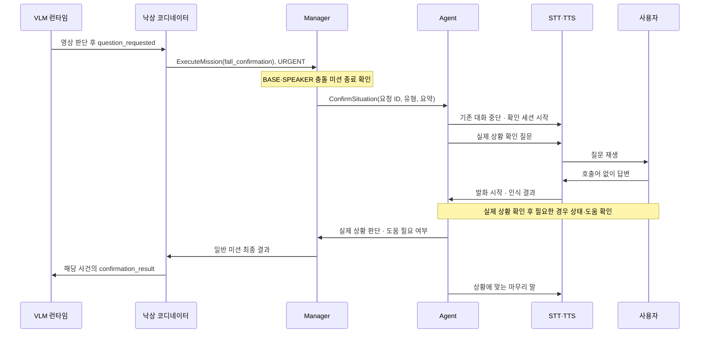

# 낙상 코디네이터–Manager–Agent 이상 상황 확인 구현

[대화 명세](agent_fall_interaction.md)를 구현한 연결과 실행 조건이다.
첫 적용 대상은 낙상이며, Agent의 대화 엔진과 Action은 다른 이상 상황도 받는다.

## 연결



VLM은 후보가 생기자마자 질문하지 않고 영상의 1차 판단을 기다린다.
정상 활동이고 이전 낙상 관측이 없으면 낙상 코디네이터가 질문 없이 종결한다.
코디네이터는 구조화된 영상 판정을 짧은 요약으로 바꾸며, Agent에 영상이나
VLM의 자유 형식 설명을 전달하지 않는다. Agent는 낙상 런타임 토픽을 직접 구독하지 않는다.

## Manager–Agent 계약

Action: `/malbut/agent/confirm_situation`
자료형: `malbut_interfaces/action/ConfirmSituation`

| 방향 | 필드 | 의미 |
| --- | --- | --- |
| 요청 | `request_id` | 중복 확인을 막는 요청 ID |
| 요청 | `situation_type` | 상황 유형, 낙상은 `fall` |
| 요청 | `summary` | Manager가 전달하는 상황 요약 |
| 결과 | `situation_assessment` | `confirmed_incident`, `resolved`, `unknown` |
| 결과 | `help_needed` | 도움 필요 여부 |

결과의 두 필드는 독립적이다. 실제 낙상은 확인했지만 도움을 거절했다면
`confirmed_incident/false`, 발생 여부를 확인하지 못한 채 도움을 요청했다면
`unknown/true`가 가능하다. 단순히 누워 있었다면 추가 질문 없이 `resolved/false`로
끝내되, 같은 답변에 명시적 도움 요청이 있으면 그 요청을 반영한다.
사용자가 앞서 말한 낙상 사실을 명시적으로 철회하면 실제 상황도 `unknown`으로
정정할 수 있다. 도움 질문에 대한 모호한 답변만으로 이미 확인한 사실을 지우지는 않는다.
실제 상황과 도움 확인 단계 사이를 오가더라도 각 단계의 재질문 상한은 초기화하지 않는다.

진행 Feedback은 발행하지 않는다. 판단이 끝나면 먼저 결과를 전달하고 마무리 말을
재생한다. 마무리 재생 오류 때문에 이미 얻은 판단이 유실되지 않게 한다.
Action이 `SUCCEEDED`일 때만 결과를 사용한다. 모델·마이크·TTS 오류나 취소는
`ABORTED`/`CANCELED`로 구분하며 사용자 무응답으로 바꾸지 않는다.

낙상 코디네이터는 사건·질문·대상·근거 버전과 런타임 부팅 ID를 연결해 결과를 검증한다.
오래된 결과는 적용하지 않고, 같은 질문의 재전달에는 이미 얻은 결과를 재전송한다.
Agent는 최근 128개 요청의 내용 해시와 완료 결과를 기억한다. 코디네이터가 재시작해
기존 Action Goal을 잃어도 같은 요청 ID·유형·요약이면 대화를 다시 하지 않고 결과를
돌려준다. 관리자의 기존 확인 미션이 실행 중이면 먼저 종료를 기다려 같은 대화를 선점하지 않는다.
같은 ID로 내용이 바뀌면 거절한다. 이 캐시는 Agent 프로세스 내부에만 있으며
Agent 자체가 재시작한 뒤까지 보존하는 저장소는 아니다.
현재 대화의 최종 판단이 적용된 뒤 늦게 도착한 영상 결과로 사용자 답변을 덮어쓰지 않는다.
Agent는 보호자 알림을 실행하거나 요청하지 않으며 후속 처리는 낙상 코디네이터·VLM 측에 남는다.
기존 웹 업로드·알림 계약에는 `confirmation_completed`, `incident_updated`,
`confirmation_help_required`를 추가했다. 도움 필요 알림은 Agent의 판단으로 표현하며
사용자가 직접 도움을 요청했다고 바꾸지 않는다.

코디네이터는 수락된 미션의 결과를 최대 610초 기다리며, Manager 서버가 연속 5초 사라진
경우에도 처리 실패로 큐를 해제한다. Agent 자체 처리 상한은 600초다. 이 제한은
통신·처리 장애 복구용이며 질문 뒤 사용자 답변을 기다리는 10초와 별개다.

## 음성 처리

- `/malbut/speech/session_control`로 질문별 청취 세션을 연다. STT는 이 세션에서
  호출어와 일반 대화의 수신 대상 분류를 생략한다.
- 질문마다 새 `session_id`와 `playback_id`를 사용해 이전 질문의 늦은 답변을 버린다.
  STT는 종료·교체된 최근 256개 세션 ID를 기억해 지연된 시작 요청이 세션을 되살리지
  못하게 한다. 종료가 시작보다 먼저 도착하면 해당 ID의 종료를 예약한다.
- `/malbut/speech/input_status`의 발화 시작 신호가 오면 질문을 중단하고 청취한다.
- 질문의 재생 완료 후부터 답변 시작까지 10초 기다린다. 시작 신호를 받으면
  무응답 타이머를 해제한다. 인식·통신의 별도 제한 시간 초과는 처리 오류다.
- 무응답 확정 직전에 `session_control(check_only=true)`로 해당 청취 세션의 생존을
  조회한다. STT 재시작 등으로 세션이 사라졌거나 조회에 실패하면 처리 오류로 끝낸다.
  조회는 세션을 생성하거나 변경하지 않으며, 조회 중 도착한 실제 답변을 우선한다.
- 모호한 답변의 재질문은 확인 사항별 최대 2회다. 무응답은 즉시 도움 필요로
  판단하며, 확인하지 못한 실제 상황은 `unknown`으로 남긴다.
- 일반 대화의 대기 작업과 늦게 도착한 응답을 무효화하고 확인 대화를 우선한다.

질문 재생 중 끼어들기는 에코가 제거된 마이크 입력이 필요하다. 원본 STT는
실제로 검증한 입력에서만 `input_has_aec=true`(Bringup: `speech_input_has_aec`)
설정을 사용한다. 기본값은 `false`이며 이 경우 질문 재생 뒤 답변을 받는다.
AEC가 없으면 기존 스피커 잔향 보호 때문에 재생 종료 후 300ms까지 입력이 차단된다.
이 구간의 짧은 답변도 유실될 수 있으므로 즉시 답변·끼어들기 기준의 실기기 검증에는
실제 AEC 입력이 필요하다.
현재 `malbut_test` 배포본은 기존 실기기 시험 설정에 따라 끼어들기를 강제로
비활성화한다. 서비스의 `barge_in_available`은 실제 활성 상태를 반환한다.

## 실행과 검증

`agent_communication`, System Manager, STT와 TTS를 같은 ROS graph에서 실행한다.
로그만 받는 `tts_receiver`에는 재생·세션 서비스가 없으므로 이 대화의 시험용으로
충분하지 않다. 인터페이스가 변경됐으므로 다섯 패키지를 함께 다시 빌드한다.

```bash
source /opt/ros/humble/setup.bash
colcon build --packages-select malbut_interfaces malbut_system_manager \
  malbut_agent_server malbut_stt malbut_tts
source install/setup.bash
```

Agent의 `--provider openai`는 기존 OpenAI 설정과 키를 재사용해 질문과 답변을
문맥으로 판단한다. `--provider mock`은 정해진 예문을 처리하는 오프라인 시험용이다.
`rai-sidecar`는 이 Action의 판단 어댑터를 제공하지 않아 확인 요청을 거절한다.
키 설정과 일반 실행 방법은 [Agent README](../../README.md#실행과-텍스트-전달)를 따른다.

주요 자동 검증은 다음 파일에 있다.

- `test_situation_dialogue.py`, `test_situation_provider.py`: 판단·재질문 제한·모델 계약.
- `test_situation_session.py`: 10초 경계·끼어들기·취소·음성 오류·늦은 이벤트.
- `test_situation_action_ros.py`: 실제 DDS에서 Agent Action 및
  VLM 코어→Manager→Agent→최종 결과 적용. 영상·언어 모델·음성 장치는 시험용 대역이다.
- `test_situation_recovery_ros.py`: Manager 재시작, 결과 전송 유실, 완료 결과 재전송.
- Bringup의 `test_confirmation_audio.py`: 실제 대화 엔진·STT 파이프라인·TTS 런타임을
  결합해 합성 PCM 입력으로 끼어들기, 질문 후 답변, 무응답, ASR 오류, 세션 소실 확인.
- `malbut_fall_coordinator/test/test_fall_confirmation*.py`: 버전·중복·실패·결과 전달·일반 관리자 선점.
- STT·TTS의 기존 테스트: 일반 대화와 확인 대화의 음성 제어 회귀.

한국어 의미 판단 재검증에는 20개 사례를 묶은 평가 도구를 사용한다.
기본 실행은 네트워크를 사용하지 않는 mock이며, 의미 변형·다른 이상 상황 등
mock이 지원하지 않는 사례는 `skipped_live_only`로 표시한다.
mock의 통과는 실제 언어 모델 검증을 뜻하지 않는다.
[평가 도구 안내](../evaluations/SITUATION_DIALOGUE_EVALUATION.md)에 사례 형식과
결과 해석을 정리했다.

```bash
python3 -m malbut_agent_server.situation_eval_runner \
  --output /tmp/situation-mock-evaluation.json
```

OpenAI 설정이 준비된 환경에서 실제 의미 판단을 검사하려면 `--provider openai`를
명시한다. 이 명령은 유료 API를 호출하며 TTS·마이크는 사용하지 않는다.
`--case-id`로 일부 사례만 선택할 수 있다. 결과에는 사례 ID, 통과·실패·오류·보류,
최종 판단 두 필드, 질문 수를 남기며 질문·답변 원문과 키를 출력하지 않는다.

```bash
python3 -m malbut_agent_server.situation_eval_runner --provider openai \
  --env-file /path/to/local.env --output /tmp/situation-openai-evaluation.json
```

실제 API의 한국어 의미 판단, 마이크·스피커·AEC, 카메라와 로봇을 합친 동작은
이번 로컬 검증에 포함하지 않았다. 로컬 통과를 실기기 검증으로 해석하지 않는다.

### 로컬 검증 기록 — 2026-09-25

| 범위 | 결과 |
| --- | --- |
| Agent 전체 | 2,292개 통과, 실패·생략 없음 |
| STT 전체 | 726개 통과, 실패·생략 없음 |
| TTS 전체 | 276개 통과, 실패·생략 없음 |
| 배포·인터페이스·음성 결합 검사 | 63개 통과 |
| 원본·배포본 ROS 빌드 | 인터페이스·Manager·Agent·STT·TTS 5개 패키지 통과 |
| 설치한 배포본의 평가 명령 | mock 13개 통과, 실제 모델 전용 7개 보류 |

Agent 검사에는 실제 DDS Action 8개, Manager 재시작·재전송 복구 10개,
세션 경계 38개, 평가 도구 16개가 포함된다. STT와 TTS는 각각의 요구 SDK 버전으로
분리한 테스트 환경을 사용했다. SDK 호출은 모의 HTTP 전송으로 검사했으며 실제 API,
보호자 알림, 카메라, 마이크, 스피커, 로봇 동작은 실행하지 않았다.
