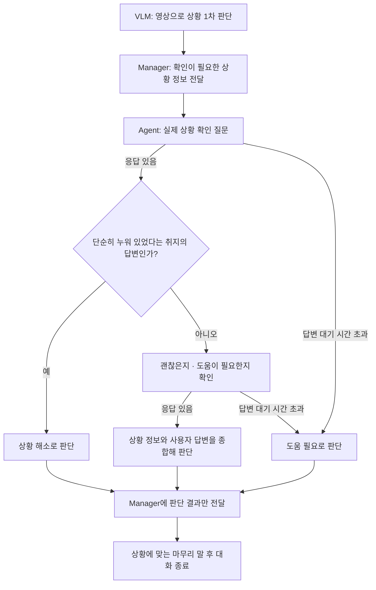

# Agent–Manager 이상 상황 확인 대화 명세

## 1. 목적과 범위

- 여러 이상 상황에서 실제로 어떤 일이 발생했는지 확인하고, 사용자가 괜찮은지와 도움이 필요한지를 확인하는 공통 기능으로 만든다.
- 실제 상황을 먼저 확인하고, 이상 상황이 해소되지 않은 경우 사용자의 상태와 도움 필요 여부를 확인한다.
- 첫 적용 대상은 낙상이다. 실제로 넘어진 것인지 단순히 누워 있는 것인지 먼저 확인한다. 단순히 누워 있었던 것으로 확인되면 종료하고, 그 외에는 괜찮은지와 도움이 필요한지를 확인한다.
- 이후 다른 이상 상황에도 적용할 수 있도록 범용성을 갖춘다.

## 2. 모듈별 역할

- VLM은 영상에서 낙상 의심 상황과 정상적인 눕기·휴식을 1차로 구분한다.
- Manager는 VLM의 판단 결과를 바탕으로 확인이 필요한 상황 정보를 Agent에 전달한다.
- Agent는 전달받은 상황 정보를 바탕으로 질문을 구성하고 대화를 진행한다.
- Agent는 상황 정보와 사용자 답변을 종합해 실제 상황과 도움 필요 여부까지 판단한다.

## 3. 전체 동작 흐름

1. VLM이 영상으로 상황을 먼저 판단하고, Manager가 확인이 필요한 상황 정보를 Agent에 전달한다.
2. Agent가 상황 정보를 바탕으로 질문을 구성해 실제 상황을 확인한다.
3. 낙상 확인 중 사용자가 단순히 누워 있었다는 취지로 답하면, 상황이 해소된 것으로 판단하고 추가 상태·도움 확인 질문 없이 대화를 종료한다.
4. 이상 상황이 해소되지 않은 경우, 사용자가 괜찮은지와 도움이 필요한지를 확인한다.
5. 확인 질문 후 답변 대기 시간이 지나도 사용자가 답변하지 않거나, 모호한 부분을 최대 2회 다시 질문한 뒤에도 확인되지 않으면, Agent는 도움이 필요하다고 판단한다.
6. Agent가 상황 정보와 사용자 답변을 종합해 판단하고 Manager에 판단 결과를 전달한다. 도움이 필요하다고 판단한 경우에도 판단 결과만 전달하며, 보호자 알림 같은 후속 행동을 함께 요청하지 않는다.

위 흐름도는 공통 기능의 첫 적용 대상인 낙상 상황을 기준으로 한다. 답변이 모호한 경우에는 6항의 재질문 처리를 적용한다.

## 4. 입력과 출력

### 4.1. Manager → Agent 요청

- Manager는 이상 상황에 대한 요약 정보를 Agent에 전달한다.
- Agent는 사진이나 영상을 직접 전달받지 않고 요약 정보를 바탕으로 대화를 진행한다.

### 4.2. Agent → Manager 진행 상태

- 질문 중·답변 대기 중·판단 중 같은 대화 진행 상태는 Manager에 전달하지 않는다.
- Manager에는 최종 결과만 전달한다.

### 4.3. Agent → Manager 결과

- 최종 결과에는 실제 상황 판단과 도움 필요 여부만 포함한다.
- 판단 근거와 사용자 답변 원문은 포함하지 않는다.

## 5. 질문·답변 처리

### 5.1. 질문 재생

- Agent가 전달받은 상황 정보를 바탕으로 질문을 구성하고 재생한다.
- 질문을 재생하는 도중 사용자가 답하기 시작하면 질문 재생을 멈추고 바로 답변을 듣는다.

### 5.2. 답변 청취

- Agent가 먼저 질문한 뒤에는 사용자가 호출어 없이 바로 답변할 수 있도록 한다.

### 5.3. 답변 해석과 결과 회신

- Agent가 상황 요약 정보와 사용자 답변을 종합해 실제 상황과 도움 필요 여부를 판단한다.
- 판단이 끝나면 Manager에 실제 상황 판단과 도움 필요 여부만 최종 결과로 전달한다.

### 5.4. 종료

- 확인이 끝나면 상황에 맞는 마무리 말을 한 뒤 대화를 종료한다.

## 6. 예외 처리

- 사용자 답변이 모호하면 이해되지 않은 부분을 최대 2회 다시 질문한다. 두 번의 재질문 뒤에도 확인되지 않으면, 도움이 필요하다고 판단하고 Manager에 최종 결과를 전달한다.
- Manager가 전달한 상황 정보와 사용자 답변이 충돌하면 사용자 답변을 우선해 판단한다.
- 확인 질문 후 답변 대기 시간이 지나도 사용자가 답변하지 않으면, Agent는 도움이 필요하다고 판단하고 Manager에 최종 결과를 전달한다.
- 무응답이나 모호한 답변만으로 실제 낙상이 발생했다고 확정하지 않는다. 실제 상황 판단은 확보된 상황 정보와 기존 사용자 답변을 바탕으로 유지하며, 확인하지 못한 부분은 판단 불가로 남긴다.
- 무응답으로 판단할 답변 대기 시간은 운영 정책에서 정한다.

## 7. 운영 정책

- 질문 재생이 끝난 뒤 사용자가 답변을 시작할 때까지 최대 10초 기다린다. 10초 안에 답변을 시작하면 답변 청취를 이어가고, 답변을 시작하지 않으면 6항의 무응답 처리를 적용한다.
- 같은 확인 사항에 대한 재질문은 최초 질문을 제외하고 최대 2회로 제한한다. 최초 질문을 포함하면 최대 3번 답변 기회를 제공하며, 재질문에도 같은 답변 대기 시간을 적용한다. 도중에 무응답이면 남은 재질문 횟수와 관계없이 무응답 처리를 적용한다.
- 일반 대화 중 Manager의 이상 상황 확인 요청이 들어오면, 기존 대화를 멈추고 이상 상황 확인을 우선 진행한다.

## 8. 검증 기준

### 8.1. 판단 결과

- 사용자가 단순히 누워 있었다는 취지로 답하면 상황 해소로 판단하고, 추가 상태·도움 확인 질문 없이 종료하는지 확인한다.
- 사용자가 도움을 요청하면 도움이 필요하다고 판단하는지 확인한다.
- 질문 재생 종료 후 10초 동안 사용자가 답변을 시작하지 않으면 도움이 필요하다고 판단하는지 확인한다.
- 모호한 답변에는 이해되지 않은 부분만 최대 2회 다시 묻고, 그 뒤에도 확인되지 않으면 도움이 필요하다고 판단하는지 확인한다.
- 무응답이나 모호한 답변만으로 실제 낙상을 확정하지 않고, 이미 확인한 사실은 유지하며 확인하지 못한 부분은 판단 불가로 남기는지 확인한다.
- 상황 정보와 사용자 답변이 충돌할 때 사용자 답변을 우선하는지 확인한다.

### 8.2. 대화 동작

- Agent의 질문 후 사용자가 호출어 없이 바로 답변할 수 있는지 확인한다.
- 질문 재생 중 사용자가 답하기 시작하면 재생을 멈추고 바로 답변을 듣는지 확인한다.
- 답변 대기 시간인 10초 안에 사용자가 답변을 시작하면, 10초가 지나더라도 답변 청취를 이어가는지 확인한다.
- 일반 대화 중 이상 상황 확인 요청이 들어오면 기존 대화를 멈추고 이상 상황 확인을 우선하는지 확인한다.
- Manager에 대화 진행 상태나 후속 행동 요청을 보내지 않고, 실제 상황 판단과 도움 필요 여부만 최종 결과로 전달하는지 확인한다.
- 확인이 끝나면 상황에 맞는 마무리 말을 한 뒤 대화를 종료하는지 확인한다.
