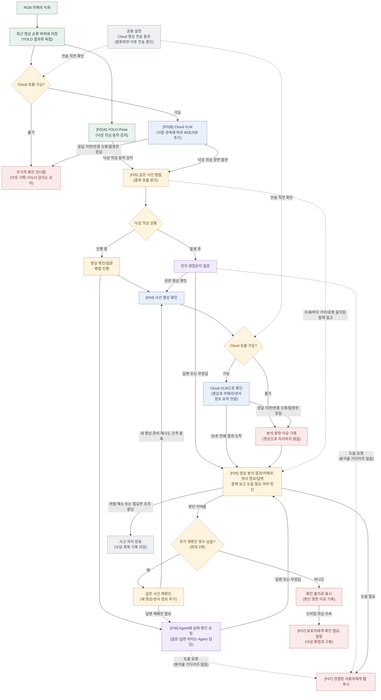
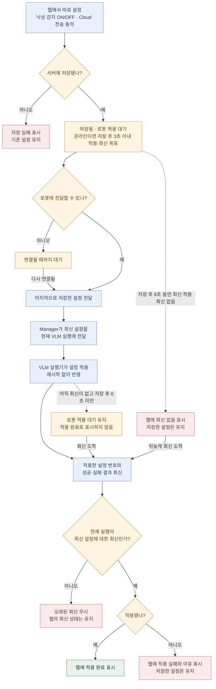
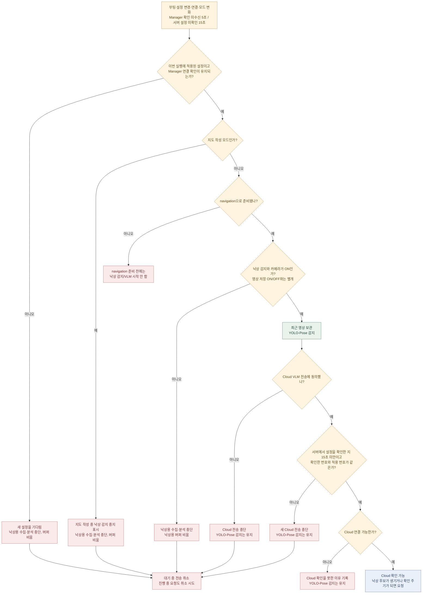

# 낙상 감지 명세

작성일: 2026-09-18 / 웹 설정·적용 기준 갱신: 2026-09-20

이 문서는 이번에 합의한 **Cloud VLM 전용 흐름**을 기준으로 한다.
기존 `FALL_DETECTION_FUNCTION_SPEC.md`의 Local VLM 상시 확인·대체 실행은 이번 범위에서 제외한다.
아래 기능 전체가 구현됐다는 뜻은 아니다. 현재 구현 범위는 5절에서 구분한다.

[지금까지 한 일과 다음 작업](fall_progress.md)에 평가·구현·실물 검증을 구분해 정리했다.

낙상 감지/VLM의 로봇 자동 실행은 `navigation` 모드만 대상으로 한다.
`sensors` 모드 제거와 기본 모드 변경은 Bringup 담당자가 진행한다.
이 문서의 VLM 연결 작업에서 공통 Bringup 모드 목록을 변경하지 않는다.

## 1. 기능

- RGB 영상을 YOLO 결과와 관계없이 최근 영상 버퍼에 보관한다.
- 로봇의 YOLO-Pose가 낙상 의심 동작을 찾는다. Cloud VLM도 별도 주기로 최근 영상을 확인한다.
  사람이 보이면 60초, 마지막 검출 뒤 2분간은 60초를 유지하고 그 뒤에도 안 보이면 5분 주기다.
  낙상 후보는 이 주기와 관계없이 사건 확인을 요청한다.
- 두 경로 중 하나가 의심하면 같은 사건을 묶고, 영상 확인과 음성 질문을 진행한다.
- 넘어지는 장면을 본 경우와 이미 바닥에 있는 사람을 본 경우를 구분한다.
  따라가기·순찰 모드로 구분하지 않는다. 이미 바닥에 있어도 관련 녹화가 있으면 확인한다.
- 영상 분석 결과, 실제 카메라·센서 관측, 질문에 대한 답변을 함께 보고 도움이 필요한지 판단한다.
- Local VLM은 사용하지 않는다. Cloud가 실패하면 Local로 전환하지 않는다.
- 고령자만이 아니라 관측 가능한 모든 사람이 대상이다.

## 2. 입력

### 카메라·센서

- RGB 카메라의 실제 촬영 시각과 영상 프레임을 받는다.
- 실제 RGB 해상도는 **640×400**이다. 가로세로 비율을 유지한다.
  최근 5초에서 최대 12장을 고른다(2026-09-20 사용자 결정). 시간순 JPEG 묶음과
  각 상대 시각을 한 요청에 보낸다. 약 5초 합성 영상의 평가는 마쳤지만,
  실제 카메라에서 감지·질문·알림까지 확인한 것은 아니다.
- 버퍼 내부 형식은 현재 `RgbFrame(captured_at: float, jpeg: bytes)`다.
  `captured_at`은 같은 장치 부팅 안에서의 단조 시각(초)이며, ROS 시각 변환은 연결부에서 맡는다.
- 장치는 Aurora930 RGB-D를 전제로 한다. VLM에는 RGB를 보내며 원본 depth는 보내지 않는다.
- 유효한 경우 신체와 바닥 사이 거리(m), 로봇 선속도(m/s)·각속도(rad/s)를 추가한다.
  측정하지 못한 값은 `None`으로 남긴다. 자세 요약 형식과 센서 유효성 판정은 추가 명세 대상이다.

### 낙상 의심 장면

- `candidate_id: string` — 의심 장면 메시지 식별자.
- `subject_key: string` — 관측을 이어 붙이기 위한 대상 연결 키. 사람임을 증명하는 값은 아니다.
- `source: yolo_pose / cloud_crosscheck` — 의심 장면을 찾은 경로.
- `kind: motion_seen / already_down / unknown` — 넘어지는 듯한 동작을 봄 / 이후만 봄 / 구분 불가.
  `unknown`은 Cloud 발견에서 과정을 구분할 수 없을 때 쓰며 기존 YOLO 후보는 앞의 두 값을 쓴다.
- `observed_at: float` — 관측 시각(같은 부팅의 단조 시각, 초).
- `significant_change: bool` — 앞선 확인 뒤 다시 살펴볼 변화가 있었는지 표시.
  이를 결정하는 자세 변화 기준은 별도 감지 모듈의 책임이다.

여러 사람을 하나로 합치지 않는다. Cloud 위치를 같은 촬영 시각의 Pose 박스와 비교하고,
추적이 이어졌는지 확인해 연결한다. 불명확하면 대상 미확인으로 남긴다.
Cloud가 만든 인물 이름이나 순번을 동일 인물 ID로 믿지 않는다.
[연결 규격과 아직 검증하지 않은 부분](fall_subject_observation.md).

### 사람 관측 여부

- `PersonObservation(observed_at, visibility)`를 낙상 후보와 별도로 받는다.
- `visibility: seen / not_seen / unknown` — 사람 검출 / 정상 실행했으나 미검출 / 관측 불가.
- `not_seen`은 빈 방이라는 확정이 아니다. 주기를 줄여도 Cloud 확인을 완전히 끄지 않는다.
- 감지기 오류·입력 누락·오래된 관측은 `unknown`으로 취급하고 60초 주기를 유지한다.
- 미래 시각은 거부한다. 오래되거나 역순·중복인 관측으로 현재 주기를 바꾸지 않는다.
- 관측 유효 시간은 감지기의 실제 발행 주기를 확인한 뒤 정할 필수 설정이다.
  매 프레임 같은 사람을 봐도 다음 확인 시각을 뒤로 미루지 않는다.

### 공통 설정

Capability Manifest와 필드·타입·의미 표는
[Manager–VLM 호출 명세 초안](fall_manager_contract.md)을 참고한다.
VLM 설정 Service·상태 발행·연결 확인과 웹·Manager 설정 전달을 구현했다.
현재 실행 상태의 웹 전달은 남아 있다.

- 낙상 감지 사용 여부, 카메라 사용 여부, Cloud 영상 전송 동의, 연결 상태를 받는다.
- 시작 시 모두 꺼진 상태다. 외부 설정을 확인하기 전에 영상을 전송하지 않는다.
- Cloud 전송 동의는 한 곳에서 관리한다. 주기적 확인과 사건 확인이 전송 직전에 같은 값을 확인한다.

#### 웹에서 설정하고 저장 후 적용

웹에서 아래 두 항목을 따로 설정한다. 저장하면 재부팅이나 Bringup 재실행 없이
실행 중인 로봇에 적용한다. 웹 설정 화면·저장 API·Manager 전달과 회신 이력은 구현했다.
실물 적용 시간과 현재 실행 상태의 웹 표시는 아직 검증·구현이 필요하다.

- **낙상 감지 ON/OFF:** 낙상 감지 기능 사용 여부.
- **Cloud 영상 전송 동의:** 낙상 확인을 위해 RGB 이미지와 카메라·센서 정보 요약을
  Cloud VLM으로 보내는 데 대한 동의. 주기적 확인과 사건 확인에 같은 동의를 사용한다.
- 두 설정은 해당 로봇의 소유자만 변경할 수 있다. 웹에서 버튼을 숨기는 것뿐 아니라
  저장 API에서도 소유자 여부를 확인한다. 공유받은 사용자의 변경 요청은 거부한다.
- 영상 저장 동의나 API 키 보유 여부를 Cloud VLM 전송 동의로 대신하지 않는다.
  기존 사용자의 동의를 임의로 ON으로 만들지 않는다.
- Cloud 전송 동의가 OFF이면, 낙상 감지가 ON이어도 Cloud에는 보내지 않는다.
  다른 감지 허용 조건을 만족하는 동안 YOLO-Pose 경로는 유지한다.
- **영상 저장과 낙상 감지는 분리한다.** 영상 저장 OFF는 KVS 녹화를 끄는 설정이며,
  낙상 감지나 Cloud VLM 전송까지 끄는 설정으로 사용하지 않는다.
- 카메라·낙상 감지가 ON이고 실행 조건이 맞으면, 저장 OFF에서도 최근 RGB를 메모리에
  잠깐 보관한다. Cloud 전송 동의가 ON이면 분석에 보내고, OFF이면 YOLO-Pose로
  의심 동작만 찾는다. 이 버퍼는 KVS 녹화나 원본 영상의 영구 보관을 대신하지 않는다.

##### 설정 저장부터 로봇 적용까지

아래 흐름은 구현할 동작이다. 웹 → 로봇 전달 방식과 API 필드는 아직 정하지 않았다.
‘적용 완료’는 설정이 반영됐다는 뜻이지 Cloud 분석이 성공했다는 뜻은 아니다.
온라인인 로봇을 기준으로 **서버 저장 성공 후 3초 이내 적용·회신 확인**을 목표로 한다.
저장 성공부터 **6초 동안 최신 설정의 적용 회신이 없으면 ‘회신 없음’**을 표시한다.
3초는 적용 목표이고, 6초는 웹의 상태 표시 기준이다. 실물에서 검증한 시간은 아니다.
3초가 지나도 적용을 중단하지 않으며, 6초가 지났다는 이유만으로 저장을 취소하거나
로봇에서 적용이 실패했다고 단정하지 않는다. 뒤늦은 회신도 현재 실행·최신 설정에
대한 결과인지 확인한 뒤 반영한다.

##### 적용된 설정에 따른 동작

설정 변경·연결·모드 변화, Manager 확인 메시지 미수신 5초,
서버 설정 미확인 15초가 되면 아래 조건을 다시 확인한다.
오래된 설정 메시지는 무시하며, 이미 적용한 유효한 설정을 그것만으로 끄지는 않는다.
Cloud 전송 직전에도 같은 조건을 확인한다.
지도 작성 중에는 낙상 감지를 중단한다. 지도 작성에 필요한 카메라·센서는 계속 사용하며,
웹에 저장한 감지 ON/OFF·동의 값은 바꾸지 않는다. 웹에는 ‘지도 작성 중 · 낙상 감지 중지’를
표시한다. 지도 작성이 끝났다는 이유만으로 시작하지 않고, 정상 운용 모드로 전환한 뒤
최신 설정과 실행 조건을 다시 확인한다. Bringup에서 VLM을 `navigation`에만 시작하는
제한과 Manager 설정 전달은 구현했다. 웹의 모드별 실행 상태 표시는 아직 구현하지 않았다.

- VLM은 `/homecam/monitoring_enabled` 대신 별도의 `camera_enabled`를 받도록 바꿨다.
  상위 카메라·YOLO 발행 조건과 Manager 전달은 아직 별도 확인이 필요하다.
  VLM 수신부 변경만으로 저장 OFF에서 전체 감지가 동작한다고 볼 수 없다.
- Manager 확인 메시지가 5초 동안 오지 않은 경우와, Cloud 분석 연결만 끊긴 경우를 구분한다.
  전자는 낙상용 수집도 중단하고, 후자는 다른 허용 조건이 유효하면 YOLO-Pose 감지를 유지한다.
- 감지 중단·동의 철회로 기존 사건 기록을 지우거나 정상으로 바꾸지 않는다.
  이미 Cloud로 전송한 영상까지 회수할 수 있다는 뜻은 아니다.

- 저장 직후 설정 전달을 시작한다. 60초/5분의 영상 확인 주기를 기다리지 않는다.
  설정 적용과 영상 분석 완료는 별개이며, 저장할 때마다 Cloud를 호출하지 않는다.
- 웹 서버에 저장됐다는 이유만으로 로봇에도 적용됐다고 표시하지 않는다.
  로봇이 현재 실행에서 최신 설정 번호를 적용했다고 회신해야 **적용 완료**로 표시한다.
- 로봇이 꺼져 있거나 연결이 끊기면 **저장됨 · 로봇 적용 대기**로 표시한다.
  저장 후 6초 동안 회신이 없으면 **회신 없음**을 함께 표시하며, 오프라인 여부도 남긴다.
  다시 연결되면 중간 변경을 차례로 실행하지 않고 마지막으로 저장한 설정을 적용한다.
- 저장 실패 시 기존 설정을 유지하고 실패를 표시한다. 저장 성공 후 적용만 실패한 경우는
  저장된 값을 취소하지 않고 **적용 실패**와 이유를 표시한다.
- 로봇이 감지 OFF 또는 카메라 OFF를 적용하면 낙상용 영상 수집·새 분석을 중단하고
  낙상용 버퍼를 비운다. 기존 사건 기록은 지우거나 정상으로 바꾸지 않는다.
- Cloud 동의 철회를 적용하면 새 Cloud 전송을 막고 대기 중인 전송을 취소한다.
  진행 중 요청도 가능한 범위에서 취소하되, 이미 전송한 영상의 회수까지 보장하지 않는다.
- 오래된 설정·이전 실행의 적용 회신이 최신 상태를 덮어쓰지 않게 한다.
  설정 전달이 끊겼는데 Manager가 예전 허용값만 반복해서 보내 계속 켜 두지 않도록 한다.

##### Manager와 VLM의 연결 확인

2026-09-23에 양방향 확인 주기를 **1초**, 새 메시지가 없을 때 끊김으로 판단하는 시간을
**5초**로 정했다. VLM의 수신·상태 발행·중단은 구현했고 Manager 발행·수신은 남아 있다.

| 확인 방향 | 5초 동안 새 메시지가 없을 때 |
|---|---|
| VLM → Manager 실행 상태 | 웹에 ‘낙상 감지 상태 확인 불가’ 표시. 저장된 ON/OFF·동의 값은 유지 |
| Manager → VLM 연결 확인 | 낙상 분석용 영상 수집·새 Cloud 전송 중단, 전송 대기 요청 취소 |

- 상태·연결 확인만 1초마다 한다. 같은 설정을 매초 다시 적용하거나 Cloud를 시험 호출하지 않는다.
- 수신한 쪽의 단조 시계로 경과 시간을 잰다. 이전 실행·역순·중복 메시지는 시간을 갱신하지 않는다.
- 낙상용 일시 버퍼는 비우고 진행 중 요청은 취소를 시도한다. 이미 전송한 영상은 회수할 수 없다.
- 연결 복구 후 최신 서버 설정과 현재 실행의 적용 결과·양방향 확인을 확인한 뒤 재개한다.
- Manager가 살아 있어도 서버의 최신 설정을 확인할 수 없는 상태는 별도로 다룬다.
  마지막 정상 설정 응답을 받은 지 **15초가 되면 새 Cloud 전송을 중단**한다(사용자 확정).
  같은 확인 시각을 반복 전송해 시간을 늘리지 않는다.
- 서버 설정만 확인하지 못하는 동안에는 내부 연결·카메라·감지 허용이 유지되면 YOLO-Pose와 최근 영상 버퍼를 유지한다.
  Cloud 대기 요청은 취소하며 진행 중 요청도 취소를 시도한다. 저장된 동의 값을 바꾸거나 이전 영상을 전송 대기열에 쌓지 않는다.
- 서버 연결이 돌아오면 최신 설정을 다시 확인한다. 적용 번호와 일치하고 Cloud 전송 동의가 켜져 있어야 전송을 재개한다.
- 웹 설정 적용의 3초·6초, 영상 분석 응답의 20초와는 별개다.
  구체적인 연결 규칙은 [Manager–VLM 호출 명세](fall_manager_contract.md)를 따른다.

**추가로 정할 부분**

- Manager → VLM 확인 메시지의 제안 형식은 호출 명세 3.5절에 작성했다. ROS 접근 권한은 담당자와 맞춘다.
- 기존 홈캠 heartbeat 응답에 `fallSettings`를 추가하고 확인 시각을 전달하는 안은 호출 명세 3.6절에 작성했다.
  홈캠 → Manager는 `FallSettingsSnapshot`, 적용 결과는 `FallSettingsReport`로 홈캠에 돌려주고
  기존 heartbeat 요청으로 서버에 보내는 형식은 3.7~3.8절대로 구현했다.
- 소유자 설정·설정 번호·회신 이력의 서버 저장과 웹 표시를 구현했다.
  현재 실행 확인·ROS 발행 권한·실행 상태의 웹 전달을 연결해야 한다.
- 저장 설정과 별개로 카메라·낙상 감지 허용을 전달하는 메시지 형식과 기존 감지기 연결.
- `navigation`에서 Manager가 최신 설정을 전달하고 적용 결과를 회신하는 연결.
  VLM 노드의 자동 시작과 실제 감지 허용은 별개다. `sensors` 지원은 추가하지 않는다.

| 설정 | 값 | 상태 |
|---|---:|---|
| 웹 설정 저장 후 적용·회신 목표 | 3초 이내 | 사용자 확정, 온라인 로봇 기준·실측 전 |
| 최신 적용 회신이 없을 때 웹에 표시 | 저장 후 6초 | 사용자 확정, ‘회신 없음’ 표시 |
| Manager–VLM 양방향 확인 주기 | 1초 | 사용자 확정, Cloud 시험 호출 없음 |
| Manager–VLM 연결 끊김 판단 | 5초 동안 새 메시지 없음 | 사용자 확정, 실물 검증 전·웹의 6초와 별개 |
| 서버 설정 미확인 시 Cloud 전송 중단 | 마지막 정상 확인 후 15초 | 사용자 확정, 서버 응답 확장 구현·실물 검증 전 |
| 사람이 보일 때 Cloud 확인 간격 | 60초 | 사용자 확정 |
| 마지막 사람 검출 뒤 빠른 주기 유지 | 2분 | 사용자 확정, 실측 전 |
| 유지 시간이 지나도 사람이 안 보일 때 | 5분 | 사용자 확정, 실측 전 |
| Cloud 응답 대기 | 호출당 20초 | 사용자 확정 |
| 같은 사건의 추가 재확인 | 최대 2회 | 사용자 확정 |
| 영상 구간·샘플 수 | 최근 5초·최대 12장 | 사용자 확정, 실물 검증 전 |
| 버퍼 보관량 | 미정 | 필수 설정으로 남김 |
| 사람 관측의 유효 시간 | 미정 | 필수 설정으로 남김 |
| 재확인 사이 간격 | 미정 | 필수 설정으로 남김 |
| 질문 후 답변 대기·질문 횟수 | 미정 | Agent 담당부와 정함. VLM 코어가 시간을 세지 않음 |
| 분당 Cloud 호출 상한·버퍼 용량 | 미정 | 필수 설정으로 남김 |

60초/5분은 **확인 주기**다. 한 번에 그 구간 전부를 보낸다는 뜻은 아니다.
입력 구간이 주기보다 짧으면 그 사이 동작이 확인에서 빠질 수 있다.
사람이 다시 보이면 최근 주기적 확인 시각을 기준으로 60초 주기로 돌아온다.
이미 60초가 지났다면 다음 실행 때 확인한다. 미해결 사건이 있는 동안에도 60초 주기를 유지한다.
20초는 Cloud 응답 대기 시간이며 전체 감지·음성·알림의 제한 시간이 아니다.

### 대상자 답변

- **질문 작성·TTS 재생·답변 대기·STT 해석·발화자 확인은 Agent 담당**이다.
  낙상 모듈은 상태 확인 요청을 만들고 해석된 결과만 받는다.
- 요청에는 `incident_id`, `question_id`, `subject_key`, `evidence_revision`을 넣는다.
- 답변은 `AgentCheckReply`로 같은 네 식별 값과 `answer`, `question_played: bool`을 받는다.
  `answer`는 `help_request / okay / unclear / no_response / failed`다.
- `no_response`는 Agent가 실제 질문 재생과 답변 대기를 확인한 경우만 보낼 수 있다.
  `question_played=false`와 함께 보내면 거부한다. Agent 자체 지연·통신 오류는 `failed`이지 무응답이 아니다.
- 다른 대상자·다른 질문·이전 사건 버전의 답변은 반영하지 않는다.
  중요한 새 변화가 생기면 질문 ID도 새로 발급한다.
- STT의 `/malbut/speech/transcript`는 현재 `utterance_id`, `text`를 전달한다.
  이를 사건·질문·대상자와 연결하고 해석하는 작업은 Agent 연결부에서 해야 한다.
- TTS의 `/malbut/speech/response`는 현재 말할 `text`를 받는다.
  발행 성공을 실제 재생 완료로 보지 않는다. 재생 상태를 받는 계약이 추가로 필요하다.
- 이 문서의 Python 자료형이 최종 ROS `.msg/.srv/.action`으로 확정된 것은 아니다.
- Manager가 Agent를 호출하는 구체적인 경로와 ROS 계약은 담당자와 추가 합의한다.
  현재 Manager의 주행 명령 인터페이스에 임의의 음성 명령을 추가하지 않았다.

## 3. 출력

### Cloud 분석 요청·결과

- 요청: `request_id`, `purpose: incident / crosscheck`, `device_id`, `boot_id`,
  선택 `incident_id`·`subject_key`, `evidence_revision`, 실제 RGB 구간과 선택 센서 요약.
- 결과: `assessment`, `explanation`.
  `assessment`는 `observed_fall / suspected_fall / normal_activity / unobservable`이다.
- 주기적 확인은 의심 대상의 `findings`도 받는다. 각 항목의 판정·상황 유형과
  프레임별 박스로 YOLO-Pose 관측과 연결하며, 연결하지 못한 발견도 별도로 기록한다.
  자세한 형식은 [실행 명세](fall_runtime.md)의 대상 연결 항목을 따른다.
- 결과는 모델의 영상 해석이다. 실제 사고 확정·도움 필요 여부·로봇 이동 명령과 구분한다.
- 호출 실패는 정상 결과로 대체하지 않고 오류 사유를 별도로 기록한다.
- 모델의 JSON을 이 계약으로 바꾸는 Ollama Cloud 어댑터·실행 연결을 추가했다.
  2026-09-19 같은 입력/응답 코드로 Mac Ollama 인증 경유 Cloud 84건 평가를 완료했다.
  [12장 결과](../../../homecam_agent/docs/FALL84_RUNTIME_CLOUD_12FRAMES_20260919.md)는
  약 5초 합성 영상의 단독 분류 결과이며 실물·직접 API 인증·Agent/알림 연동 검증이 아니다.
  이후 추가한 대상 위치 출력(`findings`)은 아직 실제 Cloud 호출로 평가하지 않았다.
  앞서 보류한 복잡한 근거 출력·강제 판정 조건은 사용하지 않는다.

### 사건 상태

| 상태 | 의미 |
|---|---|
| `VERIFYING` | 영상이나 답변을 확인 중 |
| `RECHECK_REQUIRED` | 판단하기 어렵거나 확인을 진행하지 못해 재확인 필요 |
| `HELP_REQUIRED` | 도움 요청 또는 별도 판단 규칙으로 도움 필요 확인 |
| `RESOLVED` | 정상·위험 해소·대응 완료를 확인하고 종결 |

현재 실행 코어는 명확한 도움 요청을 즉시 `HELP_REQUIRED`로 바꾼다.
영상 해석, 사건 처리 상태, 알림 등급은 서로 다른 값이다.
‘괜찮다’는 답변이나 알림 전송 성공만으로 사건을 정상·완료로 바꾸지 않는다.

### 낙상 기록과 알림 등급

| 상황 | 기록 | 알림 |
|---|---|---|
| 넘어지는 장면 + 괜찮다는 답변 | 낙상 관측과 답변 모두 유지 | 일반(`info`) |
| Agent가 질문 후 무응답 확인 | 무응답 기록. 영상이 정상처럼 보여도 지우지 않음 | 확인 필요(`check`) |
| 명확한 도움 요청 | 도움 요청 기록 | 긴급(`urgent`), Cloud 결과를 기다리지 않음 |
| 재확인 소진 후에도 쓰러짐 의심 지속 | 확인하지 못한 이유 기록 | 확인 필요(`check`), 낙상 확정과 구분 |
| Agent 실패·답변 아직 없음 | 처리 실패/대기 상태 | 무응답으로 바꿔 자동 알림하지 않음 |

같은 사건의 같은 등급 알림은 중복 요청하지 않는다. 일반 → 확인 필요 → 긴급으로
올라가면 새 알림을 요청하지만, 뒤늦은 정상 결과로 이미 올라간 등급을 낮추지 않는다.
그 외 영상·센서·답변 조합, 종결·알림 해제 조건은 계속 합의가 필요하다.

2026-09-19 [결과 충돌·재확인·종결 판정표](fall_decision_policy.md)에 기존 합의와
새 제안을 구분했다. 정상 자동 종결은 **YOLO만 의심 → Cloud 정상 → 새 영상도 정상 +
같은 대상의 유효한 답변·새 관측**을 모두 확인하도록 승인·구현했다.
대상별 관측 생성·영상 박스 연결은 구현했고, 실제 Agent 연결은 남아 있다.
최초 정상 결과만으로 끝내지 않는다. [관측 기준과 제한](fall_subject_observation.md).

### 질문·알림 요청

- `question_requested`: 사건 ID와 질문 ID를 갖는 음성 질문 요청.
- `notification_requested`: 일반 / 확인 필요 / 긴급 웹 푸시 요청.
  `event_id`, `incident_id`, `subject_key`, `evidence_revision`, `notification_level`, `reason`을 포함한다.
- `analysis_unavailable`, `crosscheck_skipped`: 분석 실패·주기적 확인 생략과 사유.
- `decision_required`: 영상·답변을 함께 판단할 차례라는 내부 전달.

요청 생성과 실제 전달은 다르다. `notification_requested`가 생겨도 보호자에게 전송됐다고
표시하지 않는다. 수신자·채널·발송 결과·중복 전송 방지는 알림 연결부에서 별도로 다룬다.

### 웹 푸시

- 채널은 우선 **웹 푸시**로 한다. 카카오톡은 이번에 연결하지 않는다.
- 기존 `listActivePushTargets(deviceId)`로 해당 장치에 연결된 유효 사용자와 활성 구독을 찾는다.
  현재 웹 화면을 열고 있는 사용자만 대상으로 삼지 않는다. 브라우저 알림 권한·구독은 필요하다.
- 웹 서버의 `dispatchFallPush`가 기존 서명 검증 Push Broker를 재사용한다.
  기존 홈캠의 녹화 이벤트 API는 사용하지 않는다. 저장 세션·영상 저장 ON/OFF를 요구하지 않는다.
- 전송 계약은 `deviceId`, `notificationId`, `incidentId`, `level`, `reason`, `occurredAt`이다.
  연결부가 `event_id → notificationId`, `notification_level → level`을 매핑한다.
  장치 부팅 내 단조 시각을 UTC로 변환하는 작업은 연결부가 담당한다.
- `reason`은 위 판정표의 네 알림 사유만 허용한다. 등급과 사유가 맞지 않으면 거부한다.
  고정 문구만 전송하며 원본 영상·대화·VLM의 자유 형식 설명을 푸시에 넣지 않는다.
- 알림을 누르면 해당 장치의 홈캠 화면(`view=live`)으로 이동한다.
  낙상 사건 전용 상세 화면은 아직 없다.
- 같은 사건·등급의 재전송에는 같은 브라우저 알림 태그를 사용하고, 등급이 올라가면 다른 태그를 쓴다.
  이는 서버의 영속 중복 방지나 실제 사용자 확인을 대신하지 않는다.
- 기존 전송 함수의 `delivered`는 **푸시 서비스가 수락한 구독 수**다. 사용자가 봤다는 뜻이 아니다.
  구독 없음·설정 없음·실패를 실제 전달 성공으로 처리하지 않는다.
- 로봇의 SQLite 저널·전송 워커, 인증 수신 API, 사건 DB와 알림 대기열을 연결했다.
  실제 장치·Cloud·Agent 호출과 운영 배포는 아직 하지 않았다.
  저장 계약·오류 처리·실행 방법은 [낙상 기록·웹 푸시 연결](fall_storage_api.md)을 따른다.

## 4. 동작 규칙

### 영상 보관

- YOLO 후보가 없어도 RGB를 메모리 버퍼에 받는다.
- 보관 시간·바이트·프레임 수 상한을 넘으면 오래된 프레임부터 제거한다.
- 없는 과거 프레임을 만들어 채우지 않는다. 요청 구간보다 보관 구간이 짧으면 표시한다.
- 카메라 또는 해당 감지 기능을 끄면 이 기능의 버퍼를 비운다. 다른 카메라 소비자를 끄지 않는다.
- 현재 버퍼는 디스크 녹화나 사건 증거의 영구 보관을 담당하지 않는다.

### Cloud 확인

- 정상적으로 사람 미검출 관측이 들어올 때만 2분 유지 후 5분 주기로 낮춘다.
  감지기 상태가 불명확하거나 미해결 사건이 있으면 60초 주기를 유지한다.
- 같은 동의·연결·호출 상한 검사를 주기적 확인과 사건 확인에 적용한다.
- 대기 중인 사건의 첫 확인, 사건 재확인, 주기적 확인 순으로 처리한다.
- 한 번에 Cloud 요청 하나만 실행한다. 이미 실행 중인 주기적 요청은 선점하지 않는다.
  도움 요청 처리는 이 대기열을 기다리지 않는다.
- 응답이 20초 안에 오지 않으면 시간 초과로 기록하고 취소를 요청한다.
  연결부가 취소에 응하지 않는 동안 새 Cloud 호출을 겹쳐 시작하지 않는다.
- 동의 철회는 이후 전송을 차단한다. 진행 중 요청은 취소를 요청하고 그 결과를 상태에 반영하지 않는다.
  이미 외부로 전송된 데이터를 되돌렸다고 주장하지 않는다.
- 실패 시 Local VLM이나 다른 공급자를 자동 호출하지 않는다.

### 사건 병합과 재확인

- 같은 대상 연결 키의 진행 중 사건은 `incident_id`를 유지한다.
- 중요한 새 변화는 근거 버전 `evidence_revision`을 올리고 재확인 대기 상태로 둔다.
- 이전 버전 요청의 늦은 정상 응답으로 새 변화를 지우지 않는다.
- 같은 영상으로 즉시 재호출하지 않는다. 새 프레임과 재시도 간격을 확인한다.
- 추가 재확인은 최대 2회이며 첫 확인을 포함하면 확인 시도는 최대 3회다.
  같은 요청을 중복 등록해도 대기 여부만 유지하고 횟수를 중복 증가시키지 않는다.
- 현재 코어에서는 재확인 한 회를 **실행하기 시작할 때** 센다. 이때 동의·연결·영상 부족으로
  실행하지 못한 시도도 사유와 함께 센다. 이 실패를 횟수에서 제외할지는 추가 확정 대상이다.
- 횟수를 다 써도 정상·완료로 자동 변경하지 않는다.
  판단 담당부가 의심 지속을 확인하면 별도의 ‘확인 필요’ 알림을 요청한다.
- 기록된 낙상 관측은 이후 정상 영상이 왔다고 지우지 않는다. 회복·대응 완료는 별도 기록한다.

### 질문과 판단

- 질문 요청은 Cloud 결과를 기다리지 않고 먼저 내보낸다.
- Agent가 실제 질문 재생을 확인한 뒤 답변 대기를 시작한다.
  낙상 코어는 답변 대기 타이머를 갖지 않으며, Agent에서 결과가 오지 않았다고 무응답을 만들지 않는다.
  Agent 요청 자체의 실패·시간 초과를 알리는 책임도 Agent 연결부에 있다.
- `NO_RESPONSE`는 정해진 시간 안에 답변이 없었다는 뜻이지 의식이 없다는 확정이 아니다.
- 다른 질문의 답변이나 이미 지난 결과로 현재 사건을 종결하지 않는다.
- 명확한 도움 요청은 영상 결과와 관계없이 즉시 도움 필요로 처리한다.
- Cloud의 정상 판정만으로 사건을 종결하지 않는다. 위 자동 종결 조건을 모두 만족하거나
  담당 판단부가 위험 해소·대응 완료를 별도로 확인해야 한다.
- 음성 질문·의학적 판정·물리적 로봇 접근·주행 정지는 VLM이 직접 실행하지 않는다.

## 5. 현재 구현 범위

| 부분 | 현재 상태 |
|---|---|
| 입력·출력 Python 자료형, 필수 설정 검증 | 구현 |
| 웹 감지·Cloud 동의 설정, 저장 후 로봇 적용·결과 표시 | 로봇 설정 전달·웹 UI/API·서버 저장·회신 이력 표시 구현. 현재 실행 대조는 남음 |
| 홈캠–Manager 설정 전달·적용 회신 | Topic 송수신·heartbeat·서버 보고 저장 구현. 실물 연결 검증은 남음 |
| 설정 연결용 ROS 자료형 | ApplyFallSettings 및 메시지 4개 생성·빌드. 명세 대조·기본값·직렬화 등 테스트 33개 통과 |
| VLM 설정 적용 Service | 현재 실행·설정 번호 검사, 적용 결과 회신·Manager 비동기 호출 구현 |
| KVS 영상 저장과 낙상 감지 분리 | VLM은 camera_enabled 사용, 저장 Bool 구독 제거. 상위 카메라·YOLO 발행 조건은 별도 확인 필요 |
| Manager–VLM 양방향 연결 확인 | 양쪽 1초 발행·5초 만료 처리 구현. 실행 상태의 웹 전달은 미구현 |
| 서버 설정 미확인 시 Cloud 중단 | 서버 응답·홈캠/Manager 확인 시각 전달·VLM 15초 차단 구현. 실물 검증은 남음 |
| navigation에서만 VLM 자동 시작 | 로봇 준비 후 Manager와 함께 한 번 시작. 다른 모드에서는 VLM 설정 확인·노드 시작을 생략 |
| YOLO와 독립된 용량 제한 RGB 버퍼 | 구현 |
| 사람 관측에 따른 60초/5분 전환·2분 유지 | 구현. ROS 입력 변환 테스트 완료, 실물 연동은 미검증 |
| 공통 동의 검사·요청 우선순위·시간 초과·호출 상한 | 실행 코어 구현, 시험용 공급자로 검증 |
| 사건별 재확인·질문 ID·즉시 도움 요청·지난 결과 차단 | 실행 코어 구현, 시험용 입출력으로 검증 |
| Gemma Cloud HTTP 호출·이미지 변환·응답 JSON 검증 | 런타임 어댑터 구현. 시험용 HTTP 응답·취소 검증, 실호출은 미검증 |
| ROS 카메라·YOLO 입력 연결 | 실행 명령·입력 변환·실제 메시지 콜백 테스트 구현. DDS·실물 연결은 미검증 |
| 사건 영상의 대상 지정 | 촬영 시각별 실제 Pose 박스 연결 구현. 실영상 검증은 남음 |
| Cloud 주기적 발견의 대상 연결 | 사람별 위치·추적 연속성으로 사건 연결 구현. 불명확한 발견은 로컬 미확인 기록/이벤트로 보존. 실호출 정확도는 미검증 |
| Agent 요청·답변 자료형, 대상·질문·버전 확인 | 구현. 임시 ROS JSON 연결 추가, Manager/Agent 실제 수신은 미연결 |
| STT/TTS 재생·답변 대기·해석 | Agent 담당으로 분리. 실제 연결은 남음 |
| 낙상 기록과 일반/확인 필요/긴급 알림 구분 | 위 표의 규칙 구현. 나머지 판정·종결 규칙은 합의 필요 |
| 새 영상·답변·대상 관측을 모두 확인한 정상 자동 종결 | 조건·재확인·대상별 관측 생성 구현. 실제 Agent 연결·실물 E2E는 남음 |
| 웹 푸시 전송·Broker 검증·브라우저 표시 | 구현, 가짜 수신자·전송기로 검증. 실제 알림 발송 없음 |
| 로봇 SQLite 저널·전송 워커, 사건/알림 DB, 장치 인증 API | 구현, 코어 출력 → API → DB → 푸시 요청 통합 테스트 |
| 전송 실패 재시도·구독별 수락 기록·등급별 중복 방지 | 구현. 실제 푸시 수신은 미검증 |
| 재부팅 후 전송 대기·미해결 이력 읽기 | 구현. 과거 질문·사람 추적·감지 상태 자동 재개는 미연결 |
| 웹 멤버용 최근 낙상 사건 조회 API | 구현. 목록/상세 UI는 미연결 |
| Jetson 실시간 성능·실제 사람 검증 | 미실시 |

코드:

- [자료형·설정](../../malbut_agent_server/domain/fall_monitoring.py)
- [Cloud 인터페이스](../../malbut_agent_server/ports/cloud_fall.py)
- [RGB 버퍼](../../malbut_agent_server/application/fall_frame_buffer.py)
- [실행 코어](../../malbut_agent_server/application/cloud_fall_monitor.py)
- [웹 푸시 전송](../../../malbut_web/app/push-broker.ts)
- [낙상 알림 문구·검증](../../../malbut_web/infra/aws/push-broker/fall-notification.mjs)
- [로봇 영속 저널](../../malbut_agent_server/adapters/outbound/sqlite_fall_journal.py)
- [장치 사건 수신 API](../../../malbut_web/app/api/device/v1/fall-events/route.ts)
- [저장·전송 계약](fall_storage_api.md)
- [Cloud·ROS 실행 연결과 제한](fall_runtime.md)

실행 코어의 진행 상태는 메모리에 있고, 저널을 연결하면 사건 메타데이터와 전송 대기가 디스크에 남는다.
서버에도 이력·최신 상태·알림 대기열을 저장한다. 원본 RGB 버퍼는 영구 녹화하지 않는다.
보관 기간·용량 제한, 장치 재부팅 후 감지 재개, Cloud·Agent 실제 연결을 마치기 전에는 운영 서비스로 켜지 않는다.

### 코드 검증

- 실행 코어·버퍼·저널/전송·Cloud 어댑터·ROS 입력/제어 테스트: **116개 통과**.
  실제 공급자·음성 재생·보호자 발송 없음. ROS 콜백은 노드 생성만 시험용으로 대체했다.
- 2026-09-19 Agent 패키지 회귀 테스트: **1026개 통과, 12개 건너뜀**.
  `malbut_interfaces` 빌드 산출물이 없어 ROS 통신 테스트 두 파일은 수집 대상에서 제외했다.
  따라서 ROS 통신 전체 검증을 완료한 것은 아니다.
- 신규 파일 `flake8 --max-line-length 100`, `git diff --check` 통과.
- 2026-09-18 웹 전체 테스트 **103개 통과**(낙상 저장·전송 관련 15개 포함). TypeScript 타입 검사 통과.
- 웹 프로덕션 빌드 및 변경 웹 파일 ESLint 통과. AWS 배포는 하지 않았다.
- 별도의 VLM 영상 평가나 Cloud 실호출은 이번 구현 검증에 포함하지 않았다.

## 6. 다음으로 정할 명세

| 순서 | 정할 것 | 필요한 이유 |
|---|---|---|
| 1 | 한 번에 보낼 영상 길이·샘플 간격·버퍼 보관량·관측 유효 시간 | 60초/5분 사이의 짧은 낙상을 놓치지 않고 비용·메모리를 제한하기 위해 |
| 2 | Agent 질문 문장·재생 완료 확인·답변 대기·질문 횟수·대상자 연결 | TV·다른 사람의 말·STT 실패를 본인 답변이나 무응답으로 오해하지 않기 위해 |
| 3 | 남은 영상 결과 × 답변 × 센서 정보 판정표, 종결 조건 | 합의한 알림 규칙 외의 애매한 조합과 회복·대응 완료를 구분하기 위해 |
| 4 | 재확인 간격·실패 시 횟수 차감·분당/일일 호출 상한 | 장애 때 반복 호출과 비용 증가를 막기 위해 |
| 5 | 실제 푸시 수신 검증·읽음/대응 완료·목록 UI | 저장/전송 API는 구현. 사용자 확인과 사건 종결은 별도이므로 |
| 6 | ROS Topic·Service·Action·Manifest와 주행 중 정지 책임 | 기존 Agent·Manager·STT·TTS 자원 규칙에 맞춰 연결하기 위해 |
| 7 | 동의 저장·철회·카메라 OFF·보관/삭제·재부팅 복구 | 영상 개인정보와 미해결 사건을 일관되게 관리하기 위해 |

우선 1~3을 확정하고 Cloud·음성 연결부를 붙인다. 확정되지 않은 값은 운영 기본값으로
몰래 채우지 않는다. 단위 테스트의 짧은 시간·작은 용량은 테스트용 수치다.
