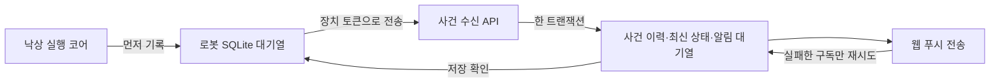

# 낙상 기록·웹 푸시 연결

작성일: 2026-09-18. [전체 명세](fall_detection.md)의 저장·알림 부분이다.
사건 **메타데이터**와 분석 완료 시 모델이 반환한 짧은 판단 설명을 저장한다.
원본 영상·음성·대화문은 이 사건 API로 저장하거나 푸시로 보내지 않는다.
판단 설명도 푸시·ROS 처리 명령에는 넣지 않고 로그인한 장치 멤버의 사건 상세에서만 표시한다.

## 처리 순서



- 코어에 `journal=SqliteFallJournal(...)`을 전달하면 사건 이벤트를 디스크에 기록한 뒤 외부로 내보낸다.
  기록 실패 시 감지를 중단하고 오류를 반환한다. 실패를 숨긴 채 이벤트를 버리지 않는다.
  `journal=None`은 메모리 테스트용이며 운영 연결에서 사용하지 않는다.
- 전송 워커는 추론·ROS 이벤트 루프 밖에서 실행한다. 인터넷이 끊겨도 SQLite에 기록이 남는다.
- 양쪽 대기열 모두 긴급 → 확인 필요 → 일반 알림 → 일반 기록 순으로 처리한다.
  서버는 역순으로 도착해도 오래된 상태가 최신 상태를 덮어쓰지 않게 한다.
- 서버가 저장했다고 확인한 이벤트만 로컬 전송 대기에서 뺀다. 저장 확인은 푸시 수신 확인과 다르다.
  로컬 이력 자체는 삭제하지 않는다.
- 서버는 수신 직후 전송을 시도한다. 실패·미설정·구독 없음은 대기 상태로 남기며,
  기존 인증된 maintenance 작업도 낙상 알림을 재시도한다.
- 같은 이벤트 ID의 같은 내용은 중복 저장하지 않는다. 같은 ID의 다른 내용은 `409`다.
  같은 사건·같은 등급의 알림도 한 번만 생성하며, 높은 등급이 생기면 대기 중인 낮은 등급을 취소한다.
- 구독별 수락 결과를 저장한다. 일부만 실패하면 이미 수락한 구독으로 다시 보내지 않는다.
  전송 직후 응답이나 DB 기록이 유실되는 경우까지 외부 서비스의 정확히 한 번 전송을 보장하지는 못한다.
  브라우저의 사건·등급별 태그로 중복 표시를 줄인다.
- 작업 소유권은 120초 동안 유지하고 전송 묶음마다 갱신한다. 만료·회수된 작업은 결과를 덮어쓰지 못한다.
  실패 재시도 간격은 최대 5분까지 늘어난다. 이는 Cloud VLM 확인 주기와 별개다.

## 사건 수신 API

`POST /api/device/v1/fall-events`

- `Authorization: Bearer <장치 토큰>`
- `X-Malbut-Device-Id: <로컬 기록의 장치 ID>` — 토큰의 장치와 일치해야 한다.
- `Content-Type: application/json`
- 본문 최대 8 KiB, 장치당 분당 최대 120건. `deviceId`·수신자 주소·영상 등 임의 필드는 본문에서 받지 않는다.

| 필드 | 형식 | 의미 |
|---|---|---|
| `schemaVersion` | `1` | 계약 버전 |
| `eventId` | UUID v4 | 재전송해도 유지하는 이벤트 ID |
| `incidentId` | UUID v4 | 같은 사건의 ID |
| `bootId` | 문자열, 최대 128자 | 사건을 시작한 장치 부팅 구분 |
| `sequence` | 양의 정수 | 로컬 저널 기록 순번. 시계가 바뀌어도 순서 판단에 사용 |
| `evidenceRevision` | 양의 정수 | 새로운 관측을 추가한 버전 |
| `occurredAt` | UTC ISO 8601, 밀리초 | 이벤트를 기록한 시각. 실제 낙상 시작 시각과 다름 |
| `eventKind` | 허용된 사건 이벤트 이름 | 질문 요청·분석 완료·알림 요청 등 |
| `state` | `verifying / recheck_required / help_required / resolved` | 처리 상태 |
| `fallSeen` | boolean | 넘어지는 장면을 관측한 기록. 나중에 정상처럼 보여도 유지 |
| `assessment` | 영상 판정 또는 null | `observed_fall / suspected_fall / normal_activity / unobservable` |
| `answer` | Agent 답변 또는 null | `help_request / okay / unclear / no_response / failed` |
| `reason` | 사유 코드 또는 null | 자유 형식 문장이 아닌 코드 |
| `notificationLevel` | `info / check / urgent / null` | `notification_requested`에만 지정 |
| `analysis` | 선택 객체 | `analysis_completed`에만 허용하는 해당 Cloud 요청의 판정·설명 |

서버는 장치 토큰으로 저장 대상을 정한다. 클라이언트가 다른 장치 ID로 바꿔 기록할 수 없다.
같은 사건 ID를 다른 `bootId`로 재사용하거나 같은 순번에 다른 이벤트를 쓰면 거부한다.

### 발견 경로와 판단 이유 (2026-10-06)

`incident_opened` 자체는 Pose 발견을 뜻하지 않는다. `reason`에 남은 근거로 표시를 구분한다.

| `reason` | 사건 생성·갱신 화면 표시 |
|---|---|
| `pose_rapid_posture_change` | 자세 분석: 낙상 의심 (급격한 자세 변화) |
| `pose_sustained_horizontal_posture` | 자세 분석: 낙상 의심 (누운 자세 추정) |
| `pose_sustained_low_posture` | 자세 분석: 낙상 의심 (낮은 자세 지속) |
| `pose_candidate` | 자세 분석: 낙상 의심 (감지 근거 기록 없음) |
| `cloud_crosscheck / target_unidentified` | 클라우드 AI 발견 또는 클라우드 AI 근거 갱신 |
| 과거 기록의 null·미지정 코드 | 사건 생성 또는 새 근거로 사건 갱신 (출처를 추측하지 않음) |

Pose 이유는 실제 감지기의 후보 종류와 `horizontal_torso_and_body` 근거에서 가져온다.
낮은 자세·작게 모인 자세만으로 누워 있다고 표시하지 않는다. 이 이유는 표시용이며
낙상 판정 임계값, 사건 병합, 질문·알림 정책을 변경하지 않는다.

`analysis`는 아래 네 필드만 받는다. 기존 `analysis` 없는 사건도 계속 수신한다.

| 필드 | 형식·의미 |
|---|---|
| `requestId` | 원래 Cloud 요청 ID. 영문·숫자·`._:-`, 1~128자 |
| `purpose` | `incident` (사건 확인) 또는 `crosscheck` (주기적 장면 확인) |
| `assessment` | 이 요청이 반환한 판정. 사건에 유지된 과거의 더 강한 판정과 다를 수 있음 |
| `explanation` | 모델이 반환한 원문 설명. 공백만 있는 값 불가, 최대 1,000 Unicode 코드포인트 |

- `클라우드 AI: 낙상 의심 (모델의 실제 설명)`처럼 같은 요청의 판정과 이유를 묶어 표시한다.
  모델 설명은 검증된 사실이나 내부 추론 기록이 아니다. `crosscheck` 설명은 장면 전체에 대한
  설명이며 특정 사람만의 설명으로 바꾸지 않는다.
- Cloud 결과가 늦게 사람·사건에 연결되더라도 원래 요청의 설명을 유지한다.
  내부에서 만든 대체 설명이나 `target_unidentified` 같은 사람 연결 실패 코드를 낙상 판단 이유로 쓰지 않는다.
- 설명이 없는 과거 기록은 `판단 이유 기록 없음`으로 표시한다. 당시 설명을 소급 생성하지 않는다.
  표시용 설명이 유효하지 않거나 너무 길면 설명만 제외하고 기존 감지·판정 처리는 계속한다.
- 기존 Cloud 동의·인증·접근 제어를 유지하며 별도 이미지 저장, 추가 VLM 호출, 새 동의 설정은 추가하지 않는다.
  웹은 모델 문장을 HTML이 아닌 일반 텍스트로 표시한다. 이 문장을 감지·병합·Agent 명령에 사용하지 않는다.
- 질문 기록은 `로봇 확인 질문 요청`으로 표시한다. 실제 재생 완료나 질문 원문이 남아 있지 않은
  요청 이벤트에 `괜찮으세요?`라고 말했다는 내용을 붙이지 않는다.
  답변은 `질문에 대한 답: 낙상 의심 (응답 불분명)`처럼 괄호로 표시한다.

**반영 순서:** 웹 수신 API·화면을 먼저 배포한 뒤 로봇을 업데이트한다. 추가 필드를 모르는 옛 웹은
`analysis`가 포함된 본문을 `400`으로 거부하며, 업로드 워커는 그 기록을 `blocked`로 남긴다.
새 DB 컬럼·마이그레이션은 필요 없고 기존 이벤트 JSON과 상세 조회 경로를 사용한다.

검증: 2026-10-06 로컬 오프라인 낙상 회귀 2,250개 통과(실기·ROS 등 24개 제외),
웹 198개 통과(#192 머지 main 반영), TypeScript·변경 파일 ESLint·웹 운영 빌드 통과.
Agent 전체 회귀도 3,209개 통과(ROS·추가 의존성 등 45개 제외, 하위 테스트 71개 통과).
시험용 Cloud 응답을 실제 SQLite → 인증 API → 시험 DB → 상세 화면 표시 함수까지 전달했다.
늦은 사람 연결·연결 대기 만료에서도 원래 설명을 유지하고, 푸시·ROS 처리 명령에는 설명이
들어가지 않는 것을 검증했다. 실제 로봇·Cloud 재호출이나 운영 배포 검증은 아니다.
이 변경은 오탐을 줄이는 모델 수정이 아니라 발견 경로·판단 이유를 정확하게 기록하고 표시하는 수정이다.

응답:

- `201`: 새 기록 저장. `{stored: true, created: true, eventId, push}`
- `200`: 같은 내용 재전송. `{stored: true, created: false, eventId, push}`
- `400`: 잘못된 본문, `401`: 인증 실패, `403`: 장치 불일치.
- `409`: ID·순번·부팅·상태 충돌. 임의로 새 ID를 만들어 우회하지 않는다.
- `429`: 호출 상한. `Retry-After: 60`.
- `503`: 저장 불가 또는 마이그레이션 미적용. 로컬 기록을 유지하고 재시도한다.

`push.accepted=true`는 푸시 서비스가 수락했고 전송 작업을 완료했다는 뜻이다.
사용자가 읽었거나 도움을 받았다는 뜻은 아니다. `stored=true, push.accepted=false`도 정상적인 저장 응답이다.

## 웹 조회

`GET /api/devices/{deviceId}/fall-incidents`

로그인한 해당 장치 멤버만 최근 사건 50개를 볼 수 있다. 권한 없는 장치는 `404`로 응답한다.
조회 API까지 구현했으며 사건 목록·상세 UI와 읽음/대응 완료 버튼은 아직 연결하지 않았다.

## 로봇 전송 워커

등록된 명령: `malbut-fall-upload`.
소스에서 실행할 때는 `python3 -m malbut_agent_server.fall_upload_worker`를 사용한다.

```bash
malbut-fall-upload --journal /var/lib/malbut-falls/events.sqlite --device-id DEVICE_ID --base-url https://malbut.hyenje29.click --allow-host malbut.hyenje29.click
```

위 명령은 **설정 확인만** 한다. 파일 생성·토큰 읽기·HTTP 전송을 하지 않는다.
실제 워커 실행은 같은 명령에 `--execute --token-file /etc/malbut-homecam.token`을 추가한다.
`--once`를 함께 주면 전송 대기 한 건만 처리한다. 토큰은 명령행 값으로 받지 않는다.
Bringup은 웹 설정이 있으면 같은 감지 DB·기기 ID로 `--execute --upload-clips` 워커를
자동 시작한다. 이 경우 수동 실행은 불필요하며 동일 DB에 대한 중복 송신은 파일 잠금으로 막는다.
기존 대기 알림도 전송 대상이다. 과거 알림 억제 정책은 이번 자동 연결에서 변경하지 않는다.

- 로컬 저널 디렉터리 `0700`, 파일 `0600`. 토큰 파일은 `0600` 또는 `0640`만 허용한다.
- HTTPS 허용 호스트만 사용한다. 리디렉션을 따라가지 않고 환경 프록시 설정도 사용하지 않는다.
- `400/401/403/409/413`은 자동 반복하지 않고 `blocked`로 남긴다.
  토큰을 고친 뒤 명시적으로 `--retry-auth-failed`를 주면 `401/403` 기록만 다시 대기시킨다.
- `--upload-clips`를 주면 사건 클립 구간(녹화 시작·끝 실제 시각, 영상 자체는 아님)도
  `POST /api/device/v1/fall-incident-clips`로 보낸다. 기본은 꺼져 있다(웹 수신 API 배포 전).
  Bringup 자동 실행에서는 켜져 있다. 알림 이벤트를 항상 먼저 보낸다.
  웹이 아직 받지 못하면(`404`) 막지 않고 늦춰 재시도한다.
  계약·ID 충돌은 별도 확인이 필요하다.
- 같은 플래그로 클립 구간의 사람 박스(장면 영상 위 사람 표시용)도
  `POST /api/device/v1/fall-incident-people`로 보낸다. 위치만 보내고 영상·사람 ID는 보내지 않는다.
  - 자세 분석 박스는 초당 최대 5번 그대로, 클라우드 AI 위치는 crosscheck에서 사건에 연결된 것만 담는다.
  - 시각은 구간 시작부터의 ms, 좌표는 화면의 1/1000 정수. 구간이 끝나고 2초 뒤 확정하고,
    구간이 늘거나 AI 위치가 붙으면 새 revision으로 다시 보낸다.
  - 사람 키는 부팅 ID와 추적 ID의 해시 앞 12자다. 같은 장면의 연결된 사건끼리 같은 사람을 맞추는 데만 쓴다.
  - 본문은 256 KB 이하. 클립 구간보다 먼저 도착하면 웹이 `503`을 돌려주고 로봇은 늦춰 재시도한다.
- 재부팅해도 전송 대기·차단 사유·미해결 이력을 읽을 수 있다.
  과거 질문을 재생하거나 옛 사람 ID를 새 부팅의 사람과 자동으로 연결하지 않는다.
  `unresolved()` 결과로 후속 확인을 시작하는 정책은 아직 미연결이다.
- 보관 기간·용량 제한·완료 이력 정리는 아직 정하지 않았다. 실제 상시 운영 전에 확정해야 한다.

## 배포와 남은 연결

1. `0009_fall_incidents.sql` 적용: 사건·이력·알림 대기열 세 테이블.
   최신 main의 `0008_managed_robot_commands.sql` 다음 순서다.
2. 낙상 형식을 받는 Push Broker, 웹 서버 반영.
3. 실제 카메라/YOLO·Cloud 어댑터·Agent 계약을 연결한 런타임에서 저널 사용.
4. 보호된 장치 토큰으로 전송 워커 실행 후 실수신 검증.

이번에는 위 배포·실발송을 수행하지 않았다. DB 검증은 PGlite, Cloud·음성·푸시는 시험용 구현을 사용했다.
장치 → 웹 사이 필드 호환은 Python 코어의 실제 출력으로 API·DB·푸시 요청까지 통합 테스트했다.
Agent의 질문·재생 완료·답변 담당부와 실제 입력 구간 합의는 남았다.
2026-09-19에 Cloud HTTP·ROS 실행 연결을 추가했으며, 범위와 제한은
[실행 연결 명세](fall_runtime.md)를 따른다. 실제 서비스로 배포·연결했다는 뜻은 아니다.
