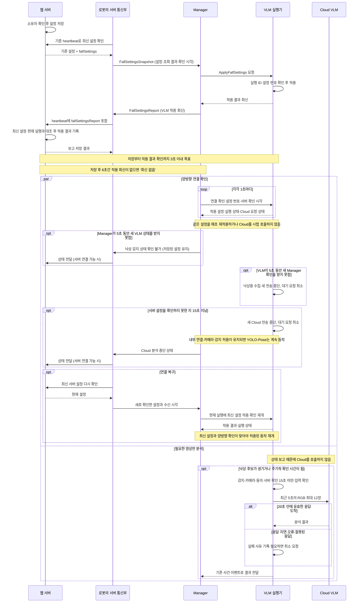

# 낙상 감지 Manager–VLM 호출 명세

작성일: 2026-09-20
수정일: 2026-09-23 — 웹 설정 저장·heartbeat 응답·적용 회신 이력까지 연결.

상태: **로봇 설정 전달·웹 저장·적용 회신 이력 구현. 현재 실행 등록·실행 상태의 웹 연결은 남음**.
`ApplyFallSettings.srv`, `FallRuntimeStatus.msg`, `FallControlHeartbeat.msg`,
`FallSettingsSnapshot.msg`, `FallSettingsReport.msg`를 `malbut_interfaces`에 만들고 빌드 목록에 추가했다.
필드 이름·타입은 아래 표와 같으며 `malbut_test` 적용본에도 반영했다.
VLM은 설정 Service를 열고 연결 확인 메시지를 받으며, 1초마다 실행 상태를 보낸다.
홈캠은 기존 heartbeat 응답에서 `fallSettings`를 읽어 Manager에 보내며,
Manager는 설정 적용 Service를 호출하고 실제 회신만 홈캠에 돌려보낸다.
홈캠은 그 결과를 다음 heartbeat의 `fallSettingsReport`에 넣는다.
서버가 유효한 `fallSettings`를 보내지 않으면 감지를 켜거나 보고 필드를 추가하지 않는다.
서버의 소유자 설정 저장·응답 확장·보고 저장과 웹 회신 이력 표시를 구현했다.
현재 실행과 대조하는 연결이 없어 웹은 ‘적용 완료’나 ‘감지 실행 중’으로 표시하지 않는다.
서버 API·DB 변경·배포 순서는 `homecam_web/docs/fall_settings.md`에 정리했다.
Manifest는 대화 Agent가 설정을 바꾸는 경로가 되지 않도록 실제 등록 폴더에 추가하지 않았다.
기존 JSON 설정·상태 토픽은 실행기에서 제거했다. 질문·답변·사건 이벤트는 기존 JSON 형식을 유지한다.

[전체 처리 흐름](fall_detection.md) · [현재 실행 코드와 연결 상태](fall_runtime.md)

## 1. 기능 구분

| 기능 | 방식 | 책임 |
|---|---|---|
| 낙상 감지 설정 적용 | Service / Capability Manifest | Manager가 전달한 설정을 적용하고 결과를 회신 |
| 실행 상태 보고 | Topic | 적용 설정·실행기·Cloud 요청의 현재 상태 보고 |
| Manager 연결 확인 | Topic, 양쪽 구현, 3.5절 | Manager 연결과 서버 설정을 마지막으로 확인한 시각 전달 |
| 서버 설정 전달 | 홈캠 → Manager Topic 구현, 3.7절 | 인증된 서버에서 받은 설정과 확인 시각 전달 |
| 적용 결과 회신 | Manager → 홈캠·HTTP·서버 저장 구현, 3.8절 | 실제 적용 결과의 이력 표시. 현재 실행 대조는 남음 |
| 영상 분석 | 기존 실행 코어 → Cloud 어댑터 | 낙상 후보와 주기적 확인에 필요한 실제 영상 분석 |

설정 적용 Service는 영상 분석이 끝날 때까지 기다리지 않는다.
주기적 상태 보고는 VLM을 시험 실행하거나 Cloud API를 호출하는 기능이 아니다.
영상 입력·YOLO-Pose·주기적 확인은 Bringup과 기존 실행 코어가 담당한다.
이를 전부 시작하는 장시간 `monitor_falls` 명령 하나로 묶지 않는다.

- VLM 자동 실행은 `navigation`에서만 한다. 센서 모드 제거는 Bringup 담당 범위다.
- 이동·순찰·사람 따라가기의 시작·종료와 낙상 감지 ON/OFF는 별개다.
- 영상 저장 OFF에서도 카메라·낙상 감지 ON이면 낙상 감지가 가능하도록 분리한다.
- Cloud VLM 전송에는 별도 동의가 필요하다.
- 두 설정은 로봇 소유자만 변경한다. 질문·답변은 Agent, 웹 푸시는 알림 연결부 담당이다.

## 2. 낙상 감지 설정 적용

### 2.1 Capability Manifest

새 기능 이름은 `apply_fall_settings`를 제안한다.
감지를 계속 수행하는 명령이 아니라 **저장된 설정을 적용하는 짧은 요청**이므로 Service로 둔다.

```yaml
schema_version: 1

capability:
  id: apply_fall_settings
  title: 낙상 감지 설정 적용
  description: 소유자가 저장한 낙상 감지와 Cloud 전송 설정을 적용하고 결과를 돌려준다.

command:
  kind: SERVICE
  name: /malbut/falls/settings/apply
  type: malbut_interfaces/srv/ApplyFallSettings

input:
  fields:
    runtime_id:
      type: string
      description: 설정을 적용할 VLM 실행 ID
    settings_revision:
      type: uint64
      description: 서버에 저장된 설정 번호
    enabled:
      type: bool
      description: 낙상 감지 사용 여부
    camera_enabled:
      type: bool
      description: 서버에서 확인한 카메라 사용 허용 여부
    cloud_consent:
      type: bool
      description: Cloud VLM에 영상과 센서 요약을 보내는 데 대한 동의

execution:
  mode: BACKGROUND
  priority: NORMAL
  resources: []
```

- 입력은 모두 필수다. 누락된 감지·동의 값을 임의로 채우지 않는다.
- `BACKGROUND`는 이 설정 요청의 실행 구분이다. Service 응답 후의 전체 감지 수명을 뜻하지 않는다.
- `resources: []`는 이 요청이 차체·스피커 등을 독점하지 않는다는 뜻이다.
  CPU·GPU·Cloud 비용 제한이 없다는 뜻은 아니다.
- 현재 Manifest 규격에는 `output`이 없다. 출력은 아래 Response 표와 Service 정의로 적는다.
- Manifest 등록 자체는 권한 확인이 아니다. 소유자 검사는 웹 저장 API에서 하고,
  Manager는 인증된 서버에서 확인한 설정만 전달해야 한다.
- 대화 Agent가 동의 값을 만들거나 이 기능을 자유롭게 호출하도록 노출하지 않는다.
  현재 공통 Manager 호출만으로 소유자 권한이 검증되지는 않으므로,
  신뢰된 설정 전달 경로를 정하기 전에는 이 Manifest를 실제 등록하지 않는다.

### 2.2 입력 — Request

| 필드 | 타입 | 의미 |
|---|---|---|
| `runtime_id` | `string` | VLM 실행기가 시작할 때 만든 ID. 현재 실행 ID와 같아야 함 |
| `settings_revision` | `uint64` | 서버 설정 번호. 1 이상이며 설정 변경 시 증가 |
| `enabled` | `bool` | 소유자가 설정한 낙상 감지 ON/OFF |
| `camera_enabled` | `bool` | 기존 카메라 설정에서 확인한 값. 낙상 모듈이 카메라 전원을 임의로 변경하는 명령은 아님 |
| `cloud_consent` | `bool` | 소유자의 Cloud VLM 영상·센서 요약 전송 동의 |

`runtime_id`는 재시작 전 메시지가 새 실행을 켜지 못하게 구분하는 값이며 인증 수단은 아니다.
`settings_revision`은 동일 로봇의 낙상·카메라·동의 설정 묶음에 적용한다.
기존 카메라 설정이 바뀌어도 이 번호가 함께 갱신되도록 서버 연결을 맞춰야 한다.
요청에는 API 키·영상·평문 비밀번호를 넣지 않는다.

### 2.3 출력 — Response

| 필드 | 타입 | 의미 |
|---|---|---|
| `applied` | `bool` | 요청 설정을 실제 반영했거나, 같은 설정이 이미 반영되어 있으면 true |
| `runtime_id` | `string` | 회신한 VLM의 현재 실행 ID |
| `requested_revision` | `uint64` | 이번 요청의 설정 번호 |
| `applied_revision` | `uint64` | 실제 적용된 마지막 설정 번호. 아직 없으면 0 |
| `enabled` | `bool` | 실제 반영된 낙상 감지 설정 |
| `camera_enabled` | `bool` | 실제 반영된 카메라 허용 설정 |
| `cloud_consent` | `bool` | 실제 반영된 Cloud 전송 동의 |
| `reason_code` | `string` | 적용 결과를 구분하는 아래 코드 |

| reason_code | 의미 |
|---|---|
| `applied` | 새 설정 적용 완료 |
| `already_applied` | 같은 번호·같은 설정이 이미 적용됨 |
| `runtime_mismatch` | 요청이 이전 또는 다른 실행을 가리킴 |
| `stale_revision` | 이미 적용한 설정보다 오래된 번호 |
| `revision_conflict` | 같은 설정 번호인데 내용이 다름 |
| `invalid_request` | 범위나 입력 조건에 맞지 않음 |
| `internal_error` | 설정을 적용하지 못함 |

`applied=true`는 **설정을 반영했다**는 뜻이다.
카메라 OFF·Cloud 동의 OFF 등으로 실제 분석은 대기할 수 있고, Cloud 분석 성공도 보장하지 않는다.
실제 감지·분석 상태는 3절의 상태 메시지로 구분한다.

같은 요청을 다시 받아도 사건·버퍼·분석을 재시작하지 않는다.
잘못된 요청은 기존의 유효한 설정을 덮어쓰지 않는다.
회신은 현재 실행 ID와 요청 번호·적용 번호를 모두 대조한다.
현재 Manager의 상위 작업이 `SUCCEEDED`여도 Service의 `applied=false`일 수 있으므로
상위 작업 상태만 보고 웹에 적용 완료를 표시하지 않는다.

### 2.4 Service 정의

아래 Request의 필드 이름과 타입은 Manifest의 `input.fields`와 일치한다.
`/malbut/falls/settings/apply` Service 서버를 VLM 실행기에 구현했다.
현재 설정을 반환하는 `applied=true`는 Cloud 연결 성공이나 감지 시작을 뜻하지 않는다.
연결 확인 메시지까지 받아야 수집이 시작되며, 실제 수집 여부는 `accepting_images`로 확인한다.

```srv
string runtime_id
uint64 settings_revision
bool enabled
bool camera_enabled
bool cloud_consent
---
bool applied
string runtime_id
uint64 requested_revision
uint64 applied_revision
bool enabled
bool camera_enabled
bool cloud_consent
string reason_code
```

### 2.5 적용 시간·중단

- 온라인 로봇 기준, 서버 저장 성공 후 **3초 이내 적용·회신 확인**을 목표로 한다.
- 저장 성공 후 **6초 동안 최신 적용 회신이 없으면 ‘회신 없음’**으로 표시한다.
- 6초가 지나도 적용 실패·설정 취소로 단정하지 않는다. 늦은 회신도 실행·번호를 확인한다.
- 감지 OFF 또는 카메라 OFF를 적용하면 낙상용 수집·새 분석을 중단하고 버퍼를 비운다.
- Cloud 동의를 철회하면 새 전송과 대기 요청을 막는다. 진행 중 요청은 취소를 시도한다.
  이미 전송한 영상까지 회수됐다고 표시하지 않는다.
- Service는 설정을 반영하고 로컬 취소 요청을 등록한 뒤 회신한다.
  원격 추론 종료나 취소 결과까지 기다려 3초 목표를 지연시키지 않는다.
- 통신 결과가 불명확할 때 새 번호를 만들어 반복 호출하지 않는다.
  기존 요청의 결과·상태를 먼저 확인하며, 실패·재전송 정책은 Manager 담당자와 맞춘다.

### 2.6 설정 전달 권한과 재시작 처리

아래는 연결 코드가 지켜야 할 규칙이다. 자료형 생성만으로 인증·권한 검사가 구현되지는 않는다.

| 담당 | 허용할 일 | 허용하지 않을 일 |
|---|---|---|
| 로봇 소유자 | 인증된 웹에서 설정 변경 | 다른 로봇 설정 변경 |
| 홈캠 서버 통신부 | 장치 토큰으로 해당 로봇의 서버 설정 조회, 결과 보고 | 조회 실패를 새 OFF 설정으로 만들거나 소유자 설정 덮어쓰기 |
| Manager의 설정 연결부 | 확인된 서버 설정을 VLM에 적용, 실행 상태 확인 | Agent가 만든 ON/OFF·동의 값을 서버 설정처럼 사용 |
| VLM 실행기 | 현재 실행·번호를 검사해 설정 적용, 결과·상태 보고 | 메시지의 실행 ID만 보고 호출자를 인증했다고 간주 |
| 대화 Agent | 기존 질문·답변 담당 | 낙상 감지·카메라·Cloud 동의 변경 Service 직접 호출 |

- 설정 적용 Service는 Manager의 전용 설정 연결부에서 호출한다.
  일반 `ExecuteMission` 명령 목록에는 넣지 않는다. 공개 Manifest 등록과 소유자 권한 확인을 혼동하지 않는다.
- ROS 통신을 열 때 설정·연결 확인의 발행자와 Service 호출자를 지정된 프로그램으로 제한한다.
  같은 네트워크에 있다는 이유, 노드 이름·UUID가 같다는 이유만으로 신뢰하지 않는다.
  실제 ROS 보안 설정과 실행 등록 연결은 배포 시 함께 마련해야 한다. 아직 그 제한을 구현했다는 뜻은 아니다.
- 실행 ID는 프로세스를 켤 때 새로 만든다. 실행 ID 자체에는 앞뒤 순서가 없고 인증 정보도 아니다.
  새 실행을 등록하는 경로는 일반 상태 메시지 수신과 구분한다. 메시지가 왔다는 이유로 현재 실행을 교체하지 않는다.

Bringup은 VLM이 켜지는 navigation 실행마다 Manager·홈캠·VLM ID를 새로 만들어
각 노드의 읽기 전용 파라미터로 전달한다. VLM은 `manager_runtime_id`, `runtime_id`를,
Manager와 홈캠은 `fall_manager_runtime_id`, `fall_bridge_runtime_id`, `fall_vlm_runtime_id`를 받는다.
다른 실행의 상태 메시지를 받았다고 ID를 바꾸지 않는다. 단독 실행에서 ID를 생략하면
설정 전달은 켜지지 않는다. 독립 재시작은 기존 Bringup 전체 종료·재시작 정책을 따른다.
값이 없으면 설정을 거부하고 대기한다. 다른 Manager ID의 메시지가 와도 바꿔 받지 않는다.
Manager가 재시작하면 배포 제어부가 새 ID를 확인하고 VLM도 새 ID로 다시 시작해야 한다.
로봇 안의 ID 전달은 구현했고, 서버의 현재 실행 등록과 ROS 접근 권한 제한은 남아 있다.
ID 일치 검사는 이전 실행의 메시지를 거르는 용도이며 호출자 인증이 아니다.

| 재시작한 프로그램 | 재개 전에 확인할 것 |
|---|---|
| 홈캠 | 새 홈캠 실행 등록 → 서버 설정 새로 조회. 이전 실행이 남긴 확인 시각으로 Cloud를 재개하지 않음 |
| Manager | 새 Manager 실행 등록 → 현재 VLM 확인 → 서버 설정 새로 조회 → 적용 회신과 양방향 연결 확인 |
| VLM | 새 VLM 실행 등록 → 서버 설정 새로 조회 → 새 `runtime_id`로 설정 적용 → 양방향 연결 확인 |

- 재시작 전 설정·회신·연결 메시지는 새 실행을 켜는 데 사용하지 않는다.
  서버 확인 시각은 재시작 후 새 조회에서 얻어야 하며 보관된 메시지의 시각을 현재 시각으로 바꾸지 않는다.
- 프로그램 재시작 때문에 서버의 설정 번호를 올리지 않는다. 같은 서버 설정을 새 VLM 실행에 다시 적용한다.
- 소유자가 저장한 설정과 과거 사건 기록은 재시작·연결 끊김 때문에 지우지 않는다.
- 서로 다른 실행이 동시에 현재 실행이라고 보고하면 자동으로 하나를 고르지 않는다.
  Cloud 전송을 허용하지 않고 실행 중복을 해결한 뒤 다시 등록·확인한다.

## 3. 실행 상태 보고

### 3.1 연결

| 항목 | 값 |
|---|---|
| 발행 | 로봇의 VLM 실행기 |
| 수신 | Manager |
| Topic | `/malbut/falls/status` |
| 타입 | `malbut_interfaces/msg/FallRuntimeStatus` |
| 주기 | 1초, 사용자 확정 |
| 메시지가 끊겼다고 판단할 시간 | 5초 동안 새 상태 메시지가 없을 때, 사용자 확정 |

Topic은 요청 명령이 아니므로 Capability Manifest의 `command.kind`에 넣지 않는다.
기존 `/malbut/falls/runtime/status` JSON 발행은 제거하고 위 새 토픽을 사용한다.

### 3.2 출력 — 상태 메시지

| 필드 | 타입 | 의미 |
|---|---|---|
| `runtime_id` | `string` | 이번 VLM 실행 ID |
| `sequence` | `uint64` | 상태 메시지를 새로 만들 때 증가하는 번호. 같은 메시지 재수신을 새 응답으로 세지 않음 |
| `settings_applied` | `bool` | 이번 실행에서 유효한 설정을 한 번 이상 적용했는지 |
| `applied_revision` | `uint64` | 마지막 적용 설정 번호. 설정이 없으면 0 |
| `enabled` | `bool` | 마지막 적용된 낙상 감지 설정 |
| `camera_enabled` | `bool` | 마지막 적용된 카메라 허용 설정 |
| `cloud_consent` | `bool` | 마지막 적용된 Cloud 전송 동의 |
| `accepting_images` | `bool` | 현재 낙상용 RGB를 받을 수 있는지. 실제 프레임이 들어온다는 보장은 아님 |
| `last_frame_age_s` | `float64` | 마지막으로 정상 처리한 RGB 이후 지난 초. 아직 없으면 -1 |
| `runtime_state` | `string` | `waiting_settings / ready / paused / error` |
| `pause_reason` | `string` | `none / waiting_settings / disabled / camera_off / control_unavailable / runtime_error` |
| `analysis_state` | `string` | 마지막 실제 분석 요청 상태: `idle / queued / waiting_response / completed / failed / cancel_requested / canceled` |
| `request_id` | `string` | 위 분석 상태의 요청 ID. 요청 이력이 없으면 빈 문자열 |
| `request_purpose` | `string` | `incident / crosscheck`. 요청 이력이 없으면 빈 문자열 |
| `last_error_code` | `string` | 현재 보고하는 요청의 실패 코드. 실패가 아니면 빈 문자열 |

- 설정을 아직 받지 않았으면 설정 번호는 0, 설정 bool은 false다.
- `runtime_state=ready`는 로봇 쪽 실행기가 처리 가능한 상태라는 뜻이다.
  Cloud 연결·정답률·전체 낙상 감지의 정상 동작까지 확인했다는 뜻은 아니다.
- 상태 메시지는 메모리에 있는 값을 보고한다. 새 영상을 분석하거나 Cloud를 시험 호출하지 않는다.
- 실행기 상태는 실제 작업을 처리하는 루프에서 갱신한다.
  별도 타이머만 살아 있는 것을 전체 정상으로 표시하지 않는다.
- Manager는 서로 다른 로봇의 시계를 빼지 않고, 자기 단조 시계로 마지막 새 응답 이후 시간을 잰다.
- 실행 ID가 바뀌면 새 실행으로 보고 이전 설정 회신·상태 메시지를 섞지 않는다.
- 메시지가 끊겼다는 판정은 Manager 쪽에서 한다. 멈춘 VLM이 스스로 ‘멈춤’을 보내기를 기다리지 않는다.
- `last_error_code`에는 정해진 코드만 넣고 API 키·원문 예외·대화·영상은 넣지 않는다.
- 오류 코드는 기존 Cloud 어댑터의 `cloud_timeout`, `cloud_invalid_response`,
  `cloud_auth_required`, `cloud_transport_error` 등 허용 목록을 사용한다.
- 실제 요청이 없을 때는 `idle`이다. 이전에 한 번 성공했다고 현재 Cloud가 정상이라고 단정하지 않는다.
- `completed`는 마지막 요청이 완료됐다는 뜻이다. 새 요청이 생기면 요청 ID와 상태를 함께 바꾼다.
  Cloud 요청은 기존과 같이 한 번에 하나만 실행한다.
- 현재 실행기는 실제 요청을 만들면 `waiting_response`를 보낸다. 사건만 대기 중일 때
  가짜 요청 ID를 만들거나 `queued`를 보내지 않는다. 전송 전 설정 차단 이유는 사건 기록에 남긴다.
- 취소를 요청했지만 공급자 작업이 끝나지 않았으면 `cancel_requested`다.
  작업 종료·결과 폐기 후 `canceled`가 된다. 이미 Cloud에 도착한 영상을 회수했다는 뜻은 아니다.

### 3.3 메시지 정의

```msg
string runtime_id
uint64 sequence
bool settings_applied
uint64 applied_revision
bool enabled
bool camera_enabled
bool cloud_consent
bool accepting_images
float64 last_frame_age_s
string runtime_state
string pause_reason
string analysis_state
string request_id
string request_purpose
string last_error_code
```

### 3.4 양방향 연결 확인

2026-09-23에 **양방향 1초 주기·5초 미수신 시 연결 끊김**으로 정했다.
실물에서 검증한 시간이 아니라 구현에 사용할 기준이다.
VLM의 상태 보고만으로 VLM이 Manager의 중단을 알 수는 없으므로 반대 방향도 확인한다.

| 방향 | 주기 | 5초 동안 새 메시지가 없을 때 |
|---|---|---|
| VLM → Manager | 1초마다 실행 상태 보고 | Manager가 웹에 ‘낙상 감지 상태 확인 불가’를 전달 |
| Manager → VLM | 1초마다 연결 확인 메시지 | VLM이 낙상 분석용 영상 수집·새 Cloud 전송을 중단하고 전송 대기 요청을 취소 |

- 설정 변경은 Service로 전달하고 바로 적용 결과를 회신한다.
  연결 확인을 위해 같은 설정을 1초마다 다시 적용하지 않는다.
- 확인 메시지는 실제 설정 전달·상태 처리가 가능한지를 반영해야 한다.
  확인용 타이머만 살아 있다는 이유로 전체 동작이 정상이라고 표시하지 않는다.
- 상태 보고와 연결 확인 때문에 시험 영상을 분석하거나 Cloud API를 호출하지 않는다.
  매초 웹 설정 DB를 조회해야 한다는 뜻도 아니다.
- 수신한 쪽의 단조 시계로 마지막 새 메시지 이후 시간을 잰다. 5초 이상이면 끊김으로 처리한다.
  현재 실행과 맞지 않거나, 순서가 오래됐거나, 중복된 메시지는 이 시간을 갱신하지 않는다.
- 아직 설정을 적용하지 않았거나 Manager 연결을 확인하지 못했다면 수집·전송하지 않는다.
- Manager 확인이 끊겼을 때 VLM이 살아 있으면 `runtime_state=paused`,
  `pause_reason=control_unavailable`, `accepting_images=false`로 보고한다.
  낙상용 일시 버퍼는 비우고, 이미 진행 중인 Cloud 요청은 취소를 시도한다.
- 이미 Cloud로 보낸 영상은 회수할 수 없다. 끊긴 동안의 늦은 응답만으로
  감지를 재개하거나 사건을 정상으로 끝내지 않는다.
- 연결이 끊겨도 서버에 저장된 ON/OFF·Cloud 동의 설정과 기존 사건 기록은 바꾸지 않는다.
  이번 실행에서 설정을 적용한 적이 있다면 `settings_applied`도 연결 끊김만으로 false가 되지 않는다.
- 연결이 복구되면 최신 서버 설정과 현재 실행 ID·설정 번호를 다시 확인하고,
  적용 결과와 양방향 확인을 확인한 뒤 허용된 수집·전송만 재개한다.
  지연된 확인 메시지 한 건을 받았다는 이유만으로 재개하지 않는다.

Manager → VLM 확인 메시지의 Topic·타입·필드는 3.5절에서 제안한다. 호출 권한은 별도로 맞춘다.
현재 `FallRuntimeStatus`는 VLM → Manager용이므로 그대로 반대 방향 메시지라고 간주하지 않는다.

Manager가 살아 있는 것과 설정 서버에서 최신 설정을 확인할 수 있는 것은 별개다.
서버와의 설정 전달 연결이 끊겼는데 Manager 확인 메시지만으로 이전 Cloud 동의를 계속 연장하지 않는다.
서버 설정을 확인하지 못한 지 **15초가 되면 새 Cloud 전송을 중단**한다(사용자 확정).
**5초는 Manager–VLM 연결, 15초는 서버 설정 확인 기준이다.** 자세한 처리와 재개 조건은 3.6절을 따른다.

#### 시간 기준 구분

| 구분 | 기준 | 뜻 |
|---|---|---|
| 설정 적용 목표 | 서버 저장 성공 후 3초 이내 | 온라인 로봇에서 설정 적용·회신 확인 목표 |
| 설정 적용 회신 없음 | 서버 저장 성공 후 6초 | 웹 표시만 바꾸며 저장된 설정은 취소하지 않음 |
| Manager–VLM 연결 확인 | 양방향 1초마다, 5초 미수신 시 끊김 | 실행 상태와 제어 연결 확인 |
| 서버 설정 확인 중단 | 마지막 정상 확인 기준 15초 | 새 Cloud 전송 중단. 내부 연결·카메라·감지 허용이 유지되면 YOLO-Pose는 계속 동작 |
| Cloud 분석 응답 대기 | 호출당 20초 | 해당 영상 분석의 응답 대기 시간 |

#### 구현 후 확인할 것

- 마지막 새 확인 메시지 후 5초 미만과 5초 이상에서 끊김 처리가 구분되는지.
- 이전 실행·역순·중복 메시지로 연결 유지 시간이 늘어나지 않는지.
- Manager가 멈췄을 때 수집·새 전송이 중단되고 대기 요청이 취소되는지.
- VLM이 멈췄을 때 Manager가 확인 불가를 표시하되 저장된 설정을 바꾸지 않는지.
- 재연결 시 최신 설정 확인 전에는 재개하지 않는지.
- 1초 확인 때문에 설정 재적용이나 Cloud 호출이 늘어나지 않는지.

### 3.5 Manager → VLM 연결 확인 메시지

아래 자료형과 Manager 발행·VLM 수신 코드를 구현했다. 설정 요청과 별도로 1초마다 보낸다.

- Topic: `/malbut/falls/control/heartbeat`
- 타입: `malbut_interfaces/msg/FallControlHeartbeat`
- 주기: 1초. 메시지를 받지 못한 채 5초가 지나면 3.4절에 따라 중단한다.
- Manager와 VLM은 같은 로봇에서 실행하고 같은 단조 시계를 사용한다.
  서버의 날짜 시각이나 ROS 시뮬레이션 시각을 넣지 않는다. 다른 컴퓨터로 분리할 경우 이 시간 형식을 다시 정한다.

| 필드 | 타입 | 의미 |
|---|---|---|
| `manager_runtime_id` | `string` | Manager를 켤 때 새로 만드는 ID |
| `runtime_id` | `string` | 확인 메시지를 받을 VLM의 현재 실행 ID |
| `sequence` | `uint64` | Manager가 확인 메시지를 새로 만들 때마다 증가하는 번호. 1부터 시작 |
| `settings_revision` | `uint64` | 서버에서 마지막으로 확인한 설정 번호. 확인한 설정이 없으면 0 |
| `server_checked_at` | `float64` | 마지막으로 정상 설정을 받은 시각. 단조 시계의 초(s), 아직 확인하지 못했거나 확인을 무효로 처리하면 -1 |
| `sent_at` | `float64` | 이 확인 메시지를 만든 시각. 같은 단조 시계의 초(s) |

```msg
string manager_runtime_id
string runtime_id
uint64 sequence
uint64 settings_revision
float64 server_checked_at
float64 sent_at
```

- `server_checked_at`은 서버 응답을 받은 로봇 쪽 코드가 기록한다.
  Manager와 VLM에 전달할 때 원래 값을 유지하며, 같은 설정을 다시 전달했다는 이유로 현재 시각으로 바꾸지 않는다.
- 연결 메시지의 `sequence`는 매초 증가하지만, `server_checked_at`은 새 서버 요청에서
  정상 설정을 받았을 때만 바뀐다. 설정 내용·번호가 그대로여도 새 응답이면 확인 시각을 갱신할 수 있다.
- VLM 실행 ID 불일치, 이전 Manager 실행, 중복·역순 번호, 미래 시각,
  생성 후 5초 이상 지난 메시지는 연결 확인으로 세지 않는다. NaN·무한대도 거부한다.
  `server_checked_at`은 -1 또는 0 이상이며 `sent_at`보다 늦을 수 없다.
- 새 Manager 실행 ID를 받았다는 이유만으로 제어권을 바꾸지 않는다.
  현재는 2.6절의 시작 파라미터로 고정한다. 실행 등록 자동화와 ROS 접근 제한은 Manager 담당자와 맞춘다.
  실행 ID와 번호 자체는 인증 수단이 아니다.
- Manager가 살아 있는지와 Cloud 전송이 가능한지는 따로 판단한다.
  정상적인 연결 메시지여도 서버 확인 시각이 없거나, 적용 번호와 다르거나, 15초가 지났으면 Cloud를 허용하지 않는다.
  이 메시지만으로 감지·카메라·동의 설정을 변경하지 않는다.
- 5초·15초 경과 처리는 VLM 자체 시계로 계속 확인한다. 다음 메시지가 와야 중단되는 방식으로 만들지 않는다.
- `server_checked_at=-1`로 확인이 무효가 되면, 이전 확인 시각을 다시 보내도 Cloud를 재개하지 않는다.
  새 서버 응답의 확인 시각이 필요하다. 같은 설정의 Service 재호출은 5초/15초 시간을 늘리지 않는다.
- 5초 끊김 후에는 새 서버 확인과 설정 재적용을 모두 확인해야 다시 수집한다.
  15초 서버 확인 만료만 발생했다면 내부 연결을 유지한 채 새 서버 확인으로 Cloud를 재개할 수 있다.
  끊긴 동안 취소·보류한 사건을 자동으로 몰아서 분석하지 않는다. 재확인은 별도로 요청한다.

### 3.6 서버 설정 확인과 15초 중단

#### 기존 서버 응답에 낙상 설정 추가

홈캠은 이미 장치 토큰으로 `POST /api/device/v1/heartbeat`를 호출하고,
응답의 `desiredState`에서 카메라·마이크·저장 설정을 받는다.
낙상용 로봇 조회 요청을 추가하지 않고 이 응답을 확장했다.

기존 `desiredState` 안에 필드를 추가하면 현재 로봇의 파서가 거부한다.
따라서 기존 항목은 유지하고, 응답 최상위에 `fallSettings`를 별도로 추가한다.
아래는 추가한 부분만 보인 예시다. 서버 DB에 `0010_fall_settings`가 적용되어야 전달한다.

```json
{
  "fallSettings": {
    "settingsRevision": "42",
    "enabled": true,
    "cameraEnabled": true,
    "cloudConsent": true
  }
}
```

| 필드 | JSON 타입 | 의미 |
|---|---|---|
| `settingsRevision` | `string` | 서버 설정 번호. ROS uint64 값을 손실 없이 옮기도록 양의 정수를 십진 문자열로 전달 |
| `enabled` | `boolean` | 소유자가 저장한 낙상 감지 ON/OFF |
| `cameraEnabled` | `boolean` | 카메라 사용 허용. 같은 응답의 `desiredState.cameraEnabled`와 같아야 함 |
| `cloudConsent` | `boolean` | 소유자가 저장한 Cloud VLM 전송 동의 |

- 서버는 네 필드를 같은 설정 상태에서 읽는다. 설정 번호는 1 이상이고,
  낙상 감지·카메라 허용·Cloud 동의 중 하나라도 바뀌면 증가한다.
- 로봇은 번호를 정수로 바꾸기 전에 형식과 uint64 범위를 검사한다.
  서버·웹에서도 이 번호를 JavaScript `Number`로 바꿔 정밀도를 잃지 않도록 한다.
- 장치 토큰으로 확인한 해당 로봇의 응답만 사용한다. 낙상 설정이 빠졌거나 잘못됐을 때
  저장 설정인 `monitoringEnabled`에서 값을 가져오거나 Cloud 동의를 true로 채우지 않는다.
- 정상 응답에서 번호가 같고 내용도 같으면 확인 시각만 갱신한다. 매번 설정 Service를 다시 부르지 않는다.
  번호가 커졌으면 최신 설정을 적용하고, 실제 적용 번호가 일치해야 Cloud를 허용한다.
  같은 번호의 다른 내용·이전 번호·카메라 값 불일치는 정상 확인으로 세지 않는다.
- 기존 heartbeat는 기본 1초 주기이고 HTTP 요청은 최대 10초를 기다린다.
  요청이 진행 중이면 중복 호출하지 않으므로 서버 응답이 매초 온다는 보장은 없다.
  3초 적용 목표는 지연 시 보장되지 않을 수 있어 웹의 6초 ‘회신 없음’ 표시와 함께 검증한다.
- HTTP 인증 실패나 잘못된 설정 응답은 현재 확인을 무효로 처리하고 새 Cloud 전송을 바로 막는다.
  일시적인 연결 오류·시간 초과는 이전 확인 시각을 유지하되 갱신하지 않는다.
  이후 중단 여부는 아래 15초 기준으로 판단한다.
- HTTP 응답과 원래 수신 시각을 Manager로 전달하는 ROS 연결은 구현했다.
  설정 저장·적용 회신 API의 서버 쪽 확장도 구현했으며, 실제 DB 적용과 배포는 남아 있다.
  기존 `desired_state_confirmed_` 값이나 저장 허용 Bool만으로 이 확인을 대신하지 않는다.

#### 중단·재개

- 정상 응답을 로봇이 받은 시각부터 15초를 잰다. 예를 들어 100초에 확인했다면,
  새 확인이 없을 때 115초부터 새 Cloud 전송을 막는다. 서버 요청을 시작하거나 실패한 시각부터 다시 세지 않는다.
- 낙상 후보 확인과 주기적 확인 모두 중단한다. 전송 대기 요청은 취소하고,
  진행 중인 요청도 취소를 시도한다. 이미 보낸 영상은 회수할 수 없다.
- Manager–VLM 연결과 기존 카메라·감지 허용이 유지되면 YOLO-Pose와 최근 영상 버퍼는 유지한다.
  중단 중 Cloud 전송용 영상을 별도 대기열에 쌓거나 복구 후 한꺼번에 보내지 않는다.
  카메라·감지 OFF가 확인됐거나 내부 연결도 끊겼다면 해당 중단 규칙이 우선한다.
- 서버에 저장된 동의 값을 false로 바꾸지는 않는다. 웹에는 ‘서버 설정 확인 끊김 · Cloud 분석 중단’으로 구분한다.
  새 분석 요청이 없었다면 요청 실패를 만들어 `last_error_code`에 넣지 않는다.
  Manager는 자신이 받은 설정 확인 시점과 VLM 상태를 함께 보고 웹에 표시한다.
- 서버에서 새로 설정을 확인하고, 현재 VLM에 적용된 번호와 일치하며, 카메라·감지·Cloud 동의가
  모두 켜져 있고 내부 연결도 유지돼야 새 요청을 허용한다. 오래된 확인 메시지나 늦은 분석 결과로 재개하지 않는다.
- 설정 확인 서버와 Cloud VLM 서버는 별개다. 설정 확인에 성공했다고 Cloud 분석 API가
  정상이라고 표시하지 않는다. 실제 분석 응답의 20초 제한도 별도로 유지한다.

#### 구현 후 확인할 것

- 새 연결 메시지가 매초 와도 같은 서버 확인 시각만 반복되면 15초에 Cloud가 중단되는지.
- 15초 미만과 15초 이상을 구분하며, 요청이 진행 중이어도 제한 시간이 늘어나지 않는지.
- 같은 설정 번호의 새 정상 응답은 확인 시각을 갱신하되 설정·사건·버퍼를 재시작하지 않는지.
- 필드 누락·인증 실패·역순 설정·같은 번호의 다른 내용으로 전송이 허용되지 않는지.
- 서버만 끊기면 허용된 YOLO-Pose는 유지하고, Manager까지 끊기면 5초 기준으로 수집도 중단하는지.
- 재연결 후 OFF 또는 동의 철회 설정을 먼저 적용하며, 이전 대기 영상을 일괄 전송하지 않는지.
- 기존 장치는 `fallSettings`가 추가된 응답을 계속 읽을 수 있고, 새 장치는 해당 항목이 없으면 Cloud 전송을 막는지.

### 3.7 홈캠 → Manager: 서버에서 받은 설정

서버 통신은 기존 홈캠이 담당한다. Manager는 서버 인증키를 받거나 별도 HTTP 조회를 하지 않는다.
아래 메시지는 인증된 서버 응답을 로봇 안에서 옮기는 용도이며, 사용자가 직접 설정을 바꾸는 창구가 아니다.
자료형과 홈캠 발행·Manager 수신을 구현했다. HTTP 작업이 끝난 원래 시각을 기록한다.
ROS 콜백에서 결과를 늦게 가져오더라도 확인 시각을 새로 찍지 않는다.

- Topic 제안: `/malbut/falls/settings/snapshot`
- 타입 제안: `malbut_interfaces/msg/FallSettingsSnapshot`
- 발행: 홈캠의 서버 통신부. 수신: Manager.
- 홈캠 시작 시, 서버 요청이 끝났을 때 발행한다. Manager가 재연결하면 마지막 상태를 다시 전달한다.
  재전달 때문에 서버 확인 시각을 바꾸지 않는다. 별도의 서버 조회 주기를 추가하지 않는다.

| 필드 | 타입 | 의미 |
|---|---|---|
| `bridge_runtime_id` | `string` | 홈캠의 서버 통신부를 켤 때 새로 만드는 ID |
| `sequence` | `uint64` | 서버 조회 결과가 새로 생길 때 증가하는 번호. 시작 상태를 1로 발행 |
| `observed_at` | `float64` | 이번 조회 결과를 기록한 시각. 로봇의 단조 시계, 초(s) |
| `check_state` | `string` | `waiting / confirmed / unavailable / rejected` |
| `settings_revision` | `uint64` | 마지막 정상 서버 설정 번호. 확인한 설정이 없으면 0 |
| `enabled` | `bool` | 마지막 정상 응답의 낙상 감지 설정 |
| `camera_enabled` | `bool` | 마지막 정상 응답의 카메라 허용 설정 |
| `cloud_consent` | `bool` | 마지막 정상 응답의 Cloud VLM 전송 동의 |
| `server_checked_at` | `float64` | 마지막 정상 설정 응답을 받은 시각. 확인한 적 없거나 무효로 처리했으면 -1 |
| `reason_code` | `string` | 아래 표의 서버 조회 결과 코드 |

```msg
string bridge_runtime_id
uint64 sequence
float64 observed_at
string check_state
uint64 settings_revision
bool enabled
bool camera_enabled
bool cloud_consent
float64 server_checked_at
string reason_code
```

| `check_state` | `reason_code` | 전달할 값과 Manager의 처리 |
|---|---|---|
| `waiting` | `waiting_server` | 아직 확인 전. 번호 0·설정 false·확인 시각 -1. 이 값을 OFF 설정 적용 요청으로 바꾸지 않음 |
| `confirmed` | `none` | 인증·필드·번호를 검사한 정상 응답. 같은 설정이면 시각만 갱신하고, 변경됐으면 Service로 적용 |
| `unavailable` | `server_timeout / server_transport_error` | 이전 설정과 확인 시각을 유지. 확인 시각부터 15초가 되면 Cloud 중단 |
| `rejected` | `server_auth_failed / server_invalid_settings / server_settings_missing` | 확인 시각을 -1로 바꿔 Cloud를 차단. 이전 정상 설정은 참고용으로 남기되 새 설정으로 적용하지 않음 |

- 시작 상태나 조회 실패의 false·0 값은 소유자가 OFF로 저장했다는 뜻이 아니다.
  설정 Service에는 검사에 통과한 실제 서버 설정만 넣는다. 정상 응답의 OFF·동의 철회는 바로 적용한다.
- HTTP 작업 스레드가 응답을 받았을 때 확인 시각을 기록하고 Manager까지 그대로 전달한다.
  메인 루프가 늦게 결과를 읽거나 재전달해도 시각을 늦춰 잡지 않는다.
- Manager는 같은 홈캠 실행의 중복·역순 메시지를 무시한다. 과거 실행의 메시지로 돌아가지 않는다.
  새 홈캠 실행과 연결하면 새 서버 확인 전까지 Cloud를 허용하지 않는다.
  현재 홈캠·Manager·VLM 실행을 식별하는 연결과 발행 권한은 신뢰된 로봇 내부 경로로 제한해야 한다.
- `observed_at`과 `server_checked_at`은 같은 로봇의 단조 시계로만 비교한다.
  NaN·무한대·미래 시각·정상 확인 시각이 조회 결과 시각보다 늦은 메시지는 거부한다.
  전달이 늦었다면 원래 시각에서 이미 지난 시간을 포함해 15초를 판단한다.
- 새 설정을 적용하는 동안에도 이전 Cloud 동의를 연장하지 않는다.
  Manager가 확인한 최신 설정 번호와 VLM의 적용 번호가 맞지 않으면 Cloud는 대기한다.
- VLM이 재시작하면 새 `runtime_id`를 확인하고, 서버 설정을 새로 확인한 뒤 현재 설정을 다시 적용한다.
  같은 설정 번호여도 새 VLM 실행에는 처음 적용하는 요청이다.
- 홈캠이 멈췄는데 Manager만 살아 있어도 마지막 서버 확인 시각은 그대로다.
  Manager의 1초 확인 메시지로 서버 확인 시각을 갱신하지 않는다.

### 3.8 Manager → 홈캠 → 웹: 설정 적용 결과

Manager가 VLM의 설정 적용 응답을 받고, 현재 요청의 실행 ID·설정 번호와 맞는지 확인한 뒤 보낸다.
설정을 보냈다는 이유만으로 성공을 만들지 않는다. Service 회신이 없으면 적용 결과도 만들지 않는다.
자료형·Manager 발행·홈캠 수신·HTTP 요청 포함과 서버 보고 저장·웹 이력 표시를 구현했다.
Manager는 Service를 비동기로 호출하며 3초 안에 회신이 없으면 그 요청의 대기를 끝낸다.
실제 회신 없이 성공·실패 보고를 만들지 않는다. 늦은 회신은 버리고 같은 설정 번호로
다시 확인할 수 있다. 이 내부 대기 시간은 웹의 6초 ‘회신 없음’ 표시와 별개다.

- Topic 제안: `/malbut/falls/settings/report`
- 타입 제안: `malbut_interfaces/msg/FallSettingsReport`
- 발행: Manager. 수신: 홈캠의 서버 통신부.
- 적용 응답을 확인했을 때 발행한다. 서버 전송을 재시도할 때는 같은 보고 번호·내용을 사용한다.

| 필드 | 타입 | 의미 |
|---|---|---|
| `bridge_runtime_id` | `string` | 설정을 전달한 홈캠의 실행 ID |
| `manager_runtime_id` | `string` | 결과를 보내는 Manager의 실행 ID |
| `sequence` | `uint64` | 새 적용 결과를 보고할 때 증가하는 번호. Manager 실행마다 1부터 시작 |
| `snapshot_sequence` | `uint64` | 적용 요청에 사용한 3.7절 설정 메시지 번호 |
| `reported_at` | `float64` | Manager가 적용 응답을 확인한 시각. 로봇의 단조 시계, 초(s) |
| `runtime_id` | `string` | 응답한 VLM의 실행 ID |
| `requested_revision` | `uint64` | 이번에 적용을 요청한 설정 번호 |
| `applied_revision` | `uint64` | VLM이 실제로 적용했다고 회신한 번호. 아직 없으면 0 |
| `applied` | `bool` | VLM의 설정 적용 여부 |
| `enabled` | `bool` | VLM이 회신한 실제 낙상 감지 설정 |
| `camera_enabled` | `bool` | VLM이 회신한 실제 카메라 허용 설정 |
| `cloud_consent` | `bool` | VLM이 회신한 실제 Cloud 동의 설정 |
| `reason_code` | `string` | 2.3절의 설정 적용 결과 코드 |

```msg
string bridge_runtime_id
string manager_runtime_id
uint64 sequence
uint64 snapshot_sequence
float64 reported_at
string runtime_id
uint64 requested_revision
uint64 applied_revision
bool applied
bool enabled
bool camera_enabled
bool cloud_consent
string reason_code
```

- Manager는 적용 응답을 자신의 요청 기록과 대조하고, 홈캠은 보고를 자신이 전달한 설정 메시지와 대조한다.
  그 사이 같은 설정의 새 조회 결과가 와도 원래 `snapshot_sequence`를 다른 번호로 바꾸지 않는다.
- `applied=true`이면 요청 번호·적용 번호·세 설정 값이 원래 요청과 같아야 하고,
  `reason_code`는 `applied` 또는 `already_applied`여야 한다.
  불일치 결과를 성공으로 올리지 않는다. 실패 시 회신한 이전 적용 값은 요청 값으로 덮어쓰지 않는다.
- 재시작 전 실행의 결과, 같은 보고 번호의 다른 내용은 현재 결과로 사용하지 않는다.
  UUID의 문자열 순서나 늦게 도착한 순서로 어느 실행이 최신인지 결정하지 않는다.
- 이 보고는 **그때 설정을 적용했는지**에 대한 결과다. 이후 VLM이 계속 살아 있는지,
  영상이 들어오는지, Cloud 분석에 성공했는지는 3절의 실행 상태로 따로 확인한다.

#### 기존 heartbeat 요청으로 전달

홈캠은 다음 `POST /api/device/v1/heartbeat` 요청 최상위에 `fallSettingsReport`를 추가한다.
다른 홈캠 상태 필드는 그대로 둔다. 아래는 추가할 부분만 보인 예시다.

```json
{
  "fallSettingsReport": {
    "bridgeRuntimeId": "homecam-run-a",
    "managerRuntimeId": "manager-run-a",
    "sequence": "8",
    "snapshotSequence": "31",
    "runtimeId": "vlm-run-a",
    "requestedRevision": "42",
    "appliedRevision": "42",
    "applied": true,
    "enabled": true,
    "cameraEnabled": true,
    "cloudConsent": true,
    "reasonCode": "applied",
    "reportAgeS": 0.2
  }
}
```

- ROS의 snake_case 이름을 위 camelCase로 바꾼다. uint64 필드 네 개는 십진 문자열로 보내고,
  bool은 JSON boolean으로 보낸다. `reported_at`은 서버에 보내지 않는다.
  대신 전송 시점의 단조 시각에서 뺀 `reportAgeS`를 보낸다. 서버는 자신의 수신 시각을 따로 기록한다.
  재시도 때 보고 나이는 늘어나야 하며, 새 회신처럼 0으로 되돌리지 않는다.
- `reportAgeS`는 0 이상의 유한한 값이어야 한다. 로봇의 단조 시각을 서버 날짜와 직접 빼지 않는다.
  서버 저장 후 3초·6초는 서버 시각으로 계산한다.
- 장치는 보고 대상을 payload의 임의 로봇 ID로 지정하지 않는다. 서버가 기존 장치 토큰에서 확인한 로봇에만 기록한다.
- 새 결과가 있으면 HTTP 작업이 비어 있는 즉시 전송한다. 이미 요청 중이면 결과를 보관했다가
  다음 요청에 포함한다. ROS 상태 처리를 막거나 HTTP 요청을 무제한 병렬 실행하지 않는다.
- 서버는 `(장치, bridgeRuntimeId, managerRuntimeId, sequence)`가 같은 동일 결과를 한 번만 기록한다.
  같은 키의 다른 내용은 거부한다. 재전송 때 바뀔 수 있는 `reportAgeS`는 결과 내용 비교에서 제외한다.
- 서버 저장 응답이 유실되면 같은 보고를 다시 보내도 된다. 중복 보고로 설정 번호·사건을 새로 만들지 않는다.
  서버는 보고 저장이 성공한 뒤 HTTP 200을 돌려주며, 저장 실패를 성공으로 응답하지 않는다.
- 현재 서버는 모르는 요청 필드를 거부한다. 따라서 서버가 먼저 새 필드를 지원하도록 배포하고,
  새 로봇은 정상 응답에 `fallSettings`가 있는 것을 확인한 뒤에만 보고 필드를 보낸다.
  구버전 서버가 보고를 거부해도 `applied=true`로 간주하지 않는다.

#### 웹에 보여줄 결과

| 상황 | 표시 |
|---|---|
| 서버에 저장했지만 최신 설정의 적용 회신은 아직 없음 | 저장됨 · 로봇 적용 대기 |
| 현재 확인된 VLM 실행에서 최신 번호·내용의 성공 회신이 도착 | 적용 완료 |
| 설정 적용 실패 회신이 도착 | 적용하지 못함 · 실패 이유 |
| 저장 후 6초가 지났는데 최신 적용 회신이 없음 | 회신 없음 |
| 이전 번호나 재시작 전 실행의 회신이 뒤늦게 도착 | 이력만 기록. 현재 적용 상태는 바꾸지 않음 |
| 적용 회신은 있었지만 이후 VLM 상태를 확인할 수 없음 | 적용 이력은 유지 · 낙상 감지 상태 확인 불가 |

- 새 보고가 도착했다는 이유만으로 그 `runtimeId`를 현재 실행으로 바꾸지 않는다.
  현재 실행을 확인하는 3절의 상태 연결이 없거나 불확실하면 적용 이력으로만 보관한다.
  실행 등록·ROS 발행 권한·상태의 웹 전달은 함께 연결하고 검증해야 한다.
- 설정 회신으로 서버의 소유자 설정을 덮어쓰지 않는다. 보고 번호가 같거나 크다는 것만으로
  새 설정이 되는 것은 아니다. 소유자가 저장한 번호·내용과 별도로 대조한다.
- 6초 ‘회신 없음’은 웹 표시다. 설정을 취소하거나 낙상 감지를 OFF로 바꾸는 신호가 아니다.
  늦은 회신도 최신 설정·현재 실행과 일치하면 반영할 수 있다.
- 웹의 `/api/devices/{deviceId}/fall-settings`에서 기존 소유자 권한 검사를 유지한다.
  소유자만 감지·Cloud 동의를 변경하며, 카메라는 기존 설정 API에서 변경한다.
  세 값 중 하나라도 바뀌면 DB에서 같은 트랜잭션 안에 설정 번호와 변경 이력을 갱신한다.
- 현재 웹은 위 표의 ‘현재 확인된 VLM 실행’을 대조할 수 없어 **회신 이력만** 보여준다.
  현재 번호의 회신이 없으면 저장 후 6초에 ‘회신 없음’을 표시한다. 기존 이력으로 현재 실행을 추정하지 않는다.

#### 구현 후 확인할 것

- 서버 조회 실패를 소유자의 OFF 설정으로 잘못 적용하지 않는지.
- 홈캠·Manager·VLM 각각의 재시작에서 이전 메시지가 감지를 다시 켜지 않는지.
- 서버 확인 시각·보고 시각이 재전달이나 HTTP 재시도로 새 시각으로 바뀌지 않는지.
- VLM에 요청만 보낸 상태를 적용 완료로 표시하지 않는지.
- 같은 결과를 두 번 보내도 한 번만 저장되고, 같은 번호의 다른 내용은 거부되는지.
- 새 설정 저장 뒤 이전 설정의 성공 회신이 늦게 와도 최신 적용 상태를 덮어쓰지 않는지.
- 서버와 로봇의 날짜 시각이 달라도 3초·6초·15초 계산이 섞이지 않는지.
- 온라인 정상 조건의 저장→조회→적용→보고 지연과, 10초 HTTP 지연 시의 웹 표시를 측정하는지.

## 4. 영상 분석

Manager는 낙상 감지 ON/OFF와 Cloud 전송 동의 같은 설정을 전달한다.
영상은 Manager가 보내는 것이 아니라 로봇의 카메라에서 따로 받는다.

카메라 사용과 낙상 감지가 켜져 있으면 최근 영상을 버퍼에 보관한다.
Cloud 전송에 동의한 상태에서 YOLO-Pose가 낙상을 의심하거나 주기적 확인 시간이 되면,
최근 5초의 RGB 이미지 최대 12장과 센서 요약을 Cloud VLM에 보내 확인한다.

아래 표는 분석 코드 안에서 사용하는 정보와 결과의 형식이다. Manager의 설정 요청과는 별개다.
Cloud에 보낼 때는 사용하는 모델의 API 형식에 맞게 바꾼다.

### 4.1 분석에 사용할 정보 — CloudFallRequest

| 필드 | 타입 | 의미 |
|---|---|---|
| `request_id` | `str` | 실제 Cloud 분석 요청 ID |
| `purpose` | `str` | 사건 확인 `incident` 또는 주기적 확인 `crosscheck` |
| `device_id` | `str` | 로봇 ID. 로컬 관리용 |
| `boot_id` | `str` | 코어 시작 시 만든 사건 구분 ID. 제어용 `runtime_id`와 별개 |
| `incident_id` | `Optional[str]` | 사건 확인이면 사건 ID, 주기적 확인이면 None |
| `subject_key` | `Optional[str]` | 연결된 대상 ID. 주기적 확인처럼 대상이 정해지지 않으면 None |
| `evidence_revision` | `int` | 사건 영상·관측의 버전. 주기적 확인에서는 0 |
| `window` | `FrameWindow` | 분석할 RGB 묶음과 구간 정보 |
| `sensors` | `Optional[SensorSummary]` | 유효한 센서 요약. 없으면 None |
| `target` | `Optional[SubjectVideoTarget]` | 분석 대상에 연결된 프레임별 박스. 연결하지 못하면 None |

#### FrameWindow / RgbFrame

| 필드 | 타입 | 의미 |
|---|---|---|
| `frames` | `Tuple[RgbFrame, ...]` | 시간순 RGB. 최근 5초에서 최대 12장 |
| `requested_start` | `float` | 요청 구간 시작. 같은 코어 실행의 단조 시각, 초 |
| `requested_end` | `float` | 요청 구간 끝. 같은 시계 기준 |
| `history_incomplete` | `bool` | 요청 구간의 앞부분 영상이 부족한지 |
| `frames[].captured_at` | `float` | 프레임 촬영 시각. 위와 같은 시계 기준 |
| `frames[].jpeg` | `bytes` | 640×400 RGB를 JPEG로 변환한 데이터 |

#### SensorSummary

| 필드 | 타입 | 의미 |
|---|---|---|
| `observed_at` | `float` | 센서 관측 시각. 영상과 같은 시계 기준 |
| `floor_distance_m` | `Optional[float]` | 신체와 바닥 사이 거리(m) |
| `linear_speed_m_s` | `Optional[float]` | 로봇 선속도(m/s) |
| `angular_speed_rad_s` | `Optional[float]` | 로봇 각속도(rad/s) |

센서 값을 측정하지 못했으면 0으로 채우지 않는다. 소리와 원본 depth 영상은 보내지 않는다.
장치·사건·추적 ID는 로컬 관리용이며 Cloud 프롬프트에 그대로 보내지 않는다.
`SubjectVideoTarget`의 연결 기준과 박스 형식은 [대상 연결 명세](fall_subject_observation.md)를 따른다.

### 4.2 분석 결과 — CloudFallReply

| 필드 | 타입 | 의미 |
|---|---|---|
| `assessment` | `VideoAssessment` | `observed_fall / suspected_fall / normal_activity / unobservable` |
| `explanation` | `str` | 영상에 근거한 짧은 판단 이유 |
| `findings` | `Tuple[CloudPersonFinding, ...]` | 주기적 확인에서 발견한 의심 사람과 위치. 없으면 빈 튜플 |
| `localization_failed` | `bool` | 발견 위치 출력의 처리가 실패했는지. 사람이 없다는 뜻이 아님 |

`assessment`는 영상의 해석이며, 사건 종결·보호자 알림 등급과 다르다.
실제 분석 요청 후 20초 안에 유효한 결과가 오지 않으면 실패 사유를 기록한다.
호출 실패를 `normal_activity`로 만들지 않는다.
주기적인 실행 상태 보고를 위해 이 분석을 추가로 호출하지 않는다.

### 4.3 박스 정보

사건을 확인할 때 보내는 대상 박스와, 주기적 확인에서 Cloud가 돌려주는 사람 위치를 구분한다.
아래는 현재 Python 코드에서 사용하는 형식이며, 새 ROS 메시지를 추가하는 내용은 아니다.

#### 공통 좌표

| 항목 | 형식 |
|---|---|
| 박스 좌표 | `(left, top, right, bottom)` |
| 타입 | `Tuple[float, float, float, float]` |
| 좌표 기준 | 이미지 왼쪽 위가 `(0, 0)`, 오른쪽 아래가 `(1, 1)` |
| 좌표 범위 | 각 값은 0 이상 1 이하의 유한한 수 |
| 크기 조건 | `left < right`, `top < bottom` |
| 표시 범위 | 이미지에서 보이는 사람의 몸. 보이는 손·발은 포함하고 가려진 부분은 추측하지 않음 |

가로 좌표는 이미지 너비로, 세로 좌표는 이미지 높이로 나눈 값이다.
예를 들어 640×400 이미지에서 픽셀 좌표 `(64, 80, 384, 320)`은
`(0.1, 0.2, 0.6, 0.8)`로 기록한다.
Python에서는 튜플, Cloud에 보내거나 받는 JSON에서는 배열 `[left, top, right, bottom]`로 표현한다.
박스는 지도 좌표나 실제 거리 정보가 아니다. 박스가 있다는 이유만으로 사람이나 낙상으로 확정하지 않는다.

#### 분석할 사람의 박스 — SubjectVideoTarget

`CloudFallRequest.target`에 들어간다. 로봇의 Pose 관측에서 같은 사람을 연결해 만든다.

| 필드 | 타입 | 의미 |
|---|---|---|
| `subject_key` | `str` | 이번에 확인할 사람을 구분하는 ID |
| `association_token` | `str` | 같은 사람을 끊김 없이 추적한 구간을 구분하는 값. 추적이 끊기면 새로 만듦 |
| `sample_times` | `Tuple[float, ...]` | 박스가 붙은 이미지들의 촬영 시각. 단위는 초 |
| `boxes` | `Tuple[Tuple[float, float, float, float], ...]` | 각 이미지에서 확인할 사람의 박스. 이미지와 같은 순서 |

- `purpose=incident`에서만 사용한다. `subject_key`는 요청의 `subject_key`와 같아야 한다.
- 이미지가 N장이면 촬영 시각과 박스도 각각 N개다. 현재 입력 설정에서는 최대 12장이다.
- `sample_times[i]`는 `window.frames[i].captured_at`과 정확히 같아야 한다.
  시각은 중복 없이 증가하며 `boxes[i]`도 그 이미지에서 관측한 박스여야 한다.
- 선택한 모든 이미지에서 같은 사람의 추적이 이어져야 한다.
  한 장이라도 박스가 없거나 연결이 끊겼으면 요청의 `target=None`으로 둔다.
  이전 박스를 복사하거나 중간 위치를 추측해서 채우지 않는다.
- 대상 박스가 없어도 영상 분석 자체를 막지는 않는다.
  다만 그 정상 결과만으로 특정 사람의 사건을 끝내지 않는다.
- Cloud에는 이미지별 `target_box` 좌표만 추가한다.
  `subject_key`와 `association_token`은 보내지 않으며, 토큰은 인증용이 아니다.

#### Cloud가 발견한 사람 — CloudPersonFinding

주기적 확인(`purpose=crosscheck`)의 `CloudFallReply.findings`에 들어간다.
한 항목은 의심되는 사람 한 명을 뜻하며, 현재 코드는 최대 8개까지 받는다.
이 개수는 확인된 전체 사람 수가 아니다.

| 필드 | 타입 | 의미 |
|---|---|---|
| `assessment` | `VideoAssessment` | 해당 사람의 판단 결과. `observed_fall` 또는 `suspected_fall` |
| `kind` | `CandidateKind` | 넘어지는 과정이 보였는지, 이후 모습만 보였는지 |
| `regions` | `Tuple[CloudPersonRegion, ...]` | 같은 사람이 어느 이미지의 어느 위치에 있는지 기록한 목록 |

| kind 값 | 의미 |
|---|---|
| `motion_seen` | 넘어지거나 주저앉는 등 의심 동작의 과정이 보임 |
| `already_down` | 과정은 보이지 않고 이미 바닥에 있는 모습만 보임 |
| `unknown` | 둘 중 어느 경우인지 구분하기 어려움 |

- `kind`는 무엇을 봤는지 나타내며, 낙상 여부의 정답 라벨을 추가하는 값이 아니다.
  `motion_seen`이라고 반드시 낙상인 것도 아니다.
- `assessment=observed_fall`이면 `kind=motion_seen`이어야 한다.
  이미 바닥에 있었다는 이유만으로 낙상을 확정하지 않는다.
- Cloud에는 같은 사람의 위치를 서로 다른 이미지 2~4장에서 돌려주도록 요청한다.
  위치를 표시할 수 없으면 `regions=()`로 두며, JSON에서는 `[]`이다.
  현재 파서는 위치 1개도 받을 수 있지만 그것만으로 로봇의 추적 대상과 연결하지 않는다.
- 위치를 모른다고 의심 판단까지 버리거나 다른 사람에게 연결하지 않는다.
  최소 2개 이미지의 위치와 추적 연속성을 확인한 뒤 기존 사람 ID와 연결한다.
- 장면이 `normal_activity` 또는 `unobservable`이면 `findings=()`이다.
  사건 확인 요청에는 이 발견 목록을 사용하지 않는다.
- 위치 출력의 형식이 잘못되면 현재 파서는 해당 응답의 발견 목록 전체를 버리고
  `localization_failed=True`로 기록한다. 유효하게 받은 장면의 의심·낙상 판단은 유지한다.
  위치를 모른다고 빈 목록을 반환한 경우와 위치 출력 형식이 잘못된 경우는 구분한다.

#### Cloud가 알려준 이미지별 위치 — CloudPersonRegion

| 필드 | 타입 | 의미 |
|---|---|---|
| `frame_index` | `int` | Cloud에 보낸 이미지 중 몇 번째 이미지인지. 0부터 시작 |
| `box` | `Tuple[float, float, float, float]` | 해당 이미지에서 보이는 사람의 박스 |

- 이미지가 N장이면 `frame_index`는 0 이상 N 미만이다.
  12장을 보냈다면 0~11이며, 원본 영상의 프레임 번호가 아니다.
- `regions`는 `frame_index`가 작은 순서로 기록하며 같은 번호를 중복해서 넣지 않는다.
- 한 `CloudPersonFinding` 안의 위치는 모두 같은 사람을 가리켜야 한다.
  Cloud가 표시한 위치만으로 실제 신원이나 추적 ID가 확인되는 것은 아니다.

#### 주기적 확인의 위치 출력 예시

아래 JSON은 `CloudFallReply.findings`에 해당하는 부분이다.
`frame_index=0`과 `5`는 이번 요청에 보낸 첫 번째·여섯 번째 이미지를 가리킨다.

```json
{
  "findings": [
    {
      "assessment": "suspected_fall",
      "kind": "already_down",
      "regions": [
        {"frame_index": 0, "box": [0.1, 0.2, 0.6, 0.8]},
        {"frame_index": 5, "box": [0.12, 0.2, 0.62, 0.8]}
      ]
    }
  ]
}
```

## 5. 처리 순서



설정 전달·적용 회신의 로봇 코드와 HTTP 서버 처리는 3.5~3.8절대로 구현했다.
그림에서 Manager → 웹 상태 전달도 홈캠의 서버 통신부를 거친다. Manager가 직접 HTTP를 호출하지 않는다.
Bringup에서 실행 ID를 함께 전달하며, 실제 발행 권한과 서버의 현재 실행 등록은 담당자와 맞춰야 한다.
그림 중 로봇 안의 설정 전달·적용 회신·양방향 연결 확인은 구현했다.
웹 저장·서버의 새 HTTP 필드 처리·회신 이력은 구현했다. 현재 실행 등록·실행 상태의 웹 전달은 남아 있다.

## 6. 현재 코드와의 차이·남은 합의

| 항목 | 현재 코드 | 이번 초안 |
|---|---|---|
| 설정 전달 | 홈캠 Snapshot → Manager Service 호출 → VLM 적용 | 실제 서버 설정 응답과 검증 필요 |
| 실행 ID·설정 번호 | Bringup에서 ID 전달, 각 수신부에서 번호 검사 | 서버의 현재 실행 등록·ROS 권한 설정 필요 |
| 카메라 허용 | VLM은 `camera_enabled`로 판단, 저장 Bool 구독 제거 | 상위 카메라·YOLO 발행 조건 분리 확인 필요 |
| Cloud 허용 | 동의·Manager 연결·원래 서버 확인 시각·설정 번호 검사 | 실제 서버 연결 검증 필요 |
| 상태 보고 | VLM 1초 발행·Manager 수신 및 5초 만료 처리 | 실행 상태의 서버 전달·웹 표시 필요 |
| 연결 유지 확인 | Manager 1초 발행·VLM 5초 만료 시 중단 | 실물에서 재시작·연결 끊김 검증 필요 |
| 서버 설정 확인 | 서버 fallSettings 응답·홈캠 확인 시각 전달, 15초 경과 시 Cloud만 중단 | DB 마이그레이션·배포·실물 검증 필요 |
| 홈캠 → Manager 설정 전달 | FallSettingsSnapshot 발행·수신 | 서버 누락·오류 응답에서 임의로 ON 하지 않음 |
| Manager → 홈캠 → 웹 적용 회신 | 실제 회신 전달·서버 이력 저장·웹 이력 표시 | 현재 실행 대조·실행 상태 표시 필요 |
| 새 ROS 타입 | Service 1개·메시지 4개 생성 및 빌드 등록 | 로봇 연결에 사용, 자료형을 홈캠 빌드보다 먼저 생성 |
| Capability Manifest 등록 | 문서에만 있음 | 전용 설정 연결부를 사용하며 대화 Agent의 일반 명령으로 등록하지 않음 |

- **양방향 1초 확인·5초 미수신 시 끊김은 확정했다.** VLM → Manager 상태 보고와 별도로
  Manager → VLM 확인 메시지를 둔다. 제안 Topic·타입·필드는 3.5절에 정리했다.
- 단순히 Manager 프로세스가 응답한다는 이유로 오래된 Cloud 동의를 계속 갱신하지 않는다.
- 설정 적용 목표 3초·회신 없음 6초, 양방향 확인 1초·끊김 판단 5초, Cloud 응답 20초는 확정이다.
  **서버 설정 미확인 시 Cloud 중단 기준도 15초로 확정했다.** 서버 응답은 3.6절대로 구현했다.
  Manager 연결 확인만으로 오래된 서버 설정을 계속 유효하다고 보지 않는다.
- 기존 Manager의 Service 처리에는 ‘웹에서 6초 지남 = Service 취소’ 동작이 없다.
  웹 표시와 실제 요청 수명을 분리하고, 이전 요청 결과가 늦게 왔을 때의 처리를 맞춘다.
- 설정 전달 주체·재시작 처리 규칙은 2.6절을 따른다. 실제 ROS 권한 설정·실행 등록 연결은 남아 있다.
  이번 Service는 대화 Agent 도구 목록에 넣지 않는다.
- 홈캠–Manager 설정 전달·적용 회신, 웹 저장 필드·마이그레이션·회신 이력을 구현했다.
  현재 실행을 확인하는 연결과 ROS 발행 권한·실행 상태 전달은 구현 담당자와 맞추고 함께 검증해야 한다.
- 새 `.srv/.msg`는 생성했다. `malbut_interfaces/test/test_fall_interfaces.py`에서
  생성된 타입과 명세·Manifest의 필드 일치, 초기값, uint64 범위, 실제 ROS 직렬화 왕복을 확인한다.
  이 검사는 DDS 송수신·Manager 연동·5초/15초 중단·실물 동작 검증을 대신하지 않는다.

### 자료형 생성 단계에서 확인한 범위 — 2026-09-23

- `malbut_interfaces`를 ROS 2 Humble 환경에서 별도 임시 build/install 경로로 빌드했다.
  기존 작업 공간의 설치 결과는 덮어쓰지 않았다.
- 테스트 파일이 없는 `malbut_test/malbut_interfaces` 적용본도 별도 경로에서 빌드했다.
- 생성된 타입의 Python·네이티브 직렬화, 명세/Manifest와 필드 일치, 기본 OFF·대기 값,
  uint64 범위, 원본/실기기 적용본 일치 등 테스트 33개가 통과했다.
- 위 33개와 Bringup의 배포·낙상 실행 준비·launch 검사를 합친 99개 테스트도 통과했다.
- 테스트는 실제 로봇·DDS graph·Cloud 호출 없이 수행했다. 카메라·주행·웹 설정은 변경하지 않았다.
- `apply_fall_settings`는 일반 Capability 등록 폴더에 넣지 않았다.
  실기기 적용본에는 자료형·CMake·패키지 의존성만 반영하고 테스트 코드는 원본에만 둔다.
- 이 검사는 자료형 생성 단계의 결과다. 이후 구현한 VLM 연결부 검사는 아래에 구분한다.

### VLM 연결부 검증 결과 — 2026-09-23

- 실제 생성된 ROS Request/Response/Message를 써서 설정 적용·상태 발행·heartbeat 수신 콜백을 테스트한다.
  ROS 노드는 시험용으로 바꿔 실행하며 외부 DDS graph에 연결하지 않는다.
- 설정 중복·역순·실행 ID 불일치, 5초 끊김, 15초 서버 확인 만료, 재연결을 시험 시계로 검사한다.
- 시험용 Cloud 공급자로 성공·실패·시간 초과·취소를 확인한다. 상태 보고 때문에 분석 요청이 늘지 않는다.
- 실제 웹→홈캠→Manager 연결, ROS 접근 권한, 실물 카메라와 Cloud 통신은 검증하지 않았다.
- 낙상 실행 코어·VLM 제어·ROS 콜백·자료형·Bringup 관련 검사 **339개 통과**.
  `aiohttp`가 없어 기존 HTTP 어댑터 모의 테스트 8개는 생략됐다.
- 새 제어 코드와 변경한 Python 파일의 flake8, `git diff --check`도 통과했다.
- 별도로 Agent 전체 검사는 로컬 소켓 허용 후 1,885개 통과·27개 실패·20개 생략이었다.
  실패는 메모리 기능의 로그 검사이며 이 작업에서 해당 코드는 수정하지 않았다.
  같은 메모리 테스트를 ROS 환경 없이 별도로 실행하면 42개 모두 통과했다.
  전체 테스트가 통과했다고 보고하지 않으며, 낙상 기능 검사 결과와 구분한다.

### 홈캠–Manager 연결 검증 결과 — 2026-09-23

- 홈캠의 서버 응답 해석·Snapshot 발행, Manager의 비동기 Service 호출·실제 회신 보고,
  홈캠의 heartbeat 보고 필드 구성을 연결했다.
- Bringup이 같은 실행 ID 묶음을 홈캠·Manager·VLM에 전달하는지 확인했다.
  메시지가 도착했다는 이유로 다른 실행 ID를 받아들이지는 않는다.
- 관련 Python 검사 **495개 통과, 8개 생략**. 생략한 항목은 `aiohttp`가 필요한
  기존 HTTP 어댑터 모의 테스트다. Manager의 새 순수 로직·ROS 콜백 검사는 40개다.
- 홈캠 C++ 코드와 실행 파일을 별도 임시 경로에 빌드했다.
  GStreamer·KVS를 끈 빌드에서 5개 검사 묶음, 총 **47개 테스트**가 통과했다.
  새 설정·회신 검사는 이 중 8개다. 실제 카메라·KVS·Cloud를 호출하지 않았다.
- CI 선택 검사 16개·빌드 명령 검사 3개와 변경 코드의 lint·diff 검사를 통과했다.
  홈캠 빌드가 새 메시지 패키지를 먼저 빌드하도록 배포·CI 명령도 수정했다.
- 서버 응답·웹 저장·현재 실행 등록·실행 상태의 웹 표시, 실제 DDS 송수신과 실물
  연결 끊김 시험은 남아 있다. 웹 저장부터 3초 이내 적용을 실측했다는 뜻은 아니다.

### 서버·웹 설정 연결 — 2026-09-23

- 위 로봇 연결 검증 뒤 서버·웹 설정 저장과 적용 회신 이력까지 구현했다.
- `0010_fall_settings`에서 감지·동의를 기본 OFF로 두고 설정 번호·변경 이력·회신 이력을 저장한다.
  기존 카메라 설정을 바꿀 때도 번호가 증가한다. 영상 저장·마이크·단순 heartbeat는 번호를 바꾸지 않는다.
- 웹은 소유자·요청 출처·설정 번호를 검사한다. 다른 곳에서 이미 바뀐 설정을 자동으로 덮어쓰지 않는다.
- 로봇 heartbeat의 카메라 값과 낙상 설정은 같은 DB 조회에서 읽는다. 보고는 저장된 번호·내용과 대조한다.
  같은 보고 재전송은 최초 수신 시각을 갱신하지 않고, 같은 키의 다른 내용은 거부한다.
- 현재 실행 등록은 아직 없어서 회신을 이력으로만 표시한다. 현재 감지 실행 여부·Cloud 성공을 뜻하지 않는다.
- 운영 DB 마이그레이션·배포·실물·실제 DDS·Cloud 호출은 수행하지 않았다.
- 웹 전체 테스트 106개(새 설정 검사 8개 포함), ROS 자료형·명세 검사 33개가 통과했다.
  웹 lint·TypeScript·배포용 빌드와 문서 적용본 일치도 확인했다.
