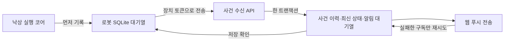

# 낙상 기록·웹 푸시 연결

작성일: 2026-09-18. [전체 명세](fall_detection.md)의 저장·알림 부분이다.
이번 구현은 사건 **메타데이터**를 저장한다. 원본 영상·음성·대화문·VLM 설명은 저장하거나 푸시로 보내지 않는다.

## 처리 순서



- 코어에 `journal=SqliteFallJournal(...)`을 전달하면 사건 이벤트를 디스크에 기록한 뒤 외부로 내보낸다.
  기록 실패 시 감지를 중단하고 오류를 반환한다. 실패를 숨긴 채 이벤트를 버리지 않는다.
  `journal=None`은 메모리 테스트용이며 운영 연결에서 사용하지 않는다.
- 전송 워커는 추론·ROS 이벤트 루프 밖에서 실행한다. 인터넷이 끊겨도 SQLite에 기록이 남는다.
- 양쪽 대기열 모두 긴급 → 확인 필요 → 일반 알림 → 일반 기록 순으로 처리한다.
  서버는 역순으로 도착해도 오래된 상태가 최신 상태를 덮어쓰지 않게 한다.
- 서버가 저장했다고 확인한 이벤트만 로컬 전송 대기에서 뺀다. 저장 확인은 푸시 수신 확인과 다르다.
  로컬 이력 자체는 삭제하지 않는다.
- 서버는 수신 직후 전송을 시도한다. 실패·미설정·구독 없음은 대기 상태로 남기며,
  기존 인증된 maintenance 작업도 낙상 알림을 재시도한다.
- 같은 이벤트 ID의 같은 내용은 중복 저장하지 않는다. 같은 ID의 다른 내용은 `409`다.
  같은 사건·같은 등급의 알림도 한 번만 생성하며, 높은 등급이 생기면 대기 중인 낮은 등급을 취소한다.
- 구독별 수락 결과를 저장한다. 일부만 실패하면 이미 수락한 구독으로 다시 보내지 않는다.
  전송 직후 응답이나 DB 기록이 유실되는 경우까지 외부 서비스의 정확히 한 번 전송을 보장하지는 못한다.
  브라우저의 사건·등급별 태그로 중복 표시를 줄인다.
- 작업 소유권은 120초 동안 유지하고 전송 묶음마다 갱신한다. 만료·회수된 작업은 결과를 덮어쓰지 못한다.
  실패 재시도 간격은 최대 5분까지 늘어난다. 이는 Cloud VLM 확인 주기와 별개다.

## 사건 수신 API

`POST /api/device/v1/fall-events`

- `Authorization: Bearer <장치 토큰>`
- `X-Malbut-Device-Id: <로컬 기록의 장치 ID>` — 토큰의 장치와 일치해야 한다.
- `Content-Type: application/json`
- 본문 최대 8 KiB, 장치당 분당 최대 120건. `deviceId`·수신자 주소·영상 등 임의 필드는 본문에서 받지 않는다.

| 필드 | 형식 | 의미 |
|---|---|---|
| `schemaVersion` | `1` | 계약 버전 |
| `eventId` | UUID v4 | 재전송해도 유지하는 이벤트 ID |
| `incidentId` | UUID v4 | 같은 사건의 ID |
| `bootId` | 문자열, 최대 128자 | 사건을 시작한 장치 부팅 구분 |
| `sequence` | 양의 정수 | 로컬 저널 기록 순번. 시계가 바뀌어도 순서 판단에 사용 |
| `evidenceRevision` | 양의 정수 | 새로운 관측을 추가한 버전 |
| `occurredAt` | UTC ISO 8601, 밀리초 | 이벤트를 기록한 시각. 실제 낙상 시작 시각과 다름 |
| `eventKind` | 허용된 사건 이벤트 이름 | 질문 요청·분석 완료·알림 요청 등 |
| `state` | `verifying / recheck_required / help_required / resolved` | 처리 상태 |
| `fallSeen` | boolean | 넘어지는 장면을 관측한 기록. 나중에 정상처럼 보여도 유지 |
| `assessment` | 영상 판정 또는 null | `observed_fall / suspected_fall / normal_activity / unobservable` |
| `answer` | Agent 답변 또는 null | `help_request / okay / unclear / no_response / failed` |
| `reason` | 사유 코드 또는 null | 자유 형식 문장이 아닌 코드 |
| `notificationLevel` | `info / check / urgent / null` | `notification_requested`에만 지정 |

서버는 장치 토큰으로 저장 대상을 정한다. 클라이언트가 다른 장치 ID로 바꿔 기록할 수 없다.
같은 사건 ID를 다른 `bootId`로 재사용하거나 같은 순번에 다른 이벤트를 쓰면 거부한다.

응답:

- `201`: 새 기록 저장. `{stored: true, created: true, eventId, push}`
- `200`: 같은 내용 재전송. `{stored: true, created: false, eventId, push}`
- `400`: 잘못된 본문, `401`: 인증 실패, `403`: 장치 불일치.
- `409`: ID·순번·부팅·상태 충돌. 임의로 새 ID를 만들어 우회하지 않는다.
- `429`: 호출 상한. `Retry-After: 60`.
- `503`: 저장 불가 또는 마이그레이션 미적용. 로컬 기록을 유지하고 재시도한다.

`push.accepted=true`는 푸시 서비스가 수락했고 전송 작업을 완료했다는 뜻이다.
사용자가 읽었거나 도움을 받았다는 뜻은 아니다. `stored=true, push.accepted=false`도 정상적인 저장 응답이다.

## 웹 조회

`GET /api/devices/{deviceId}/fall-incidents`

로그인한 해당 장치 멤버만 최근 사건 50개를 볼 수 있다. 권한 없는 장치는 `404`로 응답한다.
조회 API까지 구현했으며 사건 목록·상세 UI와 읽음/대응 완료 버튼은 아직 연결하지 않았다.

## 로봇 전송 워커

등록된 명령: `malbut-fall-upload`.
소스에서 실행할 때는 `python3 -m malbut_agent_server.fall_upload_worker`를 사용한다.

```bash
malbut-fall-upload --journal /var/lib/malbut-falls/events.sqlite --device-id DEVICE_ID --base-url https://malbut.hyenje29.click --allow-host malbut.hyenje29.click
```

위 명령은 **설정 확인만** 한다. 파일 생성·토큰 읽기·HTTP 전송을 하지 않는다.
실제 워커 실행은 같은 명령에 `--execute --token-file /etc/malbut-homecam.token`을 추가한다.
`--once`를 함께 주면 전송 대기 한 건만 처리한다. 토큰은 명령행 값으로 받지 않는다.

- 로컬 저널 디렉터리 `0700`, 파일 `0600`. 토큰 파일은 `0600` 또는 `0640`만 허용한다.
- HTTPS 허용 호스트만 사용한다. 리디렉션을 따라가지 않고 환경 프록시 설정도 사용하지 않는다.
- `400/401/403/409/413`은 자동 반복하지 않고 `blocked`로 남긴다.
  토큰을 고친 뒤 명시적으로 `--retry-auth-failed`를 주면 `401/403` 기록만 다시 대기시킨다.
  계약·ID 충돌은 별도 확인이 필요하다.
- 재부팅해도 전송 대기·차단 사유·미해결 이력을 읽을 수 있다.
  과거 질문을 재생하거나 옛 사람 ID를 새 부팅의 사람과 자동으로 연결하지 않는다.
  `unresolved()` 결과로 후속 확인을 시작하는 정책은 아직 미연결이다.
- 보관 기간·용량 제한·완료 이력 정리는 아직 정하지 않았다. 실제 상시 운영 전에 확정해야 한다.

## 배포와 남은 연결

1. `0008_fall_incidents.sql` 적용: 사건·이력·알림 대기열 세 테이블.
2. 낙상 형식을 받는 Push Broker, 웹 서버 반영.
3. 실제 카메라/YOLO·Cloud 어댑터·Agent 계약을 연결한 런타임에서 저널 사용.
4. 보호된 장치 토큰으로 전송 워커 실행 후 실수신 검증.

이번에는 위 배포·실발송을 수행하지 않았다. DB 검증은 PGlite, Cloud·음성·푸시는 시험용 구현을 사용했다.
장치 → 웹 사이 필드 호환은 Python 코어의 실제 출력으로 API·DB·푸시 요청까지 통합 테스트했다.
Agent의 질문·재생 완료·답변 담당부와 실제 입력 구간 합의는 남았다.
2026-09-19에 Cloud HTTP·ROS 실행 연결을 추가했으며, 범위와 제한은
[실행 연결 명세](fall_runtime.md)를 따른다. 실제 서비스로 배포·연결했다는 뜻은 아니다.
