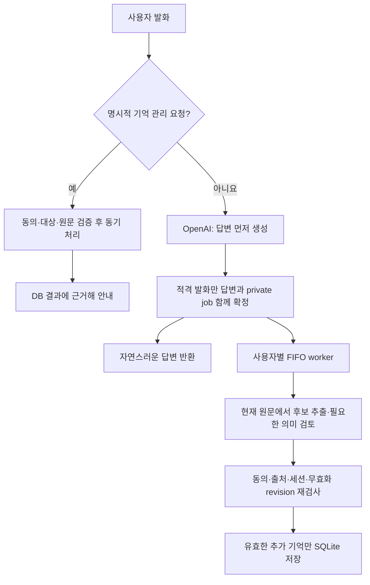

# SWM25-171 장기기억 개선과 기억 관리 UX

## 목표와 범위

기존 SQLite 개인 기억·동의·사용자 격리 구조를 재사용하여 의미 기반 후보 검토,
응답과 분리된 자동 저장, 후속 대화 중 저장 지속, 자연스러운 기억 안내를 반영한다.
최신 `main` 기준선은 `e701c5a7152b1fe58fd6f9421b146c645687808e`다.
로컬의 미병합 기억 개선분 전체를 별도 PR 작업 트리에 모았으며, 원본 WIP는
수정하지 않았다. 공개 예제는 가상 이름을 사용한다.

이 PR은 이동 Tool·Manager 연결, Gazebo 시나리오, ROS interface 변경을 포함하지
않는다. 실행 로그, 테스트 XML, 실제 대화·DB, 키·환경 파일, 빌드 산출물을
추가하지 않으며 기존 로그 삭제 변경도 포함하지 않는다.

## 반영한 내용



- 단어 유무만으로 확인하기 어려운 자기소개 등은 별도 의미 검토를 사용할 수
  있다. 모델 결과는 후보이며 저장 권한이 아니다. Mem0 공개 예제의 설계를
  참고했지만 SDK·Platform이나 공개 코드를 가져온 통합은 아니다.
- OpenAI 자동 경로는 C 방식이다. 첫 답변에는 기억 제안을 요구하지 않고,
  원문만 보는 별도 추출과 필요한 검토·저장을 worker에서 처리한다. RAI는
  기존 통합 후보 생성 후 비동기 검토를, Mock은 기존 동기 경로를 유지한다.
- 일반 후속 입력 때문에 진행 중인 자동 작업을 취소하지 않는다. 명시적인
  기억 관리 요청은 예약 단계에서 이전 작업을 무효화하므로 정정·삭제 이후
  과거 발화가 뒤늦게 저장되는 일을 차단한다.
- 늦게 저장된 기억의 출처와 관련 후속 턴 의존 관계를 연결한다. 이후 삭제·
  정정 시 관련 원문·답변을 새 모델 문맥에서 제외한다.
- 자동 저장은 완료 안내 없이 처리한다. 일반 대화는 기억 키워드가 있다는
  이유만으로 내부 오류 문구로 바꾸지 않는다. 명시적 관리 요청이 불명확하면
  자연스럽게 질문하며, 확인되지 않은 저장 완료·약속은 여전히 걸러낸다.
- 내부 진단은 내용 없는 INFO 사유 코드다. worker 종료·join 뒤 SQLite를 닫고,
  모델 호출 동안 대화 잠금이나 DB 트랜잭션을 유지하지 않는다.

상세 계약·비용·큐 수명은 [SEMANTIC_MEMORY](../SEMANTIC_MEMORY.md)를 따른다.

## 검증 결과 — 2026-09-11

이동 WIP를 제외한 PR 작업 트리에서 별도로 실행했다. 이전 전체 WIP 시험의
통과 수나 과거 유료 모델 측정 결과와 합산하지 않는다.

| 검사 | 결과 |
| --- | --- |
| Agent 전체 offline pytest | 1,143 passed, 14 skipped, 69.92초 |
| 변경 Python 파일 flake8, 최대 줄 길이 99 | 통과 |
| 변경 Python 파일 구문 컴파일 | 통과 |
| 외부 디렉터리 Python build | 통과 |
| 패키지 문서·resource 설치 검사 | 통과 |
| `git diff --check` | 통과 |

14개 skip은 이 pytest 프로세스에 ROS Python 환경이 설정되지 않은 2개 모듈과
`pydantic`이 없는 RAI 시험 12개다. 시스템에 ROS가 없다는 뜻이 아니다.
모델 출력·장애는 고정 fixture로 시험했고 새 유료 API 호출은 하지 않았다.
테스트 실행은 동의·저장·조회·정정·삭제·사용자 분리, 다음 턴과 FIFO,
중복 claim·무효화·TTL·DB 오류·종료 및 기존 대화/HTTP 경로를 포함한다.

재현은 패키지 루트에서 새 외부 임시 경로를 지정하여 실행한다.

```bash
PYTHONDONTWRITEBYTECODE=1 python3 -B -m pytest -q -rs -p no:cacheprovider test \
  --basetemp=<new-private-temp>/pytest \
  --junitxml=<new-private-temp>/result.xml
```

## 한계와 결론

장기기억의 의미 검토·비동기 저장·후속 턴 처리·관리 안내 개선을 함께 반영했다.
동의·삭제·사용자 격리·로봇 실행 권한 경계는 유지한다. 다만 자동 저장은 best
effort다. TTL·오류·충돌·무효화로 저장되지 않을 수 있고, 재시작 후 `running`
job은 자동 재전송하지 않는다. `queued` job만 유효성을 재검사하여 재개한다.

이 결과는 실제 모델의 한국어 정확도·사용자 체감 지연, Gazebo 이동, 마이크·
스피커, 온디바이스 모델이나 8GB 메모리 인수를 입증하지 않는다. 저장은 로컬
SQLite지만 운영 OpenAI 구성의 추출·검토는 외부 모델을 사용할 수 있다.
논리적 삭제가 저장 매체·WAL·백업의 물리적 소거를 보장하지도 않는다.

GitHub CI는 PR의 해당 commit에 표시되는 check 결과로 별도 확인한다.
