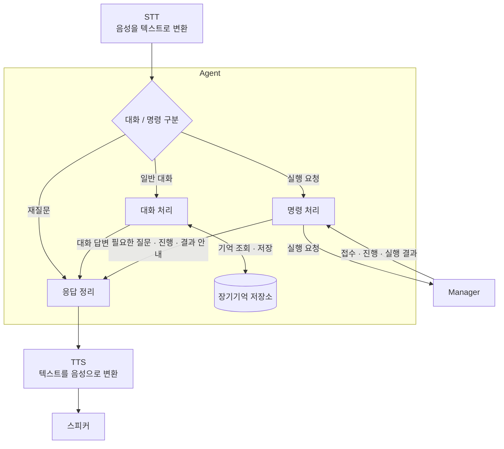
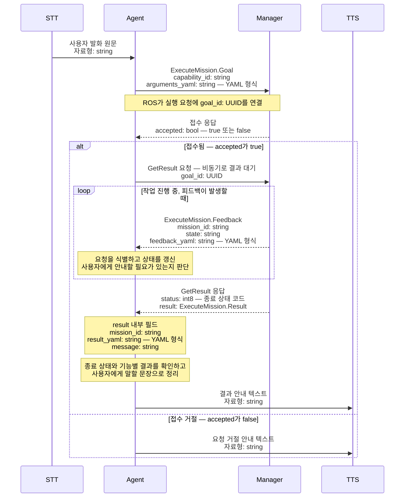

# Malbut Agent 명세

## 1. 기능

상위 계층으로 부터 받은 텍스트를 해석하여 자유대화를 하거나 Manager에 기능을 요청하고 결과를 받는다.

### 대화/명령 판별기

- 받은 텍스트가 대화인지 명령인지를 구분한다.
- 받은 텍스트의 의도가 불명확하다면 재질문을 응답 정리 프로그램으로 보낸다.
- 만약 대화라면 텍스트 내용을 자유대화 프로그램으로 명령이라면 명령 구분 프로그램으로 보낸다.

### 명령 구분

- 받은 텍스트를 기반으로 이 명령이 어떤 tool을 필요로 하는지를 판단한다.
- 판단을 기반으로 필요한 tool과 tool에 들어갈 내용을 작성하여 Manager에 요청을 보낸다.
- tool 요청을 보낸 후 Manager로 부터 받은 결과를 응답정리 프로그램으로 보낸다.

### 대화 처리

- 사용자 발화와 대화 문맥, 관련 장기기억 바탕으로 답변을 생성한다.
- 생성한 답변을 응답 정리로 전달한다.

### 장기기억 저장소

- 이름, 호칭, 반려동물 정보, 취향 등 다음 대화에 필요한 사용자 정보를 장기적으로 저장하고 관리한다.
- 현재 대화와 관련된 기억을 조회하여 대화 처리에 제공한다.
- 사용자의 요청이 있을시 관련된 기억을 변경 또는 삭제한다.
- 사용자별로 기억을 구분하여 관리한다.

### 응답정리

- 자유대화로 부터 받은 텍스트 내용을 정리하여 TTS에 전송한다.
- 대화/ 명령 구분 프로그램에서 재질문 요청이 들어올 시 정해진 형식에 맞는 재질문 텍스트를 TTS에 전송한다.
- 명령 구분 프로그램에서 결과가 들어오면 이 결과를 정리하여 TTS에 전송한다.

## 2. 입력

### 대화/명령 판별기

- STT가 최종 인식한 사용자 발화 텍스트를 원문 그대로 전달 받는다.
- ROS 2 Topic을 사용하며, 전달 내용은 문자열이다.

### 명령 처리

- Manager 노드로부터 실행 요청의 접수 여부, 진행 정보, 최종 결과를 전달받는다.
- `/malbut/mission/execute` ROS 2 Action을 통해 수신한다.

- 접수 응답
  - `accepted: bool` — 요청이 접수됐는지 나타낸다.

- 진행 정보 (`ExecuteMission.Feedback`)
  - `mission_id: string` — 진행 정보를 보낸 요청의 식별자.
  - `state: string` — 해당 미션의 현재 상태.
  - `feedback_yaml: string` — YAML 형식의 기능별 진행 정보.

- 최종 결과
  - `status: int8` — 성공·실패·취소 등 ROS의 종료 상태.
  - `result: ExecuteMission.Result` — 상세 결과.
  - `result`에는 요청 식별자(`mission_id`), YAML 형식의 실행 결과 (`result_yaml`), 설명 또는 사유(`message`)가 문자열로 포함된다.

## 3. 출력

### 명령 처리

- Manager 노드로 실행할 기능과 해당 기능에 필요한 입력값을 전달한다.
- `/malbut/mission/execute` ROS 2 Action의 Goal로 요청한다.

- 실행 요청 (`ExecuteMission.Goal`)
  - `capability_id: string` — 실행할 기능의 고유 이름.
  - `arguments_yaml: string` — YAML 형식으로 작성한 기능의 입력값.

- 요청이 접수되면 해당 Goal을 지정하여 최종 결과를 비동기로 요청한다.

### 응답 정리

- 자유 대화 및 명령 처리에서 보낸 텍스트를 기반으로 사용자에게 말할 텍스트를 TTS에 보낸다.
- ROS 2 Topic을 사용하며, 전달 내용은 문자열이다.

## 4. 동작 규칙

### 대화/명령 판별기

- 사용자 발화와 대화 문맥으로 의도를 판단하고, 불명확하면 실행 요청 없이 재질문한다.
- 예시나 인용에 포함된 명령은 실제 실행 요청으로 취급하지 않는다.

### 명령 처리

- 기능과 입력값이 명확하면 재확인 없이 Manager에 요청하고, 정보가 부족하면 필요한 내용을 재질문한다.
- 지원하지 않는 기능은 요청하지 않고 사용자에게 안내한다.
- Manager의 응답을 해당 요청에 연결한다. 거절·실패는 확인된 사유를 안내하고, 실행 여부가 불명확하면 시작 요청을 임의로 다시 보내지 않는다.

### 대화 처리

- 대화 문맥과 관련 장기기억을 활용하되, 없거나 불확실한 정보를 기억하는 것처럼 답하지 않는다.
- 기억의 조회·정정·삭제 요청은 저장소의 처리 결과를 확인한 뒤 안내한다.

### 장기기억 저장소

- 사용자를 확인하고 개인화 동의가 있는 경우, 직접 말한 사용자 정보를 저장한다. 추측이나 인용은 저장하지 않는다.
- 사용자별로 기억을 구분하고, 동일한 정보는 중복 저장하지 않는다.
- 명확한 정정은 반영하고, 기존 정보와의 충돌이 불명확하면 질문한다.
- 삭제된 기억은 이후 대화에 활용하지 않는다.
- 개인화 중단 시 자동 저장과 활용을 중단한다. 기존 기억 삭제는 별도 요청으로 처리한다.

### 응답 정리

- 답변과 질문을 이해하기 쉬운 문장으로 TTS에 전달한다. 전달을 음성 재생 완료로 판단하지 않는다.
- 확인된 사실만 안내하며, 요청 접수·실행 중·실행 완료를 구분한다.
- 같은 진행 안내는 반복하지 않고, 주요 상태가 바뀌거나 사용자가 물으면 안내한다.