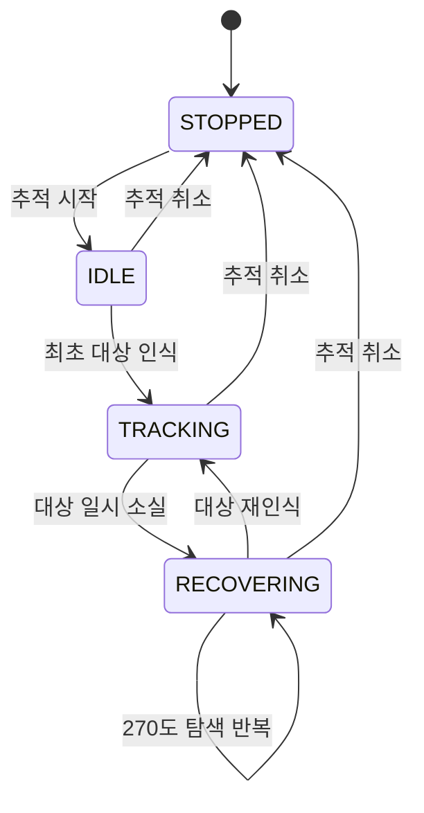

# Malbut Target Tracking

`malbut_tracking` consumes RGB-D person identities and follows one selected
target; it does not perform person recognition itself.
A map-subtracted 2-D LiDAR tracker briefly supports the same person through
camera occlusion. Gazebo entity poses are never read, and the package never
publishes velocity commands directly.

## Benchmark

Simulation evaluation is isolated under `malbut_tracking/benchmark`. Select
one of `test_arena_perimeter`, `test_arena_complex`,
`small_house_front_door`, or `small_house_living_room` with the `scenario`
launch argument. `world_file`, `map_file`, `actor_file`, spawn poses, duration,
and output directory are optional overrides; a different actor SDF can be used
to evaluate another compatible humanoid appearance without changing code.

## Runtime contract

- Input detections: `/perception/person/detections_3d`
- LiDAR foreground clusters: `/perception/lidar/foreground_clusters`
- Cached static SLAM map: `/map` (fixed-route planning)
- Global navigation grid: `/global_costmap/costmap_raw` (goal safety only)
- Follow action: `/follow_person` (`malbut_interfaces/action/FollowPerson`)
- State: `/tracking/person/status`
- Estimated map pose: `/tracking/person/estimated_target_pose`
- RViz LiDAR track labels: `/tracking/person/lidar_tracks`
- Motion: Nav2 `ComputePathToPose`, `FollowPath`, `Spin`, and `SpeedLimit`

`malbut_lidar_preprocessor` receives `/scan`, `/map`, and TF. Humble's C++
`laser_geometry` projects each scan into `map` while compensating for robot
motion during acquisition. The node builds the static-obstacle distance field
once per map, removes saved geometry through cached lookups, and publishes
only compact foreground clusters. The Python follower therefore does not loop
over raw rays or recompute scan TF, and it never searches Nav2's merged master
costmap for dynamic objects.

Map subtraction produces foreground *candidates*, not dynamic-object labels.
Only clusters inside a bounded gate around the camera-confirmed person or its
short prediction enter the planar constant-velocity tracker. Mahalanobis
gating and globally optimal Hungarian assignment preserve that target between
scan updates. New tracks remain tentative until repeated measurements confirm
them, and confirmed tracks coast for a bounded time through short occlusion.
The follower therefore does not misrepresent every scene residual as a moving
object, and LiDAR can never select a person before RGB-D establishes identity.
The global costmap remains an input only for selecting safe Nav2 goals and
paths.

RGB-D is the primary long-range position source, so a visible person remains
followable even outside the LiDAR/costmap observation area. Camera-only motion
continuously derives targets from current sensor observations. The follower
caches the already-built SLAM map and plans a fixed-geometry route from the
robot to the observed person. It scans that route backward from the person and
selects the first cell that is safe in the current global costmap. Nav2 then
plans and controls the actual motion to that live-safe destination. The
measured distance band still decides when to advance or hold. Nav2 owns
both translation and body rotation; there is no downstream camera-yaw mixer.
A newer path directly preempts the
running `FollowPath` goal without an explicit cancel/stop gap.
A failed individual path is discarded so the next camera observation can try a
better goal while the outer follow action remains active. A confirmed LiDAR
match supports only a short camera gap; RGB-D remains authoritative whenever
it is visible. Saved walls and furniture, localization noise beside static
geometry, and wall-sized components are excluded before association. The
Action exposes only target selection and desired distance. Minimum safety
distance, maximum speed, and recovery timeouts remain deployment policy in
`config/person_following.yaml`.

## Run on a robot

Start the robot's camera driver, localization, and Nav2 first. Then run the
sensor and tracking packages with the robot's topic names if they differ from
the defaults:

```bash
ros2 launch malbut_perception person_detection.launch.py \
  rgb_topic:=/camera/color/image_raw \
  depth_topic:=/camera/depth/image_raw \
  camera_info_topic:=/camera/color/camera_info
ros2 launch malbut_tracking person_following.launch.py
```

Neither launch uses Gazebo time by default. The camera driver must publish
aligned depth and CameraInfo with a valid optical TF, while the robot's Nav2
stack must publish `/scan`, `/map`, TF, and
`/global_costmap/costmap_raw`.

## Start automatic person following

```bash
ros2 action send_goal \
  /follow_person malbut_interfaces/action/FollowPerson \
  "{target_mode: 0, target_person_id: '', desired_distance_m: 1.0}" \
  --feedback
```

Cancel the command with `Ctrl-C`, or use an action client to cancel its goal.
`target_mode: 0` selects the first visible, spatially continuous person. Mode
`1` follows only `target_person_id`; that stable family identity must be
provided by the upstream perception/identity component.
Before the first person is acquired, the action remains active and the robot
waits stationary. Loss recovery starts only after an RGB-D target has actually
been acquired. A confirmed LiDAR obstacle that was labeled by RGB-D continues
the same target for a bounded three-second camera gap; LiDAR never selects a
new person by itself. While camera observations are current, LiDAR only
provides fast near-range ALIGN/RETREAT decisions from distance and radial
velocity. RGB-D continues to own identity, visible map position, and forward
tracking. If both sensors lose the target, the
follower finishes the frozen waypoint (or accepts it within the recovery-only
0.08 m tolerance), turns directly toward the final green sensor target, and
then requests one complete Nav2 path to that last safe position. It
finally performs collision-checked 270-degree `Spin` searches in the direction
of the person's last camera bearing until the target returns or the Action is
explicitly canceled. A current camera observation immediately updates the
green target even if its detector ID changed; LiDAR is used to refine its
range and continue it through temporary camera loss.
The robot advances when the person is beyond the configured distance band and
holds inside it. When the person approaches too closely, the same Nav2 planner
computes the reverse path. Each accepted camera or LiDAR observation may
request a fresh route; while one `ComputePathToPose` request is in flight, only
the newest observation is retained and planned immediately afterward. The
normal holonomic `FollowPath` controller follows all planner-produced positions
and orientations, including forward, lateral, reverse, and turning motion,
without an independent command overriding its angular velocity.
Navigation failures are retried with fresh sensor goals instead of invoking
Nav2's generic fixed-direction recovery sequence. Every recovery step remains
preemptible: a new RGB-D observation immediately resumes normal tracking. The
follow Action remains active until explicitly canceled, and a later RGB-D
observation immediately resumes `TRACKING` without a new Action goal.

Benchmark E2E latency uses Linux `CLOCK_MONOTONIC` on the robot computer. It is
measured from entry into the camera or LiDAR processing callback, through
perception and `ComputePathToPose`, to local submission of `FollowPath`.
Camera and LiDAR statistics are reported separately; Nav2 goal acceptance and
physical robot motion are intentionally outside this latency interval.

## Public state



`STOPPED`는 Action이 없는 상태, `IDLE`은 최초 대상 대기,
`TRACKING`은 정상 추종, `RECOVERING`은 마지막 관측 기반 복구다.
대상을 다시 찾지 못해도 Action을 자동 종료하지 않으며, 명시적으로
취소할 때까지 `RECOVERING`에서 마지막 관측 방향의 탐색을 반복한다.
`RECOVERING` keeps the existing ordered behavior internally as
`FINISHING_WAYPOINT`, `TURNING_TO_TARGET`, `REACHING_LAST_POSITION`, and
`SCANNING`. The internal phase is included in the diagnostic status topic but
is not exposed as a separate Action state.

## Algorithm basis

- Nav2 Humble `ObstacleLayer`: range observations are transformed into the
  costmap frame internally; the merged master grid contains costs, not the
  original measurements, identities, or velocities.
- Static distance transform: the invariant map is preprocessed once so each
  LiDAR endpoint needs only a cached lookup.
- Bewley et al. SORT / Wojke et al. DeepSORT: constant-velocity Kalman tracks,
  tentative/confirmed lifecycle, Mahalanobis gating, and Hungarian assignment.
- Rexin et al., *Fusion of Object Tracking and Dynamic Occupancy Grid Map*:
  associate object tracks with a grid representation instead of treating grid
  cells themselves as persistent identities.
