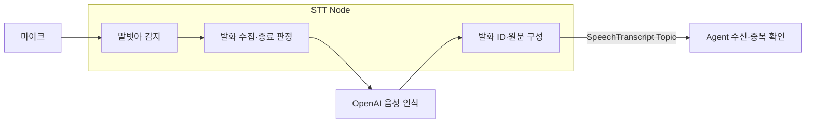

# Malbut STT → Agent

“말벗아”를 감지한 뒤 한 번의 발화를 녹음하고, OpenAI가 돌려준 최종 원문을
ROS Topic으로 보냅니다. Agent 수신기는 발화 ID를 기록하고 중복 접수를 막습니다.
이번 연결의 완료 지점은 **Agent 수신 확인**입니다. 대화 답변·Manager 실행·TTS는
이 수신 경로에서 호출하지 않습니다.



## 통신과 동작

- Topic: `/malbut/speech/transcript`
- 타입: `malbut_interfaces/msg/SpeechTranscript`
- 필드 원본: [SpeechTranscript.msg](../malbut_interfaces/msg/SpeechTranscript.msg)
- 사용 명세: [STT 명세](docs/stt_agent.md)
- 양쪽 QoS: `RELIABLE`, `VOLATILE`, `KEEP_LAST`, depth `10`.

STT는 최종 발화마다 UUID를 새로 생성합니다. 같은 문장을 다시 말해도 새 ID를
사용하며, 최종 원문에 요약·명령 변환·공백 정규화를 적용하지 않습니다.
중간 인식 결과·오류 문장·빈 원문은 발행하지 않습니다.

호출어 전에는 마이크를 로컬에서 읽으며 OpenAI에 음성을 보내지 않습니다.
호출어 감지 **이후** 소리부터 수집하므로 “말벗아”를 부른 뒤 문장을 말합니다.
말을 끝내면 한 번의 WAV 요청을 보냅니다. 이때 마이크를 닫고, 성공·실패 후
새로 열어 호출어를 기다립니다. API 처리 중 발화는 나중에 처리할 대기열에 쌓지
않습니다. 원본 녹음은 메모리에서만 다루고 파일에 자동 저장하지 않습니다.

`published:<ID>`는 STT의 발행 기록이며 Agent 수신 확인이 아닙니다. Agent의
`received` 로그와 SQLite 기록으로 실제 접수를 확인합니다. 늦게 시작한 Agent에
과거 발화를 재생하거나, 중단 중 유실된 발화를 자동 복구하는 기능은 없습니다.
이 Topic에는 STT→Agent의 별도 접수 응답이나 애플리케이션 재전송 기능이 없습니다.

## Ubuntu에서 준비

첫 마이크 실행 대상은 **Ubuntu 22.04 / x86_64 / Python 3.10 / ROS 2 Humble**입니다.
Jetson·다른 ARM 장비의 Porcupine 지원과 음성 성능은 별도로 확인해야 합니다.
저장소 루트에서 다음을 실행합니다.

```bash
uname -m
source /opt/ros/humble/setup.bash
python3 -m pip install --user -r malbut_stt/requirements.txt
colcon build --symlink-install --packages-select malbut_interfaces malbut_agent_server malbut_stt
source install/setup.bash
python3 -c 'from pvrecorder import PvRecorder; print(list(enumerate(PvRecorder.get_available_devices())))'
```

OpenAI SDK와 오디오 SDK는 이 패키지의 마이크 실행에만 필요합니다. ROS 빌드와
대역을 사용하는 Python 시험은 키·마이크·이 SDK들이 없어도 수행할 수 있습니다.
WebRTC VAD는 동일한 `webrtcvad` Python API를 제공하는 `webrtcvad-wheels`로 설치합니다.

실행 환경에 다음을 준비합니다. 키를 코드·ROS parameter·명령 인자·Git에 넣지 않습니다.

| 준비물 | 용도 |
|---|---|
| 기존 `OPENAI_API_KEY` 환경변수 | 승인한 기존 OpenAI 키 사용 |
| `PICOVOICE_ACCESS_KEY` 환경변수 | Porcupine 초기화 |
| Linux용 “말벗아” `.ppn` 파일 | 한국어 호출어 감지 |
| 해당 SDK에 맞는 한국어 `.pv` 파일 | 한국어 언어 모델 |
| 사용 가능한 마이크 | 기본 장치 또는 장치 번호로 선택 |

호출어 파일은 [Picovoice Console](https://console.picovoice.ai/)에서 한국어와
대상 플랫폼을 선택해 준비합니다. 한국어 언어 파일은
[Porcupine 공식 안내](https://picovoice.ai/docs/quick-start/porcupine-python/)를 따릅니다.
파일 경로가 존재하더라도 모델 언어·플랫폼·SDK 호환성은 초기화와 실제 감지 시험으로
확인해야 합니다. 사용자 파일과 AccessKey는 이 저장소에 포함하지 않습니다.

## 두 Node 실행

먼저 Agent 수신기를 실행합니다. 아래 예시는 같은 PC의 시험 도메인 `191`을
사용하며, 두 터미널의 도메인을 맞춥니다.

```bash
source /opt/ros/humble/setup.bash
source install/setup.bash
export ROS_DOMAIN_ID=191
export ROS_LOCALHOST_ONLY=1
ros2 run malbut_agent_server speech_receiver \
  --db-path ~/.local/state/malbut/speech-receipts.sqlite3
```

두 번째 터미널에도 ROS 환경과 위 두 키 환경변수가 있어야 합니다. 다음 모델 경로는
준비한 실제 파일로 바꿉니다.

```bash
source /opt/ros/humble/setup.bash
source install/setup.bash
export ROS_DOMAIN_ID=191
export ROS_LOCALHOST_ONLY=1
ros2 run malbut_stt stt --ros-args \
  -p keyword_path:=/absolute/path/to/malbut_ko_linux.ppn \
  -p language_model_path:=/absolute/path/to/porcupine_params_ko.pv \
  -p device_index:=-1
```

`waiting_for_wake`가 나오면 “말벗아”라고 부르고, `listening` 상태에서 문장을
말합니다. `transcribing`은 음성 인식 중, `published:<ID>`는 발행 시도를 마친
상태입니다. Agent에 같은 ID와 원문을 포함한 `status: received`가 나오는지 확인합니다.
종료는 각 터미널에서 `Ctrl+C`로 합니다.

### 시작 시 적용하는 ROS parameter

| 이름 | 기본값 | 의미 |
|---|---|---|
| `keyword_path` | 필수 | 호출어 `.ppn` 경로 |
| `language_model_path` | 필수 | 한국어 `.pv` 경로 |
| `device_index` | `-1` | PvRecorder 기본 입력 장치 |
| `vad_mode` | `2` | WebRTC VAD의 음성 판단 모드, `0`~`3` |
| `start_timeout_s` | `5.0` | 호출 후 발화 시작 대기 시간 |
| `silence_timeout_s` | `1.0` | 말하기 시작 후 이만큼 조용하면 발화 확정 |
| `max_utterance_s` | `20.0` | 발화 시작 후 최대 수집 시간; 초과하면 전체 폐기 |
| `pre_roll_s` | `0.3` | 발화 시작 직전 보존할 소리, 호출어 이후만 포함 |
| `api_timeout_s` | `30.0` | OpenAI SDK 요청 제한 시간, 자동 재시도 없음 |

WebRTC VAD 입력은 20ms PCM16 mono입니다. 마이크와 Porcupine의 샘플률이
다르면 실행을 중단합니다. 모델은 `gpt-transcribe`, 언어 힌트는
`languages: ["ko"]`, 경로는 `/v1/audio/transcriptions`입니다.
API 방식은 [OpenAI 공식 문서](https://developers.openai.com/api/docs/guides/speech-to-text)를
따릅니다. parameter는 시작 시 읽습니다. 값을 바꾸려면 새 `-p` 인자로 재실행합니다.

### 오류와 중복 처리

- `no_speech`: 호출 후 말이 없어 녹음을 버리고 다시 대기합니다.
- `too_long`: 긴 녹음 전체를 버리고 다시 대기합니다. 잘린 문장을 보내지 않습니다.
- `empty_transcript` / `transcription_failed:<오류 종류>`: 발행 없이 다시 대기합니다.
  API 오류의 원문은 키나 요청 내용 노출을 막기 위해 로그에 넣지 않습니다.
- 키·모델 파일이 없거나 장치 초기화·마이크 읽기에 실패하면 원인을 기록하고 종료합니다.
  예: `STT stopped during opening_microphone: RuntimeError`.
- Agent는 같은 ID·같은 원문을 `duplicate`, 같은 ID·다른 원문을 `conflict`로 구분합니다.
  다른 ID·같은 원문은 새 발화입니다. 빈 ID·공백뿐인 원문은 접수하지 않습니다.
- SQLite에는 ID·원문 SHA-256·수신 시각만 저장합니다. 같은 DB로 재시작하면
  중복 방지가 유지됩니다. DB 삭제·교체 시 이 기록도 없어집니다.
- `received`는 DB commit 이후에만 출력합니다. 저장 실패는 접수 완료로 표시하지
  않습니다. commit 직후 종료하면 화면 로그가 누락될 수 있으므로 로그 출력까지
  정확히 한 번 보장한다고 표현하지 않습니다.

## 시험과 검증 범위

패키지 디렉터리에서 순수 Python 시험을 실행합니다.

```bash
cd malbut_stt
PYTHONPATH=. python3 -m pytest -q test
```

ROS 통신 시험은 생성 메시지와 설치된 Agent 실행 파일이 있는 환경에서 실행합니다.
미준비 환경에서는 해당 시험만 skip합니다. 시험은 임시 DB·별도 프로세스를 사용하며
마이크나 실제 API를 사용하지 않습니다. 운영 로봇과 분리된 ROS 도메인에서 실행합니다.

```bash
source install/setup.bash
ROS_DOMAIN_ID=191 ROS_LOCALHOST_ONLY=1 \
  colcon test --packages-select malbut_interfaces malbut_agent_server malbut_stt \
  --event-handlers console_direct+ --return-code-on-test-failure
colcon test-result --verbose
```

`test_audio.py`는 무음·발화 끝·길이 제한·프레임 변환을, `test_pipeline.py`는
호출어 전 무전송·오류 복귀·새 ID·종료 중 늦은 결과 차단을 검사합니다.
`test_transcription.py`는 WAV와 한국어 힌트, 설치된 SDK의 실제 multipart 직렬화를
검사합니다. SDK 시험의 HTTP 응답은 로컬 대역이며 외부 API를 호출하지 않습니다.
`test_ros_transcript_delivery.py`는 실제 DDS와 설치된 Agent 수신기를 사용합니다.

실제 음성 시험에서는 호출어 감지, 한국어 원문 도착, 같은 문장의 새로운 ID,
무음 후 복귀, 네트워크 실패 후 복귀를 확인합니다. 자동 시험 통과와 실제 음성·장치
검증 결과는 별도로 기록합니다.

### 2026-09-08 구현 검증 기록

| 환경·대상 | 결과 |
|---|---|
| macOS / Python 3.12, Agent 전체 시험 | 591 passed |
| macOS / Python 3.12, STT 시험 | 34 passed, 1 skipped: ROS 미설치 |
| Ubuntu 22.04.5 ARM64 / Humble, 세 패키지 빌드 | 모두 성공 |
| 같은 Ubuntu 환경, Agent 전체 시험 | 591 passed |
| 같은 Ubuntu 환경, STT 시험 | 32 passed, 3 skipped: 선택적 VAD·OpenAI SDK 시험 |
| 실제 DDS·설치된 Agent 수신기 | 원문 보존·QoS·중복·충돌·재시작·SIGINT 통과 |
| Ubuntu x86_64 실제 마이크·“말벗아”·외부 OpenAI API | 미검증 |

Ubuntu 시험은 기존 컨테이너 안의 별도 임시 workspace와 domain `191`에서
수행했습니다. 컨테이너에는 마이크 장치가 없습니다. Ubuntu에서 생략한 vendor
시험 3건은 macOS에서 실제 설치 라이브러리와 로컬 HTTP 대역으로 통과했습니다.
확인한 라이브러리는 OpenAI SDK `3.8.0`, `webrtcvad-wheels` `2.0.14`입니다.
실제 OpenAI API 요청·실제 호출어 모델 활성화·음성 수집은 수행하지 않았습니다.
CI 선택 스크립트 시험, 신규 Python 코드 lint, 문서 링크와 변경 공백 검사도 통과했습니다.
