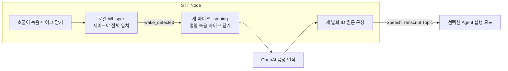

# Malbut STT → Agent

로컬 Whisper로 **“제이크야”**를 확인한 뒤 별도의 명령 발화를 녹음하고,
OpenAI가 돌려준 최종 원문을 ROS Topic으로 보냅니다. 브랜드 이름은 말벗으로
유지합니다. 호출어에는 계정이나 API 키가 필요 없고, 명령 STT에는 기존
`OPENAI_API_KEY`를 사용합니다.



## 통신과 동작

- Topic: `/malbut/speech/transcript`
- 타입: `malbut_interfaces/msg/SpeechTranscript`
- 필드 원본: [SpeechTranscript.msg](../malbut_interfaces/msg/SpeechTranscript.msg)
- 사용 명세: [STT 명세](docs/stt_agent.md)
- 양쪽 QoS: `RELIABLE`, `VOLATILE`, `KEEP_LAST`, depth `10`.

STT는 최종 발화마다 UUID를 새로 생성합니다. 같은 문장을 다시 말해도 새 ID를
사용하며, 최종 원문에 요약·명령 변환·공백 정규화를 적용하지 않습니다.
중간 인식 결과·오류 문장·빈 원문은 발행하지 않습니다.

`waiting_for_wake`에서 “제이크야”만 부르고 쉽니다. 시작 대기 5초·종료 무음
0.4초·최대 발화 6초로 수집한 뒤 마이크를 닫고, Whisper small을 CPU int8,
6 threads로 실행합니다. 공백·구두점을 제외한 전체 전사가 `제이크야`일 때만
통과합니다. “제이크야 오늘 날씨가 어때”처럼 이어 말한 문장은 거부합니다.

`wake_detected` 뒤 새 마이크가 열리고 **`listening`이 표시되면 명령을 말합니다.**
명령 수집 기본값은 시작 대기 5초·종료 무음 1초·최대 발화 20초·시작 직전 소리
0.3초 보존입니다. 수집 후 마이크를 닫고 명령만 한 번의 WAV 요청으로 OpenAI에
보냅니다. 로컬 인식·API 처리 중에는 녹음하지 않으며 대기열도 없습니다.
호출어 음성과 명령 음성은 메모리에서만 다루고 파일에 자동 저장하지 않습니다.

`published:<ID>`는 STT의 발행 기록이며 Agent 수신 확인이 아닙니다. Agent의
`received` 로그와 SQLite 기록으로 실제 접수를 확인합니다. 늦게 시작한 Agent에
과거 발화를 재생하거나, 중단 중 유실된 발화를 자동 복구하는 기능은 없습니다.
이 Topic에는 STT→Agent의 별도 접수 응답이나 애플리케이션 재전송 기능이 없습니다.

## 노트북에서 먼저 시험하기 (ROS 불필요)

STT 노트북 실행기 `smoke`는 로봇과 동일한 `SpeechPipeline`, 발화 종료 감지,
`OpenAITranscriber`를 사용하고 최종 원문을 터미널 JSON으로 출력합니다.
ROS Topic 발행·Agent 수신·로봇 동작은 이 시험에 포함하지 않습니다.
`--wake-only`는 로컬 호출어까지만 확인하며 OpenAI를 호출하지 않습니다.

저장소 루트에서 전용 환경을 준비합니다. `.runtime`은 Git에서 제외됩니다.
macOS에서는 설치된 Python 3.12를 사용하고, 다른 환경에서는 해당 Python 명령으로
바꿉니다. OpenAI STT 시험에는 기존 `OPENAI_API_KEY`가 실행 터미널 환경에 있어야
하며, 아래 로컬 호출어 시험에는 필요하지 않습니다.

```bash
python3.12 -m venv .runtime/stt-laptop
.runtime/stt-laptop/bin/python -m pip install -r malbut_stt/requirements.txt
PYTHONPATH=malbut_stt .runtime/stt-laptop/bin/python -m malbut_stt.smoke --list-devices
```

### 1. Enter로 시작하는 한 문장 시험

호출어 모델 없이 마이크·VAD·STT를 먼저 확인합니다. `--device-index`는 위 목록에서
원하는 마이크 번호로 바꿉니다. 번호는 장치 연결 상태에 따라 달라질 수 있습니다.
생략하면 기본 입력 장치를 사용합니다.

```bash
PYTHONPATH=malbut_stt .runtime/stt-laptop/bin/python -m malbut_stt.smoke \
  --manual --device-index 1 --once
```

Enter를 누르고 `listening`이 표시되면 “오늘 날씨가 어때?”처럼 짧게 말합니다.
1초간 조용해지면 `transcribing`으로 전환되고, `event: transcript`에 원문·새 발화 ID·
`transcription_s`가 표시됩니다. 이 시간은 음성 인식 요청 처리 시간이며, 말하기 시간과
종료 무음 1초는 포함하지 않습니다. `--once`를 빼면 다음 Enter를 기다립니다.
`Ctrl+C`로 종료합니다. API 처리 중 마이크는 닫혀 있습니다.

`--once`는 무음·길이 초과·API 오류도 한 번의 시도로 보고 종료합니다.
5초간 말하지 않으면 `no_speech`로 끝나며 API를 호출하지 않습니다.
API 오류는 `transcription_failed:<오류 종류>`로만 표시하고 원문 오류는 출력하지 않습니다.
macOS 마이크 권한 요청이 뜨면 실행한 앱(Codex 또는 터미널)에 허용합니다.
입력이 안 되면 시스템 설정 → 개인정보 보호 및 보안 → 마이크에서 해당 앱을 확인합니다.

#### 실제 목소리 20문장 순서대로 기록하기

조용한 곳에서 평소 목소리로 [고정 문장 20개](test/fixtures/stt_manual_ko.json)를 읽습니다.
문장을 확인하고 Enter를 누른 뒤 `listening`이 나오면 말합니다. 각 문장마다
Enter를 다시 기다리므로 결과를 확인한 뒤 다음 문장을 시작할 수 있습니다.
아래 마이크 번호는 실행 직전 `--list-devices`로 확인한 번호로 바꿉니다.

```bash
PYTHONPATH=malbut_stt .runtime/stt-laptop/bin/python malbut_stt/tools/manual_stt.py \
  --device-index 1 --output-dir .runtime/stt-manual/my-run
```

`events.jsonl`에 기준 문장, 인식 원문, 발화 ID와 이벤트를 기록합니다.
원본 음성은 저장하지 않습니다. `transcription_s`는 API 처리 시간이고,
`vad_last_speech_to_text_s`는 VAD가 마지막 음성 프레임을 판정한 뒤 결과가 나올
때까지의 시간입니다. 후자는 종료 무음 대기도 포함하는 진단값이며,
사람이 실제로 말을 끝낸 시각을 정밀하게 측정한 값은 아닙니다.

첫 단어와 부정·정지·취소 표현이 보존됐는지 문장별로 확인합니다.
이 시험의 인식 결과는 화면과 로그에만 출력되며 로봇 이동 요청으로 전달되지 않습니다.
중단했다면 `--start-case 7`처럼 다시 읽을 문장 번호를 지정할 수 있습니다.
거리·소음·호출어 연결은 이 기본 발화 시험 이후 별도 조건으로 시험합니다.

### 2. 로컬 호출어와 명령 STT 연결하기

ROS 노드와 `smoke`가 같은 로컬 호출어 인식기를 사용합니다. `faster-whisper 1.2.1`은
위 requirements에 포함되어 있습니다. 최초에 모델을 명시적으로 다운로드하고,
실행할 때에는 `tokenizer.json`을 포함해 다운로드가 완료된 디렉터리를 지정합니다.
실행기는 `local_files_only=True`로 모델을 열어 자동 다운로드하지 않습니다.
모델·키·녹음은 Git에 포함하지 않습니다.
Whisper에는 고유명사 인식을 돕는 “로봇 이름은 제이크입니다.” 힌트를 사용합니다.

```bash
.runtime/stt-laptop/bin/python -c \
  'from faster_whisper.utils import download_model; download_model("small", output_dir=".runtime/stt-laptop/models/whisper-small")'
HF_HUB_OFFLINE=1 PYTHONPATH=malbut_stt .runtime/stt-laptop/bin/python -m malbut_stt.smoke \
  --model-path .runtime/stt-laptop/models/whisper-small --device-index 1 --wake-only --once
```

`--wake-only`에는 계정과 OpenAI 키가 필요 없습니다. Enter 없이 마이크를 열므로
`waiting_for_wake`가 표시된 뒤 “제이크야”만 부릅니다. `recognizing_wake` 동안
마이크를 닫고, 결과에 따라 `wake_detected` 또는 `not_wake`를 표시합니다.
`--once`는 무음(`wake_no_speech`)·길이 초과(`wake_too_long`)·다른 말도 한 번의
호출어 수집 시도로 보고 종료합니다. 빼면 계속 기다리며 `Ctrl+C`로 종료합니다.

호출어를 확인한 뒤 `--wake-only`를 빼고 기존 `OPENAI_API_KEY`가 설정된 터미널에서
명령 STT까지 시험합니다.

```bash
HF_HUB_OFFLINE=1 PYTHONPATH=malbut_stt .runtime/stt-laptop/bin/python -m malbut_stt.smoke \
  --model-path .runtime/stt-laptop/models/whisper-small --device-index 1 --once
```

“제이크야”를 부른 뒤 **`listening`을 기다렸다가** 명령을 말합니다. 이 모드의
`--once`는 호출어가 통과한 뒤 첫 명령 수집·STT 시도에서 종료합니다. 호출어가
거부되거나 무음이면 계속 호출어를 기다립니다. `--once`를 빼면 명령 처리 뒤 다시
호출어를 기다립니다. 발화 단위 ASR 검사이므로 상시 대기 비용·주변 대화 오탐률·
실제 로봇에서의 지연은 별도로 측정해야 합니다.

| 시험 | 확인할 결과 |
|---|---|
| 짧은 한국어 문장 3개 | 첫 단어 누락 없이 원문 출력, 각 요청 시간 기록 |
| 같은 문장 2회 | 원문이 같아도 발화 ID는 서로 다름 |
| `listening` 후 5초간 무음 | `no_speech`, API 전송 없음 |
| 명령을 20초 넘게 계속 말하기 | `too_long`, 잘린 문장을 전송하지 않음 |
| 호출어와 명령을 한 번에 이어 말하기 | 전체 전사가 `제이크야`와 달라 `not_wake`, API 전송 없음 |

준비된 파일만 확인하려면 `malbut_stt.local_wake --model-path <모델 디렉터리>
--wav /absolute/path/to/wake.wav`를 사용할 수 있습니다. 이 보조 실행기의 파일 모드는
VAD 수집 없이 파일 전체를 인식하며, 마이크·명령 STT 연결 시험과 구분합니다.

### 3. 동일한 합성 음성으로 로컬과 OpenAI 비교하기

고정된 한국어 20개(호출어 3·유사 발음 5·로봇 요청 6·일상 5·무음 1)를
macOS `say`의 Yuna 목소리로 생성합니다. 두 엔진에 같은 PCM16 mono 16kHz 음성을
넣으며, 앞 0.3초·뒤 0.4초 무음을 공통으로 붙입니다. 이 비교에서는 VAD·마이크·ROS를
거치지 않고 완성된 음성 전체를 인식합니다.

`local_base`(한국어 설정만)와 `openai`(한국어 설정만)가 기본 비교이며,
현재 호출어 실행기의 이름 힌트를 넣은 `local_hint`는 별도로 기록합니다.
실험 도중 설정·문장·생성 음성을 바꾸지 않습니다.

```bash
# 먼저 음성과 기준 문장을 확정합니다. 아래 출력 경로는 새 실험마다 바꿉니다.
PYTHONPATH=malbut_stt .runtime/stt-laptop/bin/python malbut_stt/tools/compare_stt.py \
  prepare --output .runtime/stt-benchmark/my-run

# 내려받은 모델만 사용하며 키가 필요하지 않습니다.
HF_HUB_OFFLINE=1 PYTHONPATH=malbut_stt .runtime/stt-laptop/bin/python \
  malbut_stt/tools/compare_stt.py local --output .runtime/stt-benchmark/my-run \
  --model-path .runtime/stt-laptop/models/whisper-small

# 기존 OPENAI_API_KEY로 실제 API를 호출합니다: 파일당 1회, 총 20회, 자동 재시도 없음.
PYTHONPATH=malbut_stt .runtime/stt-laptop/bin/python malbut_stt/tools/compare_stt.py \
  openai --output .runtime/stt-benchmark/my-run

# 기존 결과만 읽어 집계합니다. API를 호출하지 않습니다.
.runtime/stt-laptop/bin/python malbut_stt/tools/summarize_stt_comparison.py \
  .runtime/stt-benchmark/my-run
```

출력 폴더에는 WAV, 입력 SHA-256·설정, 시도 기록, 원문·지연을 보존합니다.
이미 시도한 파일·엔진 조합은 재실행해도 다시 호출하지 않으며, 실패하거나 중단된
시도도 자동 반복하지 않습니다. 새 측정은 새 출력 폴더로 명시적으로 시작합니다.
로컬은 모델을 한 번 준비하고 무음으로 예열한 뒤 측정하며, API 시간에는 네트워크가
포함됩니다. 모델 로딩·음성 생성·사용자의 말하기 시간은 처리 시간에 포함하지 않습니다.

[2026-09-12 실제 비교 결과](docs/stt_comparison_2026-09-12.md)에 전체 전사와 집계를
기록했습니다. 숫자 표기 차이(`십오`/`15`)는 정규화하지 않아 글자 오류율에 포함됩니다.
합성 한 화자의 단회 시험은 실제 사용자 정확도·시간당 호출어 오탐률·로봇 성능을
입증하지 않습니다. 이름 힌트를 준 로컬 모델에서 무음 전사도 발생했으므로, 호출어
판정과 무음 환각을 별도로 확인합니다.

### 2026-09-11 노트북 준비 검증 (교체 전 기록)

아래는 SWM25-172의 ROS 호출어 교체 **이전** 기록입니다. 당시 환경은 macOS ARM64 /
Python 3.12, Porcupine `4.0.3`, PvRecorder `1.2.7`, WebRTC VAD wheels `2.0.14`,
OpenAI SDK `3.13.0`이며, 현재 구현의 회귀 시험 결과와 구분합니다.

| 대상 | 결과 |
|---|---|
| STT 자동 시험 (로컬·Porcupine 호출어 단독 모드 포함) | 89 passed, 1 skipped: ROS 미설치 |
| MacBook Pro 내장 마이크 | 실제 16kHz 입력 3.01초 수집·장치 해제 성공 |
| 합성 한국어 WAV → 실제 OpenAI API | “오늘 날씨가 어때?” 원문 일치, 1.211초 음성의 요청 처리 3.575초 |
| 합성 음성 → 실제 VAD → 로컬 Whisper small | 호출어 1개 감지, 다른 발화 7개 거부, 무음 1개 ASR 생략. 처리 0.643~0.728초 (말하기·종료 무음 시간 제외) |
| 사용자 실제 “제이크야” 감지 | 로컬 모델·실행기 준비 완료, 사람의 목소리 감지는 미검증 |
| Porcupine 호출어 감지 | 한국어 언어 모델 준비 완료, 키·Mac용 호출어 모델 준비 전, 미검증 |

마이크 입력 확인과 합성 음성 API 확인은 별개 시험입니다. 두 결과를 실제 사용자
발화의 전체 경로 성공이나 로봇에서의 성능으로 해석하지 않습니다.
로컬 시험은 `faster-whisper 1.2.1`, CPU int8, 6 threads로 수행했고 두 API 키를 제거한
`HF_HUB_OFFLINE=1` 환경에서 내려받은 모델만 사용했습니다. 같은 합성 음성으로 설정을
조정한 개발 중 점검이므로 독립 평가 데이터의 정확도나 실제 환경 오탐률은 아닙니다.
이름 힌트 없이 VAD 결과를 읽었을 때에는 “제이크야”가 “스테이크야”로 오인식되었습니다.

실제 목소리 20문장 시험은 첫 시도가 `empty_transcript`로 끝나 **완료 0/20**입니다.
사용자 음성의 전체 경로 성공, 실제 호출어 감지와 로봇 검증은 아직 확인하지 못했습니다.

### 2026-09-12 로컬 호출어 교체 검증

| 대상 | 결과 |
|---|---|
| macOS / Python 3.12, STT 자동 시험 | 118 passed, 1 skipped: ROS 미설치 |
| 합성 호출어 → 실제 VAD·로컬 Whisper → 별도 명령 녹음 → 실제 OpenAI | “제이크야” 감지 후 “오늘 날씨가 어때?” 원문과 UUID 1개를 로컬 콜백으로 전달, API 요청 1회 |

연결 시험은 파일을 마이크 대역으로 입력했고 두 녹음의 종료를 확인했습니다.
결과는 `.runtime/swm25-172-validation/connected-result.json`에 보존했습니다.
실제 마이크·ROS·Agent 수신을 사용한 시험은 아니며, 기록된 총 실행 시간에는
모델 로딩과 가상 녹음도 포함되어 사용자 체감 지연으로 해석하지 않습니다.

## Ubuntu에서 준비

ROS 노드 실행의 기준 환경은 **Ubuntu 22.04 / x86_64 / Python 3.10 / ROS 2 Humble**입니다.
실제 로봇의 CPU는 아직 확인하지 않았습니다. 대상 장비의 아키텍처·패키지 설치 가능 여부와
CPU Whisper 지연·마이크 입력은 포팅할 장비에서 따로 확인해야 합니다.
저장소 루트에서 다음을 실행합니다.

```bash
uname -m
source /opt/ros/humble/setup.bash
python3 -m pip install --user -r malbut_stt/requirements.txt
python3 -c 'from faster_whisper.utils import download_model; download_model("small", output_dir=".runtime/stt-robot/models/whisper-small")'
colcon build --symlink-install --packages-select malbut_interfaces malbut_agent_server malbut_stt
source install/setup.bash
python3 -c 'from pvrecorder import PvRecorder; print(list(enumerate(PvRecorder.get_available_devices())))'
```

Whisper·OpenAI·오디오 SDK는 이 패키지의 실제 음성 실행에 필요합니다. ROS 빌드와
대역을 사용하는 Python 시험은 키·마이크·이 SDK들이 없어도 수행할 수 있습니다.
WebRTC VAD는 동일한 `webrtcvad` Python API를 제공하는 `webrtcvad-wheels`로 설치합니다.

실행 환경에 다음을 준비합니다. 키를 코드·ROS parameter·명령 인자·Git에 넣지 않습니다.

| 준비물 | 용도 |
|---|---|
| 기존 `OPENAI_API_KEY` 환경변수 | 승인한 기존 OpenAI 키 사용 |
| `tokenizer.json`을 포함한 Whisper small 디렉터리 | 계정 없는 로컬 “제이크야” 판정 |
| 사용 가능한 마이크 | 기본 장치 또는 장치 번호로 선택 |

모델 디렉터리가 존재해도 필요한 파일이 불완전하면 초기화에 실패합니다.
실행 중 다운로드하지 않으므로 최초 다운로드를 완료한 뒤 절대 경로를 지정합니다.

## 두 Node 실행

먼저 Agent 실행 모드를 선택합니다. `speech_receiver`는 **수신 확인만** 하며
LLM·Manager·TTS를 호출하지 않습니다. 아래 예시는 같은 PC의 시험 도메인 `191`을
사용하며 두 터미널의 도메인을 맞춥니다.

```bash
source /opt/ros/humble/setup.bash
source install/setup.bash
export ROS_DOMAIN_ID=191
export ROS_LOCALHOST_ONLY=1
ros2 run malbut_agent_server speech_receiver \
  --db-path ~/.local/state/malbut/speech-receipts.sqlite3
```

대화까지 연결하려면 위 수신기 대신 `agent_communication`을 실행합니다. Provider
환경 설정도 없으면 기본은 `mock`입니다. 실제 OpenAI 대화는 기존 키 환경에서
`--provider openai`로 선택하며, 이는 명령 STT와 별도의 모델 요청입니다.

```bash
ros2 run malbut_agent_server agent_communication --provider mock \
  --db-path ~/.local/state/malbut/speech-receipts.sqlite3 \
  --conversation-db ~/.local/state/malbut/speech-dialogue.sqlite3
```

두 Agent 모드를 동시에 실행하지 않습니다. `agent_communication`은 원문을 기존
대화 처리에 전달하고 `/malbut/speech/response`에 답변 텍스트를 발행합니다.
대화 발화·응답은 별도 대화 DB에 저장하며, `speech_receiver`의 ID·해시 수신 기록과
다릅니다. `.env`는 자동 로드하지 않으므로 필요하면 `--env-file`을 지정합니다.
TTS 수신 확인과 Manager 연결의 자세한 절차는 [Agent 연결 안내](../malbut_agent_server/README.md#stt--agent-대화--manager--tts-연결)를
따릅니다. 답변 텍스트 발행은 스피커 재생이나 로봇 동작 성공을 뜻하지 않습니다.

두 번째 터미널에는 ROS 환경과 `OPENAI_API_KEY`가 있어야 합니다. 다음 모델 경로는
다운로드를 마친 실제 디렉터리의 절대 경로로 바꿉니다.

```bash
source /opt/ros/humble/setup.bash
source install/setup.bash
export ROS_DOMAIN_ID=191
export ROS_LOCALHOST_ONLY=1
ros2 run malbut_stt stt --ros-args \
  -p wake_model_path:=/absolute/path/to/whisper-small \
  -p device_index:=-1
```

`waiting_for_wake`가 나오면 “제이크야”만 부르고, `listening` 상태에서 문장을
말합니다. `transcribing`은 음성 인식 중, `published:<ID>`는 발행 시도를 마친
상태입니다. Agent에 같은 ID와 원문을 포함한 `status: received`가 나오는지 확인합니다.
종료는 각 터미널에서 `Ctrl+C`로 합니다.

### 시작 시 적용하는 ROS parameter

| 이름 | 기본값 | 의미 |
|---|---|---|
| `wake_model_path` | 필수 | 내려받은 Whisper small 모델 디렉터리 |
| `device_index` | `-1` | PvRecorder 기본 입력 장치 |
| `vad_mode` | `2` | WebRTC VAD의 음성 판단 모드, `0`~`3` |
| `start_timeout_s` | `5.0` | `listening` 후 명령 발화 시작 대기 시간 |
| `silence_timeout_s` | `1.0` | 명령 시작 후 이만큼 조용하면 발화 확정 |
| `max_utterance_s` | `20.0` | 명령 발화 시작 후 최대 수집 시간; 초과하면 전체 폐기 |
| `pre_roll_s` | `0.3` | 새 명령 마이크에서 발화 시작 직전 보존할 소리 |
| `api_timeout_s` | `30.0` | OpenAI SDK 요청 제한 시간, 자동 재시도 없음 |

위 수집 parameter는 명령에 적용합니다. 호출어는 시작 대기 5초·종료 무음 0.4초·
최대 발화 6초·시작 직전 소리 0.3초로 고정합니다. WebRTC VAD 입력은 20ms PCM16
mono이며 마이크가 16kHz가 아니면 실행을 중단합니다. 명령 STT 모델은
`gpt-transcribe`, 언어 힌트는
`languages: ["ko"]`, 경로는 `/v1/audio/transcriptions`입니다.
API 방식은 [OpenAI 공식 문서](https://developers.openai.com/api/docs/guides/speech-to-text)를
따릅니다. parameter는 시작 시 읽습니다. 값을 바꾸려면 새 `-p` 인자로 재실행합니다.

### 오류와 중복 처리

- `wake_no_speech` / `wake_too_long`: 호출어 녹음을 버리고 로컬 인식 없이 다시 대기합니다.
- `not_wake`: 전체 전사가 호출어와 달라 명령을 녹음하거나 API를 호출하지 않습니다.
- `no_speech`: 호출 후 말이 없어 녹음을 버리고 다시 대기합니다.
- `too_long`: 긴 녹음 전체를 버리고 다시 대기합니다. 잘린 문장을 보내지 않습니다.
- `empty_transcript` / `transcription_failed:<오류 종류>`: 발행 없이 다시 대기합니다.
  API 오류의 원문은 키나 요청 내용 노출을 막기 위해 로그에 넣지 않습니다.
- 키·모델이 없거나 장치 초기화·마이크 읽기·로컬 호출어 인식에 실패하면 오류 종류를
  기록하고 종료합니다.
  예: `STT stopped during opening_microphone: RuntimeError`.
- Agent는 같은 ID·같은 원문을 `duplicate`, 같은 ID·다른 원문을 `conflict`로 구분합니다.
  다른 ID·같은 원문은 새 발화입니다. 빈 ID·공백뿐인 원문은 접수하지 않습니다.
- 수신 기록 SQLite에는 ID·원문 SHA-256·수신 시각만 저장합니다. 같은 DB로 재시작하면
  중복 방지가 유지됩니다. DB 삭제·교체 시 이 기록도 없어집니다.
- `received`는 DB commit 이후에만 출력합니다. 저장 실패는 접수 완료로 표시하지
  않습니다. commit 직후 종료하면 화면 로그가 누락될 수 있으므로 로그 출력까지
  정확히 한 번 보장한다고 표현하지 않습니다.

## 시험과 검증 범위

패키지 디렉터리에서 순수 Python 시험을 실행합니다.

```bash
cd malbut_stt
PYTHONPATH=. python3 -m pytest -q test
```

ROS 통신 시험은 생성 메시지와 설치된 Agent 실행 파일이 있는 환경에서 실행합니다.
미준비 환경에서는 해당 시험만 skip합니다. 시험은 임시 DB·별도 프로세스를 사용하며
마이크나 실제 API를 사용하지 않습니다. 운영 로봇과 분리된 ROS 도메인에서 실행합니다.

```bash
source install/setup.bash
ROS_DOMAIN_ID=191 ROS_LOCALHOST_ONLY=1 \
  colcon test --packages-select malbut_interfaces malbut_agent_server malbut_stt \
  --event-handlers console_direct+ --return-code-on-test-failure
colcon test-result --verbose
```

`test_audio.py`는 무음·발화 끝·길이 제한·프레임 변환을, `test_pipeline.py`는
호출어 전 무전송·오류 복귀·새 ID·종료 중 늦은 결과 차단을 검사합니다.
`test_transcription.py`는 WAV와 한국어 힌트, 설치된 SDK의 실제 multipart 직렬화를
검사합니다. SDK 시험의 HTTP 응답은 로컬 대역이며 외부 API를 호출하지 않습니다.
`test_ros_transcript_delivery.py`는 실제 DDS와 설치된 Agent 수신기를 사용합니다.

실제 음성 시험에서는 호출어 감지, 한국어 원문 도착, 같은 문장의 새로운 ID,
무음 후 복귀, 네트워크 실패 후 복귀를 확인합니다. 자동 시험 통과와 실제 음성·장치
검증 결과는 별도로 기록합니다.

### 2026-09-08 구현 검증 기록 (교체 전)

아래는 이전 Porcupine 구현 시점의 통신·자동 시험 기록이며, 현재 로컬 호출어 구현이나
실제 로봇의 음성 경로를 검증한 결과가 아닙니다.

| 환경·대상 | 결과 |
|---|---|
| macOS / Python 3.12, Agent 전체 시험 | 591 passed |
| macOS / Python 3.12, STT 시험 | 34 passed, 1 skipped: ROS 미설치 |
| Ubuntu 22.04.5 ARM64 / Humble, 세 패키지 빌드 | 모두 성공 |
| 같은 Ubuntu 환경, Agent 전체 시험 | 591 passed |
| 같은 Ubuntu 환경, STT 시험 | 32 passed, 3 skipped: 선택적 VAD·OpenAI SDK 시험 |
| 실제 DDS·설치된 Agent 수신기 | 원문 보존·QoS·중복·충돌·재시작·SIGINT 통과 |
| Ubuntu x86_64 실제 마이크·“말벗아”·외부 OpenAI API | 미검증 |

Ubuntu 시험은 기존 컨테이너 안의 별도 임시 workspace와 domain `191`에서
수행했습니다. 컨테이너에는 마이크 장치가 없습니다. Ubuntu에서 생략한 vendor
시험 3건은 macOS에서 실제 설치 라이브러리와 로컬 HTTP 대역으로 통과했습니다.
확인한 라이브러리는 OpenAI SDK `3.8.0`, `webrtcvad-wheels` `2.0.14`입니다.
실제 OpenAI API 요청·실제 호출어 모델 활성화·음성 수집은 수행하지 않았습니다.
CI 선택 스크립트 시험, 신규 Python 코드 lint, 문서 링크와 변경 공백 검사도 통과했습니다.
