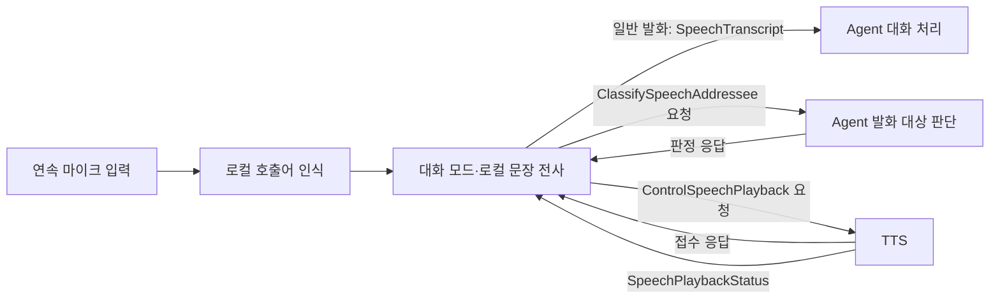

# Malbut STT → Agent

ROS STT 노드는 로컬 Whisper로 **“제이크” 또는 “제이크야”**를 확인한 뒤
대화 모드에서 호출어 없이 다음 발화를 수집합니다. 호출어와 문장 전사는 모두
로컬에서 실행하며 STT 노드에는 `OPENAI_API_KEY`가 필요하지 않습니다.
끼어든 발화의 대상 판단은 별도 Agent가 최근 대화 문맥으로 수행합니다.
Agent를 OpenAI로 실행하면 대상 판단과 답변 생성에는 모델 API를 사용합니다.



## 통신과 동작

| 방향 | 방식 | 이름 | `malbut_interfaces` 타입 |
|---|---|---|---|
| STT → Agent | Topic | `/malbut/speech/transcript` | `msg/SpeechTranscript` |
| STT → Agent 요청·응답 | Service | `/malbut/speech/classify_addressee` | `srv/ClassifySpeechAddressee` |
| STT → TTS 요청·응답 | Service | `/malbut/speech/playback_control` | `srv/ControlSpeechPlayback` |
| TTS → STT | Topic | `/malbut/speech/playback_status` | `msg/SpeechPlaybackStatus` |

- 필드·상수 원본: [ROS 메시지](../malbut_interfaces/msg), [ROS 서비스](../malbut_interfaces/srv)
- 사용 명세: [STT 명세](docs/stt_agent.md)
- Topic QoS: `RELIABLE`, `VOLATILE`, `KEEP_LAST`, depth `10`. Service는 ROS 기본 Service QoS를 사용합니다.

STT는 발화마다 UUID를 새로 생성합니다. 같은 문장을 다시 말해도 새 ID를
사용하며, 전사 결과의 앞뒤 공백을 제거하되 요약이나 명령 변환은 하지 않습니다.
중간 인식 결과·오류 문장·빈 원문은 발행하지 않습니다.

`waiting_for_wake`에서 호출어만 부르고 쉽니다. 종료 무음 0.4초·최대 발화 6초로
수집하며, 공백·구두점을 제외한 전체 전사가 `제이크` 또는 `제이크야`이면
통과합니다. 호출어와 명령을 한 문장으로 이어 말하는 방식은 지원하지 않습니다.
`wake_detected` 뒤에는 호출어 없이 말합니다. ROS 노드는 기본 0.8초 무음에서
후보 전사를 시작하고, 명확한 한국어 종결 표현이면 1초 무음 이후 발화를 확정합니다.
따라서 실제 조기 확정은 1초 무음과 후보 추론 완료 중 늦은 시점입니다.
판단이 불확실하면 기본 2초 무음을 기다리며, 그동안 새 음성이 없으면 같은 전사를 재사용합니다.
후보 추론 중 다시 말하면 같은 발화에 이어 붙이고 이전 후보로 종료하지 않습니다.
마이크는 계속 열어 두고 별도 작업자에서 로컬 추론을 수행합니다. 원본 음성을
파일에 자동 저장하지 않습니다. 기본 모델 실행은 CPU int8입니다. 호출어와 문장의
모델 디렉터리가 같으면 심볼릭 링크 별칭까지 확인하여 모델 하나를 공유합니다.
ROS의 `compute_type` 파라미터로 `float32`를 선택할 수 있습니다.

CPU/CUDA 로컬 Whisper의 연속 대화에서는 말하는 동안에도 약 2초마다 중간 전사를
시도합니다. 인식이 진행 중이면 최신 음성만 다음 후보로 유지하며, 중간 결과는
Agent Topic이나 발화 대상 판정 Service에 전달하지 않습니다. 노트북 `--dialogue`
출력의 `partial_transcript`에서 수정 가능한 중간 문장을 확인할 수 있습니다.
연속된 결과에서 일치하는 앞부분을 재사용하고, 문맥을 남긴 구간에서 후속 인식을
수행합니다. 연결이 불확실하거나 최근 발화가 결과에서 빠진 것으로 감지되면
전체 음성을 다시 인식하므로 항상 빨라지는 것은 아닙니다. 말하는 중의 결과만으로
종료하지 않고, 무음 뒤 실제 끝부분 음성을
반영한 결과를 1초/2초 기준에 따라 한 번 전달합니다. 중간 인식 실패는
현재 발화를 버리지 않으며, 최종 인식 실패만 기존 실패 처리로 이어집니다.
MLX 선택 경로와 한 문장 실행기는 기존 전사 방식을 사용합니다.

TTS의 정상 `finished`부터 5초를 기다립니다. 그 안에 사용자 음성이 시작되면
종료 대기를 취소하며, 다음 TTS 완료에서 새 5초를 시작합니다.
`paused`, `stopped`, `failed`는 정상 완료로 처리하지 않습니다.

끼어들기는 현재 재생에 `pause`를 요청한 뒤 `utterance_id`, `playback_id`, `text`를
Agent Service에 보냅니다. Agent는 판정 발화를 일반 대화 기록에 추가하지 않고
`addressed`, `not_addressed`, `unknown` 중 하나를 응답합니다. ROS가 응답을 요청과
연결하고, STT는 요청에 보낸 두 ID로 현재 대기 중인 판정인지 확인합니다.
`addressed`는 기존 재생에 `stop`을 요청하고 같은 발화 ID로 일반 전사를 전달합니다.
`not_addressed`는 `paused` 확인 후 같은 재생에 `resume`를 요청합니다.
`unknown`이나 45초 판정 대기 초과는 새 전사와 자동 재개 없이 대화 모드를 종료합니다.
판정은 최근 생성한 답변을 참고하며 실제로 어디까지 들었는지는 알지 못합니다.

재생 제어의 `accepted` 응답은 접수 여부입니다. 실제 재생 상태는
`SpeechPlaybackStatus`로만 반영합니다. STT는 Service 응답을 비동기로 기다리며
마이크 처리와 상태 수신을 계속합니다. 응답 대기를 끝내더라도 원격 Service 실행이
취소되는 것은 아니며, 자동 재요청하지 않습니다.

**현재 제한:** 실제 TTS 재생·중단·재개와 띠링 소리는 별도 연결이 필요합니다.
`input_has_aec=false`가 기본이며, 이때는 TTS 재생 중 마이크 입력을 버리고
`barge_in_requires_aec`를 기록하므로 끼어들기가 비활성입니다. `true`는 선택한
마이크가 이미 에코 제거된 입력을 제공한다는 설정이며, AEC를 구현하거나 켜는
옵션이 아닙니다. 최종 전사·대상 판정 처리 중 추가 발화는 종료 무음까지 버립니다.
무음 뒤 후보 전사 중에는 이어지는 음성을 계속 수집합니다. 일반 전사가
실패하거나 비어 있으면 Agent에 보내지 않고 대화 모드에서 다음 발화를 기다립니다.
이때 TTS의 대상을 추정하여 자동으로 재개하거나 중지하지 않습니다.

Agent의 `received` 로그와 SQLite 기록으로 실제 일반 전사 접수를 확인합니다. 늦게 시작한 Agent에
과거 발화를 재생하거나, 중단 중 유실된 발화를 자동 복구하는 기능은 없습니다.
이 Topic에는 STT→Agent의 별도 접수 응답이나 애플리케이션 재전송 기능이 없습니다.

## 노트북에서 먼저 시험하기 (ROS 불필요)

STT 노트북 실행기 `smoke`는 최종 원문을 터미널 JSON에 출력합니다.
`--dialogue --local`은 ROS 노드와 같은 `DialoguePipeline`으로 연속 수집과
1초/2초 발화 종료를 시험합니다. 이 CLI는 `endpoint_predecode_s`를 지정하지 않아
후보 전사를 1초 무음에서 시작합니다. `--dialogue`가 없으면 기존 한 문장용
`SpeechPipeline`을 사용합니다. 기본 명령 인식은 `OpenAITranscriber`이므로
**API 없이 시험하려면 `--local`을 명시합니다.** `--wake-only`도 API를 호출하지 않습니다.
이 실행기에는 ROS Topic 발행·Agent·TTS·로봇 동작이 연결되어 있지 않습니다.

저장소 루트에서 전용 환경을 준비합니다. `.runtime`은 Git에서 제외됩니다.
macOS에서는 설치된 Python 3.12를 사용하고, 다른 환경에서는 해당 Python 명령으로
바꿉니다. OpenAI STT 시험에는 기존 `OPENAI_API_KEY`가 실행 터미널 환경에 있어야
하며, 아래 로컬 호출어 시험에는 필요하지 않습니다.

```bash
python3.12 -m venv .runtime/stt-laptop
.runtime/stt-laptop/bin/python -m pip install -r malbut_stt/requirements.txt
PYTHONPATH=malbut_stt .runtime/stt-laptop/bin/python -m malbut_stt.smoke --list-devices
```

### 로컬 연속 대화 시험: MLX 또는 CPU

**기본 선택은 CPU int8입니다.** MLX는 속도를 비교하기 위한 선택 옵션이며,
짧은 명령의 독립 평가에서 다른 언어 출력과 반복 오류가 확인되어 기본값으로
채택하지 않았습니다. 설정 선택 근거와 한계는
[로컬 Whisper 평가 보고서](docs/local_whisper_evaluation_2026-09-13.md)를 확인합니다.

현재 Apple Silicon Mac에서 선택할 수 있는 MLX 경로입니다. 기존 CPU 환경과
분리된 `.runtime/stt-mlx-laptop`을 사용하며, ROS 노드의 기본 backend는 바꾸지
않습니다. 환경이 아직 없다면 저장소 루트에서 한 번 준비합니다.

```bash
python3.12 -m venv .runtime/stt-mlx-laptop
.runtime/stt-mlx-laptop/bin/python -m pip install -r malbut_stt/requirements-mlx-laptop.txt
```

현재 내려받아 둔 MLX Whisper small 모델은
`.runtime/stt-autotune-20260913-2215/mlx-model`에 있습니다.
`config.json`과 `weights.npz`가 필요하며 실행 중 자동 다운로드하지 않습니다.
이 경로는 로컬 실험 자료이므로 새 체크아웃에는 포함되지 않습니다.
MLX는 Apple Silicon macOS에서만 선택하며 fp16으로 실행합니다.
`--backend mlx`와 `--compute-type`을 함께 지정하면 오류로 종료합니다.

먼저 장치 목록을 확인합니다. 현재 Mac 내장 마이크 번호는 `1`이며 장치 연결
상태에 따라 바뀔 수 있으므로 아래 실행 명령의 번호를 실제 목록에 맞춥니다.

```bash
env -u OPENAI_API_KEY -u PICOVOICE_ACCESS_KEY HF_HUB_OFFLINE=1 TRANSFORMERS_OFFLINE=1 \
  PYTHONPATH=malbut_stt .runtime/stt-mlx-laptop/bin/python -m malbut_stt.smoke --list-devices
```

Enter를 한 번 누르고 연속 발화를 시험합니다.

```bash
env -u OPENAI_API_KEY -u PICOVOICE_ACCESS_KEY HF_HUB_OFFLINE=1 TRANSFORMERS_OFFLINE=1 \
  PYTHONPATH=malbut_stt .runtime/stt-mlx-laptop/bin/python -m malbut_stt.smoke \
  --local --dialogue --manual --backend mlx \
  --model-path .runtime/stt-autotune-20260913-2215/mlx-model --device-index 1
```

`ready`에서 `mode: dialogue`, `backend: local`, `local_backend: mlx`를 확인합니다.
Enter 뒤 `listening`이 표시되면 말합니다. 다음 발화부터는 Enter나 호출어 없이
이어 말하며, 종료는 `Ctrl+C`입니다. 실제 마이크는 실행 동안 한 번 열어 둡니다.
1초 무음에서 후보를 인식하고 명확한 종결 표현이면 추론 완료 후 확정합니다.
불확실한 구절은 2초 무음을 기다립니다. 후보 처리 중 다시 말하면 이전 후보를
확정하지 않고 이어지는 음성을 수집합니다. 출력의 `transcript`에는 발화 ID와
원문만 표시하며, 종료 대기는 `checking_endpoint`, `endpoint_checked`,
`endpoint_finalized` 로그로 확인합니다. 이 모드는 기존 한 문장 실행기의
`transcription_s` 또는 전역 VAD 지연 값을 출력하지 않습니다.

호출어에서 시작하려면 `--manual`을 뺍니다.

```bash
env -u OPENAI_API_KEY -u PICOVOICE_ACCESS_KEY HF_HUB_OFFLINE=1 TRANSFORMERS_OFFLINE=1 \
  PYTHONPATH=malbut_stt .runtime/stt-mlx-laptop/bin/python -m malbut_stt.smoke \
  --local --dialogue --backend mlx \
  --model-path .runtime/stt-autotune-20260913-2215/mlx-model --device-index 1
```

`waiting_for_wake`에서 “제이크야”만 말하고, `wake_detected` 뒤에 명령을 따로
말합니다. 이후 대화 모드에서는 이름을 다시 부르지 않습니다. 호출어와 일반
발화는 모델 하나를 공유하되 이름 힌트는 호출어에만 적용합니다.

MLX를 사용하지 않을 때는 기존 CPU int8 환경으로 같은 연속 대화 파이프라인을
시험할 수 있습니다.

```bash
env -u OPENAI_API_KEY -u PICOVOICE_ACCESS_KEY HF_HUB_OFFLINE=1 TRANSFORMERS_OFFLINE=1 \
  PYTHONPATH=malbut_stt .runtime/stt-laptop/bin/python -m malbut_stt.smoke \
  --local --dialogue --manual --backend faster-whisper --compute-type int8 \
  --model-path .runtime/stt-laptop/models/whisper-small --device-index 1
```

CPU의 `float32`를 따로 비교하려면 마지막 명령의 `--compute-type int8`만
`--compute-type float32`로 바꿉니다. MLX 전용 모델과 faster-whisper 모델은
파일 형식이 다르므로 각각 지정한 디렉터리를 사용합니다.

마이크 없이 준비된 파일로 호출어와 후속 대화를 확인할 수도 있습니다.
`replay_local.py`는 **비압축 mono 16kHz PCM16 WAV**만 받으며, 파일을 실제 시간에
맞춰 파이프라인에 공급합니다. 마이크를 열거나 스피커로 파일을 재생하지 않습니다.
다음 명령은 현재 준비된 개발용 합성 시퀀스를 CPU int8로 처리합니다.
결과를 보존하려면 실행할 때마다 새로운 `--output` 파일명을 사용합니다.

```bash
env -u OPENAI_API_KEY -u PICOVOICE_ACCESS_KEY HF_HUB_OFFLINE=1 TRANSFORMERS_OFFLINE=1 \
  PYTHONPATH=malbut_stt .runtime/stt-laptop/bin/python malbut_stt/tools/replay_local.py \
  --backend faster-whisper --compute-type int8 --wake \
  --model-path .runtime/stt-laptop/models/whisper-small \
  --wav .runtime/stt-autotune-20260913-2215/wake_sequence/development_wake_two_followups.wav \
  --output .runtime/stt-replay/user-wake-check-01.json
```

`status: completed`는 파일 관측이 끝났다는 뜻이며 인식 성공을 보장하지 않습니다.
결과 JSON에서 `clean_shutdown`, `events`의 `wake_detected`, `transcript_count`,
`transcripts`의 원문을 확인합니다. 이 파일의 기대 결과는 호출어 검출 1회와
“창문을 열어 줘.”, “저녁은 언제 먹을까?”라는 후속 전사 2개이며, 호출어 자체가
전송되지 않아야 합니다. 기존 개발 음성을 연결한 점검이므로 독립 평가나 실제
사용자 마이크 성능으로 해석하지 않습니다.

`--dialogue`에는 `--local`이 필수이며 `--once`, `--wake-only`를 함께 사용할 수
없습니다. 결과는 터미널에만 출력하고 원본 녹음을 자동 저장하지 않습니다.
TTS 완료 이벤트가 없으므로 **TTS 발화 완료 뒤 5초 무음으로 대화를 종료하는
기능은 이 CLI에서 검증할 수 없습니다.** `ready`의 `tts_completion_events`와
`tts_5s_timeout_testable`도 `false`입니다. 끼어들기와 실제 TTS 제어 역시 별도
연결 시험이 필요합니다.

### 1. Enter로 시작하는 한 문장 시험

호출어 모델 없이 마이크·VAD·STT를 먼저 확인합니다. `--device-index`는 위 목록에서
원하는 마이크 번호로 바꿉니다. 번호는 장치 연결 상태에 따라 달라질 수 있습니다.
생략하면 기본 입력 장치를 사용합니다.

```bash
PYTHONPATH=malbut_stt .runtime/stt-laptop/bin/python -m malbut_stt.smoke \
  --manual --device-index 1 --once
```

Enter를 누르고 `listening`이 표시되면 “오늘 날씨가 어때?”처럼 짧게 말합니다.
1초간 조용해지면 `transcribing`으로 전환되고, `event: transcript`에 원문·새 발화 ID·
`transcription_s`가 표시됩니다. 이 시간은 음성 인식 요청 처리 시간이며, 말하기 시간과
종료 무음 1초는 포함하지 않습니다. `--once`를 빼면 다음 Enter를 기다립니다.
`Ctrl+C`로 종료합니다. API 처리 중 마이크는 닫혀 있습니다.

`--once`는 무음·길이 초과·API 오류도 한 번의 시도로 보고 종료합니다.
5초간 말하지 않으면 `no_speech`로 끝나며 API를 호출하지 않습니다.
API 오류는 `transcription_failed:<오류 종류>`로만 표시하고 원문 오류는 출력하지 않습니다.
macOS 마이크 권한 요청이 뜨면 실행한 앱(Codex 또는 터미널)에 허용합니다.
입력이 안 되면 시스템 설정 → 개인정보 보호 및 보안 → 마이크에서 해당 앱을 확인합니다.

#### API 없이 Whisper small로 전체 문장 시험하기

`--local`은 명령 STT를 로컬 Whisper로 바꾸는 노트북 시험 옵션입니다.
아래 명령은 기존에 내려받은 모델을 사용하며, 모델이 없다면 아래 2절의 다운로드를
먼저 완료합니다. 마이크 번호는 `--list-devices`로 확인합니다.

```bash
env -u OPENAI_API_KEY HF_HUB_OFFLINE=1 PYTHONPATH=malbut_stt .runtime/stt-laptop/bin/python -m malbut_stt.smoke --manual --local --model-path .runtime/stt-laptop/models/whisper-small --device-index 1
```

`ready`에 `backend: local`, `model: small`이 표시됩니다. Enter 후 `listening`이
나오면 일반 문장을 말하고 1초간 조용히 기다립니다. `transcript.text`가 로컬 인식
결과이며, `transcription_s`는 모델 로딩·녹음·종료 무음 대기를 제외한 로컬 추론
시간입니다. Enter로 반복하고 Ctrl+C로 종료합니다. 한 번만 시도하려면 `--once`를
추가합니다. OpenAI SDK를 초기화하거나 API를 호출하지 않습니다.

호출어부터 명령까지 모두 로컬에서 시험하려면 `--manual`을 뺍니다.

```bash
env -u OPENAI_API_KEY HF_HUB_OFFLINE=1 PYTHONPATH=malbut_stt .runtime/stt-laptop/bin/python -m malbut_stt.smoke --local --model-path .runtime/stt-laptop/models/whisper-small --device-index 1
```

`waiting_for_wake`에서 “제이크야”만 말하고, `wake_detected` 다음 `listening`이
표시되면 명령을 따로 말합니다. 호출어와 명령은 같은 모델 인스턴스를 재사용하며,
기본 설정은 CPU int8·6 threads·한국어입니다. “로봇 이름은 제이크입니다.” 힌트는
호출어에만 적용하며 일반 문장은 이름 힌트 없이 전사합니다.
녹음 종료 조건은 기존과 같고, 원본 음성은 파일에 저장하지 않습니다.
이 옵션은 노트북 실행기에 적용됩니다. ROS 노드는 별도로 로컬 문장 전사를 사용합니다.

#### 실제 목소리 20문장 순서대로 기록하기

조용한 곳에서 평소 목소리로 [고정 문장 20개](test/fixtures/stt_manual_ko.json)를 읽습니다.
문장을 확인하고 Enter를 누른 뒤 `listening`이 나오면 말합니다. 각 문장마다
Enter를 다시 기다리므로 결과를 확인한 뒤 다음 문장을 시작할 수 있습니다.
아래 마이크 번호는 실행 직전 `--list-devices`로 확인한 번호로 바꿉니다.

```bash
PYTHONPATH=malbut_stt .runtime/stt-laptop/bin/python malbut_stt/tools/manual_stt.py \
  --device-index 1 --output-dir .runtime/stt-manual/my-run
```

`events.jsonl`에 기준 문장, 인식 원문, 발화 ID와 이벤트를 기록합니다.
원본 음성은 저장하지 않습니다. `transcription_s`는 API 처리 시간이고,
`vad_last_speech_to_text_s`는 VAD가 마지막 음성 프레임을 판정한 뒤 결과가 나올
때까지의 시간입니다. 후자는 종료 무음 대기도 포함하는 진단값이며,
사람이 실제로 말을 끝낸 시각을 정밀하게 측정한 값은 아닙니다.

첫 단어와 부정·정지·취소 표현이 보존됐는지 문장별로 확인합니다.
이 시험의 인식 결과는 화면과 로그에만 출력되며 로봇 이동 요청으로 전달되지 않습니다.
중단했다면 `--start-case 7`처럼 다시 읽을 문장 번호를 지정할 수 있습니다.
거리·소음·호출어 연결은 이 기본 발화 시험 이후 별도 조건으로 시험합니다.

### 2. 로컬 호출어와 명령 STT 연결하기

ROS 노드와 `smoke`가 같은 로컬 호출어 인식기를 사용합니다. `faster-whisper 1.2.1`은
위 requirements에 포함되어 있습니다. 최초에 모델을 명시적으로 다운로드하고,
실행할 때에는 `tokenizer.json`을 포함해 다운로드가 완료된 디렉터리를 지정합니다.
실행기는 `local_files_only=True`로 모델을 열어 자동 다운로드하지 않습니다.
모델·키·녹음은 Git에 포함하지 않습니다.
Whisper에는 고유명사 인식을 돕는 “로봇 이름은 제이크입니다.” 힌트를 사용합니다.

```bash
.runtime/stt-laptop/bin/python -c \
  'from faster_whisper.utils import download_model; download_model("small", output_dir=".runtime/stt-laptop/models/whisper-small")'
HF_HUB_OFFLINE=1 PYTHONPATH=malbut_stt .runtime/stt-laptop/bin/python -m malbut_stt.smoke \
  --model-path .runtime/stt-laptop/models/whisper-small --device-index 1 --wake-only --once
```

`--wake-only`에는 계정과 OpenAI 키가 필요 없습니다. Enter 없이 마이크를 열므로
`waiting_for_wake`가 표시된 뒤 “제이크야”만 부릅니다. `recognizing_wake` 동안
마이크를 닫고, 결과에 따라 `wake_detected` 또는 `not_wake`를 표시합니다.
`--once`는 무음(`wake_no_speech`)·길이 초과(`wake_too_long`)·다른 말도 한 번의
호출어 수집 시도로 보고 종료합니다. 빼면 계속 기다리며 `Ctrl+C`로 종료합니다.

호출어를 확인한 뒤 `--wake-only`를 빼고 기존 `OPENAI_API_KEY`가 설정된 터미널에서
명령 STT까지 시험합니다.

```bash
HF_HUB_OFFLINE=1 PYTHONPATH=malbut_stt .runtime/stt-laptop/bin/python -m malbut_stt.smoke \
  --model-path .runtime/stt-laptop/models/whisper-small --device-index 1 --once
```

“제이크야”를 부른 뒤 **`listening`을 기다렸다가** 명령을 말합니다. 이 모드의
`--once`는 호출어가 통과한 뒤 첫 명령 수집·STT 시도에서 종료합니다. 호출어가
거부되거나 무음이면 계속 호출어를 기다립니다. `--once`를 빼면 명령 처리 뒤 다시
호출어를 기다립니다. 발화 단위 ASR 검사이므로 상시 대기 비용·주변 대화 오탐률·
실제 로봇에서의 지연은 별도로 측정해야 합니다.

| 시험 | 확인할 결과 |
|---|---|
| 짧은 한국어 문장 3개 | 첫 단어 누락 없이 원문 출력, 각 요청 시간 기록 |
| 같은 문장 2회 | 원문이 같아도 발화 ID는 서로 다름 |
| `listening` 후 5초간 무음 | `no_speech`, API 전송 없음 |
| 명령을 20초 넘게 계속 말하기 | `too_long`, 잘린 문장을 전송하지 않음 |
| 호출어와 명령을 한 번에 이어 말하기 | 전체 전사가 `제이크야`와 달라 `not_wake`, API 전송 없음 |

준비된 파일만 확인하려면 `malbut_stt.local_wake --model-path <모델 디렉터리>
--wav /absolute/path/to/wake.wav`를 사용할 수 있습니다. 이 보조 실행기의 파일 모드는
VAD 수집 없이 파일 전체를 인식하며, 마이크·명령 STT 연결 시험과 구분합니다.

### 3. 동일한 합성 음성으로 로컬과 OpenAI 비교하기

고정된 한국어 20개(호출어 3·유사 발음 5·로봇 요청 6·일상 5·무음 1)를
macOS `say`의 Yuna 목소리로 생성합니다. 두 엔진에 같은 PCM16 mono 16kHz 음성을
넣으며, 앞 0.3초·뒤 0.4초 무음을 공통으로 붙입니다. 이 비교에서는 VAD·마이크·ROS를
거치지 않고 완성된 음성 전체를 인식합니다.

`local_base`(한국어 설정만)와 `openai`(한국어 설정만)가 기본 비교이며,
현재 호출어 실행기의 이름 힌트를 넣은 `local_hint`는 별도로 기록합니다.
실험 도중 설정·문장·생성 음성을 바꾸지 않습니다.

```bash
# 먼저 음성과 기준 문장을 확정합니다. 아래 출력 경로는 새 실험마다 바꿉니다.
PYTHONPATH=malbut_stt .runtime/stt-laptop/bin/python malbut_stt/tools/compare_stt.py \
  prepare --output .runtime/stt-benchmark/my-run

# 내려받은 모델만 사용하며 키가 필요하지 않습니다.
HF_HUB_OFFLINE=1 PYTHONPATH=malbut_stt .runtime/stt-laptop/bin/python \
  malbut_stt/tools/compare_stt.py local --output .runtime/stt-benchmark/my-run \
  --model-path .runtime/stt-laptop/models/whisper-small

# 기존 OPENAI_API_KEY로 실제 API를 호출합니다: 파일당 1회, 총 20회, 자동 재시도 없음.
PYTHONPATH=malbut_stt .runtime/stt-laptop/bin/python malbut_stt/tools/compare_stt.py \
  openai --output .runtime/stt-benchmark/my-run

# 기존 결과만 읽어 집계합니다. API를 호출하지 않습니다.
.runtime/stt-laptop/bin/python malbut_stt/tools/summarize_stt_comparison.py \
  .runtime/stt-benchmark/my-run
```

출력 폴더에는 WAV, 입력 SHA-256·설정, 시도 기록, 원문·지연을 보존합니다.
이미 시도한 파일·엔진 조합은 재실행해도 다시 호출하지 않으며, 실패하거나 중단된
시도도 자동 반복하지 않습니다. 새 측정은 새 출력 폴더로 명시적으로 시작합니다.
로컬은 모델을 한 번 준비하고 무음으로 예열한 뒤 측정하며, API 시간에는 네트워크가
포함됩니다. 모델 로딩·음성 생성·사용자의 말하기 시간은 처리 시간에 포함하지 않습니다.

[2026-09-12 실제 비교 결과](docs/stt_comparison_2026-09-12.md)에 전체 전사와 집계를
기록했습니다. 숫자 표기 차이(`십오`/`15`)는 정규화하지 않아 글자 오류율에 포함됩니다.
합성 한 화자의 단회 시험은 실제 사용자 정확도·시간당 호출어 오탐률·로봇 성능을
입증하지 않습니다. 이름 힌트를 준 로컬 모델에서 무음 전사도 발생했으므로, 호출어
판정과 무음 환각을 별도로 확인합니다.

### 2026-09-11 노트북 준비 검증 (교체 전 기록)

아래는 SWM25-172의 ROS 호출어 교체 **이전** 기록입니다. 당시 환경은 macOS ARM64 /
Python 3.12, Porcupine `4.0.3`, PvRecorder `1.2.7`, WebRTC VAD wheels `2.0.14`,
OpenAI SDK `3.13.0`이며, 현재 구현의 회귀 시험 결과와 구분합니다.

| 대상 | 결과 |
|---|---|
| STT 자동 시험 (로컬·Porcupine 호출어 단독 모드 포함) | 89 passed, 1 skipped: ROS 미설치 |
| MacBook Pro 내장 마이크 | 실제 16kHz 입력 3.01초 수집·장치 해제 성공 |
| 합성 한국어 WAV → 실제 OpenAI API | “오늘 날씨가 어때?” 원문 일치, 1.211초 음성의 요청 처리 3.575초 |
| 합성 음성 → 실제 VAD → 로컬 Whisper small | 호출어 1개 감지, 다른 발화 7개 거부, 무음 1개 ASR 생략. 처리 0.643~0.728초 (말하기·종료 무음 시간 제외) |
| 사용자 실제 “제이크야” 감지 | 로컬 모델·실행기 준비 완료, 사람의 목소리 감지는 미검증 |
| Porcupine 호출어 감지 | 한국어 언어 모델 준비 완료, 키·Mac용 호출어 모델 준비 전, 미검증 |

마이크 입력 확인과 합성 음성 API 확인은 별개 시험입니다. 두 결과를 실제 사용자
발화의 전체 경로 성공이나 로봇에서의 성능으로 해석하지 않습니다.
로컬 시험은 `faster-whisper 1.2.1`, CPU int8, 6 threads로 수행했고 두 API 키를 제거한
`HF_HUB_OFFLINE=1` 환경에서 내려받은 모델만 사용했습니다. 같은 합성 음성으로 설정을
조정한 개발 중 점검이므로 독립 평가 데이터의 정확도나 실제 환경 오탐률은 아닙니다.
이름 힌트 없이 VAD 결과를 읽었을 때에는 “제이크야”가 “스테이크야”로 오인식되었습니다.

실제 목소리 20문장 시험은 첫 시도가 `empty_transcript`로 끝나 **완료 0/20**입니다.
사용자 음성의 전체 경로 성공, 실제 호출어 감지와 로봇 검증은 아직 확인하지 못했습니다.

### 2026-09-12 로컬 호출어 교체 검증

| 대상 | 결과 |
|---|---|
| macOS / Python 3.12, STT 자동 시험 | 118 passed, 1 skipped: ROS 미설치 |
| Ubuntu / ROS 2 Humble 컨테이너, STT·Agent 통신 시험 | 관련 5개 패키지 빌드 성공, 131 passed, 3 skipped: 선택적 VAD·OpenAI SDK 미설치 |
| 합성 호출어 → 실제 VAD·로컬 Whisper → 별도 명령 녹음 → 실제 OpenAI | “제이크야” 감지 후 “오늘 날씨가 어때?” 원문과 UUID 1개를 로컬 콜백으로 전달, API 요청 1회 |

연결 시험은 파일을 마이크 대역으로 입력했고 두 녹음의 종료를 확인했습니다.
결과는 `.runtime/swm25-172-validation/connected-result.json`에 보존했습니다.
이 합성 API 연결 시험은 실제 마이크·ROS·Agent 수신을 사용하지 않았으며, 기록된 총 실행 시간에는
모델 로딩과 가상 녹음도 포함되어 사용자 체감 지연으로 해석하지 않습니다.

별도 Ubuntu 통합 시험은 호출어·명령 녹음 및 모델 응답을 대역으로 제공하고,
실제 ROS Topic에서 STT 파이프라인 → Agent 원문 수신·대화 → TTS 텍스트 수신,
중복 접수 방지를 확인했습니다. 실제 마이크·외부 모델 API·스피커·로봇 동작은
포함하지 않습니다. 로그는 `.runtime/swm25-172-validation/local-ros-test.log`에 보존했습니다.

## Ubuntu에서 준비

아래는 기본 `faster_whisper` CPU 경로의 준비 절차입니다. ROS 노드에서
`whisper_cpp`를 선택하는 Jetson 경로는 [네이티브 빌드·실행 안내](native/README.md)와
[Jetson 설정](config/jetson.yaml)을 따릅니다. 기존 `smoke` CLI의 backend 선택에는
`whisper_cpp`가 포함되어 있지 않습니다.

기존 CPU 경로의 기준 환경은 **Ubuntu 22.04 / x86_64 / Python 3.10 / ROS 2 Humble**입니다.
포팅 대상은 **Jetson Orin NX 8GB / aarch64**이며, 실제 JetPack·ROS 버전과 패키지
설치 가능 여부, CUDA 추론 지연·마이크 입력은 장비에서 따로 확인해야 합니다.
저장소 루트에서 다음을 실행합니다.

```bash
uname -m
source /opt/ros/humble/setup.bash
python3 -m pip install --user -r malbut_stt/requirements.txt
python3 -c 'from faster_whisper.utils import download_model; download_model("small", output_dir=".runtime/stt-robot/models/whisper-small")'
colcon build --symlink-install --packages-select malbut_interfaces malbut_agent_server malbut_stt
source install/setup.bash
python3 -c 'from pvrecorder import PvRecorder; print(list(enumerate(PvRecorder.get_available_devices())))'
```

Whisper·오디오 SDK는 ROS STT의 실제 음성 실행에 필요합니다. OpenAI SDK는 기존
노트북 API 비교 시험에 사용합니다. ROS 빌드와
대역을 사용하는 Python 시험은 키·마이크·이 SDK들이 없어도 수행할 수 있습니다.
WebRTC VAD는 동일한 `webrtcvad` Python API를 제공하는 `webrtcvad-wheels`로 설치합니다.

실행 환경에 다음을 준비합니다. 키를 코드·ROS parameter·명령 인자·Git에 넣지 않습니다.

| 준비물 | 용도 |
|---|---|
| `tokenizer.json`을 포함한 Whisper small 디렉터리 | 로컬 호출어·문장 전사 |
| 사용 가능한 마이크 | 기본 장치 또는 장치 번호로 선택 |
| 에코 제거된 마이크 입력 | 실제 TTS 중 끼어들기 사용 시 필요 |

모델 디렉터리가 존재해도 필요한 파일이 불완전하면 초기화에 실패합니다.
실행 중 다운로드하지 않으므로 최초 다운로드를 완료한 뒤 절대 경로를 지정합니다.

## 두 Node 실행

먼저 Agent 실행 모드를 선택합니다. `speech_receiver`는 **수신 확인만** 하며
LLM·Manager·TTS를 호출하지 않습니다. 아래 예시는 같은 PC의 시험 도메인 `191`을
사용하며 두 터미널의 도메인을 맞춥니다.

```bash
source /opt/ros/humble/setup.bash
source install/setup.bash
export ROS_DOMAIN_ID=191
export ROS_LOCALHOST_ONLY=1
ros2 run malbut_agent_server speech_receiver \
  --db-path ~/.local/state/malbut/speech-receipts.sqlite3
```

대화까지 연결하려면 위 수신기 대신 `agent_communication`을 실행합니다. Provider
환경 설정도 없으면 기본은 `mock`입니다. 실제 OpenAI 대화는 기존 키 환경에서
`--provider openai`로 선택합니다. 대화와 발화 대상 판단에는 모델 API를 사용하며,
음성 전사는 계속 로컬입니다. `mock`과 `rai-sidecar`의 대상 판단은 현재 `unknown`입니다.

```bash
ros2 run malbut_agent_server agent_communication --provider mock \
  --db-path ~/.local/state/malbut/speech-receipts.sqlite3 \
  --conversation-db ~/.local/state/malbut/speech-dialogue.sqlite3
```

두 Agent 모드를 동시에 실행하지 않습니다. `agent_communication`은 원문을 기존
대화 처리에 전달하고 `/malbut/speech/response`에 답변 텍스트를 발행합니다.
대화 발화·응답은 별도 대화 DB에 저장하며, `speech_receiver`의 ID·해시 수신 기록과
다릅니다. `.env`는 자동 로드하지 않으므로 필요하면 `--env-file`을 지정합니다.
TTS 수신 확인과 Manager 연결의 자세한 절차는 [Agent 연결 안내](../malbut_agent_server/README.md#stt--agent-대화--manager--tts-연결)를
따릅니다. 답변 텍스트 발행은 스피커 재생이나 로봇 동작 성공을 뜻하지 않습니다.

두 번째 터미널에는 ROS 환경과 내려받은 로컬 모델이 필요합니다. 다음 모델 경로는
다운로드를 마친 실제 디렉터리의 절대 경로로 바꿉니다.

```bash
source /opt/ros/humble/setup.bash
source install/setup.bash
export ROS_DOMAIN_ID=191
export ROS_LOCALHOST_ONLY=1
ros2 run malbut_stt stt --ros-args \
  -p wake_model_path:=/absolute/path/to/whisper-small \
  -p device_index:=-1
```

`waiting_for_wake`가 나오면 호출어만 부르고, `wake_detected` 뒤 문장을 말합니다.
`transcribing`은 로컬 음성 인식 중입니다. Agent에 같은 ID와 원문을 포함한
`status: received`가 나오는지 확인합니다.
종료는 각 터미널에서 `Ctrl+C`로 합니다.

### 시작 시 적용하는 ROS parameter

| 이름 | 기본값 | 의미 |
|---|---|---|
| `backend` | `faster_whisper` | 로컬 엔진; `whisper_cpp` 선택 방법은 [네이티브 안내](native/README.md) 참고 |
| `wake_model_path` | 빈 문자열 | `faster_whisper`에서는 모델 디렉터리 필수; `whisper_cpp`에서는 비우거나 STT와 같은 모델 파일 지정 |
| `stt_model_path` | 빈 문자열 | 문장 전사 모델 디렉터리 또는 `whisper_cpp` 모델 파일; 비어 있으면 `wake_model_path` 사용 |
| `input_has_aec` | `false` | 선택한 마이크가 이미 AEC 처리된 입력을 제공하는지 여부 |
| `playback_control_timeout_s` | `5.0` | 재생 제어 Service의 접수 응답을 기다리는 시간; 실제 재생 완료 후 대화 대기와 별개 |
| `device_index` | `-1` | PvRecorder 기본 입력 장치 |
| `vad_mode` | `2` | WebRTC VAD의 음성 판단 모드, `0`~`3` |
| `start_timeout_s` | `5.0` | 무음 수집 창; 발화가 없으면 새 창으로 이어서 대기 |
| `silence_timeout_s` | `2.0` | 문장 종료 판단이 불확실할 때 기다리는 무음 시간 |
| `endpoint_predecode_s` | `0.8` | 후보 전사를 시작하는 무음 시간; 완성 문장도 1초 무음 전에 확정하지 않음 |
| `max_utterance_s` | `0.0` | `0.0`은 길이 제한 없음; 양수로 설정하면 해당 시간 초과 시 전체 폐기 |
| `pre_roll_s` | `0.3` | 발화 시작 직전 보존할 소리 |

위 수집 parameter는 명령에 적용합니다. 호출어는 시작 대기 5초·종료 무음 0.4초·
최대 발화 6초·시작 직전 소리 0.3초로 고정합니다. WebRTC VAD 입력은 20ms PCM16
mono이며 마이크가 16kHz가 아니면 실행을 중단합니다. 문장 전사는 지정한 로컬
Whisper 모델과 한국어 설정을 사용하며 호출어용 이름 힌트를 넣지 않습니다.
parameter는 시작 시 읽습니다. 값을 바꾸려면 새 `-p` 인자로 재실행합니다.

### 오류와 중복 처리

- `wake_too_long`: 호출어 녹음을 버리고 로컬 인식 없이 다시 대기합니다.
- `not_wake`: 전체 전사가 호출어와 달라 대화 모드를 시작하지 않습니다.
- `utterance_discarded:too_long`: `max_utterance_s`를 양수로 설정한 경우, 제한을 넘은 녹음 전체를 버리고 호출어 대기로 돌아갑니다.
- `speech_discarded:busy`: 처리 중 추가 발화를 끝까지 버립니다.
- `addressee_unknown:*`: 판정 실패·시간 초과·재생 변경으로 새 발화를 전달하지 않습니다.
- `playback_control_*`: 제어 서비스의 미가동·실패·거절·응답 대기 초과를 기록합니다.
  응답이 없거나 거절되었다고 실제 TTS가 일시정지·종료된 것으로 처리하지 않습니다.
- `empty_transcript` / `transcription_failed:<오류 종류>`: 발행 없이 다시 대기합니다.
  예외 원문 대신 오류 종류만 기록합니다.
- 모델이 없거나 장치 초기화·마이크 읽기에 실패하면 오류 종류를
  기록하고 종료합니다.
  예: `STT stopped during opening_microphone: RuntimeError`.
- Agent는 같은 ID·같은 원문을 `duplicate`, 같은 ID·다른 원문을 `conflict`로 구분합니다.
  다른 ID·같은 원문은 새 발화입니다. 빈 ID·공백뿐인 원문은 접수하지 않습니다.
- 수신 기록 SQLite에는 ID·원문 SHA-256·수신 시각만 저장합니다. 같은 DB로 재시작하면
  중복 방지가 유지됩니다. DB 삭제·교체 시 이 기록도 없어집니다.
- `received`는 DB commit 이후에만 출력합니다. 저장 실패는 접수 완료로 표시하지
  않습니다. commit 직후 종료하면 화면 로그가 누락될 수 있으므로 로그 출력까지
  정확히 한 번 보장한다고 표현하지 않습니다.

## 시험과 검증 범위

패키지 디렉터리에서 순수 Python 시험을 실행합니다.

```bash
cd malbut_stt
PYTHONPATH=. python3 -m pytest -q test
```

ROS 통신 시험은 생성 메시지와 설치된 Agent 실행 파일이 있는 환경에서 실행합니다.
미준비 환경에서는 해당 시험만 skip합니다. 시험은 임시 DB·별도 프로세스를 사용하며
마이크나 실제 API를 사용하지 않습니다. 운영 로봇과 분리된 ROS 도메인에서 실행합니다.

```bash
source install/setup.bash
ROS_DOMAIN_ID=191 ROS_LOCALHOST_ONLY=1 \
  colcon test --packages-select malbut_interfaces malbut_agent_server malbut_stt \
  --event-handlers console_direct+ --return-code-on-test-failure
colcon test-result --verbose
```

`test_audio.py`는 무음·발화 끝·길이 제한·프레임 변환을, `test_pipeline.py`는
호출어 전 무전송·오류 복귀·새 ID·종료 중 늦은 결과 차단을 검사합니다.
`test_transcription.py`는 WAV와 한국어 힌트, 설치된 SDK의 실제 multipart 직렬화를
검사합니다. SDK 시험의 HTTP 응답은 로컬 대역이며 외부 API를 호출하지 않습니다.
`test_ros_transcript_delivery.py`는 실제 DDS와 설치된 Agent 수신기를 사용합니다.

실제 음성 시험에서는 호출어 감지, 한국어 원문 도착, 같은 문장의 새로운 ID,
무음 후 복귀, 네트워크 실패 후 복귀를 확인합니다. 자동 시험 통과와 실제 음성·장치
검증 결과는 별도로 기록합니다.

### 2026-09-08 구현 검증 기록 (교체 전)

아래는 이전 Porcupine 구현 시점의 통신·자동 시험 기록이며, 현재 로컬 호출어 구현이나
실제 로봇의 음성 경로를 검증한 결과가 아닙니다.

| 환경·대상 | 결과 |
|---|---|
| macOS / Python 3.12, Agent 전체 시험 | 591 passed |
| macOS / Python 3.12, STT 시험 | 34 passed, 1 skipped: ROS 미설치 |
| Ubuntu 22.04.5 ARM64 / Humble, 세 패키지 빌드 | 모두 성공 |
| 같은 Ubuntu 환경, Agent 전체 시험 | 591 passed |
| 같은 Ubuntu 환경, STT 시험 | 32 passed, 3 skipped: 선택적 VAD·OpenAI SDK 시험 |
| 실제 DDS·설치된 Agent 수신기 | 원문 보존·QoS·중복·충돌·재시작·SIGINT 통과 |
| Ubuntu x86_64 실제 마이크·“말벗아”·외부 OpenAI API | 미검증 |

Ubuntu 시험은 기존 컨테이너 안의 별도 임시 workspace와 domain `191`에서
수행했습니다. 컨테이너에는 마이크 장치가 없습니다. Ubuntu에서 생략한 vendor
시험 3건은 macOS에서 실제 설치 라이브러리와 로컬 HTTP 대역으로 통과했습니다.
확인한 라이브러리는 OpenAI SDK `3.8.0`, `webrtcvad-wheels` `2.0.14`입니다.
실제 OpenAI API 요청·실제 호출어 모델 활성화·음성 수집은 수행하지 않았습니다.
CI 선택 스크립트 시험, 신규 Python 코드 lint, 문서 링크와 변경 공백 검사도 통과했습니다.
