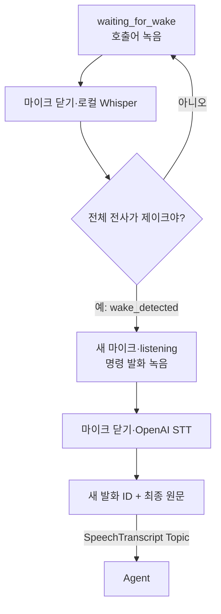

# STT → Agent 계약

## 입력과 인식 순서

마이크에서 16kHz mono PCM16 음성을 받는다. 호출어는 계정 없이 로컬 Whisper
small(CPU int8, 6 threads)로 확인하고, 별도의 명령 발화는 OpenAI `gpt-transcribe`로
인식한다. 노트북 `smoke`와 ROS STT 노드는 같은 `SpeechPipeline`을 사용한다.

1. `waiting_for_wake`가 표시되면 “제이크야”만 부른다. 호출어 수집은 시작 대기
   5초·종료 무음 0.4초·최대 발화 6초·발화 직전 소리 0.3초 보존으로 고정한다.
2. 마이크를 닫고 로컬에서 전체 발화를 인식한다. 공백·구두점을 제외한 전사가
   `제이크야`와 정확히 같아야 한다. “제이크야 오늘 날씨가 어때”는 거부한다.
3. `wake_detected` 뒤 새 마이크가 열려 `listening`이 표시되면 명령을 말한다.
   명령 수집 기본값은 시작 대기 5초·종료 무음 1초·최대 발화 20초·발화 직전 소리
   0.3초 보존이다. 호출어 녹음의 소리는 명령 녹음에 이어 붙이지 않는다.
4. 마이크를 닫고 명령 WAV만 OpenAI로 한 번 전송한다. 유효한 최종 원문을 발행한
   뒤 다시 호출어를 기다린다. 인식 처리 중 음성은 녹음하거나 대기열에 쌓지 않는다.

로컬 모델은 최초에 명시적으로 다운로드한다. ROS의 필수 `wake_model_path`와
노트북의 `--model-path`는 `tokenizer.json`을 포함한 완전한 모델 디렉터리를 가리킨다.
실행 중에는 `local_files_only=True`로 열어 자동 다운로드하지 않는다. 키·모델·녹음은
Git에 포함하지 않고, 런타임 원본 녹음은 파일에 자동 저장하지 않는다.

## 출력

| 항목 | 계약 |
|---|---|
| Topic | `/malbut/speech/transcript` |
| 메시지 타입 | `malbut_interfaces/msg/SpeechTranscript` |
| `utterance_id: string` | 새 최종 발화마다 생성하는 UUID |
| `text: string` | OpenAI가 돌려준 최종 발화 원문 |
| QoS | `RELIABLE`, `VOLATILE`, `KEEP_LAST`, depth `10` |

원문에 요약·명령 변환·공백 정규화를 적용하지 않는다. 같은 문장을 다시 말해도
새 ID를 사용한다. 중간 인식 결과·빈 원문·오류 문장은 발행하지 않는다.
무음·길이 초과 녹음은 인식에 보내지 않고 버리며, 잘린 문장을 전송하지 않는다.
명령 STT 실패는 발행 없이 호출어 대기로 돌아간다. 로컬 호출어 인식·장치 실패는
오류 종류를 기록하고 종료한다. API 자동 재시도와 Topic 접수 응답·재전송은 없다.

## Agent 수신 범위

- `speech_receiver`: 발화 ID·원문 해시를 SQLite에 기록하고 `received`를 표시한다.
  LLM·Manager·TTS를 호출하지 않는다.
- `agent_communication`: 수신·중복 확인 후 원문을 기존 대화 처리에 전달하고
  `/malbut/speech/response`에 답변 텍스트를 발행한다. Provider 환경 설정도 없으면
  `mock`이며 실제 OpenAI 대화는 기존 키와 `--provider openai` 설정을 사용한다.
  대화 발화·응답은 별도의 대화 DB에 저장한다.

두 Agent 모드를 동시에 실행하지 않는다. `published:<ID>`는 발행 기록이며 Agent
접수·답변·음성 재생·로봇 동작 성공을 뜻하지 않는다. 수신기를 먼저 실행하고
Agent 로그에서 같은 ID와 원문의 접수를 확인한다. 같은 ID·같은 원문은 `duplicate`,
같은 ID·다른 원문은 `conflict`이며, 늦게 시작한 Agent에 과거 발화를 재생하지 않는다.

실행 명령과 검증 범위는 [패키지 README](../README.md)를 따른다. 합성 음성과 대역
장치 시험은 실제 사용자·로봇의 호출어 및 STT 성능 검증과 구분한다.
