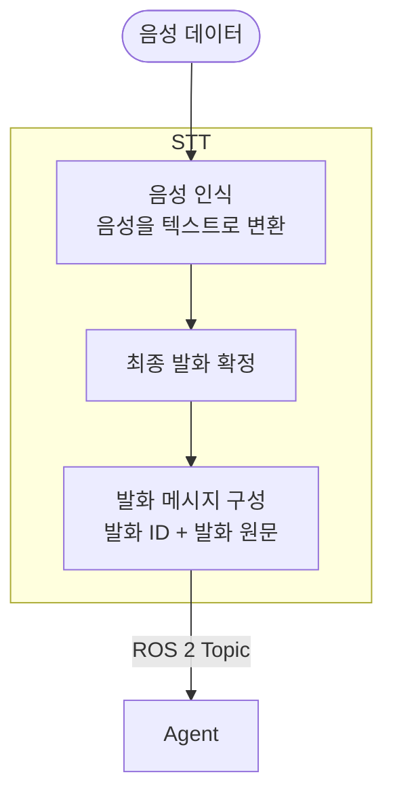

## 1. 기능

 - 음성을 인식해서 텍스트로 변환한다.
 - 사용자가 말한 내용을 다 인식했다면, 텍스트 변환을 종료하고 이 내용을 Agent로 보낸다.

## 2. 입력

마이크에서 음성데이터를 받아온다.

## 3. 출력

### Agent 전달

- STT가 최종 인식한 사용자 발화를 발화 ID와 원문으로 Agent에 전달한다.
- `/malbut/speech/transcript` ROS 2 Topic을 사용한다.
- 메시지 타입은 `malbut_interfaces/msg/SpeechTranscript`이다.

- 전달 데이터
  - `utterance_id: string` — 한 번의 발화를 구분하는 고유 ID.
  - `text: string` — STT가 최종 인식한 사용자 발화 원문.

## 4. 동작 규칙

### 음성 인식

- 인식이 완료된 최종 발화만 Agent에 전달한다.
- 인식한 사용자 발화는 요약하거나 명령으로 바꾸지 않고 원문으로 전달한다.

### 발화 메시지 구성

- 새 발화마다 고유 ID를 생성한다. 사용자가 같은 문장을 다시 말해도 다른 ID를 사용한다.
- 같은 발화를 재전송할 때는 기존 발화 ID와 원문을 그대로 사용한다.
