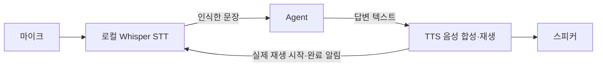
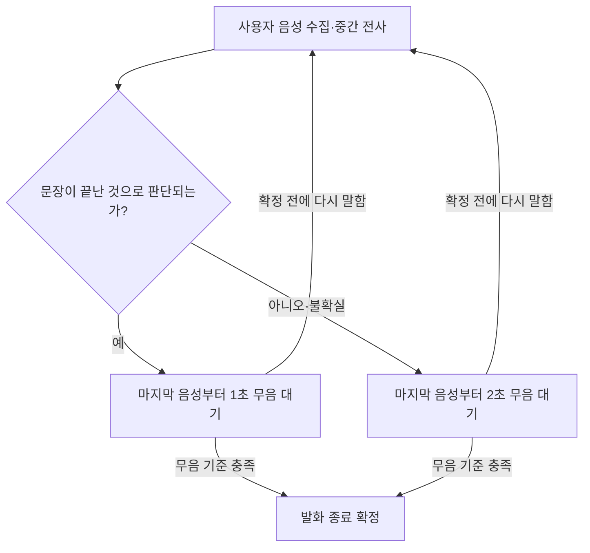

## STT 명세

## 1. 목적

목소리를 활용하여 자유롭게 소통할 수 있는 기능을 구현함에 목적을 둔다.

## 2. 입력과 출력

| 용도 | 통신 방식 | 이름 | 타입 |
|---|---|---|---|
| STT → Agent 전사 전달 | Topic | `/malbut/speech/transcript` | `SpeechTranscript` |
| TTS → STT 재생 상태 | Topic | `/malbut/speech/playback_status` | `SpeechPlaybackStatus` |
| STT → Agent 발화 대상 판정 | **Service** | `/malbut/speech/classify_addressee` | `ClassifySpeechAddressee` |
| STT → TTS 재생 제어 | **Service** | `/malbut/speech/playback_control` | `ControlSpeechPlayback` |

필드와 선택값의 최종 기준은 `malbut_interfaces`의 `.msg`와 `.srv` 파일이다.
Service의 요청과 응답은 ROS가 연결하므로 별도 결과 Topic을 사용하지 않는다.

### 2.1. Topic 메시지 필드

TTS 재생 상태: [SpeechPlaybackStatus.msg](../../malbut_interfaces/msg/SpeechPlaybackStatus.msg)

```text
string PLAYING=playing
string PAUSED=paused
string FINISHED=finished
string FAILED=failed
string STOPPED=stopped

# TTS 재생 한 건을 구분하는 고유 ID
string playback_id

# 위 상수 중 하나. FINISHED만 정상 재생 완료를 뜻한다.
string state
```

Agent에 전달하는 전사 결과: [SpeechTranscript.msg](../../malbut_interfaces/msg/SpeechTranscript.msg)

```text
# 한 번의 최종 발화를 구분하는 고유 ID
string utterance_id

# STT가 최종 인식한 사용자 발화 원문
string text
```

### 2.2. Service 요청·응답 필드

Agent 발화 대상 판정: [ClassifySpeechAddressee.srv](../../malbut_interfaces/srv/ClassifySpeechAddressee.srv)

```text
# Request
# 판정할 사용자 발화의 고유 ID
string utterance_id

# 사용자가 끼어들었을 때의 TTS 재생 고유 ID
string playback_id

# STT가 최종 인식한 끼어들기 발화 원문
string text
---
# Response
# 로봇에게 하는 말 / 다른 대상에게 하는 말 / 판단할 수 없음
string ADDRESSED=addressed
string NOT_ADDRESSED=not_addressed
string UNKNOWN=unknown
string decision
```

TTS 재생 제어: [ControlSpeechPlayback.srv](../../malbut_interfaces/srv/ControlSpeechPlayback.srv)

```text
# Request
string PAUSE=pause
string RESUME=resume
string STOP=stop

# 제어할 TTS 재생의 고유 ID
string playback_id

# 위 상수 중 하나
string command
---
# Response: 요청을 검증하고 접수했는지 여부
bool accepted
```

TTS는 `playback_id`와 `command`를 검증하여 제어 요청의 접수 여부를 응답한다.
`accepted=true`는 실제 재생 상태 변경이 완료되었다는 뜻이 아니다.
실제 일시정지·재개·종료 상태는 `SpeechPlaybackStatus`로 알린다.

## 3. 기능

### 3.1. 호출어 감지

- 웨이크워드를 들으면 반응을 하고 대화 세션을 시작 한다.
- 현재 호출어는 제이크이다.
- 제이크라는 호출어를 인식하면 띠링 소리를 울리고 대화 모드로 전환한다.
- 한번 호출할 시 대화 세션 종료까지 대화를 할 수 있다.

### 3.2. 음성 입력

- 대화 모드에서 마이크로 들어오는 사용자의 음성을 입력받는다.

### 3.3. 발화 종료 감지

- 사용자의 발화가 시작된 뒤, 마지막 사용자 음성 이후 2초 동안 무음이 이어지면 발화를 종료한다.
- 발화 내용이 평서문·질문·요청 등 완결된 문장으로 판단되면, 무음 대기시간을 1초로 줄인다. 이 시간은 마지막 사용자 음성 시점부터 계산한다.
- 문장이 끝났는지 판단하기 어려우면 기존 2초 무음 기준을 유지한다.
- 발화 종료를 확정하기 전에 사용자가 다시 말하면 무음 대기시간을 초기화하고 같은 발화를 이어서 수집한다. 이전 문장 완결 판단으로 이어지는 발화를 종료하지 않는다.
- 중간 인식 결과가 생성되더라도 발화 종료로 처리하지 않는다. 문장 완결 여부는 이어지는 사용자 음성을 반영하여 다시 판단하며, 기존 무음 기준을 충족한 뒤 발화 종료를 확정한다.

### 3.4. 텍스트 변환 및 전달

- 들은 음성을 텍스트로 변한다.
- 사용자가 말하는 동안에도 수집한 음성을 텍스트로 변환하여 중간 인식 결과를 갱신한다.
- 중간 인식 결과는 추가 음성에 따라 수정될 수 있으며, Agent에는 전달하지 않는다.
- 발화 종료 후의 변환 대기를 줄이기 위해, 발화 중에 생성한 인식 결과를 최종 전사에 활용한다.
- 발화 종료가 확정되면 마지막으로 수집한 음성까지 반영하여, 중복이나 누락 없이 하나의 최종 인식 결과로 통합한다.
- Agent에 전달할 최종 인식 결과는 해당 발화의 utterance_id와 함께 한 번만 전달한다.

### 3.5. 대화 모드 관리

- 호출어가 감지되면 대화 모드를 시작한다.
- 대화 모드에서는 호출어 없이 사용자의 발화를 입력받는다.
- TTS가 발화를 마치면 5초 동안 사용자의 다음 발화를 기다린다.
- 5초 이내에 사용자가 말하기 시작하면 종료 대기를 중단하고 대화를 이어간다.
- 다음 TTS 발화가 끝나면 다시 5초 동안 기다린다.
- 5초 동안 사용자 발화가 없으면 대화 모드를 종료하고 호출어 대기로 돌아간다.

### 3.6. TTS 중 음성 처리

- 로봇의 TTS 음성이 마이크에 입력되더라도 호출어 또는 사용자 발화로 처리하지 않는다.
- 사용자 끼어들기는 허용한다.
- 사용자가 말하기 시작하면 현재 TTS에 pause를 요청한다.
- 해당 발화가 로봇에게 하는 말이 아니라고 판단되면, 같은 playback_id에 resume를 요청하여 중단된 지점부터 재생한다.

## 4. 예외 처리

- 마이크 입력을 사용할 수 없음: 음성 입력을 중단하고 오류를 기록한다. 입력 장치가 정상화되기 전에는 대화를 시작하지 않는다.
- 음성을 텍스트로 변환하는데 실패하거나, 변환결과가 빈 문자열인 경우: Agent에 전달하지 않고 사용자의 다음 발화를 기다린다.
- 중간 인식에 실패하거나 결과가 비어 있으면, 현재 발화의 음성 입력을 계속하고 이후 인식을 이어간다.
- 최종 인식에 실패하거나 결과가 비어 있으면, Agent에 전달하지 않고 사용자의 다음 발화를 기다린다.
