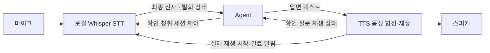
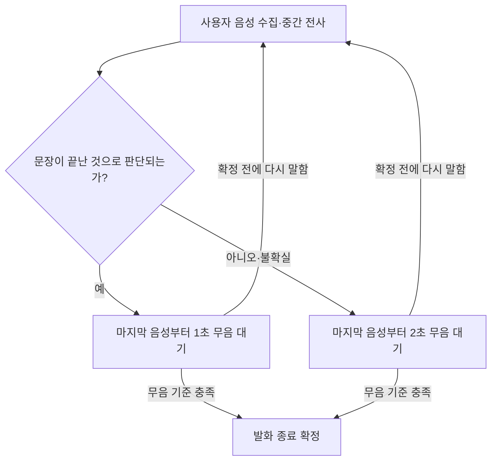

## STT 명세

```mermaid
flowchart LR
    M["마이크"] --> S["로컬 Whisper STT"]
    S -->|"최종 전사 · 발화 상태"| A["Agent"]
    A -->|"확인 청취 세션 제어"| S
    A -->|"답변 텍스트"| T["TTS 음성 합성·재생"]
    T --> SP["스피커"]
    T -->|"실제 재생 시작·완료 알림"| S
    T -->|"확인 질문 재생 상태"| A
```
## 1. 목적

목소리를 활용하여 자유롭게 소통할 수 있는 기능을 구현함에 목적을 둔다.

## 2. 입력과 출력

| 용도 | 통신 방식 | 이름 | 타입 |
|---|---|---|---|
| STT → Agent 전사 전달 | Topic | `/malbut/speech/transcript` | `SpeechTranscript` |
| STT → Agent 발화 상태 | Topic | `/malbut/speech/input_status` | `SpeechInputStatus` |
| TTS → STT·Agent 재생 상태 | Topic | `/malbut/speech/playback_status` | `SpeechPlaybackStatus` |
| STT → Agent 발화 대상 판정 | **Service** | `/malbut/speech/classify_addressee` | `ClassifySpeechAddressee` |
| Agent → STT 확인 청취 세션 제어·조회 | **Service** | `/malbut/speech/session_control` | `ControlSpeechSession` |
| 웹 말하기 → STT 입력 차단 제어 | **Service** | `/malbut/speech/web_talk_control` | `ControlWebTalk` |
| STT·Agent → TTS 재생 제어 | **Service** | `/malbut/speech/playback_control` | `ControlSpeechPlayback` |

필드와 선택값의 최종 기준은 `malbut_interfaces`의 `.msg`와 `.srv` 파일이다.
공개 통신 목록과 공통 규격은 [인터페이스 명세](../../malbut_interfaces/README.md)에서 확인한다.
Service의 요청과 응답은 ROS가 연결하므로 별도 결과 Topic을 사용하지 않는다.

### 2.1. Topic 메시지 필드

- TTS 재생 상태: [SpeechPlaybackStatus.msg](../../malbut_interfaces/msg/SpeechPlaybackStatus.msg).
  `playback_id: string`은 재생 건을, `state: string`은 실제 재생 상태를 나타낸다.
  `request_id: string`은 일반 답변의 원본 `utterance_id`다. STT는 이 값으로
  현재 기다리는 최종 답변의 종료를 구분한다. 확인 발화에는 빈 값이다.
  `interim: bool`은 최종 답변 전 중간 안내 여부이며 기본값은 `false`다. STT는
  `PLAYING`의 값을 해당 재생 ID와 함께 기억한다.
  선택값은 메시지의 상수를 따른다. `FINISHED`만 정상 재생 완료이며 `FAILED`와
  `STOPPED`를 질문 완료나 사용자 무응답으로 취급하지 않는다.
- Agent에 전달하는 최종 전사: [SpeechTranscript.msg](../../malbut_interfaces/msg/SpeechTranscript.msg).
  `utterance_id: string`, `text: string`, `session_id: string`을 전달한다.
  확인 대화에는 Agent가 연 청취 세션 ID를 넣고, 일반 호출어 대화에는 빈 값을 넣는다.
- Agent에 전달하는 발화 상태: [SpeechInputStatus.msg](../../malbut_interfaces/msg/SpeechInputStatus.msg).
  `session_id: string`, `utterance_id: string`, `state: string`을 전달한다.
  `STARTED`는 연속 VAD 음성 조건을 통과한 발화 시작, `FAILED`는 해당 발화 또는 확인 세션의 청취·인식 실패다.
  시작 조건에 못 미친 짧은 잡음 후보에는 두 상태를 모두 발행하지 않는다.
  빈 `session_id`는 일반 대화이며 두 상태 모두 비어 있지 않은 `utterance_id`가 필요하다.
  비어 있지 않은 `session_id`는 Agent 주도 확인 세션이며, 세션 전체의 `FAILED`에만
  빈 `utterance_id`를 허용한다.

### 2.2. Service 요청·응답 필드

- Agent 발화 대상 판정: [ClassifySpeechAddressee.srv](../../malbut_interfaces/srv/ClassifySpeechAddressee.srv).
  요청은 `utterance_id: string`, `playback_id: string`, `text: string`, 응답은
  `decision: string`이다. 선택값은 서비스의 상수를 따른다. 일반 대화의 끼어들기에
  사용하며, Agent가 먼저 연 확인 세션에서는 이 분류를 생략한다.
- TTS 재생 제어: [ControlSpeechPlayback.srv](../../malbut_interfaces/srv/ControlSpeechPlayback.srv).
  요청은 `playback_id: string`, `command: string`, 응답은 `accepted: bool`이다.
  STT는 발화에 따라 `PAUSE`, `RESUME`, `STOP`을 요청한다. Agent도 같은 서비스를
  사용하며, 확인 시작 전에는 ID 없이 `STOP_ALL`로 현재 재생과 대기열을 중단한다.
  `accepted=true`는 접수이며 실제 상태 변경 완료를 뜻하지 않는다. 미수신 ID의
  `STOP` 예약 취소도 접수할 수 있고, 실제 상태는 `SpeechPlaybackStatus`로 알린다.
- 확인 청취 세션 제어·조회: [ControlSpeechSession.srv](../../malbut_interfaces/srv/ControlSpeechSession.srv).
  요청은 `session_id: string`, `active: bool`, `check_only: bool`, 응답은
  `accepted: bool`, `barge_in_available: bool`이다. `check_only=true`이면 `active`를
  무시하고 해당 ID가 활성이고 마이크 입력을 사용할 수 있는지 조회한다. 그 외에는 `active`로 시작·종료를 요청한다.
  `barge_in_available`은 실제 입력의 AEC 기반 끼어들기 가능 여부다. 중복 시작,
  예약 종료와 ID 보관 규칙은 아래 3.7절을 따른다.
- 웹 말하기 입력 차단: [ControlWebTalk.srv](../../malbut_interfaces/srv/ControlWebTalk.srv).
  요청은 `lease_id: string`, `active: bool`, `ttl_s: float64`, 응답은 `accepted: bool`이다.
  비어 있지 않은 200자 이하 ID로 시작·갱신하며 `0 < ttl_s <= 15`를 사용한다.
  `active=false`는 현재 ID와 일치할 때만 해제하며 `ttl_s`는 사용하지 않는다.
  시작의 `accepted=true`는 기존 오디오·인식 결과 무효화와 입력 차단 완료를 뜻한다.

## 3. 기능

### 3.1. 호출어 감지

- 웨이크워드를 들으면 반응을 하고 대화 세션을 시작 한다.
- 현재 호출어는 제이크이다.
- 제이크라는 호출어를 인식하면 띠링 소리를 울리고 대화 모드로 전환한다.
- 한 번 호출하면 일반 발화 하나를 Agent에 전달하고, 다음 요청에는 다시 호출어가 필요하다.

### 3.2. 음성 입력

- 대화 모드에서 마이크로 들어오는 사용자의 음성을 입력받는다.

### 3.3. 발화 종료 감지

```mermaid
flowchart TD
    A["사용자 음성 수집·중간 전사"]
    B{"문장이 끝난 것으로 판단되는가?"}
    C["마지막 음성부터 1초 무음 대기"]
    D["마지막 음성부터 2초 무음 대기"]
    E["발화 종료 확정"]

    A --> B
    B -->|"예"| C
    B -->|"아니오·불확실"| D
    C -->|"무음 기준 충족"| E
    D -->|"무음 기준 충족"| E
    C -->|"확정 전에 다시 말함"| A
    D -->|"확정 전에 다시 말함"| A
```
- 기본 80ms(20ms 프레임 4개) 연속 음성 판정 후 발화 수집을 시작한다. 첫 음성과 그 이전 pre-roll을 보존하며, 비음성 프레임은 연속 판정 횟수를 초기화한다.
- 시작 조건을 통과하지 못한 후보는 전사·발화 ID·시작/실패 알림·수신음을 만들지 않는다. 같은 문장이라는 이유만으로 정상 발화를 차단하지 않는다.
- 사용자의 발화가 시작된 뒤, 마지막 사용자 음성 이후 2초 동안 무음이 이어지면 발화를 종료한다.
- 발화 내용이 평서문·질문·요청 등 완결된 문장으로 판단되면, 무음 대기시간을 1초로 줄인다. 이 시간은 마지막 사용자 음성 시점부터 계산한다.
- 문장이 끝났는지 판단하기 어려우면 기존 2초 무음 기준을 유지한다.
- 발화 종료를 확정하기 전에 사용자가 다시 말하면 무음 대기시간을 초기화하고 같은 발화를 이어서 수집한다. 이전 문장 완결 판단으로 이어지는 발화를 종료하지 않는다.
- 중간 인식 결과가 생성되더라도 발화 종료로 처리하지 않는다. 문장 완결 여부는 이어지는 사용자 음성을 반영하여 다시 판단하며, 기존 무음 기준을 충족한 뒤 발화 종료를 확정한다.

### 3.4. 텍스트 변환 및 전달

- 들은 음성을 텍스트로 변한다.
- 사용자가 말하는 동안에도 수집한 음성을 텍스트로 변환하여 중간 인식 결과를 갱신한다.
- 중간 인식 결과는 추가 음성에 따라 수정될 수 있으며, Agent에는 전달하지 않는다.
- 발화 종료 후의 변환 대기를 줄이기 위해, 발화 중에 생성한 인식 결과를 최종 전사에 활용한다.
- 발화 종료가 확정되면 마지막으로 수집한 음성까지 반영하여, 중복이나 누락 없이 하나의 최종 인식 결과로 통합한다.
- Agent에 전달할 최종 인식 결과는 해당 발화의 utterance_id와 함께 한 번만 전달한다.

### 3.5. 일반 호출어 대화 모드 관리

- 호출어가 감지되면 대화 모드를 시작한다. 호출어 알림음의 잔향 차단이 끝난 뒤 `start_timeout_s`(기본 5초) 안에 유효한 발화 시작이 없으면 전사나 안내 음성 없이 호출어 대기로 돌아간다.
- 호출 후 일반 발화 하나의 최종 전사를 Agent에 전달하면 대화 모드를 닫고 답변을 기다린다.
- Agent의 답변 준비부터 TTS 재생 종료까지 마이크는 계속 읽되, 새 발화와 호출어를 모두 버린다. AEC 설정과 관계없이 추가 요청을 쌓지 않는다.
- 같은 `request_id`의 최종 답변(`interim=false`)이 `FINISHED`, `FAILED`, `STOPPED`에 도달하면 호출어 대기로 돌아간다. 음성 생성 실패처럼 `PLAYING` 없이 종료된 경우도 포함한다.
- 중간 안내(`interim=true`)나 다른 요청의 종료는 입력 차단을 해제하지 않는다. 차단 중 수집·대기한 오디오는 다음 호출에 재사용하지 않는다.
- 최종 답변 뒤에는 호출어 없는 후속 발화 대기를 열지 않는다. AEC 없는 입력의 기존 300ms 잔향 차단은 유지한다.
- 빈 최종 인식 결과는 조용히 호출어 대기로 돌아간다. 최종 인식 중 예외가 발생하면 원래 발화 ID에 연결된 최종 실패 안내를 기다린 뒤 호출어 대기로 돌아간다. Agent 주도 확인 세션과 AEC 끼어들기는 아래 별도 규칙을 따른다.

### 3.6. 일반 대화의 TTS 중 음성 처리

- 로봇의 TTS 음성이 마이크에 입력되더라도 호출어 또는 사용자 발화로 처리하지 않는다.
- 이미 전달한 일반 요청의 답변을 기다리는 동안에는 사용자 끼어들기를 받지 않는다.
- 요청을 전달하기 전 다른 재생과 겹친 발화의 기존 pause·대상 판정·resume 처리는 실제 AEC 입력이 있는 경우에만 적용한다. AEC가 없으면 재생 중 입력을 차단한다.

### 3.7. Agent 주도 이상 상황 확인

- Agent는 모든 확인 질문의 재생 중 확인 청취 세션을 닫아 두고, 해당 질문의 최종 `FINISHED`(`interim=false`) 뒤 `/malbut/speech/session_control` (`ControlSpeechSession`)에 새 `session_id`와 `active=true`를 보내 호출어 없이 답변받는다. 같은 ID로 재시작하면 현재 청취를 유지하며, 종료는 같은 ID와 `active=false`로 요청한다.
- `active=false`가 같은 ID의 시작보다 먼저 도착하면 예약 종료로 접수한다. 이 ID의 늦은 시작은 거절하며 다른 활성 세션에는 영향을 주지 않는다. 완료·교체·취소·예약 종료한 ID는 최근 256개를 보관해 재활성화를 막는다. 새 질문에는 새로운 ID를 사용한다.
- `check_only=true`는 상태를 변경하지 않고 해당 ID가 현재 활성이고 마이크 읽기 오류나 입력 중단이 없는지 조회한다. Agent는 무응답 확정 직전에 조회하여 STT 재시작 또는 마이크 단절을 사용자 무응답과 구분한다.
- 이 세션에는 일반 요청의 답변 대기 차단과 재호출 규칙을 적용하지 않는다. Agent가 새 청취 세션의 시작 수락 ACK부터 답변 시작까지 10초를 관리한다. 질문 재생의 `STOPPED`·`FAILED`는 사용자 무응답이나 재질문 소모 없이 처리 오류로 종료한다.
- 사용자 발화가 시작되면 `/malbut/speech/input_status` (`SpeechInputStatus`)에 `session_id`, `utterance_id`, `STARTED`를 발행한다. 확인 답변에는 별도의 수신 대상 분류를 적용하지 않는다. Agent는 질문 재생 중 도착한 입력으로 질문을 중단하거나 답변을 판단하지 않으며, 재생 완료 후 세션을 여는 동안 ACK보다 먼저 도착한 답변은 보존한다.
- 최종 전사는 기존 `/malbut/speech/transcript`에 `session_id`를 포함해 발행한다. 일반 대화 전사의 `session_id`는 빈 값이다. 최종 전사 실패, 발화 길이 초과, 입력 큐 넘침은 해당 세션의 `FAILED` 입력 상태로 알린다. 마이크 읽기 오류는 STT를 중단하며 세션 조회 실패로 구분한다.
- 확인 질문 중 끼어들기는 `input_has_aec`와 서비스 응답의 `barge_in_available` 값에 관계없이 받지 않는다. TTS는 `CONFIRMATION` 재생의 pause·resume을 거절하며, 취소를 위한 stop·stop_all은 유지한다. 일반 대화의 AEC·재생 제어 정책은 그대로 유지한다.
- AEC 없는 입력에는 재생 상태가 바뀐 뒤 300ms의 에코 차단 시간이 추가로 있다. 질문 종료 직후 이 시간 안에 끝난 짧은 답변은 수집되지 않을 수 있다. 이 보호 동작은 AEC를 대신하지 않는다.

### 3.8. 웹 말하기 중 입력 차단

- 웹에서 말하기를 활성화하면 STT 프로세스와 마이크 읽기는 유지하고 호출어·일반 전사·확인 답변 인식을 모두 차단한다. AEC 설정과 관계없이 적용한다. 영상 시청이나 마이크 권한 허용만으로는 차단하지 않는다.
- 말하기 시작 응답 전에 수집·대기 오디오를 비우고 진행 중인 인식을 취소·무효화한다. 뒤늦게 반환된 기존 인식 결과는 Agent에 전달하지 않는다.
- 동일 ID의 갱신은 청취 차단의 만료 시간만 연장한다. 새 ID로 교체한 뒤 도착한 이전 ID의 종료는 현재 차단을 풀지 않는다. 갱신이 끊기면 단조 시계 기준 TTL 만료로 자동 해제한다.
- 정상 종료와 만료 시 버퍼를 비우고 300ms 잔향 차단 후 호출어 대기로 돌아간다. 이미 접수한 일반 요청의 답변이 남아 있으면 해당 `request_id`의 최종 답변 종료까지 기존 답변 대기 차단도 유지한다.
- STT 노드 시작 시 마이크를 열기 전에 3초간 입력을 차단한다. 미디어 에이전트가 이전 STT 프로세스에서 받은 최대 3초 허가로 계속 재생하더라도 재시작 직후 호출어를 오인식하지 않게 한다. 새로운 웹 말하기 허가가 도착하면 해당 ID로 차단을 이어 간다.
- 진행 중인 확인 세션에는 해당 `session_id`와 빈 `utterance_id`로 `FAILED`를 발행하고 종료한다. 웹 말하기·잔향 차단 중에는 새 확인 세션 시작과 활성 조회를 거절하며 종료 요청은 처리한다. Agent는 이를 청취 불가로 구분하고 사용자 무응답으로 판단하지 않는다.
- 웹 말하기 중에는 Agent도 말하지 않는다. 시작할 때 `/malbut/speech/playback_control`에 `STOP_ALL`을 보내 재생 중·대기 중인 말을 버리고, 말하기 동안 `/malbut/speech/response`로 들어온 요청은 그 `playback_id`로 `STOP`해 소리가 나기 전에 취소한다. 그래도 `PLAYING`·`PAUSED`가 보고되면 그 재생을 `STOP`한다. 버린 말은 끝난 뒤 다시 재생하지 않는다. 멈춘 확인 질문은 Agent가 전달 실패(`aborted`)로 처리한다. STT 시작 시 3초 차단은 입력만 막고 말은 막지 않는다.

## 4. 예외 처리

- 마이크 입력을 사용할 수 없음: 음성 입력을 중단하고 오류를 기록한다. 입력 장치가 정상화되기 전에는 대화를 시작하지 않는다.
- 마이크 시작 후 첫 PCM 또는 이후 PCM이 실제 경과 시간으로 5초 동안 도착하지 않으면 읽기 오류로 중단한다. 늦게 도착한 PCM으로 이 오류를 해제하지 않는다. 정상 무음과 TTS·잔향 차단 중에도 PCM을 계속 읽으므로 입력 중단과 구분하며, 대화의 답변 대기 시간과 독립적으로 검사한다.
- 중간 인식에 실패하거나 결과가 비어 있으면, 현재 발화의 음성 입력을 계속하고 이후 인식을 이어간다.
- 일반 호출어 대화에서는 발화 시작에 빈 `session_id`와 비어 있지 않은 `utterance_id`로 `SpeechInputStatus.STARTED`를 전달한다. 최종 결과가 비어 있으면 전사나 `FAILED` 없이 호출어 대기로 돌아간다. 최종 인식 중 예외가 발생하면 전사 대신 같은 발화 ID의 `FAILED`를 전달하고, 해당 ID의 실패 안내가 종료될 때까지 입력을 차단한다.
- Agent는 최신 `STARTED`와 일치하는 실패에 한 번만, 추가 대화 판단 LLM 호출이나 대화 메모리 기록 없이 “잘 알아듣지 못했어요. 다시 제이크라고 불러 주세요.”를 기존 `SpeechRequest`로 발행한다. 이 안내는 원래 `utterance_id`를 `request_id`로 사용하고 항상 `interim=false`다. 같은 요청의 최종 `FINISHED`·`FAILED`·`STOPPED`는 `PLAYING` 이전에 도착해도 호출어 대기로 돌려보낸다. 실패 안내 대기를 시작한 뒤 45초 동안 같은 요청의 최종 종료가 없으면 이 안내의 입력 차단만 해제하며, 실제 재생 중 입력 차단과 잔향 차단은 유지한다. 안내 뒤에는 호출어 없는 후속 발화를 받지 않는다. 오래된 발화·중복 실패·확인 세션 상태는 일반 안내에서 제외한다.
- AEC가 있는 일반 끼어들기로 기존 답변을 일시정지한 경우에는 `STARTED`를 전달하되 최종 인식 실패의 `FAILED`를 보내지 않는다. 재시도 안내가 일시정지된 TTS 뒤에 쌓이지 않도록 기존 일시정지·수신 대상 판정·다음 발화 처리를 유지한다.
- Agent 주도 확인 세션에서 최종 인식에 실패하거나 결과가 비어 있으면 `SpeechInputStatus.FAILED`를 전달한다. Agent는 이를 처리 실패로 종료하며 사용자 무응답으로 판단하지 않는다.
