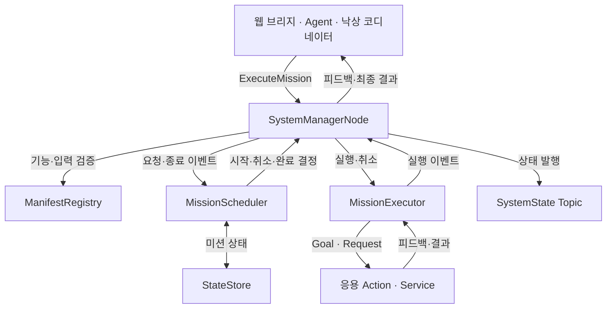
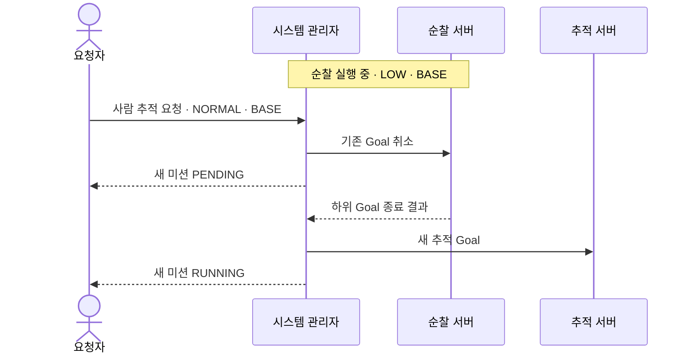

# Malbut System Manager

로봇의 기능 요청을 **검증하고, 실행 자원을 중재하며, 완료·취소 결과를 전달하는 미션 관리자**입니다.
웹 브리지·음성 Agent·낙상 코디네이터는 같은 진입점으로 요청하고,
관리자는 등록된 기능의 ROS Action 또는 Service를 실행합니다.

사람을 찾거나 경로를 계산하는 알고리즘은 각 기능과 Nav2에 남겨 둡니다.
관리자는 **어떤 작업을 함께 실행할 수 있는지, 무엇을 먼저 끝내야 하는지**를 판단하며,
`/cmd_vel`을 직접 생성하지 않습니다.

[운영 가이드](README_OPERATIONS.md) · [공용 인터페이스](../malbut_interfaces/README.md) ·
[Bringup 설계](../malbut_bringup/README.md)

## 전체 구조

| 구성 | 책임 |
| --- | --- |
| [ManifestRegistry](malbut_system_manager/manifest_registry.py) | 등록 기능·ROS 타입·입력 필드·기본값 검증 |
| [MissionScheduler](malbut_system_manager/mission_scheduler.py) | 허용·거부·선점·취소 판단. ROS 호출 없이 정책 처리 |
| [StateStore](malbut_system_manager/state_store.py) | 활성·대기·보류 미션과 시스템·제어 상태 보관 |
| [MissionExecutor](malbut_system_manager/mission_executor.py) | 비동기 Action·Service 호출, 하위 피드백·결과·취소 추적 |
| [SystemManagerNode](malbut_system_manager/system_manager_node.py) | ROS 진입점과 내부 정책·실행 계층 연결 |

요청자는 하위 서버의 이름·타입·우선순위를 매번 지정하지 않습니다.
`capability_id`와 입력값을 보내면 관리자가 Manifest에서 실행 계약을 찾습니다.

## 공통 실행 계약

| 인터페이스 | 전달하는 정보 |
| --- | --- |
| `/malbut/mission/execute` — [ExecuteMission](../malbut_interfaces/action/ExecuteMission.action) | 요청: `capability_id`, `arguments_yaml` |
| 같은 Action의 Feedback | `mission_id`, 관리자 `state`, 하위 `feedback_yaml` |
| 같은 Action의 Result | `mission_id`, 하위 `result_yaml`, 관리자 `message` |
| `/malbut/state` — [SystemState](../malbut_interfaces/msg/SystemState.msg) | 시스템·제어 상태, 활성·대기·보류 미션 목록 |

`mission_id`는 상위 Action Goal의 UUID입니다.
하위 기능의 피드백·결과는 YAML로 전달하고,
관리자의 거부·통신 실패·교체 사유는 `message`로 구분합니다.
상태 Topic은 최신 상태를 늦게 연결한 구독자도 받을 수 있도록
`RELIABLE / TRANSIENT_LOCAL / depth=1`로 발행합니다.

## 음성·웹 공통 정지와 조건부 선점

`/malbut/mission/stop_movement`(`malbut_interfaces/srv/StopMovement`)는 요청한
클라이언트와 무관하게 BASE 미션을 정지합니다. `fall_confirmation`은 제외하며,
날씨처럼 BASE를 쓰지 않는 작업도 유지합니다. 실행 중인 작업뿐 아니라 대기·중단·
접수 직후 아직 실행되지 않은 요청과 지도 전환의 내부 위치 보정까지 포함합니다.
수동 입력은 `/preempt_teleop`으로 해제하고 `/malbut/movement_stop`에 요청 ID를
발행합니다. 수동 주행은 입력이 중립으로 돌아온 뒤 다시 시작할 수 있습니다.

`request_id` 재전송은 같은 정지의 상태만 조회하며 나중에 시작한 작업을 정지하지
않습니다. `stopped=true`는 대상의 실제 하위 종료가 확인됐다는 뜻입니다. 응답 상한은
Goal 응답 watchdog과 취소 watchdog의 합에 1초를 더한 값입니다. `stop_unconfirmed`면
미확인 ID를 반환하고 실제 종료가 확인될 때까지 새 이동을 막습니다. 원래 미션의
상위 Action은 서버 주도 정지이므로 `ABORTED`, 메시지 `movement_stopped`로 끝납니다.

`ExecuteMission`과 `StopMovement`의 `require_preemption_confirmation=true`는
실제 충돌 ID가 `confirmed_preemption_mission_ids` 안에 있을 때만 변경을 허용합니다.
불일치 시 아무 작업도 취소하지 않고 `preemption_confirmation_required`를 반환합니다.
ExecuteMission은 해당 code와 `conflicting_mission_ids`를 `result_yaml`에 담습니다.
StopMovement의 `shutdown_runtime=true`는 직접 실행한 Manager에서는 모든 미션의
확인을 요구하고 새 접수를 프로세스 종료까지 닫습니다. `resident_runtime=true`에서는
로봇 자식 실행에 속한 작업만 확인·종료하고 로봇 기능의 접수만 닫습니다. 날씨와
일반 `device_operation` 작업은 계속 실행되므로 이 서비스를 호출한 런타임 종료
작업 자체도 유지됩니다. `runtime_start`·`map_select` 준비 작업은 예외로 이동 정지
대상입니다. 다음 자식 실행이 확인되면 로봇 기능의 접수를 다시 열며 이동 세대는
초기화하지 않습니다.

통합 Agent·웹·수동 입력은 `/malbut/state`의 `movement_runtime_id`, `movement_epoch`를
확인한 뒤 ExecuteMission에 같은 값을 넣고 `require_movement_epoch=true`로 보냅니다.
새로 허용된 정지는 이동 세대를 원자적으로 증가시킵니다. 따라서 정지 전 보냈지만
정지 후 도착한 Goal도 `ABORTED / movement_epoch_changed`로 끝나며 실제 동작을
시작하지 않습니다. 동일 정지 ID의 재조회와 확인 부족으로 거부된 정지는 세대를
바꾸지 않습니다. Manager 재시작은 lifetime ID가 바뀌므로 이전 요청을 재사용할 수
없습니다. 기존 비통합 호출은 기본값 `require_movement_epoch=false`를 유지합니다.

`/malbut/localization/status`(`LocalizationState`)는 controller `runtime_id`, 단조 증가
`transition_id`, `mode`, `map_path`, `pose_ready`, `message`를 제공합니다. 기존 JSON
`/malbut/localization/state`에도 identity와 `pose_ready`가 포함됩니다. 저장 지도 로드와
위치 확인은 별개이며, `pose_ready=false`이면 위치 보정 전 이동·추적·순찰을 거부합니다.
지도에 연결된 요청은 `ExecuteMission.expected_localization_runtime_id`와
`expected_localization_transition_id`에 준비할 때 확인한 identity를 전달합니다.
Manager는 미션 접수와 같은 lock 안에서 현재 identity를 비교합니다. 다르면 실행 없이
`ABORTED`와 `result_yaml.code=localization_changed`를 반환하므로, 이전 지도에서 계산한
좌표가 새 지도에 적용되지 않습니다. 두 필드의 기본값인 빈 문자열·0은 기존 호출의
지도 바인딩 생략을 유지합니다.

통합 준비는 `/malbut/localization/prepare`(`PrepareLocalization`)에 `mapping`,
`map_url`, `movement_runtime_id`, `movement_epoch`를 보냅니다. `mapping=true`이면
`map_url`은 비워 두고, 저장 지도 선택은 `mapping=false`와 YAML 절대 경로를 씁니다.
이동 세대 확인과 지도 전환 예약을 같은 lock 안에서 처리하므로 정지 전에 보낸
준비 서비스가 늦게 도착해도 내부 AUTO를 시작하지 않습니다. 결과는 `success`,
`code`, `message`이며, 지도 로드 성공과 `pose_ready` 확인은 별개입니다. 기존
`load_map`·`start_mapping` 서비스는 그대로 유지하지만 이동 세대 필드가 없으므로
통합 클라이언트는 이 준비 서비스를 사용합니다.

`/malbut/mission/recent_results`는 최근 결과를 JSON 배열로 보존하는 transient-local
토픽입니다. 최대 20개·60KiB이며 개별 `result_yaml`은 4096자로 제한하고 잘린 경우
`result_truncated=true`를 붙입니다. `mission_id`, `capability_id`, `state`, `message`,
UTC `observed_at`과 `downstream_terminal`을 포함합니다. 상위 요청이 실패했지만 하위
실행이 남은 경우 `downstream_terminal=false`이며, 늦은 실제 종료가 오면 갱신합니다.

## 기능 등록: Capability Manifest

기능 목록은 [malbut_interfaces/capabilities](../malbut_interfaces/capabilities)에 모읍니다.
관리자는 기본적으로 설치된 `share/malbut_interfaces/capabilities/`를 읽고,
등록되지 않은 기능이나 정의에 없는 입력은 실행하지 않습니다.

| Manifest 항목 | 의미 |
| --- | --- |
| `capability` | 기능 ID·제목·설명 |
| `command` | Action 또는 Service, 서버 이름, ROS 타입 |
| `input.fields` | 입력 필드·타입·기본값 |
| `execution.mode` | 시스템 상태에 반영할 전경·백그라운드 구분 |
| `execution.priority` | 충돌하는 요청 사이의 우선순위 |
| `execution.resources` | 독점할 출력 자원 |
| `execution.map_requirement` | 필요한 위치 추정 모드. 필요한 기능에만 선언 |

입력은 실제 ROS Goal·Request 메시지로 변환해 타입을 확인합니다.
따라서 기능을 연결할 때는 **응용 서버의 ROS 계약 + Manifest**를 등록하며,
관리자에 기능별 실행 분기를 추가하는 방식이 아닙니다.

상시 YOLO·사람 ID·센서 Topic 제공 노드는 Bringup에서 실행합니다.
Topic을 구독하기 위해 미션으로 등록하지 않습니다.

### 현재 등록된 기능

| 기능 ID | 하위 서버 | 우선순위 | 독점 자원 |
| --- | --- | --- | --- |
| `follow_person` | `/follow_person` | NORMAL | BASE |
| `navigate_to_pose` | `/navigate_to_pose` | NORMAL | BASE |
| `autoslam` | `/autoslam` | NORMAL | BASE |
| `relocalize` | `/relocalize` | NORMAL | BASE |
| `patrol` | `/patrol` | LOW | BASE |
| `manual_drive` | `/assisted_teleop` | HIGH | BASE |
| `fall_confirmation` | `/malbut/agent/confirm_situation` | URGENT | BASE·SPEAKER |
| `get_weather` | `/malbut/weather/get` | NORMAL | 없음 |
| `set_weather_location` | `/malbut/weather/location/set` | NORMAL | 없음 |
| `recovery` | `/malbut/bringup/recover` | URGENT | BASE·SPEAKER |

현재 등록된 위 기능은 모두 Action입니다. 관리자 실행기는 Service도 지원합니다.
`recovery`는 등록 계약이 남아 있지만 **현재 모듈형 Bringup에서는 실행을 거절**합니다.

## 자원과 우선순위

전경·백그라운드는 **동시 실행을 제한하는 기준이 아닙니다**.
두 요청의 `resources`가 겹칠 때만 충돌하며,
자원이 겹치지 않는 전경 미션도 함께 실행할 수 있습니다.

자원은 `BASE`, `SPEAKER`, `BUZZER`, `LED`, `DISPLAY`입니다.
차체 이동·회전은 BASE를 선언하지만, 같은 카메라·LiDAR 데이터를 구독하는 것은
독점 자원이 아닙니다. 날씨처럼 독점 출력이 없는 기능은 `resources: []`를 사용합니다.

| 새 요청과 기존 미션의 관계 | 처리 |
| --- | --- |
| 자원이 겹치지 않음 | 기존 작업과 병행 |
| 모든 충돌 미션보다 우선순위가 높거나 같음 | 충돌 미션만 취소 → 실제 종료 확인 → 새 요청 실행 |
| 더 높은 우선순위의 충돌 미션이 하나라도 있음 | 새 요청 거부, 기존 작업 유지 |

우선순위는 `LOW < NORMAL < HIGH < URGENT`입니다.
즉 순찰 중 사람 추적은 순찰을 교체하지만, 추적 중 순찰은 거부됩니다.
추적과 목적지 이동은 같은 등급이므로 새 요청으로 교체됩니다.
수동 조작은 NORMAL·LOW 이동을 교체하고, 낙상 확인은 BASE·SPEAKER를 함께 확보합니다.

### 교체는 “취소 요청”이 아니라 “종료 확인”까지

교체된 미션은 종료하며 **보류하거나 자동 재개하지 않습니다**.
다시 순찰하려면 새 요청을 보내야 합니다.
`SUSPENDED` 상태와 공개 필드는 남아 있지만 현재 요청 교체 정책에는 사용하지 않습니다.

## 비동기 실행과 실패 처리

| 항목 | Action | Service |
| --- | --- | --- |
| 요청 | Goal | Request |
| 진행 정보 | 하위 Feedback 전달 | 관리자 미션 상태만 전달 |
| 종료 | 하위 최종 상태·Result 확인 | Response 확인 |
| 이미 보낸 요청의 취소 | 취소 요청 후 최종 종료 확인 | ROS 취소 불가. 응답까지 자원 유지 |

정상 Service 응답의 상위 상태 `SUCCEEDED`는 **요청·응답 완료**를 뜻합니다.
응답 안의 `success: false` 등 기능별 결과는 변경 없이 전달하므로 요청자가 확인합니다.

Action의 Goal 응답·취소 완료에는 기본 5초의 통신 watchdog이 있습니다.
이는 미션 전체 수행 시간을 제한하는 타이머가 아닙니다.
실행은 `mission_id + generation`으로 추적해 이전 실행의 늦은 콜백이 현재 상태를 덮지 않게 합니다.

취소가 거부되거나 실행 여부가 불명확하면, 상위 요청을 실패로 끝내더라도
**하위 실행 기록과 자원 점유를 임의로 지우지 않습니다**.
서버가 실제로 멈추지 않았는데 새 BASE 미션을 함께 실행하는 일을 막기 위한 처리입니다.
이미 보낸 Service도 응답 없이 자원을 해제하거나 자동 재전송하지 않습니다.

| 종료 상황 | 상위 Action 결과 |
| --- | --- |
| 하위 작업 정상 완료 | SUCCEEDED |
| 사용자 취소가 완료됨 | CANCELED |
| 관리자 교체로 기존 작업이 취소 완료됨 | ABORTED + `mission preempted by a replacement request` |
| 거부·실행 실패·통신 결과 불명확 | ABORTED + 원인 메시지 |

상위 결과의 실패·취소와 실제 차체 정지는 같은 의미가 아닙니다.
관리자는 하위 Action의 종료를 확인하며, 주행 명령과 차체 정지는 응용·Nav2·드라이버의 영역입니다.

## 시스템 상태와 제어 모드

[SystemState](../malbut_interfaces/msg/SystemState.msg)는 개별 미션과 별도로 전체 상태를 전달합니다.

| 상태 | 현재 판단 |
| --- | --- |
| BOOTING | 관리자 요청 허용 준비 전 |
| IDLE | 활성 전경 미션 없음. 백그라운드 미션은 실행 중일 수 있음 |
| EXECUTING_MISSION | 활성 전경 미션 있음 |
| RECHARGING·EMERGENCY | 내부 상태 모델에 존재. 외부 충전·비상 정지 입력 계약은 아직 공개하지 않음 |

`control_mode`는 AssistedTeleop 미션이 활성 상태면 `MANUAL`,
아니면 `AUTONOMOUS`로 계산합니다.
별도의 수동/자율 스위치가 아니라 **실제로 관리하는 미션에서 파생되는 값**입니다.

## Bringup·지도·복구와의 경계

이름이 비슷한 관리자들의 역할을 구분합니다.

| 구성 | 관리 대상 |
| --- | --- |
| Malbut System Manager | 기능 요청, 미션 자원·우선순위, 위치 추정 전환 |
| 공식 Nav2 Lifecycle Manager | Nav2 노드의 configure·activate·cleanup |
| `managed_bringup` | 자신이 시작한 launch·자식 프로세스 소유권, 기존 단계형 복구 실행기 |

현재 `robot.launch.py`는 시스템 관리자를 공통 기반으로 켜고
`ready_topic=''`, `localization_control=true`를 전달합니다.
선택 기능 전체의 준비를 기다려 관리자 요청을 막지 않으며,
웹 준비 표시는 Bringup의 별도 연결 관측기가 담당합니다.

[localization.py](malbut_system_manager/localization.py)는
map_server·AMCL과 관리자가 소유한 SLAM Toolbox 중 하나를 위치 추정 주체로 유지합니다.

- 저장 지도가 없으면 Bringup이 전달한 기본 미확인 지도·AMCL로 시작합니다.
- AutoSLAM 요청 때 SLAM을 실행하고, 완료·취소·실패 후 기본 지도·AMCL을 복원합니다.
- 저장 지도 전환은 BASE 미션이 없는 때에 수행합니다.
  AutoSLAM 자신의 SLAM 시작·종료는 별도로 허용해 탐색과 종료 정리가 가능하게 합니다.
- 위치 보정 중인 `SWITCHING`에서는 다른 BASE 미션을 받지 않습니다.
- Manifest의 `SELECTED`는 현재 `LOCALIZATION` 모드로 판정합니다.
  기본 미확인 지도도 이 모드이므로, 실제 저장 지도의 존재·위치 정확성을 보증하는 검사는 아닙니다.

모듈형 Bringup의 복구는 아직 연결되지 않았습니다.
기존 [recovery.py](malbut_system_manager/recovery.py)와
[lifecycle_recovery.py](malbut_system_manager/lifecycle_recovery.py)는 남아 있지만,
모듈형 실행을 복구 가능 대상으로 인정하지 않습니다.
노드를 상시 감시해 자동 재시작하는 관리자로 설명하지 않습니다.

## 코드와 검증 안내

| 위치 | 내용 |
| --- | --- |
| [models.py](malbut_system_manager/models.py) | 미션·자원·우선순위·실행 결과 모델 |
| [Manifest 디렉터리](../malbut_interfaces/capabilities) | 현재 등록된 기능별 실행 계약 |
| [manual_control_node.py](malbut_system_manager/manual_control_node.py) | 수동 입력을 미션 요청으로 연결하고 무입력 시 AssistedTeleop 종료 |
| [운영 가이드](README_OPERATIONS.md) | 실행 명령, parameter, Service 규칙, 기존 단계형 복구 상세 |
| [검증 코드](test) | 자원 충돌·취소·통신 실패·ROS 실행·지도 전환 검증 |
| [실제 응용 연결 실험](experiments/README.md) | Gazebo·Nav2·응용 Action을 통한 요청 교체·취소 실험 |

실기기 적용본에도 같은 미션 관리 코드를 포함합니다.
기능 알고리즘이나 센서 드라이버를 이 패키지로 옮기지 않으며,
새 기능은 ROS 계약과 Manifest를 통해 연결합니다.

## 상주 Manager와 기기 관리

Cloud 실행은 `resident_runtime=true`인 기존 SystemManager 하나를 유지하고 로봇 자식의
Manager는 실행하지 않습니다. `device_operation` Manifest는 고정된
`/malbut/device/operate` Action을 실행합니다. Agent는 다른 기능과 똑같이
`ExecuteMission`에 `request_id`, `operation`, `arguments_json`을 보내며 Manager는
등록된 작업 이름과 16 KiB 이하 JSON 객체를 검증한 뒤 스케줄러·실행기를 통과시킵니다.
임의 주소나 Action 이름을 입력으로 지정할 수 없습니다. 로봇이 꺼져 있어도
`get_weather`, `set_weather_location`, `device_operation`은 실행할 수 있습니다.

상주 모드는 시작할 때 지도·SLAM을 실행하지 않습니다. 같은 namespace의 단일
`robot_cloud_sync`가 발행하는 `/malbut/runtime/state`에서 3초 이내의 `RUNNING`과
새 자식 `runtime_id`, 시작 시점의 `movement_runtime_id`·`movement_epoch`를 확인한
뒤 저장 지도 또는 설정된 기본 unknown 지도를 초기화합니다. SLAM 시작은 기존대로
AutoSLAM이 소유합니다. 실행 상태가 끊기거나 종료되면 로봇 미션을 서버 주도 종료하고
내부 위치 추정과 SLAM을 정리합니다. 이전 자식의 늦은 완료나 오래된 시작 요청은
새 자식의 초기화를 다시 열 수 없습니다. `ready_topic`은 상주 모드의 생존 판정에
사용하지 않습니다.

Manager는 같은 소유자의 `/malbut/device/state` 관측을
`/malbut/manager/device_state`로 중계합니다. 이는 읽기 상태 전달이며 작업 실행은
항상 Manager 미션을 통과합니다. 준비 작업의 취소·실패는 이동 세대와 내부 위치
추정을 함께 닫고 실제 위치 추정 종료까지 결과를 보류합니다. 정해진 응답 상한 내에
종료가 확인되지 않으면 `ABORTED / stop_unconfirmed`를 반환하고 이동 차단을 유지합니다.
