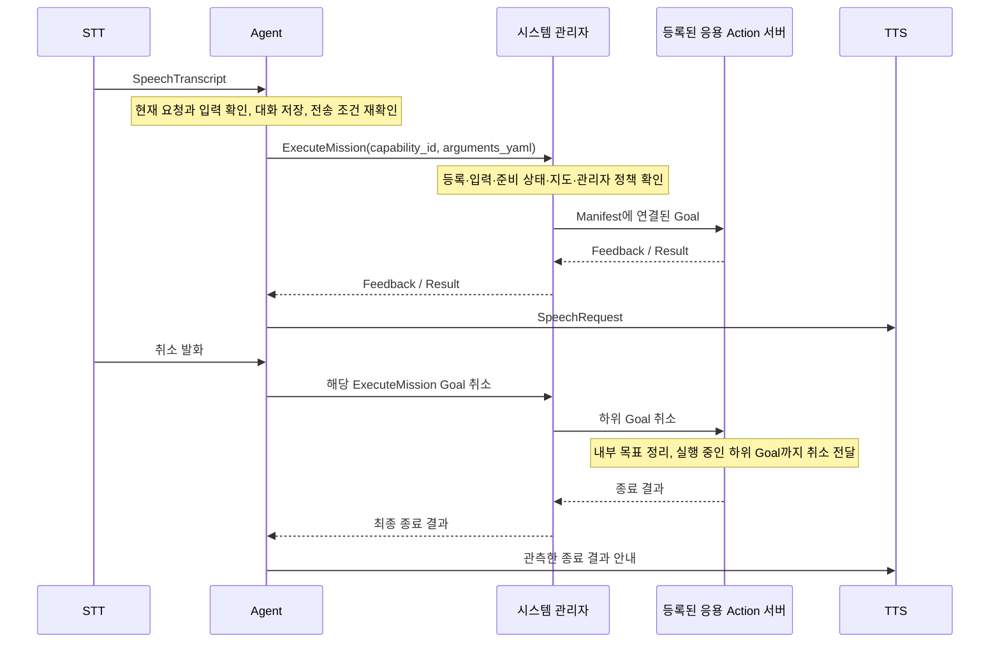

# Manager 음성 명령 기능 명세

## 1. 목적과 적용 범위

사용자의 음성 요청으로 장소 이동·사람 따라오기·순찰을 실행하고 해당 작업을 취소한다.
`malbut_agent_server`가 요청을 해석하고, `malbut_system_manager`가 등록된 응용 기능을 실행한다.
패키지 사이의 합의 대상은 기능 책임, 공개 ROS 계약, 최소 등록 정보다.
내부 알고리즘과 폴더 구조는 각 패키지 담당자가 결정한다.

작성 기준은 사용자가 제공한 [응용 패키지 책임 및 인터페이스 확정](https://app.notion.com/p/3cfc6013131b8077a8fcd3bbab52d039)이다.
공개 호출 형식과 등록 정보는 [인터페이스 정의](MANAGER_VOICE_INTERFACE.md)에 정리한다.
실행 설정은 [음성 명령 운영 안내](MANAGER_VOICE_COMMANDS.md)를 참조한다.

## 2. 패키지별 책임

| 담당 패키지·기능 | 책임 | 다른 패키지와의 연결 |
| --- | --- | --- |
| `malbut_stt` | 최종 사용자 발화와 발화 ID를 전달한다. | `SpeechTranscript` Topic 발행 |
| `malbut_agent_server` | 현재 발화의 작업과 입력을 확인하고 Manager에 요청한다. 접수·진행·종료 결과를 사용자에게 안내한다. | 발화 Topic 구독, `ExecuteMission` Action 호출, `SpeechRequest` Topic 발행 |
| `malbut_system_manager` | Manifest를 읽고 입력 형식, 기능 준비 상태, 지도 조건을 확인한다. 수락·거부·병행·선점·취소와 하위 실행을 관리한다. | `ExecuteMission` Action 제공, 등록된 Action·Service 호출 |
| Nav2의 `navigate_to_pose` 기능 | 지도상의 목표 pose까지 이동한다. 경로 계획·제어·복구·주행 취소를 수행한다. | 표준 `NavigateToPose` Action 제공 |
| `malbut_tracking` | 선택된 사람을 추적하고 희망 거리를 유지한다. 대상 선택과 추적 상태를 관리한다. | `FollowPerson` Action 제공 |
| `malbut_patrol` | 선택한 저장 지도에서 관측 위치를 정해 순찰한다. 진행 중인 Nav2 Goal과 관측 결과를 관리한다. | `Patrol` Action 제공 |
| `malbut_tts` | Agent가 발행한 안내 텍스트를 재생한다. | `SpeechRequest` Topic 구독 |
| `malbut_interfaces` | 프로젝트 전용 ROS 자료형과 중앙 Capability Manifest를 제공한다. | `.action/.srv/.msg`, `capabilities/*.yaml` 설치 |

응용 패키지 간 통신은 공개 Topic·Service·Action을 사용한다.
Agent는 기능 ID와 Goal 입력을 Manager에 전달하며, 응용 패키지의 내부 모듈을 호출하거나 이동 제어를 직접 수행하지 않는다.
요청의 의미와 형식 검증은 Agent와 Manager가 수행하고, 조건부 입력·수치 범위·실제 실행 가능성은 해당 Action 서버가 검증한다.
반복 조정하는 안전 한계와 알고리즘 튜닝값은 기능 서버의 ROS parameter로 관리한다.

## 3. 기능 요구사항

| ID | 기능 | 요청 예 | 동작과 입력 조건 |
| --- | --- | --- | --- |
| VOICE-01 | 장소 이동 | 거실로 가줘 | 등록된 장소 이름을 현재 선택한 지도에 연결된 목표 pose로 변환하여 `navigate_to_pose`를 요청한다. |
| VOICE-02 | 사람 따라오기 | 따라와 | `follow_person`에 현재 보이는 사람 선택과 희망 거리 1.0 m를 전달한다. 보이는 사람이 발화자라는 신원 보장은 없다. |
| VOICE-03 | 순찰 | 순찰해 / 꼼꼼하게 순찰해 | `patrol`에 요청한 꼼꼼함을 전달한다. 명시가 없으면 인터페이스의 보통 수준을 사용한다. |
| VOICE-04 | 작업 취소 | 멈춰 / 취소해 | 같은 Agent 프로세스가 음성으로 시작한 모든 미종료 이동·따라오기·순찰 Goal의 취소를 요청한다. |
| VOICE-05 | 상태 안내 | 실행 요청 이후 | Manager의 접수·진행·종료 관측에 맞춰 안내한다. 취소 접수와 취소 완료를 구분한다. |
| VOICE-06 | 중복 방지 | 같은 발화 재수신 | 동일 발화와 동일 전송 준비 결과로 실행을 반복하지 않는다. 결과가 불명확해도 자동 재전송하지 않는다. |

한 번의 발화에서는 현재 직접 요청한 작업 하나만 처리한다. 인용·가정·예약·복합 작업과 부정된 시작 요청은 실행하지 않는다.
`따라오지 마`, `순찰하지 마`는 취소 요청으로 처리할 수 있다.
상대 이동·회전, 등록된 특정 인물 선택, 발화자가 지정한 임의 좌표·속도·Behavior Tree는 이번 범위에 포함하지 않는다.

장소 이동에는 별도 목적지 설정이 필요하다. 등록된 이름을 확인할 수 없으면 전체 이동 요청을 다시 받는다.
예를 들어 목적지를 되묻더라도 `거실`이라는 답변만으로 실행하지 않고 `거실로 가줘`라는 현재 요청을 받는다.
설정된 지도와 Manager가 선택한 지도가 일치해야 하며, 전송 전 지도·목적지가 변경되면 요청을 폐기한다.
지도 설정이 있다는 사실만으로 위치 추정 정확도나 경로 도달 가능성을 보장하지 않는다.

## 4. 실행과 취소 흐름

Agent는 따라오기·순찰 종료를 기다리며 다음 발화를 막지 않는다. 실행 중에도 취소 발화를 받을 수 있다.
Manager 요청 전에는 요청 만료, 대화·기억 변경, 상황 확인 대화에 의한 선점 여부를 다시 확인한다.

음성 취소 범위에는 웹·개발 명령·날씨·상황 확인 작업이 포함되지 않는다.
Agent 재시작 후에는 이전 프로세스의 Goal handle을 복원하지 않으므로 이전 작업을 새 음성 세션에서 취소한다고 보장하지 않는다.
결과 불명 작업은 같은 프로세스에서 늦은 결과와 취소를 관측할 수 있도록 유지한다.

## 5. 성공·실패·취소 판정

| 상황 | 판정 및 안내 기준 |
| --- | --- |
| Goal 접수 | Manager가 요청을 받았다는 뜻이다. 이후 입력·실행 조건 검사에서 실패할 수 있다. |
| 진행 중 | Manager가 전달한 Feedback 상태를 사용한다. 모델이 생성한 문장으로 시작·완료를 확정하지 않는다. |
| 성공 종료 | 기능 서버가 성공 여부를 판정하고 Agent는 Manager의 ROS Action 성공 종료 상태를 안내한다. 따라오기는 지속 작업이므로 목표를 발견했다는 이유만으로 완료 처리하지 않는다. |
| 실패 종료 | Manager의 검사·실행 실패 또는 하위 Action의 실패 종료를 전달한다. 기능별 상세 사유는 Result에 따른다. |
| 취소 접수 | 취소를 요청했거나 접수했다는 사실만 안내하며, 아직 종료 확인 전임을 구분한다. |
| 취소 종료 | 하위 실행 정리와 종료가 확인된 뒤 Manager가 전달한 최종 취소 결과를 사용한다. |
| 통신 결과 불명 | 완료·실패·물리 정지로 추정하지 않는다. 시작 요청을 자동 재전송하지 않는다. |

기능별 상세 결과는 `result_yaml`로 전달된다. 현재 음성 안내는 Manager의 종료 상태와 진단 사유를 사용하며 상세 Result를 별도 해석하지 않는다.
현재 하위 기능의 종료 동작은 다음과 같다.

| 기능 | 성공 | 실패·거절 | 취소 |
| --- | --- | --- | --- |
| 장소 이동 | Nav2가 목표 도달을 성공으로 반환 | Nav2가 Goal을 거절하거나 주행 실패로 종료 | Nav2 Goal의 최종 취소 결과 확인 |
| 따라오기 | 지속 실행하며 자동 성공 종료 없음 | 잘못된 대상 선택·거리나 중복 Goal은 거절. 대상 발견·유실 자체는 완료 판정이 아님 | 보유한 하위 이동 Goal의 종료를 확인하고 취소 상태로 종료 |
| 순찰 | 요청한 관측 목표와 접근 가능한 방 방문을 달성 | 관측 후보 고갈로 목표 미달, 지도 변경, 센서·TF·주행 오류 등은 부분 결과와 함께 실패 | 진행 중인 하위 Nav2 Goal 종료를 확인하고 취소 상태로 종료 |

각 기능의 성공·실패·취소 조건과 Goal·Result·Feedback 필드의 최종 기준은 해당 ROS 인터페이스다.
기존 IDL에 부족한 의미·단위·종료 조건 주석을 보완하거나 필드를 바꾸는 작업은 해당 기능의 인터페이스 변경으로 다룬다.

## 6. Capability 등록과 관리자 정책

음성은 기존 기능을 호출하는 입력 경로다. `navigate_to_pose`, `follow_person`, `patrol` 등록을 재사용한다.
음성 명령용 중복 Capability, `ExecuteMission`을 다시 호출하는 Capability, 취소 전용 Capability를 추가하지 않는다.
STT·Agent·TTS처럼 상시 실행되는 노드는 Bringup에서 실행한다.

세 기능의 현재 Manifest는 기본 실행 형태와 우선순위를 `FOREGROUND`, `NORMAL`로 등록하고 `BASE` 자원을 선언한다.
Manifest는 기본 등록 정보이며, 실제 수락·거부·병행·선점과 충돌 관계는 별도의 Manager 정책이 결정한다.
전경 기능이라는 이유만으로 시스템 전체에서 하나만 실행할 수 있다고 규정하지 않는다.

현재 저장소는 공통 등록 항목 외에 선택적 `execution.map_requirement`를 지원한다.
세 기능의 `SELECTED` 값과 적용 조건은 [저장소 공통 규격](../../../APPLICATION_INTERFACE_RULES.md)에 따른다.
이 항목은 사용자가 제공한 기본 Manifest 구조에 없는 저장소 확장이다.

## 7. 수용 기준과 검증 범위

| 검증 항목 | 수용 기준 |
| --- | --- |
| 정상 호출 | 발화에 맞는 기존 Capability와 실제 Goal 필드로 Manager를 호출한다. |
| 입력 검증 | 미등록 목적지, 잘못된 인자, 현재 발화와 다른 작업은 실행하지 않는다. |
| 전송 직전 조건 | 지도·목적지·대화·기억 변경이나 만료가 있으면 아직 보내지 않은 Goal을 전송하지 않는다. |
| 취소 전파 | 실행 중에도 취소 발화를 처리하고, Manager에서 하위 Action까지 취소가 전달된다. |
| 결과 안내 | 접수·진행·성공·실패·취소·불명을 구분하며 취소 접수를 종료로 안내하지 않는다. |
| 중복·장애 | 재수신, 늦은 응답, TTS 발행 실패로 시작 Goal을 중복 전송하지 않는다. |
| 등록 검증 | ID·명령 이름 중복, ROS 타입·입력 필드·기본값과 실행 등록값을 검증한다. |

현재 검증은 고정 Provider를 사용하는 Agent 시험과 실제 Manager·시험용 하위 Action 서버의 ROS 통합 시험을 포함한다.
실물 주행과 실제 마이크·LLM·스피커를 연결한 전체 과정은 별도 실환경 검증 대상이다.
