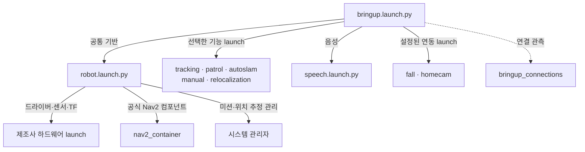
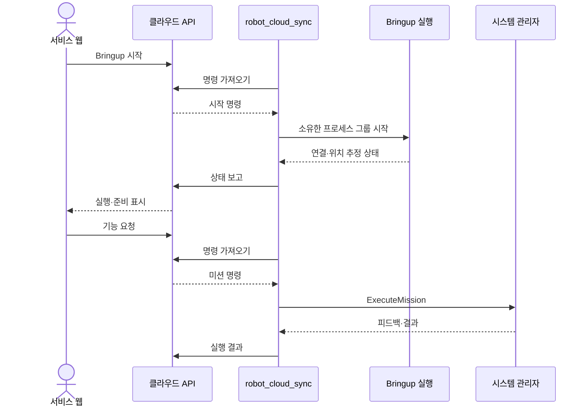
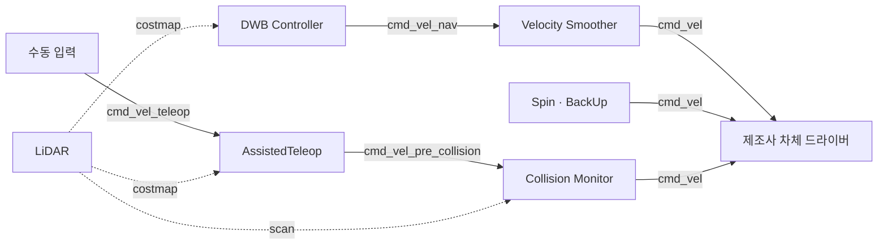

# Malbut Bringup

ROSOrin 실로봇의 **하드웨어·주행 기반과 기능별 ROS 노드를 연결하는 실행 구성 패키지**입니다.
ROS 2 Humble / Jetson Orin NX를 기준으로 제조사 드라이버를 재사용하고,
Nav2와 Malbut 응용 기능을 한 로봇에서 함께 실행합니다.

Bringup은 알고리즘이나 미션 정책을 구현하는 곳이 아닙니다.
**무엇을 실행하고 어떻게 연결할지**는 이 패키지가,
**어떤 기능을 실행·취소할지**는 시스템 관리자가,
**실제로 어떻게 동작할지**는 각 기능 패키지가 담당합니다.

[운영 가이드](README_OPERATIONS.md) · [음성 구성](README_SPEECH.md) ·
[웹 연결](README_WEB.md)

## 실행 구조

`bringup.launch.py`는 선택한 모듈들을 포함하는 통합 진입점입니다.
공통 기반은 `robot.launch.py`에, 응용 기능은 기능별 launch에 둡니다.



그림에서 함께 적은 기능도 **각각 독립된 launch 파일**입니다.

| Launch | 소유하는 구성 | 주요 연결 |
| --- | --- | --- |
| [robot](launch/robot.launch.py) | 차체·센서·TF·오도메트리, Nav2, Zone, 시스템 관리자 | 제조사 하드웨어, `/scan_raw`, `/odom` |
| [tracking](launch/tracking.launch.py) | YOLO·사람 ID·RGB-D 위치 추정, LiDAR 보조 추정, 추적 서버 | RGB·Depth·CameraInfo, TF, Nav2 Action |
| [patrol](launch/patrol.launch.py) | 순찰 서버 | 지도·costmap·영상, Nav2 Action |
| [autoslam](launch/autoslam.launch.py) | 탐색 서버·지도 저장 서버 | 지도, Nav2, 관리자의 SLAM 시작·종료 서비스 |
| [manual](launch/manual.launch.py) | 수동 입력 adapter·제조사 조이스틱 | `/cmd_vel_teleop`, 관리자, AssistedTeleop |
| [relocalization](launch/relocalization.launch.py) | 위치 보정 Action 서버 | AMCL, LiDAR·지도, Nav2 Spin |
| [speech](launch/speech.launch.py) | STT·Agent·TTS, 날씨·키 동기화 | 마이크·스피커, 대화 Topic·Action, 관리자 |
| [fall](launch/fall.launch.py) | Pose·Cloud VLM·낙상 코디네이터, 사건 업로더 | 공통 영상, 감지 설정·동의, 관리자, 클라우드 |
| [homecam](launch/homecam.launch.py) | 홈캠 미디어 에이전트 | 공통 영상·음성, KVS, 클라우드 |
| [cloud](launch/cloud.launch.py) | 웹 명령·상태 브리지 | 기기 인증, 웹 API, 소유한 Bringup |

### 독립 실행의 의미

- 기능 launch는 외부 Topic·TF·Action의 준비 완료를 **다음 모듈의 시작 조건으로 삼지 않습니다**.
  필요한 상대가 없으면 실제 작업을 수행할 수 없지만, 상대를 기다린다는 이유로 노드 생성부터 막지 않습니다.
- 모델·Python·설정 파일 등 자기 실행에 필요한 로컬 준비는 확인합니다.
  통합 실행의 모듈 설정 오류는 해당 모듈의 실패로 기록하고 나머지 모듈은 실행합니다.
- 노드를 켜는 것과 기능을 요청하는 것은 다릅니다.
  예를 들어 AutoSLAM 서버를 켜도 탐색이나 SLAM Toolbox를 바로 시작하지 않습니다.
- **Launch 하나가 프로세스 하나인 것은 아닙니다.**
  기능 launch에는 여러 프로세스가 들어갈 수 있고, Nav2의 여러 노드는 하나의
  `component_container_isolated` 프로세스에 구성됩니다.

통합 실행은 인식·순찰·AutoSLAM·수동 입력·위치 보정·음성을 기본 포함합니다.
홈캠은 백엔드 환경이, 낙상은 실행 설정 파일이 있을 때 `auto`로 포함됩니다.
모듈 선택과 인자 기본값은 [launch_support.py](malbut_bringup/launch_support.py)에 있습니다.

## 웹과 실행 소유권

`cloud.launch.py`는 **브리지만 켜고 대기**합니다.
웹 연결만으로 센서·응용 노드를 켜거나 이동 미션을 요청하지 않습니다.



미션의 자원·우선순위·취소 정책은
[시스템 관리자](../malbut_system_manager/README.md)가 담당합니다.
브리지의 Bringup 시작·종료와 로그 파일 소유권은
[web_runtime.py](malbut_bringup/web_runtime.py)에 있습니다.
웹 종료는 자신이 켠 실행을 정리하며, 외부에서 켠 드라이버까지 종료하지 않습니다.

## 지도와 SLAM의 실행 수명

별도 “지도 없는 Nav2”를 만들지 않고 같은 map_server·AMCL·Nav2 구성을 사용합니다.
저장 지도를 지정하지 않으면 [기본 지도](config/default_map.yaml)를 로드합니다.
기본 지도는 **20×20 m, 해상도 0.05 m, 모든 칸이 미확인**이며,
실제 집의 벽이나 절대 위치를 알려 주는 지도는 아닙니다.

```mermaid
stateDiagram-v2
    [*] --> Default
    state "기본 지도 + AMCL" as Default
    state "SLAM Toolbox로 지도 작성" as Mapping
    state "저장 지도 + AMCL" as Saved
    Default --> Mapping: AutoSLAM 요청
    Saved --> Mapping: AutoSLAM 요청
    Mapping --> Default: 완료·취소·실패 / SLAM 종료
    Default --> Saved: 저장 지도 선택 / 위치 보정
    Saved --> Saved: 다른 지도 선택 / 위치 보정
```

- 시스템 관리자가 `map→odom`을 제공하는 위치 추정 주체를 하나만 유지합니다.
  지도 작성 시 map_server·AMCL을 정리하고 SLAM Toolbox를 실행합니다.
- AutoSLAM은 탐색과 지도 저장을 맡으며, SLAM 시작·종료는 관리자 서비스로 요청합니다.
  완료·취소·실패 후에는 SLAM을 종료하고 기본 지도·AMCL로 돌아옵니다.
  만든 지도는 저장 지도 목록에서 선택합니다.
- 저장 지도 선택 시 기존 위치 기록을 활용하거나 전역 위치 보정을 수행합니다.
  이 과정은 제자리 회전을 포함할 수 있습니다.
- 노드 연결 완료와 저장 지도에서의 위치 확정은 다른 상태입니다.
  지도와 위치 추정이 필요한 미션의 허용 조건은 관리자가 따로 판단합니다.

| 인터페이스 | 역할 |
| --- | --- |
| `/malbut/localization/start_mapping` | SLAM 시작 |
| `/malbut/localization/stop_mapping` | SLAM 종료·기본 지도 복원 |
| `/malbut/localization/load_map` | 저장 지도 로드·위치 보정 |
| `/malbut/localization/state` | 위치 추정 모드·지도·결과 표시 |

세부 전환 조건은 [위치 추정 운영 안내](README_OPERATIONS.md#위치-추정-전환),
탐색 알고리즘은 [AutoSLAM](../malbut_autoslam/README.md),
위치 보정은 [Relocalization](../malbut_relocalization/README.md)에 있습니다.

## Nav2와 주행 입력

공식 Nav2 컴포넌트를 [nav2_stack.py](malbut_bringup/nav2_stack.py)에서 구성합니다.
제조사 navigation launch를 중복 포함하지 않습니다.
Malbut의 추가 배선은 **수동 조작용 별도 behavior 서버**, **Zone 필터**,
**위치 보정 회전을 지원하는 lifecycle 순서**입니다.



자율 주행의 충돌 회피는 DWB·costmap이 맡습니다.
Collision Monitor는 **수동 조작 경로에만** 연결됩니다.

| 구성 | 현재 설계 |
| --- | --- |
| 지도·위치 추정 | map_server·AMCL, 지도 작성 중에는 SLAM Toolbox |
| 경로·제어 | Navfn planner, DWB controller, velocity smoother |
| 장애물 | Local·Global costmap 모두 LiDAR 기반 |
| 차체 외곽 | 0.277×0.212 m 직사각형 footprint |
| Zone | 지도별 금지·우회 권장 구역을 keepout 마스크로 적용 |
| Depth | 사람 위치 추정에 사용. Depth costmap·원본 점군 구독은 기본 제외 |

주행 파라미터는 [nav2_params.yaml](config/nav2_params.yaml),
SLAM 파라미터는 [slam_toolbox.yaml](config/slam_toolbox.yaml)에 있습니다.
Depth costmap 제외 근거는 [영상·점군 운영 안내](README_OPERATIONS.md#depth-costmap을-쓰지-않는-이유),
주행 설정 세부사항은 [주행 운영 안내](README_OPERATIONS.md#주행-설정장애물-입력)에 보존했습니다.

## 영상·음성·낙상 연결

카메라는 공통 하드웨어가 한 번 실행하고, 추적·낙상·홈캠이 같은 Topic을 구독합니다.
STT와 홈캠이 XFM 마이크 0번을 함께 쓰는 통합 구성에서는 PulseAudio 입력 공유를 적용합니다.

| 설정 | 적용 범위 | 목적 |
| --- | --- | --- |
| [카메라 DDS XML](config/fastdds_camera.xml) | Bringup이 시작하는 제조사 하드웨어 그룹 | SHM 4 MiB, UDPv4 유지 |
| [Nav2 DDS XML](config/fastdds_nav2.xml) | `nav2_container` 프로세스 | `send_buffers.dynamic=true` |
| [마이크 입력 공유](malbut_bringup/speech_audio.py) | STT·홈캠 | 같은 입력을 두 소비자에게 전달 |
| 낙상 전용 Python | Pose 노드 | 준비된 ONNX Runtime에서 `auto`로 CUDA 우선 선택 |
| 낙상 실행 ID 묶음 | 홈캠·코디네이터·VLM·Pose | 같은 실행 회차의 설정·상태 연결 |

DDS 설정은 위 범위에만 적용하며 다른 모듈의 QoS·발행 주기를 함께 바꾸지 않습니다.
외부에서 이미 실행한 카메라에는 Bringup의 환경 설정이 적용되지 않습니다.

낙상 노드 실행과 감지·클라우드 전송 허용은 별개입니다.
실제 감지는 카메라·감지 설정·코디네이터 연결을, 클라우드 분석은 전송 동의도 확인합니다.
사건 업로더는 별도 CLI 프로세스로 로컬 기록과 클립 메타데이터를 전송하며,
KVS 영상 녹화 자체를 대신하지 않습니다.
설정 연결은 [fall_setup.py](malbut_bringup/fall_setup.py), 전체 조건은
[낙상 운영 안내](README_OPERATIONS.md#cloud-vlm-자동-실행)에 있습니다.

사람 인식 원본은 OSNet 백엔드를 지원합니다.
다만 현재 **실기기 적용본은 외형 특징 계산을 생략하고 박스·이동 기반 ID 추적을 유지**합니다.
launch 인자에 OSNet 모델이 있다고 해서 실기기에서 외형 재식별이 활성화된 것은 아닙니다.

## 연결 상태와 준비 표시

통합 launch의 `bringup_connections`는 1초 주기로 선택한 구성의 연결을 관측합니다.

| 관측 대상 | 확인 방법 |
| --- | --- |
| 응용 노드 초기화·응답 | `get_parameters` 서비스 응답 |
| Nav2 활성 상태 | lifecycle `get_state` 응답 |
| 기능 서버 | Action 연결 |
| 입력 Topic | 발행자 존재 |
| 음성 | `/malbut/speech/status` |

결과는 `/malbut/bringup/status`와 `/malbut/bringup/progress`로 보내고,
웹은 연결 수·대기 항목·준비 완료를 표시합니다.
이 관측기는 **모듈 시작 순서를 통제하거나 미션을 차단하는 게이트가 아닙니다**.
구현은 [readiness.py](malbut_bringup/readiness.py)에 있습니다.

현재 범위도 구분합니다.

- 연결 확인은 센서 값·TF 시각·위치 정확도 검증을 대신하지 않습니다.
- 기존 단계형 Recovery는 새 모듈 구성에서 지원하지 않으며, 모듈별 복구 연결은 후속 작업입니다.
- Launch 종료만으로 모터 정지가 보장되지는 않습니다. 이동 취소·정지와 실제 차체 반응은 별도 확인이 필요합니다.

실기기 적용본은 통합 launch에서 [자원 기록기](../malbut_resource_monitor/README.md)를
모듈보다 먼저 시작합니다. 기록기 실패가 로봇 기능 실행을 막지는 않습니다.

## 코드와 문서 안내

| 위치 | 내용 |
| --- | --- |
| [launch/](launch) | 통합·공통 기반·기능별 실행 구성 |
| [launch_support.py](malbut_bringup/launch_support.py) | 공통 인자·scoped include·모듈 설정 오류 처리 |
| [nav2_stack.py](malbut_bringup/nav2_stack.py) | Nav2 컴포넌트·remapping·lifecycle 구성 |
| [web_runtime.py](malbut_bringup/web_runtime.py) · [cloud_sync.py](malbut_bringup/cloud_sync.py) | 웹 명령·실행 소유권·상태 연결 |
| [config/](config) | Nav2·SLAM·기본 지도·DDS 설정 |
| [운영 가이드](README_OPERATIONS.md) | 최초 준비, 실행 명령, 인자, 주행·지도·Zone 설정 |
| [음성 가이드](README_SPEECH.md) | STT·Agent·TTS 준비와 연결 |
| [웹 가이드](README_WEB.md) · [실기기 클라우드 연결](../README_CLOUD.md) | 서비스 웹·기기 인증·LAN 테스트 패널 |

이 패키지는 Gazebo·시나리오 실행을 포함하지 않습니다.
실기기 적용본의 배치·빌드 방식은 [배포 구성](../README.md)에 있습니다.
