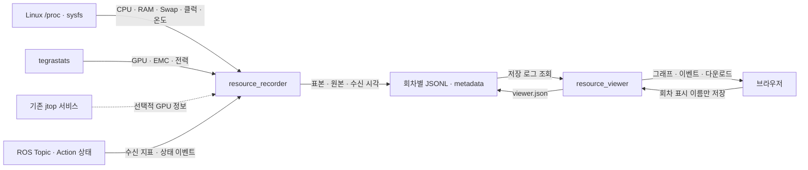
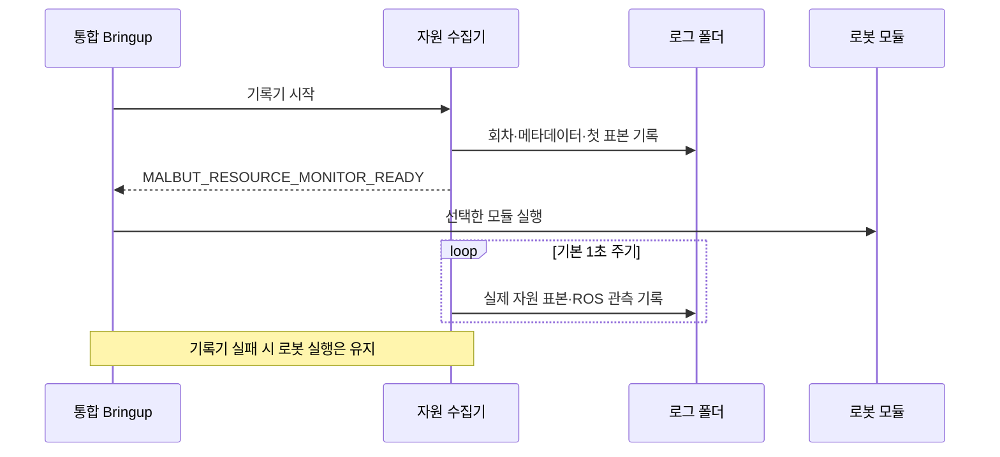
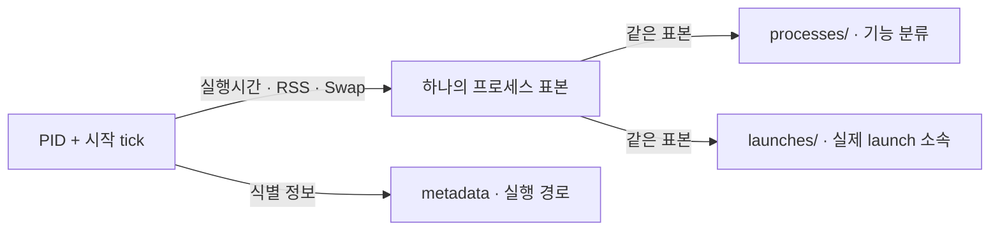

# Malbut Resource Monitor

실로봇의 **전체 자원·프로세스 자원·ROS 상태를 수집하고, 저장된 로그를 웹에서 비교하는 측정 도구**입니다.
`malbut_test`에만 포함되며, 응용 기능 안에 측정 코드를 넣지 않는 독립 패키지입니다.

수집기는 로봇에서 관측값을 기록하고, 별도 뷰어는 그 기록을 읽어 보여 줍니다.
Goal·취소·Service 요청·주행 명령·파라미터 변경을 보내지 않습니다.
성능 측정값과 수집기 자체의 오류·미지원 진단을 구분합니다.

[운영 가이드](README_OPERATIONS.md) · [실기기 배포 구성](../README.md) ·
[Bringup 설계](../malbut_bringup/README.md)

## 수집·저장·시각화 구조



| 구성 | 역할 |
| --- | --- |
| [collector.py](malbut_resource_monitor/collector.py) | 수집 주기·종료·Linux/Jetson/ROS 수집 연결 |
| [resources.py](malbut_resource_monitor/resources.py) | 장치·프로세스 자원, 실행 경로·launch 소속, tegrastats 원본·해석 |
| [gpu.py](malbut_resource_monitor/gpu.py) | 기존 jtop 서비스의 읽기 전용 관측 |
| [ros_observer.py](malbut_resource_monitor/ros_observer.py) | Topic 수신량, Action·미션·음성 상태 관측 |
| [store.py](malbut_resource_monitor/store.py) | 회차 생성·JSONL 추가 기록·시각·메타데이터 |
| [viewer.py](malbut_resource_monitor/viewer.py) · [viewer.html](malbut_resource_monitor/viewer.html) | 로그 조회 서버·페이지·그래프·회차 이름 |

뷰어는 ROS나 로봇 연결 없이도 가져온 로그 폴더를 열 수 있습니다.
서비스 웹의 로봇 제어 화면과는 별도 프로그램이며, AWS 배포가 필요한 웹 앱이 아닙니다.

## Bringup과 수집기의 수명

실기기 `bringup.launch.py`는 기본적으로 기록기를 먼저 시작합니다.
첫 표본을 기록하고 준비 신호를 받으면 선택된 로봇 모듈을 실행합니다.



- 기록기가 먼저 종료되면 경고 후 로봇 모듈을 실행합니다.
  10초 안에 준비 신호가 없을 때도 모듈 실행을 진행하며, 측정 시작은 보장하지 않습니다.
- 실행 중 기록기 오류나 디스크 여유 256 MiB 미만은 **수집만 중단**시킵니다.
  로봇 기능 종료·복구·재시작을 요청하지 않습니다.
- 이 연결은 통합 Bringup에 있습니다. 개별 기능 launch의 수집은 별도로 실행해
  해당 launch PID를 지정합니다. 뷰어는 launch를 실행하지 않습니다.
- 수집기 준비는 모든 센서·GPU 값이 유효하다는 뜻이 아닙니다.
  차이가 필요한 CPU 지표는 첫 표본에서 값이 없을 수 있습니다.

실행 연결은 [launch_support.py](malbut_resource_monitor/launch_support.py),
통합 인자는 [실기기 Bringup](../malbut_bringup/launch/bringup.launch.py)에 있습니다.

## 무엇을 측정하는가

| 지표 | 출처 | 의미·단위 |
| --- | --- | --- |
| 전체·코어별 CPU | `/proc/stat` 표본 차이 | 전체 장치=100%, 코어별 사용률 |
| 프로세스 CPU | `/proc/PID/stat` 실행시간 차이 | 코어 하나=100%. 여러 코어를 쓰면 100% 초과 가능 |
| 전체 RAM·Swap | `/proc/meminfo` | RAM은 Total−Available, Swap은 Total−Free, MiB |
| 프로세스 RAM·Swap | `/proc/PID/status` | RSS·VmSwap, MiB |
| CPU 클럭·온도 | sysfs cpufreq·thermal | MHz·°C, 코어·센서별 |
| GPU 사용률·클럭 | tegrastats, 선택적 jtop | 장치 사용률 %·클럭 MHz |
| 프로세스 GPU 메모리 | jtop 프로세스 관측 | MiB. 프로세스 GPU 연산 사용률과 다름 |
| 메모리 대역폭 관련 지표 | tegrastats EMC_FREQ | 현재 EMC 클럭 기준 사용률 %·클럭 MHz. GB/s가 아님 |
| 전력 | tegrastats의 rail별 값 | 순간·평균 mW. Jetson 측정이며 모터 포함 로봇 전체 전력이 아님 |
| Topic 수신 | raw CDR 메시지 | 수신 Hz·직렬화 바이트/s·마지막 수신 경과시간 |
| 실행·음성 상태 | 기존 ROS 상태 Topic | Action UUID·상태 변화·미션 ID·STT/TTS 이벤트의 수신 시각 |

프로세스 RSS에는 공유 페이지가 포함되므로 합산해서 물리 RAM으로 해석하지 않습니다.
전력 rail도 서로 범위가 겹칠 수 있어 합산하지 않습니다.

### Jetson GPU의 관측 범위

장치 GPU 사용률은 tegrastats에서, 프로세스 GPU 메모리는 선택적 jtop에서 가져옵니다.
현재 수집기는 **Jetson의 프로세스별 GPU 연산 사용률(%)을 제공하지 않습니다**.
장치 사용률을 PID별로 배분하거나 GPU 메모리를 사용률로 바꾸지 않습니다.

jtop은 수집기 Python의 패키지와 접속 가능한 기존 서비스가 필요합니다.
자동 설치하거나 클럭·팬·전력 설정을 바꾸지 않습니다.
연결 실패·표본 만료·PID 미관측은 빈 값으로 남기고 원인과 표본 나이를 기록합니다.
jtop과 CPU 표본은 별도 시점의 관측이므로 정확히 동시 측정된 값으로 취급하지 않습니다.

## 프로세스 식별과 두 가지 분류

개별 자원 측정의 기준은 ROS 노드명이 아니라 **PID + 프로세스 시작 tick**입니다.
같은 PID가 재사용되어도 이전 프로세스의 표본과 구분합니다.

수집 대상은 지정한 launch와 자손, 이미 추적 중인 같은 프로세스,
별도로 실행된 Malbut 경로의 프로세스를 포함합니다.
실행 파일·entrypoint·명시된 ROS 노드명은 메타데이터에 저장하지만
전체 명령 인자와 환경변수는 저장하지 않습니다.

| 보기 | 소속을 정하는 방법 |
| --- | --- |
| 기능별 | 실행 파일·ROS 이름 기반 표시 분류 |
| launch별 | 자식 프로세스가 상속한 `MALBUT_MEASUREMENT_LAUNCH` 표시 |
| 소속 미기록 | launch 표시가 없을 때. 이름으로 launch를 추정하지 않음 |
| 측정기 | 수집기·측정 관련 프로세스의 별도 표시 |



기능별·launch별 로그는 **같은 표본의 다른 보기**이므로 두 종류를 합산하지 않습니다.
Nav2처럼 여러 ROS 노드가 하나의 컨테이너에서 실행되면 하나의 공유 프로세스로 측정합니다.
planner·controller별 사용량을 임의로 나누지는 않습니다.

범례의 이름은 저장된 노드명·실행 파일명에서 가져오고 PID는 보조 정보로 표시합니다.
이름을 알 수 없는 과거 기록을 현재 PID의 이름으로 덮어쓰지 않습니다.

## 시간과 실행 이벤트

| 시간 값 | 기준 |
| --- | --- |
| `t` | 회차 시작 이후 monotonic 초 |
| `wall_ns` | 표본·이벤트를 기록하는 시점의 Unix 나노초 |
| `accepted_ros_ns` | Action 서버가 상태 메시지에 넣은 ROS 시각 |
| `sample_window_s` | 실제 자원 표본 간격 |
| `collection_duration_ms` · `schedule_lateness_ms` | 수집 소요·예정 주기 대비 지연 |

자원 주기는 기본 1초지만 계산에는 실제 경과시간을 사용합니다.
늦어진 주기를 가짜 표본이나 밀린 샘플의 연속 기록으로 채우지 않습니다.
ROS 시각과 monotonic·wall 시각을 서로 빼서 지연시간을 만들지 않습니다.

Action은 `/_action/status`를 구독해 UUID별 상태 변화를 기록합니다.
**관측한 실행 구간**은 확인할 수 있지만, 실제 요청 전송·모터 시작·Service 완료 시각은
이 상태 구독만으로 알 수 없습니다. 관측 전에 끝난 Goal은 과거 종료 상태의 첫 수신으로 표시합니다.
관리자 목록에서 미션이 사라진 것은 `NO_LONGER_LISTED`로 기록하며 성공으로 바꾸지 않습니다.

음성은 최종 STT 문장·TTS 요청 문장·재생 상태를 별도 이벤트로 기록합니다.
같은 `playback_id`로 확인되는 요청과 상태만 연결하고,
STT와 답변을 시간순으로 임의 짝짓거나 요청 문장이 실제로 재생됐다고 단정하지 않습니다.
원본 오디오는 녹음하지 않지만 대화 텍스트는 저장합니다.

## 회차별 로그 구조

기본 위치는 `~/.ros/malbut/resource_logs/<UTC시각>-<고유번호>/`입니다.
회차마다 새 폴더를 만들고 관측 채널에 JSONL을 추가 기록합니다.

```text
<session>/
├── metadata.json       # 기준·호스트·단위·채널·프로세스 식별/경로·종료 정보
├── viewer.json         # 사용자가 저장한 회차 표시 이름
├── system.jsonl        # 장치 전체·코어별 자원, 수집 시간·지연
├── processes/*.jsonl   # 기능 분류별 프로세스 표본
├── launches/*.jsonl    # 동일 표본의 launch별 보기
├── topics/*.jsonl      # Topic별 실제 수신 지표
├── actions/*.jsonl     # Action별 UUID·상태 변화·수신 시각
├── missions.jsonl      # 관리자 미션 ID·기능·상태 관측
├── phases/*.jsonl      # 음성 단계·ID·상태
├── speech.jsonl        # STT 본문·TTS 요청·재생 상태
├── tegrastats.jsonl    # NVIDIA 원본 측정 줄
└── observer.jsonl      # 수집기 진단·미지원 기록
```

모든 채널이 항상 파일로 존재하는 것은 아니며, 해당 기록이 들어올 때 생성됩니다.
이전 회차를 지우지 않고 사용자 전용 권한으로 기록합니다.
정상 종료 메타데이터가 없으면 수집 중인지 강제 종료됐는지 확정하지 않습니다.

## 로그 뷰어

| 페이지 | 비교·확인 대상 |
| --- | --- |
| 전체 자원 | 여러 지표를 체크하고 %·MiB·MHz·°C·mW 등 같은 단위끼리 묶어 비교 |
| launch별·기능별 | 그룹·프로세스 곡선 선택, 색·선 모양·이름·경로 확인 |
| 토픽 | 수신 Hz·CDR 크기·마지막 수신 경과시간 |
| 음성 대화 | STT 문장·TTS 요청·재생 상태 |
| 실행 기록 | Goal별 관측 구간·최종 관측 상태, 자원 그래프의 상태 변화선 |
| 프로세스 / 원본 | 실행 경로·식별 정보·원본 JSONL |

브라우저는 기본 2초 간격으로 변경을 확인하고 ETag를 사용해 변경 없는 응답을 재전송하지 않습니다.
숨긴 탭에서는 조회를 쉬고, 연결 실패 때는 현재 표시를 유지한 채 재시도합니다.
페이지·회차·시간 구간·체크 상태·스크롤은 같은 브라우저에 저장해 새로고침 후 복원합니다.
회차 표시 이름은 `viewer.json`에 분리 저장하며 원본 표본·수집 메타데이터는 수정하지 않습니다.
체크는 **그래프 표시 선택**이며 로봇 기능의 실행·정지 명령이 아닙니다.

그래프는 실제 표본을 점과 연결선으로 표시하며 보간·평활화·누락값의 0 채우기를 하지 않습니다.
구간 조회는 로그별 최근 50,000행까지, 음성 화면은 그중 최신 300개 이벤트를 표시합니다.
잘림·손상 행은 알리고 원본 전체 JSONL을 내려받을 수 있습니다.

뷰어는 기본 localhost 바인딩이며 인증 기능이 없습니다.
LAN 공개는 신뢰하는 네트워크에서만 사용하고, 대화 텍스트 등 개인정보가 담긴 로그를 확인합니다.

## 측정 부하와 값의 해석

일반 Topic은 `BEST_EFFORT / VOLATILE / depth=1`,
음성 이벤트는 `BEST_EFFORT / VOLATILE / depth=50`,
Action 상태는 `RELIABLE / TRANSIENT_LOCAL / depth=1`로 관측합니다.

Topic 수신 Hz는 수집기에서 실제 받은 비율이지 publisher의 발행률이나 네트워크 전송률 자체가 아닙니다.
구독되지 않은 Topic은 값이 없고, 구독된 측정 구간에 수신이 없으면 0 Hz입니다.
추가 구독에는 DDS 전달·CPU 비용이 있어 원본 대형 PointCloud2는 기본 목록에서 제외했습니다.

수집기·tegrastats의 비용은 측정기 그룹과 수집 소요를 함께 봅니다.
추가 구독으로 publisher에 생긴 비용까지 별도로 분리해 측정하는 것은 아닙니다.
필요하면 ROS 관측을 끈 `--no-ros` 회차와 비교합니다.
측정되지 않은 값과 만료된 GPU 표본은 빈 구간으로 남기며,
수집 오류는 `observer.jsonl`의 진단이지 기능 성능 점수가 아닙니다.

## 코드·운영·검증 안내

| 위치 | 내용 |
| --- | --- |
| [topics.json](malbut_resource_monitor/topics.json) | 기본 수신 지표 관측 목록 |
| [운영 가이드](README_OPERATIONS.md) | 빌드·수집·LAN 뷰어 실행, 화면 사용법·GPU 준비·지표 해석 |
| [test_measurement.py](test/test_measurement.py) | CPU 계산·원본 단위·누락값·프로세스 식별·저장·조회 검증 |
| [test_gpu_launch.py](test/test_gpu_launch.py) | jtop 표본·PID 재사용·launch 소속 검증 |
| [test_ros_observer.py](test/test_ros_observer.py) | 실제 ROS Topic·Action 상태의 수신 관측 검증 |
| [test_viewer_browser.py](test/test_viewer_browser.py) · [test_viewer_speech.py](test/test_viewer_speech.py) | 페이지·선택 복원·갱신·범례·음성 연결 검증 |

Jetson의 GPU·EMC·전력 값은 실제 장치의 tegrastats 원본과 대조합니다.
이 도구의 로컬 검사와 실제 로봇 부하 측정은 구분합니다.
