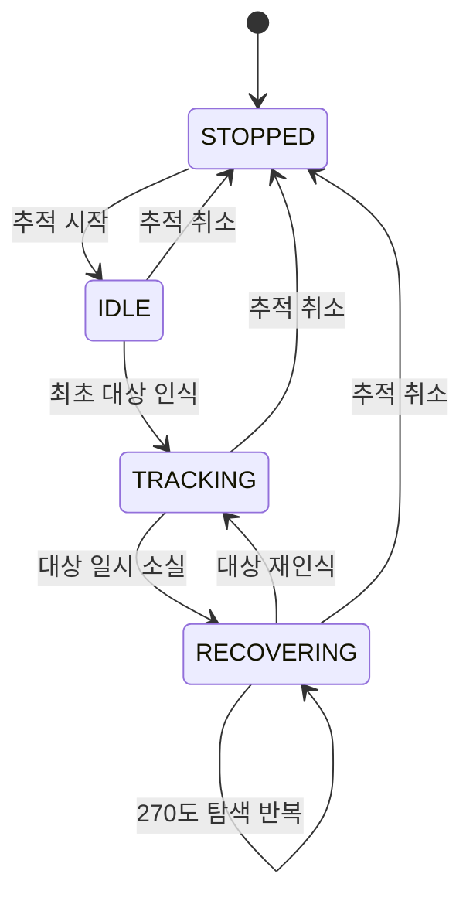

# Malbut 사람 추적 운영 가이드

기존 실행 명령, 상세 설정·탐색·재시도 동작과 측정 기준을 보존한 문서입니다.
현재 노드 구성과 데이터 흐름은 [사람 추적 설계 개요](README.md)를 참고합니다.
실기기 적용본의 외형 재식별 비활성화 등 배포 차이도 설계 개요에서 구분합니다.

`malbut_tracking` consumes RGB-D person identities and follows one selected
target; it does not perform person recognition itself.
A map-subtracted 2-D LiDAR tracker briefly supports the same person through
camera occlusion. Gazebo entity poses are never read, and the package never
publishes velocity commands directly.

## Shared perception

`person_detection.launch.py` starts three independent nodes, once per robot:

- `malbut_yolo`: upstream `yolo_ros` → `/yolo/detections`
  (`yolo_msgs/msg/DetectionArray`).
- `malbut_reid`: matching RGB + YOLO boxes →
  `/perception/person/detections_2d` (`vision_msgs/msg/Detection2DArray`).
- `malbut_tracking/person_localizer`: those identities + aligned RGB-D →
  `/perception/person/detections_3d` (`vision_msgs/msg/Detection3DArray`).

Prepare the external source and GPU runtime as described in
[`malbut_yolo`](../malbut_yolo/README.md) before starting this stack.
YOLO/ReID run independently of the follow Action. Other consumers subscribe
to their topics directly; neither is registered as a manager mission.
Canceling/restarting FollowPerson does not clear ReID identities. The gallery
lives for the ReID process lifetime, not across process restarts.
The localizer matches the original RGB stamp after asynchronous inference;
it never substitutes a newer image/depth pair for an older detection.
Depth conversion is restricted to each person's central ROI before the same
median/dispersion calculation; it does not convert the whole frame per person.

The follower's Action, target selection, fusion, navigation policy and LiDAR
algorithm are unchanged in this packaging migration. Launch parameter scopes
are isolated so localizer/LiDAR YAML cannot overwrite the follower YAML.

## Benchmark

Simulation evaluation is isolated under `malbut_tracking/benchmark`. Select
one of `test_arena_perimeter`, `test_arena_complex`,
`small_house_front_door`, or `small_house_living_room` with the `scenario`
launch argument. `world_file`, `map_file`, `actor_file`, spawn poses, duration,
and output directory are optional overrides; a different actor SDF can be used
to evaluate another compatible humanoid appearance without changing code.

## Runtime contract

- Input detections: `/perception/person/detections_3d`
- LiDAR foreground clusters: `/perception/lidar/foreground_clusters`
- Global navigation grid: `/global_costmap/costmap_raw` (camera-ray target and
  line-fallback checks only; Nav2's planner places every tracking goal)
- Follow action: `/follow_person` (`malbut_interfaces/action/FollowPerson`)
- State: `/tracking/person/status`
- Estimated map pose: `/tracking/person/estimated_target_pose`
- RViz LiDAR track labels: `/tracking/person/lidar_tracks`
- Motion: Nav2 `ComputePathToPose`, `FollowPath`, `BackUp` (retreat), and `Spin`

The package's `lidar_foreground_preprocessor` receives `/scan`, `/map`, and TF.
It lives in `src/` alongside the Python follower, and both executables are
built and installed by this one `ament_cmake` package. Humble's C++
`laser_geometry` projects each scan into `map` while compensating for robot
motion during acquisition. The node updates the cached static-obstacle distance
field when a map message arrives, removes saved geometry through cached lookups, and publishes
only compact foreground clusters. The Python follower therefore does not loop
over raw rays or recompute scan TF, and it never searches Nav2's merged master
costmap for dynamic objects.
While measurement-time TF is pending, the C++ node retains that scan and only
the newest successor (at most two scans). This prevents continuously replacing
the waiting scan before its TF arrives. The original stamps and 0.30 s TF
wait limit remain unchanged; intermediate successors are discarded.

Map subtraction produces foreground *candidates*, not dynamic-object labels.
Only clusters inside a bounded gate around the camera-confirmed person or its
short prediction enter the planar constant-velocity tracker. Mahalanobis
gating and globally optimal Hungarian assignment preserve that target between
scan updates. New tracks remain tentative until repeated measurements confirm
them, and confirmed tracks coast for a bounded time through short occlusion.
The follower therefore does not misrepresent every scene residual as a moving
object, and LiDAR can never select a person before RGB-D establishes identity.
The global costmap remains an input only for the camera-ray target beyond the
depth range and for the short line fallback.

RGB-D is the primary long-range position source, so a visible person remains
followable even outside the LiDAR/costmap observation area. Camera-only motion
continuously derives targets from current sensor observations. The follower
asks Nav2 `ComputePathToPose` for a route to a point pulled 0.5 m from the
person toward the robot, selecting `FollowPersonAStar` (Navfn with `use_astar: true`) on the
robot. Other navigation keeps `GridBased`; the Gazebo launch explicitly uses
its existing `GridBased` Smac 2D A* planner. The person's LiDAR cells and their
inflation make that goal cell unreachable, so Nav2's planner `tolerance`
(0.5 m in the robot's `nav2_params.yaml`, `FollowPersonAStar`) ends the route
at the nearest reachable cell;
the follower does not search the costmap for a goal itself. It keeps the
route's prefix up to the first entry into the requested person-distance
circle, with the endpoint facing the person; it never shortcuts across the
planned detour. This prevents a full path toward the person's own position
from continuing until a delayed observation cancels it. No additional velocity
lookahead is applied to the planning goal; the observed person anchors range,
arrival orientation and the path cut. When Nav2 answers "no
path" (someone sitting inside furniture inflation, deeper than the tolerance),
the next attempt moves the goal `goal_pullback_step_m` (0.5 m, one planner
tolerance) along the line of sight toward the robot, repeating up to the
standoff point; the pullback is dropped once the person moves more than one
step away or the motion decision changes. A single `distance_tolerance_m=0.20`
band controls stopping and resuming: 0.80--1.20 m at the default 1.0 m distance,
without a separate release threshold. The hard minimum is never relaxed.
Nav2 owns
both translation and body rotation; there is no downstream camera-yaw mixer.
A newer path directly preempts the
running `FollowPath` goal without an explicit cancel/stop gap.
Forward/retreat reversals are different: they cancel the old motion and
invalidate its in-flight plan before planning the newest target. Uncertain
bearing-only depth cannot leave an earlier retreat running.

Robot tracking selects `FollowPerson` DWB in the existing controller server
and `person_follow_goal_checker` (0.08 m, 0.35 rad). General navigation still
uses `FollowPath` and `general_goal_checker`; frozen loss-recovery waypoints
also keep position-only arrival. Only the tracking forward-preference weight
is reduced from 40 to 10; physical speed/acceleration limits stay unchanged.
The follower's TF lookup never waits inside a sensor callback; only the newest pending image is retried
briefly while the same ROS executor receives TF. Camera work keeps only the
newest pending detection, and stamped observations older than the existing observation
loss interval are discarded using their capture time. Separately, loss recovery
waits for that interval without an accepted observation; a valid delayed frame
does not cause TRACKING/RECOVERING oscillation just after receipt. Capture
timestamps remain unchanged for TF, velocity estimation and plan freshness.
Repeated tracking planning starts at most once per 200 ms (5 Hz), without
slowing sensor/TF reception or target estimation. One deferred slot retains
only the latest observation; new images do not postpone the deadline, and a
slow job never creates catch-up work. The first plan, distance-band changes,
HOLD/ALIGN, cancellation and recovery transitions remain immediate. A failed
cycle can use its checked line fallback immediately once. Nav2's controller
continues running at its configured frequency between path replacements.
Nav2 planning has a 200 ms response deadline. A timeout invalidates late results
and requests cancellation, but does not forcibly stop Navfn's remote CPU work.
No second global-plan request is sent before that owned request ends.
If planning times out, or still fails with the goal at the standoff point, a
short straight segment toward
the current target standoff is checked against the live costmap, including
every crossed cell and diagonal corner. It stops before obstacles/unknown
space and is capped by `goal_safe_search_radius_m` (1 m). A costmap older than
twice the observation-loss interval (1.5 s by default) cannot supply a fallback.
This segment goes directly to Nav2 `FollowPath`; it does not wait for another
global search. Nav2's controller still checks current obstacles while moving.
No safe progress means canceling current motion, not choosing a point behind
the obstacle. Observations keep replacing the latest target during retry
backoff, but jitter or an unchanged target does not restart planning or extend
the timer. Movement beyond the existing distance tolerance (at least one map
cell), or a change of motion decision, releases the backoff early. HOLD/ALIGN
remain immediate. A timed retry uses the latest still-valid observation.
If the robot starts inside *soft* inflation (cost 81--252), this fallback may
only move through non-increasing costs until it reaches the usual low-cost
goal margin. Inscribed/occupied/unknown cells remain forbidden (253--255),
and a segment that cannot exit the soft band is not dispatched. This is not
a blind wall-escape maneuver or permission to ignore Nav2 collision checks.
Fallback traces use the `:line_fallback` source suffix and zero Nav2 planning
time because no `ComputePathToPose` request generated that segment.
Alignment keeps an unchanged world heading, but a changed heading cancels the
old Spin. After its terminal result, the next observation supplies a fresh
relative angle. Motion-server switches likewise wait for the old goal to end.
Explicit FollowPerson cancellation stops sensor-driven motion immediately
but returns the canceled Action result only after every owned Nav2 motion goal
is terminal. A cancellation acknowledgement alone is not a completed stop.
New follow goals remain rejected until that result can be completed.
A failed individual path is discarded while the outer follow action remains
active; retry backoff prevents repeated failures from flooding Nav2. A confirmed LiDAR
match can continue the labeled target during a camera gap; RGB-D remains authoritative whenever
it is visible. Saved walls and furniture, localization noise beside static
geometry, and wall-sized components are excluded before association. The
Action exposes only target selection and desired distance. Minimum safety
distance and recovery timeouts remain deployment policy in
`config/person_following.yaml`. The follower no longer caps speed from path
length: Nav2's controller and velocity-smoother settings remain authoritative.
The follower does not publish speed-limit or speed-limit-reset messages,
including when starting or canceling a mission.

## Run on a robot

Start the robot's camera driver, localization, and Nav2 first. Then run the
sensor and tracking packages with the robot's topic names if they differ from
the defaults:

```bash
ros2 launch malbut_tracking person_detection.launch.py \
  rgb_topic:=/camera/color/image_raw \
  depth_topic:=/camera/depth/image_raw \
  camera_info_topic:=/camera/color/camera_info
ros2 launch malbut_tracking person_following.launch.py
```

Neither launch uses Gazebo time by default. The camera driver must publish
aligned depth and CameraInfo with a valid optical TF, while the robot's Nav2
stack must publish `/scan`, `/map`, TF, and
`/global_costmap/costmap_raw`.

## Start automatic person following

`desired_distance_m` accepts 0.2 m or more; the default remains 1.0 m.
Zero in a direct Action request retains the configured-default behavior.
This is the person-following distance, not obstacle clearance or robot size.

```bash
ros2 action send_goal \
  /follow_person malbut_interfaces/action/FollowPerson \
  "{target_mode: 0, target_person_id: '', desired_distance_m: 1.0}" \
  --feedback
```

Cancel the command with `Ctrl-C`, or use an action client to cancel its goal.
`target_mode: 0` initially selects the highest-confidence visible person, then
continues by spatial continuity. Mode
`1` follows only `target_person_id`; that stable family identity must be
provided by the upstream perception/identity component.
Before the first person is acquired, the action remains active and the robot
waits stationary. Loss recovery starts only after an RGB-D target has actually
been acquired. A currently observed confirmed LiDAR obstacle that was labeled by RGB-D
can continue the same target during camera loss. The three-second coast limit
ages missing LiDAR measurements, not elapsed camera absence; LiDAR never selects a
new person by itself. While camera observations are current, LiDAR only
provides fast near-range ALIGN/RETREAT decisions from distance and radial
velocity. RGB-D continues to own identity, visible map position, and forward
tracking. If both sensors lose the target, the
follower finishes the frozen waypoint (or accepts it within the recovery-only
0.08 m tolerance), turns directly toward the final green sensor target, and
then requests the existing full Nav2 route to the last observed position.
Active translation routes in both recovery phases
are replanned every 0.2 s without changing the frozen destination; a busy
planner remains singly owned and failed requests retain retry backoff. It
finally performs collision-checked 270-degree `Spin` searches in the direction
of the person's last camera bearing until the target returns or the Action is
explicitly canceled. A current camera observation immediately updates the
green target even if its detector ID changed; LiDAR is used to refine its
range and continue it through temporary camera loss.
An active-only 0.2 s motion timer also rechecks alignment, hold and retreat
using fresh robot TF and the original observation timestamp. It cannot extend
sensor validity, restart an unchanged non-preemptible BackUp, or run while idle.
Camera alignment retains the original 0.10 rad tolerance and occurs only inside
the distance band. Far targets continue through native Nav2 navigation without
an extra pre-translation Spin phase.
The robot advances when the person is beyond the configured distance band and
holds inside it. When the person approaches too closely, the follower asks
Nav2's `BackUp` behavior to reverse straight along the robot's own axis at
`retreat_speed_mps`; the behavior server checks the footprint against the
local costmap on the way. No reverse path is planned and the camera keeps
facing the person. One whole standoff distance is requested at once, because
Humble's BackUp cannot be preempted and restarting it for every step of an
approaching person would stop the base each time; the distance band cancels
the reverse as soon as the standoff is restored, and a fresh goal is sent only
when the running one cannot cover what is still needed. Each accepted camera
or LiDAR observation may
request a fresh route; while one `ComputePathToPose` request is in flight, only
the newest observation is retained and planned immediately afterward. The
normal holonomic `FollowPath` controller follows all planner-produced positions
and orientations, including forward, lateral, reverse, and turning motion,
without an independent command overriding its angular velocity.
Navigation failures are retried with fresh sensor goals instead of invoking
Nav2's generic fixed-direction recovery sequence. Every recovery step remains
preemptible: a new RGB-D observation immediately resumes normal tracking. The
follow Action remains active until explicitly canceled, and a later RGB-D
observation immediately resumes `TRACKING` without a new Action goal.

Benchmark E2E latency uses Linux `CLOCK_MONOTONIC` on the robot computer. It is
measured from entry into the camera or LiDAR processing callback, through
perception and `ComputePathToPose`, to local submission of `FollowPath`.
For camera input, the entry timestamp is captured before upstream YOLO
inference and joined with the localizer's actual 3D publication. Thus YOLO,
ReID, their topic delivery, and depth localization remain inside the interval.
All participating timing nodes must run on the same computer's monotonic clock.
Camera and LiDAR statistics are reported separately; Nav2 goal acceptance and
physical robot motion are intentionally outside this latency interval.

## Public state



`STOPPED`는 Action이 없는 상태, `IDLE`은 최초 대상 대기,
`TRACKING`은 정상 추종, `RECOVERING`은 마지막 관측 기반 복구다.
대상을 다시 찾지 못해도 Action을 자동 종료하지 않으며, 명시적으로
취소할 때까지 `RECOVERING`에서 마지막 관측 방향의 탐색을 반복한다.
`RECOVERING` keeps the existing ordered behavior internally as
`FINISHING_WAYPOINT`, `TURNING_TO_TARGET`, `REACHING_LAST_POSITION`, and
`SCANNING`. The internal phase is included in the diagnostic status topic but
is not exposed as a separate Action state.

## Algorithm basis

- Nav2 Humble `ObstacleLayer`: range observations are transformed into the
  costmap frame internally; the merged master grid contains costs, not the
  original measurements, identities, or velocities.
- Static distance transform: the invariant map is preprocessed once so each
  LiDAR endpoint needs only a cached lookup.
- Bewley et al. SORT / Wojke et al. DeepSORT: constant-velocity Kalman tracks,
  tentative/confirmed lifecycle, Mahalanobis gating, and Hungarian assignment.
- Rexin et al., *Fusion of Object Tracking and Dynamic Occupancy Grid Map*:
  associate object tracks with a grid representation instead of treating grid
  cells themselves as persistent identities.
