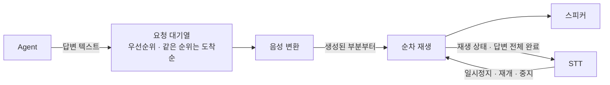
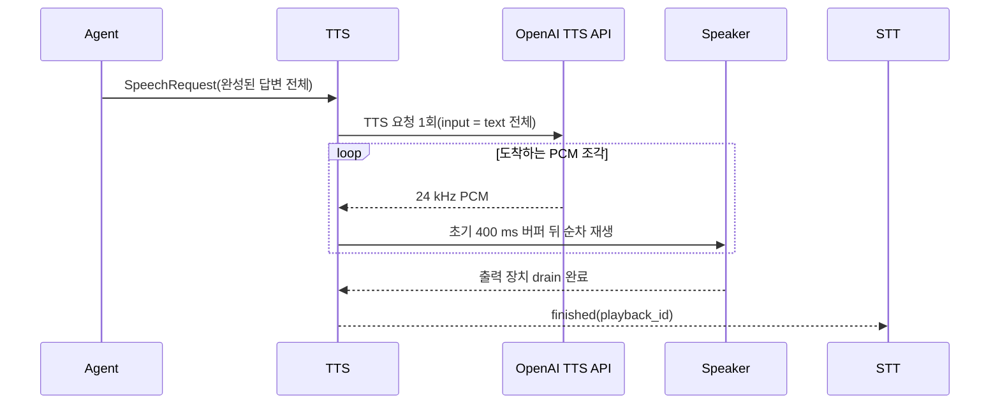

## 1. 기능

- Agent가 보낸 텍스트를 음성으로 변환한다.
- 변환한 음성을 스피커로 재생한다.
- STT의 요청에 따라 음성 재생을 일시정지/재개/중지 한다.
- 음성 재생 상태를 STT에 전달한다.
- 음성 재생 요청을 우선순위에 따라 처리하고, 같은 우선순위에서는 수신한 순서대로 재생한다.

### 1.1. 채택 실행 프로필

- 제품 음성 경로는 **로컬 STT → Agent → OpenAI API TTS**로 구성한다.
  - STT는 `whisper_cpp` backend로 사용자 음성을 로컬에서 전사한다.
  - TTS는 `openai` backend로 Agent의 답변 텍스트를 음성으로 변환한다.
- TTS package와 ROS parameter의 기본 backend는 `openai`다. backend를 생략하면
  OpenAI를 사용하며, 로컬 `qwen-cuda`는 모델 경로와 함께 명시적으로 선택한다.
  선택한 backend가 실패해도 다른 backend로 자동 전환하지 않는다.
- 기본 backend 실행에는 OpenAI SDK와 `OPENAI_API_KEY`가 필요하다. 누락 시 첫
  음성 요청을 `failed`로 처리하며 로컬 backend를 대신 선택하지 않는다.
- TTS가 외부로 전송하는 데이터는 Agent가 생성한 답변 텍스트다. TTS는 마이크
  입력이나 STT의 원본 음성을 OpenAI TTS API로 전송하지 않는다.
- OpenAI API 사용에는 네트워크와 별도 비용이 필요하며, 사용자에게 재생 음성이
  사람의 음성이 아닌 AI 합성 음성임을 알린다.

## 2. 입력

- Agent로부터 사용자에게 말할 텍스트를 전달받는다.
  - `/malbut/speech/response` ROS 2 Topic을 사용한다.
  - 메시지 타입은 `malbut_interfaces/msg/SpeechRequest`이다.
  - 전달 데이터: `text: string` — 사용자에게 말할 텍스트.
  - QoS는 `RELIABLE`, `VOLATILE`, `KEEP_LAST`, 깊이 `10`을 사용한다.
  - Agent는 요청이 대화 답변인지 일반 작업 알림인지 구분하여 전달한다.
  - `request_type: uint8`은 대화 답변 `DIALOGUE=0`과 일반 작업 알림
    `NOTIFICATION=1` 중 하나다.
  - Agent가 보낸 하나의 답변 또는 알림을 하나의 음성 재생 요청으로 처리한다. 하나의 요청에는 여러 문장이 포함될 수 있다.

- STT가 특정 음성의 일시정지/재개/중지를 요청한다.
  - `/malbut/speech/playback_control` ROS 2 Service를 사용한다.
  - 서비스 타입은 `malbut_interfaces/srv/ControlSpeechPlayback`이다.
  - 요청 데이터: `playback_id: string` — 제어할 음성 재생의 고유 ID, `command: string` — `pause`, `resume`, `stop` 중 하나.
  - 응답 데이터: `accepted: bool` — 요청의 접수 여부. 실제 처리 완료를 의미하지 않으며, 처리 결과는 재생 상태 알림으로 전달한다.

## 3. 출력

- 변환한 음성을 오디오 출력 장치를 통해 스피커로 재생한다.
- 음성의 재생 상태를 STT에 전달한다.
  - `/malbut/speech/playback_status` ROS 2 Topic을 사용한다.
  - 메시지 타입은 `malbut_interfaces/msg/SpeechPlaybackStatus`이다.
  - 전달 데이터: `playback_id: string` — 음성 재생의 고유 ID, `state: string` — 현재 재생 상태.
  - 재생 상태는 `playing`(재생 중), `paused`(일시정지), `finished`(정상 완료), `failed`(실패), `stopped`(중지)로 구분한다.

## 4. 동작 규칙

### 텍스트 수신

- 비어 있거나 공백뿐인 텍스트는 처리하지 않는다.

### 음성 변환

- 전달받은 내용을 임의로 요약하거나 답변을 추가하지 않고 음성으로 변환한다.
- 음성이 부분적으로 생성되는 backend에서는 전체 음성 변환이 끝날 때까지 기다리지
  않고, 생성된 부분부터 원문의 순서대로 재생한다.
- 앞부분을 재생하는 동안 뒷부분의 음성 수신 또는 변환을 진행할 수 있다. 구체적인
  요청 단위와 스트리밍 방식은 backend별 규칙을 따른다.

### OpenAI API TTS 요청과 스트리밍 — 채택 경로

- **완성된 Agent 답변 한 건 = `SpeechRequest` 한 건 = OpenAI TTS 요청 한 번 =
  `playback_id` 한 개**로 처리한다.
- Agent는 답변 전체가 완성된 뒤 `SpeechRequest.text`에 담아 발행한다. TTS는 LLM의
  텍스트 토큰이나 작성 중인 문장을 입력으로 받지 않는다.
- OpenAI backend는 여러 문장이 포함된 `text` 전체를 API에 한 번 전달한다. 첫 문장과
  나머지 문장을 별도 API 요청으로 나누지 않는다.
- API가 반환하는 24 kHz PCM 조각을 스트리밍으로 수신한다. 첫 400 ms 분량의 PCM을
  모은 뒤 재생을 시작하고, 앞부분을 재생하는 동안 나머지 PCM을 계속 수신한다.
- 400 ms는 네트워크 응답 시간 보장이 아니라 재생 전 음성 버퍼 크기다. 첫 PCM이
  도착하기까지의 네트워크·provider 지연은 별도로 남는다.
- 기본 API 설정은 `gpt-4o-mini-tts`, `marin`, PCM이다. 배포 설정에서 값을 바꿀 수
  있지만 요청 단위와 상태 계약은 유지한다.
- API 요청을 자동으로 재시도하지 않고 로컬 backend로 자동 fallback하지 않는다.
  일부 PCM을 이미 재생한 뒤 API가 실패해도 `finished`로 처리하지 않고 `failed`를
  전달하며 남은 음성을 폐기한다.

### 로컬 Qwen CUDA 문장 파이프라인 — 대안 경로

- `qwen-cuda` backend의 기본 문장 모드는 완성된 답변을 문장 단위로 분리한다.
- 첫 문장의 로컬 합성이 끝나면 재생을 시작하고, 재생 중 다음 문장을 합성한다.
  따라서 이 경로는 OpenAI backend의 한 요청 PCM 스트리밍과 동작 방식이 다르다.
- 문장별 로컬 합성을 사용해도 원래 `SpeechRequest`와 `playback_id`는 하나이며,
  모든 문장의 재생이 끝난 뒤 `finished`를 한 번만 전달한다.
- 문장별 합성은 LLM 텍스트 토큰 스트리밍이 아니다. Agent 답변 전체를 받은 뒤 TTS
  내부에서 문장을 나누는 방식이다.
- 이 backend는 채택 실행 프로필이 아니며, 오프라인 비교·시험 또는 명시적으로
  선택한 배포에서만 사용한다.

### 첫 문장 조기 발화의 범위

- 현재 구현은 Agent 답변 전체가 완성되기 전에 첫 문장을 발화하지 않는다.
- Agent가 생성 중인 첫 문장을 먼저 발화하고 이후 문장을 이어서 발화하는 기능은
  현재 범위에 포함하지 않는다. 이를 추가하려면 Agent의 증분 출력, 문장 경계,
  fragment 순서, 하나의 `playback_id` 유지, 취소와 실패 처리를 포함한 별도
  Agent–TTS 인터페이스 계약을 먼저 확정해야 한다.
- 기존 `/malbut/speech/response`에 문장 fragment를 여러 `SpeechRequest`로 발행해 이
  기능을 흉내 내지 않는다. 현재 계약에서는 각각이 독립된 재생 요청으로 해석된다.

### 음성 재생

- 처리하는 음성 재생 건마다 고유한 `playback_id`를 부여하고, 해당 요청에서 생성된 모든 음성의 상태 알림과 제어에 동일한 ID를 사용한다.
- 한 번에 하나의 음성을 재생한다. 새 요청은 아래의 우선순위와 대기 순서 규칙에 따라 처리한다.
- 실제 재생 상태가 변경되면 해당 상태를 STT에 전달한다. finished는 해당 요청의 모든 음성이 스피커를 통해 끝까지 재생된 뒤 한 번 전달한다.
- 음성 변환이나 재생에 실패하면 오류를 기록하고 `failed` 상태를 전달하며, 정상 재생 완료로 처리하지 않는다.

### 요청의 우선순위와 대기 순서

- 사용자 발화에 대한 대화 답변을 순찰 완료 등의 일반 작업 알림보다 우선한다.
- 새 요청이 들어오면 기존 요청을 취소하지 않고 대기열에 추가한다.
- 현재 재생 중이거나 일시정지된 요청은 새 요청이 도착해도 유지한다.
- 다음 요청을 선택할 때는 대기 중인 요청 가운데 우선순위가 높은 것을 선택한다. 같은 우선순위에서는 수신한 순서대로 재생한다.

### 재생 제어

- 일시정지 요청을 받으면 대상 음성의 재생을 멈추고 현재 위치를 유지하며, `paused` 상태를 전달한다. 대상 음성의 일시정지가 유지되는 동안에는 대기 중인 다른 음성을 재생하지 않는다.
- 재개 요청을 받으면 동일한 음성을 일시정지한 위치부터 이어서 재생하고, `playing` 상태를 전달한다.
- 중지 요청을 받으면 해당 요청의 음성 변환과 재생을 중단하고 남은 음성을 폐기한 뒤 stopped 상태를 전달한다.
- 중지된 요청에서 이후 생성된 음성도 재생하지 않으며, 해당 요청은 다시 재개하지 않는다. 다른 대기 요청은 유지한다.
- 각 재생 상태는 요청을 접수한 시점이 아니라 실제로 해당 상태가 된 뒤 전달한다.
- 대상 음성이 없거나 현재 상태에서 수행할 수 없는 제어 요청은 `accepted=false`로 응답하며, 요청에 따른 재생 상태 변경은 수행하지 않는다.
