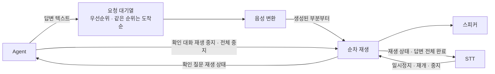
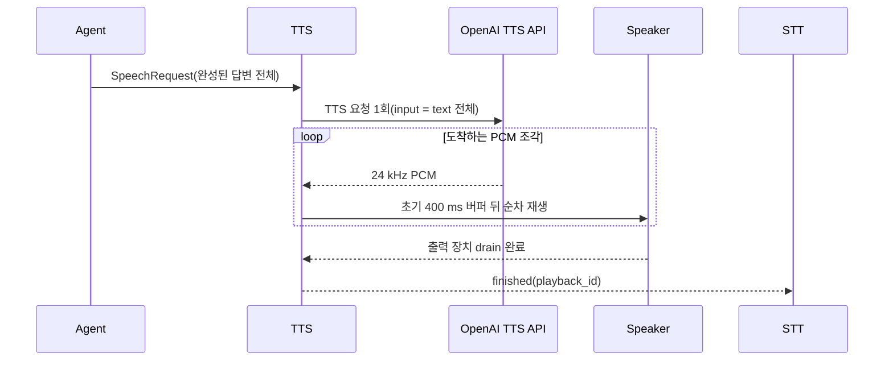

## 1. 기능

```mermaid
flowchart LR
    Agent["Agent"] -->|"답변 텍스트"| Queue["요청 대기열<br/>우선순위 · 같은 순위는 도착순"]
    Queue --> TTS["음성 변환"]
    TTS -->|"생성된 부분부터"| Play["순차 재생"]
    Play --> Speaker["스피커"]

    STT["STT"] -->|"일시정지 · 재개 · 중지"| Play
    Agent -->|"확인 대화 재생 중지 · 전체 중지"| Play
    Play -->|"재생 상태 · 답변 전체 완료"| STT
    Play -->|"확인 질문 재생 상태"| Agent
```

- Agent가 보낸 텍스트를 음성으로 변환한다.
- 변환한 음성을 스피커로 재생한다.
- STT·Agent의 요청에 따라 음성 재생을 제어한다.
- 음성 재생 상태를 STT·Agent에 전달한다.
- 음성 재생 요청을 우선순위에 따라 처리하고, 같은 우선순위에서는 수신한 순서대로 재생한다.

### 1.1. 채택 실행 프로필

- 제품 음성 경로는 **로컬 STT → Agent → OpenAI API TTS**로 구성한다.
  - STT는 `whisper_cpp` backend로 사용자 음성을 로컬에서 전사한다.
  - TTS는 `openai` backend로 Agent의 답변 텍스트를 음성으로 변환한다.
- TTS package와 ROS parameter의 기본 backend는 `openai`다. backend를 생략하면
  OpenAI를 사용하며, 로컬 `qwen-cuda`는 모델 경로와 함께 명시적으로 선택한다.
  선택한 backend가 실패해도 다른 backend로 자동 전환하지 않는다.
- 일반 답변 합성에는 OpenAI SDK와 유효한 OpenAI 키가 필요하다. 고정 장애 안내
  `지금은 대화를 할 수 없어요.`는 번들 WAV로 재생하므로 API 키·SDK를 사용하지 않는다.
- TTS가 외부로 전송하는 데이터는 Agent가 생성한 답변 텍스트다. TTS는 마이크
  입력이나 STT의 원본 음성을 OpenAI TTS API로 전송하지 않는다.
- OpenAI API 사용에는 네트워크와 별도 비용이 필요하며, 사용자에게 재생 음성이
  사람의 음성이 아닌 AI 합성 음성임을 알린다.

## 2. 입력

필드와 선택값의 최종 기준은 `malbut_interfaces`의 `.msg`와 `.srv` 파일이다.
공개 통신 목록과 공통 규격은 [인터페이스 명세](../../malbut_interfaces/README.md)에서 확인한다.

- Agent로부터 사용자에게 말할 텍스트를 전달받는다.
  - `/malbut/speech/response` ROS 2 Topic을 사용한다.
  - 메시지 타입은 [SpeechRequest](../../malbut_interfaces/msg/SpeechRequest.msg)이다.
  - 전달 데이터: `text: string` — 사용자에게 말할 텍스트.
  - `playback_id: string`은 발행자가 지정한 재생 ID다. 빈 값이면 TTS가 생성한다.
  - `request_id: string`은 같은 사용자 요청의 진행 안내와 최종 답변을 묶는다. 빈 값은 묶지 않으며, 지정할 경우 공백뿐인 값은 허용하지 않고 최대 256자다. Agent는 원래 `utterance_id`를 사용한다. 재생마다 고유한 `playback_id`와 별개다.
  - `interim: bool`은 최종 답변 전 지연·재시도 안내 여부이며 기본값은 `false`다. Agent의 중간 안내만 `true`이며, 최종 답변·일반 알림·확인 발화는 `false`다.
  - QoS는 `RELIABLE`, `VOLATILE`, `KEEP_LAST`, 깊이 `10`을 사용한다.
  - `request_type: uint8`은 대화 답변 `DIALOGUE=0`, 일반 작업 알림
    `NOTIFICATION=1`, 이상 상황 확인 `CONFIRMATION=2`를 구분한다.
  - Agent가 보낸 하나의 답변·알림·확인 발화를 하나의 음성 재생 요청으로 처리한다. 하나의 요청에는 여러 문장이 포함될 수 있다.

- STT·Agent가 특정 음성의 일시정지/재개/중지 또는 전체 중지를 요청한다.
  - `/malbut/speech/playback_control` ROS 2 Service를 사용한다.
  - 서비스 타입은 [ControlSpeechPlayback](../../malbut_interfaces/srv/ControlSpeechPlayback.srv)이다.
  - 요청 데이터: `playback_id: string` — 제어할 음성 재생의 고유 ID, `command: string` — `PAUSE`, `RESUME`, `STOP`, `STOP_ALL` 상수 중 하나.
  - `STOP_ALL`은 재생 ID 없이 현재 재생과 대기열 전체를 중단한다. Agent는 확인 대화 시작 전에 이를 요청하고, 개별 질문은 `playback_id`로 중지한다.
  - 응답 데이터: `accepted: bool` — 요청의 접수 여부. 실제 처리 완료를 의미하지 않으며, 처리 결과는 재생 상태 알림으로 전달한다.

## 3. 출력

- 변환한 음성을 오디오 출력 장치를 통해 스피커로 재생한다.
- 음성의 재생 상태를 STT·Agent에 전달한다.
  - `/malbut/speech/playback_status` ROS 2 Topic을 사용한다.
  - 메시지 타입은 [SpeechPlaybackStatus](../../malbut_interfaces/msg/SpeechPlaybackStatus.msg)이다.
  - 전달 데이터: `playback_id: string` — 음성 재생의 고유 ID, `state: string` — 현재 재생 상태.
  - `request_id: string`은 원래 일반 요청의 값을 모든 상태에 전달한다. STT는 같은 발화의 최종 답변이 완료·실패·중단되면 입력 차단을 풀고 호출어 대기로 돌아간다. `CONFIRMATION`은 빈 값이며 기존 재생 ID 기반 제어를 유지한다.
  - `interim: bool`은 원래 `SpeechRequest`의 값을 모든 상태에서 그대로 전달한다. 중간 안내의 `finished`는 그 안내의 재생 완료이며 최종 답변 완료를 뜻하지 않는다. STT는 해당 안내 뒤에도 일반 요청의 입력 차단을 유지한다.
  - 재생 상태는 `playing`(재생 중), `paused`(일시정지), `finished`(정상 완료), `failed`(실패), `stopped`(중지)로 구분한다.
  - Agent는 질문의 `playback_id`에 대응하는 `finished`를 받은 뒤 답변 시작 대기 시간을 계산한다. `failed`나 `stopped`를 정상 완료로 처리하지 않는다.

## 4. 동작 규칙

### 텍스트 수신

- 비어 있거나 공백뿐인 텍스트는 처리하지 않는다.

### 음성 변환

- 전달받은 내용을 임의로 요약하거나 답변을 추가하지 않고 음성으로 변환한다.
- 음성이 부분적으로 생성되는 backend에서는 전체 음성 변환이 끝날 때까지 기다리지
  않고, 생성된 부분부터 원문의 순서대로 재생한다.
- 앞부분을 재생하는 동안 뒷부분의 음성 수신 또는 변환을 진행할 수 있다. 구체적인
  요청 단위와 스트리밍 방식은 backend별 규칙을 따른다.

### OpenAI API TTS 요청과 스트리밍 — 채택 경로

```mermaid
sequenceDiagram
    participant A as Agent
    participant T as TTS
    participant O as OpenAI TTS API
    participant P as Speaker
    participant S as STT

    A->>T: SpeechRequest(완성된 답변 전체)
    T->>O: TTS 요청 1회(input = text 전체)
    loop 도착하는 PCM 조각
        O-->>T: 24 kHz PCM
        T->>P: 초기 400 ms 버퍼 뒤 순차 재생
    end
    P-->>T: 출력 장치 drain 완료
    T-->>S: finished(playback_id)
```

- **완성된 Agent 답변 한 건 = `SpeechRequest` 한 건 = OpenAI TTS 요청 한 번 =
  `playback_id` 한 개**로 처리한다.
- Agent는 답변 전체가 완성된 뒤 `SpeechRequest.text`에 담아 발행한다. TTS는 LLM의
  텍스트 토큰이나 작성 중인 문장을 입력으로 받지 않는다.
- OpenAI backend는 여러 문장이 포함된 `text` 전체를 API에 한 번 전달한다. 첫 문장과
  나머지 문장을 별도 API 요청으로 나누지 않는다.
- API가 반환하는 24 kHz PCM 조각을 스트리밍으로 수신한다. 첫 400 ms 분량의 PCM을
  모은 뒤 재생을 시작하고, 앞부분을 재생하는 동안 나머지 PCM을 계속 수신한다.
- 400 ms는 네트워크 응답 시간 보장이 아니라 재생 전 음성 버퍼 크기다. 첫 PCM이
  도착하기까지의 네트워크·provider 지연은 별도로 남는다.
- 기본 API 설정은 `gpt-4o-mini-tts`, `nova`, PCM이다. 배포 설정에서 값을 바꿀 수
  있지만 요청 단위와 상태 계약은 유지한다.
- API 요청을 자동으로 재시도하지 않고 로컬 backend로 자동 fallback하지 않는다.
  일부 PCM을 이미 재생한 뒤 API가 실패해도 `finished`로 처리하지 않고 `failed`를
  전달하며 남은 음성을 폐기한다.
- 키 누락·인증/권한 오류·`insufficient_quota`로 원문 PCM을 하나도 전달하지 못하면
  번들 `assets/notice_no_dialogue.wav`를 대신 재생한다. 안내의 장치 drain이 끝난 뒤
  원 요청은 `failed`로 종료한다. 장애 안내를 질문 전달 성공으로 보고 확인 답변
  세션을 열지 않도록 `finished`를 보내지 않는다. 일반 대화의 같은 `request_id`에
  대해서도 이 최종 실패 상태가 STT의 답변 대기를 해제한다.
- Agent가 고정 안내 문구 자체를 보낸 경우에는 API 없이 WAV를 재생하고 정상 완료
  시 `finished`를 보낸다. 일반 대화 실패와 날씨 조회 불가 시 이 문구를 사용하며
  재시도 설명을 앞에 붙이지 않는다. 파일 누락·손상은 실패로 처리한다. 명시적 중지는
  기존처럼 `stopped`이고, 대체 안내의 재생도 동일한 재생 ID·제어·입력 차단을 따른다.

### 로컬 Qwen CUDA 문장 파이프라인 — 대안 경로

- `qwen-cuda` backend의 기본 문장 모드는 완성된 답변을 문장 단위로 분리한다.
- 첫 문장의 로컬 합성이 끝나면 재생을 시작하고, 재생 중 다음 문장을 합성한다.
  따라서 이 경로는 OpenAI backend의 한 요청 PCM 스트리밍과 동작 방식이 다르다.
- 문장별 로컬 합성을 사용해도 원래 `SpeechRequest`와 `playback_id`는 하나이며,
  모든 문장의 재생이 끝난 뒤 `finished`를 한 번만 전달한다.
- 문장별 합성은 LLM 텍스트 토큰 스트리밍이 아니다. Agent 답변 전체를 받은 뒤 TTS
  내부에서 문장을 나누는 방식이다.
- 이 backend는 채택 실행 프로필이 아니며, 오프라인 비교·시험 또는 명시적으로
  선택한 배포에서만 사용한다.

### 첫 문장 조기 발화의 범위

- 현재 구현은 Agent 답변 전체가 완성되기 전에 첫 문장을 발화하지 않는다.
- Agent가 생성 중인 첫 문장을 먼저 발화하고 이후 문장을 이어서 발화하는 기능은
  현재 범위에 포함하지 않는다. 이를 추가하려면 Agent의 증분 출력, 문장 경계,
  fragment 순서, 하나의 `playback_id` 유지, 취소와 실패 처리를 포함한 별도
  Agent–TTS 인터페이스 계약을 먼저 확정해야 한다.
- 기존 `/malbut/speech/response`에 문장 fragment를 여러 `SpeechRequest`로 발행해 이
  기능을 흉내 내지 않는다. 현재 계약에서는 각각이 독립된 재생 요청으로 해석된다.

### 음성 재생

- 처리하는 음성 재생 건마다 고유한 `playback_id`를 부여하고, 해당 요청에서 생성된 모든 음성의 상태 알림과 제어에 동일한 ID를 사용한다.
- 한 번에 하나의 음성을 재생한다. 새 요청은 아래의 우선순위와 대기 순서 규칙에 따라 처리한다.
- 실제 재생 상태가 변경되면 해당 상태를 STT·Agent에 전달한다. finished는 해당 요청의 모든 음성이 스피커를 통해 끝까지 재생된 뒤 한 번 전달한다.
- 음성 변환이나 재생에 실패하면 오류를 기록하고 `failed` 상태를 전달하며, 정상 재생 완료로 처리하지 않는다.

### 요청의 우선순위와 대기 순서

- 사용자 발화에 대한 대화 답변을 순찰 완료 등의 일반 작업 알림보다 우선한다.
- 일반 대화·알림 요청은 대기열에 추가한다. 현재 재생 중이거나 일시정지된 요청은 유지한다.
- 같은 `request_id`의 새 진행 안내는 대기 중인 이전 진행 안내를 대체한다. 최종 답변을 접수하면 해당 요청의 대기·합성 중인 진행 안내를 음성 출력 전에 취소하고 `stopped`를 한 번 전달한다. 이미 재생·일시정지 중인 안내, 최종 답변, 다른 요청의 음성은 유지한다.
- 사전 녹음된 기능 시작 안내(`function.*.starting`)는 빠른 최종 답변보다 먼저 재생하도록 유지한다. 같은 요청의 대기·재시도·시작 안내 중 하나가 이미 실제 재생됐다면 이후 중간 안내는 재생 없이 `stopped`로 종료한다. 실제 결과 답변은 그대로 재생하며, 재생 이력은 최근 요청 256개로 제한한다.
- 최종 답변을 접수한 요청 ID는 최근 256개까지 기억하며, 뒤늦은 같은 요청의 진행 안내도 합성하지 않고 `stopped`로 종료한다. 최종 답변 자체를 요청 ID로 중복 제거하지 않는다. 빈 요청 ID는 기존 FIFO 동작을 유지한다.
- 대기열 포화·잘못된 입력·중복 재생 ID로 최종 답변 접수를 거절하면 기존 진행 안내와 요청 ID 기록을 바꾸지 않는다. 같은 요청의 대기 안내를 교체해 생기는 빈자리는 접수에 사용할 수 있다.
- 이상 상황 확인의 `SpeechRequest.CONFIRMATION` 요청은 기존 재생과 대기 요청을 `stopped`로 종료하고 먼저 재생한다. 질문과 마무리 발화 모두 이 종류를 사용한다.
- 발행자는 `SpeechRequest.playback_id`에 고유 ID를 지정해 질문과 재생 상태를 연결할 수 있다. 빈 값이면 기존처럼 TTS가 ID를 생성한다.
- 다음 요청을 선택할 때는 대기 중인 요청 가운데 우선순위가 높은 것을 선택한다. 같은 우선순위에서는 수신한 순서대로 재생한다.

### 재생 제어

- 일시정지 요청을 받으면 대상 음성의 재생을 멈추고 현재 위치를 유지하며, `paused` 상태를 전달한다. 대상 음성의 일시정지가 유지되는 동안에는 대기 중인 다른 음성을 재생하지 않는다.
- 재개 요청을 받으면 동일한 음성을 일시정지한 위치부터 이어서 재생하고, `playing` 상태를 전달한다.
- 중지 요청을 받으면 해당 요청의 음성 변환과 재생을 중단하고 남은 음성을 폐기한 뒤 stopped 상태를 전달한다.
- 아직 재생하지 않은 대기 요청도 지정된 `playback_id`의 중지 요청으로 제거할 수 있다.
- `ControlSpeechPlayback.STOP_ALL`은 `playback_id` 없이 현재 재생과 대기열을 모두 중단한다. Agent는 이상 상황 질문 생성에 앞서 기존 대화를 즉시 중단할 때 사용한다.
- 유효한 `playback_id`의 `STOP`이 음성 요청보다 먼저 도착하면 `accepted=true`로 예약 취소를 접수한다. 동일 ID의 요청이 뒤늦게 도착해도 합성·재생하지 않고 `stopped`를 전달한다. 예약 취소와 완료 ID는 최근 256개만 보관하며, 최근 완료 ID에 대한 중지는 `accepted=false`다. 발행자는 매 재생에 새로운 ID를 사용한다.
- 중지된 요청에서 이후 생성된 음성도 재생하지 않으며, 해당 요청은 다시 재개하지 않는다. 다른 대기 요청은 유지한다.
- 각 재생 상태는 요청을 접수한 시점이 아니라 실제로 해당 상태가 된 뒤 전달한다.
- 유효하지 않은 ID, 최근 완료된 재생, 현재 상태에서 수행할 수 없는 제어 요청은 `accepted=false`로 응답한다. 미수신 ID의 `STOP` 예약 취소는 위 규칙을 적용한다.
