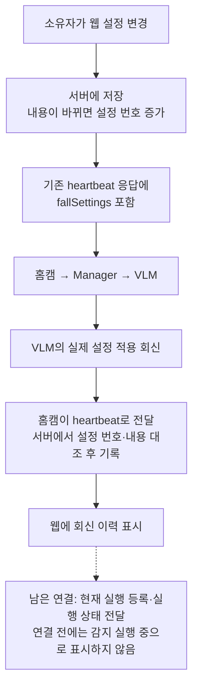

# 웹 낙상 감지 설정

수정일: 2026-09-23 · SWM25-187

## 구현한 범위

- 홈캠 설정 화면에서 **낙상 감지**와 **Cloud VLM 전송 동의**를 따로 바꾼다. 바꾸면 바로 서버에 저장한다.
- 소유자만 변경할 수 있다. 가족은 확인만 가능하다. 기존 카메라 허용·영상 저장 설정과 구분한다.
- 기본값은 감지 OFF, Cloud 동의 OFF다. 영상 저장 ON을 Cloud 동의로 해석하지 않는다.
- 저장한 설정은 로봇의 기존 heartbeat 응답으로 전달한다. 적용 회신도 같은 API로 받는다.
- **회신 이력과 현재 실행 상태는 다르다.** 현재 실행 ID 등록·실행 상태의 서버 전달은 아직 없다.
  따라서 웹에는 회신 이력만 표시하며 ‘적용 완료’나 ‘지금 감지 중’으로 표시하지 않는다.



## 웹 API

경로: `/api/devices/{deviceId}/fall-settings`. 응답은 캐시하지 않는다.

### GET — 설정과 회신 이력 조회

기존 로봇 조회 권한을 확인한다. 소유자·가족 등 해당 로봇의 조회 권한이 있어야 한다.

| 필드 | 타입 | 의미 |
|---|---|---|
| `settings.settingsRevision` | string | 현재 서버 설정 번호. 양의 uint64 십진 문자열 |
| `settings.enabled` | boolean | 낙상 감지 ON/OFF |
| `settings.cameraEnabled` | boolean | 기존 카메라 사용 허용 값 |
| `settings.cloudConsent` | boolean | Cloud VLM에 영상·센서 요약을 보내도 되는지 |
| `savedAt` | string | 이 설정이 저장된 서버 날짜·시각(ISO 8601) |
| `savedAgeS` | number | 저장한 뒤 지난 시간(초), 서버에서 계산 |
| `receiptState` | string | `waiting` / `no_response` / `history_only` |
| `runtimeVerified` | false | 현재 VLM 실행과 대조하는 연결은 아직 없음 |
| `reports` | array | 현재 설정 번호의 회신 이력, 수신 시각 내림차순 최대 5개 |

- 회신이 없으면 저장 후 6초 미만은 `waiting`, 6초 이상은 `no_response`다.
- 해당 설정의 회신이 있으면 `history_only`다. 성공 회신도 현재 실행 상태의 증거로 쓰지 않는다.
- `reports`는 아래 heartbeat 보고 필드에 `receivedAt`을 더한 값이다.
  `reportAgeS`는 최초 보고 나이 + 최초 수신 뒤 경과 시간이며, 중복 전송으로 0이 되지 않는다.
- 이전 설정 회신은 DB 이력에 남지만 최신 설정의 회신 목록에 섞지 않는다.
- 초기 설정의 `savedAt`은 DB에 기본 설정을 만든 시각이다. 소유자가 직접 저장했다는 뜻은 아니다.
- 이 API의 시각은 **서버 날짜·시각**이다. ROS 내부 단조 시각과 직접 비교하지 않는다.

### PATCH — 소유자가 설정 변경

```json
{"expectedRevision":"42","enabled":true,"cloudConsent":false}
```

| 필드 | 타입 | 의미 |
|---|---|---|
| `expectedRevision` | string | 화면에서 확인한 설정 번호. 다른 곳에서 바뀌었으면 409로 거부 |
| `enabled` | boolean, 선택 | 낙상 감지 ON/OFF |
| `cloudConsent` | boolean, 선택 | Cloud VLM 전송 동의 |

- `enabled`, `cloudConsent` 중 하나 이상 필요하다. 생략한 값은 유지한다.
- 카메라는 기존 `/settings` API에서 바꾼다. 카메라가 OFF여도 감지 ON 설정 자체는 저장할 수 있으나, 카메라를 켜기 전에는 영상 수집을 허용하지 않는다.
- 소유자 권한, 동일 출처의 JSON 요청, 입력 형식을 확인한다. DB 저장 직전에도 소유자 권한을 잠금 안에서 확인한다.
- 성공 응답: `{"saved":true,"savedRevision":"43"}`. **서버 저장 성공**이지 로봇 적용 성공이 아니다.
- 같은 내용을 다시 저장하면 설정 번호·저장 시각은 유지한다. 다른 곳에서 이미 바뀐 번호는 내용이 같아도 자동 덮어쓰지 않는다.
- 401: 로그인 없음, 403: 소유자 아님/요청 출처 불일치, 400: 잘못된 입력,
  409: 설정 번호 변경, 503: DB 마이그레이션 필요, 500: 저장·조회 실패.

## 로봇 API

기존 `POST /api/device/v1/heartbeat`를 사용한다. 장치 토큰으로 확인한 로봇에만 저장한다.

### 응답에 추가한 `fallSettings`

```json
{
  "desiredState":{"monitoringEnabled":false,"cameraEnabled":true,"microphoneEnabled":true},
  "fallSettings":{"settingsRevision":"43","enabled":true,"cameraEnabled":true,"cloudConsent":false}
}
```

- 기존 `desiredState` 필드 세 개는 유지한다. 두 객체의 카메라 값은 한 DB 조회에서 읽어 일치시킨다.
- 감지·카메라·Cloud 동의 중 하나라도 바뀌면 설정 번호가 증가한다. 마이크·영상 저장·상태 보고는 번호를 바꾸지 않는다.
- ROS uint64 설정 번호를 JSON 숫자로 바꾸지 않는다. DB에서도 `NUMERIC(20,0)`으로 손실 없이 저장한다.

### 요청에 추가한 `fallSettingsReport`

| 필드 | 타입 | 의미 |
|---|---|---|
| `bridgeRuntimeId`, `managerRuntimeId`, `runtimeId` | string | 회신한 홈캠·Manager·VLM 실행 ID |
| `sequence`, `snapshotSequence` | string | 보고 번호와 원래 설정 전달 메시지 번호. 양의 uint64 |
| `requestedRevision` | string | VLM에 적용을 요청했던 설정 번호. 양의 uint64 |
| `appliedRevision` | string | 실제 적용됐다고 회신한 번호. 적용 이력 없으면 `"0"` |
| `applied` | boolean | 설정 적용 성공 여부 |
| `enabled`, `cameraEnabled`, `cloudConsent` | boolean | VLM이 회신한 실제 설정 |
| `reasonCode` | string | `applied`, `already_applied`, `runtime_mismatch`, `stale_revision`, `revision_conflict`, `invalid_request`, `internal_error` |
| `reportAgeS` | number | 회신 발생 후 전송까지 지난 초. 0 이상 유한한 값 |

- 전부 필수다. 알 수 없는 필드·잘못된 타입은 거부한다.
- 성공이면 요청·적용 번호가 같고, 값도 그 번호의 서버 설정 이력과 같아야 한다.
- 실패이면 회신한 이전 적용 번호의 값과 대조한다. 적용 이력이 0이면 세 값은 모두 false여야 한다.
- `(장치, bridgeRuntimeId, managerRuntimeId, sequence)`가 같은 보고는 한 번만 저장한다.
  같은 키의 다른 내용은 409로 거부한다. 재전송 시 바뀌는 `reportAgeS`는 내용 비교에서 제외한다.
- 수신 순서나 UUID 순서로 현재 실행을 고르지 않는다. 보고는 서버의 소유자 설정을 변경할 수 없다.
- 보고 저장 실패는 HTTP 성공으로 응답하지 않는다. 400은 형식 오류, 409는 이력 대조 실패, 500은 보고 저장 실패다.

## DB 적용 및 남은 검증

- `0011_fall_settings.sql`: 기본 OFF 설정·설정 번호·변경 이력·회신 이력을 추가한다.
  기존 카메라 설정 경로에서도 같은 트랜잭션 안에서 번호와 변경 이력이 갱신되도록 DB trigger를 사용한다.
- 마이그레이션이 없는 서버는 heartbeat에 `fallSettings`를 넣지 않는다. 기존 미디어 동작은 유지하고,
  새 웹 설정 API와 보고 수신은 503으로 거부한다. API 요청 중 자동 마이그레이션하지 않는다.
- 배포 담당자가 DB 마이그레이션과 서버 배포를 먼저 하고, 그다음 로봇을 연결해야 한다.
  이번 작업에서는 운영 DB·서버 배포·로봇 설정을 변경하지 않았다.
- 화면이 열려 있을 때 설정·회신을 1초 간격으로 조회한다. Cloud VLM을 시험 호출하는 것은 아니다.
- 목표 3초 내 적용·6초 회신 없음은 실제 로봇에서 검증해야 한다. HTTP가 이미 대기 중이면 지연될 수 있다.
- 남은 일: 현재 실행 ID 등록, 실행 상태의 서버·웹 전달, ROS 접근 권한 설정,
  실제 DDS·카메라·네트워크 끊김/재시작 시험. 질문·답변 Agent 연동도 별도다.

검증 명령: `npm test`, `npm run lint`, `npm run build`.
테스트 DB는 PGlite 메모리 DB다. 실제 Cloud·카메라·운영 PostgreSQL을 호출하지 않는다.

2026-09-23 결과: 웹 전체 테스트 106개(새 설정 검사 8개 포함)·lint·TypeScript·배포용 빌드 통과.
ROS 자료형·명세 검사도 33개 통과했다. 브라우저 직접 조작·실제 로봇 적용 시간은 미검증이다.
