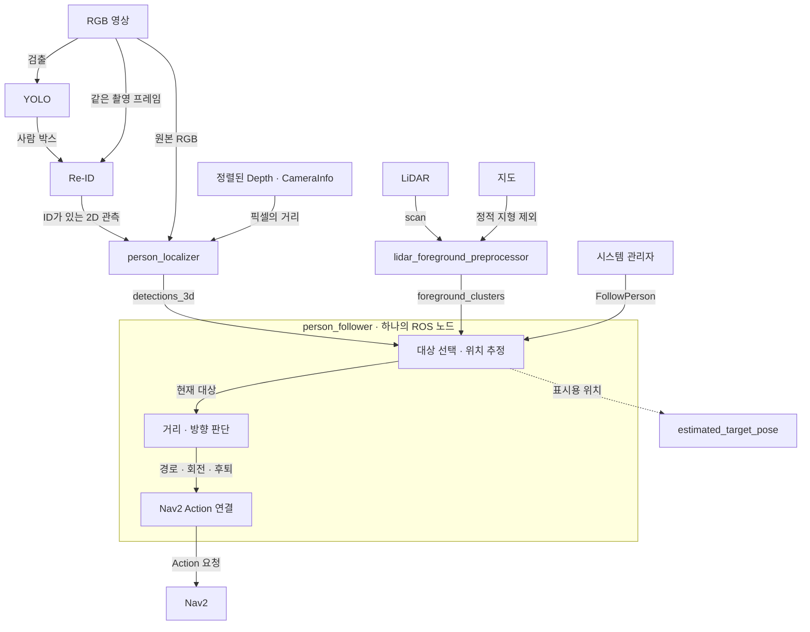
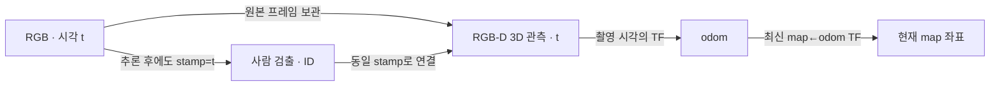
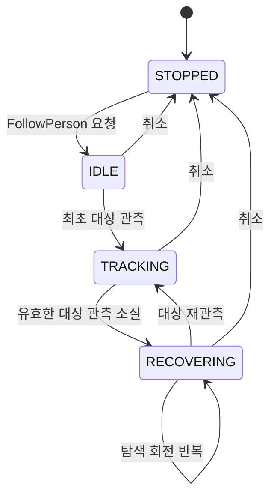

# Malbut Person Tracking

RGB-D에서 확인한 사람을 선택하고, LiDAR 관측을 보조로 연결해
**일정 거리를 유지하며 따라가는 센서 기반 추적 패키지**입니다.

사람 검출과 ID 관리는 [YOLO](../malbut_yolo/README.md)·[Re-ID](../malbut_reid/README.md)가,
주행 경로·충돌 검사·차체 제어는 Nav2가 담당합니다.
이 패키지는 **사람 위치를 관측하고, 따라갈 대상을 유지하며, 필요한 Nav2 동작을 요청**합니다.
추적 알고리즘은 Gazebo 객체의 정답 위치를 읽거나 `/cmd_vel`을 직접 발행하지 않습니다.

[운영 가이드](README_OPERATIONS.md) · [FollowPerson 계약](../malbut_interfaces/action/FollowPerson.action) ·
[Bringup 설계](../malbut_bringup/README.md)

## 전체 데이터 흐름

현재 대상 선택·카메라/LiDAR 융합·주행 판단은 **같은 추적 노드 안에 있습니다**.
`/tracking/person/estimated_target_pose`는 그 노드가 발행하는 출력이며,
별도 주행 노드가 이 Topic만 구독하는 구조로 분리되어 있지는 않습니다.

### 노드 실행과 추적 실행은 별개

| Launch | 실행하는 구성 |
| --- | --- |
| [person_detection](launch/person_detection.launch.py) | 공유 YOLO·Re-ID·RGB-D localizer |
| [person_following](launch/person_following.launch.py) | 추적 Action 서버·C++ LiDAR 전처리 |
| [Bringup tracking](../malbut_bringup/launch/tracking.launch.py) | 위 두 구성을 실기기 Topic·설정으로 연결 |

인식 노드는 FollowPerson 요청과 무관하게 실행되며 다른 기능도 관측 Topic을 사용할 수 있습니다.
추적 취소는 해당 추적과 소유한 Nav2 동작을 끝내지만,
YOLO·Re-ID 노드를 종료하거나 ID를 초기화하지는 않습니다.

## RGB-D로 사람 위치 관측

`person_localizer`는 2D 사람 박스의 **중앙 ROI Depth**를 사용합니다.
유효한 깊이 표본의 중앙값과 분산 지표를 구하고,
CameraInfo의 카메라 내부 파라미터로 3D 위치를 계산합니다.
사람마다 전체 Depth 영상을 다시 변환하지 않고 필요한 ROI만 처리합니다.

| 단계 | 현재 처리 |
| --- | --- |
| RGB·Depth 연결 | ApproximateTimeSynchronizer, 기본 허용폭 20 ms |
| 검출 결과와 영상 연결 | 원본 RGB와 **동일한 타임스탬프**로 ExactTime 동기화 |
| 거리 추정 | 기본 유효 범위 0.30~3.0 m, ROI의 유효 표본 사용 |
| Depth를 얻지 못함 | 큰 불확실성을 표시한 방향 중심 관측. 정확한 거리로 취급하지 않음 |
| 결과 | ID·위치·불확실성을 가진 `Detection3DArray` |

시간 동기화는 **픽셀 정렬을 대신하지 않습니다**.
Depth가 RGB에 정렬되어 있고 CameraInfo·optical frame이 맞아야 합니다.

### 늦게 도착한 추론 결과와 TF

YOLO 추론이 늦어져도 결과의 촬영 시각을 현재 시각으로 바꾸지 않습니다.
그 결과에 맞는 원본 RGB-D를 찾아 위치를 계산하고,
추적 노드는 관측 시각의 카메라 좌표를 odom에 연결한 뒤 현재 map 좌표로 표현합니다.

[추적 노드](malbut_tracking/person_follower_node.py)는
`lookup_transform_full`에서 odom을 고정 좌표계로 사용합니다.
촬영 시각의 변환이 없으면 최신 TF로 몰래 대체하지 않습니다.

| 보관·대기 대상 | 기본 정책 |
| --- | --- |
| RGB·Depth 동기화 | 대기 큐 3개 |
| 지연된 ID 결과와 RGB-D 연결 | 동기화 캐시 60개 |
| 추적 노드의 TF 대기 | 최신 검출 하나만, 최대 0.30초 재시도 |
| LiDAR의 TF 대기 | 기다리는 스캔 + 최신 후속 스캔, 최대 두 개 |
| TF 이력 | 별도 tf2 Buffer에서 시각별 변환 조회 |

이는 무한 큐가 아니라 **유한한 동기화 저장 공간과 TF 이력**입니다.
관측과 맞는 자료가 없거나 너무 오래된 관측이면 버립니다.
추적 노드의 TF 조회는 비차단으로 수행해 대기 중에도 TF 입력을 받을 수 있게 합니다.

## 어떤 사람을 따라가는가

| Action 모드 | 선택 방식 |
| --- | --- |
| `VISIBLE_PERSON=0` | 처음에는 신뢰도가 가장 높은 사람, 이후에는 예측 위치와의 공간적 연속성으로 선택 |
| `REGISTERED_PERSON=1` | 상위 인식 계층이 제공하는 `target_person_id`와 같은 ID만 선택 |

화면에 여러 사람이 있어도 한 Action은 **한 대상**만 따라갑니다.
자동 모드에서는 검출 ID가 바뀌어도 공간적으로 이어지는 관측을 사용할 수 있습니다.
지정 ID 모드는 상위 인식 계층의 동일인 식별에 의존합니다.

원본 Re-ID는 OSNet 외형 특징을 지원하지만,
현재 **실기기 적용본은 OSNet·색상 외형 비교를 생략하고 박스·이동 기반 ID를 유지**합니다.
따라서 지정 ID 인터페이스가 있다는 것과 가족을 외형으로 재식별할 수 있다는 것은 다릅니다.

대상 선택은 [target_association.py](malbut_tracking/target_association.py),
카메라 위치·속도 추정은 [motion_estimator.py](malbut_tracking/motion_estimator.py)에 있습니다.

## LiDAR는 사람을 새로 식별하지 않음

C++ [전처리 노드](src/lidar_foreground_preprocessor.cpp)는 스캔 시각의 TF와
`laser_geometry`로 레이저 관측을 map에 투영하고, 지도에 있는 정적 지형을 제외합니다.
지도 메시지를 받으면 정적 장애물 거리장을 캐시하고,
스캔 처리에서는 캐시 조회와 군집화로 작은 후보 클러스터만 발행합니다.

추적 노드는 카메라로 확인한 사람 주변의 후보만 받아
등속도 Kalman 추정·Mahalanobis 게이트·Hungarian 할당으로 연결합니다.
카메라 위치와 일치하는 트랙에 사람 라벨을 붙이고,
LiDAR만으로 추적을 이어갈 때는 반복 관측으로 확인된 현재 관측 트랙을 사용합니다.
지도 차감 후 남은 점을 전부 사람이나 움직이는 물체로 간주하지 않습니다.

| 상황 | 센서 역할 |
| --- | --- |
| RGB-D가 현재 사람을 관측 | RGB-D가 ID·보이는 위치·전진 추적의 기준 |
| 사람이 가까움 | 일치하는 LiDAR 관측으로 거리·접근 속도를 보조해 정렬·후퇴 판단 |
| 카메라에서 대상이 사라짐 | 카메라가 라벨을 붙인 현재 LiDAR 트랙으로 대상 계속 관측 |
| LiDAR 관측도 끊김 | 누락 횟수·coast 시간에 따라 트랙 만료, 대상 소실 탐색으로 전환 |

기본 `maximum_coast_time_s=3.0`은 **LiDAR 관측 누락의 예측 유지 한도**입니다.
카메라가 사라진 지 3초가 되면 무조건 추적을 끝낸다는 뜻은 아닙니다.
LiDAR 관측이 계속 유지되는지와 트랙 확인 상태를 함께 판단합니다.

지도 미수신·지도 밖·미확인 칸의 점은 현재 전처리에서 후보로 사용하지 않습니다.
기본 미확인 지도만으로 저장 지형을 차감한 LiDAR 보조가 제공된다고 설명하지 않습니다.
이 경로는 [costmap_tracking.py](malbut_tracking/costmap_tracking.py)에 연결됩니다.

## 거리 유지와 Nav2 동작

추적 Action의 거리 입력은 원하는 사람과의 거리입니다.
기본은 **1.0 m, 허용 띠 ±0.10 m**이며,
장애물 여유 거리나 차체 footprint와는 다른 값입니다.

| 관측·판단 | 요청하는 동작 |
| --- | --- |
| 사람이 거리 띠보다 멂 | ComputePathToPose → FollowPath |
| 거리 띠 안, 방향이 틀어짐 | Spin으로 사람을 바라보기 |
| 거리·방향이 맞음 | 이동 유지하지 않고 대기 |
| 사람이 가까움 또는 접근 예측이 하한을 넘음 | BackUp으로 로봇 축을 따라 후퇴 |
| 안전한 이동 경로를 만들 수 없음 | 현재 이동 취소, 최신 관측으로 재시도 |

[follow_policy.py](malbut_tracking/follow_policy.py)가 거리·접근 속도를 판단하고,
[navigation.py](malbut_tracking/navigation.py)가 Nav2 Action을 비동기로 호출합니다.
Depth가 불확실한 방향 관측만으로 후퇴를 추론하지 않습니다.

### 목표 지점과 정지 거리

사람 위치 자체로 Nav2 경로를 요청합니다.
실기기에서는 `FollowPersonAStar`를 선택하며,
이 planner는 Navfn의 A* 설정입니다. 다른 주행은 기존 `GridBased`를 사용합니다.

사람이 장애물 칸 안에 있으면 Nav2 planner가 tolerance 범위 안의 도달 가능 지점을 찾습니다.
추적기는 만들어진 경로를 **사람과의 요청 거리 원에 처음 닿는 지점까지만** 잘라 보냅니다.
우회 경로를 직선으로 단축하지 않고, 마지막 자세는 사람을 향하도록 설정합니다.
거리 띠 안에서는 별도의 Spin 판단으로 카메라 방향을 맞춥니다.

Nav2가 경로를 만들지 못하면 목표를 로봇 쪽으로 단계적으로 당겨 다시 시도합니다.
그래도 실패하거나 계획 대기 기한을 넘으면 최신 costmap에서 검증한 짧은 직선 fallback을 사용합니다.
이 fallback도 장애물·미확인 칸·대각선 모서리를 검사하며,
최대 1 m 범위에서 안전한 전진이 없으면 이동하지 않습니다.
세부 조건은 [운영 가이드](README_OPERATIONS.md#runtime-contract)에 있습니다.

### 오래된 계획을 쌓지 않음

- 정상 추적의 반복 경로 계획은 최대 5 Hz. 첫 계획·거리 판단 변화·취소·소실 전환은 즉시 처리합니다.
- 진행 중인 전역 계획은 하나만 소유하고, 기다리는 동안 최신 관측 하나만 남깁니다.
- 계획 응답 기한은 기본 200 ms. 시간 초과 결과는 무효화하고 취소를 요청하되,
  원격 planner가 실제로 끝나기 전 두 번째 전역 계획을 보내지는 않습니다.
- 새 FollowPath는 기존 경로를 교체하지만, 전진↔후퇴·회전↔이동 전환은 기존 동작 종료를 기다립니다.
- 추적기가 거리 기반 속도 제한을 추가하지 않습니다. 실제 속도·가속도·충돌 검사는 Nav2와 드라이버가 담당합니다.

## 추적 수명과 대상 소실

최초 대기에서는 로봇을 움직이지 않습니다.
대상을 한 번 확보한 뒤 관측을 잃으면
**기존 waypoint 마무리 → 마지막 관측 방향 회전 → 마지막 위치 경로 → 270° 회전 탐색**
순서로 찾습니다. 새 RGB-D 관측이 들어오면 정상 추적으로 돌아옵니다.

대상을 못 찾았다는 이유로 Action을 자동 종료하지 않으며 명시적 취소까지 탐색을 이어갑니다.
취소 시 센서 관측에서 새 이동을 만들지 않고 소유한 Nav2 동작을 취소합니다.
상위 Action의 취소 완료는 **소유한 주행·회전·후퇴 Goal이 최종 상태가 된 뒤** 반환하며,
그 전에는 새로운 FollowPerson을 받지 않습니다.
이것은 노드·Bringup 복구와 다른, **대상 재관측을 위한 추적 내부 동작**입니다.

## 인터페이스와 관측

| 인터페이스 | 타입·내용 |
| --- | --- |
| `/perception/person/detections_3d` | Detection3DArray, 사람 ID·3D 관측 |
| `/perception/lidar/foreground_clusters` | LidarClusterArray, 지도 차감 후 LiDAR 후보 |
| `/global_costmap/costmap_raw` | Nav2 Costmap, 방향 관측의 목표·직선 fallback 검사 |
| `/follow_person` | FollowPerson Action, 대상 모드·ID·원하는 거리 |
| `/tracking/person/status` | String JSON, 상태·선택 ID·관측 소스·거리·실패·탐색 단계 |
| `/tracking/person/estimated_target_pose` | PoseStamped, map 기준 대상 위치 |
| `/tracking/person/lidar_tracks` | RViz MarkerArray, LiDAR 트랙·대상·목표 표시 |
| `/tracking/person/command_trace` | TrackingCommandTrace, 센서 관측부터 Nav2 경로 제출까지 측정 연결 |

현재 3D 관측→추적은 `RELIABLE / depth=1`,
LiDAR 클러스터→추적은 `BEST_EFFORT / depth=1`입니다.
RGB·Depth·2D ID 입력은 SensorData QoS를 사용합니다.
모든 경로를 같은 QoS나 같은 큐로 설명하지 않습니다.

벤치마크의 E2E 지연은 같은 컴퓨터의 monotonic clock으로
카메라 처리 진입(YOLO 전) 또는 LiDAR 처리 진입부터 **FollowPath 로컬 제출까지** 측정합니다.
Nav2 Goal 수락이나 실제 바퀴 움직임이 포함된 지표는 아닙니다.

## 코드·설정·검증 안내

| 위치 | 내용 |
| --- | --- |
| [person_localizer_node.py](malbut_tracking/person_localizer_node.py) · [depth/](malbut_tracking/depth) | 동일 프레임 연결·ROI 깊이·3D 투영 |
| [person_follower_node.py](malbut_tracking/person_follower_node.py) | Action 수명·센서 융합·동작 전환·대상 소실 탐색 |
| [path_sampling.py](malbut_tracking/path_sampling.py) · [goal_safety.py](malbut_tracking/goal_safety.py) | 요청 거리까지 경로 자르기·fallback 검사 |
| [person_detection.yaml](config/person_detection.yaml) | RGB-D 동기화·깊이·디버그 출력 |
| [person_following.yaml](config/person_following.yaml) · [lidar_foreground.yaml](config/lidar_foreground.yaml) | 거리·추정·Nav2·LiDAR 설정 |
| [운영 가이드](README_OPERATIONS.md) | 실행 명령·Action 입력·재시도·탐색·측정 상세 |
| [검증 코드](test) | 시간 정합성·대상 연결·거리 정책·Nav2 소유권·취소 검증 |
| [벤치마크 구성](malbut_tracking/benchmark) | 시나리오·평가·지연 기록 |

원본 패키지는 Gazebo 벤치마크를 포함합니다. 벤치마크는 평가용이며 추적기의 입력을 시뮬레이터 정답 위치로 대체하지 않습니다.
