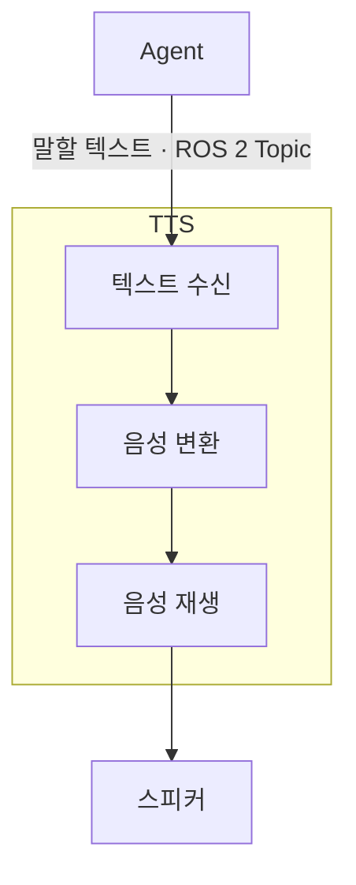

## 1. 기능

- Agent가 보낸 텍스트를 음성으로 변환한다.
- 변환한 음성을 스피커로 재생한다.

## 2. 입력

- Agent로부터 사용자에게 말할 텍스트를 전달받는다.
- `/malbut/speech/response` ROS 2 Topic을 사용한다.
- 메시지 타입은 `malbut_interfaces/msg/SpeechRequest`이다.
- 전달 데이터: `text: string` — 사용자에게 말할 텍스트.
- QoS는 `RELIABLE`, `VOLATILE`, `KEEP_LAST`, 깊이 `10`을 사용한다.

## 3. 출력

- 변환한 음성을 오디오 출력 장치를 통해 스피커로 재생한다.

## 4. 동작 규칙

### 텍스트 수신

- 비어 있거나 공백뿐인 텍스트는 처리하지 않는다.

### 음성 변환

- 전달받은 내용을 임의로 요약하거나 답변을 추가하지 않고 음성으로 변환한다.

### 음성 재생

- 한 번에 하나의 음성을 재생한다. 재생 중 새 텍스트가 들어오면 현재 재생이 끝난 뒤 수신 순서대로 처리한다.
- 음성 변환이나 재생에 실패하면 오류를 기록하며, 재생 완료로 처리하지 않는다.
