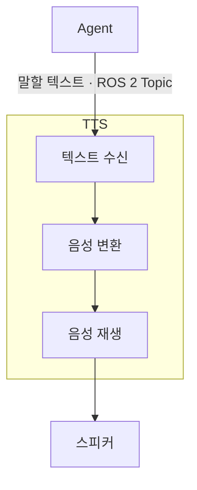

## 1. 기능

- Agent가 보낸 텍스트를 음성으로 변환한다.
- 변환한 음성을 스피커로 재생한다.
- STT의 요청에 따라 음성 재생을 일시정지/재개/중지 한다.
- 음성 재생 상태를 STT에 전달한다.
- 음성 재생 요청을 우선순위에 따라 처리하고, 같은 우선순위에서는 최신 요청만 유지한다.

## 2. 입력

- Agent로부터 사용자에게 말할 텍스트를 전달받는다.
  - `/malbut/speech/response` ROS 2 Topic을 사용한다.
  - 메시지 타입은 `malbut_interfaces/msg/SpeechRequest`이다.
  - 전달 데이터: `text: string` — 사용자에게 말할 텍스트.
  - QoS는 `RELIABLE`, `VOLATILE`, `KEEP_LAST`, 깊이 `10`을 사용한다.
  - Agent는 요청이 대화 답변인지 일반 작업 알림인지 구분하여 전달한다.
  - 요청 종류를 전달할 필드는 현재 `SpeechRequest`에 정의되어 있지 않으며, 인터페이스 보완이 필요하다.

- STT가 특정 음성의 일시정지/재개/중지를 요청한다.
  - `/malbut/speech/playback_control` ROS 2 Service를 사용한다.
  - 서비스 타입은 `malbut_interfaces/srv/ControlSpeechPlayback`이다.
  - 요청 데이터: `playback_id: string` — 제어할 음성 재생의 고유 ID, `command: string` — `pause`, `resume`, `stop` 중 하나.
  - 응답 데이터: `accepted: bool` — 요청의 접수 여부. 실제 처리 완료를 의미하지 않으며, 처리 결과는 재생 상태 알림으로 전달한다.

## 3. 출력

- 변환한 음성을 오디오 출력 장치를 통해 스피커로 재생한다.
- 음성의 재생 상태를 STT에 전달한다.
  - `/malbut/speech/playback_status` ROS 2 Topic을 사용한다.
  - 메시지 타입은 `malbut_interfaces/msg/SpeechPlaybackStatus`이다.
  - 전달 데이터: `playback_id: string` — 음성 재생의 고유 ID, `state: string` — 현재 재생 상태.
  - 재생 상태는 `playing`(재생 중), `paused`(일시정지), `finished`(정상 완료), `failed`(실패), `stopped`(중지)로 구분한다.

## 4. 동작 규칙

### 텍스트 수신

- 비어 있거나 공백뿐인 텍스트는 처리하지 않는다.

### 음성 변환

- 전달받은 내용을 임의로 요약하거나 답변을 추가하지 않고 음성으로 변환한다.

### 음성 재생

- 처리하는 음성 재생 건마다 고유한 `playback_id`를 부여하고, 해당 음성의 상태 알림과 제어에 동일한 ID를 사용한다.
- 한 번에 하나의 음성을 재생한다. 재생 중 새 텍스트가 들어오면 아래의 우선순위와 교체 규칙에 따라 처리한다.
- 실제 재생 상태가 변경되면 해당 상태를 STT에 전달한다. `finished`는 음성이 스피커를 통해 끝까지 재생된 경우에만 전달한다.
- 음성 변환이나 재생에 실패하면 오류를 기록하고 `failed` 상태를 전달하며, 정상 재생 완료로 처리하지 않는다.

### 요청의 우선순위와 교체

- 사용자 발화에 대한 대화 답변을 순찰 완료 등의 일반 작업 알림보다 우선한다.
- 같은 우선순위의 새 요청이 들어오면, 기존 요청이 대기 중이거나 재생 중이거나 일시정지 상태인지와 관계없이 기존 요청을 취소하고 새 요청으로 교체한다.
- 서로 다른 우선순위의 요청은 각각 유지하며, 우선순위별로 최신 요청을 최대 한 건씩 유지한다. 현재 재생 중이거나 일시정지된 음성과 다른 우선순위의 새 요청은 기존 음성을 교체하지 않고 대기한다.
- 다음 음성을 선택할 때는 대기 중인 요청 가운데 우선순위가 높은 요청부터 재생한다.
- 재생 중이거나 일시정지된 음성을 교체할 때는 기존 `playback_id`의 재생을 종료하고 `stopped` 상태를 전달한다. 기존 음성은 다시 재개하지 않으며, 새 요청에는 새로운 `playback_id`를 사용한다.
- 중지 요청을 받으면 지정한 playback_id의 재생을 종료하고 stopped 상태를 전달한다. 중지한 음성은 다시 재개하지 않는다.
- 다른 대기 요청은 유지한다. 대기 요청의 교체는 같은 우선순위의 새 요청이 들어왔을 때 수행한다.

### 재생 제어

- 일시정지 요청을 받으면 대상 음성의 재생을 멈추고 현재 위치를 유지하며, `paused` 상태를 전달한다. 대상 음성의 일시정지가 유지되는 동안에는 대기 중인 다른 음성을 재생하지 않는다.
- 재개 요청을 받으면 동일한 음성을 일시정지한 위치부터 이어서 재생하고, `playing` 상태를 전달한다.
- 중지 요청을 받으면 대상 음성의 재생을 종료하고 `stopped` 상태를 전달한다. 중지한 음성은 다시 재개하지 않는다.
- 각 재생 상태는 요청을 접수한 시점이 아니라 실제로 해당 상태가 된 뒤 전달한다.
- 대상 음성이 없거나 현재 상태에서 수행할 수 없는 제어 요청은 `accepted=false`로 응답하며, 요청에 따른 재생 상태 변경은 수행하지 않는다.
